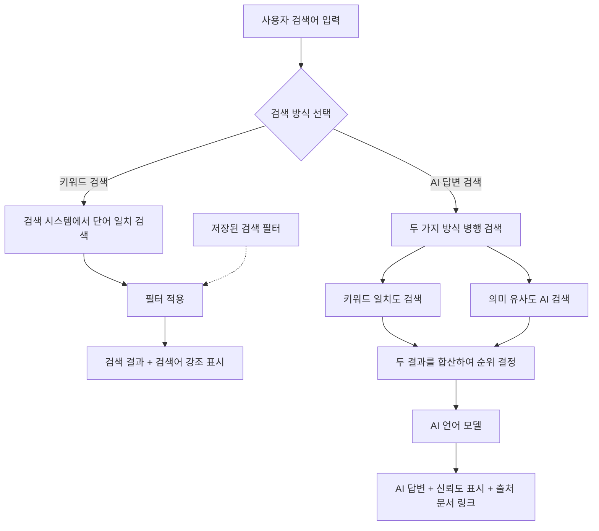

# 검색 유즈케이스

**관련 기능정의서**: [FD-SCH-검색](../../features/FD-SCH-검색.md)

**비즈니스 목표**: 상담사의 평균 정보 탐색 시간을 단축하고 검색 실패율을 줄여, 정확하고 일관된 고객 응대를 지원한다. AI 답변 검색은 키워드를 정확히 몰라도 자연어 질문으로 필요한 정보를 빠르게 찾을 수 있게 하여, 상담 품질과 생산성을 동시에 높이는 것이 목표이다.

## 개요 다이어그램

> 아래 다이어그램은 두 가지 검색 방식(키워드 검색, AI 답변 검색)의 처리 과정을 보여줍니다.

> **두 가지 검색 방식의 차이:**
> - **키워드 검색**: 사용자가 입력한 단어가 문서에 포함되어 있는지를 찾는 전통적인 검색 방식
> - **AI 답변 검색**: 사용자의 질문을 이해하고, 관련 문서들을 참고하여 AI가 직접 답변을 생성해주는 방식. 정확한 단어가 일치하지 않아도, 의미가 비슷한 내용을 찾을 수 있음

---

## UC-SCH-01: 키워드 검색

**사용자**: 상담사, 지식 관리자, 승인권자

> 승인권자는 승인 검토를 위해 관련 문서를 검색하는 경우가 있어 의도적으로 포함한다.

**사전 조건**:
- 사용자가 로그인되어 있어야 한다.
- 사용자가 열람 권한을 가진 게시판이 1개 이상 있어야 한다.

**기본 흐름**:
1. 사용자가 검색창에 키워드를 입력한다.
2. 입력하는 도중 실시간으로 검색어 추천(자동완성)과 비슷한 단어 제안(오타 교정)이 표시된다.
3. 사용자가 검색을 실행한다.
4. 시스템이 한국어 단어 분석을 적용하여 검색한다 — [FD-SCH](../../features/FD-SCH-검색.md) §1.
   - 예를 들어 "상담"을 검색하면 "상담사", "상담원", "상담 업무" 등 관련 단어가 포함된 문서도 함께 찾아준다.
5. 검색 결과가 관련도순으로 표시되며, 검색어와 일치하는 부분이 강조 표시된다.
6. 사용자가 열람 권한이 있는 게시판의 문서만 결과에 포함된다 — 권한이 없는 게시판의 문서는 표시되지 않는다.
7. 사용자가 필터(게시판, 기간, 작성자, 태그, 문서 양식)를 조합하여 결과를 좁힐 수 있다.

**대안 흐름**:
- **3a. 검색 결과 없음**: 검색 결과가 없으면 "검색 결과가 없습니다" 안내와 함께 검색어 수정 제안이나 오타 교정 제안이 표시된다.
- **3b. 검색 결과 과다**: 검색 결과가 매우 많은 경우(관리자가 설정한 기준 초과) 결과는 페이지 단위로 나뉘어 표시된다. 상단에 "결과가 많습니다. 필터를 사용하면 원하는 문서를 빠르게 찾을 수 있습니다" 안내가 표시되며, 권장 필터(게시판, 기간 등)를 제안한다.
- **2a. 오타 교정 제안 무시**: 시스템이 오타 교정을 제안했을 때, 사용자가 제안을 무시하고 원래 입력한 검색어 그대로 검색할 수 있다. "원래 검색어 '{입력값}' 그대로 검색" 링크가 검색 결과 상단에 제공된다. 교정 제안이 틀린 경우(전문 용어, 약어 등) 사용자는 원래 검색어로 정확한 결과를 받을 수 있다.
- **7a. 필터 조합 무결과**: 필터를 조합한 결과가 0건이면 "선택한 필터 조건에 맞는 문서가 없습니다" 안내와 함께, 어떤 필터를 해제하면 결과가 나올 수 있는지 제안한다. (예: "'기간' 필터를 해제하면 N건의 결과가 있습니다")
- **검색 필터 저장**: 자주 사용하는 필터 조합을 저장해두고 다음에 바로 재사용할 수 있다 (UC-SCH-03).
- **북마크 내 검색**: "내 북마크에서만 검색" 필터를 적용할 수 있다.
- **정렬 변경**: 기본 관련도순 외에 최신순, 인기순으로 정렬을 변경할 수 있다.
- **AI 검색 반영 대기 중 문서**: 아직 AI 검색에 반영되지 않은 문서도 키워드 검색에는 노출되며, "AI 검색 반영 대기 중" 표시가 붙는다.
- **AI 검색 반영 실패 문서**: AI 검색 반영에 실패한 문서도 키워드 검색에는 노출되며, "AI 검색 미반영" 표시가 붙어 AI 답변 검색에는 포함되지 않음을 알려준다.
- **접근 제한 문서**: 접근 제한이 설정된 문서는 허용 목록에 포함되지 않은 사용자의 검색 결과에서 완전히 제외된다. 문서의 존재 자체도 노출되지 않는다.
- **최근 검색어 이력**: 검색창 포커스 시 최근 검색어 목록이 표시되어 빠르게 재검색할 수 있다. 검색 이력은 마이페이지에서도 조회 가능하다.
- **최근 게시 문서 미표시**: 방금 게시된 문서는 검색 시스템에 반영되기까지 잠시 시간이 소요될 수 있으며, 이 경우 "최근 게시된 문서는 검색에 반영되기까지 잠시 시간이 걸릴 수 있습니다" 안내 메시지가 표시된다.
- **관리자 바이패스 검색**: 운영 관리자가 열람 권한 없이 관리 목적으로 접근하는 게시판의 문서는 검색 결과에 제목, 태그 등 메타정보만 표시되며, 본문 미리보기와 검색어 강조는 제공되지 않는다 — [FD-SCH](../../features/FD-SCH-검색.md) §1.
- **검색 시스템 장애**: 검색 시스템에 연결할 수 없는 경우 "검색 서비스에 일시적인 문제가 발생했습니다. 잠시 후 다시 시도해 주세요" 안내가 표시된다. 동시에 최근 인기 문서 목록, 자주 검색된 키워드 등 캐시된 정보를 임시로 표시하여 사용자가 주요 문서에 접근할 수 있도록 지원한다.
- **검색 중 문서 비공개/삭제 전환**: 검색 결과를 보는 도중 특정 문서가 삭제되거나 비공개(긴급 회수 등)로 전환되면, 해당 문서를 클릭했을 때 "이 문서는 현재 열람할 수 없습니다" 안내가 표시되며 검색 결과 목록으로 돌아간다. 검색 결과를 새로고침하면 해당 문서가 목록에서 제외된다.
- **다국어 문서 검색**: 사용자가 입력한 언어를 기준으로 해당 언어의 문서를 우선 검색한다. 관리자가 다국어 검색 옵션을 활성화한 경우 다른 언어의 문서도 결과에 포함되며, 언어별로 구분 표시된다. *(현재 한국어 전용 — FD-SCH 결정사항, 다국어 검색은 향후 확장 Phase에서 검토)*
- **상담사 통화 중 빠른 검색**: 상담사가 고객 통화 중 검색하는 경우 빠른 응답이 중요하다. 검색 결과 상위 항목이 우선 표시되고 나머지 결과는 순차적으로 로딩된다. 결과 미리보기에서 핵심 내용을 바로 확인할 수 있어, 문서를 열지 않고도 고객 질문에 대응할 수 있다.
- **검색 결과에서 바로 답변 전달**: 사용자가 검색 결과의 미리보기 또는 문서 본문에서 특정 내용을 선택하면, "답변 복사" 버튼을 통해 상담 시스템에서 바로 활용할 수 있는 형식으로 클립보드에 복사된다.

**사후 조건**:
- 검색어가 검색 트렌드 집계에 반영된다 (관리자 통계 대시보드에서 조회 가능).
- 검색어가 사용자의 검색 이력에 자동 저장된다.
- 검색 무결과 시에도 해당 검색어가 트렌드에 반영되어, 문서가 부족한 영역을 감지하는 데 활용된다.
- 검색 응답 시간이 성능 모니터링 지표에 기록되어 서비스 품질 관리에 활용된다.
- 특정 검색어의 무결과 빈도가 설정된 임계치를 초과하면, 관리자에게 "문서 보강 필요" 알림이 발송된다.

---

## UC-SCH-02: AI 답변 검색

**사용자**: 상담사, 지식 관리자, 승인권자

> 승인권자는 승인 검토 시 관련 규정을 AI로 빠르게 확인하기 위해 포함한다.

**사전 조건**:
- 사용자가 로그인되어 있어야 한다.
- AI 답변 검색 기능이 시스템에서 활성화되어 있어야 한다.
- 사용자가 열람 권한을 가진 게시판이 1개 이상 있어야 한다.

> **AI 답변 검색이란?** 사용자가 자연스러운 문장으로 질문하면, AI가 시스템 내 문서들을 참고하여 답변을 생성해주는 기능입니다. 예를 들어 "해지 수수료는 어떻게 되나요?"라고 물으면, 관련 문서를 자동으로 찾아서 답변을 만들어 줍니다.

**기본 흐름**:
1. 사용자가 AI 답변 검색 모드에서 자연어(일상적인 말)로 질문을 입력한다.
2. 시스템이 두 가지 방식을 병행하여 관련 문서 조각을 찾는다 — [FD-SCH](../../features/FD-SCH-검색.md) §2:
   - **키워드 일치도 검색**: 질문에 포함된 단어와 일치하는 문서를 찾는다.
   - **의미 유사도 검색**: 단어가 정확히 일치하지 않더라도 뜻이 비슷한 내용을 찾는다. (예: "해약"이라고 물어도 "해지" 관련 문서를 찾아줌)
3. 가장 관련성이 높은 문서 조각들을 AI에게 전달하여 답변을 생성한다.
4. 답변이 실시간으로 글자 단위로 표시되며, 각 문장에 해당하는 출처 문서 링크(인용 표시)가 함께 나타난다.
5. 답변 상단에 "AI가 생성한 답변입니다. 원문을 확인해 주세요" 안내가 상시 표시되며, 각 문장에 신뢰도 표시가 부착된다. 출처가 불충분한 문장은 시각적으로 구분되어 별도 경고가 표시된다 — [FD-SCH](../../features/FD-SCH-검색.md) §2.
6. 사용자가 출처 문서 링크를 클릭하면 원본 문서를 확인할 수 있다.
7. 사용자가 AI 답변 전체 또는 일부를 복사하여 상담에 활용할 수 있다.
8. 사용자가 답변에 대해 "좋아요/싫어요" 피드백을 남길 수 있다.

**대안 흐름**:
- **검색 범위 한정**: 특정 게시판(하위 게시판 포함), 태그, 문서 양식으로 검색 범위를 제한할 수 있다.
- **답변 스타일 선택**: 간결한 답변과 상세한 답변 모드를 전환할 수 있다.
- **관련 문서가 없는 경우**: AI가 참고할 문서를 찾지 못하면 "관련 문서를 찾을 수 없습니다. 다른 표현으로 질문해 보세요" 안내가 표시된다.
- **AI 서비스 응답 지연**: AI 답변 생성이 일정 시간 이상 걸리면 "답변을 생성하고 있습니다. 잠시만 기다려 주세요" 안내가 표시된다.
- **AI 서비스 타임아웃**: AI 답변 생성이 제한 시간을 초과하면 "답변 생성에 시간이 너무 오래 걸리고 있습니다. 질문을 짧게 바꾸거나 키워드 검색을 이용해 주세요" 안내가 표시된다.
- **AI 서비스 장애 시 폴백**: AI 서비스에 연결할 수 없는 경우 "AI 답변을 생성할 수 없습니다. 키워드 검색을 이용해 주세요" 안내와 함께 키워드 검색 모드로 자동 전환을 제안한다. 키워드 검색으로 전환하면 동일 질문의 핵심 키워드를 자동 추출하여 검색창에 미리 채워준다.
- **권한에 따른 결과 제한**: 사용자가 접근 권한이 없는 게시판의 문서는 AI 답변 결과에서도 제외된다. AI가 해당 문서를 참고하지 않는다.
- **접근 제한 문서**: 접근 제한이 설정된 문서는 허용 목록에 포함되지 않은 사용자의 AI 답변에서 제외된다. AI가 해당 문서를 참고하지 않으므로 문서의 존재 여부도 노출되지 않는다.
- **AI 답변이 부정확한 경우**: AI 답변이 부정확하다고 판단되면, 출처 문서 링크를 통해 원본 문서로 이동한 뒤 문서 신고(UC-COM-03)를 활용하여 관리자에게 보고할 수 있다.
- **검색 이력**: 검색 질의가 사용자의 검색 이력에 자동 저장되며, 마이페이지에서 조회 가능하다.
- **Phase 2 예정 — 대화 세션 내 후속 질문 지원**: 이전 대화 맥락을 유지하며 추가 질문을 이어가는 기능은 Phase 2에서 제공 예정이다. MVP에서는 매 질문이 독립적인 단발 질의로 처리된다.
- **5a. AI 답변의 출처 불충분(할루시네이션 의심)**: AI가 생성한 답변 중 시스템 내 문서로 뒷받침되지 않는 내용이 포함되면, 해당 문장에 "출처를 확인할 수 없는 내용입니다" 경고가 별도 색상으로 표시된다. 사용자가 해당 문장을 "부정확" 신고하면 사유 입력 화면이 나타나고, AI 품질 관리 담당자에게 알림이 발송된다. 신고가 누적되면 해당 유형의 질문에 대한 AI 답변 품질 개선에 우선 반영된다.
- **출처 문서가 삭제/비공개 전환된 경우**: AI 답변을 생성한 뒤 출처 문서가 삭제 또는 비공개(긴급 회수)로 전환된 경우, 해당 출처 링크를 클릭하면 "이 문서는 현재 열람할 수 없습니다" 안내가 표시된다. 답변 하단에 "일부 출처 문서가 변경되었습니다. 답변 내용을 재확인해 주세요" 경고가 추가된다.
- **8a. AI 답변 품질 피드백 상세**: "좋아요"를 누르면 유사 질문에 대한 답변 품질 개선에 참고 데이터로 활용된다. "싫어요"를 누르면 사유 선택(부정확, 불충분, 관련 없음, 기타) 화면이 나타나며, 선택적으로 상세 의견을 입력할 수 있다. 피드백 제출 후 "소중한 의견 감사합니다. 답변 품질 개선에 반영하겠습니다" 안내가 표시된다.
- **상담사 통화 중 AI 답변 활용**: 상담사가 고객 통화 중 AI 답변을 받으면, "상담 답변 복사" 버튼을 통해 고객 응대에 적합한 형식으로 답변을 클립보드에 복사할 수 있다. 복사된 내용에는 출처 문서 제목이 참고 정보로 함께 포함되어, 상담사가 사후 검증에 활용할 수 있다.
- **AI 모델 교체/업데이트 직후**: 관리자가 AI 모델을 교체하거나 업데이트한 직후에는 답변 하단에 "AI 모델이 최근 업데이트되었습니다" 안내가 관리자가 설정한 기간 동안 표시된다. 이 기간 동안 사용자 피드백을 집중 수집하여 품질 변화를 모니터링한다.
- **다국어 질문**: 사용자가 다국어로 질문하면 해당 언어의 문서를 우선 참고하되, 관련 문서가 부족한 경우 다른 언어의 문서도 참고하여 답변을 생성한다. 답변 내 다른 언어 출처는 별도 표시된다. *(현재 한국어 전용 — FD-SCH 결정사항, 다국어 검색은 향후 확장 Phase에서 검토)*

**사후 조건**:
- 사용자의 피드백(좋아요/싫어요)이 AI 품질 추적 시스템에 기록된다.
- 검색 질의가 검색 트렌드 집계에 반영된다.
- 검색 질의가 사용자의 검색 이력에 자동 저장된다.
- AI 답변과 참고한 출처 문서의 매핑 이력이 보관되어, 이후 출처 문서가 변경·삭제되었을 때 영향받은 답변을 추적할 수 있다.
- "싫어요" 피드백이 설정된 임계치를 초과하면 관리자에게 "AI 답변 품질 점검 필요" 알림이 발송된다.
- 검색어 트렌드 분석을 통해 관련 문서가 부족하거나 갱신이 필요한 영역이 자동 감지되어 관리자에게 "문서 보강 권장" 안내가 제공된다.

---

## UC-SCH-03: 검색 필터 저장/관리

**사용자**: 상담사, 지식 관리자

**사전 조건**:
- 사용자가 로그인되어 있어야 한다.

> **검색 필터 저장이란?** 자주 사용하는 검색 조건(특정 게시판, 기간, 태그 등)을 미리 저장해두고, 다음 검색 시 한 번의 클릭으로 적용하는 기능입니다.

**기본 흐름**:
1. 사용자가 검색 결과 화면에서 필터를 조합한다 — 게시판(하위 게시판 포함), 기간, 작성자, 태그, 문서 양식 등.
2. 조합한 필터에 이름을 붙이고 "저장" 버튼을 클릭한다. (예: "CS팀 FAQ만 보기", "이번 달 신규 문서")
3. 시스템이 "검색 필터가 저장되었습니다" 안내를 표시한다.
4. 이후 검색할 때 저장된 필터를 선택하면 조건이 자동으로 적용된다.

**대안 흐름**:
- **저장된 필터 수정**: 기존에 저장한 필터의 이름이나 조건을 변경하여 다시 저장할 수 있다.
- **저장된 필터 삭제**: 더 이상 필요 없는 필터를 삭제할 수 있다.
- **저장 상한 초과**: 사용자당 관리자가 설정한 상한(기본값: 20개)까지 검색 필터를 저장할 수 있다. 상한에 도달하면 "저장 가능한 필터 수를 초과했습니다. 기존 필터를 삭제한 후 다시 저장해 주세요" 안내가 표시된다.
- **기본 검색 선호 설정**: 마이페이지 > 개인 설정에서 기본 정렬 기준(관련도순/최신순/인기순), 기본 검색 범위(전체/특정 게시판) 등 검색 선호를 설정할 수 있다.
- **북마크 내 검색 필터**: "내 북마크에서만 검색" 필터 옵션을 저장할 수 있다.
- **4a. 저장된 필터의 대상 게시판이 삭제된 경우**: 필터에 포함된 게시판이 삭제되었을 때, 해당 필터를 적용하면 "필터에 포함된 '○○ 게시판'이 삭제되어 해당 조건이 제외됩니다" 안내가 표시되며, 나머지 조건만으로 검색이 실행된다. 사용자에게 필터 수정을 권장한다.
- **4b. 저장된 필터의 대상 태그가 삭제/병합된 경우**: 필터에 포함된 태그가 삭제되었거나 다른 태그로 병합된 경우, 해당 필터 적용 시 "필터에 포함된 '○○' 태그가 변경되었습니다" 안내와 함께 변경된 태그 정보를 표시한다. 태그가 병합된 경우 새 태그명으로 자동 전환된다.
- **필터 복제**: 기존에 저장한 필터를 복제하여 조건 일부만 변경한 새 필터를 빠르게 만들 수 있다.
- **동의어 사전 업데이트 후 반영**: 관리자가 동의어 사전을 업데이트한 경우, 저장된 필터의 조건 자체는 변경되지 않지만 해당 필터로 검색한 결과에는 새로운 동의어가 반영된다. 변경 사항은 관리자가 설정한 반영 시점(즉시 또는 정기 반영)에 따라 적용된다.

**사후 조건**:
- 저장된 필터가 사용자 개인 설정에 보관된다.
- 다음 검색 시 저장된 필터를 바로 적용할 수 있다.
- 필터 사용 빈도가 통계에 반영되어, 관리자가 사용자들의 주요 검색 패턴을 분석하는 데 활용된다.

---

## 현업 업무 시나리오

> 아래는 검색 기능이 실제 업무 현장에서 어떻게 활용되는지를 보여주는 대표 시나리오입니다. 각 유즈케이스의 흐름을 현업 맥락에서 이해하는 데 참고합니다.

### 시나리오 1: 상담사의 실시간 고객 응대 (UC-SCH-01, UC-SCH-02)

1. 상담사가 고객과 전화 통화 중 "적금 중도 해지 수수료"에 대한 질문을 받는다.
2. 상담사가 검색창에 "적금 중도 해지 수수료"를 입력하여 키워드 검색을 실행한다 (UC-SCH-01).
3. 검색 결과 미리보기에서 관련 내용을 즉시 확인하고 고객에게 1차 답변을 제공한다.
4. 고객이 추가 질문("1년 미만 해지 시 수수료가 다른가요?")을 하면, AI 답변 검색으로 전환하여 자연어로 질문한다 (UC-SCH-02).
5. AI가 생성한 답변을 확인한 뒤 출처 문서를 빠르게 검증하고, "상담 답변 복사" 기능으로 고객 응대 기록에 붙여넣는다.

> **핵심 요구**: 통화 중에는 검색부터 답변 확인까지 수 초 이내에 이루어져야 하므로, 검색 결과 우선 표시와 미리보기 기능이 특히 중요하다.

### 시나리오 2: 검색어 트렌드 기반 문서 갱신 감지 (UC-SCH-01, UC-SCH-02)

1. 특정 기간 동안 "여행자 보험 코로나 보장"이라는 검색어가 급증하지만 관련 문서가 부족하여 무결과 또는 낮은 관련도 결과만 나온다.
2. 시스템이 해당 검색어의 무결과 빈도 급증을 감지하고, 관리자에게 "문서 보강 필요: 여행자 보험 코로나 보장" 알림을 발송한다.
3. 지식 관리자가 이 알림을 확인하고 해당 주제의 문서를 신규 작성하거나 기존 문서를 갱신한다.
4. 문서 게시 후 검색 트렌드 대시보드에서 해당 검색어의 무결과율이 감소하는 것을 확인하여 조치 효과를 검증한다.

> **핵심 요구**: 검색 트렌드와 무결과 빈도를 통해 문서 갱신이 필요한 영역을 선제적으로 파악하고, 조치 후 효과를 확인할 수 있어야 한다.

### 시나리오 3: 검색 결과에서 바로 고객 답변 전달 (UC-SCH-01)

1. 상담사가 채팅 상담 중 고객의 질문에 대한 답변을 검색한다.
2. 검색 결과에서 정확한 문서를 찾으면, 해당 내용을 선택하고 "답변 복사" 버튼을 클릭한다.
3. 복사된 내용을 채팅 창에 붙여넣어 고객에게 바로 전달한다.
4. 전달된 답변에는 출처 문서 정보가 상담 기록으로 함께 남아, 사후 감사 시 답변 근거를 추적할 수 있다.

> **핵심 요구**: 검색 → 복사 → 전달의 과정이 최소 클릭으로 이루어져야 하며, 답변의 출처가 자동으로 기록되어야 한다.

### 시나리오 4: 교대 근무 인수인계 시 검색 활용 (UC-SCH-01, UC-SCH-03)

1. 야간 교대 상담사가 근무 시작 후 전날 변경된 문서나 신규 공지를 빠르게 파악해야 한다.
2. 저장된 검색 필터(UC-SCH-03)에서 "최근 24시간 게시/수정 문서"를 적용하여 변경된 문서 목록을 확인한다.
3. 인수인계 전용 게시판의 최근 글을 검색하여 교대 사항을 확인한다.
4. 교대 전 근무자가 북마크한 문서 중 업데이트된 문서를 "북마크 내 검색"으로 빠르게 확인한다.

> **핵심 요구**: 교대 시작 5분 이내에 변경 사항을 파악할 수 있어야 하며, 저장된 필터를 활용하여 반복적인 검색 조건 설정을 최소화한다.

### 시나리오 5: 신규 입사자 온보딩 시 검색 활용 (UC-SCH-01, UC-SCH-02, UC-SCH-03)

1. 신규 입사자가 업무에 필요한 문서를 찾을 때, 정확한 문서 제목이나 키워드를 모르는 경우가 많다.
2. AI 답변 검색(UC-SCH-02)으로 자연어 질문("신규 가입 절차가 어떻게 되나요?")을 입력하면 관련 문서를 바로 찾을 수 있다.
3. 검색 결과에서 유용한 문서를 업무별 북마크 폴더에 저장하여 향후 빠르게 재접근한다 (UC-COM-04).
4. 자주 사용하는 검색 조건(소속 부서 게시판, 업무 관련 태그)을 필터로 저장한다 (UC-SCH-03).
5. 관리자가 신규 입사자용 추천 검색 필터 목록을 사전에 설정하여 안내할 수 있다.

> **핵심 요구**: 정확한 키워드를 몰라도 AI 답변 검색으로 필요한 정보에 접근할 수 있어야 한다.

### 시나리오 6: 규제 대응 — 감사 대비 검색 이력 추출 (UC-SCH-01, UC-SCH-02)

1. 컴플라이언스 담당자가 감사 대비를 위해 특정 기간·특정 문서에 대한 검색 이력을 추출해야 한다.
2. 관리자 대시보드에서 검색 이력(검색어, 검색 시각, 검색자, 검색 방식, 클릭한 문서)을 기간·사용자·게시판별로 필터링하여 조회한다.
3. AI 답변 검색의 경우, 질문 내용과 AI가 참고한 출처 문서 매핑 이력도 함께 추출할 수 있다.
4. 조회 결과를 CSV/PDF로 내보내기하여 감사 증빙 자료로 활용한다.
5. 특정 문서가 검색을 통해 얼마나 활용되었는지(검색 노출 횟수, 클릭률)를 추적하여 문서 활용도를 평가한다.

> **핵심 요구**: 검색 이력이 최소 5년간 보관되어야 하며, 감사 시 특정 문서의 검색·열람 경로를 추적할 수 있어야 한다.

---

## 운영 참고 시나리오

> 아래는 시스템 운영 관점에서 관리자가 알아야 할 검색 관련 운영 시나리오입니다.

### 운영 1: 검색 시스템 장애 시 캐시 기반 임시 서비스

- 검색 시스템에 장애가 발생하면, 최근 인기 검색어·인기 문서 목록 등 캐시된 정보를 기반으로 임시 서비스를 제공한다.
- 사용자에게 "검색 서비스가 임시 모드로 동작 중입니다. 일부 검색 기능이 제한될 수 있습니다" 안내가 표시된다.
- 관리자에게는 장애 발생 즉시 알림(이메일, 메신저 등 설정된 채널)이 발송되며, 장애 상세(발생 시각, 영향 범위)가 관리자 대시보드에 표시된다.
- 장애 복구 후 시스템이 자동으로 정상 모드로 전환되며, 관리자에게 복구 완료 알림이 발송된다.

### 운영 2: AI 모델 교체/업데이트 시 검색 품질 모니터링

- 관리자가 AI 모델을 교체하거나 업데이트하면, 설정된 모니터링 기간 동안 사용자 피드백(좋아요/싫어요) 변화 추이를 집중 수집한다.
- 이전 모델 대비 피드백 만족도 변화, 응답 시간 변화 등을 관리자 대시보드에서 비교 확인할 수 있다.
- 부정적 피드백 비율이 설정된 임계치를 초과하면 관리자에게 "AI 답변 품질 저하 의심" 알림이 발송되어 신속한 대응(모델 롤백, 설정 조정 등)이 가능하다.

### 운영 3: 동의어 사전 업데이트 반영 시점

- 관리자가 동의어 사전을 업데이트하면, 시스템 설정에 따라 **즉시 반영** 또는 **정기 반영(배치)** 방식으로 검색에 적용된다.
- 즉시 반영: "동의어 사전이 업데이트되었습니다. 검색에 즉시 반영됩니다" 안내가 관리자에게 표시된다.
- 정기 반영(배치): "동의어 사전이 업데이트되었습니다. 다음 반영 시점(○○시)에 검색에 적용됩니다" 안내가 관리자에게 표시된다.
- 관리자는 반영 후 테스트 검색을 실행하여 동의어가 정상적으로 적용되는지 확인할 수 있다.
- 동의어 업데이트로 인해 기존 검색 결과가 예상과 다르게 변경되는 경우, 관리자가 이전 사전으로 되돌릴 수 있다.

### 운영 4: 검색 핵심 KPI 및 임계치

운영 관리자가 관리자 대시보드에서 모니터링하는 검색 관련 핵심 지표:

| KPI | 설명 | 임계치 예시 |
|-----|------|------------|
| 검색 응답 시간 (p95) | 검색 요청~결과 표시까지의 95번째 백분위 응답 시간 | 키워드: 1초, AI: 5초 초과 시 경고 |
| 검색 무결과율 | 전체 검색 중 결과가 0건인 비율 | 20% 초과 시 문서 보강 알림 |
| AI 답변 긍정 피드백 비율 | AI 답변에 대한 좋아요 비율 | 60% 미만 시 품질 점검 알림 |
| 검색 반영 대기 문서 수 | 검색에 아직 반영되지 않은 게시 문서 수 | 50건 초과 시 경고 |
| 검색 반영 실패 문서 수 | 검색 반영에 실패한 문서 수 | 10건 초과 시 경고 |
| 검색 서비스 가용률 | 검색 서비스의 정상 동작 비율 | 99.5% 미만 시 경고 |
| 일일 검색 건수 | 전체 검색 요청 수 (키워드/AI 별도 집계) | — |
| 오타 교정 활용률 | 오타 교정 제안을 수용한 비율 | — |

임계치를 초과하면 운영 관리자에게 설정된 채널(이메일, 메신저 등)로 알림이 발송된다.

### 운영 5: 검색 시스템 긴급 조치 도구

운영 관리자가 검색 관련 장애·긴급 상황에서 사용할 수 있는 관리 도구:

| 도구 | 설명 | 사용 시나리오 |
|------|------|-------------|
| 검색 인덱스 재구축 | 키워드 검색 인덱스를 전체 또는 부분 재구축 | 인덱스 손상·불일치 발생 시 |
| AI 검색 데이터 일괄 재변환 | 실패한 문서의 AI 검색 데이터를 일괄 재생성 | AI 검색 반영 장애 복구 후 |
| 검색 캐시 초기화 | 검색 결과 캐시를 초기화 | 캐시된 검색 결과 오류 시 |
| 동의어 사전 롤백 | 동의어 사전을 이전 버전으로 되돌림 | 사전 업데이트 후 검색 결과 이상 시 |
| 검색 서비스 강제 재시작 | 검색 서비스 프로세스를 재시작 | 검색 서비스 응답 없음 시 |
| AI 서비스 연결 상태 확인 | AI 서비스와의 연결 상태를 진단 | AI 답변 검색 장애 시 |

### 운영 6: 검색 장애 에스컬레이션 흐름

1. **자동 감지**: 시스템이 검색 응답시간 증가·오류율 급증을 감지한다.
2. **1차 알림**: 운영 관리자에게 장애 알림이 발송된다 (발생 시각, 영향 범위, 검색 유형).
3. **1차 조치**: 운영 관리자가 캐시 초기화, 서비스 재시작 등 긴급 조치를 수행한다.
4. **캐시 기반 임시 서비스**: 키워드 검색 장애 시 최근 인기 문서·인기 검색어 등 캐시 정보를 기반으로 임시 서비스를 제공한다.
5. **2차 에스컬레이션**: 설정된 시간(예: 10분) 내 해소되지 않으면 시스템 관리자에게 인프라 점검을 요청한다.
6. **3차 에스컬레이션**: 설정된 시간(예: 30분) 내 해소되지 않으면 경영진에게 보고한다.
7. 장애 해소 후 관리자가 장애 보고서를 작성한다.

### 운영 7: 유지보수 모드 — 정기 점검 시 검색 기능 제한

1. 점검 시작 전, 관리자가 사용자에게 점검 일정을 사전 공지한다.
2. 점검 중 검색 서비스가 제한된다:
   - 키워드 검색: 기존 인덱스 기반으로 읽기 전용 제공 (점검 중 게시된 문서는 미반영).
   - AI 답변 검색: 비활성화 (AI 서비스 접근 불가).
3. 사용자에게 "시스템 점검 중입니다. 검색 기능이 제한적으로 동작합니다" 배너가 표시된다.
4. 점검 완료 후, 시스템이 점검 중 게시된 문서의 검색 반영을 일괄 처리한다.

### 운영 8: 장애 복구 후 검색 데이터 정합성 검증

1. 운영 관리자가 관리 화면에서 "검색 정합성 검증" 기능을 실행한다.
2. 시스템이 다음 항목을 자동 검증한다:
   - 게시 문서 수와 검색 인덱스 문서 수의 일치 여부.
   - 회수/삭제된 문서가 검색 결과에서 정상 제외되었는지.
   - AI 검색 데이터(벡터) 생성 상태와 문서 게시 상태의 일치 여부.
   - 동의어 사전 적용 상태가 최신인지.
3. 불일치가 발견되면 관리자에게 보고하고, 인덱스 재구축 또는 재변환 대상 목록을 제공한다.
4. 검증 이력이 감사 로그에 기록된다.

### 운영 9: 관리자 조치 이력 관리

운영 관리자가 수행한 모든 검색 관련 조치(인덱스 재구축, 캐시 초기화, 동의어 사전 변경, AI 모델 교체 등)는 감사 로그에 자동 기록된다:

- **기록 항목**: 조치 유형, 조치자, 대상 범위, 조치 시각, 조치 사유, 조치 결과.
- **조회**: 운영 관리자가 관리자 대시보드에서 기간·조치 유형별로 이력을 필터링하여 조회할 수 있다.
- **내보내기**: 조치 이력을 CSV/PDF로 내보내기하여 감사 증빙이나 사후 분석에 활용한다.
- **보관 기간**: 검색 관련 조치 이력은 관리자가 설정한 기간(최소 5년) 동안 보관된다.

---

## 관련 문서

| 문서 | 관련 UC |
|--------|---------|
| [FD-SCH-검색](../../features/FD-SCH-검색.md) | UC-SCH-01~03 전체 — 검색 비즈니스 규칙·기술 상세 |
| [검색/RAG 파이프라인 흐름도](../../flows/search-rag/) | UC-SCH-01(키워드 검색), UC-SCH-02(RAG 검색) 전체 파이프라인 |
| [검색 튜닝 전략](../../flows/search-rag/04-search-tuning.md) | UC-SCH-03(검색 필터), 사용자 선호 설정 |
