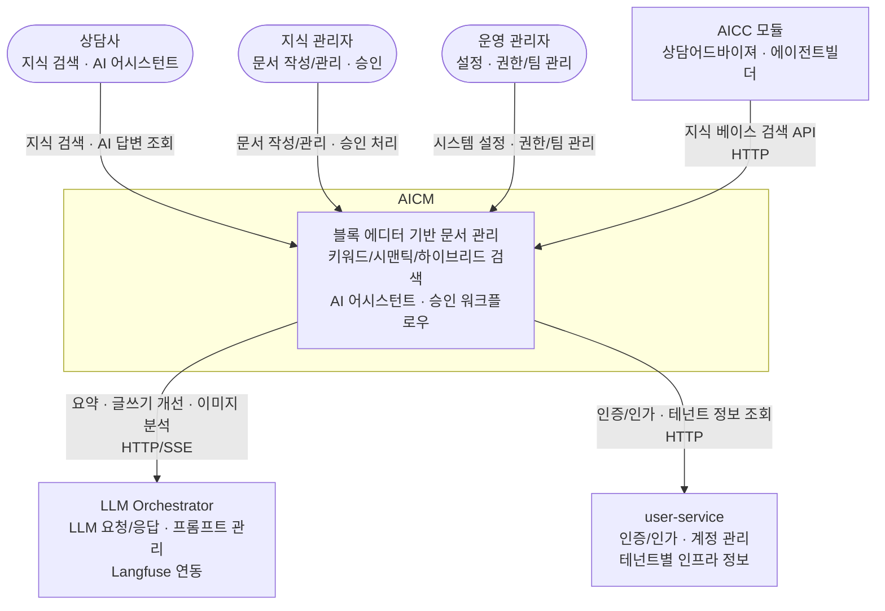
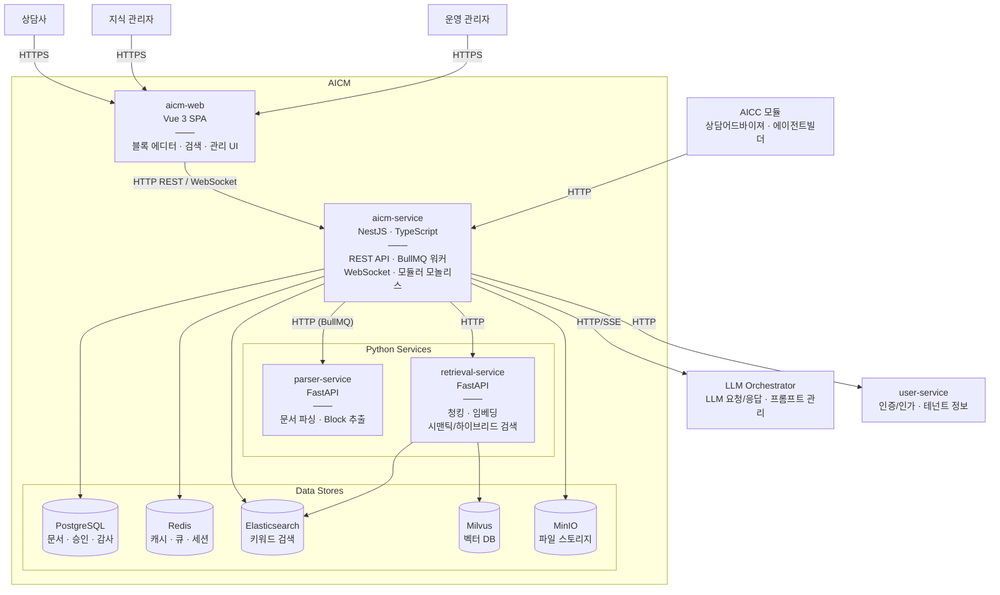

> **문서 상태**
> | 항목 | 값 |
> |------|-----|
> | 상태 | `complete` |
> | 검수 | `unreviewed` |
> | 작성일 | 2026-03-16 |
> | 최종 수정 | 2026-03-31 |

# 시스템 개요

> 설계 원칙, 기술 결정, 시스템 토폴로지, 배포 환경

### 1.1 프로젝트 목적

AICM은 AI 기반 지식 관리 시스템(KMS)으로, AICC 통합 패키지의 핵심 모듈이자 독립 운영 가능한 솔루션이다. 본 설계서는 기존 FastAPI 멀티 서비스 구조를 NestJS 기반으로 재설계하는 아키텍처를 정의한다.

| 구분 | 내용 |
|------|------|
| 비즈니스 모델 | B2B — 기업 고객 납품/구독 |
| 대상 산업 | 산업 비한정 (금융, 공공, 제조, 유통, IT) |
| 배포 형태 | SaaS(멀티테넌트) + 온프레미스(폐쇄망) — 단일 코드베이스 |
| 주요 사용자 | 상담사, 지식 관리자, 운영 관리자 |

### 1.2 핵심 설계 원칙

**SP-1. 단일 코드베이스, 이중 배포**

SaaS와 온프레미스를 단일 코드베이스로 지원한다. 배포 환경에 따라 구현 로직 자체가 달라지는 관심사(인증, 조직도 조회)는 Provider 패턴으로 추상화하여 런타임에 구현체를 주입한다. 그 외 환경별 차이(외부 서비스 URL, LLM 프로바이더 등)는 환경 변수 분기로 처리한다. Provider 패턴 적용 범위 상세는 [모듈 아키텍처 §3.4](./02-module-architecture.md)를 참조한다.

**SP-2. 모듈러 모놀리스**

NestJS 단일 애플리케이션 내에서 도메인 모듈 경계를 엄격히 분리한다. 모듈 간 직접 의존 대신 이벤트와 인터페이스로 소통하여, 추후 마이크로서비스 분리가 필요해질 때 최소한의 변경으로 대응한다.

**SP-3. Published 시점 임베딩**

검증되지 않은 문서(draft, pending_review)는 벡터 DB에 진입하지 않는다. 임베딩은 `published` 전환 시점에만 수행하며, 상태 변경은 메타데이터 필터로 즉시 반영한다.

**SP-4. 감사 추적 최우선**

금융권 컴플라이언스를 충족하기 위해, 모든 변경 행위는 불변(immutable) 감사 로그로 기록한다. 행동을 제한하는 것이 아니라 기록을 남기는 것으로 규제를 충족한다.

**SP-5. LLM Orchestrator 위임**

AI 관련 로직은 LLM Orchestrator 서비스에 위임한다. AICM은 LLM Orchestrator에 요청을 보내고 응답을 받는 클라이언트 역할만 수행한다. 호출 시 **모델과 프로바이더를 지정**하며, 사용 가능한 프로바이더는 배포 환경에 따라 결정된다.

| 배포 환경 | 사용 가능 프로바이더 | 임베딩 모델 | Langfuse |
|-----------|-------------------|------------|----------|
| SaaS | 외부 API(Claude, GPT, Gemini 등) + sLLM | 외부 API 또는 로컬 | 클라우드 또는 셀프호스팅 |
| 온프레미스(폐쇄망) | sLLM 전용 (외부 API 접근 불가) | 로컬 서빙 (Sentence Transformers 등) | 셀프호스팅 전용 |

### 1.3 기술 결정 요약

기능정의서의 결정 사항 중 아키텍처에 직접 영향을 주는 항목만 추출한다.

| 영역 | 결정 | 아키텍처 영향 |
|------|------|--------------|
| 문서 상태 모델 | 5단계 라이프사이클(`draft` → `pending_review` → `approved_scheduled` → `published`, `archived`) + `is_suspended` 플래그(검색 일시 정지). `archived`를 status에 통합하여 상태 상호 배타적 보장, `approved_scheduled`로 예약 배포 대기 표현 | Document 엔티티 설계, 검색 필터 조건 |
| 임베딩 시점 | published 시점에만 | Bull 큐 이벤트 설계, 벡터 DB 쓰기 시점 |
| 에디터 저장 | 노션 스타일 자동 저장 | REST API + Debounce — 변경된 블록만 개별 PATCH |
| 동시 편집 방지 | 비관적 락킹 | WebSocket 기반 — 접속=락 획득, 연결 해제=락 반납. 편집 중 알림 push |
| 문서 저장 포맷 | Tiptap JSON 네이티브 — Block 단위 저장 | Block.content(JSONB)가 콘텐츠 원천. Document는 메타데이터만 보유 |
| 임베딩 큐 | BullMQ (Redis) | 비동기 처리 인프라 |
| 승인 프로세스 | 초기 단일 승인 (OR) | Approval 엔티티, 이벤트 기반 상태 전이 |
| 인증 분기 | SaaS(ECP) vs 온프렘(자체) | AuthProvider 추상화 |
| AI 관리 | LLM Orchestrator 위임 | HTTP 클라이언트 모듈 |
| LLM 프로바이더 | 배포 환경별 분기 — SaaS(멀티 프로바이더), 온프레미스(sLLM 전용). 호출 시 모델+프로바이더 지정 | LlmCompleteRequest에 provider 필드, 환경·SystemConfig(`lm:ai.*`)에 따른 허용 프로바이더 제약 |
| 감사 로그 | 불변, append-only | AuditLog Interceptor, 별도 테이블 |

### 1.4 레거시 대비 변경점

| 항목 | 기존 (FastAPI) | 신규 (NestJS) |
|------|---------------|---------------|
| 서비스 구조 | aicm_service + search_engine_service + chunk_service (3개 분리) | aicm-service(NestJS 모듈러 모놀리스) + parser-service(FastAPI, 문서 파싱) + retrieval-service(FastAPI, 청킹/임베딩/시맨틱 검색) |
| 비동기 처리 | Celery + Redis | BullMQ + Redis |
| ORM | SQLAlchemy | TypeORM |
| API 프레임워크 | FastAPI (Python) | NestJS (TypeScript) |
| 검색 | Elasticsearch 직접 호출 | 키워드 검색은 aicm-service의 SearchRepository(ElasticsearchSearchAdapter)를 통해 `aicm_blocks` 인덱스에 접근, 시맨틱/하이브리드 검색은 retrieval-service에 위임 |
| 문서 저장 | HTML 기반 섹션 | Tiptap JSON — Block 단위 저장 (Document는 메타데이터만) |
| 승인 워크플로우 | staging/approved 플래그 | 3단계 라이프사이클 + 독립 운영 플래그 |

### 1.5 기술 스택 선정 근거

#### 개발 프레임워크

| 기술 | 적용 대상 | 선정 근거 |
|------|----------|----------|
| **NestJS (TypeScript)** | aicm-service | AICC 프로젝트 전체가 NestJS 기반 서비스로 구성되어 있어 기술 스택을 통일한다. aicm-service는 비즈니스 로직 비중이 높고 Python 진영 라이브러리에 대한 의존이 없으므로 FastAPI를 유지할 이유가 없다. NestJS의 모듈 시스템, DI 컨테이너, 데코레이터 기반 구조가 모듈러 모놀리스 설계와 잘 맞는다 |
| **FastAPI (Python)** | parser-service, retrieval-service | 문서 파싱(python-pptx, python-docx, pdfplumber 등)과 AI/임베딩(langchain, sentence-transformers 등) 영역은 Python 생태계의 라이브러리가 압도적이다. 이 두 서비스는 비즈니스 로직보다 라이브러리 호출 비중이 높아 Python이 합리적이다 |
| **Vue 3** | aicm-web | AICC 프로젝트 전체의 프론트엔드 표준 프레임워크. 기존 팀 역량과 코드 자산을 활용한다 |

#### 데이터베이스 / 스토리지

| 기술 | 역할 | 선정 근거 |
|------|------|----------|
| **PostgreSQL** | 주 RDBMS | AICC 프로젝트 전체의 표준 RDBMS. JSONB 네이티브 지원(Block 콘텐츠 저장), 트랜잭션 격리 수준, Row-Level Security 등 엔터프라이즈 요구사항에 적합하다 |
| **TypeORM** | ORM | AICC 프로젝트 전체의 표준 ORM. NestJS 공식 통합(@nestjs/typeorm), 데코레이터 기반 엔티티 정의가 NestJS 패턴과 일관된다 |
| **Redis** | 캐시, 세션, BullMQ 백엔드 | BullMQ의 필수 백엔드이자 캐시/세션 스토어. 단일 인스턴스로 여러 역할을 수행하여 인프라 복잡도를 낮춘다 |
| **Elasticsearch + nori** | 키워드 검색 | 한국어 형태소 분석기 nori를 공식 플러그인으로 제공하는 검색 엔진. 한국어 복합어 분리, 유의어/불용어 사전 커스터마이징이 가능하고, 대규모 문서 인덱싱과 역인덱스 기반 BM25 스코어링에 검증된 솔루션이다 |
| **Milvus** | 벡터 DB | 대규모 벡터 검색에 특화된 전용 DB. 컬렉션 단위 테넌트 격리, 메타데이터 필터링, 인덱스 타입 선택(IVF_FLAT, HNSW 등)을 지원한다. pgvector 대비 검색 성능과 확장성에서 유리하고, 온프레미스 자체 호스팅이 가능하다 |
| **MinIO** | 파일 스토리지 | S3 호환 API를 제공하는 오브젝트 스토리지. SaaS 환경에서는 S3로 교체 가능하고, 온프레미스 폐쇄망에서는 자체 호스팅으로 운영할 수 있어 이중 배포(SP-1) 원칙에 부합한다 |

#### 비동기 처리

| 기술 | 역할 | 선정 근거 |
|------|------|----------|
| **BullMQ** | Job Queue | AICM의 비동기 작업(임베딩 요청, ES 인덱싱, 알림 발송 등)은 "큐에 넣고 워커가 처리"하는 Job Queue 패턴이다. BullMQ는 재시도, 지수 백오프, 딜레이, 우선순위, 동시성 제어가 기본 내장이고 @nestjs/bullmq로 NestJS와 긴밀히 통합된다. Kafka(대용량 이벤트 스트리밍)나 RabbitMQ(서비스 간 메시지 라우팅)는 단일 서비스 내부의 Job 처리에는 오버엔지니어링이다 |

#### 통신 프로토콜

| 프로토콜 | 용도 | 선정 근거 |
|---------|------|----------|
| **HTTP REST** | 서비스 간 API 호출, 클라이언트 API | 표준 프로토콜. 모든 서비스와 클라이언트가 동일한 방식으로 통신한다 |
| **WebSocket** | 동시 편집 방지, 실시간 알림 | 접속 = 락 획득, 연결 해제 = 락 반납 패턴으로 비관적 락킹을 구현. 알림 push에도 활용한다 |
| **SSE** | LLM 스트리밍 응답 | LLM Orchestrator의 토큰 단위 스트리밍 응답 수신. WebSocket 대비 단방향 스트리밍에 적합하고 HTTP 인프라를 그대로 활용할 수 있다 |

---

## 2. 시스템 토폴로지

> 시스템 경계는 **소유권(ownership)** 기준으로 구분한다 — AICM 팀이 개발·운영하는 서비스는 내부, 다른 팀 소유 서비스는 외부로 분류한다.

### 2.1 System Context (C4 Level 1)

AICM을 단일 시스템으로 추상화하고, 주변 사용자(Person)와 외부 시스템 간의 관계를 보여준다.

**사용자 (Person)**

| Person | 설명 |
|--------|------|
| 상담사 | 지식 검색과 AI 어시스턴트를 활용하여 고객 상담을 수행한다 |
| 지식 관리자 | 문서를 작성·편집하고, 승인 프로세스를 처리하며, 게시판·템플릿·태그를 관리한다 |
| 운영 관리자 | 시스템 설정, 역할·권한·팀을 관리하고, 감사 로그를 조회한다 |

**외부 시스템**

| 시스템 | 소유 | 설명 |
|--------|------|------|
| AICC 모듈 | AICC 팀 | 상담어드바이져, 에이전트빌더 등. AICM의 검색 API를 호출하여 지식 베이스를 소비한다 |
| LLM Orchestrator | AICC 팀 (공통 인프라) | LLM 요청/응답 처리, 프롬프트 관리(Langfuse), AI 사용 통계. AICM은 이 서비스의 HTTP 클라이언트로만 동작한다 |
| user-service | 플랫폼 팀 | 사용자 인증/인가, 계정 관리, 테넌트별 인프라 정보 제공. SaaS 환경에서는 ECP 포털과 연동한다 |

### 2.2 Container (C4 Level 2)

AICM 시스템 경계 내부의 컨테이너(배포 단위)와 데이터 스토어, 그리고 외부 시스템과의 통신 관계를 보여준다.

**애플리케이션**

| 컨테이너 | 기술 | 책임 |
|----------|------|------|
| **aicm-web** | Vue 3 SPA (Tiptap 에디터) | 사용자 인터페이스 — 블록 에디터, 검색, 관리 화면 |
| **aicm-service** | NestJS, TypeScript | 핵심 비즈니스 로직, REST API, BullMQ 워커, WebSocket 서버. 모듈러 모놀리스 구조로 도메인 모듈 경계를 분리한다 |
| **parser-service** | FastAPI, Python | 외부 문서(PDF, DOCX, PPTX 등) 파싱 → Block 구조 변환. Stateless 서비스로 BullMQ 워커에서 호출한다 |
| **retrieval-service** | FastAPI, Python | 블록 청킹, 임베딩 생성, 시맨틱/하이브리드 검색. AICM 도메인에 종속되지 않는 범용 모델(`source_id`, `item_id`)을 사용한다 |

**데이터 스토어**

| 스토어 | 기술 | 역할 | 접근 주체 |
|--------|------|------|----------|
| **PostgreSQL** | RDBMS | 문서, 블록, 승인, 감사 로그, 역할/권한. SaaS: Database-per-tenant | aicm-service |
| **Redis** | In-memory Store | 캐시, BullMQ 큐 백엔드, 세션. 키 프리픽스로 테넌트 격리 | aicm-service |
| **Elasticsearch** | 검색 엔진 (nori) | 키워드 검색 인덱스. `aicm_blocks`(소유: aicm-service), `aicm_chunks`(소유: retrieval-service). 인덱스 생성·스키마 변경은 소유 서비스만 수행한다 | aicm-service, retrieval-service |
| **Milvus** | 벡터 DB | 임베딩 벡터 저장, 시맨틱 검색. 테넌트별 컬렉션 격리 | retrieval-service |
| **MinIO** | Object Storage (S3 호환) | 파일/첨부 저장. SaaS에서는 S3로 교체 가능 | aicm-service |

> **Redis 단일 장애점(SPOF) 인식**: Redis가 캐시·큐·세션 3가지 역할을 모두 담당하므로, Redis 장애 시 시스템 전면 영향이 발생한다. 프로덕션 환경에서는 Redis Sentinel(HA) 또는 Redis Cluster 구성을 권장하며, 역할별 인스턴스 분리(캐시/세션 vs 큐 백엔드)도 검토한다.

### 2.3 서비스 간 통신 방식

| 출발 | 도착 | 프로토콜 | 방식 | 용도 |
|------|------|---------|------|------|
| aicm-web | aicm-service | HTTP REST + WebSocket | 동기 + 실시간 | API 호출, 자동 저장(블록 PATCH), 동시 편집 방지(락), 알림 push |
| AICC 모듈 | aicm-service | HTTP REST | 동기 | 지식 베이스 검색 API |
| aicm-service | parser-service | HTTP REST | 비동기 (BullMQ `parsing` 큐) | 외부 문서 파싱 → Block 추출 |
| aicm-service | retrieval-service | HTTP REST | 비동기 (BullMQ `embedding` 큐) + 동기 | 청킹/임베딩(비동기), 시맨틱/하이브리드 검색(동기) |
| aicm-service | LLM Orchestrator | HTTP REST + SSE | 동기 + 스트리밍 | 문서 요약, 글쓰기 개선, 이미지 분석, 프롬프트 관리 |
| aicm-service | user-service | HTTP REST | 동기 | 사용자 인증/인가, 계정 정보, 테넌트별 인프라 정보(SaaS) |
| aicm-service 내부 | NestJS EventEmitter | 비동기 이벤트 | 상태 변경 전파, 디커플링 |
| aicm-service | PostgreSQL | TypeORM | 동기 | 읽기/쓰기 |
| aicm-service | Redis | ioredis / BullMQ | 동기 + 비동기 | 캐시, 세션, Job 큐 |
| aicm-service | Elasticsearch | HTTP REST | 동기 | 키워드 검색(`aicm_blocks`), 인덱싱 |
| aicm-service | MinIO | S3 API | 동기 | 파일 업로드/다운로드 |
| retrieval-service | Milvus | gRPC | 동기 | 벡터 저장, 시맨틱 검색, 메타데이터 필터 |
| retrieval-service | Elasticsearch | HTTP REST | 동기 | 하이브리드 검색용 BM25(`aicm_chunks`), 인덱싱 |

> **서비스 간 통신 인증**: aicm-service ↔ parser-service/retrieval-service/LLM Orchestrator 간 내부 통신의 인증 체계는 별도 설계 결정이 필요하다(TBD). 현재는 내부 네트워크 격리(Docker network, k8s NetworkPolicy)를 전제로 하되, 금융권 등 보안 요구사항이 높은 환경에서는 API Key 또는 mTLS 기반 서비스 간 인증을 적용할 수 있다.

### 2.4 배포 환경별 차이

| 관심사 | SaaS (클라우드) | 온프레미스 (폐쇄망) |
|--------|----------------|-------------------|
| 인증 | ECP 포털 토큰 (SSO) | 자체 JWT 인증 |
| 사용자/조직 관리 | ECP 연동 (조회 위주) | 자체 CRUD |
| 테넌트 격리 (PostgreSQL) | Database-per-tenant (테넌트별 DB 분리) | 단일 DB (테넌트 개념 없음) |
| 테넌트 격리 (Elasticsearch) | 테넌트별 인스턴스 분리 | 단일 인덱스 |
| 테넌트 격리 (Milvus) | 테넌트별 인스턴스 분리 | 단일 컬렉션 |
| 테넌트 격리 (Redis) | 단일 인스턴스 (키 프리픽스로 격리) | 단일 인스턴스 |
| 파일 스토리지 | MinIO (S3 호환) | MinIO 또는 로컬 파일시스템 |
| LLM 프로바이더 | 멀티 프로바이더 (Claude, GPT, Gemini, sLLM) | sLLM 전용 (외부 API 차단) |
| 임베딩 모델 | 외부 API 또는 로컬 서빙 | 로컬 서빙 전용 (Sentence Transformers 등) |
| Langfuse | 클라우드 또는 셀프호스팅 | 셀프호스팅 전용 |

모든 분기는 `ConfigModule`의 환경 변수(`DEPLOY_MODE=saas|onprem`)와 NestJS DI를 통해 런타임에 결정된다.

---

## 3. 운영 전략

### 3.1 Observability 전략

> 본 절은 Observability **전략 개요**(무엇을·왜)를 다룬다. 구현 상세(어떻게)는 [07-cross-cutting-concerns.md §8.3](./07-cross-cutting-concerns.md)을 참조한다.

시스템 운영 상태를 파악하기 위한 3가지 신호(Three Signals)를 수집한다.

| 신호 | 도구 | 역할 |
|------|------|------|
| **Logs** (로그) | Winston + 구조화 JSON | 요청/응답, 에러, 비즈니스 이벤트를 구조화된 JSON 형식으로 기록한다. 로그 레벨(error/warn/info/debug)별 출력을 환경 변수로 제어한다 |
| **Metrics** (메트릭) | OpenTelemetry → SigNoz | HTTP 요청 지연시간, BullMQ 큐 적체량, DB 커넥션 풀 사용률 등 시계열 메트릭을 수집한다 |
| **Traces** (트레이스) | OpenTelemetry → SigNoz | 요청 단위 traceId(UUID v4)를 전파하여, aicm-service → parser-service/retrieval-service/LLM Orchestrator 간 호출 체인을 추적한다 |

**로그 전략:**

- 모든 HTTP 요청/응답을 구조화 JSON으로 기록 (method, path, statusCode, duration, traceId)
- 에러 발생 시 스택 트레이스 포함, 민감 정보(토큰, 비밀번호)는 마스킹 처리
- BullMQ Job 실행 로그: 시작/완료/실패를 Job ID와 함께 기록

**알림 전략:**

| 조건 | 심각도 | 채널 |
|------|--------|------|
| 핵심 인프라(PG, Redis) 헬스체크 실패 | Critical | 인앱 + 이메일 |
| BullMQ DLQ 적체 > 임계값 | Warning | 인앱 |
| 외부 서비스(parser, retrieval, LLM) 응답 실패율 > 50% | Warning | 인앱 + 이메일 |
| API 5xx 에러율 > 1% (5분 윈도우) | Warning | 인앱 |

상세 구현은 [횡단 관심사 §8.3](./07-cross-cutting-concerns.md)을 참조한다.

### 3.2 장애 대응 전략

aicm-service가 의존하는 외부 서비스 장애 시 연쇄 실패를 방지하기 위한 기본 전략을 정의한다.

**Retry 기본 정책:**

| 대상 | 재시도 횟수 | 백오프 | 타임아웃 |
|------|-----------|--------|---------|
| parser-service | 3회 | 지수 (5s → 10s → 20s) | 10분 |
| retrieval-service (검색) | 2회 | 고정 (1s) | 5초 |
| retrieval-service (임베딩) | 3회 | 지수 (5s → 10s → 20s) | 5분 |
| LLM Orchestrator | 2회 | 고정 (2s) | 30초 (스트리밍: 2분) |
| user-service | 2회 | 고정 (1s) | 3초 |

**Graceful Degradation:**

| 장애 서비스 | 영향 범위 | 대응 |
|-------------|----------|------|
| parser-service | 파일 파싱 불가 | BullMQ 큐에 Job 유지, 복구 시 자동 재처리. 사용자에게 "파싱 처리 지연" 안내 |
| retrieval-service | 시맨틱/하이브리드 검색 불가 | 키워드 검색(SearchRepository)은 정상 동작. 검색 UI에서 시맨틱 검색 비활성화 표시 |
| LLM Orchestrator | AI 요약·글쓰기 개선 불가 | AI 기능 비활성화, 핵심 문서 관리 기능은 정상 동작 |
| user-service | 사용자 정보 조회 실패 | 캐시된 사용자 정보 활용 (TTL 내), 캐시 미스 시 userId만 표시 |

> **Circuit Breaker**: 외부 서비스 호출 실패가 연속 임계값(기본 5회)을 초과하면 Circuit을 Open 상태로 전환하여 일정 시간(기본 30초) 동안 요청을 차단한다. 이후 Half-Open 상태에서 프로브 요청으로 복구를 확인한다. 구현 방식(라이브러리 선택 또는 자체 구현)은 별도 설계 결정이 필요하다.

### 3.3 수평 확장 전략

현재 aicm-service는 모듈러 모놀리스 단일 인스턴스 운영을 기본으로 한다. 프로덕션 트래픽 증가 시 수평 확장(스케일아웃)을 위해 고려해야 할 사항을 정리한다.

| 관심사 | 단일 인스턴스 (현재) | 복수 인스턴스 (확장 시) | 비고 |
|--------|--------------------|-----------------------|------|
| 세션 관리 | Redis 기반 세션 | 동일 (Redis 공유) | 인스턴스 무관하게 세션 공유 가능 |
| WebSocket (동시 편집 락) | 인메모리 락 | Redis 기반 분산 락 + sticky session 또는 Redis Pub-Sub 백엔드 | 설계 결정 필요 |
| BullMQ 워커 | 단일 워커 | 큐별 동시성 제어 — BullMQ 자체의 분산 처리 지원 | 중복 실행 방지는 BullMQ Job ID로 보장 |
| 캐시 일관성 | Redis 단일 인스턴스 | 동일 (인스턴스들이 같은 Redis를 공유) | 로컬 인메모리 캐시 사용 시 무효화 전략 필요 |
| DB 커넥션 풀 | 인스턴스당 풀 | 인스턴스 수 × 풀 크기가 DB 최대 연결 수를 초과하지 않도록 관리 | SaaS 멀티테넌트 시 테넌트 수 × 인스턴스 수 고려 |

**Python 서비스 확장 특성:**

| 서비스 | Stateless | 수평 확장 | 비고 |
|--------|:---------:|:--------:|------|
| parser-service | ✅ | 가능 | 인스턴스 추가만으로 파싱 처리량 증가. 메모리 사용량에 따라 인스턴스 스펙 조정 |
| retrieval-service | ✅ | 가능 | Milvus/ES 커넥션만 공유. 인스턴스 추가 시 검색·임베딩 처리량 증가 |

> 수평 확장 시 WebSocket 분산 환경 전략(Redis Pub-Sub 백엔드 vs sticky session)은 트래픽 규모가 확인된 후 별도 ADR로 결정한다.

---

## 4. 의사결정 추적

주요 아키텍처 결정은 §1.3(기술 결정 요약)과 §1.5(기술 스택 선정 근거)에 인라인으로 기록하고 있다. 독립적인 ADR(Architecture Decision Record) 체계가 `docs/adr/`에 수립되어 있으며, 주요 아키텍처 결정을 개별 문서로 관리한다.

> **참고**: `aicm-service-nest/docs/adr/`에 존재하는 ADR-001(멀티테넌트), ADR-002(로깅), ADR-003(예외 처리)은 NestJS 스켈레톤 프로젝트의 결정 기록이며, AICM 제품 수준의 ADR과는 별개이다.

**ADR이 필요한 결정 사항:**

| # | 결정 주제 | 현재 상태 | 관련 문서 |
|---|----------|---------|----------|
| 1 | 모듈러 모놀리스 선택 (vs MSA) | 결정됨 — §1.2 SP-2 | 본 문서 |
| 2 | Milvus 선택 (vs pgvector) | 결정됨 — §1.5 | 본 문서 |
| 3 | Published 시점 임베딩 | 결정됨 — §1.2 SP-3 | 본 문서 |
| 4 | Provider 패턴 적용 범위 (Auth/Org만) | 결정됨 | [모듈 아키텍처 §3.4](./02-module-architecture.md) |
| 5 | Team 계층 확장 및 OrgProvider 도입 | 결정됨 — [ADR-005](../adr/005-usergroup-hierarchy-and-org-provider.md) | [모듈 아키텍처 §3.4](./02-module-architecture.md) |
| 6 | 수평 확장 시 WebSocket 분산 전략 | 미결정 | §3.3 |
| 7 | Circuit Breaker 구현 방식 | 미결정 | §3.2 |
| 8 | 서비스 간 통신 인증 체계 | 미결정 | §2.3 |

---

**관련 문서**

- [NestJS 모듈 아키텍처](./02-module-architecture.md) — aicm-service 내부 모듈 구조 (C4 Level 3 대응)
- [비동기 처리 아키텍처](./05-async-event-architecture.md) — BullMQ 큐 설계, 이벤트 흐름
- [횡단 관심사](./07-cross-cutting-concerns.md) — 감사 로그, 에러 핸들링, 로깅/모니터링, 헬스체크, [보안 §8.8](./07-cross-cutting-concerns.md)(XSS·CORS·Rate Limiting·파일 업로드·암호화)
- [데이터 아키텍처](./data/README.md) — 데이터 스토어별 스키마, 멀티테넌트 전략
- [외부 서비스 연동](./05-external-integration.md) — parser/retrieval/LLM Orchestrator 연동 상세
