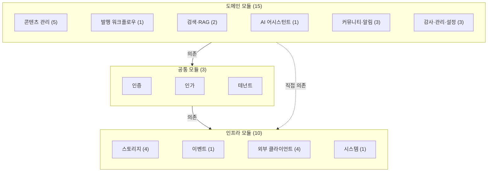
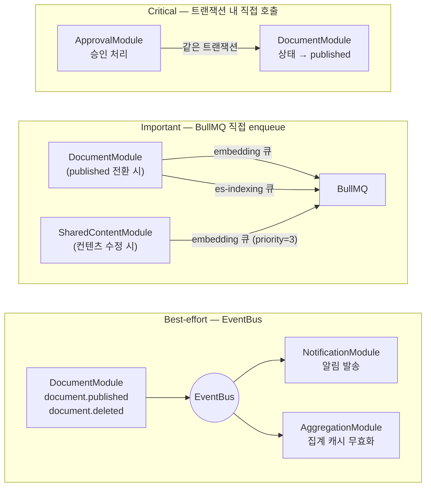
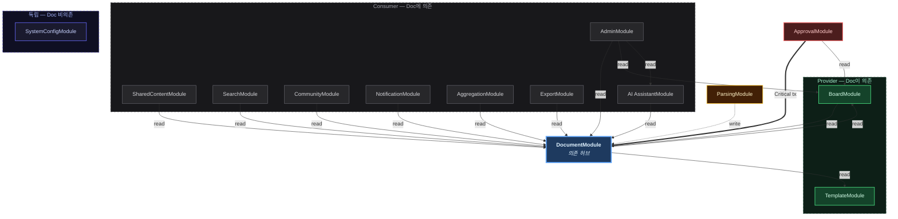
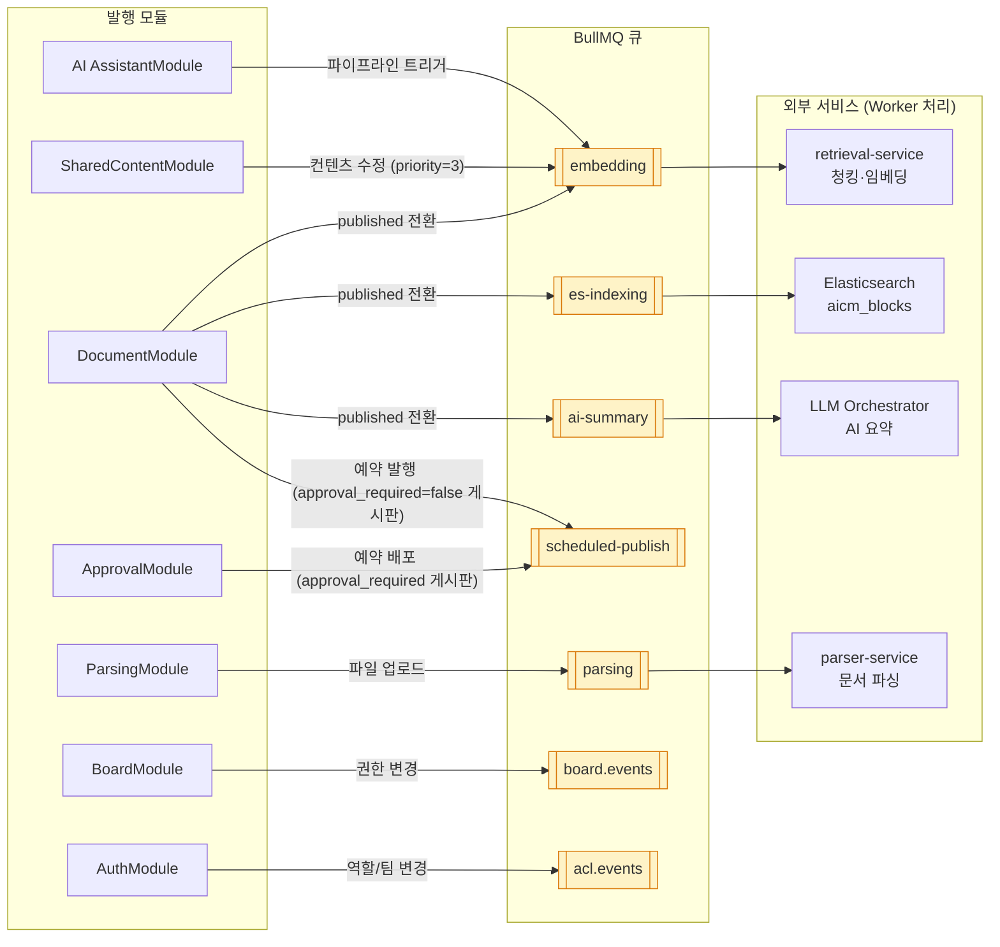
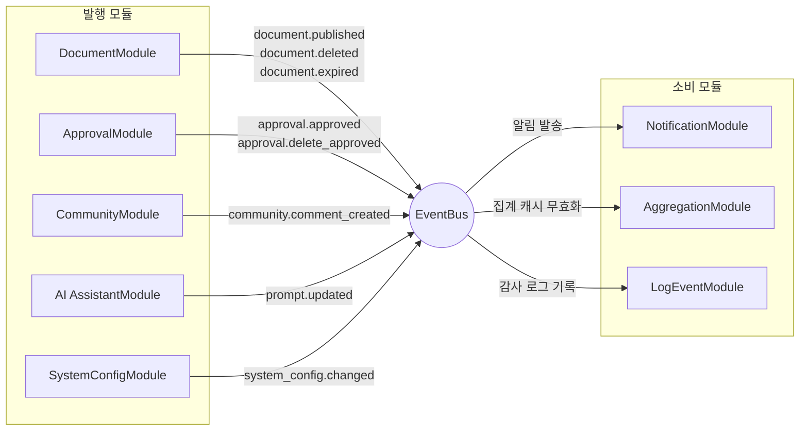
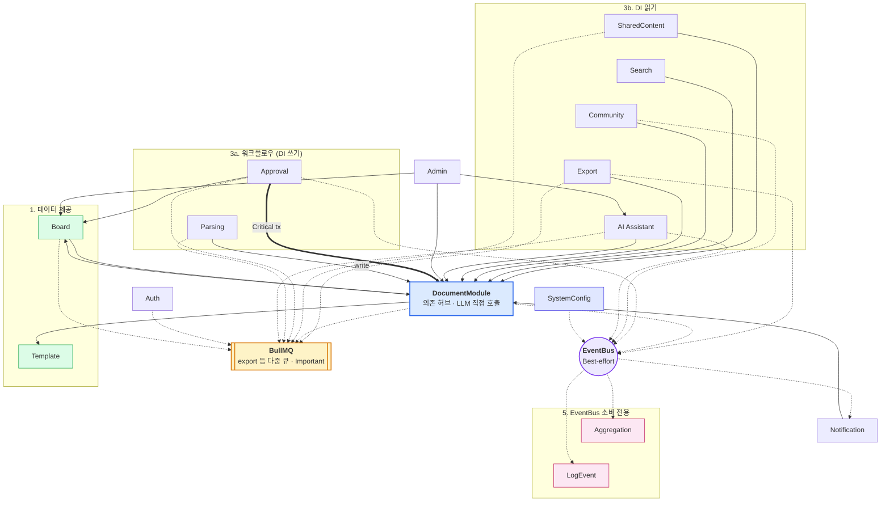

> **문서 상태**
> | 항목 | 값 |
> |------|-----|
> | 상태 | `draft` |
> | 검수 | `reviewed` |
> | 작성일 | 2026-03-16 |
> | 최종 수정 | 2026-04-13 |
> | 리비전 | R3 |
>
> **미비 사항**
> - [ ] 전체 이벤트 카탈로그 (모든 모듈의 발행/소비 이벤트 매트릭스) — 05문서와 연계
> - [ ] 이벤트 페이로드 인터페이스 (TypeScript 인터페이스)
> - [x] 01-system-overview.md SP-1 문구 수정 (Provider 패턴 적용 범위 — 3.4절 주석 참조) — ✅ 반영 완료
> - [x] data/aicm/rdb.md ERD에 누락 엔티티 추가 (SystemConfig, AggregationCache) — ✅ 반영 완료
> - [x] data/aicm/rdb.md ERD에서 User를 외부 참조로 정리 (ERD에서 제거, 주석으로 설명) — ✅ 반영 완료

# NestJS 모듈 아키텍처

> 모듈 분류, 도메인 모듈 상세, 의존성 규칙, Provider 패턴, 디렉토리 구조

### 3.1 모듈 분류

모듈은 3개 계층으로 분류한다.



| 계층 | 소분류 | 설명 | 모듈 |
|---|---|---|---|
| **도메인** | 콘텐츠 관리 | 지식 콘텐츠의 생성·구조화·저장·내보내기 | Document · Board · Template · SharedContent · Export |
| | 발행 워크플로우 | 콘텐츠 발행 절차 — 승인·반려·예약배포 | Approval |
| | 검색·RAG | 원본 입수·파싱부터 검색까지의 파이프라인 | Parsing · Search |
| | AI 어시스턴트 | AI 기능 오케스트레이션, 프롬프트 슬롯·버전 관리 | AI Assistant |
| | 커뮤니티·알림 | 사용자 상호작용·알림·피드·집계 | Community · Notification · Aggregation |
| | 감사·관리·설정 | 운영 모니터링·관리자 기능·시스템 설정 | LogEvent · Admin · SystemConfig |
| **공통** | 인증 / 인가 / 테넌트 | 모든 도메인 모듈이 공통으로 의존하는 횡단 관심사 — 누구인지, 할 수 있는지, 어느 테넌트인지 | Auth · Permission · Tenant |
| **인프라** | 스토리지 | DB·캐시·검색·파일 스토리지 연결 관리 | Database · Redis/BullMQ · Elasticsearch · MinIO |
| | 이벤트 | Best-effort 이벤트 발행/구독 | EventBus |
| | 외부 클라이언트 | 외부 서비스 HTTP 클라이언트 | LlmOrchestratorClient · RetrievalServiceClient · ParserServiceClient · UserServiceClient |
| | 시스템 | 헬스체크·모니터링 | Health |

### 3.2 도메인 모듈 상세

엔티티 목록은 [data/aicm/rdb.md §2.2·§4](./data/aicm/rdb.md)와 모듈별 `data.md`를 원천으로 하며, 아래는 **해당 모듈이 소유하는 RDB 엔티티 전체**이다 (첨부 파일 메타는 `Document.attachments` JSONB — 별도 테이블 없음).

| 모듈 | 책임 | 엔티티 (전체) |
|------|------|----------------|
| **DocumentModule** | 문서 CRUD, 자동 저장, 버전 관리, 상태 전이, 블록 콘텐츠 관리, Block↔Chunk 매핑 추적, 임베딩 상태 추적, 문서 단위 접근 제한(Restriction), 태그 관리, 글쓰기 개선 (LlmOrchestratorClient 직접 호출) | Document, DocumentVersion, Block, BlockSnapshot, Chunk, Tag, DocumentTag, DocumentRestriction, RetentionPolicy |
| **BoardModule** | 게시판 CRUD, 게시판 설정(approval_required, versioning_enabled, mandatory_approval_config, default_approval_template_id, 허용 템플릿), 게시판 타입(knowledge/community/notice/custom), 게시판별 Role-Action 권한 매핑 | Board, BoardPermission |
| **TemplateModule** | 템플릿 CRUD, 복제(clone), 비활성 처리, 보일러플레이트 관리 | Template |
| **SharedContentModule** | 공통 컨텐츠 CRUD, 참조 문서 추적, 재임베딩 트리거 | SharedContent, SharedContentRef |
| **ApprovalModule** | 승인 라인 템플릿(ApprovalLineTemplate) 관리, 다단계/다인 승인 요청/승인/반려/철회, 참조라인(CC), 승인자 선택(Approver Pick), 긴급 발행(Bypass), 승인 이력 감사 추적, 예약 배포 | ApprovalLineTemplate, Approval, ApprovalStepResult, ApprovalDecision, ApprovalHistory, ApprovalDelegation |
| **SearchModule** | 키워드 검색(SearchRepository를 통한 `aicm_blocks` 검색) + RAG 검색(retrieval-service 위임), 검색 설정 CRUD + retrieval-service 설정 동기화 | SearchConfig, ParsingConfig, Synonym, StopWord, BoostRule, BoardRagConfig, BoardParsingOverride, TemplateChunkingRule |
| **ParsingModule** | 원본 문서 파싱 오케스트레이션, 파서 전략 관리(Strategy 패턴), ParsedBlock → Block 변환. parser-service 또는 외부 파서 어댑터에 위임 | — (자체 엔티티 없음, Block은 DocumentModule 소유) |
| **CommunityModule** | 댓글, 좋아요, 신고, 북마크, 공지 읽음 확인 | Comment, Like, Report, Bookmark, BookmarkFolder, NoticeReadConfirmation |
| **NotificationModule** | 인앱 알림, 이메일 알림, 알림 설정, 구독 관리 | Notification, Subscription, NotificationSetting |
| **LogEventModule** | 감사·접근 **이벤트 로그** 통합 — HTTP `AuditLogInterceptor`, EventBus 리스너(감사 채널), Redis Stream→RDB 배치·MV 갱신(접근 채널), 조회·내보내기. 테이블은 `audit_log`·`access_event_log`로 성격 분리 | AuditLog, AccessEventLog |
| **AdminModule** | 관리자 대시보드, 관리자 전용 통계 | — (전용 RDB 엔티티 없음) |
| **AggregationModule** | 사용자 대상 집계(인기/트렌딩/최신), 배치 갱신, 피드·위젯 | AggregationCache, WidgetCatalog, UserWidgetLayout |
| **ExportModule** | 문서 내보내기 (PDF/DOCX/HTML/Markdown 변환) | ExportJob |
| **AI AssistantModule** | AI 기능 오케스트레이션 (요약, 글쓰기 개선, 이미지 분석), LLM Orchestrator·retrieval-service 연동 조율, 임베딩 파이프라인 트리거 관리, AI 기능별 프롬프트 슬롯 관리, 버전 이력/롤백, 프롬프트 테스트(LlmOrchestratorClient 경유), 관리자 편집 권한 검증, 감사 연계(`prompt.updated`) | PromptSlot, PromptVersion |
| **SystemConfigModule** | 시스템 설정 CRUD, 운영 파라미터(`lm:`/`pm:`) 관리, 설정 변경 시 EventBus 발행. AdminModule의 관리자 대시보드와 분리하여 설정 도메인의 독립적 변경을 보장한다 | SystemConfig |

### 3.2.1 공통 모듈 상세

| 모듈 | 책임 | 엔티티 (전체) | 비고 |
|------|------|----------------|------|
| **AuthModule** | 인증(토큰 검증), AICM 내부 역할·팀 관리, 조직도 조회(OrgProvider) | Role, UserRole, AdminPermission, Team, TeamMember, TeamRole | User/조직은 외부 UserService가 관리. 조직도 조회는 OrgProvider로 추상화 — LocalOrgProvider(자체 DB) 또는 UserServiceOrgProvider(외부 API). [ADR-005](../adr/005-usergroup-hierarchy-and-org-provider.md) 참조 |
| **PermissionModule** | 3계층 권한 평가 (Board Grant + Document/Block Restriction), 검색 권한 필터 구성, 유효 역할 산출(OrgProvider 활용) | — (자체 엔티티 없음, Board/Document의 권한 데이터를 읽기 전용 조회) | AuthModule(인증)과 분리. 인증은 "누구인지", 인가는 "할 수 있는지" |
| **TenantModule** | 멀티테넌트 DB 라우팅, 테넌트 식별, 커넥션 관리 | — | 미들웨어 + 커넥션 리졸버 |

> **User 엔티티 부재**: AICM은 사용자 엔티티를 직접 관리하지 않는다. 사용자 정보는 외부 UserService(SaaS: ECP, 온프렘: 별도 사용자 관리 서비스)가 담당하며, AICM은 인프라 레이어의 `UserServiceClientModule`을 통해 사용자 정보를 조회만 한다. AICM DB에는 userId를 참조하는 UUID 컬럼(created_by, user_id 등)만 존재하며, User 테이블이나 FK 제약조건은 없다. AICM이 소유하는 것은 **Role**(AICM 내부 역할 정의), **UserRole**(외부 userId ↔ AICM Role 매핑), **AdminPermission**(역할에 부여되는 관리 권한 키 — 외부 사용자 유형 라벨과 무관), **Team/TeamRole/TeamMember**(팀 관리 및 팀 단위 역할 할당)이다.

> **Guard 적용 전략**: 공통 모듈의 Guard는 NestJS Guard 파이프라인에서 다음과 같이 적용된다. `AuthGuard`는 `APP_GUARD`로 전역 등록되어 **모든 요청**에서 인증 토큰을 검증한다(배포 모드에 따라 EcpAuthProvider 또는 LocalAuthProvider를 사용). `PermissionGuard`는 컨트롤러 또는 핸들러에 `@Permissions()` 데코레이터가 선언된 엔드포인트에서만 동작하며, 자원 유형(문서/관리/개인)에 따라 BoardPermission·AdminPermission·소유자 확인을 수행한다. `@Public()` 데코레이터가 적용된 엔드포인트(헬스체크 등)는 AuthGuard를 우회한다 ([03-auth-architecture.md §1](./03-auth-architecture.md), [04-permission-architecture.md §7](./04-permission-architecture.md) 참조).

### 3.2.2 인프라 모듈 상세

| 모듈 | 책임 | 비고 |
|------|------|------|
| **DatabaseModule** | TypeORM DataSource 설정, 엔티티 등록, 마이그레이션 | TenantModule과 연동하여 테넌트별 커넥션 제공 |
| **RedisModule** | Redis 연결 관리, BullMQ 큐 설정, 캐시 유틸리티 | BullMQ 큐(embedding, ai-summary, notification 등) 포함 |
| **ElasticsearchModule** | ES 클라이언트 설정, 인덱스 관리 유틸리티 | `aicm_blocks` 전용. nori 분석기, 테넌트별 인덱스 라우팅. `aicm_chunks`와 Milvus는 retrieval-service가 소유 |
| **MinIOModule** | MinIO(S3 호환) 클라이언트, 버킷 관리, 업/다운로드 유틸리티 | 파일 첨부, 이미지 썸네일 |
| **EventBusModule** | NestJS EventEmitter 래핑, 이벤트 발행/구독 인터페이스 | Best-effort 전달 — 유실 가능 (3.3 이벤트 신뢰성 티어 참조) |
| **LlmOrchestratorClientModule** | LLM Orchestrator HTTP 클라이언트 | 요약, 글쓰기 개선 등 AI 요청 |
| **RetrievalServiceClientModule** | retrieval-service HTTP 클라이언트 | 청킹/임베딩 요청, 시맨틱/하이브리드 검색, 검색 설정 push |
| **ParserServiceClientModule** | parser-service HTTP 클라이언트 | 외부 문서(PDF/DOCX/HWP) 파싱 요청 |
| **UserServiceClientModule** | UserService HTTP 클라이언트 | 사용자/조직 정보 조회 |
| **HealthModule** | 헬스체크 엔드포인트, 외부 시스템 연결 상태 확인 | DB, Redis, ES, MinIO 연결 확인 |

> **관측성**: 로깅(Winston 구조화 JSON), 메트릭/트레이스(OpenTelemetry → SigNoz) 등 관측성 인프라는 별도 NestJS 모듈이 아닌 횡단 관심사로 처리한다. 상세 구현(로그 수집 파이프라인, 모니터링 메트릭, 알림 전략)은 [01-system-overview.md §3.1](./01-system-overview.md), [07-cross-cutting-concerns.md §8.3](./07-cross-cutting-concerns.md) 참조.

### 3.3 모듈 간 의존성 규칙

**규칙 1: 순환 의존 금지**

도메인 모듈 간 순환 의존을 금지한다.

**규칙 2: 읽기 의존은 단방향 허용, 쓰기는 이벤트 디커플링**

다른 모듈의 데이터를 **조회만** 하는 경우 직접 import를 허용한다 (단방향). 다른 모듈의 **상태를 변경**해야 하는 경우 이벤트를 발행한다.

| 상황 | 방법 | 예시 |
|------|------|------|
| A가 B의 데이터를 **조회** | 직접 import (단방향 의존) | DocumentModule이 BoardModule의 게시판 설정 조회 |
| A가 B의 상태를 **변경** | 이벤트 발행 또는 BullMQ enqueue | DocumentModule이 published 전환 시 `embedding` 큐에 Job 추가 |
| A와 B가 **서로 상태를 변경** | 설계 재검토 — 모듈 경계가 잘못된 것 | — |
| A→B 상태 변경이 **원자적**이어야 함 | 동일 트랜잭션 내 직접 서비스 호출 (예외) | ApprovalModule이 승인 처리 시 DocumentModule.transitionToPublished()를 같은 트랜잭션에서 호출 |

> **Critical 상태 전이 예외**: 두 모듈의 상태 변경이 원자적이어야 하는 경우(트랜잭션 일관성 필수), 이벤트 대신 동일 트랜잭션 내 직접 서비스 호출을 허용한다. 호출 방향은 단방향이어야 하며, 순환 호출은 금지한다.

**규칙 3: 이벤트 신뢰성 티어**

모든 이벤트를 동일하게 취급하지 않는다. 유실 시 영향도에 따라 전달 방식을 분류한다.

| 티어 | 성격 | 유실 시 영향 | 전달 방식 | 예시 |
|------|------|-------------|----------|------|
| **Critical** | 상태 전이 | 데이터 정합성 깨짐 | 동일 트랜잭션 내 직접 서비스 호출 (규칙 2 예외) | 승인 → published 전환 |
| **Important** | 인덱싱, 임베딩 트리거 | 검색 누락 (복구 가능) | BullMQ 직접 enqueue + 시작 시 보정 배치 | ES 인덱싱, 임베딩 요청, 재임베딩 |
| **Best-effort** | 알림, 캐시 갱신 | 사용자 불편 (무결성 무관) | EventBus (NestJS EventEmitter) | 인앱 알림, 집계 캐시 갱신 |

> **보정 배치(Reconciliation)**: 서비스 시작 시 정합성 검증 배치를 실행한다. 예: `status = 'published'`인데 `embedding_status = 'pending'`인 문서 → 임베딩 큐 재투입. 이를 통해 Important 티어의 유실을 사후 보정한다.



**규칙 4: 인프라 모듈 직접 사용 허용, 배포 분기만 추상화**

도메인 모듈은 인프라 모듈(Database, Redis, Elasticsearch, MinIO)을 직접 import하여 사용한다. 인프라 스택이 교체될 가능성은 극히 낮으므로, 불필요한 추상화 레이어를 두지 않는다. Milvus는 aicm-service가 직접 사용하지 않으며 retrieval-service가 소유한다.

**예외: SearchModule의 검색 엔진 접근**은 Repository/Adapter 패턴으로 추상화한다. 자체 호스팅 ES(Elasticsearch)를 기본으로 사용하되, 고객 요구에 따라 상용 검색 솔루션(다이퀘스트 등)으로 교체해야 하는 B2B 납품 시나리오에 대비한다. `SearchRepository` 인터페이스를 정의하고, 기본 구현체 `ElasticsearchSearchAdapter`를 NestJS DI로 주입한다. 검색 솔루션 교체 시 Adapter만 교체하면 서비스 레이어 코드는 변경 없이 동작한다.

추상화는 **배포 환경에 따라 실제로 구현체가 달라지는 경우에만** 적용한다 (3.4 Provider 패턴 참조).

| 대상 | 추상화 여부 | 근거 |
|------|-----------|------|
| Auth (인증) | **추상화 (Provider 패턴)** | SaaS(ECP 토큰 검증) vs 온프렘(JWT 검증) — 검증 로직 자체가 다름 |
| Org (조직도 조회) | **추상화 (Provider 패턴)** | 자체 DB 조회(LocalOrgProvider) vs 외부 UserService API(UserServiceOrgProvider) — 데이터 소스가 다름. [ADR-005](../adr/005-usergroup-hierarchy-and-org-provider.md) |
| PostgreSQL, Redis, MinIO | **직접 사용** | 교체 가능성 없음, 추상화 비용 > 이득. Milvus는 retrieval-service가 소유하므로 aicm에서 제외 |
| ES (SearchModule) | **Repository/Adapter 패턴** | B2B 납품 시 고객 요구에 따라 검색 솔루션 교체 가능성 있음 — SearchRepository + ElasticsearchSearchAdapter |
| LlmOrchestratorClient, RetrievalServiceClient, ParserServiceClient, UserServiceClient | **직접 사용** | HTTP 클라이언트 — 호출 URL만 환경변수로 분기, Provider 패턴 불필요 |

#### 3.3.1 모듈 간 의존성 매트릭스

규칙 1~4를 적용한 도메인 모듈의 구체적 의존 관계를 통신 방식별로 정리한다. 화살표 방향은 **의존 방향** (A → B = A가 B를 import).

**DI 의존 관계도**



**A. 직접 의존 (DI) — 서비스 import**

읽기 전용 조회 또는 원자적 상태 전환이 필요한 경우 서비스 import로 의존한다.

| 소비자 (import) | 제공자 (export) | 접근 유형 | 용도 |
|---|---|---|---|
| DocumentModule | BoardModule | 읽기 | 게시판 설정(승인·버전 플래그, mandatory_approval_config, 기본 템플릿, 허용 템플릿) 조회 |
| DocumentModule | TemplateModule | 읽기 | 템플릿 구조 조회 (문서 생성 시) |
| ApprovalModule | DocumentModule | **쓰기 (Critical)** | 승인 완료 시 `transitionToPublished()` — 동일 트랜잭션 |
| ApprovalModule | BoardModule | 읽기 | 게시판 승인 설정·기본 승인 라인 템플릿 조회 |
| BoardModule | DocumentModule | 읽기 | Controller 오케스트레이션 (게시판 내 문서 목록 조회) |
| SharedContentModule | DocumentModule | 읽기 | 참조 문서·블록 추적 |
| ParsingModule | DocumentModule | 쓰기 | ParsedBlock → Block 변환·저장 |
| SearchModule | DocumentModule | 읽기 | 검색 결과 메타데이터 보강 |
| CommunityModule | DocumentModule | 읽기 | 댓글·좋아요 대상 문서 존재 확인 |
| AggregationModule | DocumentModule | 읽기 | 집계 대상 문서 정보 조회 |
| AdminModule | DocumentModule | 읽기 | 관리자 통계용 문서 데이터 조회 |
| AdminModule | BoardModule | 읽기 | 관리자 통계용 게시판 데이터 조회 |
| ExportModule | DocumentModule | 읽기 | 내보내기 대상 문서·블록 데이터 조회 |
| NotificationModule | DocumentModule | 읽기 | 알림 컨텍스트(문서 제목, 작성자) 조회 |
| AI AssistantModule | DocumentModule | 읽기 | AI 기능 처리 대상 문서·블록 조회 |
| AdminModule | AI AssistantModule | 읽기 | 관리자 대시보드에서 프롬프트 통계 조회 |

> **DocumentModule이 의존 허브**: 12개 도메인 모듈이 DocumentModule을 의존한다. DocumentModule 자체는 Board, Template 2개만 의존한다. BoardModule은 Controller 오케스트레이션(게시판 내 문서 목록 등)을 위해 DocumentModule을 읽기 의존하므로, Board↔Document는 양방향 읽기 의존이다. 양쪽 모두 읽기 전용이므로 순환 의존 금지 원칙(규칙 1)에 저촉되지 않는다.
>
> **의존 집중 완화 전략**: DocumentModule은 KMS의 핵심 도메인으로서 높은 팬아웃이 불가피하나, 향후 마이크로서비스 분리(SP-2) 시 아래 전략으로 의존을 점진적으로 완화한다:
> 1. **Read Model 분리**: 읽기 전용 소비자(Search, Community, Aggregation 등)는 이벤트 기반 Read Model(Query Service)로 전환하여 직접 DI 의존을 제거한다
> 2. **Facade 패턴**: DocumentModule의 공개 인터페이스를 최소화하고, 내부 서비스(자동저장, 버전, 락 등)는 Facade 뒤에 숨겨 소비자가 의존하는 표면적을 줄인다
> 3. **이벤트 기반 디커플링 확대**: 현재 DI 읽기 의존 중 실시간성이 필수가 아닌 것(Aggregation, Admin 통계 등)은 EventBus 기반 비동기 조회로 전환을 검토한다

> **독립 모듈**: TemplateModule은 다른 도메인 모듈을 DI 의존하지 않는다. LogEventModule은 NestJS Interceptor·EventBus 리스너로 전역 동작하며 도메인 모듈에 대한 코드 레벨 의존이 없다 (06-cross-cutting-concerns.md 참조).

> **공통 모듈 DI 참고**: PermissionModule(공통 계층)은 BoardModule의 BoardPermission과 DocumentModule의 DocumentRestriction을 읽기 전용 조회한다 (03-auth-architecture.md 참조).

**B. 이벤트/큐 기반 통신 매트릭스**

다른 모듈의 상태를 변경하거나 부수 효과를 트리거하는 경우, 신뢰성 티어(규칙 3)에 따라 BullMQ 또는 EventBus를 사용한다.

***Important 티어 — BullMQ 직접 enqueue***



| 발행자 | 큐 | 트리거 시점 | 처리 내용 |
|---|---|---|---|
| DocumentModule | `embedding` | published 전환 | retrieval-service에 청킹·임베딩 요청 |
| DocumentModule | `es-indexing` | published 전환 | ES `aicm_blocks` 인덱싱 |
| DocumentModule | `ai-summary` | published 전환 | LLM Orchestrator에 자동 요약 생성 요청 |
| SharedContentModule | `embedding` (priority=3) | 공통 컨텐츠 수정 | 참조 문서 블록 재임베딩 |
| ApprovalModule, DocumentModule | `scheduled-publish` | 예약 배포 설정 (approval_required: 승인 완료 시, approval_required=false: 직접 발행 시 scheduledPublishAt 지정) | BullMQ delayed job으로 지연 실행 |
| ParsingModule | `parsing` | 파일 업로드 후 사전 검증 통과 | parser-service에 파싱 요청 |
| AI AssistantModule | `embedding` | 임베딩 파이프라인 트리거 관리 | retrieval-service에 임베딩 요청 (관리자 수동 재임베딩 등) |
| BoardModule | `board.events` | 게시판 권한 변경 (`board.permissions_updated`) | 권한 캐시 무효화, 관련 모듈 동기화 |
| AuthModule | `acl.events` | 역할/팀/제한 변경 | 7개 이벤트 — `acl.role.permissions_updated`, `acl.role.status_changed`, `acl.team.members_updated`, `acl.team.status_changed`, `acl.user_role.updated`, `acl.board_permission.updated`, `acl.restriction.updated`. 권한 캐시 무효화, 검색 가시성 재평가, 감사 로그 기록. 상세 이벤트명·페이로드는 [auth/events.md](../03-module-design/auth/events.md) 참조 |

***스케줄 기반 내부 배치 — NestJS @Cron***

> 아래 2개 작업은 BullMQ 이벤트 기반 큐가 아닌 NestJS `@Cron` 스케줄러 기반 내부 배치이다. [05-async-event-architecture.md §6.1](./05-async-event-architecture.md)에도 동일하게 기술되어 있다.

| 모듈 | 작업 | 주기 | 처리 내용 |
|---|---|---|---|
| LogEventModule | `access-log-flush` | 5분 주기 cron | Redis Stream → RDB `access_event_log` 배치 INSERT |
| DocumentModule | `access-count-flush` | 10분 주기 cron | Redis Hash → PG `document.view_count` 배치 flush |
| LogEventModule | `access-mv-refresh` | 30분~1시간 주기 cron | 접근 로그 Materialized View REFRESH CONCURRENTLY |
| CommunityModule | `notice-reminder` | 1시간 주기 cron | 읽음 확인 미확인자 리마인더 발송 + 기한 초과 리마인더 반복 ([FD-NTC](../../01-requirements/features/FD-NTC-공지사항.md) §4.3) |
| DocumentModule | `notice-pin-expiry` | 1시간 주기 cron | 고정 기간 만료 공지의 자동 고정 해제. 기존 유효기간 만료 배치(`document.expired`)와 동일 cron에서 처리 ([FD-NTC](../../01-requirements/features/FD-NTC-공지사항.md) §3.2 BR-NTC-021) |

***Best-effort 티어 — EventBus (NestJS EventEmitter)***



| 발행자 | 이벤트 | 소비자 | 용도 |
|---|---|---|---|
| DocumentModule | `document.published` | NotificationModule | 작성자·구독자 알림 |
| DocumentModule | `document.published` | AggregationModule | 집계 캐시 무효화 |
| DocumentModule | `document.deleted` | NotificationModule | 삭제 알림 |
| DocumentModule | `document.deleted` | AggregationModule | 집계 캐시 무효화 |
| DocumentModule | `document.expired` | NotificationModule | 만료 알림 (담당자) |
| DocumentModule | `document.expired` | AggregationModule | 집계 캐시 무효화 |
| ApprovalModule | `approval.approved` | LogEventModule | 감사 로그 기록 |
| ApprovalModule | `approval.approved` | NotificationModule | 승인 완료 알림 |
| ApprovalModule | `approval.delete_approved` | LogEventModule | 삭제 요청 승인 감사 로그 기록 |
| ApprovalModule | `approval.delete_approved` | NotificationModule | 삭제 요청 승인 알림 |
| CommunityModule | `community.comment_created` | NotificationModule | 댓글 알림 (문서 작성자·멘션 대상) |
| CommunityModule | `community.comment_created` | LogEventModule | 감사 로그 기록 |
| AI AssistantModule | `prompt.updated` | LogEventModule | 프롬프트 변경 감사 로그 기록 |
| SystemConfigModule | `system_config.changed` | LogEventModule 외 4개 모듈 | 설정 변경 감사 로그 기록 및 모듈별 캐시 무효화 (Best-effort 발행). 전체 소비자 목록은 [system-config/events.md](../03-module-design/system-config/events.md) 참조 |

> **EventBus 트리거 → 내부 BullMQ**: NotificationModule은 EventBus 이벤트를 수신한 뒤 내부 `notification` BullMQ 큐에서 실제 발송을 처리한다. EventBus(Best-effort)로 트리거하되, 모듈 내부에서는 BullMQ로 안정적 처리를 보장하는 패턴이다. AI 요약(`ai-summary` 큐)은 DocumentModule이 published 전환 시 BullMQ에 직접 enqueue한다 (Important 티어).

***종합 의존성 개요 — DI + BullMQ + EventBus***

모든 통신 방식을 한눈에 보는 종합도. 5개 레이어로 위→아래 흐름을 따른다.

> **범례**: 실선(→) DI 읽기 · 이중선(⟹) Critical 트랜잭션 · 점선(⇢) 비동기(BullMQ / EventBus)



| 채널 | 항목 | 설명 |
|------|------|------|
| **BullMQ** | `embedding` | 문서 published 시 retrieval-service 청킹·임베딩 |
| (Important) | `es-indexing` | 문서 published 시 ES 키워드 인덱싱 |
| | `ai-summary` | 문서 published 시 LLM 자동 요약 생성 |
| | `embedding` (priority=3) | 공통 컨텐츠 수정 시 참조 문서 재임베딩 |
| | `parsing` | 파일 업로드 후 parser-service 파싱 |
| | `scheduled-publish` | 예약 배포 지연 실행 (approval_required 게시판: 승인 후, 그 외: 직접 발행 시) |
| | `board.events` | 게시판 권한 변경 시 캐시 무효화 |
| | `acl.events` | 역할/팀/제한 변경 시 권한 캐시 무효화, 감사 로그 기록 |
| | `export` | ExportModule 비동기 문서보내기(PDF/DOCX/HTML/Markdown), DLQ: `export-dlq` |
| **@Cron** | `access-log-flush` | 5분 주기 — Redis Stream → RDB `access_event_log` 배치 INSERT (**LogEventModule**) |
| (스케줄 배치) | `access-count-flush` | 10분 주기 — Redis Hash → PG `document.view_count` 배치 flush (**DocumentModule**) |
| | `access-mv-refresh` | 30분~1시간 주기 — 접근 로그 Materialized View REFRESH CONCURRENTLY (**LogEventModule**) |
| | `notice-reminder` | 1시간 주기 — 읽음 확인 미확인자 리마인더 발송 (CommunityModule) |
| | `notice-pin-expiry` | 1시간 주기 — 고정 기간 만료 공지 자동 해제 (DocumentModule) |
| **EventBus** | `document.published` | 알림 발송, 집계 캐시 무효화 트리거 |
| (Best-effort) | `document.deleted` | 삭제 알림, 집계 캐시 무효화 트리거 |
| | `document.expired` | 만료 알림, 집계 캐시 무효화 트리거 |
| | `approval.approved` | 승인 알림, 감사 로그 기록 트리거 |
| | `approval.delete_approved` | 삭제 요청 승인 알림, 감사 로그 기록 트리거 |
| | `community.comment_created` | 댓글 알림, 감사 로그 기록 트리거 |
| | `prompt.updated` | 프롬프트 변경 감사 로그 기록 트리거 (AI AssistantModule 발행) |
| | `system_config.changed` | 설정 변경 감사 로그 기록 트리거 (SystemConfigModule 발행) |
| | `export.job.created`, `export.file.expired` 등 | ExportModule 알림·감사 연계 (상세: [export/events.md](../03-module-design/export/events.md)) |

**C. 모듈별 인프라 의존 요약**

| 도메인 모듈 | DB | Redis / BullMQ | ES | MinIO | EventBus | 외부 서비스 클라이언트 |
|---|:---:|:---:|:---:|:---:|:---:|---|
| **DocumentModule** | ● | ● 락, embedding·es-indexing·ai-summary·scheduled-publish 큐, access:counts(Hash), @Cron(access-count-flush·notice-pin-expiry) | | ● | ● 발행 | RetrievalServiceClient (임베딩 삭제), LlmOrchestratorClient (요약·글쓰기 개선) |
| **BoardModule** | ● | ● 게시판 트리 캐시 (`cache:board:tree`), `board.events` 큐 (`board.permissions_updated`) | | | | |
| **TemplateModule** | ● | | | | | |
| **SharedContentModule** | ● | ● embedding 큐(priority=3) | | | | |
| **ApprovalModule** | ● | ● scheduled-publish 큐 | | | ● 발행 | |
| **SearchModule** | ● | | ● 키워드 검색 | | | RetrievalServiceClient (시멘틱 검색) |
| **ParsingModule** | ● | ● parsing 큐 | | | | ParserServiceClient |
| **CommunityModule** | ● | ● @Cron(`notice-reminder`) | | | ● 발행 | |
| **NotificationModule** | ● | ● notification 큐 | | | ● 소비 | |
| **LogEventModule** | ● (`audit_log`, `access_event_log`, 접근 MV) | ● access:dedup·access:log:stream, @Cron(access-log-flush·access-mv-refresh) | | | ● 소비 | |
| **AdminModule** | ● | ● 캐시 | | | | |
| **AggregationModule** | ● | ● 캐시 | | | ● 소비 | |
| **ExportModule** | ● | ● `export` 큐, `export-dlq` | | ● | ● 발행 | |
| **AI AssistantModule** | ● | ● embedding 큐 | | | ● 발행 | LlmOrchestratorClient (AI 기능 + 프롬프트 테스트), RetrievalServiceClient (임베딩) |
| **SystemConfigModule** | ● | ● 캐시 | | | ● 발행 (`system_config.changed`) | |

> **공통 모듈 인프라 의존**

| 공통 모듈 | DB | Redis / BullMQ | ES | MinIO | EventBus | 외부 서비스 클라이언트 |
|---|:---:|:---:|:---:|:---:|:---:|---|
| **AuthModule** | ● | ● 캐시 (`cache:auth:*`), `acl.events` 큐 (8개 이벤트 — 상세는 [auth/events.md](../03-module-design/auth/events.md) 참조) | | | | |

### 3.4 Provider 패턴 — 인증 및 조직도 분기

Provider 패턴은 **구현 로직 자체가 완전히 달라지는 경우에만** 적용한다. 현재 Auth(인증)와 Org(조직도 조회) 두 가지에 해당한다.

> **01-system-overview.md SP-1과의 정합**: SP-1의 "배포 환경에 따라 달라지는 관심사를 추상 인터페이스 뒤에 숨기고 런타임에 구현체를 주입한다"는 원칙은 유지하되, Provider 패턴의 적용 범위는 인증(Auth)과 조직도 조회(Org) 2가지로 확정한다. 사용자 관리와 LLM 프로바이더는 HTTP URL 환경변수 분기만으로 충분하여 Provider 패턴을 적용하지 않는다 (01 문서 SP-1에 반영 완료).

| Provider | 분기 환경변수 | 구현체 A | 구현체 B | 용도 |
|----------|-------------|---------|---------|------|
| AuthProvider | `DEPLOY_MODE` | EcpAuthProvider (SaaS) | LocalAuthProvider (온프렘) | 토큰 검증 로직이 다름 |
| OrgProvider | `ORG_SOURCE` | LocalOrgProvider (자체 DB) | UserServiceOrgProvider (외부 API) | 조직도 조회 소스가 다름 |

**AuthProvider — 인증 분기:**

```typescript
interface AuthProvider {
  validateToken(token: string): Promise<UserContext>;
}

class EcpAuthProvider implements AuthProvider { /* SaaS: ECP 포털 토큰 검증 */ }
class LocalAuthProvider implements AuthProvider { /* 온프렘: 자체 JWT 검증 */ }
```

**OrgProvider — 조직도 조회 분기 ([ADR-005](../adr/005-usergroup-hierarchy-and-org-provider.md)):**

```typescript
interface OrgProvider {
  getUserAncestorTeamIds(userId: string): Promise<string[]>;
}

class LocalOrgProvider implements OrgProvider {
  /* AICM DB의 Team 계층에서 parent_id 재귀 순회 (초기 — UserService 부재 시) */
}
class UserServiceOrgProvider implements OrgProvider {
  /* 외부 UserService API 호출 + Redis 캐싱 (향후 — UserService 준비 시) */
}
```

```typescript
@Module({
  providers: [
    {
      provide: AUTH_PROVIDER,
      useFactory: (config: ConfigService) => {
        return config.get('DEPLOY_MODE') === 'saas'
          ? new EcpAuthProvider(config)
          : new LocalAuthProvider(config);
      },
      inject: [ConfigService],
    },
    {
      provide: ORG_PROVIDER,
      useFactory: (config: ConfigService) => {
        return config.get('ORG_SOURCE') === 'user_service'
          ? new UserServiceOrgProvider(config)
          : new LocalOrgProvider(config);
      },
      inject: [ConfigService],
    },
  ],
})
export class AuthModule {}
```

> **외부 API 클라이언트(LlmOrchestratorClient, RetrievalServiceClient, ParserServiceClient, UserServiceClient)는 Provider 패턴을 사용하지 않는다.** HTTP 호출 구조가 동일하고 URL만 다르므로 환경변수(`USER_SERVICE_URL`, `LLM_ORCHESTRATOR_URL`, `RETRIEVAL_SERVICE_URL`, `PARSER_SERVICE_URL` 등)로 분기한다.

### 3.5 디렉토리 구조

```
src/
├── app.module.ts
├── main.ts
│
├── common/                          # 공유 유틸리티
│   ├── config/                      # 환경 설정
│   ├── decorators/                  # 커스텀 데코레이터
│   ├── filters/                     # 예외 필터
│   ├── interceptors/                # 로깅, 감사, 변환
│   ├── interfaces/                  # 공유 인터페이스
│   ├── pipes/                       # 유효성 검증
│   └── utils/                       # 유틸리티 함수
│
├── shared/                          # 공통 모듈 (Shared 계층)
│   ├── auth/                        # 인증 + 조직도 (Provider 패턴)
│   │   ├── auth.module.ts
│   │   ├── providers/
│   │   │   ├── auth-provider.interface.ts
│   │   │   ├── ecp-auth.provider.ts
│   │   │   ├── local-auth.provider.ts
│   │   │   ├── org-provider.interface.ts
│   │   │   ├── local-org.provider.ts
│   │   │   └── user-service-org.provider.ts
│   │   ├── entities/
│   │   │   ├── role.entity.ts
│   │   │   ├── user-role.entity.ts
│   │   │   ├── team.entity.ts
│   │   │   ├── team-role.entity.ts
│   │   │   └── team-member.entity.ts
│   │   ├── guards/
│   │   └── strategies/
│   │
│   ├── permission/                  # 인가 (권한 평가)
│   │   ├── permission.module.ts
│   │   ├── permission.service.ts    # 3계층 권한 평가 로직
│   │   └── permission.guard.ts
│   │
│   └── tenant/                      # 멀티테넌트 (DB 라우팅)
│       ├── tenant.module.ts
│       ├── tenant.middleware.ts     # 요청에서 테넌트 식별 → DB 커넥션 선택
│       ├── tenant-connection.resolver.ts  # 테넌트별 DataSource 관리
│       └── tenant.context.ts        # AsyncLocalStorage 기반 컨텍스트
│
├── domains/                         # 도메인 모듈
│   ├── document/                    # 문서 관리
│   │   ├── document.module.ts
│   │   ├── controllers/
│   │   │   ├── document.controller.ts
│   │   │   └── document-version.controller.ts
│   │   ├── services/
│   │   │   ├── document.service.ts
│   │   │   ├── document-version.service.ts
│   │   │   ├── document-autosave.service.ts
│   │   │   └── document-lock.service.ts
│   │   ├── entities/
│   │   │   ├── document.entity.ts
│   │   │   └── document-version.entity.ts
│   │   ├── dto/
│   │   ├── events/
│   │   │   └── document.events.ts
│   │   └── listeners/
│   │       └── document-event.listener.ts
│   │
│   ├── board/                       # 게시판
│   ├── template/                    # 템플릿
│   ├── shared-content/              # 공통 컨텐츠
│   ├── approval/                    # 승인 워크플로우
│   ├── search/                      # 검색 (SearchRepository + retrieval-service 위임)
│   ├── parsing/                     # 문서 파싱 오케스트레이션 (Strategy 패턴)
│   │   ├── parsing.module.ts
│   │   ├── parsing-orchestrator.service.ts
│   │   ├── interfaces/
│   │   │   ├── parser-strategy.interface.ts
│   │   │   └── parsed-block.interface.ts
│   │   └── strategies/
│   │       ├── built-in/            # 내장 파서 (간단한 포맷)
│   │       └── adapters/            # 외부 파서 어댑터
│   │           ├── parser-service.adapter.ts
│   │           └── external-parser.adapter.ts
│   ├── ai-assistant/                # AI 기능 오케스트레이션 + 프롬프트 슬롯/버전 관리
│   ├── community/                   # 댓글/좋아요/신고/북마크
│   ├── notification/                # 알림
│   ├── log-event/                   # 이벤트 로그 (감사·접근)
│   ├── admin/                       # 관리자
│   ├── aggregation/                 # 집계/피드
│   ├── export/                      # 문서 내보내기
│   └── system-config/               # 시스템 설정
│
└── infrastructure/                  # 외부 시스템 연결
    ├── database/                    # TypeORM
    ├── redis/                       # Redis + BullMQ
    ├── elasticsearch/               # Elasticsearch 클라이언트 (aicm_blocks 전용)
    ├── minio/                       # MinIO 클라이언트
    ├── event-bus/                   # NestJS EventEmitter 래핑
    ├── llm-orchestrator-client/     # LLM Orchestrator HTTP 클라이언트
    │   ├── llm-orchestrator-client.module.ts
    │   └── llm-orchestrator.client.ts
    ├── retrieval-service-client/          # retrieval-service HTTP 클라이언트 (청킹/임베딩/검색)
    │   ├── retrieval-service-client.module.ts
    │   ├── retrieval-service.client.ts
    │   └── interfaces/
    │       ├── retrieval-ingest.interface.ts
    │       ├── retrieval-search.interface.ts
    │       └── retrieval-config.interface.ts
    ├── parser-service-client/       # parser-service HTTP 클라이언트 (문서 파싱)
    │   ├── parser-service-client.module.ts
    │   └── parser-service.client.ts
    ├── user-service-client/         # UserService HTTP 클라이언트 (사용자/조직 조회)
    │   ├── user-service-client.module.ts
    │   └── user-service.client.ts
    └── health/                      # 헬스체크
```

---

## 관련 문서

- [시스템 개요](./01-system-overview.md)
- [비동기 처리 아키텍처](./05-async-event-architecture.md) — 이벤트 흐름 상세
- [캐시 아키텍처](./08-cache-architecture.md) — 캐시 정책, TTL, 무효화 트리거
- [데이터 아키텍처](./data/README.md)
- [인증/인가 아키텍처](./03-auth-architecture.md) — 3계층 권한 모델 상세
- [ADR-005](../adr/005-usergroup-hierarchy-and-org-provider.md) — Team 계층 확장 및 OrgProvider 패턴 도입
