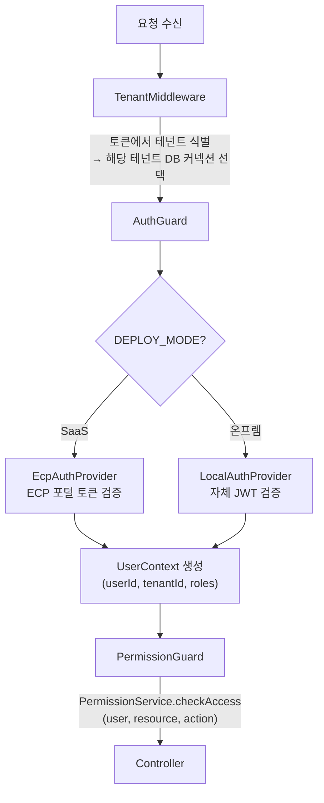
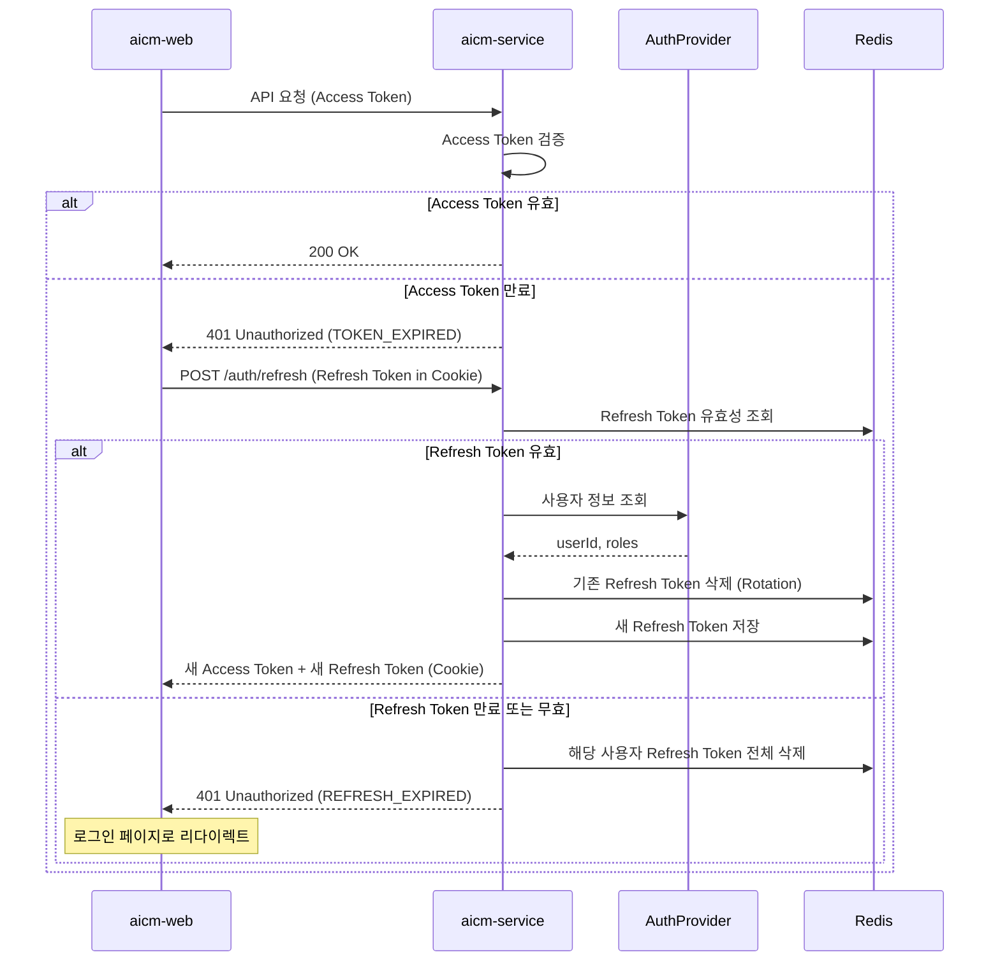
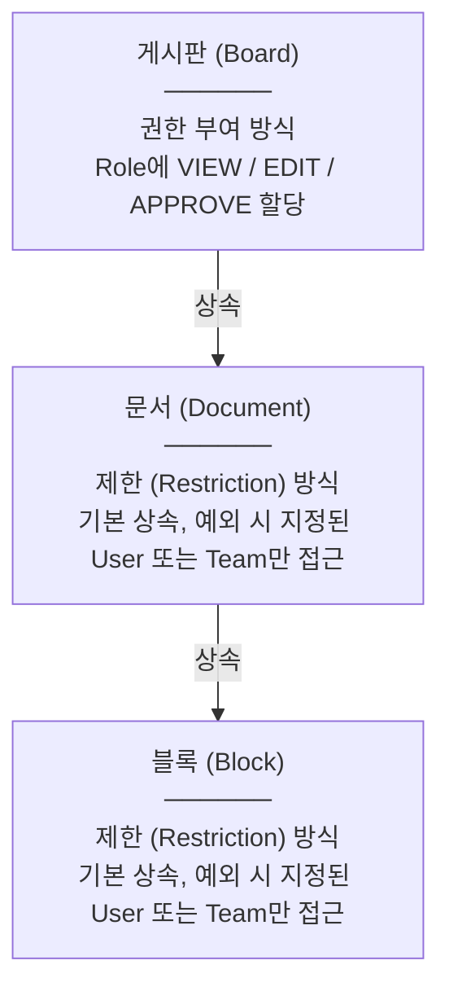
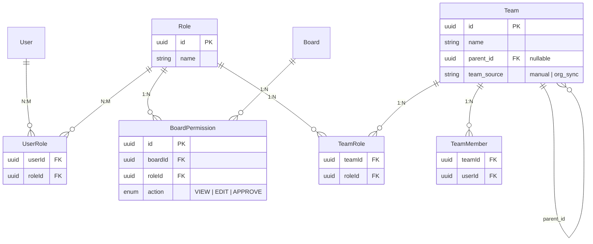
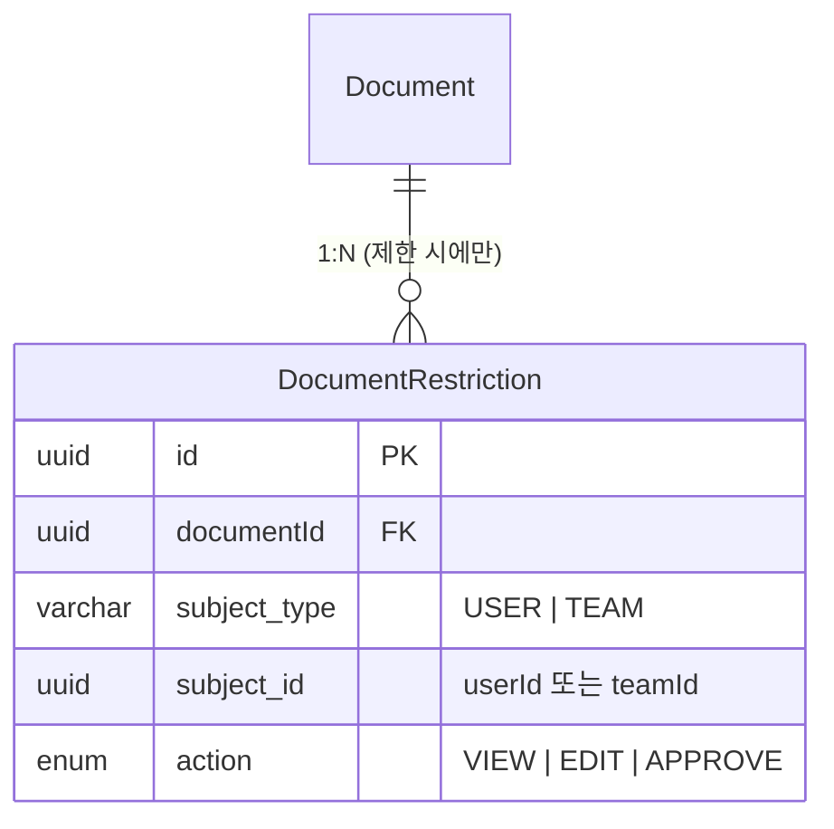
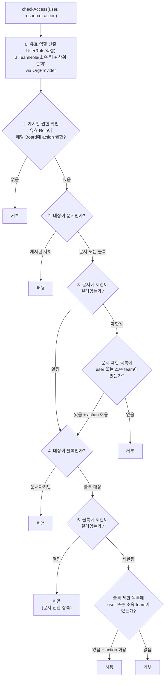
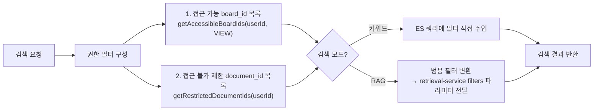
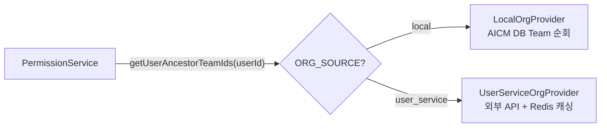
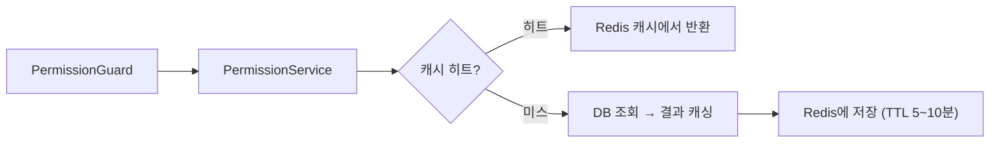
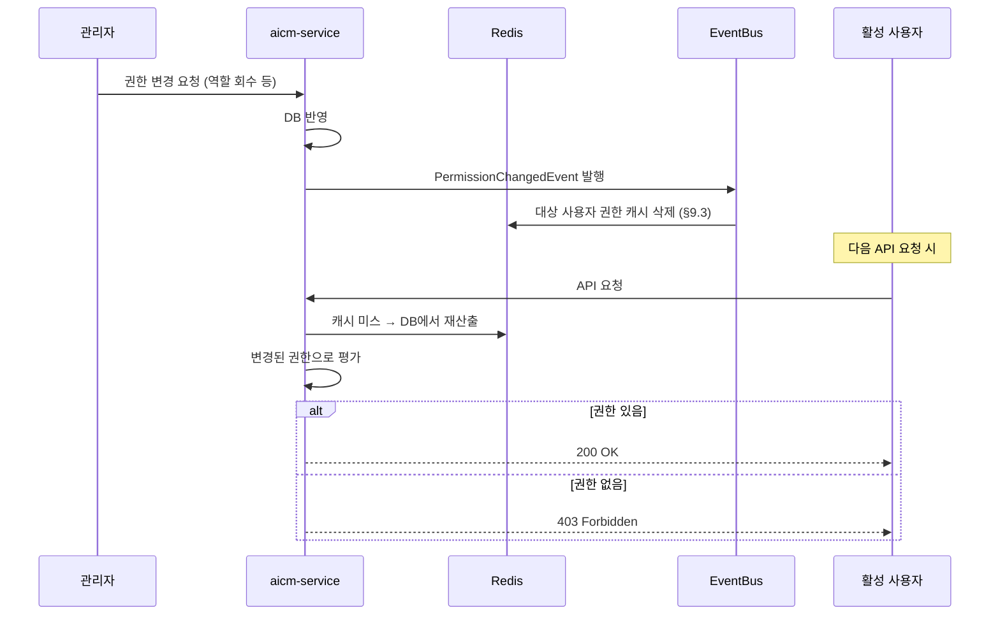

> **문서 상태**
> | 항목 | 값 |
> |------|-----|
> | 상태 | `draft` |
> | 검수 | `unreviewed` |
> | 작성일 | 2026-03-16 |
> | 최종 수정 | 2026-04-13 |
>
> **미비 사항**
> - [ ] Role/UserRole 엔티티 상세 필드 (→ 도메인 설계서로 위임 예정)
> - [ ] ECP 토큰 검증 상세 (→ 도메인 설계서로 위임 예정)

# 인증/인가 아키텍처

> 인증 흐름, 토큰 생명주기, 3계층 권한 모델 (Board Grant + Document/Block Restriction), 권한 평가 로직, 검색/RAG 권한 필터, 권한 캐싱 전략

## 1. 인증 흐름



## 2. 인증 토큰 생명주기

인증 토큰의 발급, 갱신, 만료, 폐기 흐름을 정의한다. 배포 모드(SaaS/온프렘)에 따라 구현이 분기된다.

### 2.1 토큰 구성

| 토큰 | TTL | 저장 위치 | 전송 방식 | 용도 |
|------|-----|----------|----------|------|
| **Access Token** | 15분 | 클라이언트 메모리 | `Authorization: Bearer` 헤더 | API 인증. 쿠키에 저장하지 않으므로 CSRF 공격 대상이 아님 |
| **Refresh Token** | 7일 | HttpOnly + Secure + SameSite=Strict Cookie | 브라우저 자동 첨부 (Cookie) | Access Token 재발급. 서버 측 Redis에 매핑 저장 |

> **07-cross-cutting-concerns §8.8.3과의 관계**: 07문서는 "쿠키에 인증 토큰을 저장하지 않으므로 전통적 CSRF 공격에는 해당하지 않는다"고 서술한다. 이는 **Access Token**(인증 토큰)이 쿠키가 아닌 `Authorization` 헤더로만 전송되는 점을 가리킨다. Refresh Token은 HttpOnly Cookie에 저장되지만, `SameSite=Strict` 설정으로 크로스 사이트 요청 시 쿠키가 첨부되지 않아 CSRF 공격자가 `/auth/refresh`를 타겟으로 새 Access Token을 획득하는 시나리오가 차단된다.

### 2.2 토큰 갱신 흐름



**Refresh Token Rotation**: 갱신 시마다 새 Refresh Token을 발급하고 기존 토큰을 즉시 무효화한다. 탈취된 Refresh Token이 재사용되면 이미 무효화된 토큰이므로 거부되며, 해당 사용자의 모든 Refresh Token을 삭제하여 강제 재로그인을 유도한다.

### 2.3 배포 모드별 차이

| 항목 | SaaS (ECP) | 온프렘 (자체 JWT) |
|------|-----------|-----------------|
| Access Token 발급 | ECP 포털이 발급, aicm-service는 검증만 | aicm-service가 직접 발급 (RS256 서명) |
| Refresh Token | ECP 포털의 갱신 API에 위임 | aicm-service가 직접 관리 (Redis 저장) |
| 토큰 폐기 | ECP 포털에 폐기 요청 전달 + 로컬 블랙리스트 | Redis 블랙리스트에 jti 등록 |
| 사용자 정보 | ECP 토큰 클레임에서 추출 | JWT 페이로드에서 추출 |

### 2.4 토큰 폐기 (Revocation)

강제 로그아웃, 보안 사고, 역할 변경 시 기존 토큰을 즉시 무효화한다.

| 트리거 | 동작 |
|--------|------|
| 사용자 강제 로그아웃 | Redis에서 해당 사용자의 모든 Refresh Token 삭제 + Access Token jti를 블랙리스트 등록 (TTL = 남은 Access Token 만료 시간) |
| 역할 변경 (승격/강등) | 권한 캐시 무효화 (§9 참조) + 다음 토큰 갱신 시 새 클레임 반영 |
| 비밀번호 변경 (온프렘) | 해당 사용자의 모든 Refresh Token 삭제 → 모든 세션 강제 재로그인 |
| 관리자 일괄 세션 종료 | 대상 사용자 목록의 Refresh Token 전체 삭제 + Access Token 블랙리스트 등록 |

> **Access Token 블랙리스트**: Redis Set `auth:blacklist:{jti}` (TTL = Access Token 잔여 만료 시간). AuthGuard에서 토큰 서명 검증 후 블랙리스트를 추가 확인한다. Access Token TTL이 15분이므로 블랙리스트 엔트리도 최대 15분만 유지되어 Redis 부하가 미미하다.

## 3. 3계층 권한 모델

권한은 **Role 기반**으로 **게시판 단위**에서 부여(Grant)하며, 문서/블록 단위에서는 **제한(Restriction)**으로 예외를 처리한다. DENY 규칙은 사용하지 않는다.



| 리소스 | 권한 방식 | 동작 |
|--------|----------|------|
| **게시판** | **부여 (Grant)** | Role에 action(VIEW/EDIT/APPROVE)을 할당. 게시판에 권한이 있으면 하위(문서, 블록)는 전부 상속 |
| **문서** | **제한 (Restriction)** | 기본은 게시판 권한 상속. `restricted = true` 전환 시 DocumentRestriction에 지정된 User 또는 Team만 접근 |

**핵심 규칙:**
- 상위에 권한이 있으면 하위는 전부 접근 가능 (상속)
- 하위에만 권한을 주고 상위가 없는 경우는 허용하지 않음 (접근 경로가 없으므로)
- DENY 규칙 없음 — Grant(부여) + Restriction(제한)만 사용

**유효 역할(effective roles) 산출:**

사용자의 유효 역할은 직접 할당된 역할과 소속 팀(상위 팀 포함)의 역할을 합산하여 산출한다. 팀 계층 순회는 OrgProvider를 통해 추상화되어 있다 ([ADR-005](../adr/005-usergroup-hierarchy-and-org-provider.md) 참조).

```
유효 역할(userId) =
  UserRole(직접 할당)
  ∪ TeamRole(본인 직접 소속 팀)
  ∪ TeamRole(소속 팀의 상위 팀 ... 루트까지)
```

```
예시:
홍길동 ∈ 가-1파트 ⊂ 가팀 ⊂ A사업부

UserRole(홍길동)        = []
TeamRole(가-1파트)      = []
TeamRole(가팀)          = [내부통제 열람]
TeamRole(A사업부)       = [상담원]

유효 역할 = [상담원, 내부통제 열람]
```

## 4. 게시판 권한 부여 (Board Grant)

게시판에는 **Role 단위**로 action을 할당한다.

| Action | 의미 |
|--------|------|
| `VIEW` | 게시판 내 문서/블록 열람 |
| `EDIT` | 문서 작성/수정/삭제 |
| `APPROVE` | 타인이 작성한 문서의 승인/반려 |

```
예시: 게시판별 권한 부여 현황

게시판A (해외주식)
  ├── Role:상담원     → VIEW, EDIT
  ├── Role:관리자     → VIEW, EDIT, APPROVE
  └── Role:승인권자   → VIEW, EDIT, APPROVE

게시판B (내부통제)
  ├── Role:컴플라이언스 → VIEW, EDIT
  └── Role:관리자       → VIEW, EDIT, APPROVE
```

규모: 게시판 10개 × action 3 × Role 10 = 약 300건 수준



> **게시판 트리와 권한**: 게시판은 재귀 트리(parent_id) 구조이나, 부모 게시판의 권한은 자식에게 상속되지 않는다. 각 게시판의 BoardPermission은 완전히 독립적이다. 부모에 권한이 없어도 자식에 접근 가능하다. 트리 구조는 사이드바 네비게이션 용도일 뿐 권한 계산에 영향을 주지 않는다.

> **팀 계층과 역할 상속**: Team은 재귀 트리(parent_id)를 가지며, **상위 팀의 역할은 하위에 자동 상속**된다 (게시판 트리의 권한 비상속과 반대). A사업부에 "상담원" 역할을 부여하면, A사업부 하위의 모든 팀/파트 소속 멤버가 상담원 역할을 갖는다. additive-only로 DENY 규칙은 없다 ([ADR-005](../adr/005-usergroup-hierarchy-and-org-provider.md) 참조).

> **ERD 필드명**: Team.`team_source` 필드는 [auth-module.md](../03-module-design/auth/data.md) §2.4 및 DDL이 SSoT이다. ADR-005 §2.1에서 `group_source`로 기재되어 있으나, 엔티티명이 Team으로 확정된 이후 `team_source`로 통일되었다.

## 5. 문서/블록 제한 (Restriction)

문서와 블록 모두 동일한 제한 패턴을 사용한다.

| 상태 | 동작 |
|------|------|
| **열림** (기본, `restricted = false`) | 상위 권한 그대로 상속 |
| **제한됨** (`restricted = true`) | 지정된 User 또는 Team만 접근, 나머지 차단 |

**제한 설정 권한:**
- 해당 게시판의 APPROVE 권한 보유자만 제한 상태를 변경할 수 있다
- 일반 작성자/편집자는 문서/블록의 제한 상태를 변경할 수 없다
- 제한 대상은 **User 개인 또는 Team 단위** 허용 — polymorphic subject 구조 (`subject_type` = USER | TEAM)

```
예시:
게시판: 해외주식 → Role:상담원 전원 VIEW/EDIT

  문서1 [열림]   → 상담원 전원 보임/편집 가능
  문서2 [열림]   → 상담원 전원 보임/편집 가능
  문서3 [제한됨] → 김OO(USER, VIEW/EDIT), Team "품질관리팀"(TEAM, VIEW)
                   품질관리팀 소속 멤버 전원 VIEW 가능
                   나머지 상담원에게 아예 안 보임

    문서3 내부:
      블록1 [열림]   → 문서3 접근자 전원 보임
      블록2 [열림]   → 문서3 접근자 전원 보임
      블록3 [제한됨] → 김OO만 접근 가능
                       품질관리팀도 이 블록은 안 보임
```



> Restriction 정책의 상세 — 역할별 접근 규칙, 메타정보 VIEW 바이패스, 설정 권한 이중 경로(APPROVE + manage_boards), 범용성 on/off 토글 등은 [인가 아키텍처](./04-permission-architecture.md) §4.5가 SSoT이다.

## 6. 권한 평가 로직



> 이 플로우차트는 문서 자원의 권한 평가만 다룬다. 관리 자원(AdminPermission), 개인 자원(소유자 확인), 서비스 신원·메타정보 VIEW 바이패스를 포함한 종합 흐름은 [인가 아키텍처](./04-permission-architecture.md) §7이 SSoT이다.

**PermissionService 인터페이스:**

```typescript
enum BoardAction {
  VIEW = 'VIEW',
  EDIT = 'EDIT',
  APPROVE = 'APPROVE',
}

interface PermissionService {
  getEffectiveRoles(userId: string): Promise<Role[]>;
  checkBoardAccess(userId: string, boardId: string, action: BoardAction): Promise<boolean>;
  checkDocumentAccess(userId: string, documentId: string, action: BoardAction): Promise<boolean>;
  checkBlockAccess(userId: string, blockId: string, action: BoardAction): Promise<boolean>;
  getAccessibleBoardIds(userId: string, action: BoardAction): Promise<string[]>;
  getUserTeamIds(userId: string): Promise<string[]>;
}
```

`getEffectiveRoles`는 UserRole(직접 할당) + TeamRole(소속 팀 + 상위 순회)을 합산하여 유효 역할을 반환한다. 팀 계층 순회는 OrgProvider에 위임한다. `getUserTeamIds`는 사용자의 소속 팀 ID 목록(상위 포함)을 반환하며, DocumentRestriction의 `subject_type = 'TEAM'` 판정에 사용한다.

## 7. 검색/RAG 권한 필터

키워드 검색과 RAG 검색 모두 **검색 실행 전** 권한 필터를 구성하여 사전 주입한다(pre-filtering). 키워드 검색은 ES 쿼리에 직접, RAG 검색은 retrieval-service의 `filters` 파라미터에 범용 모델로 변환하여 전달한다. 의사결정 배경은 [ADR-003](../adr/003-rag-search-pre-filtering.md)을 참조한다.



| 엔진 | 허용 필터 | 제외 필터 |
|------|----------|----------|
| **ES (키워드 검색)** | `must: board_id IN [허용 목록]` | `must_not: document_id IN [제한 문서 ID]` |
| **RAG 검색 (retrieval-service 위임)** | `filters.must.source_metadata.board_id = [허용 목록]` | `filters.must_not.source_ids = [제한 문서 ID]` |

> **범용 모델 유지**: retrieval-service는 aicm의 권한 모델을 알지 못한다. aicm-service가 `board_id` → `source_metadata.board_id`, `document_id` → `source_ids`로 변환하여 전달하므로 서비스 간 결합도가 증가하지 않는다. 상세 API 인터페이스는 [외부 서비스 연동 7.3절](./06-external-integration/README.md)을 참조한다.

**PermissionService 확장:**

```typescript
interface PermissionService {
  // ... 기존 메서드 ...
  getRestrictedDocumentIds(userId: string): Promise<string[]>;
}
```

> **성능 고려**: 제한 문서는 전체 대비 극소수("가끔 몇 건" 수준)이므로 `NOT IN` 필터 비용이 거의 없다. 검색 엔진이 정확한 결과 수를 반환하므로 페이지네이션 문제도 없다. board_id 사전 필터는 게시판 단위로 검색 대상을 대폭 축소하여 성능 효과가 가장 크다.

## 8. OrgProvider 패턴 — 조직도 조회 분기

조직도 조회(사용자의 소속 팀 + 상위 팀 목록)를 인터페이스로 추상화하여, 데이터 소스를 환경변수(`ORG_SOURCE`)로 전환할 수 있도록 한다. 기존 AuthProvider(인증 분기)와 동일한 패턴이다.

```typescript
interface OrgProvider {
  getUserAncestorTeamIds(userId: string): Promise<string[]>;
}

class LocalOrgProvider implements OrgProvider {
  /* AICM DB의 Team 계층에서 조회 (초기 — UserService 부재 시) */
}

class UserServiceOrgProvider implements OrgProvider {
  /* 외부 UserService API 호출 + Redis 캐싱 (향후 — UserService 준비 시) */
}
```



| 시점 | ORG_SOURCE | Provider | 동작 |
|------|-----------|----------|------|
| 현재 | `local` | LocalOrgProvider | AICM DB의 Team(parent_id) 재귀 순회 |
| 향후 | `user_service` | UserServiceOrgProvider | UserService API 호출, Redis 캐싱 (TTL 10분, §9 캐싱 전략 참조) |

의사결정 배경은 [ADR-005](../adr/005-usergroup-hierarchy-and-org-provider.md)를 참조한다.

## 9. 권한 캐싱 및 무효화 전략

권한 평가(§6)는 매 요청마다 유효 역할 산출 → 게시판 권한 확인 → Restriction 확인의 다단계 DB 조회를 수반한다. 운영 환경 성능을 보장하기 위해 Redis 기반 캐시 레이어를 두고, 이벤트 기반 무효화로 일관성을 유지한다.

### 9.1 캐시 아키텍처



### 9.2 캐시 키 설계

| 캐시 대상 | Redis 키 패턴 | TTL | 설명 |
|-----------|-------------|-----|------|
| 유효 역할 | `cache:auth:effective-roles:{user_id}` | 5분 | UserRole + TeamRole(계층 순회 포함) 합산 결과 |
| 게시판 접근 가능 ID | `cache:auth:accessible-boards:{user_id}:{action}` | 5분 | `getAccessibleBoardIds` 결과 |
| 사용자 소속 팀 | `cache:auth:org-ancestors:{user_id}` | 10분 | OrgProvider 결과 (소속 팀 + 상위 팀 ID 목록) |

> **캐시 키에 orgId를 포함하지 않는 이유**: AICM은 Database-per-tenant(SaaS) 또는 단일 DB(온프렘) 구조이다. Redis 키 프리픽스로 테넌트가 이미 격리되어 있으므로 (`{tenant_id}:cache:auth:effective-roles:{user_id}`), 캐시 키에 별도 orgId가 불필요하다.

### 9.3 무효화 트리거

권한 관련 데이터 변경 시 NestJS EventBus 이벤트를 발행하고, 캐시 무효화 핸들러가 영향받는 사용자의 캐시 키를 삭제한다. 다음 요청 시 PermissionService가 DB에서 재산출하여 캐시에 적재한다.

| 이벤트 | 무효화 대상 | 발행 모듈 |
|--------|-----------|-----------|
| UserRole 추가/삭제 | `cache:auth:effective-roles:{user_id}`, `cache:auth:accessible-boards:{user_id}:*` | AuthModule |
| TeamRole 추가/삭제 | 해당 팀의 모든 멤버(하위 팀 포함)의 `cache:auth:effective-roles:*`, `cache:auth:accessible-boards:*` | AuthModule |
| TeamMember 추가/삭제 | `cache:auth:effective-roles:{user_id}`, `cache:auth:accessible-boards:{user_id}:*`, `cache:auth:org-ancestors:{user_id}` | AuthModule |
| Team 계층 변경 (parent_id) | 해당 팀 및 하위 팀의 모든 멤버 캐시 전체 무효화 | AuthModule |
| BoardPermission 추가/삭제 | 해당 Role 보유 사용자의 `cache:auth:accessible-boards:{user_id}:*` | BoardModule |

> **무효화 대상 사용자 탐색**: TeamRole/Team 계층 변경 시 영향받는 사용자 목록은 **캐시가 아닌 RDB에서 직접 조회**한다. 캐시(`cache:auth:org-ancestors:{user_id}`)가 이미 stale 상태일 수 있어, 캐시 기반 탐색은 무효화 대상 누락 위험이 있기 때문이다. 예: 역할 변경 이벤트 수신 → 해당 팀 및 하위 팀의 멤버 userId 목록을 RDB(Team → TeamMember 조인)에서 조회 → 해당 사용자의 캐시 키 삭제.
>
> **대량 무효화**: 상위 팀에 역할을 부여하면 하위 팀 소속 멤버 전원의 유효 역할이 변동된다. 무효화 대상 사용자 수가 많을 수 있으므로, `SCAN` + Pipeline으로 배치 삭제한다. 10팀 × 5뎁스 규모에서는 문제없으나, 그 이상으로 성장하면 무효화 범위를 축소하는 최적화(예: 변경된 역할을 보유한 사용자만 대상)를 검토한다.

### 9.4 캐시 미적용 구간

| 구간 | 사유 |
|------|------|
| DocumentRestriction 판정 | 제한 문서는 전체 대비 극소수이므로 DB 직접 조회 비용이 낮고, 실시간 반영이 중요함 |
| AdminPermission 판정 | `AdminPermission` 보유자 수가 상대적으로 적고, `permission_key` 조회가 단순한 인덱스 스캔 |
| 검색 필터용 제한 ID 조회 | `getRestrictedDocumentIds`는 극소수 결과이므로 캐시 이점이 미미 |

### 9.5 UserServiceOrgProvider의 이중 캐시

UserServiceOrgProvider(향후)는 외부 API 호출 결과를 Redis에 캐싱한다 (TTL 10분). 권한 평가 캐시(`cache:auth:effective-roles:*`, `cache:auth:accessible-boards:*`)와 OrgProvider 캐시(`cache:auth:org-ancestors:*`)는 역할이 다르므로 분리 유지한다. 조직 계층 변경 이벤트 수신 시 OrgProvider 캐시를 우선 무효화하고, 이어 권한 평가 캐시를 무효화한다.

## 10. 권한 변경 시 활성 세션 처리

운영 환경에서 빈번한 시나리오 — 역할 회수, 팀 구조 변경, 긴급 Restriction 적용 — 에 대한 활성 세션 처리 전략을 정의한다.

### 10.1 처리 전략



### 10.2 시나리오별 동작

| 시나리오 | 최대 지연 | 동작 |
|----------|----------|------|
| **역할 회수** (UserRole/TeamRole 삭제) | 캐시 TTL 이내 (최대 5분). 이벤트 기반 무효화 시 즉시 | 캐시 즉시 삭제 → 다음 요청에서 변경된 권한 반영 |
| **팀 구조 변경** (조직 개편, parent_id 변경) | 캐시 TTL 이내 (최대 5분). 이벤트 기반 무효화 시 즉시 | 해당 팀 및 하위 팀 멤버 전원의 캐시 삭제 → 재산출 |
| **긴급 Restriction 적용** | 즉시 반영 | Restriction은 캐시 미적용(§9.4) — DB 직접 조회이므로 설정 즉시 반영 |
| **AdminPermission 회수** (Role에서 관리 권한 제거) | 캐시 TTL 이내 (최대 5분). 이벤트 기반 무효화 시 즉시 | 캐시 삭제 + AdminPermission 런타임 무시 ([인가 아키텍처](./04-permission-architecture.md) §5.4 참조) |

### 10.3 긴급 무효화

보안 사고 등 즉시 차단이 필요한 경우, 권한 캐시 무효화와 토큰 폐기(§2.4)를 결합한다.

| 긴급도 | 조치 | 효과 |
|--------|------|------|
| **일반** | 권한 캐시 삭제만 | 다음 API 요청 시 변경 반영 (최대 수 초 이내) |
| **긴급** | 권한 캐시 삭제 + Access Token 블랙리스트 + Refresh Token 삭제 | 현재 요청부터 즉시 차단 + 재로그인 강제 |

> **설계 근거**: Access Token TTL(15분)과 권한 캐시 TTL(5분)을 짧게 유지하여 자연 만료만으로도 대부분의 권한 변경이 합리적 시간 내에 반영된다. 이벤트 기반 캐시 무효화가 정상 동작하면 실질 지연은 수 초 이내이다. WebSocket push를 통한 클라이언트 즉시 갱신은 현 단계에서 도입하지 않으며, 운영 피드백에 따라 검토한다.

---

## 관련 문서

- [인가 아키텍처](./04-permission-architecture.md) — 자원 분류(문서/관리/개인), 유효 역할·권한 합산, AdminPermission 카탈로그, 권한 평가 종합 흐름 (SSoT)
- [데이터 아키텍처](./data/aicm/rdb.md) — 엔티티 관계도
- [비동기 처리 아키텍처](./05-async-event-architecture.md) — 임베딩 파이프라인 권한 필터
- [모듈 아키텍처](./02-module-architecture.md) — AuthModule, PermissionModule, TenantModule 책임, Provider 패턴
- [ADR-005](../adr/005-usergroup-hierarchy-and-org-provider.md) — Team 계층 확장 및 OrgProvider 패턴 도입
- [AuthModule 엔티티](../03-module-design/auth/data.md) — Role, UserRole, AdminPermission, Team, TeamMember, TeamRole DDL
