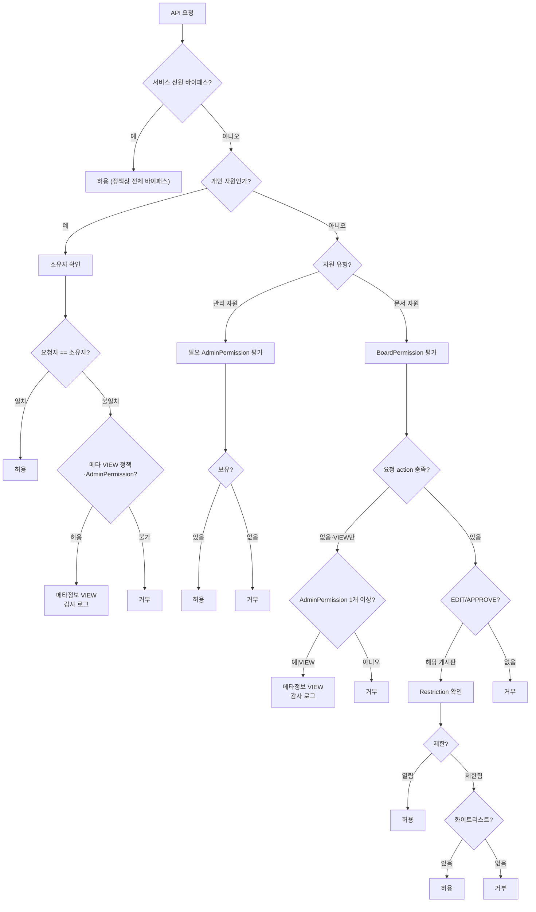
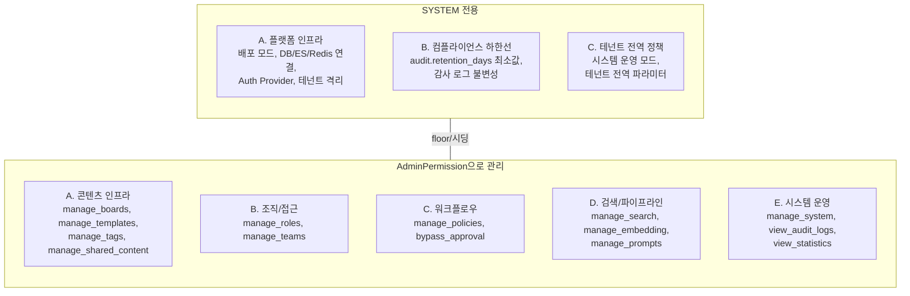

> **문서 상태**
> | 항목 | 값 |
> |------|-----|
> | 상태 | `draft` |
> | 검수 | `unreviewed` |
> | 작성일 | 2026-03-20 |
> | 최종 수정 | 2026-03-31 |

# AICM 인가 아키텍처 — 자원 분류 및 권한 체계

> AICM의 모든 관리 대상 자원을 **문서 자원**, **관리 자원**, **개인 자원**으로 분류한다. 문서 자원은 `BoardPermission`(VIEW/EDIT/APPROVE)으로 Role에 부여하며, 관리 자원은 **해당 API에 정의된 `AdminPermission`만**으로, 개인 자원은 소유자 확인(및 정책상 메타정보 VIEW)으로 제어한다. 사용자의 유효 역할(effective roles)은 직접 할당(UserRole)과 그룹 상속(TeamRole)의 **합집합**으로 결정된다. 외부 IdP·user_service의 사용자 유형·라벨은 **인가에 사용하지 않는다.**

> **이 문서와 [03-auth-architecture.md](./03-auth-architecture.md)의 역할 분담**
> - **03-auth-architecture** — **인증 흐름**(토큰 검증, AuthGuard, Provider 패턴)과 **문서 자원의 상세 권한 평가**(Board Grant → Document/Block Restriction 3계층 로직)를 다룬다.
> - **이 문서(04-permission-architecture)** — **인가 정책**(자원 분류 체계, AdminPermission 카탈로그, 전체 권한 평가 진입점)을 다룬다. §7의 권한 평가 흐름이 전체 진입점이며, 문서 자원 분기에서 03-auth §5.5의 상세 로직을 실행한다.

---

## 1. 왜 분류가 필요한가

AICM에는 세 가지 성격이 다른 자원이 존재한다.

- **문서 자원**: 게시판에 종속되며, "누가 이 문서를 보고/쓰고/승인할 수 있는가"를 제어해야 한다.
- **관리 자원**: 게시판에 종속되지 않으며, "누가 이 설정을 관리할 수 있는가"를 제어해야 한다.
- **개인 자원**: 특정 사용자에게 귀속되며, "본인만 접근할 수 있는가"를 보장해야 한다.

문서 자원은 게시판별로 세분화된 action(VIEW/EDIT/APPROVE)이 필요하고, 관리 자원은 "관리할 수 있는가/없는가"의 이진 판단만 필요하다. 개인 자원은 소유자 확인만으로 충분하다. 따라서 별도의 권한 체계로 분리한다.

```mermaid
graph TD
    subgraph docScope["문서 자원 (Board-scoped)"]
        direction TB
        B2["Document / Block"]
        B3["Comment / Like / Report"]
        B4["Approval (승인 건)"]
        B5["DocumentVersion / Attachment"]
    end

    subgraph sysScope["관리 자원 (Admin-scoped)"]
        direction TB
        S0["Board / BoardConfig / BoardPermission"]
        S2["ApprovalLineTemplate"]
        S3["Template"]
        S4["SharedContent / Tag"]
        S5["SearchConfig / ParsingConfig<br/>Synonym / StopWord / BoostRule / BoardRagConfig"]
        S6["SystemConfig"]
        S7["AuditLog"]
        S8["Team / TeamMember / TeamRole"]
    end

    subgraph userScope["개인 자원 (User-scoped)"]
        direction TB
        U1["Bookmark / BookmarkFolder"]
        U2["Notification / NotificationSetting"]
        U3["Subscription"]
    end

    subgraph authModel["권한 체계"]
        BP["BoardPermission<br/>VIEW / EDIT / APPROVE<br/>(Role에 부여)"]
        SP["AdminPermission<br/>관리 권한"]
        OWN["소유자 확인<br/>요청자 == 소유자"]
    end

    BP --> docScope
    SP --> sysScope
    OWN --> userScope
```



---

## 2. 인가와 외부 메타데이터

AICM 인가는 **AICM Role**에 부여된 `BoardPermission`·`AdminPermission`과 개인 자원 규칙만 사용한다. IdP·user_service가 내려줄 수 있는 사용자 유형·라벨은 **접근 허용 판단에 쓰지 않는다.** (`AdminPermission`은 외부 사용자 유형과 무관하게 Role에 매핑되면 적용된다.)

### 2.1 서비스 신원·인프라 전용 설정

배포 모드, DB 연결, 테넌트 라우팅 등 **인프라·환경변수**로만 바꿀 수 있는 항목은 애플리케이션 RBAC와 별도이다. 런타임에서 운영자가 바꾸는 값은 `AdminPermission`(`manage_system` 등)과 SystemConfig로 다룬다.

### 2.2 핵심 원칙

- **관리 자원**: 엔드포인트가 요구하는 `AdminPermission` 키를 유효 역할에서 합산해 보유했는지만 본다.
- **문서 자원**: `BoardPermission`과 DocumentRestriction 규칙을 따른다. 메타정보 수준 VIEW 바이패스는 **유효 역할에 AdminPermission이 하나 이상 있는 경우**에 한한다(§4.3).
- **개인 자원**: 기본은 소유자만; 타인 데이터는 정책·메타정보 VIEW(감사 로그)로 제한.

---

## 3. Role과 Group

### 3.1 Role — 단일 권한 경계

Role은 AICM의 유일한 권한 경계이다. 게시판 권한(BoardPermission)과 관리자 권한(AdminPermission)이 모두 Role에 부여된다.

```
Role "상담원"
  ├─ BoardPermission: 게시판A(VIEW), 게시판B(VIEW/EDIT)
  └─ AdminPermission: (없음)

Role "게시판 관리자"
  ├─ BoardPermission: 전체 게시판(VIEW/EDIT)
  └─ AdminPermission: manage_boards, manage_tags

Role "검색 관리자"
  ├─ BoardPermission: (필요한 만큼)
  └─ AdminPermission: manage_search
```

### 3.2 Team — 조직 단위

그룹은 동일한 역할을 공유하는 사용자 집합이다. 그룹 자체는 권한을 갖지 않으며, **TeamRole을 통해 Role을 부여**한다. 사용자는 복수의 그룹에 소속될 수 있다.

### 3.3 권한 부여 경로

권한은 모두 Role을 통해 부여되며, 사용자에게 Role을 할당하는 경로가 두 가지이다:

- **그룹을 통한 상속**: 그룹에 Role을 부여(TeamRole)하면 소속 멤버 전원이 해당 Role을 상속받는다.
- **개인 직접 할당**: 특정 사용자에게 UserRole로 Role을 직접 할당한다.

개인 직접 할당이 필요한 이유: "이 사람만 예외적으로 승인 권한이 필요해" 같은 상황에서, 해당 권한을 가진 Role을 개인에게만 할당하면 된다.

### 3.4 유효 역할(Effective Roles)과 합집합 모델

사용자의 **유효 역할** = UserRole(직접 할당) ∪ TeamMember→Team→TeamRole(그룹 상속).

모든 유효 역할에서 받은 권한을 **합산**한다. deny(명시적 거부) 개념은 두지 않는다.

**예시:**
- 김OO이 그룹A 소속 → 그룹A에 "상담원" Role 부여됨 → 게시판X(VIEW), 게시판Y(VIEW/EDIT)
- 김OO에게 "게시판X 승인자" Role 직접 할당 → 게시판X(APPROVE)
- → 김OO의 유효 역할: {"상담원", "게시판X 승인자"}
- → 최종 권한: 게시판X(VIEW + APPROVE), 게시판Y(VIEW + EDIT)

**권한 체크 로직:**
```
이 사용자가 이 게시판에 EDIT 권한이 있는가?
  1. 유효 역할 산출: UserRole(직접) ∪ TeamMember→TeamRole(상속)
  2. BoardPermission WHERE role_id IN (유효 역할) AND board_id = 대상 AND action = 'EDIT'
  3. 하나라도 있으면 → 허용
```

> **캐싱 전략**: 유효 역할 산출 결과는 Redis에 캐싱한다 (키: `{tenant_id}:cache:auth:effective-roles:{user_id}`, TTL 5분). 모든 권한 관련 변경(UserRole·TeamMember·TeamRole·Team 구조)은 이벤트 기반 즉시 무효화한다. Redis 장애 시 매 요청 DB 조회로 fallback한다. 상세 전략은 [03-auth-architecture.md §9](./03-auth-architecture.md#9-권한-캐싱-및-무효화-전략)를 참조한다.

> **Team 계층 설계 근거**: Team의 재귀 트리(parent_id) 구조와 상위 역할 자동 상속은 고객사 조직도 패턴(부서 → 팀 → 파트)을 지원하기 위한 설계이다. 조직도 조회는 OrgProvider 인터페이스로 추상화하여, 데이터 소스(AICM DB / 외부 UserService)를 환경변수(`ORG_SOURCE`)로 전환 가능하다. Team 계층 확장 및 OrgProvider 패턴의 상세 결정 사항은 [ADR-005](../adr/005-usergroup-hierarchy-and-org-provider.md)를 참조한다.

### 3.5 합집합 모델의 제약

합집합 모델에서는 "특정 사용자만 접근을 차단"하는 것이 불가능하다. 역할에 권한이 있으면 개인에게서 뺄 수 없다. 이 케이스가 필요하면 해당 사용자를 그룹에서 제외하거나 Role을 회수하는 것으로 대응한다.

> deny 개념을 도입하면 권한 디버깅 복잡도가 극단적으로 올라간다. 초기에는 합집합 모델로 시작하는 것을 강력히 권장한다.

---

## 4. 문서 자원 (Board-scoped)

게시판에 소속되며, `BoardPermission`의 action(VIEW/EDIT/APPROVE)으로 접근을 제어한다. 게시판 A의 권한으로 게시판 B의 자원에 접근할 수 없다. 해당 Role이 사용자에게 부여된 경우 적용된다.

### 4.1 자원 목록

| 자원 | 소속 모듈 | 권한 제어 | 설명 |
|------|----------|----------|------|
| **Document** | DocumentModule | VIEW(열람), EDIT(작성/수정/삭제) | 문서 CRUD |
| **Block** | DocumentModule | 문서 권한 상속 | 문서 내 블록 콘텐츠 |
| **DocumentVersion / BlockSnapshot** | DocumentModule | VIEW | 문서 버전 열람 |
| **DocumentAttachment** | DocumentModule | EDIT | 문서 첨부 파일 |
| **Chunk** | DocumentModule | — (내부 파이프라인) | 청킹 결과 (사용자 직접 접근 없음) |
| **Approval** (승인 건) | ApprovalModule | APPROVE | 개별 승인 요청/처리 |
| **ApprovalStepResult** | ApprovalModule | APPROVE | 단계별 승인 결과 |
| **ApprovalDecision** | ApprovalModule | APPROVE | 개별 승인자 판단 |
| **Comment** | CommunityModule | VIEW(열람), EDIT(작성) | 문서 댓글 |
| **Like** | CommunityModule | VIEW | 좋아요 |
| **Report** | CommunityModule | EDIT(신고) | 문서/댓글 신고 접수 |

### 4.2 BoardPermission

#### action 정의

| Action | 의미 | 부여 대상 | 비고 |
|--------|------|----------|------|
| **VIEW** | 게시판 내 문서/블록 열람 | Role | Role·UserRole·TeamRole 경로로 부여 |
| **EDIT** | 문서 작성/수정/삭제 | Role | 동일 |
| **APPROVE** | 타인이 작성한 문서의 승인/반려 | Role | 동일 |

#### 부여 구조

BoardPermission은 Role 단위로 게시판별 action을 할당한다:

```
BoardPermission (
  board_id   FK → Board,
  role_id    FK → Role,
  action     ENUM('VIEW', 'EDIT', 'APPROVE')
)
```

사용자의 유효 역할(§3.4)을 통해 해당 게시판의 action 보유 여부를 판단한다.

### 4.2.1 게시판 트리 구조

게시판은 `parent_id`를 통한 재귀 트리 구조이며, 무한 뎁스가 가능하다. Board 자체가 분류 체계(폴더) 역할을 겸한다.

**핵심 원칙:**
- 각 게시판의 BoardPermission은 **완전 독립** — 부모 게시판의 권한이 자식에게 상속되지 않는다
- 부모에 권한이 없어도 자식에 접근 가능 — 트리는 UI 네비게이션용일 뿐 권한 계산에 영향 없음
- `parent_id = NULL`이면 최상위 게시판

### 4.3 메타정보 VIEW 바이패스 (AdminPermission 보유자)

유효 역할에 **AdminPermission이 하나 이상** 매핑된 사용자는, 해당 게시판에 `BoardPermission(VIEW)`가 없어도 문서를 **메타정보 수준으로만** 열람할 수 있다. 이는 관리 사각지대를 방지하기 위한 것이다.

- VIEW만 바이패스된다. EDIT/APPROVE는 BoardPermission이 필요하다.
- DocumentRestriction이 걸린 문서도 메타정보 VIEW 바이패스 규칙이 적용된다 (§4.5 참조).
- 바이패스로 열람한 경우 감사 로그에 기록된다.

### 4.4 권한 상속 구조

```
Board (BoardPermission: Role에 VIEW/EDIT/APPROVE 부여)
  │
  └── Document (게시판 권한 상속)
        ├── Block (문서 권한 상속)
        ├── Comment (문서 권한 상속)
        ├── Like (VIEW 상속)
        └── Approval (APPROVE로 처리)
              ├── ApprovalStepResult
              └── ApprovalDecision

예외: DocumentRestriction
  → restricted=true 시 상속 차단, 지정된 User 또는 Group만 접근
  → §4.5 참조
```

### 4.5 DocumentRestriction

문서에는 접근 제한(Restriction)을 설정할 수 있다. 제한이 걸리면 게시판 권한 상속이 차단되고, **화이트리스트에 지정된 User 또는 Group만** 접근 가능하다.

#### 동작 방식

| 상태 | 동작 |
|------|------|
| **열림** (기본, `restricted = false`) | 상위(게시판/문서) 권한 그대로 상속 |
| **제한됨** (`restricted = true`) | 화이트리스트에 지정된 User 또는 Group만 접근, 나머지 차단 |

#### Restriction action

DocumentRestriction에 지정하는 action은 BoardPermission과 동일한 체계를 사용한다.

| Action | 의미 |
|--------|------|
| **VIEW** | 제한된 문서 열람 |
| **EDIT** | 제한된 문서 수정 |
| **APPROVE** | 제한된 문서의 승인/반려 |

#### 제한 설정 권한

DocumentRestriction의 설정(`is_restricted` 변경, 화이트리스트 관리)은 **두 경로**로 가능하다.

| 주체 | 설정 가능 여부 | 동기 |
|------|-------------|------|
| **해당 게시판 APPROVE 보유자** | 가능 | 비즈니스 판단 — 승인 업무 흐름 내에서 "이 문서는 특정 사용자만 접근해야 한다"고 결정 |
| **`manage_boards` AdminPermission 보유자** | 가능 | 운영 판단 — APPROVE 보유자 부재 시 override, 잘못된 설정 정리, 비상 해제 |
| **그 외** | 불가 | — |

모든 Restriction 변경은 감사 로그에 기록된다.

#### 제한 문서 접근

| 주체 | 제한 문서 VIEW | 제한 문서 EDIT/APPROVE | Restriction 설정 |
|------|-------------|---------------------|----------------|
| **서비스 신원(정책 바이패스)** | 정책에 따름 | 정책에 따름 | 정책에 따름 |
| **AdminPermission 보유자(메타)** | **메타정보** (감사 로그) | 화이트리스트 필요 | `manage_boards` 보유 시 가능 |
| **APPROVE 보유자** | 화이트리스트 필요 | 화이트리스트 필요 | 가능 |
| **그 외** | 화이트리스트 필요 | 화이트리스트 필요 | 불가 |

> **설계 근거**: 메타정보 VIEW와 Restriction — 협업 사용자 간 접근 제어가 본 목적이며, `manage_boards`로 제한을 다루려면 메타 수준 열람이 필요하다.

#### 제한 대상 단위

- **User 개인 또는 Group 단위** 허용 — 화이트리스트는 polymorphic 구조를 사용한다:

```
RestrictionEntry (
  restriction_id,
  subject_type  ENUM('USER', 'TEAM'),
  subject_id,
  action        ENUM('VIEW', 'EDIT', 'APPROVE')
)
```

- `subject_type = 'USER'`이면 `subject_id`는 외부 user_id를 참조한다.
- `subject_type = 'TEAM'`이면 `subject_id`는 team_id를 참조한다. 해당 팀의 active 멤버(TeamMember) 전원에게 지정된 action이 허용된다. 팀의 Role이 아니라 **소속 여부만** 확인한다.

> **설계 근거 — Role이 아닌 Team을 사용하는 이유**: Restriction은 BoardPermission 상속을 차단하고 화이트리스트 대상만 허용하는 **축소 메커니즘**이다. 정규 권한 경로(BoardPermission)가 Role 기반인데, 그 상속을 끊어놓고 다시 Role로 허용 대상을 정하는 것은 의미적으로 모순된다. 화이트리스트는 "누구(실체)"를 지정하는 것이므로, 개인(USER)과 조직 단위(TEAM)로 충분하다. Team은 "이 팀 전원에게 허용"이라는 직관적 의미를 갖는 반면, Role은 간접 참조라 어떤 Role을 골라야 하는지 모호하고, Role이 다른 팀에 부여되면 의도치 않은 접근 범위 확대가 발생한다.

> **BoardPermission 선행 조건**: Restriction 화이트리스트에 등록되어 있더라도 해당 게시판의 BoardPermission이 없으면 접근 불가하다. Restriction은 BoardPermission이 열어준 범위를 **축소**하는 것이지, BoardPermission 없이 독립적으로 접근을 부여하지 않는다. 화이트리스트에 게시판 권한이 없는 User나 Group이 포함된 경우는 휴먼 에러이며, UI에서 경고를 표시하되 차단하지는 않는다 (해당 대상이 나중에 게시판 권한을 받을 수 있으므로).

```
예시:
게시판: 해외주식 → Role "상담원"에 VIEW/EDIT 부여

  문서1 [열림]   → 상담원 역할 보유자 전원 보임/편집 가능
  문서2 [열림]   → 상담원 역할 보유자 전원 보임/편집 가능
  문서3 [제한됨] → 김OO(USER, VIEW/EDIT), Group "품질관리팀"(GROUP, VIEW)
                   품질관리팀 소속 멤버 전원 VIEW 가능
                   나머지에게 아예 안 보임
                   AdminPermission 보유자는 메타정보 VIEW 가능 (감사 로그 기록)

    문서3 내부:
      블록1 [열림]   → 문서3 접근자 전원 보임
      블록2 [열림]   → 문서3 접근자 전원 보임
      블록3 [열림]   → 문서3 접근자 전원 보임
```

#### 범용성 고려

- DocumentRestriction은 **선택적 부가 기능**이다.
- 시스템 설정(system only)에서 "문서 레벨 접근 제한 기능" on/off를 제공한다.
- off 시 모든 문서가 게시판 권한만 따름 (`restricted = false` 고정), on 시 문서별 제한 설정 가능.
- 고객사가 필요 없으면 off, 금융권처럼 정보 차단벽이 필요하면 on.

---

## 5. 관리 자원 (Admin-scoped)

게시판에 종속되지 않고 시스템 전체에서 공유되는 자원. **해당 API에 정의된 `AdminPermission`을 유효 역할 합산으로 보유한 경우에만** 접근 가능하다. 외부 역할 라벨은 검사하지 않는다.

### 5.1 인프라·환경 전용 자원

배포 모드, DB 커넥션 등 **환경변수·인프라**로만 관리되는 항목은 RBAC 밖이다.

| 관리 영역 | 대상 | 설명 |
|-----------|------|------|
| **전역 공통 설정** | 배포 모드, 테넌트 파라미터 | 인프라 수준의 전역 설정 |
| **전역 정책 모드** | 시스템 운영 모드 | 시스템 전체에 영향을 미치는 정책 변경 |

### 5.2 관리 자원과 AdminPermission 매핑

`AdminPermission` 키별로 허용되는 관리 자원이다.

| 관리 영역 | 권한 키 | 대상 자원 | 설명 | 상태 |
|-----------|---------|----------|------|------|
| **역할/권한** | `manage_roles` | Role, AdminPermission, BoardPermission, UserRole | 역할 CRUD, 권한 부여/해제. 위험도 Critical — "권한의 권한" | `계획` |
| **게시판** | `manage_boards` | Board, BoardConfig, BoardPermission, DocumentRestriction, Report(처리) | 게시판 설정, 문서 제한 관리, 신고 처리 | 기존 |
| **그룹** | `manage_teams` | Team, TeamMember, TeamRole | 그룹 생성/수정/삭제, 멤버 관리, 그룹 역할 부여 | 기존 |
| **승인 라인 템플릿** | `manage_policies` | ApprovalLineTemplate (steps JSONB — ApprovalLineTemplateStep 구조) | 재사용 가능한 승인 라인(다단계) 템플릿 설계 | 기존 |
| **템플릿** | `manage_templates` | Template | 문서 작성 템플릿 CRUD | 기존 |
| **태그** | `manage_tags` | Tag | 태그 병합/삭제/이름 변경 | 기존 |
| **공통 컨텐츠** | `manage_shared_content` | SharedContent | 공유 블록 CRUD | 기존 |
| **검색 튜닝** | `manage_search` | SearchConfig, ParsingConfig, Synonym, StopWord, BoostRule, BoardRagConfig, BoardParsingOverride, TemplateChunkingRule | 검색·파싱 설정, 동의어/불용어/부스팅 | 기존 |
| **임베딩 파이프라인** | `manage_embedding` | 임베딩 큐 상태, 실패 문서, 대량 재임베딩 | 임베딩 모니터링·수동 재시도 | `계획` |
| **AI 프롬프트** | `manage_prompts` | 테넌트 프롬프트, 프롬프트 테스트, AI 사용 통계 | 프롬프트 편집·테스트, AI 사용 현황 조회 | 기존 |
| **시스템 설정** | `manage_system` | SystemConfig | 파일 제한, 알림 기본값 등 | 기존 |
| **감사 로그** | `view_audit_logs` | AuditLog | 감사 로그 조회/내보내기 | 기존 |
| **통계 대시보드** | `view_statistics` | 집계 데이터 | 일별/주별 문서 등록 수, 활성 사용자, 검색 트렌드 조회 | `계획` |
| **승인 우회** | `bypass_approval` | Approval | 긴급 발행 (승인 절차 스킵) | 기존 |

> `계획` 상태 권한은 부록 A에서 상세 정의되어 있으며, `manage_roles`와 `manage_teams`의 차이는 부록 A.2를 참조한다.

> **DocumentRestriction의 이중 위치**: Restriction의 데이터는 문서에 대한 접근 제어이지만, **Restriction 설정 자체의 관리**는 관리 자원(`manage_boards`) 또는 문서 자원(APPROVE) 양쪽에서 가능하다 (§4.5 참조).

### 5.3 관리 권한의 성격

관리 자원의 권한은 문서 자원처럼 VIEW/EDIT/APPROVE 개념이 아니다. "**해당 영역을 운영(관리)할 수 있는가**"의 이진 판단이다.

- 권한이 있으면: 해당 자원의 CRUD 전체 가능
- 권한이 없으면: 해당 관리 화면 자체에 접근 불가 (`ACL_PERMISSION_DENIED`)

### 5.4 AdminPermission 설계

#### AdminPermission 테이블

```
AdminPermission (
  role_id        FK → Role,
  permission_key VARCHAR(50)
)
```

- Role에 관리 권한을 부여하는 매핑 테이블이다.
- `permission_key`는 앱 레벨에서 허용 키 목록을 검증한다 (확장 가능성을 고려하여 DB CHECK 대신 앱 검증).
- 유효 역할에 매핑된 `AdminPermission`만 평가한다.
- 상세 DDL은 [auth-module.md](../03-module-design/auth/data.md) 참조.

#### Role 부여와 AdminPermission

UserRole·TeamRole로 Role을 부여하면, 그 Role에 연결된 `AdminPermission`이 **외부 역할 라벨과 무관하게** 적용된다. 운영 정책상 UI 경고를 둘 수는 있으나, 인가 판단은 `AdminPermission`만으로 한다.

> **역할 변경의 세션 반영**: 역할 부여/회수는 Redis 캐시 무효화로 즉시 반영한다. UserRole 변경 시 해당 사용자의 유효 역할 캐시(`effective-roles:{user_id}`)와 AdminPermission 캐시(`admin-permissions:{user_id}`)를 삭제한다. 상세는 [03-auth-architecture.md §9](./03-auth-architecture.md#9-권한-캐싱-및-무효화-전략) 참조.

#### 프리셋·예시 Role별 권한

| Role 이름 | AdminPermission 키 | BoardPermission | 설명 |
|-----------|-------------------|-----------------|------|
| 게시판 관리자 | `manage_boards` | 전체 게시판 VIEW/EDIT | 게시판 설정, 제한 관리, 신고 처리 |
| 그룹 관리자 | `manage_teams` | (필요한 만큼) | 그룹 구성 및 멤버십 관리 |
| 승인 라인 템플릿 관리자 | `manage_policies` | (필요한 만큼) | 승인 라인 템플릿 설계 |
| 콘텐츠 관리자 | `manage_templates`, `manage_tags`, `manage_shared_content` | (필요한 만큼) | 템플릿, 태그, 공통 컨텐츠 |
| 검색 관리자 | `manage_search` | (필요한 만큼) | 검색 튜닝 전담 |
| 감사관 | `view_audit_logs` | (필요한 만큼) | 감사 로그만 |
| 전역 운영 Role(예시) | 전부 | 전체 게시판 VIEW/EDIT/APPROVE | 모든 관리 자원 관리 |

> 문서 권한(VIEW/EDIT/APPROVE)은 `BoardPermission`에서 제어한다. 하나의 Role에 BoardPermission과 AdminPermission을 함께 부여할 수 있다.

---

## 6. 개인 자원 (User-scoped)

게시판에도 시스템에도 종속되지 않고 **개인에게 귀속**되는 자원. **기본은 소유자만** 접근 가능하다.

| 자원 | 소속 모듈 | 접근 | 설명 |
|------|----------|------|------|
| **Bookmark / BookmarkFolder** | CommunityModule | 본인 — 타인 메타정보 VIEW는 AdminPermission 정책 | 개인 북마크 |
| **NotificationSetting** | NotificationModule | 본인 — 동일 | 개인 알림 설정 |
| **Notification** | NotificationModule | 본인 — 동일 | 수신 알림 |
| **Subscription** | NotificationModule | 본인 — 동일 | 게시판 구독 |

> **개인 자원 경계**: 타인의 개인 자원을 열람할 수 있는 경우는 **메타정보 VIEW**로 한정하고, `AdminPermission` 보유 여부와 감사 로그로 근거를 남긴다. 서비스 신원 바이패스는 별도 정책.

---

## 7. 권한 평가 종합 흐름

> **03-auth-architecture.md §5.5와의 관계**: 이 flowchart가 **전체 권한 평가의 진입점**이다. 문서 자원 분기에서 BoardPermission 평가 → Restriction 확인은 03-auth-architecture.md §5.5의 상세 로직(Board Grant → Document Restriction → Block Restriction 3계층 평가)을 실행한다. 구현 시 이 flowchart를 최상위 분기로 사용하고, 문서 자원 세부 평가는 03-auth §5.5를 참조한다.



**BoardPermission 평가 상세** (§3.4 유효 역할 합집합):

```
이 사용자가 이 게시판에 요청된 action을 갖고 있는가?
  1. 유효 역할 산출: UserRole(직접) ∪ TeamMember→TeamRole(상속)
  2. BoardPermission WHERE role_id IN (유효 역할) AND board_id = 대상 AND action = 요청 action
  3. 하나라도 있으면 → 허용
```

---

## 8. 관리 화면 매핑

### 8.1 문서 영역 — 게시판 내

| 화면 | 필요 권한 | 대상 자원 |
|------|----------|----------|
| 문서 목록/상세 | Board VIEW | Document, Block, Comment, Like |
| 문서 작성/수정 | Board EDIT | Document, Block, DocumentAttachment |
| 승인 대기함 | Board APPROVE | Approval, ApprovalStepResult, ApprovalDecision |
| Restriction 설정 | Board APPROVE 또는 `manage_boards` | DocumentRestriction |
| 신고 접수 | Board EDIT | Report (접수만, 처리는 `manage_boards`) |

### 8.2 인프라·환경 전용 (RBAC 밖)

| 항목 | 저장소 | 비고 |
|------|--------|------|
| 배포 모드, 테넌트 파라미터 | 환경변수·인프라 | 런타임 UI에서 변경 불가 |

### 8.3 관리 화면 — AdminPermission

| 화면 | 필요 권한 | 대상 자원 |
|------|----------|----------|
| 게시판 설정 | `manage_boards` | Board, BoardConfig, BoardPermission |
| 문서 제한 관리 | `manage_boards` | DocumentRestriction |
| 신고 처리 | `manage_boards` | Report (처리) |
| 그룹 관리 | `manage_teams` | Team, TeamMember, TeamRole |
| 승인 라인 템플릿 관리 | `manage_policies` | ApprovalLineTemplate (단계는 steps JSONB) |
| 템플릿 관리 | `manage_templates` | Template |
| 태그 관리 | `manage_tags` | Tag |
| 공통 컨텐츠 관리 | `manage_shared_content` | SharedContent |
| 검색 튜닝 | `manage_search` | SearchConfig, ParsingConfig, Synonym, StopWord, BoostRule, BoardRagConfig, BoardParsingOverride, TemplateChunkingRule |
| 시스템 설정 | `manage_system` | SystemConfig |
| 감사 로그 | `view_audit_logs` | AuditLog |

### 8.4 개인 영역

| 화면 | 필요 권한 | 대상 자원 |
|------|----------|----------|
| 북마크 (본인) | 본인 | Bookmark, BookmarkFolder |
| 알림 설정 (본인) | 본인 | NotificationSetting |
| 알림 목록 (본인) | 본인 | Notification |
| 구독 관리 (본인) | 본인 | Subscription |
| 사용자별 북마크/구독 조회 (관리) | 정책상 AdminPermission·메타 VIEW | Bookmark, Subscription (VIEW only) |

---

## 9. 사이드바 렌더링

### 9.1 알고리즘

```
1. 유저의 유효 역할(effective roles) 산출
   = UserRole(직접) ∪ TeamMember→Team→TeamRole(그룹 상속)

2. 접근 가능 게시판 ID 목록 조회
   = BoardPermission WHERE role_id IN (유효 역할) AND action = 'VIEW'

3. 접근 가능 게시판 각각에 대해 루트까지 부모 경로 역추적

4. 트리 구성:
   - 접근 가능 게시판: 정상 노드 (클릭 → 문서 목록)
   - 경로상 부모 게시판 (권한 없음): 폴더 노드 (펼침/접힘만)
   - 그 외 게시판: 숨김

5. 최상위 게시판 중 하위에 접근 가능 게시판이 0개인 것: 아예 안 보임
```

### 9.2 보안 옵션

SystemConfig `sidebar.show_board_path`로 제어:

| 설정 | 동작 |
|------|------|
| `true` (기본) | 접근 불가 상위 게시판을 폴더로 표시 (경로 노출) |
| `false` | 접근 가능 게시판만 플랫 리스트로 표시 |

### 9.3 폴더 노드 동작

| 사용자 동작 | 권한 있는 게시판 | 권한 없는 상위 (폴더) |
|------------|---------------|-------------------|
| 사이드바 클릭 | 문서 목록 페이지 이동 | 하위 트리 펼침/접힘만 |
| 문서 검색 | 검색 대상 포함 | 검색 대상 아님 |
| URL 직접 접근 | 정상 접근 | 403 |

---

## 관련 문서

- [인증 아키텍처](./03-auth-architecture.md) — 인증 흐름, 토큰 검증, AuthGuard
- [AuthModule 엔티티](../03-module-design/auth/data.md) — Role, UserRole, AdminPermission, Team, TeamMember, TeamRole
- [BoardModule 엔티티](../03-module-design/board/data.md) — BoardPermission
- [ApprovalModule 엔티티](../03-module-design/approval/data.md) — ApprovalLineTemplate
- [승인 권한 평가](../01-requirements/flows/approval-permission/04-permission-evaluation.md) — APPROVE/BYPASS 판정 로직

### Cascading 변경 필요

이 문서의 변경에 따라 다음 아키텍처 문서들의 갱신이 필요하다:

| 문서 | 변경 내용 |
|------|----------|
| [03-auth-architecture.md](./03-auth-architecture.md) | BoardAction enum `MANAGE` → `APPROVE`, PermissionService 인터페이스, 권한 평가 flowchart, Board Grant 예시, 메타정보 VIEW 바이패스 로직 추가, 개인 자원 메타정보 VIEW 바이패스 추가, **유효 역할(effective roles) 합집합 로직 추가**, Restriction subject_type `ROLE` → `GROUP` + ERD 반영 (**완료**) |
| [board-module.md](../03-module-design/board/data.md) | BoardPermission.action CHECK 제약 `MANAGE` → `APPROVE` (**완료**) |
| [document-module.md](../03-module-design/document/data.md) | DocumentRestriction subject_type `ROLE` → `GROUP` (**완료**), action `MANAGE` → `APPROVE` (**완료**) |
| [auth-module.md](../03-module-design/auth/data.md) | **AdminPermission, Team, TeamMember, TeamRole 엔티티 추가** (**완료**) |

---

## 부록 A. AdminPermission 관리 대상 자원 상세 분석

> 이 부록은 §5.2의 요약 테이블을 도메인별로 확장하여, 각 AdminPermission 키가 관리하는 자원과 행위를 상세히 기술한다.

### A.1 콘텐츠 인프라 (Content Infrastructure)

**`manage_boards` — 게시판/접근제한/신고**

| 자원 | 관리 행위 |
|------|----------|
| Board | 게시판 생성/수정/삭제, 타입(knowledge/community) 설정 |
| BoardConfig | approval_required, versioning_enabled, mandatory_approval_config, default_approval_template_id, 허용 템플릿, 수정 시 재승인 여부 |
| BoardPermission | 게시판별 Role-Action 매핑 관리 |
| DocumentRestriction | 문서 접근 제한 override (APPROVE 보유자도 가능) |
| Report | 신고 처리 (삭제/반려/경고) |

**`manage_templates` — 템플릿**

| 자원 | 관리 행위 |
|------|----------|
| Template | 템플릿 생성(블록 에디터), 복제(clone), 비활성, 게시판 연결 현황 |

**`manage_tags` — 태그**

| 자원 | 관리 행위 |
|------|----------|
| Tag | 태그 병합, 삭제, 이름 변경, 미사용 태그 정리 |

**`manage_shared_content` — 공통 컨텐츠**

| 자원 | 관리 행위 |
|------|----------|
| SharedContent | 공통 컨텐츠 CRUD, 비활성/대체 처리 |
| SharedContentRef | 참조 문서 목록(영향도 분석), 재임베딩 트리거 |

### A.2 조직/접근 (Organization & Access)

**`manage_roles` (NEW) — 역할/권한**

| 자원 | 관리 행위 |
|------|----------|
| Role | 역할 CRUD (이름, 설명, is_system 외 속성) |
| AdminPermission | 역할에 관리 권한 키 부여/해제 |
| BoardPermission | 역할에 게시판별 action(VIEW/EDIT/APPROVE) 부여/해제 |
| UserRole | 개인에게 역할 직접 할당/해제 |

> 위험도 Critical — "권한의 권한". 다른 사용자의 접근 범위를 변경할 수 있음.
> `manage_teams`와의 차이: `manage_teams`는 팀 구성(누가 어느 팀에 속하는지), `manage_roles`는 역할 정의(역할이 무엇을 할 수 있는지).

**`manage_teams` — 팀**

| 자원 | 관리 행위 |
|------|----------|
| Team | 팀 생성/수정/비활성 |
| TeamMember | 팀 멤버십 관리 (소속 추가/제거) |
| TeamRole | 팀에 역할 부여/해제 |

### A.3 워크플로우 (Workflow)

**`manage_policies` — 승인 라인 템플릿**

| 자원 | 관리 행위 |
|------|----------|
| ApprovalLineTemplate (`approval_line_template`) | 승인 라인 템플릿 CRUD (이름, 설명, 활성/비활성, steps JSONB) |
| (단계) | 별도 테이블 없음 — `steps` 배열 요소가 ApprovalLineTemplateStep 구조(순서, 승인 유형 ANY/ALL/COUNT, 승인자 산출 규칙 등) |

**`bypass_approval` — 긴급 발행**

| 자원 | 관리 행위 |
|------|----------|
| Approval | 승인 절차 우회하여 즉시 published 전환. 사유 필수, 감사 로그 기록 |

### A.4 검색/파이프라인 (Search & Pipeline)

**`manage_search` — 검색 튜닝**

| 자원 | 관리 행위 |
|------|----------|
| SearchConfig | 키워드 검색(필드 가중치, 불용어/동의어, 형태소 분석기) + RAG 검색(하이브리드 비율, top-K, 유사도 임계값, 리랭킹) 설정 |
| ParsingConfig | 청킹 전략, 청크 크기, 오버랩 비율 등 파싱 파이프라인 설정 |
| Synonym | 동의어 그룹 등록/수정/삭제 |
| StopWord | 불용어 관리 |
| BoostRule | 게시판/태그/문서 부스팅 규칙 |
| BoardRagConfig | 게시판별 RAG 검색 설정 오버라이드 |
| BoardParsingOverride | 게시판별 파싱/청킹 설정 오버라이드 |
| TemplateChunkingRule | 템플릿별 청킹 전략 규칙 |

**`manage_embedding` (NEW) — 임베딩 파이프라인**

| 자원 | 관리 행위 |
|------|----------|
| 임베딩 큐 상태 | 대기/처리중/완료/실패 건수 모니터링 |
| 실패 문서 | 실패 목록 조회, 수동 재시도 |
| 대량 재임베딩 | 진행률 모니터링 (공통 컨텐츠 수정, 모델 변경 시) |

**`manage_prompts` (NEW) — AI 프롬프트 관리**

| 자원 | 관리 행위 |
|------|----------|
| 테넌트 프롬프트 | 기능별 슬롯 편집 (append만, LLM Orchestrator API 경유) |
| 프롬프트 테스트 | 샘플 문서로 테스트 (LLM Orchestrator Playground) |
| AI 사용 통계 | 기능별 사용 빈도, 적용률, 피드백, 토큰 비용 (LLM Orchestrator 데이터 조회) |

### A.5 시스템 운영 (System Operations)

**`manage_system` — 운영 설정**

| 자원 | 관리 행위 |
|------|----------|
| SystemConfig | Key-Value 운영 파라미터 조정 (아래 표 참조) |

`manage_system` 권한으로 조정 가능한 SystemConfig 항목 예:

| config_key | category | 설명 |
|------------|----------|------|
| `system.max_upload_bytes` | system | 파일 업로드 최대 크기 (bytes). 설정 키: `lm:system.max_upload_bytes` |
| `file.allowed_mime_types` | file | 허용 MIME 타입 목록 |
| `notification.draft_stale_days` | notification | 드래프트 방치 알림 기준 일수 |
| `aggregation.popular_weights` | aggregation | 인기 스코어 가중치 |
| `aggregation.trending_threshold` | aggregation | 트렌딩 증가율 임계값 |
| `aggregation.trending_min_views` | aggregation | 트렌딩 최소 조회수 |
| `export.watermark_text` | export | 내보내기 워터마크 텍스트 |
| `audit.retention_days` | audit | 감사 로그 보관 기간 (**하향은 컴플라이언스 하한 이상만 — 부록 B.2 참조**) |

**`view_audit_logs` — 감사 로그**

| 자원 | 관리 행위 |
|------|----------|
| AuditLog | 필터링/검색 조회, CSV/JSON 내보내기. 수정/삭제 불가 (불변) |

**`view_statistics` (NEW) — 통계 대시보드**

| 자원 | 관리 행위 |
|------|----------|
| 집계 데이터 | 일별/주별 문서 등록 수, 활성 사용자 수, 검색 트렌드, RAG 사용 현황 조회 |

---

## 부록 B. SYSTEM 전용 설정 상세

> 인프라·정책 floor만 바꿀 수 있는 작업의 상세 분류. 분류 기준: "`manage_system` 등 앱 권한으로 바꾸면 왜 위험한가?"

### B.1 플랫폼 인프라 (Platform Infrastructure)

변경 시 시스템 아키텍처가 근본적으로 달라진다. 잘못된 변경은 서비스 장애를 유발한다.

| 설정/자원 | 설명 | 저장소 |
|-----------|------|--------|
| 배포 모드 | SaaS / 온프레미스 선택 | 환경변수 (`DEPLOY_MODE`) |
| Auth Provider | ECP 토큰 검증(SaaS) vs JWT 검증(온프렘) | 환경변수 → Provider 패턴 |
| 외부 서비스 URL | UserService, LLM Orchestrator, parser-service, retrieval-service | 환경변수 |
| DB/Redis/ES/MinIO 연결 | 커넥션 정보, 풀 설정 | 환경변수 |
| 테넌트 DB 라우팅 | 멀티테넌트 격리 전략 (스키마 분리, 커넥션 관리) | 환경변수 + 앱 설정 |

> 이 항목들은 DB가 아닌 환경변수/설정파일에 존재하며, 앱 재시작/재배포로만 변경된다.

### B.2 컴플라이언스 하한선 (Compliance Floor)

floor를 하향 조정하면 금융권 규제 위반 등 법적 위험이 발생할 수 있다.

| 설정 | 보호 방식 | 설명 |
|------|----------|------|
| `lm:audit.retention_days` | 시스템·계약 정책에 따른 **최소값**(floor) | 운영 환경에서 정한 하한 이상으로만 `manage_system` 보유자가 조정 가능. floor 자체를 낮추려면 인프라·정책 변경이 선행됨 |
| 감사 로그 불변성 | 아키텍처 제약 (append-only) | 인프라·앱 권한을 포함해 **누구도** AuditLog를 수정/삭제할 수 없음. 보관 기간 경과 후 콜드 스토리지 아카이빙만 가능 |

> **하이브리드 패턴**: `audit.retention_days`는 런타임에 정책이 정한 floor 아래로는 `manage_system` 보유자도 조정하지 못하고, floor 이상에서는 운영 유연성을 위해 상향 조정을 허용하는 방식으로 운영할 수 있다.

### B.3 테넌트 전역 정책 (Tenant-wide Policy)

시스템 전체 운영 모드를 변경하며, 모든 사용자에게 영향을 미친다.

| 설정 | 설명 |
|------|------|
| 시스템 전역 정책 모드 | 시스템 전체에 영향을 미치는 운영 모드 변경 (§5.1) |
| 테넌트 전역 파라미터 | 멀티테넌트 환경에서 테넌트 간 격리에 영향을 미치는 파라미터 |

> 이 항목들은 현재 구체적인 설정 키가 정의되지 않았다. 시스템이 성숙해지면서 추가될 수 있음.

---

## 부록 C. 인프라 floor + 운영 조정 경계

일부 자원은 **환경·정책(floor)** 과 **운영자(`manage_system` 등)** 가 나눈다. 외부 역할 라벨과 무관하다.

| 자원/설정 | 인프라·floor | 운영 조정 |
|-----------|------------|-----------|
| 기능별 운영 파라미터 (`lm:*/pm:`*) | 설치·정책에 따른 초기값 시딩 | SystemConfig에서 운영 중 조정 |
| `audit.retention_days` | 최소값(floor) 보호 | floor 이상으로 조정 |
| `is_system` Role | 시스템 초기화 시 기본 역할 생성 | 기본 역할의 권한 구성은 가능, 삭제는 불가 |

---

## 부록 D. 분류 요약 다이어그램



---

## 부록 E. AdminPermission 최종 카탈로그 (14개)

| # | 권한 키 | 도메인 | 위험도 | 작업 유형 | 스코프 후보 | 상태 |
|---|---------|--------|--------|----------|-----------|------|
| 1 | `manage_roles` | 조직/접근 | Critical | CRUD | Global | **NEW** |
| 2 | `manage_boards` | 콘텐츠 인프라 | High | CRUD | Board | 기존 |
| 3 | `manage_teams` | 조직/접근 | High | CRUD | Team | 기존 |
| 4 | `manage_policies` | 워크플로우 | High | CRUD | Global | 기존 |
| 5 | `bypass_approval` | 워크플로우 | High | 바이패스 | Board | 기존 |
| 6 | `manage_templates` | 콘텐츠 인프라 | Medium | CRUD | Global | 기존 |
| 7 | `manage_tags` | 콘텐츠 인프라 | Medium | CRUD | Global | 기존 |
| 8 | `manage_shared_content` | 콘텐츠 인프라 | Medium | CRUD | Global | 기존 |
| 9 | `manage_search` | 검색/파이프라인 | Medium | 설정 | Global | 기존 |
| 10 | `manage_embedding` | 검색/파이프라인 | Medium | 설정 | Global | **NEW** |
| 11 | `manage_prompts` | 검색/파이프라인 | Medium | 설정 | Global | 기존 |
| 12 | `manage_system` | 시스템 운영 | Critical | 설정 | Global | 기존 |
| 13 | `view_audit_logs` | 시스템 운영 | Low | 조회 | Global | 기존 |
| 14 | `view_statistics` | 시스템 운영 | Low | 조회 | Global | **NEW** |

> **스코프 후보 컬럼**: 현재 모든 AdminPermission은 **Global 스코프**(테넌트 전체)로 동작한다. "스코프 후보" 컬럼은 향후 Board/Team 단위 세분화가 필요할 수 있는 권한을 표시한 것이며, 스코프 추가 시 AdminPermission 스키마 확장 방향은 별도 ADR로 결정한다.

---

## 부록 F. KMS 게시판 권한 체계

### F.1 설계 원칙

| 원칙 | 설명 |
|------|------|
| 권한 계산 | 그룹 역할 ∪ 개인 역할 **합집합** |
| 게시판 권한 | 각 게시판 **독립**, 부모→자식 상속 없음 |
| 조직 그룹 | **재귀 트리** (parent_id, 무한 하위 뎁스), 유저는 복수 그룹 소속 가능, 상위 역할 자동 상속 |
| 게시판 구조 | **재귀 트리** (parent_id), 단 트리는 UI 네비게이션용일 뿐 |

### F.2 권한 계산 공식

```
유저 X의 게시판 Y 최종 권한
= Y에서 X에게 직접 부여된 역할의 권한 (UserRole)
∪ Y에서 X가 속한 모든 그룹에 부여된 역할의 권한 (TeamRole)
∪ Y에서 X가 속한 그룹의 상위 그룹에 부여된 역할의 권한 (상위 TeamRole 상속, 루트까지 순회)
```

### F.3 사이드바 렌더링

```
1. 유저의 접근 가능한 게시판 목록 조회
2. 상위 board 역추적하여 경로 노출
3. 권한 없는 상위 board는 폴더로만 표시 (문서 접근 불가)
4. 최상위 게시판 아래 접근 가능 게시판이 0개면 아예 안 보임
```

### F.4 운영 예시

```
그룹 계층:
  감사부서 (최상위)
  ├── 감사1팀 → 김대리, 박과장
  └── 감사2팀 → 이팀장, 최주임

감사부서(그룹)에 viewer 역할 부여 → 하위 그룹(감사1팀, 감사2팀) 소속 멤버에게 자동 상속

게시판 "약품"     → 감사부서(그룹): viewer 역할 부여
게시판 "논문"     → 감사1팀(그룹): editor 역할 부여
게시판 "VIP"      → 이팀장(개인): approver 역할 부여

결과 (합집합):
  김대리: 약품(VIEW, 감사부서 상속), 논문(VIEW+EDIT, 감사부서 상속 + 감사1팀 직접)
  박과장: 약품(VIEW, 감사부서 상속), 논문(VIEW+EDIT, 감사부서 상속 + 감사1팀 직접)
  이팀장: 약품(VIEW, 감사부서 상속), VIP(VIEW+APPROVE, 개인)
  최주임: 약품(VIEW, 감사부서 상속)
```

### F.5 확장 포인트

| 상황 | 대응 |
|------|------|
| 특정 인원 권한 제한 | 그룹에서 제외 후 개인 역할 부여 |
| 감사/컴플라이언스 요구 | Explicit Deny 레이어 추가 |
| 권한 추적 | 권한 출처 조회 화면 (어떤 그룹/개인에서 온 권한인지 표시) |

### F.6 KMS 권한 정책 FAQ

#### 게시판 권한

**Q. 상위 게시판에 역할을 부여하면 하위 게시판에도 자동 적용되나요?**

아니요. 각 게시판은 독립적으로 권한이 관리됩니다. 상위 게시판에 역할을 부여해도 하위 게시판에는 영향이 없으며, 하위 게시판에 별도로 역할을 부여해야 합니다.

**Q. 하위 게시판에만 권한이 있고 상위에는 없으면 어떻게 접근하나요?**

사이드바에서 상위 게시판은 폴더 형태로 표시되어 펼침만 가능합니다. 문서 목록은 볼 수 없고, 하위 게시판으로의 경로 역할만 합니다.

**Q. 게시판을 다른 상위 게시판 아래로 이동하면 권한이 바뀌나요?**

아니요. 권한은 게시판 자체에 부여된 것이므로 위치가 바뀌어도 기존 권한이 그대로 유지됩니다.

**Q. 게시판을 삭제하면 하위 게시판 권한은 어떻게 되나요?**

하위 게시판의 권한은 영향 없습니다. 하위 게시판이 존재하면 삭제가 차단되며(ON DELETE RESTRICT), 소프트 딜리트 시에는 하위 게시판도 재귀적으로 소프트 딜리트됩니다.

#### 그룹과 역할

**Q. 한 사람이 여러 그룹에 속해 있으면 권한이 어떻게 계산되나요?**

모든 그룹의 역할 권한이 합집합으로 계산됩니다. 예를 들어 A그룹에서 VIEW, B그룹에서 EDIT를 부여받았다면 VIEW + EDIT 모두 가집니다.

**Q. 그룹 역할과 개인 역할이 동시에 있으면 어떤 게 우선인가요?**

우선순위 없이 합집합입니다. 그룹에서 VIEW, 개인으로 APPROVE를 받았다면 VIEW + APPROVE 모두 가집니다.

**Q. 특정 사람만 권한을 줄이고 싶으면 어떻게 하나요?**

해당 그룹에서 제외한 뒤 필요한 권한만 개인 역할로 부여합니다. 합집합 모델이므로 그룹에 소속된 채로 일부 권한만 빼는 것은 불가능합니다.

**Q. 그룹은 조직도 계층 구조를 따라야 하나요?**

반드시 따를 필요는 없습니다. 그룹은 계층 구조(부모-자식, 무한 하위 뎁스)를 가질 수 있지만, 조직도와 무관하게 자유롭게 생성할 수도 있습니다. 예를 들어 "A사업부 > 가팀 > 가-1파트"처럼 조직도를 반영할 수도 있고, "준법감시팀", "프로젝트 TF", "외부 감사인" 등 목적별로 최상위 그룹을 만들 수도 있습니다. 상위 그룹에 역할을 부여하면 하위 그룹 소속 멤버에게 자동 상속됩니다.

**Q. 상위 그룹에 역할을 부여하면 하위 그룹 멤버에게도 자동 적용되나요?**

네. 상위 그룹에 부여된 역할은 하위 그룹의 모든 소속 멤버에게 자동 상속됩니다. 예를 들어 "A사업부"에 "상담원" 역할을 부여하면, A사업부 하위의 가팀, 가-1파트, 가-2파트, 나팀 등 모든 하위 그룹 소속 멤버에게 "상담원" 권한이 적용됩니다. 상속은 합산(additive-only)이며, 하위에서 상위 역할을 차단하는 것은 불가합니다.

**Q. 한 게시판에 여러 역할을 부여할 수 있나요?**

네. 같은 게시판에 그룹 A는 viewer, 그룹 B는 editor로 부여할 수 있고, 개인에게도 별도 역할을 부여할 수 있습니다.

#### 권한 추적

**Q. 이 사람이 왜 이 권한을 가지고 있는지 어떻게 확인하나요?**

권한 출처 조회 화면에서 확인할 수 있습니다. 각 권한이 어떤 그룹 역할에서 왔는지, 개인 역할에서 왔는지 표시됩니다.

**Q. 그룹을 삭제하면 소속 멤버의 권한은 어떻게 되나요?**

하위 그룹이 있으면 삭제할 수 없습니다. 하위 그룹을 먼저 정리해야 합니다. 삭제 가능한 그룹을 삭제하면, 해당 그룹을 통해 부여된 권한은 즉시 사라집니다. 다른 그룹이나 개인으로 부여받은 권한은 영향 없습니다.

#### SaaS / 납품 운영

**Q. 고객사마다 게시판 depth를 다르게 가져갈 수 있나요?**

네. 게시판이 재귀 트리 구조이므로 고객사에 따라 1depth든 3depth든 자유롭게 구성 가능합니다.

**Q. 고객사 조직이 개편되면 권한을 다시 설정해야 하나요?**

그룹 멤버십만 변경하면 됩니다. 게시판에 부여된 역할은 그룹 단위이므로, 그룹에 사람을 추가/제거하면 권한이 자동으로 반영됩니다.

**Q. 나중에 권한 제한(Deny) 기능이 필요하면 어떻게 되나요?**

현재 합집합 모델에 Explicit Deny 레이어를 추가하면 됩니다. Deny가 Allow보다 우선하는 방식으로, 기존 구조를 크게 변경하지 않고 확장 가능합니다.
