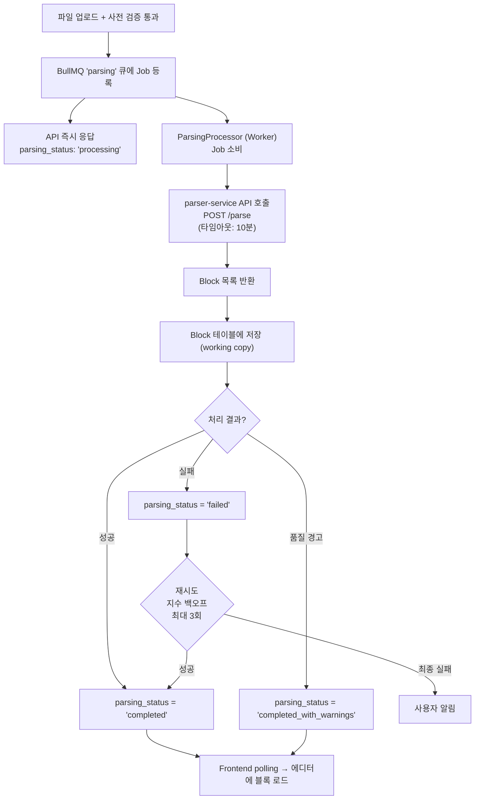
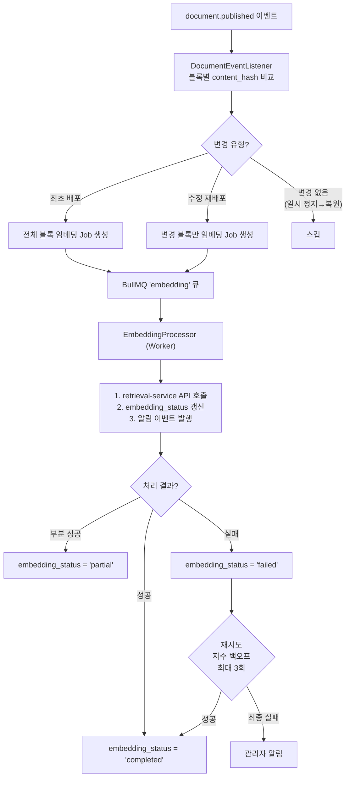
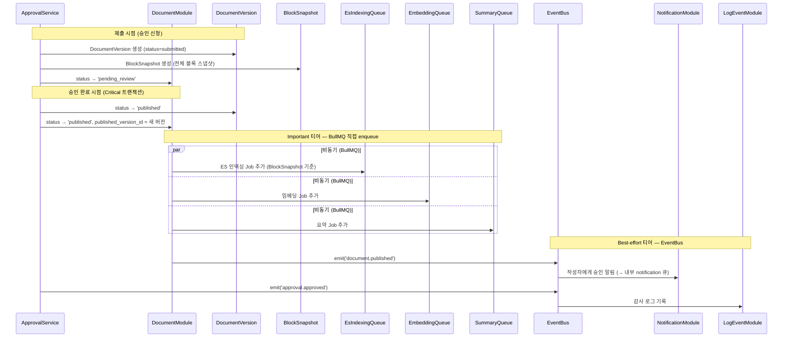
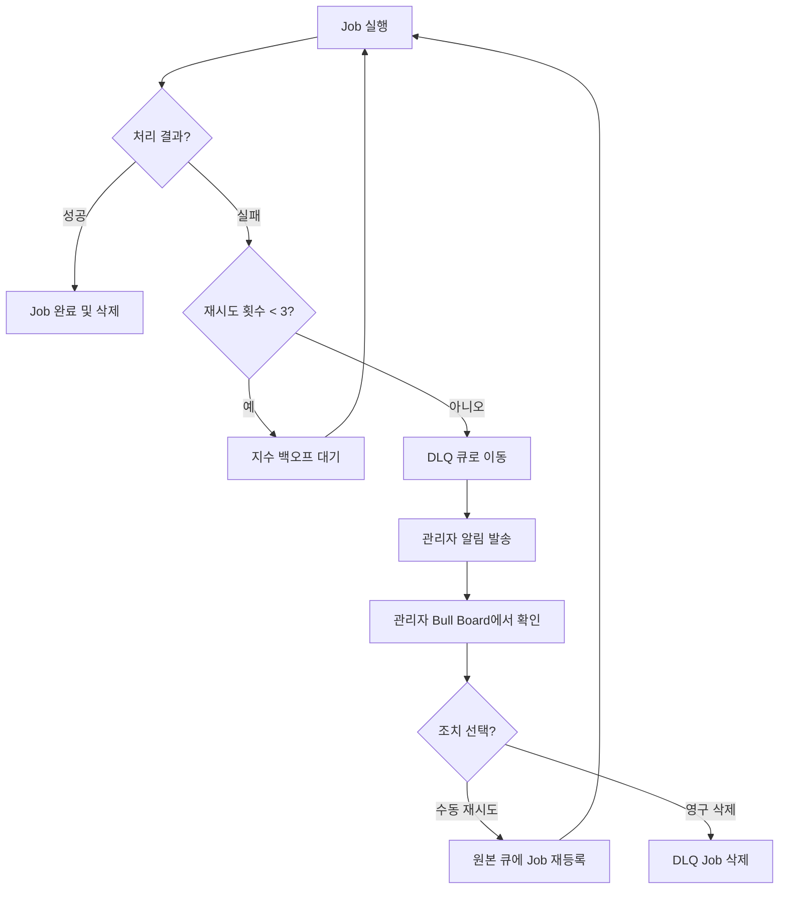

> **문서 상태**
> | 항목 | 값 |
> |------|-----|
> | 상태 | `draft` |
> | 검수 | `unreviewed` |
> | 작성일 | 2026-03-16 |
> | 최종 수정 | 2026-04-13 |
>
> **미비 사항**
> - [ ] 전체 이벤트 카탈로그 매트릭스 (모든 모듈의 발행/소비 이벤트)
> - [ ] 이벤트 페이로드 인터페이스 (TypeScript)
> - [x] DLQ(Dead Letter Queue) 처리 전략
> - [x] 큐 실패 시 수동 재시도 API
> - [x] Bull Board 모니터링 설정 상세

# 비동기 처리 아키텍처

> BullMQ 큐 설계, 임베딩 파이프라인, 예약 배포, 이벤트 흐름

### 6.1 BullMQ 큐 설계

| 큐 이름 | 용도 | 우선순위 | 동시 처리 수 | 타임아웃 |
|---------|------|---------|------------|---------|
| `parsing` | 외부 문서 파싱 (parser-service 호출) | 높음 | 설정값 (기본 2) | 10분 |
| `embedding` | 문서 청킹/임베딩 (retrieval-service 호출) | 높음 | 설정값 (기본 3) | 5분 |
| `ai-summary` | AI 자동 요약 생성 (LLM Orchestrator 호출) | 중간 | 설정값 (기본 2) | 2분 |
| `notification` | 알림 발송 (인앱, 이메일) | 중간 | 설정값 (기본 5) | 30초 |
| `scheduled-publish` | 예약 배포 실행 | 높음 | 1 | 1분 |
| `es-indexing` | Elasticsearch 인덱스 갱신 | 높음 | 설정값 (기본 3) | 1분 |
| ~~`re-embedding`~~ | ~~공통 컨텐츠 수정 시 대량 재임베딩~~ → `embedding` 큐 priority=3으로 통합 | — | — | — |
| `board.events` | 게시판 권한 변경 이벤트 (`board.permissions_updated`) | 높음 | 설정값 (기본 3) | 30초 |
| `acl.events` | ACL 변경 이벤트 (역할/팀/제한 변경 — 8개 이벤트) | 높음 | 설정값 (기본 3) | 30초 |
| `export` | 비동기 문서보내기 (PDF/DOCX/HTML/Markdown) | 중간 | 설정값 (기본 3) | 5분 |
| `search-events` | 검색 설정 변경·인덱스 재구성 이벤트 발행 (`search.config.updated`, `search.reindex.*`) | 중간 | 설정값 (기본 2) | 30초 |

> **왜 `parsing` 큐의 동시 처리 수가 2인가**: parser-service는 파싱 시 PyMuPDF, python-docx 등의 라이브러리가 메모리를 소비한다. 대용량 문서(500페이지)가 동시에 3건 이상 파싱되면 온프레미스 환경에서 OOM(Out of Memory) 위험이 있다. 동시 처리 2로 제한하되, 나머지 요청은 큐에서 대기한다. SaaS 환경에서는 parser-service 인스턴스를 스케일아웃하여 동시 처리를 늘릴 수 있다.

> **`notification` 큐와 EventBus의 2단계 패턴**: NotificationModule은 EventBus 이벤트를 수신한 뒤, 내부 `notification` BullMQ 큐에 발송 Job을 등록하여 실제 처리를 수행한다. EventBus(Best-effort)로 트리거하되, 모듈 내부에서는 BullMQ로 안정적 발송을 보장하는 패턴이다. 즉 `notification` 큐는 다른 모듈이 직접 enqueue하는 것이 아니라 NotificationModule 자체가 소유하고 관리한다. [02-module-architecture.md §3.3.1](./02-module-architecture.md) 참조.

> **스케줄 기반 내부 배치 — NestJS @Cron**: `access-log-flush`(5분 주기), `access-count-flush`(10분 주기), `access-mv-refresh`(30분~1시간 주기)는 BullMQ 큐가 아닌 NestJS `@Cron` 스케줄러 기반 내부 배치이다. **LogEventModule**이 `access-log-flush`·`access-mv-refresh`를 소유하고, **DocumentModule**이 `access-count-flush`(PG `document.view_count` 갱신)를 소유한다. `access-log-flush`는 Redis Stream의 접근 로그를 RDB `access_event_log`에 batch INSERT하고, `access-count-flush`는 Redis Hash의 조회 카운트를 PG `document.view_count`에 flush하고, `access-mv-refresh`는 접근 로그 Materialized View를 REFRESH CONCURRENTLY한다. @Cron 기반이므로 다음 주기에 자동 재실행되어 별도 DLQ를 두지 않는다. [02-module-architecture.md §3.3.1](./02-module-architecture.md) 참조.

> **공지사항 스케줄 배치**: `notice-reminder`(1시간 주기, CommunityModule)와 `notice-pin-expiry`(1시간 주기, DocumentModule)는 BullMQ 큐가 아닌 NestJS `@Cron` 스케줄러 기반 내부 배치이다. [02-module-architecture.md §3.3.1](./02-module-architecture.md) 참조.

#### 6.1.1 큐별 생산/소비 관계

| 큐 이름 | 생산자 (Enqueue) | 소비자 (Worker) | 다운스트림 |
|---------|-----------------|----------------|-----------|
| `parsing` | DocumentModule — 파일 업로드 후 파싱 트리거 | ParsingProcessor | parser-service (`POST /parse`) |
| `embedding` | DocumentModule — `document.published` 시 변경 블록 감지 후 enqueue | EmbeddingProcessor | retrieval-service (임베딩 API) |
| `ai-summary` | DocumentModule — 배포 시 요약 Job enqueue | SummaryProcessor | LLM Orchestrator |
| `notification` | NotificationModule 자체 — EventBus 수신 후 내부 enqueue | NotificationProcessor | SMTP (이메일), 인앱 저장 |
| `scheduled-publish` | ApprovalService (예약 승인) / DocumentModule (비승인 게시판 예약) | ScheduledPublishProcessor | DocumentModule (발행 트랜잭션) |
| `es-indexing` | DocumentModule — 배포/삭제/일시정지 시 | EsIndexingProcessor | Elasticsearch (`aicm_blocks`) |
| `board.events` | BoardModule — 게시판 변경/권한 설정 시 | AuthModule | Redis 권한 캐시 무효화 |
| `acl.events` | AuthModule — 역할/팀/권한 변경 시 | 권한 캐시/감사 처리 | Redis 권한 캐시 무효화 |
| `export` | ExportModule — 내보내기 요청 시 | ExportProcessor | MinIO (파일 저장) |
| `search-events` | SearchModule — 설정 변경/재인덱싱 완료 시 | retrieval-service 캐시 push + 알림 | retrieval-service, NotificationModule |

#### 6.1.2 이벤트 티어 분리

문서 배포 시 후속 처리는 **Important 티어**와 **Best-effort 티어**로 분리된다.

```
문서 승인/배포 시
  ├─ [Important 티어] BullMQ 직접 enqueue
  │   ├─ es-indexing  → ES 인덱싱
  │   ├─ embedding   → 벡터 임베딩
  │   └─ ai-summary  → AI 요약
  │
  └─ [Best-effort 티어] EventBus emit
      ├─ NotificationModule 수신 → notification 큐 (인앱/이메일)
      └─ LogEventModule 수신 → 감사 로그 기록
```

- **Important**: 데이터 정합성에 직접 관여하므로 BullMQ로 보장한다.
- **Best-effort**: 실패해도 핵심 기능에 영향이 없으므로 EventBus로 트리거한다.

### 6.2 파싱 파이프라인 흐름



### 6.3 임베딩 파이프라인 흐름



### 6.4 예약 배포 처리

```typescript
// 승인권자가 예약 배포 선택 시
const job = await this.scheduledPublishQueue.add(
  'publish',
  { documentId, approvalId },
  { delay: scheduledAt.getTime() - Date.now() }, // BullMQ delayed job
);
```

실패 시 재시도(최대 3회) + 최종 실패 시 관리자 알림 + 문서 상태는 `approved_scheduled` 유지.

### 6.5 이벤트 흐름도 (핵심 시나리오)

**문서 승인 → 배포 → 임베딩 완료까지**



> **data/aicm/rdb.md의 버전 모델과 일치**: DocumentVersion은 **제출(승인 신청) 시점**에 생성되며, 승인 완료 시에는 기존 버전의 `status`만 `submitted` → `published`로 전환된다. DocumentVersion에 `archived` 상태는 없으며, 이전 발행 버전은 `published` 상태로 이력에 남는다 (최신 발행본은 `Document.published_version_id`로 추적).

#### 이벤트 페이로드 보안 컨텍스트

모든 BullMQ Job 페이로드와 EventBus 이벤트 페이로드에는 보안 및 감사 추적을 위한 컨텍스트 필드를 포함한다.

| 필드 | 타입 | 필수 | 설명 |
|------|------|:----:|------|
| `actorId` | `string (UUID)` | ● | 작업을 트리거한 사용자 ID |
| `orgId` | `string (UUID)` | ● | 테넌트/조직 ID |
| `traceId` | `string` | ● | 분산 추적 ID (OpenTelemetry trace ID) |
| `triggeredAt` | `ISO 8601 string` | ● | 이벤트 발생 시각 |
| `sourceModule` | `string` | ○ | 이벤트를 발행한 모듈명 |

```typescript
interface AsyncJobContext {
  actorId: string;
  orgId: string;
  traceId: string;
  triggeredAt: string;
  sourceModule?: string;
}
```

> Worker에서 외부 서비스(parser-service, retrieval-service 등)를 호출할 때 `traceId`를 HTTP 헤더로 전파하여 end-to-end 추적을 보장한다. DLQ로 이동 시에도 원본 페이로드의 보안 컨텍스트가 보존되어 감사 추적이 가능하다.

#### 이벤트 버전 관리

이벤트 페이로드 스키마가 변경될 경우 하위 호환성을 보장하기 위해 다음 규칙을 적용한다.

1. **필드 추가는 자유** — 소비자는 알 수 없는 필드를 무시한다
2. **필드 제거·타입 변경은 새 이벤트명** — 기존 이벤트명에 버전 접미사를 붙이거나 새 이벤트명을 도입한다 (예: `document.published.v2`)
3. **전환 기간** — 신·구 이벤트를 병행 발행하고, 모든 소비자가 신규 버전으로 전환된 후 구 이벤트를 제거한다

> BullMQ Job의 경우 큐 이름은 유지하되 페이로드에 `version` 필드를 포함하여 스키마 버전을 식별한다. Worker는 `version`에 따라 분기 처리하거나, 지원하지 않는 버전은 DLQ로 이동시킨다.

### 6.6 DLQ(Dead Letter Queue) 전략

실패한 Job을 단순 삭제(`removeOnFail: true`)하지 않고, 전용 DLQ 큐로 이동시켜 관리자가 원인을 분석하고 수동 재시도할 수 있도록 한다.

#### 큐별 DLQ 매핑

| 원본 큐 | DLQ 큐 | 설명 |
|---------|--------|------|
| `parsing` | `parsing-dlq` | 문서 파싱 실패 |
| `embedding` | `embedding-dlq` | 임베딩 처리 실패 |
| `ai-summary` | `ai-summary-dlq` | AI 요약 생성 실패 |
| `notification` | `notification-dlq` | 알림 발송 실패 |
| `scheduled-publish` | `scheduled-publish-dlq` | 예약 배포 실패 |
| `es-indexing` | `es-indexing-dlq` | ES 인덱스 갱신 실패 |
| ~~`re-embedding`~~ | ~~`re-embedding-dlq`~~ | deprecated → `embedding` 큐 priority=3으로 통합 |
| `board.events` | `board.events-dlq` | 게시판 이벤트 처리 실패 |
| `acl.events` | `acl.events-dlq` | ACL 이벤트 처리 실패 |
| `export` | `export-dlq` | 비동기보내기 실패 |
| `search-events` | `search-events-dlq` | 검색 이벤트 처리 실패 |

#### BullMQ 실패 처리 정책

기존 `removeOnFail: true` 대신, 최대 3회 지수 백오프 재시도 후 최종 실패 시 DLQ 큐로 이동한다.

```typescript
// 큐 등록 시 기본 Job 옵션
const defaultJobOptions: JobsOptions = {
  attempts: 3,
  backoff: {
    type: 'exponential',
    delay: 5000, // 5s → 10s → 20s
  },
  removeOnComplete: true,
  removeOnFail: false, // 실패 Job 보존
};

// Worker에서 최종 실패 시 DLQ로 이동
@OnWorkerEvent('failed')
async onFailed(job: Job, error: Error) {
  if (job.attemptsMade >= job.opts.attempts) {
    await this.dlqQueue.add('dead-letter', {
      originalQueue: job.queueName,
      originalJobId: job.id,
      failedAt: new Date().toISOString(),
      attemptsMade: job.attemptsMade,
      lastError: error.message,
      payload: job.data,
    });
    await job.remove();
  }
}
```

#### DLQ Job 스키마

| 필드 | 타입 | 설명 |
|------|------|------|
| `originalQueue` | `string` | 원본 큐 이름 |
| `originalJobId` | `string` | 원본 Job ID |
| `failedAt` | `ISO 8601 string` | 최종 실패 시각 |
| `attemptsMade` | `number` | 총 시도 횟수 |
| `lastError` | `string` | 마지막 에러 메시지 |
| `payload` | `object` | 원본 Job 데이터 |

#### 관리자 DLQ 관리 API

| 메서드 | 엔드포인트 | 설명 |
|--------|-----------|------|
| `GET` | `/admin/dlq/:queue` | DLQ 조회 (페이지네이션: `page`, `limit` 파라미터) |
| `POST` | `/admin/dlq/:queue/:jobId/retry` | 단건 재시도 — 원본 큐에 동일 payload로 Job 재등록 |
| `POST` | `/admin/dlq/:queue/retry-all` | 일괄 재시도 — 배치 단위로 원본 큐에 재등록 (아래 부하 제어 참조) |
| `DELETE` | `/admin/dlq/:queue/:jobId` | 영구 삭제 — 복구 불필요한 Job 제거 |

> 모든 DLQ 관리 API는 정책으로 정한 `AdminPermission`(예: `manage_system`, `manage_embedding`)이 필요하며, 감사 로그에 기록된다.

#### Bull Board 확장

DLQ 큐를 Bull Board에 등록하여 실패 Job 현황을 실시간으로 모니터링한다.

```typescript
// Bull Board에 DLQ 큐 등록
const dlqQueues = [
  'parsing-dlq', 'embedding-dlq', 'ai-summary-dlq',
  'notification-dlq', 'scheduled-publish-dlq',
  'es-indexing-dlq', /* 're-embedding-dlq' deprecated */
  'board.events-dlq', 'acl.events-dlq',
  'export-dlq',
  'search-events-dlq',
];

for (const name of dlqQueues) {
  serverAdapter.addQueue(new BullMQAdapter(new Queue(name, { connection })));
}
```

대기 Job 수가 임계값(SystemConfig로 설정 가능, 기본 10건)을 초과하면 관리자에게 알림을 발송한다.

#### Bull Board 접근 제어

Bull Board 대시보드는 Job 페이로드(actorId, orgId, documentId 등)를 노출하므로 접근 제어가 필수이다.

| 제어 항목 | 방식 | 설명 |
|-----------|------|------|
| **인증** | 인증 미들웨어 | Bull Board 라우트(`/admin/queues`)에 AuthGuard 적용 |
| **인가** | `manage_embedding` 또는 `manage_system` AdminPermission 보유 | 큐 상태 모니터링은 시스템 운영 권한이 필요 |
| **프로덕션 제한** | 환경 기반 노출 제어 | `NODE_ENV=production` 시 Bull Board UI를 비활성화하거나 내부 네트워크에서만 접근 가능하도록 제한. SystemConfig `admin.bull_board_enabled`로 런타임 on/off |

> 모든 Bull Board 접근은 감사 로그에 기록된다.

#### DLQ 처리 흐름도



#### DLQ retry-all 부하 제어

`retry-all`은 대량 Job을 한꺼번에 원본 큐에 재투입하므로 다운스트림 서비스(parser-service, retrieval-service 등)에 부하 폭증이 가능하다. 다음 제어 방안을 적용한다.

| 제어 방안 | 설명 | 기본값 |
|-----------|------|--------|
| 배치 크기 제한 | 한 번의 `retry-all` 호출에 재등록하는 최대 Job 수 | SystemConfig로 설정 가능 (기본 50건) |
| 배치 간 딜레이 | 배치 내 Job 등록 사이 대기 시간 | SystemConfig로 설정 가능 (기본 2초) |
| 큐 대기열 확인 | 원본 큐의 대기 Job 수가 임계값 이상이면 재등록을 일시 중단 | SystemConfig로 설정 가능 (기본 100건) |

> `retry-all` API 응답에는 `{ totalRequested, actualRetried, remainingInDlq, hasMore }` 를 포함하여 관리자가 재시도 진행 상황을 파악할 수 있도록 한다. `hasMore: true`이면 추가 호출이 필요함을 의미한다.

> DLQ에서 원본 큐로 재등록된 Job은 `defaultJobOptions`(3회 지수 백오프)가 다시 적용된다. 즉 재투입된 Job이 다시 실패하면 3회 재시도 후 DLQ로 재이동한다.

### 6.7 Reconciliation 배치 강화

#### 기존 한계

현재 Reconciliation 배치는 서비스 시작 시 1회만 실행(`onApplicationBootstrap`)되므로, 외부 서비스(retrieval-service, parser-service 등) 장애가 서비스 기동 이후에 복구된 경우 자동 보정이 이루어지지 않는다.

#### 개선 방안

cron 기반 주기적 실행을 추가하여, 장애 복구 시점과 관계없이 데이터 정합성을 지속적으로 보장한다.

```typescript
@Cron(reconciliationCronExpression) // SystemConfig로 설정 가능, 기본 '*/10 * * * *' (10분)
async runReconciliation() {
  const result = await this.reconciliationService.execute();
  await this.reconciliationLogService.save(result);
}
```

#### 점검 대상

| 점검 항목 | 조건 | 조치 |
|-----------|------|------|
| 파싱 실패 문서 | PG `parsing_status = 'failed'` | `parsing` 큐에 재등록 |
| 임베딩 실패 문서 | PG `embedding_status = 'failed'` | `embedding` 큐에 재등록 |
| 벡터 수 불일치 | PG Chunk 수 vs Milvus 벡터 수 불일치 | `embedding` 큐(priority=3)로 재등록 |

#### 중복 방지

이미 큐에 대기 중인 동일 Job이 있는 경우 중복 등록을 방지한다. BullMQ의 Job ID를 `{queueName}:{documentId}` 형식으로 지정하여, 동일 문서에 대한 중복 Job 추가 시 자동으로 스킵한다.

```typescript
await this.embeddingQueue.add(
  'reconcile',
  { documentId },
  { jobId: `embedding:${documentId}` }, // 동일 ID 존재 시 스킵
);
```

#### 실행 로그

Reconciliation 실행 결과를 관리자 대시보드에 표시하여 운영 현황을 파악할 수 있도록 한다.

| 항목 | 설명 |
|------|------|
| `detectedCount` | 정합성 불일치 검출 건수 |
| `requeuedCount` | 큐 재등록 건수 (중복 스킵 제외) |
| `lastRunAt` | 마지막 Reconciliation 실행 시각 |
| `status` | 실행 결과 (`success` / `partial_failure` / `error`) |

> Reconciliation 실행 이력은 최근 30일간 보관되며, `GET /admin/reconciliation/logs` API로 조회할 수 있다.

### 6.8 큐 모니터링 메트릭

Bull Board를 통한 실시간 모니터링 외에, OpenTelemetry(SigNoz) 연동으로 히스토리컬 메트릭을 수집하여 트렌드 분석과 용량 계획에 활용한다.

#### 큐별 수집 메트릭

| 메트릭 | 설명 | 라벨 |
|--------|------|------|
| `bullmq.job.duration` | Job 처리 소요 시간 (ms) | `queue`, `status` |
| `bullmq.job.waiting_count` | 큐 대기 Job 수 | `queue` |
| `bullmq.job.completed_total` | 완료된 Job 누적 수 | `queue` |
| `bullmq.job.failed_total` | 실패한 Job 누적 수 | `queue` |
| `bullmq.dlq.size` | DLQ 적재 Job 수 | `queue` |

#### 알림 임계값

| 조건 | 알림 대상 | 채널 |
|------|-----------|------|
| DLQ 적재 > 임계값 (SystemConfig, 기본 10건) | 운영 관리자 | 인앱 + 이메일 |
| 큐 대기 > 임계값 (SystemConfig, 기본 100건), 5분 이상 지속 | 운영 관리자 | 인앱 + 이메일 |
| Job 평균 처리 시간 > 해당 큐 타임아웃의 80% | 운영 관리자 | 인앱 |

> 메트릭 수집은 BullMQ Worker의 이벤트 훅(`completed`, `failed`, `active`)에서 OpenTelemetry Meter로 기록한다. SigNoz 대시보드 설정은 [07-cross-cutting-concerns.md](./07-cross-cutting-concerns.md) 참조.

### 6.9 Worker 스케일링 가이드라인

큐 적체 알림(§6.8)을 수신했을 때의 대응 가이드.

#### 큐별 동시성(concurrency) 설정

| 큐 | 기본 concurrency | 조정 시 고려사항 |
|-----|-----------------|-----------------|
| `parsing` | 2 | parser-service 메모리 부하. 대용량 문서(500페이지+) 동시 처리 시 OOM 위험. 파서 인스턴스 스케일아웃이 선행 |
| `embedding` | 3 | retrieval-service GPU/CPU 부하. 모델 로딩 상태와 GPU 메모리 확인 후 조정 |
| `ai-summary` | 2 | LLM Orchestrator 동시 요청 제한(rate limit)에 종속 |
| `notification` | 5 | I/O 바운드(이메일 발송). 외부 SMTP 서버 rate limit 확인 |
| `es-indexing` | 3 | ES 클러스터 bulk indexing 부하. ES 노드 CPU/메모리 모니터링 |
| ~~`re-embedding`~~ | — | deprecated → `embedding` 큐 priority=3으로 통합. 별도 워커 불필요 |
| `scheduled-publish` | 1 | 순서 보장 필요. 증가 불가 |
| `board.events` | 3 | 권한 캐시 무효화 I/O. Redis 부하에 따라 조정 |
| `acl.events` | 3 | 권한 캐시 무효화 I/O. 대량 팀 구조 변경 시 캐시 삭제 범위가 넓어 Redis Pipeline 부하 모니터링 |
| `search-events` | 2 | retrieval-service 설정 push + 알림 발송. 설정 변경 빈도가 낮아 기본값 유지 |

#### 수평 확장 시 주의사항

| 환경 | 확장 방식 | 주의사항 |
|------|----------|----------|
| **SaaS** | Worker Pod HPA — 큐 대기 수(`bullmq.job.waiting_count`) 기반 오토스케일링 | 동일 큐를 여러 Worker가 소비할 때 BullMQ가 분산 락으로 중복 처리를 방지함. concurrency는 **Worker 인스턴스당** 설정이므로 인스턴스 수 × concurrency가 실제 동시 처리 수 |
| **온프렘** | aicm-service 인스턴스 수동 증설 또는 Worker 전용 프로세스 분리 | 단일 NestJS 프로세스 내 모든 큐 Worker가 동작하므로, 특정 큐 부하 집중 시 해당 큐 Worker만 별도 프로세스로 분리하여 독립 스케일링 가능 |

> Worker 확장 전 반드시 다운스트림 서비스(parser-service, retrieval-service, ES, LLM Orchestrator)의 가용 용량을 확인한다. Worker만 늘리고 다운스트림이 수용하지 못하면 타임아웃 실패가 증가한다.

### 6.10 채널 총 현황 요약

| 구분 | 개수 | 인프라 |
|------|:----:|--------|
| BullMQ 작업 큐 | 10 | Redis |
| DLQ (작업 큐 1:1 매핑) | 10 | Redis |
| EventBus 이벤트 | 7+ | 인프로세스 (NestJS EventEmitter) |
| @Cron 스케줄 배치 | 6 | NestJS 스케줄러 |
| **Redis 큐 총계** | **20** | — |

---

## 관련 문서

- [모듈 아키텍처](./02-module-architecture.md) — 이벤트 발행/소비자 다이어그램
- [데이터 아키텍처](./data/README.md) — 서비스별 데이터 아키텍처
- [외부 서비스 연동](./06-external-integration/README.md) — parser-service/retrieval-service/LLM Orchestrator 호출
