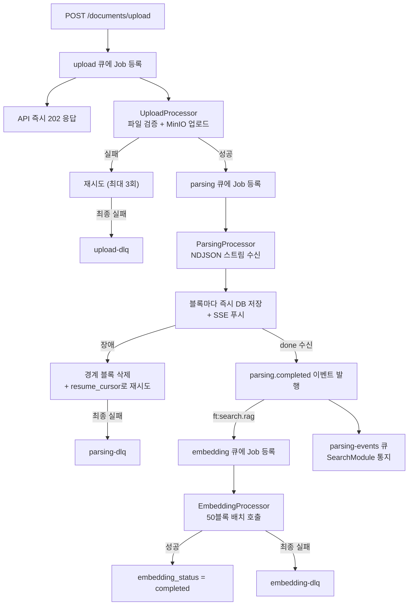
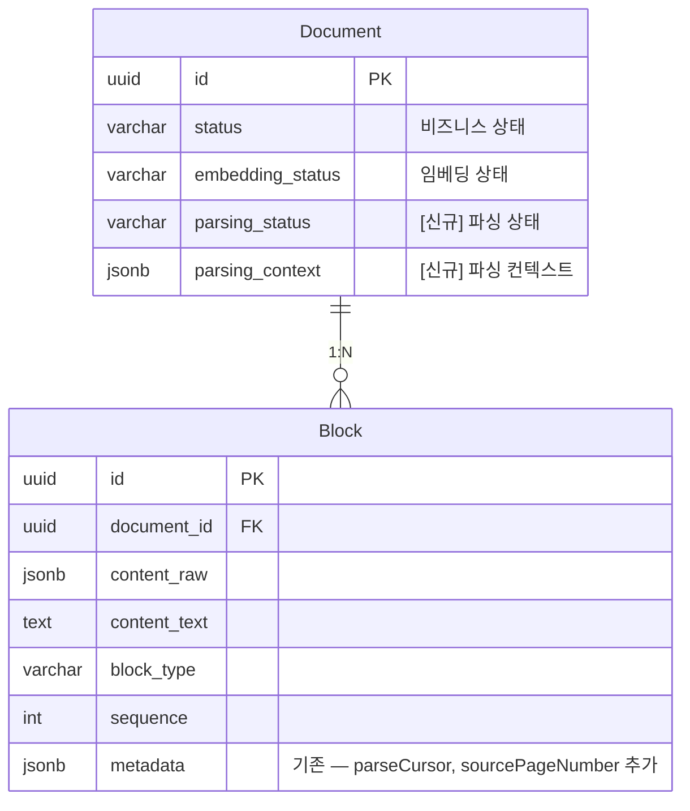

> **문서 상태**
> | 항목 | 값 |
> |------|-----|
> | 상태 | `draft` |
> | 검수 | `unreviewed` |
> | 출처 | `docs/02-architecture/06-external-integration/README.md §7.2` |
> | 최종 수정 | 2026-04-05 |

# parser-service 연동

> 원문 위치: [외부 서비스 연동 §7.2](./README.md#72-parser-servicefastapi-연동)

parser-service는 외부 문서(PDF, DOCX 등)를 파싱하여 Block 구조로 변환하는 Python 서비스이다. 세션·진행 상태·캐시를 보유하지 않는 **stateless** 서비스이며, 파싱 중 추출된 이미지는 MinIO에 직접 업로드하고 URL만 응답에 포함한다(MinIO 쓰기는 주입된 설정에 의한 부수 효과이다).

> **기본 동작**: parser-service 미설정(연결 정보 미제공) 시 외부 문서 파싱 기능을 비활성화한다. 파일 업로드 API에서 외부 문서 파싱을 요청하면 `FEATURE_DISABLED` (403)을 반환한다.

> **MinIO 접근**: parser-service는 (1) 원본 파일 읽기, (2) 추출 이미지 업로드를 위해 MinIO에 직접 접근한다. MinIO 접속 정보(endpoint, access key, secret key)는 환경변수로 주입한다. 이미지를 응답 본문에 포함하지 않으므로 이미지 수에 관계없이 응답 크기가 안정적이다.

## 설계 원칙

### 1. 파서는 stateless — 상태는 AICM이 전부 소유한다

parser-service는 `f(파일, 커서) → 블록 스트림` 형태로 동작한다. 세션, 진행 상태, 캐시를 일절 보유하지 않는다. 단, 추출 이미지를 MinIO에 직접 업로드하는 부수 효과(side effect)가 존재하며, MinIO 접속 정보는 환경변수로 주입한다. 모든 상태(파싱 진행률, 저장된 블록, 마지막 커서)는 aicm-service DB와 BullMQ에 있다.

| 상태 | 저장 위치 | 관리 주체 |
|------|-----------|-----------|
| 파일 원본 | MinIO | aicm-service |
| 파싱 진행 상태 (`parsingStatus`) | aicm DB | aicm-service |
| 파싱된 블록 | aicm DB (`blocks` 테이블) | aicm-service (ParsingProcessor) |
| 마지막 커서 (`lastCursor`) | aicm DB | aicm-service |
| Job 실행 상태 | BullMQ (Redis) | aicm-service Worker |
| 사용자 SSE 연결 | aicm API 메모리 | aicm API |
| parser-service가 보유하는 상태 | **없음** | — |

### 2. 파싱 수명과 사용자 세션은 분리된다

NDJSON 스트림은 서버 간 연결(aicm Worker ↔ parser-service)이므로 사용자 브라우저와 무관하게 동작한다. 사용자가 이탈(탭 닫기, 브라우저 크래시 등)하면 SSE 연결만 끊기며, 파싱은 백그라운드에서 완료까지 계속된다.

```
파싱 수명:    ████████████████████████████████  (항상 끝까지)
              시작                        완료

사용자 세션:  ██████████░░░░░░░██████████████
              연결        이탈    재접속

SSE 연결:    ██████████          ██████████████
              활성        끊김     재연결
```

- **사용자 이탈(의도적/비의도적)**: 파싱 계속 → 재접속 시 DB에서 블록 로드 + 잔여 블록 SSE 구독
- **사용자 명시적 취소(취소 버튼)**: 파싱 중단 → 저장된 블록 삭제 → 재업로드 시 처음부터

> 파싱은 LLM + OCR을 사용하므로 수행 비용이 높다. 사용자 이탈 시 중단하면 재접속 시 처음부터 재파싱해야 하므로, 이탈과 무관하게 완료까지 진행하는 것이 비용 효율적이다.

### 3. 블록은 도착 즉시 개별 저장된다 (점진적 저장)

ParsingProcessor는 NDJSON 스트림에서 블록을 수신할 때마다 **즉시 DB에 upsert**한다. 전체 파싱 완료를 기다리지 않는다.

- 사용자는 SSE를 통해 블록이 하나씩 화면에 나타나는 것을 볼 수 있다 (점진적 렌더링).
- 파서 장애 시 이미 저장된 블록은 유실되지 않는다.
- 프론트엔드는 `GET /documents/:id/stream` (SSE)으로 실시간 블록을 구독한다.

### 4. 불투명 커서(opaque cursor)로 장애 복구한다

parser-service는 각 블록과 함께 **커서(cursor)**를 발행한다. parser-service는 모든 입력 포맷을 **PDF로 선변환**한 뒤 파싱하므로, 커서 형식은 원본 포맷에 관계없이 페이지 단위로 통일된다. aicm-service는 커서를 해석하지 않고 그대로 저장/전달한다.

| 원본 형식 | 변환 후 | 커서 예시 |
|-----------|---------|-----------|
| PDF | (변환 없음) | `{"page": 30}` |
| DOCX | PDF 변환 | `{"page": 30}` |
| PPTX | PDF 변환 | `{"page": 15}` |
| XLSX | PDF 변환 | `{"page": 8}` |
| TXT / Markdown | PDF 변환 | `{"page": 5}` |

파서 장애 시 aicm-service는 마지막 저장된 커서를 `resume_cursor`로 전달하여 해당 페이지부터 재파싱을 요청한다. 이때 경계 블록(마지막 커서 위치의 블록)은 불완전할 수 있으므로 삭제 후 재수신한다.

> **비결정성 대응**: LLM 파싱은 동일 입력에 대해 다른 결과를 낼 수 있다. 커서 재개 시에는 이미 저장된 블록(커서 이전)은 건드리지 않고, 커서 위치부터 새로 생성된 블록만 이어 저장한다. 전체 재파싱 시 기존 블록과 불일치가 발생하는 것을 방지한다.

> **커서 재개 구현 범위**: PDF 선변환으로 모든 포맷이 페이지 단위로 파싱되므로, 커서 발행과 재개 모두 **전 포맷에서 동일하게 동작**한다. 포맷별 재개 난이도 차이가 없어 1차부터 전체 구현이 가능하다. 다만 LLM 파싱은 컨텍스트 의존적이므로, 중간 지점에서 재개 시 이전 맥락 없이 품질이 저하될 수 있다. resume 시 직전 N개 블록 텍스트를 LLM 프롬프트에 컨텍스트로 주입하는 방안을 검토한다.

## 연동 방식

aicm-service의 BullMQ 워커(ParsingProcessor)가 parser-service HTTP API를 호출한다. 모든 호출은 백그라운드 워커에서 발생하므로 API 핸들러의 HTTP 타임아웃 제약을 받지 않는다. 응답은 NDJSON 스트리밍으로 블록을 한 줄씩 전송하여, 대용량 문서에서도 양쪽 메모리 부담을 방지한다.

| 기능 | parser-service 엔드포인트 | 트리거 | 호출 주체 |
|------|-------------------------|--------|----------|
| 외부 문서 파싱 | `POST /parse` | 파일 업로드 후 사전 검증 통과 | ParsingProcessor (BullMQ `parsing` 큐) |

## 업로드 파이프라인 — 3단 큐 아키텍처

aicm-service는 파일 업로드부터 인덱싱까지의 전체 파이프라인을 BullMQ 큐 체인으로 오케스트레이션한다.

```
┌───────────┐     ┌───────────┐     ┌───────────┐
│  upload   │ ──▶ │  parsing  │ ──▶ │ embedding │
│   Queue   │     │   Queue   │     │   Queue   │
│  (c: 20)  │     │  (c: 2)   │     │  (c: 5)   │
└───────────┘     └───────────┘     └───────────┘
   I/O bound        LLM+OCR           GPU bound
   넉넉하게          가장 보수적         보수적
```

| 큐 | 트리거 | 하는 일 | 완료 시 |
|-----|--------|---------|---------|
| **upload** | API에서 파일 수신 직후 | 파일 검증, MinIO 업로드, 문서 레코드 생성 | parsing 큐에 Job 추가 |
| **parsing** | upload Job 완료 | parser-service NDJSON 스트림 호출, 블록 즉시 저장 | embedding 큐에 Job 추가 |
| **embedding** | parsing Job 완료 | retrieval-service에 배치(기본 50블록) 단위 호출 | 완료 |

각 단계의 리소스 특성에 맞춰 concurrency를 배분하는 **깔때기(funnel) 구조**이다. upload(I/O 바운드)는 넉넉하게, parsing(LLM+OCR, 가장 무거움)이 가장 좁은 병목이며, embedding(GPU 바운드)은 그 사이이다. 1,000명 동시 업로드 시에도 upload 큐에 빠르게 적재하고, 실제 파싱/임베딩은 다운스트림 서비스의 가용 리소스에 맞게 조절된다. API 핸들러는 최소 검증 + 큐 적재 + **202 즉시 응답**까지만 동기 처리한다.

### 문서 상태 전이

```
PENDING → UPLOADING → UPLOADED → PARSING → PARSED → EMBEDDING → INDEXED
                                    │                               │
                                    ├── PAUSED (사용자 이탈 후       │
                                    │    재접속 전까지의 표시용)      │
                                    ├── CANCELLED (명시적 취소)      │
                                    └── FAILED (최종 실패)          │
                                                                    └── COMPLETED
```

> `PAUSED`는 논리적 상태이다. 실제 파싱은 백그라운드에서 계속 진행되며, 사용자 화면에 "업로드 중" 표시를 위한 상태이다. 사용자가 재접속하면 현재 실제 상태(`PARSING`, `PARSED`, `INDEXED` 등)로 즉시 전환된다.

## 요청 구조

파일은 MinIO에 업로드 완료 후 내부 경로(MinIO key)를 전달한다. parser-service가 MinIO에서 직접 파일을 읽으므로 presigned URL이 아닌 내부 경로를 사용한다.

```typescript
interface ParseRequest {
  document_id: string;           // 문서 ID (이미지 업로드 경로 생성에 사용)
  file_url: string;              // MinIO 내부 경로 (예: "originals/{docId}/file.pdf")
  file_name: string;             // 원본 파일명 (확장자 포함)
  file_type: string;             // MIME type (application/pdf 등)
  image_upload_prefix: string;   // 추출 이미지 업로드 경로 (예: "documents/{docId}/images")
  resume_cursor?: Record<string, unknown>;  // 장애 복구용 불투명 커서 (생략 시 처음부터)
  options?: {
    extract_images?: boolean;    // 이미지 추출 여부 (기본: true)
    ocr_enabled?: boolean;       // OCR 활성화 (기본: false)
    language?: string;           // OCR 언어 (기본: 'ko')
  };
}
```

> **`resume_cursor`**: 파서 장애 복구 시 aicm-service가 DB에 저장해둔 마지막 커서를 그대로 전달한다. parser-service는 해당 커서 위치부터 파싱을 재개한다. 커서의 내부 형식은 문서 포맷별로 parser-service가 정의하며, aicm-service는 해석 없이 저장/전달만 한다(불투명 토큰).

> **이미지 업로드 경로 규칙**: parser-service는 추출한 이미지를 `{image_upload_prefix}/{order}-{seq}.{ext}` 경로로 MinIO에 업로드한다. 예: `documents/doc-123/images/5-001.png` (블록 순서 5의 첫 번째 이미지). 블록의 `content`에는 이 MinIO 경로가 포함된다.

## 응답 방식 — NDJSON 스트리밍

대용량 문서(수백 페이지)의 파싱 결과를 단일 JSON 응답으로 반환하면 응답 본문이 수 MB에 달하여 양쪽 메모리 부담이 발생한다. 이를 방지하기 위해 **NDJSON(Newline Delimited JSON) 스트리밍**으로 블록을 한 줄씩 전송한다.

- parser-service는 페이지/섹션을 파싱하는 즉시 블록을 스트리밍하므로, **전체 파싱 완료 전에 전송이 시작**되어 체감 처리 시간이 단축된다.
- 추출 이미지는 MinIO에 직접 업로드하고 URL만 블록에 포함하므로, 이미지 수에 관계없이 스트림 크기가 안정적이다.
- aicm-service(ParsingProcessor)는 NDJSON 라인 파서로 블록 단위 수신하여 메모리 버퍼링 없이 처리한다.

*프로토콜 요약*:

```
POST /parse
Content-Type: application/json        ← 요청은 일반 JSON
Accept: application/x-ndjson          ← 응답은 NDJSON 스트리밍

→ Response
  Content-Type: application/x-ndjson
  Transfer-Encoding: chunked

{"type":"metadata","page_count":500}
{"type":"block","order":0,"block_type":"heading","content":"...","cursor":{"page":1},"metadata":{"page_number":1,"heading_level":1}}
{"type":"block","order":1,"block_type":"text","content":"...","cursor":{"page":1},"metadata":{"page_number":1}}
{"type":"block","order":2,"block_type":"image","content":"documents/doc-123/images/2-001.png","cursor":{"page":2},"metadata":{"page_number":2}}
{"type":"heartbeat","status":"processing","detail":"page 3, table extraction"}
...
{"type":"done","parsing_duration_ms":45000,"warnings":[]}
```

*NDJSON 라인 타입 정의*:

```typescript
type ParseStreamLine =
  | ParseMetadataLine
  | ParseBlockLine
  | ParseHeartbeatLine
  | ParseDoneLine
  | ParseErrorLine;

interface ParseMetadataLine {
  type: 'metadata';
  page_count: number;            // 총 페이지 수 (PDF 선변환으로 항상 존재)
}

// TODO — content 형식 (파서팀 협의 필요):
// 현재 content를 Tiptap JSON으로 정의하면 parser-service가 프론트엔드 에디터에 종속된다.
// 파서는 에디터-무관(editor-agnostic) 중간 포맷을 반환하고,
// aicm-service의 BlockTransformer가 Tiptap JSON으로 변환하는 2-layer 구조를 검토 중이다.
// 중간 포맷 후보: 블록 구조는 JSON, 인라인 서식은 마크다운 문자열 (하이브리드).
// 확정 전까지 content 필드의 형식은 잠정적이다.
// → 상세 설계: [Content 중간 포맷 설계](./6-2-parser-content-intermediate-format.md)

interface ParseBlockLine {
  type: 'block';
  block_type: string;            // v1 지원: 'text' | 'heading' | 'table' | 'image' | 'list'
                                 // 미지원 타입은 aicm-service에서 'text'로 fallback 매핑
  content: string | object;      // 형식은 block_type에 따라 다름 (중간 포맷 확정 전 잠정)
  order: number;                 // Block 순서
  cursor: Record<string, unknown>; // 불투명 커서 — 장애 복구 시 resume_cursor로 사용
  metadata?: {
    page_number?: number;        // 원본 페이지 번호
    heading_level?: number;      // 제목 레벨 (1~6)
    original_type?: string;      // 파서 내부 세분화 타입 (향후 확장 시 재파싱 없이 활용)
  };
}

interface ParseHeartbeatLine {
  type: 'heartbeat';
  status: 'processing';          // 현재 처리 중
  detail?: string;               // 진행 상황 (예: "page 45, table extraction")
}

interface ParseDoneLine {
  type: 'done';
  parsing_duration_ms: number;   // 파싱 소요 시간 (ms)
  warnings?: string[];           // 품질 경고 메시지
}

interface ParseErrorLine {
  type: 'error';
  code: string;                  // 에러 코드 (PARSE_FAILED 등)
  message: string;               // 에러 상세 메시지
}
```

> **`metadata` 라인은 항상 첫 번째로 전송**된다. ParsingProcessor는 이 라인을 수신한 뒤 블록 수신을 시작한다. `heartbeat` 라인은 블록 생산이 지연될 때 30초 간격으로 전송되며, 타임아웃 타이머만 리셋하고 DB 저장이나 SSE 푸시는 하지 않는다. `done` 또는 `error` 라인이 스트림의 마지막이다.

## 에러 응답

에러는 두 가지 경로로 발생한다: (1) HTTP 레벨 에러 — 요청 자체가 거부되어 스트리밍이 시작되지 않음, (2) 스트림 내 에러 — 파싱 중 실패하여 `error` 라인이 전송됨.

*HTTP 레벨 에러 (스트리밍 시작 전)*:

| HTTP 상태 | 에러 코드 | 설명 |
|-----------|----------|------|
| 400 | UNSUPPORTED_FORMAT | 지원하지 않는 파일 포맷 |
| 400 | FILE_TOO_LARGE | 파일 크기 초과 |
| 500 | INTERNAL_ERROR | parser-service 내부 오류 |
| 503 | SERVICE_UNAVAILABLE | 서비스 과부하 또는 리소스 부족 |

*스트림 내 에러 (파싱 중 실패)*:

스트리밍 시작 후 파싱 도중 복구 불가능한 오류가 발생하면, parser-service는 `error` 라인을 전송하고 스트림을 종료한다.

```
{"type":"metadata","page_count":500}
{"type":"block","order":0,"block_type":"text","content":"..."}
{"type":"error","code":"PARSE_FAILED","message":"Corrupted PDF structure at page 45"}
```

| 에러 코드 | 설명 |
|----------|------|
| PARSE_FAILED | 파싱 처리 실패 (손상된 파일, 암호화 등) |
| OCR_FAILED | OCR 처리 실패 (이미지 손상 등) |
| IMAGE_UPLOAD_FAILED | MinIO 이미지 업로드 실패 |

## NDJSON 스트리밍 수신 패턴

ParsingProcessor는 `fetch` API + `ReadableStream`으로 NDJSON 스트림을 수신한다. LLM Orchestrator SSE 클라이언트와 유사한 패턴이나, 프로토콜이 SSE가 아닌 NDJSON이다.

### 에러 처리 전략 — 점진적 저장 + 커서 기반 재개

스트림 수신은 BullMQ Job 내부에서 발생한다. 블록은 **수신 즉시 DB에 upsert**되므로 장애 시에도 이미 저장된 블록은 보존된다. 재시도 시에는 마지막 저장된 커서(`lastCursor`)를 `resume_cursor`로 전달하여 해당 위치부터 파싱을 재개한다.

| 시나리오 | 처리 |
|---------|------|
| 정상 완료 (`done` 라인 수신) | `parsing_status = 'completed'`, embedding 큐에 Job 추가 |
| `done` + `warnings` 포함 | `parsing_status = 'completed_with_warnings'`, embedding 큐에 Job 추가 |
| `error` 라인 수신 | 경계 블록 삭제, Job 실패 → BullMQ 재시도 (resume_cursor 전달) |
| 네트워크 끊김 (ECONNRESET) | 경계 블록 삭제, Job 실패 → BullMQ 재시도 (resume_cursor 전달) |
| 라인 간 타임아웃 (90s 이내 block/heartbeat 미수신) | 경계 블록 삭제, Job 실패 → BullMQ 재시도 (resume_cursor 전달) |
| `done`/`error` 없이 스트림 종료 (EOF) | 비정상 종료로 간주. 경계 블록 삭제, Job 실패 → BullMQ 재시도 (resume_cursor 전달) |
| malformed NDJSON 라인 수신 | 해당 라인 skip + 경고 로그. 파싱 계속. `done` 수신 시 warnings에 포함 |
| HTTP 400 (`UNSUPPORTED_FORMAT`, `FILE_TOO_LARGE`, `FILE_NOT_FOUND`) | **재시도 불가** — 즉시 `parsing_status = 'failed'`, 재시도 없이 DLQ |
| HTTP 400 (`INVALID_CURSOR`) | 기존 블록 전체 삭제, `resume_cursor` 제거 후 처음부터 재파싱 (재시도 1회 차감) |
| HTTP 500/503 | Job 실패 → BullMQ 재시도 (cursor 없음, 블록 없으면 처음부터) |
| 연결 거부 (ECONNREFUSED) | parser-service 다운. Job 실패 → BullMQ 재시도 (jitter 포함 지수 백오프) |
| 이미지 업로드 부분 실패 (파서 → warning) | `done` + `warnings` 수신 시 `completed_with_warnings` 처리. 해당 이미지 블록의 `src`는 빈 문자열 |
| 사용자 명시적 취소 | 스트림 abort, 저장된 블록 **전체 삭제**, `parsing_status = 'cancelled'` |

> **기존 all-or-nothing 전략을 채택하지 않는 이유**: parser-service는 LLM + OCR을 사용하므로 블록당 수행 비용이 높다. 장애 시 이미 파싱된 95%를 폐기하고 처음부터 재파싱하면 비용 낭비가 크다. 또한 LLM 파싱은 비결정적이므로 재파싱 시 기존과 다른 결과가 나올 수 있다. 점진적 저장 + 커서 재개 방식은 장애 지점 이후만 재파싱하여 비용을 절감하고, 이미 저장된 블록의 일관성을 보장한다.

**재시도 시 경계 블록 처리**: 장애 시점의 마지막 커서 위치에 해당하는 블록은 불완전할 수 있다(예: 한 페이지에서 3개 블록 중 2개만 수신). 재시도 전에 해당 커서 위치의 블록을 삭제하고, 동일 커서 위치부터 재파싱하여 완전성을 보장한다.

```
장애 시점:
  DB: [블록0...블록42] + [블록43 (불완전)]
  lastCursor: {"page": 30}

경계 블록 삭제:
  DB: [블록0...블록42]        ← page 30의 블록 삭제

재시도 (resume_cursor: {"page": 30}):
  파서 → page 30부터 재파싱 → 블록43, 블록44, ... 블록120
  DB: [블록0...블록120] ✅
```

> ParsingProcessor는 에러(HTTP 레벨 또는 스트림 내)를 수신하면 BullMQ 재시도 정책(지수 백오프, 최대 3회)을 적용한다. 최종 실패 시 `parsing-dlq`로 이동한다 — [비동기 처리 아키텍처 §6.6](../05-async-event-architecture.md) 참조.

### 에러 분류 — 재시도 가능 여부에 따른 분기

모든 에러를 동일하게 재시도하면 `FILE_TOO_LARGE` 같은 확정적 에러가 parsing 큐 슬롯(동시 2)을 3회 × 백오프 시간만큼 점유한다. ParsingProcessor는 에러를 **재시도 가능(retryable)**과 **재시도 불가(non-retryable)**로 분류한다.

**재시도 불가 (즉시 DLQ)**:

| 조건 | 이유 |
|------|------|
| HTTP 400 — `UNSUPPORTED_FORMAT`, `FILE_TOO_LARGE`, `FILE_NOT_FOUND` | 동일 파라미터로 재시도해도 결과 동일 |
| 스트림 내 `error` — `PARSE_FAILED` (암호화 파일, 심각한 손상) | 파일 자체의 문제. 재시도 무의미 |

> 재시도 불가 에러 수신 시 `job.discard()`로 BullMQ 재시도를 건너뛰고, `parsing_status = 'failed'`로 즉시 확정한다. DLQ 이동 후 관리자 알림을 발행한다.

**재시도 가능 (지수 백오프)**:

| 조건 | 이유 |
|------|------|
| HTTP 500/503 | 서비스 일시 장애 |
| ECONNREFUSED / ECONNRESET / ETIMEDOUT | 네트워크·서비스 일시 장애 |
| 라인 간 타임아웃 (90s) | 파서 hang — 재시도 시 복구 가능 |
| `done`/`error` 없이 EOF | 파서 프로세스 크래시 — 재기동 후 복구 가능 |
| 스트림 내 `error` — `OCR_FAILED`, `IMAGE_UPLOAD_FAILED` | 외부 의존(Tesseract, MinIO) 일시 장애 가능 |

**특수 케이스 — `INVALID_CURSOR`**:

HTTP 400 `INVALID_CURSOR`는 재시도 불가 에러이나, **커서를 제거하고 처음부터 재파싱**하는 fallback이 가능하다.

```typescript
if (error.code === 'INVALID_CURSOR') {
  // 기존 블록 전체 삭제 (처음부터 재파싱하므로)
  await this.blockRepo.deleteAllByDocumentId(doc.id);
  // 커서 초기화
  await this.documentRepo.updateParsingContext(doc.id, {
    lastCursor: null,
    lastSequence: null,
  });
  // resume_cursor 없이 재시도
  await job.updateData({ ...job.data, resumeCursor: undefined });
  // 재시도 1회 차감 (무한 루프 방지)
}
```

> 이 상황은 주로 parser-service 배포(버전 업데이트) 직후 진행 중이던 Job이 재시도될 때 발생한다. 커서 형식이 변경되어 새 버전의 파서가 이전 커서를 해석하지 못하는 경우이다.

### 비정상 스트림 종료 (EOF) 감지

parser-service가 `done`이나 `error` 라인 없이 연결을 끊으면(프로세스 크래시, OOM kill 등) fetch의 ReadableStream은 정상 EOF로 종료될 수 있다. ParsingProcessor는 스트림 종료 시 **마지막으로 수신한 라인 타입을 확인**하여 정상/비정상을 판별한다.

```typescript
let lastLineType: string | null = null;

for await (const line of ndjsonStream) {
  lastLineType = line.type;
  // ... 기존 처리 로직
}

// 스트림 종료 후
if (lastLineType !== 'done' && lastLineType !== 'error') {
  // 비정상 종료 — done/error 없이 스트림이 끝남
  throw new AbnormalStreamEndError(
    `Stream ended without done/error. Last line type: ${lastLineType}`,
  );
}
```

> `done`/`error` 없이 종료된 경우 경계 블록 삭제 + resume_cursor 재시도로 처리한다. 이는 ECONNRESET과 동일한 복구 경로이다.

### malformed NDJSON 라인 처리

파서 버그, 로그 혼입 등으로 JSON 파싱이 실패하는 라인이 올 수 있다. 단일 라인의 문제로 전체 스트림을 중단하지 않는다.

```typescript
for await (const rawLine of readableStream) {
  let parsed: ParseStreamLine;
  try {
    parsed = JSON.parse(rawLine);
  } catch {
    this.logger.warn(`Malformed NDJSON line skipped: ${rawLine.slice(0, 200)}`);
    malformedCount++;
    continue; // 해당 라인 skip, 다음 라인 계속 수신
  }
  // ... 정상 라인 처리
}
```

- skip된 라인이 `block`이었다면 해당 블록은 유실되지만, 커서 기반 구조상 다음 block의 cursor가 보존되므로 재개 시 복구 가능하다.
- malformed 라인 수가 **연속 10회**를 초과하면 파서 자체의 심각한 문제로 판단하고 스트림을 abort한다.
- `done` 수신 시 malformed 라인이 있었으면 `completed_with_warnings`로 처리하고 경고에 포함한다.

### parser-service 다운 시 재시도 전략 (ECONNREFUSED)

parser-service가 완전히 다운된 상태에서는 재시도해도 동일하게 실패한다. 다수 Job이 동시에 대기하면 서비스 복구 직후 **thundering herd**가 발생할 수 있다.

**대응**:

- 재시도 백오프에 **jitter**를 추가한다: `delay = baseDelay * 2^attempt + random(0, baseDelay)`
- ECONNREFUSED는 서비스 미기동 상태이므로, 첫 번째 재시도 간격을 기본(10s)보다 길게 설정한다 (30s).

```typescript
// parsing 큐 재시도 설정
{
  attempts: 3,
  backoff: {
    type: 'custom',
    delay: (attemptsMade: number, error: Error) => {
      const base = error.code === 'ECONNREFUSED' ? 30_000 : 10_000;
      const exponential = base * Math.pow(2, attemptsMade - 1);
      const jitter = Math.random() * base;
      return Math.min(exponential + jitter, 120_000);
    },
  },
}
```

### 이미지 업로드 부분 실패

parser-service가 이미지 추출 중 개별 이미지의 MinIO 업로드에 실패하는 경우, 전체 파싱을 중단하지 않는다([parser-service API 스펙 §3.5](./specs/parser-service-api-spec.md) 참조).

- 파서는 해당 `image` 블록의 `content.src`를 빈 문자열(`""`)로 설정하고 파싱을 계속한다.
- `done` 라인의 `warnings`에 `"Image upload failed: order 5, 5-001.png"` 형태로 기록한다.
- aicm-service는 `src`가 빈 이미지 블록을 **placeholder로 저장**한다 (프론트엔드에서 "이미지를 불러올 수 없습니다" 표시).
- MinIO 전체 장애(연속 3회 업로드 실패)인 경우에만 `IMAGE_UPLOAD_FAILED` error 라인으로 스트림을 종료한다.

### 향후 개선 (P2)

> 아래 항목은 v1 이후에 검토한다.
>
> - **Progress timeout**: heartbeat만 발송하고 block을 생산하지 않는 상태가 장시간 지속되는 경우를 감지. 마지막 block 수신 이후 N분(예: 5분) 경과 시 추가 타임아웃을 적용하는 방안. 현재는 BullMQ Job 타임아웃(30분)이 최종 안전망 역할.
> - **동일 문서 중복 Job 경합**: `jobId: parsing:${documentId}` 기반 중복 방지가 있으나, 네트워크 파티션 수준의 극단적 상황에서 이전 Job이 아직 실행 중인데 새 Job이 시작되는 경합. Redis 분산 락 등을 검토하나, 발생 빈도가 극히 낮아 현재 설계로 충분.

### 프론트엔드 실시간 전달 — SSE

ParsingProcessor가 블록을 DB에 저장할 때마다 SSE(Server-Sent Events)로 프론트엔드에 푸시한다. 프론트엔드는 `GET /documents/:id/stream` 엔드포인트로 구독한다.

```
사용자        프론트엔드              AICM API         Worker        파서
  │              │                     │               │             │
  │─ 업로드 ────▶│── POST /upload ────▶│               │             │
  │              │◀── 202 {docId} ─────│               │             │
  │              │── GET /stream ─────▶│ (SSE 연결)    │             │
  │              │                     │         Worker│─ POST /parse▶│
  │              │                     │               │◀─ NDJSON ───│
  │              │◀── SSE block 1 ─────│◀── DB저장+푸시│             │
  │─(블록 렌더)──│                     │               │             │
  │              │◀── SSE block 2 ─────│◀──────────────│             │
  │─(블록 렌더)──│                     │               │             │
  │              │                     │               │             │
  │─ [탭 닫기] ─▶│                     │               │             │
  │              │  SSE 끊김           │         Worker│─ (계속) ────│
  │              │                     │               │◀─ NDJSON ───│
  │              │                     │  DB 저장 계속  │             │
  │  ...시간 경과...                   │               │             │
  │─ [재접속] ──▶│── GET /document ───▶│               │             │
  │              │◀── 기존 블록 전체 ──│               │             │
  │              │── GET /stream ─────▶│ (SSE 재연결)  │             │
  │              │◀── 잔여 블록 실시간 │               │             │
```

재접속 시 SSE 스트림은 이미 DB에 저장된 블록을 먼저 전송한 뒤, 아직 파싱 중이면 새로 도착하는 블록을 실시간으로 이어 전송한다.

## 타임아웃

| 호출 경로 | HTTP 타임아웃 | 비고 |
|----------|-------------|------|
| BullMQ `parsing` 워커 → `POST /parse` (NDJSON 스트리밍) | 첫 라인: 60s, 라인 간: 90s | 총 스트리밍 시간은 BullMQ Job 타임아웃(30분)으로 제한 |

> **스트리밍 타임아웃 근거**: NDJSON 스트리밍 방식이므로 단일 HTTP 타임아웃 대신 2단계 타임아웃을 적용한다. (1) **첫 라인 대기(60s)**: 연결 성공 후 `metadata` 라인까지의 대기 시간. 파일 다운로드 + 파싱 초기화를 포함하며, OCR 활성화 시에도 60s면 첫 페이지 파싱에 충분하다. (2) **라인 간 대기(90s)**: 연속 NDJSON 라인(block 또는 heartbeat) 사이의 최대 대기 시간. LLM+OCR 조합 시 복잡한 표/이미지가 포함된 단일 페이지 처리에 수십 초가 소요될 수 있으므로, 90s 이내에 block 또는 heartbeat 라인이 도착하지 않으면 parser-service가 hang된 것으로 판단한다.
>
> **heartbeat 프로토콜**: parser-service는 블록 생산이 지연될 때(예: 복잡한 표 OCR, LLM 대기) 30초 간격으로 `heartbeat` 라인을 전송한다. aicm-service는 heartbeat를 block과 동일하게 타임아웃 타이머를 리셋하되, DB 저장이나 SSE 푸시는 수행하지 않는다. 이를 통해 실제 블록 생산이 느려도 "살아있음" 신호로 타임아웃을 방지한다.
>
> 총 스트리밍 시간은 BullMQ Job 타임아웃(30분)이 최종 안전망 역할을 한다. 타임아웃 값은 SystemConfig `pm:system.parser_first_line_timeout_ms`, `pm:system.parser_inter_line_timeout_ms`로 고객사 환경에 맞게 조정 가능하다.

## Fallback

| 호출 | 장애 시 Fallback |
|------|-----------------|
| `POST /parse` | BullMQ 재시도/DLQ 정책 적용 ([비동기 처리 아키텍처 §6.6](../05-async-event-architecture.md)). 사용자에게 `parsing_status = 'failed'` 표시 |

---

## 큐 설계 상세

> 기존 큐 정의: [비동기 처리 아키텍처 §6.1](../05-async-event-architecture.md)
> 기존 parsing 이벤트: [parsing/events.md](../../03-module-design/parsing/events.md)

### 큐 정의 변경

기존 아키텍처의 `parsing` 큐에 더해, `upload` 큐를 신규 추가한다. `parsing` 큐의 동시 처리 수(기본 2)는 기존과 동일하게 유지하되, 타임아웃만 30분으로 변경한다.

| 큐 이름 | 상태 | 용도 | 우선순위 | 동시 처리 수 | 타임아웃 | DLQ |
|---------|------|------|---------|------------|---------|-----|
| `upload` | **신규** | 파일 검증 + MinIO 업로드 + 문서 레코드 생성 | 높음 | 설정값 (기본 20) | 2분 | `upload-dlq` |
| `parsing` | **타임아웃 변경** | parser-service NDJSON 스트림 호출 + 블록 즉시 저장 | 높음 | 설정값 (기본 2) | 30분 | `parsing-dlq` |
| `embedding` | 기존 유지 | retrieval-service 배치 호출 | 높음 | 설정값 (기본 5) | 5분 | `embedding-dlq` |

> **`parsing` 동시 처리 수 유지 근거**: 기존 설계의 동시 2를 유지한다. NDJSON 스트리밍 + 점진적 저장으로 aicm-service Worker 쪽 메모리 부담은 감소했으나, 실제 병목은 parser-service 쪽(LLM+OCR+PyMuPDF 동시 실행)이다. 온프레미스 환경에서 파싱 1건당 메모리 1~2GB, LLM 추론 + OCR(Tesseract) CPU 부하를 고려하면 동시 2가 안전하다. SaaS 환경에서는 parser-service 인스턴스 스케일아웃 후 `pm:system.parsing_concurrency` 설정으로 동시 처리 수를 늘릴 수 있다.

> **`parsing` 타임아웃 변경 근거**: 기존 10분에서 30분으로 증가. LLM+OCR을 사용하는 대용량 문서(수백 페이지)는 블록 당 수 초가 소요되어 전체 파싱 시간이 10분을 초과할 수 있다. BullMQ Job 타임아웃은 최종 안전망이며, 실제 타임아웃 감지는 라인 간 90s 타임아웃(block 또는 heartbeat)이 담당한다.

### `upload` 큐 — Job 페이로드 (신규)

```typescript
interface UploadJobPayload {
  actorId: string;
  orgId: string;
  traceId: string;
  triggeredAt: string;            // ISO 8601
  documentId: string;             // 업로드 API에서 미리 생성한 문서 ID
  tempFilePath: string;           // multer 임시 경로 (로컬)
  originalFileName: string;       // 원본 파일명 (확장자 포함)
  fileType: string;               // MIME type
  fileSize: number;               // 바이트
  boardId: string;
  workspaceId: string;
}
```

**처리 절차**:

1. 파일 유효성 재검증 (크기, 포맷, 바이러스 스캔)
2. MinIO 업로드 → `originals/{documentId}/{originalFileName}`
3. Document 레코드 갱신: `source_file_url`, `source_file_name`, `source_file_type`, `parsing_status = 'uploaded'`
4. 임시 파일 삭제
5. `parsing` 큐에 Job 추가

**멱등성**: `documentId` 기반. 동일 문서에 대해 이미 `uploading` 이상 상태이면 skip.

**재시도 정책**: 최대 3회, 지수 백오프 (초기 5s, 최대 60s). MinIO 일시 장애에 대비.

### `parsing` 큐 — Job 페이로드 (변경)

```typescript
interface ParsingJobPayload {
  actorId: string;
  orgId: string;
  traceId: string;
  triggeredAt: string;            // ISO 8601
  documentId: string;
  sourceFileUrl: string;          // MinIO 내부 경로
  sourceFileName: string;         // 원본 파일명
  sourceFileType: string;         // MIME type
  boardId: string;
  templateId: string | null;
  imageUploadPrefix: string;      // 추출 이미지 MinIO 경로 프리픽스
  resumeCursor?: Record<string, unknown>;  // 재시도 시 불투명 커서 (최초 실행 시 undefined)
  options?: {
    extractImages?: boolean;
    ocrEnabled?: boolean;
    language?: string;
  };
}
```

> **기존 `ParsingJobPayload`와의 차이**: `fileId`/`fileExtension`/`attempt` 대신 `sourceFileUrl`/`sourceFileType`/`resumeCursor`를 사용한다. `attempt`는 BullMQ가 내부적으로 관리하므로 페이로드에서 제거. `resumeCursor`가 장애 복구 재개 지점을 담당한다.

**처리 절차**:

1. `parsing_status = 'in_progress'`, `parsing_started_at = now()` 갱신
2. parser-service `POST /parse` 호출 (NDJSON 스트리밍)
3. `metadata` 라인 수신 → `parsing_total_pages` 갱신
4. `block` 라인 수신 (반복):
   - Block upsert (즉시 DB 저장)
   - `parsing_last_cursor`, `parsing_last_sequence` 갱신
   - SSE 푸시 (연결된 클라이언트가 있으면)
5. `done` 라인 수신:
   - `parsing_status = 'completed'` (또는 `completed_with_warnings`)
   - `parsing_completed_at = now()`
   - `parsing.completed` 이벤트 발행 → `parsing-events` 큐
   - `embedding` 큐에 Job 추가 (`ft:search.rag == true`일 때)

**재시도 시 동작**:

```typescript
// Worker의 failed 핸들러
@OnWorkerEvent('failed')
async onFailed(job: Job<ParsingJobPayload>, error: Error) {
  const doc = await this.documentRepo.findById(job.data.documentId);
  
  if (job.attemptsMade < job.opts.attempts) {
    // 경계 블록 삭제
    await this.blockRepo.deleteBySequenceGreaterThan(
      doc.id,
      doc.parsingLastSequence ?? -1,
    );
    // 다음 시도에 resume_cursor 주입
    await job.updateData({
      ...job.data,
      resumeCursor: doc.parsingLastCursor ?? undefined,
    });
  }
}
```

**재시도 정책**: 최대 3회, 지수 백오프 (초기 10s, 최대 120s). 소진 후 `parsing-dlq`.

**멱등성**: `documentId` 기반. `parsing_status = 'in_progress'`인 동일 문서에 대해 중복 Job 방지 (`jobId: \`parsing:${documentId}\``).

### 큐 체이닝 흐름



---

## SSE 이벤트 프로토콜

### `GET /documents/:id/stream` — 파싱 진행 실시간 구독

클라이언트가 문서의 파싱 진행 상황을 실시간으로 수신하는 SSE 엔드포인트이다.

**요청**:

```
GET /documents/{documentId}/stream
Accept: text/event-stream
Authorization: Bearer {token}
```

**SSE 이벤트 타입**:

```typescript
type SseEventType =
  | 'parsing:metadata'
  | 'parsing:block'
  | 'parsing:progress'
  | 'parsing:done'
  | 'parsing:error'
  | 'parsing:cancelled';
```

**이벤트 페이로드**:

```typescript
// 파싱 메타데이터 (스트림 시작 시)
interface SseParsingMetadata {
  type: 'parsing:metadata';
  totalPages: number;              // 총 페이지 수 (PDF 선변환으로 항상 존재)
  estimatedBlocks: number | null;
}

// 블록 도착 (블록마다 발행)
interface SseParsingBlock {
  type: 'parsing:block';
  block: {
    id: string;                    // Block UUID
    blockType: string;
    sequence: number;
    contentRaw: object;            // Tiptap JSON
    sourcePageNumber: number | null;
  };
  progress: {
    savedBlocks: number;           // 지금까지 저장된 블록 수
    totalPages: number | null;
    currentPage: number | null;
  };
}

// 파싱 완료
interface SseParsingDone {
  type: 'parsing:done';
  totalBlocks: number;
  durationMs: number;
  warnings: string[];
}

// 파싱 에러 (최종 실패)
interface SseParsingError {
  type: 'parsing:error';
  code: string;
  message: string;
}

// 사용자 취소
interface SseParsingCancelled {
  type: 'parsing:cancelled';
}
```

**SSE 메시지 형식**:

```
event: parsing:block
data: {"type":"parsing:block","block":{"id":"...","blockType":"text","sequence":3,...},"progress":{"savedBlocks":4,"totalPages":120,"currentPage":2}}

event: parsing:done
data: {"type":"parsing:done","totalBlocks":120,"durationMs":45000,"warnings":[]}
```

**재접속 동작**:

1. 클라이언트가 SSE 재접속 시 `Last-Event-ID` 헤더를 전송한다.
2. 서버는 해당 ID 이후의 블록부터 스트리밍을 재개한다.
3. 이미 DB에 저장된 블록은 DB에서 조회하여 즉시 전송하고, 이후 실시간 블록을 이어 전송한다.

```
재접속 시:
  1. GET /documents/:id → 현재 상태 확인
  2. status가 COMPLETED면 → 블록 전체 로드 (SSE 불필요)
  3. status가 IN_PROGRESS면 → GET /stream으로 SSE 구독
     → 서버: DB에서 기존 블록 전송 → 실시간 블록 이어 전송
```

### `POST /documents/:id/cancel-parsing` — 파싱 취소

사용자가 명시적으로 업로드를 취소하는 API이다.

**요청**:

```
POST /documents/{documentId}/cancel-parsing
Authorization: Bearer {token}
```

**처리 절차**:

1. `parsing_status`가 `pending`, `uploading`, `in_progress` 중 하나인지 확인 (아니면 409)
2. 진행 중인 BullMQ Job 제거 (`job.remove()` 또는 `AbortController.abort()`)
3. NDJSON 스트림이 진행 중이면 HTTP 연결 abort
4. 파서로부터 수신하여 저장된 블록 전체 삭제 (`parse_cursor IS NOT NULL`)
5. 문서 상태 갱신:
   - `parsing_status = 'cancelled'`
   - `parsing_last_cursor = null`
   - `parsing_last_sequence = null`
   - `source_file_url`, `source_file_name`, `source_file_type` **유지** (재업로드 시 참조 가능)
6. SSE로 `parsing:cancelled` 이벤트 푸시
7. 응답: `200 OK`

> **삭제 범위**: `parse_cursor IS NOT NULL`인 블록만 삭제한다. 사용자가 에디터로 직접 작성한 블록(`parse_cursor = null`)은 보존된다. 문서 메타데이터(제목, 태그, 승인자 등)도 보존된다.

### `parsing.completed` 이벤트 — 변경 사항

기존 `ParsingCompletedEvent` 페이로드([parsing/events.md §3.1](../../03-module-design/parsing/events.md))에 다음 필드를 추가한다:

```typescript
interface ParsingCompletedEvent {
  eventId: string;
  eventType: 'parsing.completed';
  timestamp: string;
  data: {
    documentId: string;
    boardId: string;
    templateId: string | null;
    blockCount: number;
    chunkCount: number;
    parsingVersion: number;
    parsingStatus: 'completed' | 'completed_with_warnings' | 'failed';
    parsingDurationMs: number;      // [신규] 파싱 소요 시간
    sourceFileType: string;         // [신규] 원본 파일 MIME type
    wasResumed: boolean;            // [신규] 커서 재개로 완료되었는지
    totalPages: number | null;      // [신규] 원본 페이지 수 (없으면 null)
  };
}
```

---

## ERD 변경 사항

> 기존 스키마 참조: [Document/Block 엔티티](../../03-module-design/document/data.md), [RDB 전체 ERD](../data/aicm/rdb.md)

점진적 저장 + 커서 기반 재개 + 3단 큐 파이프라인을 지원하기 위해, 기존 `Document`와 `Block` 테이블을 최소한으로 확장한다.

### 설계 방침: 컬럼 1개 + JSONB 1개

파싱 관련 필드를 개별 컬럼으로 나열하지 않고, **`parsing_status` 컬럼 1개 + `parsing_context` JSONB 1개**로 압축한다.

**이유**:

- **KMS 납품 시 parser-service가 빠질 수 있다**: 사용하지 않는 컬럼 9개가 핵심 테이블에 붙는 것을 방지
- **다른 파서 솔루션(Tika, Unstructured 등)을 쓸 수 있다**: 솔루션마다 메타데이터 구조가 다르므로 JSONB가 유리
- **Document는 비즈니스 핵심 엔티티다**: 외부 서비스 의존 필드로 오염되면 안 됨
- **피처 게이트 역할**: `parsing_status = null`이면 파서 미사용 문서, `parsing_context = null`이면 파싱 관련 데이터 없음

```
Document
├── status             : 비즈니스 수명주기 (핵심, 기존)
├── is_suspended       : 검색 일시 정지 (핵심, 기존)
├── embedding_status   : 임베딩 파이프라인 (핵심, 기존)
├── parsing_status     : [신규 컬럼] 인덱스/쿼리용 — 자주 조회됨
└── parsing_context    : [신규 JSONB] 나머지 전부 — Worker 내부 소비용
```

이 네 상태 축은 서로 독립적으로 전이한다. `parsing_status`가 `completed`가 되어야 `embedding_status`가 `processing`으로 진행할 수 있다는 선행 관계만 존재한다.

### Document 테이블 — 추가 필드 (2개)

| 필드 | 타입 | 설명 |
|------|------|------|
| parsing_status | VARCHAR(20), nullable, default null | 파싱 파이프라인 상태. null이면 파서 미사용 문서(직접 작성). **컬럼으로 유지하는 이유**: Worker 복구 쿼리, 관리자 필터, UI 목록 표시 등에서 빈번하게 조회되며 partial index가 필요 |
| parsing_context | JSONB, nullable, default null | 파싱 파이프라인 전용 컨텍스트. 파서 미사용 문서는 null. 내부 구조는 아래 정의 참조 |

**`parsing_status` 값**:

| 값 | 설명 | 전이 조건 |
|-----|------|-----------|
| `pending` | 업로드 큐에 적재됨, 파싱 대기 | 파일 업로드 API 호출 시 |
| `uploading` | MinIO에 파일 업로드 중 | upload Worker 시작 |
| `in_progress` | parser-service 호출 중, 블록 수신 중 | parsing Worker 시작 |
| `completed` | 파싱 정상 완료, 모든 블록 저장됨 | `done` 라인 수신 |
| `completed_with_warnings` | 파싱 완료, 품질 경고 있음 | `done` + `warnings` 수신 |
| `cancelled` | 사용자 명시적 취소 | 취소 API 호출 |
| `failed` | 최종 실패 (재시도 소진) | DLQ 이동 |

**`parsing_context` JSONB 구조**:

```typescript
interface ParsingContext {
  // ── 원본 파일 정보 ──
  sourceFile: {
    url: string;               // MinIO 내부 경로 (예: "originals/{docId}/file.pdf")
    name: string;              // 원본 파일명 (확장자 포함)
    type: string;              // MIME type
    size?: number;             // 바이트
  };

  // ── 파싱 진행 상태 (장애 복구용) ──
  lastCursor: Record<string, unknown> | null;  // 불투명 커서
  lastSequence: number | null;                 // 마지막 저장 블록 sequence

  // ── 파서 메타데이터 ──
  totalPages: number | null;      // metadata 수신 전까지 null, 수신 후 항상 존재 (PDF 선변환)
  estimatedBlocks: number | null; // metadata 라인의 추정치

  // ── 시간 추적 ──
  startedAt: string | null;       // ISO 8601
  completedAt: string | null;     // ISO 8601
  durationMs: number | null;      // 파싱 소요 시간

  // ── 파서 솔루션 정보 (확장 가능) ──
  parserType?: string;            // 'internal' | 'tika' | 'unstructured' 등
  parserVersion?: string;         // 파서 버전
  warnings?: string[];            // 품질 경고 메시지
}
```

> **파서 솔루션별 차이**: JSONB이므로 솔루션마다 다른 메타데이터를 자유롭게 저장할 수 있다. DB 마이그레이션 없이 `parserType`, `parserVersion` 등을 추가/변경할 수 있다.

```jsonc
// 내부 parser-service 사용 시
{
  "sourceFile": { "url": "originals/doc-001/file.pdf", "name": "매뉴얼.pdf", "type": "application/pdf", "size": 5242880 },
  "lastCursor": { "page": 30 },
  "lastSequence": 42,
  "totalPages": 120,
  "startedAt": "2026-04-05T10:00:00Z",
  "completedAt": "2026-04-05T10:03:00Z",
  "durationMs": 180000,
  "parserType": "internal",
  "parserVersion": "1.2.0"
}

// Apache Tika 사용 시 — PDF 선변환 없이 자체 커서 사용 (대안 솔루션)
{
  "sourceFile": { "url": "originals/doc-002/report.docx", "name": "리포트.docx", "type": "application/vnd.openxmlformats-officedocument.wordprocessingml.document" },
  "lastCursor": { "byte_offset": 158432 },
  "lastSequence": 38,
  "totalPages": null,
  "parserType": "tika",
  "parserVersion": "2.9.1"
}

// 파서 없는 KMS 납품 — parsing_context 자체가 null
null
```

**제약 조건**:

```sql
ALTER TABLE document ADD CONSTRAINT chk_parsing_status
  CHECK (parsing_status IS NULL OR parsing_status IN (
    'pending', 'uploading', 'in_progress',
    'completed', 'completed_with_warnings',
    'cancelled', 'failed'
  ));

-- parsing_status와 parsing_context 일관성
ALTER TABLE document ADD CONSTRAINT chk_parsing_context_consistency
  CHECK (
    (parsing_status IS NULL AND parsing_context IS NULL)
    OR parsing_status IS NOT NULL
  );
```

**인덱스**:

```sql
-- 파싱 진행 중인 문서 조회 (Worker 재기동 시 미완 Job 복구)
CREATE INDEX idx_document_parsing_status
  ON document (parsing_status)
  WHERE parsing_status IN ('pending', 'uploading', 'in_progress');
```

### Block 테이블 — 추가 컬럼 없음

Block에는 새 컬럼을 추가하지 않는다. **기존 `metadata` JSONB 컬럼**에 파싱 관련 필드를 포함시킨다.

```typescript
// Block.metadata 기존 구조 (image 블록)
{
  thumbnailUrl: "minio://..."
}

// 파서에서 생성된 블록의 metadata (확장)
{
  thumbnailUrl: "minio://...",
  parseCursor: { "page": 30 },     // 파싱 커서 — 장애 복구 시 경계 블록 식별용
  sourcePageNumber: 30              // 원본 페이지 번호 — UI "원본 p.30" 표시용
}

// 에디터에서 직접 작성한 블록 — parseCursor 없음
{
  thumbnailUrl: "minio://..."
}
```

> `metadata.parseCursor`는 파싱 파이프라인 전용 데이터이다. 직접 작성한 블록(에디터 생성)에는 존재하지 않는다. 파싱 완료 후 배치로 null 클리어하여 불필요한 JSONB 필드를 제거할 수 있다(선택적 최적화).

**경계 블록 삭제 쿼리** (장애 복구 시):

```sql
-- 방법 1: sequence 기반 (권장 — 가장 효율적)
DELETE FROM block
WHERE document_id = :documentId
  AND sequence > :lastParsedSequence;

-- 방법 2: parseCursor 기반 (JSONB 연산)
DELETE FROM block
WHERE document_id = :documentId
  AND metadata->'parseCursor' = :lastCursor::jsonb;

-- 취소 시: 파서가 생성한 블록만 삭제
DELETE FROM block
WHERE document_id = :documentId
  AND metadata ? 'parseCursor';
```

### ERD 변경 요약 (Mermaid)



**변경 규모**: Document +2컬럼, Block +0컬럼

### 파싱 파이프라인에서의 필드 사용 흐름

```
1. 업로드 API
   → Document 생성:
     parsing_status = 'pending'
     parsing_context = {
       sourceFile: { url: 'originals/{docId}/file.pdf', name: '매뉴얼.pdf', type: 'application/pdf', size: 5242880 }
     }

2. Upload Worker
   → parsing_status = 'uploading'
   → MinIO 업로드 완료
   → parsing 큐에 Job 추가

3. Parsing Worker 시작
   → parsing_status = 'in_progress'
   → parsing_context.startedAt = now()

4. NDJSON metadata 수신
   → parsing_context.totalPages = metadata.page_count

5. NDJSON block 수신 (반복)
   → Block INSERT:
       sequence = block.order
       metadata = { ...metadata, parseCursor: block.cursor, sourcePageNumber: block.metadata.page_number }
   → Document UPDATE (parsing_context JSONB 부분 갱신):
       parsing_context.lastCursor = block.cursor
       parsing_context.lastSequence = block.order

6-A. 정상 완료 (done 수신)
   → parsing_status = 'completed'
   → parsing_context.completedAt = now()
   → parsing_context.durationMs = done.parsing_duration_ms
   → parsing_context.warnings = done.warnings
   → embedding 큐에 Job 추가

6-B. 장애 발생
   → 경계 블록 삭제 (sequence > parsing_context.lastSequence)
   → BullMQ 재시도 (resume_cursor = parsing_context.lastCursor)

6-C. 명시적 취소
   → 파서 생성 블록 삭제 (metadata ? 'parseCursor')
   → parsing_status = 'cancelled'
   → parsing_context.lastCursor = null
   → parsing_context.lastSequence = null
```

---

## 관련 문서

- [외부 서비스 연동](./README.md) — 원문 (§7.2)
- [비동기 처리 아키텍처](../05-async-event-architecture.md) — BullMQ `parsing` 큐, 재시도/DLQ 정책
- [검색·RAG 파이프라인](../../01-requirements/flows/search-rag/README.md) — 파싱 파이프라인 전략
- [retrieval-service 연동](./6-3-retrieval-service-integration.md) — embedding 큐, `ingest_batch_size` 배치 분할
- [Content 중간 포맷 설계](./6-2-parser-content-intermediate-format.md) — 에디터-무관 중간 포맷, BlockTransformer 변환 규칙
- [Document/Block 엔티티 원본](../../03-module-design/document/data.md) — 기존 ERD 원본 (변경 필요)
- [RDB 전체 ERD](../data/aicm/rdb.md) — 전체 조감도 (변경 필요)

---

## 설계 결정 기록 (ADR)

### ADR-1: all-or-nothing에서 점진적 저장으로 전환

- **맥락**: 초기 설계에서는 파싱 중 장애 시 부분 블록을 폐기하고 처음부터 재파싱(all-or-nothing)했다. "k8s 내부 네트워크에서 스트림 실패가 드물다"는 가정이었다.
- **문제**: parser-service가 LLM + OCR을 사용하면서 블록당 수행 비용이 크게 증가했다. 95% 완료 후 장애 시 전량 재파싱은 비용 낭비가 크다. 또한 LLM 파싱은 비결정적이므로 재파싱 결과가 이전과 다를 수 있다.
- **결정**: 블록 도착 즉시 DB 저장(점진적 저장) + 불투명 커서 기반 재개로 전환한다.
- **결과**: 장애 시 이미 저장된 블록 보존, 재파싱 범위 최소화, 비결정성 문제 회피.

### ADR-2: 사용자 이탈 시 파싱 계속 진행

- **맥락**: 초기 UX 설계에서는 "사용자가 나가면 업로드를 중단"하는 방안을 검토했다.
- **문제**: LLM + OCR 파싱 비용이 높아 중단 시 재접속 때 처음부터 재파싱해야 한다. 대부분의 사용자는 문서를 사용하기 위해 재접속하므로 중단-재파싱 패턴은 비효율적이다.
- **결정**: 사용자 이탈(탭 닫기, 크래시)과 무관하게 파싱은 백그라운드에서 완료까지 진행한다. 사용자 명시적 취소(취소 버튼)만 파싱을 중단하고 블록을 삭제한다.
- **결과**: 파싱 수명과 사용자 세션의 완전한 분리. 재접속 시 즉시 로드 가능.

### ADR-3: 불투명 커서(opaque cursor) 채택

- **맥락**: 장애 복구 시 `start_page` 파라미터로 재개하는 방안을 검토했으나, 페이지 개념이 없는 문서(TXT, Markdown, DOCX 등)에서는 적용할 수 없었다.
- **결정**: parser-service가 블록마다 문서 포맷별 커서를 발행하고, aicm-service는 내용을 해석하지 않고 저장/전달만 한다.
- **결과**: 새 문서 포맷 추가 시 aicm-service 코드 변경 불필요. 관심사 분리.

### ADR-4: 파싱 필드를 개별 컬럼이 아닌 JSONB로 통합

- **맥락**: 초기 설계에서는 `parsing_last_cursor`, `source_file_url`, `parsing_total_pages` 등 9개 필드를 Document 테이블의 개별 컬럼으로 추가했다.
- **문제**: (1) KMS가 납품될 때 parser-service가 포함되지 않을 수 있다 — 사용하지 않는 컬럼 9개가 핵심 테이블을 오염. (2) 다른 파서 솔루션(Tika, Unstructured 등)은 메타데이터 구조가 다를 수 있다 — 컬럼 구조가 고정되면 솔루션 교체 시 마이그레이션 필요. (3) Document는 비즈니스 핵심 엔티티로, 외부 서비스 종속 필드를 최소화해야 한다.
- **결정**: `parsing_status`(VARCHAR)만 컬럼으로 유지하고 나머지는 `parsing_context`(JSONB)에 통합한다. Block 테이블은 기존 `metadata` JSONB를 확장하여 신규 컬럼을 추가하지 않는다.
- **결과**: Document +2컬럼(+9 → +2), Block +0컬럼(+2 → +0). 파서 솔루션 교체 시 DB 마이그레이션 불필요. 파서 미사용 환경에서 스키마 깨끗함.

### ADR-5: Worker ↔ parser-service 통신에 MQ 대신 HTTP 스트리밍 유지

- **맥락**: `POST /parse`는 LLM + OCR을 사용하는 장시간 작업(수백 페이지 문서 시 수십 분)이다. BullMQ Worker가 parser-service를 HTTP로 호출하고 NDJSON 스트리밍으로 블록을 수신하는 구조에서, 중간 경로에 프록시/방화벽이 있으면 HTTP 롱 커넥션이 타임아웃으로 끊길 수 있다는 우려가 제기되었다. 특히 온프레미스 납품 시 기업 방화벽/프록시 설정이 개발팀 통제 밖인 경우가 많다.
- **검토한 대안 — MQ 비동기 통신**:
  - Worker가 MQ에 파싱 요청을 적재하고, parser-service가 consume하여 블록을 다시 MQ로 발행하는 구조.
  - **장점**: 롱 커넥션 자체가 없으므로 프록시/방화벽 타임아웃 문제 원천 제거. 네트워크 순단에도 MQ에 메시지가 보존됨.
  - **단점**: (1) parser-service에 MQ 클라이언트 의존 추가 — 현재는 HTTP 서버 + MinIO만 의존하는 단순 구조. (2) 블록 순서 보장을 MQ 레벨에서 관리해야 함. (3) 요청-응답 상관(correlation ID + response queue) 패턴 필요 — HTTP의 자연스러운 1:1 매핑 대비 복잡. (4) Backpressure가 어려움 — HTTP 스트리밍은 TCP 흐름 제어로 자연스럽게 동작하나, MQ는 parser가 Worker 소비 속도와 무관하게 블록을 큐에 적재. (5) 테스트/디버깅 난이도 증가 — HTTP는 curl로 즉시 확인 가능하나 MQ는 consumer 환경 필요.
- **결정**: HTTP 스트리밍(NDJSON) + heartbeat 방식을 유지한다.
- **근거**:
  1. **heartbeat가 대부분의 프록시 read timeout을 리셋한다**: Nginx `proxy_read_timeout`, HAProxy `timeout server` 등 주요 프록시/LB는 chunked transfer 데이터 수신 시 read timeout을 리셋한다. 30초 간격 heartbeat로 90초 라인 간 타임아웃 내에 데이터가 계속 흐르므로, 대부분의 환경에서 커넥션이 유지된다.
  2. **커서 기반 재개가 안전망 역할을 한다**: 설사 프록시의 전체 요청 시간 제한(absolute timeout)으로 끊기더라도, `resume_cursor` 기반 재개로 중단 지점부터 복구할 수 있다. 치명적 장애가 아닌 복구 가능한 상황이다.
  3. **parser-service 단순성 보존**: stateless HTTP 서버로 유지하면 다른 시스템에서도 HTTP로 호출할 수 있고, 파서 팀이 MQ 인프라에 의존하지 않는다.
  4. **MQ의 복잡도 비용 대비 실익이 제한적**: 프록시 타임아웃 문제는 배포 환경에 따라 발생하지 않을 수 있으나, MQ 도입의 복잡도(순서 보장, correlation, backpressure)는 모든 환경에서 항상 부담된다.
- **전제 조건 및 운영 가이드**:
  - Worker → parser-service 경로에 **전체 요청 시간을 제한하는(absolute timeout) 프록시가 없어야 한다**. read timeout(데이터 수신 시 리셋)을 사용하는 프록시는 heartbeat로 대응 가능하다.
  - 권장 배포 구성: 동일 k8s 클러스터 내 ClusterIP 통신 (프록시 미경유).
  - Istio/서비스 메시 사용 시: 파싱 경로의 `timeout` 설정을 30분 이상으로 조정하거나, parser-service를 메시 바이패스(`sidecar.istio.io/inject: "false"`)로 설정.
  - 온프레미스 납품 시: 설치 가이드에 "Worker → parser-service 간 방화벽/프록시 설정 요건"을 명시하고, 인프라팀과 사전 협의 필요.
  - 프록시 absolute timeout으로 인해 파싱 실패가 **반복적으로 발생**하는 고객사가 확인될 경우, 해당 환경에 한해 MQ 통신 방식을 재검토한다.
- **결과**: parser-service의 단순한 HTTP 인터페이스를 유지하면서, 배포 환경 전제 조건을 문서화하여 운영 리스크를 관리한다. 커서 재개가 장애 복구 안전망으로 기능하므로, 간헐적 커넥션 끊김은 허용 가능한 수준이다.
