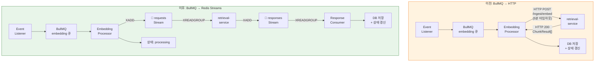
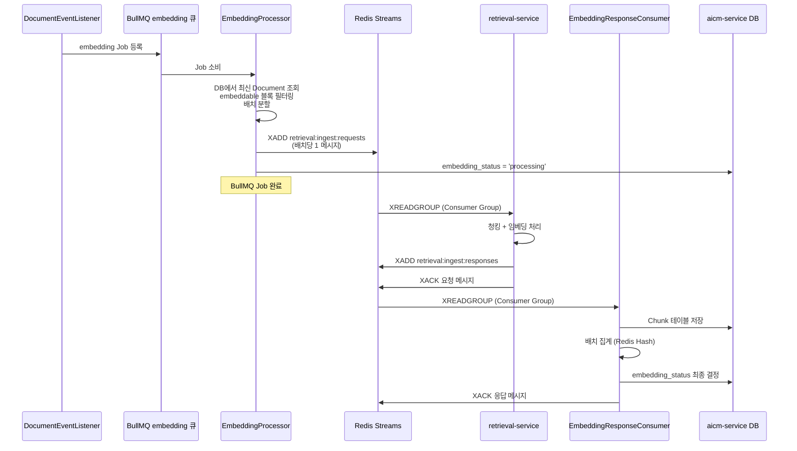
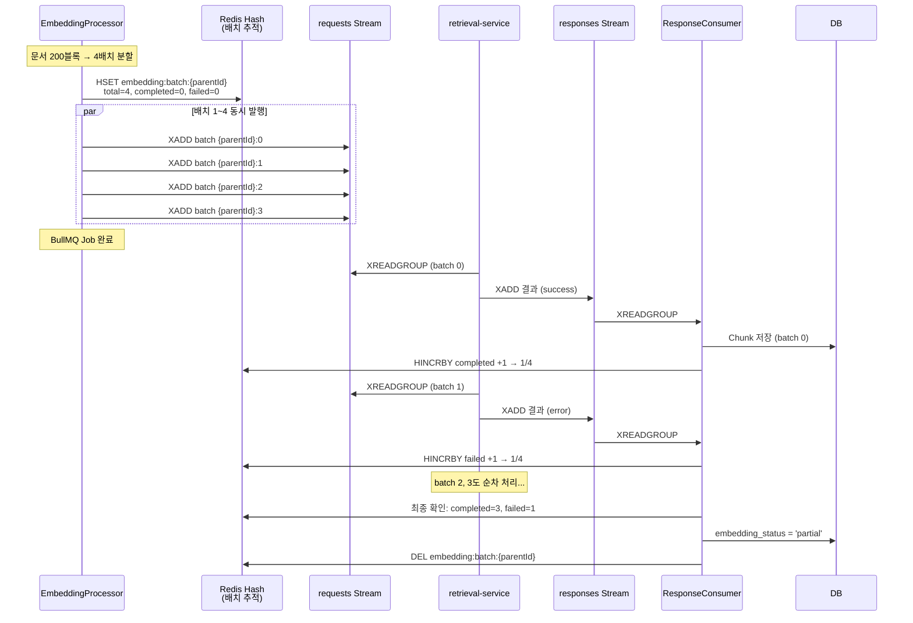
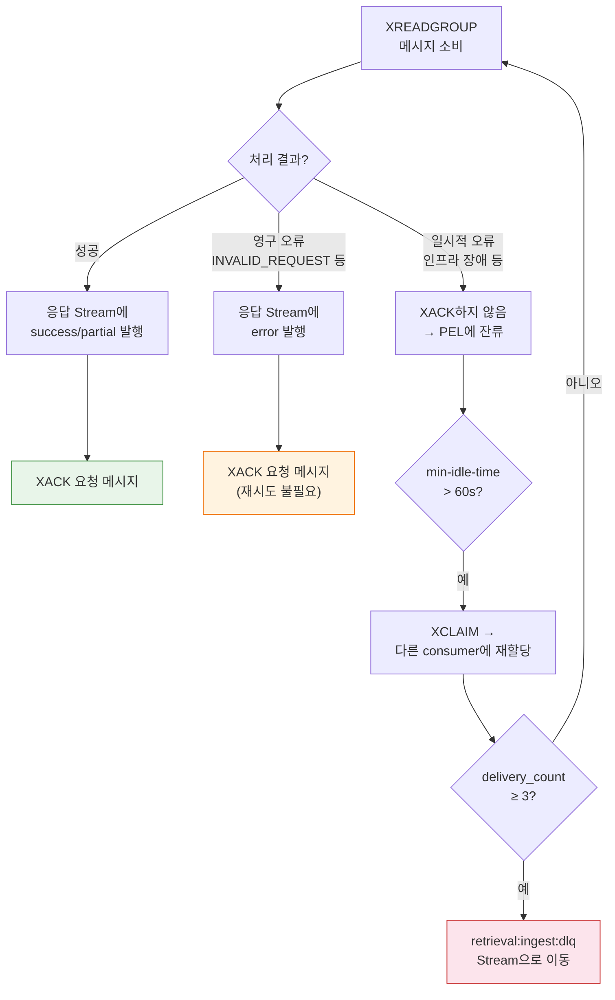
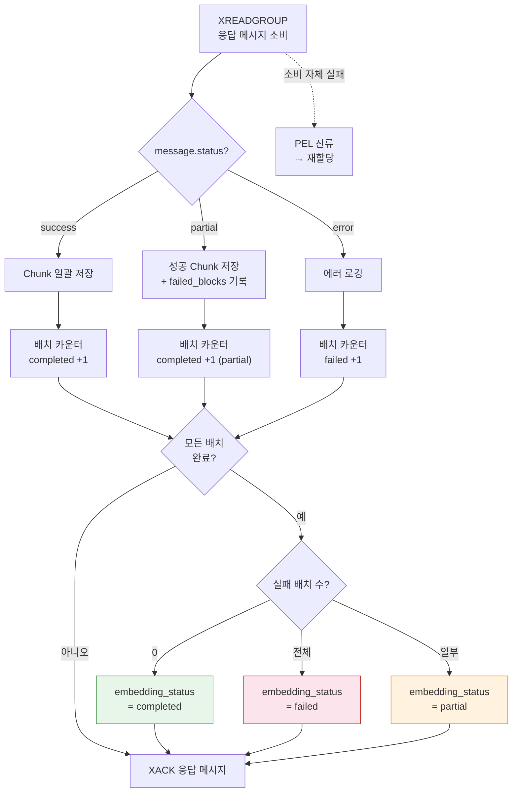
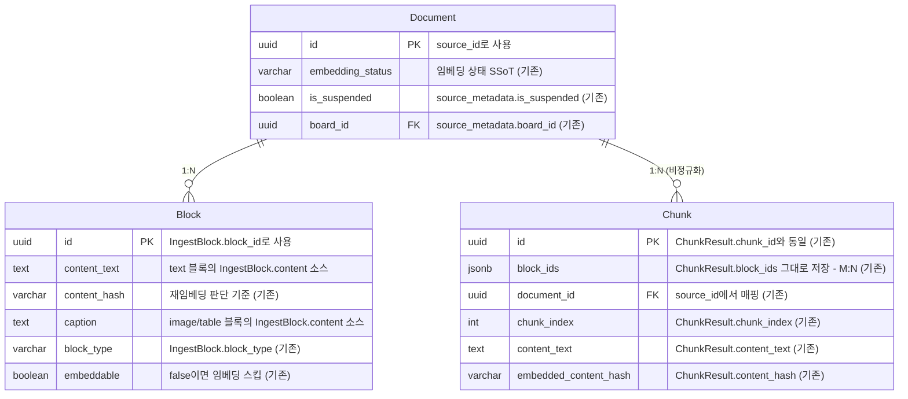

> **문서 상태**
> | 항목 | 값 |
> |------|-----|
> | 상태 | `draft` |
> | 검수 | `unreviewed` |
> | 출처 | `docs/02-architecture/06-external-integration/README.md §7.3` |
> | 최종 수정 | 2026-04-08 |

# retrieval-service 연동

> 원문 위치: [외부 서비스 연동 §7.3](./README.md#73-retrieval-servicefastapi-연동)

retrieval-service는 블록 청킹, 임베딩 생성, 시멘틱/하이브리드 검색을 담당하는 Python 서비스이다. `source_id`(문서), `block_id`(블록), `chunk_id`(청크) 모델을 사용한다.

> **테넌트 스코프**: retrieval-service는 **테넌트당 1인스턴스**로 배포된다. 따라서 API 요청에 테넌트 식별자(namespace, tenant_id 등)를 전달할 필요가 없다. Milvus 컬렉션과 ES 인덱스는 배포 시점에 테넌트 단위로 격리된다.

> **기본 동작**: retrieval-service 미설정(연결 정보 미제공) 시 시맨틱/하이브리드 검색을 비활성화하고, 키워드 검색(Elasticsearch `aicm_blocks` 직접 쿼리)만 제공한다. 임베딩 파이프라인도 비활성화되어 `document.published` 이벤트 시 ES 인덱싱만 수행한다.

> **aicm-service와의 검색 역할 분리**: 키워드 검색은 aicm-service가 Elasticsearch(`aicm_blocks` 인덱스)를 직접 쿼리한다. 시멘틱/하이브리드 검색만 retrieval-service에 위임한다.

## 연동 방식

인제스트(임베딩/재임베딩) 요청은 **Redis Streams**를 통한 비동기 메시지 기반으로 통신하고, 검색·삭제·메타갱신 등 동기 API는 기존 HTTP 호출을 유지한다.

### 채널 선택 근거

| 비교 항목 | 이전 (BullMQ → HTTP) | 현재 (BullMQ → Redis Streams) |
|-----------|---------------------|-------------------------------|
| 타임아웃 위험 | HTTP 5분 타임아웃 — 대용량 문서에서 초과 가능 | 없음 — consumer가 자체 속도로 처리 |
| 배압(backpressure) | BullMQ concurrency로 제어 | Redis Streams Consumer Group이 자연스럽게 제어 |
| 서비스 결합도 | retrieval-service 일시 중단 시 HTTP 실패 즉시 발생 | 미소비 메시지가 Stream에 보존, 복구 후 자동 소비 |
| 응답 수신 | HTTP 응답 대기 (동기 블로킹) | 응답 Stream에서 비동기 수신 |
| 추가 인프라 | 없음 | 없음 (기존 Redis 활용) |

**이전 / 이후 흐름 비교**



### 기능별 연동 매핑

| 기능 | 채널 | 트리거 | 호출 주체 |
|------|------|--------|----------|
| 블록 청킹/임베딩 | **Redis Streams** `retrieval:ingest:requests` | document.published 이벤트 | EmbeddingProcessor (BullMQ `embedding` 큐 → Stream XADD) |
| 블록 재임베딩 | **Redis Streams** `retrieval:ingest:requests` | 공통 컨텐츠 수정, 블록 수정 | EmbeddingProcessor (BullMQ `embedding` 큐 → Stream XADD) |
| 임베딩 결과 수신 | **Redis Streams** `retrieval:ingest:responses` | retrieval-service 처리 완료 | EmbeddingResponseConsumer (Stream XREADGROUP) |
| 임베딩 삭제 (단건) | HTTP `DELETE /sources/{sourceId}` | 문서 삭제 | 동기 호출 (DocumentService) |
| 임베딩 삭제 (배치) | HTTP `DELETE /sources` | 게시판 삭제, 대량 아카이빙 | 동기 호출 (DocumentService) |
| 메타데이터 갱신 | HTTP `PATCH /sources/{sourceId}/metadata` | 긴급 회수, 태그 변경 등 | 동기 호출 (EmbeddingService) |
| 청크 목록 조회 | HTTP `GET /sources/{sourceId}/chunks` | Reconciliation 배치 | 동기 호출 (ReconciliationService) |
| 시맨틱/하이브리드 검색 | HTTP `POST /search` | AI 어시스턴트 검색 (권한 필터 포함) | 동기 호출 (SearchService) |
| 검색 설정 관리 | HTTP `PUT /config` | SearchConfig 설정 push | 동기 호출 (ConfigService) |
| 헬스체크 | HTTP `GET /health` | K8s 프로브, Circuit Breaker Half-Open 시험 | 동기 호출 (RetrievalServiceClient) |

> **HTTP 인제스트 엔드포인트 보조 유지**: `POST /ingest/embed`, `POST /ingest/re-embed` HTTP 엔드포인트는 Reconciliation 보정, 관리자 디버깅, Stream 장애 시 수동 재시도 등 보조 경로로 유지한다.

## API 요약 메트릭스

> 전체 연동 포인트의 채널·타임아웃·재시도·장애 대응을 한눈에 비교하기 위한 테이블이다.

| # | 엔드포인트 / Stream | 메서드/방향 | 호출 방식 | 타임아웃 | CB 적용 | Fallback | 요청 타입 | 응답 타입 | 멱등성 | 비고 |
|:---:|-----------|:------:|:---------:|:-------:|:------:|----------|-----------|-----------|:------:|------|
| 1 | `retrieval:ingest:requests` | XADD → | **Redis Streams** (비동기) | 없음 | ✗ | PEL 재할당 + DLQ stream | `IngestStreamMessage` (type=embed) | `IngestStreamResponse` | ✓ | 50블록 단위 배치 분할, append 방식. `request_id` 기반 서버 사이드 멱등성. `blocks`는 `block_index` 오름차순 전송/검증 |
| 2 | `retrieval:ingest:requests` | XADD → | **Redis Streams** (비동기) | 없음 | ✗ | PEL 재할당 + DLQ stream | `IngestStreamMessage` (type=re-embed) | `IngestStreamResponse` | ✓ | `modified/added/removed_block_ids` 필수. `request_id` 기반 서버 사이드 멱등성. `blocks`는 `block_index` 오름차순 전송/검증 |
| 3 | `/sources/{sourceId}` | DELETE | HTTP 동기 | 15s | ✓ | 삭제 마킹 → Reconciliation 보정 | — (path param) | `DeleteSourceResponse` | ✓ | hard-delete (Milvus + ES) |
| 4 | `/sources` | DELETE | HTTP 동기 | 60s | ✓ | 부분 실패 허용, 실패 건 단건 재시도 | `BatchDeleteSourcesRequest` | `BatchDeleteSourcesResponse` | ✓ | 최대 100건, 초과 시 400 |
| 5 | `/sources/{sourceId}/metadata` | PATCH | HTTP 동기 | 10s | ✓ | 3회 재시도 → `EMB_E002` 에스컬레이션 | `UpdateSourceMetadataRequest` | `UpdateSourceMetadataResponse` | ✓ | 벡터 불변, 메타만 갱신 |
| 6 | `/sources/{sourceId}/chunks` | GET | HTTP 동기 | 15s | ✓ | 해당 문서 스킵, 다음 주기 재시도 | — (path param) | `ListChunksResponse` | ✓ | Reconciliation 전용 |
| 7 | `/search` | POST | HTTP 동기 | 30s | ✓ | 키워드 검색(ES `aicm_blocks`)으로 degradation | `SearchRequest` | `SearchResponse` | ✓ | `mode`: semantic / hybrid |
| 8 | `/config` | PUT | HTTP 동기 | 10s | ✓ | 로컬 캐시 유지, 재시도 Job 등록 | `UpdateRetrievalConfigRequest` | `UpdateRetrievalConfigResponse` | ✓ | SearchConfig `rag_*` push |
| 9 | `/health` | GET | HTTP 동기 | 3s | ✗ | CB 상태 판단에만 사용 (사용자 무영향) | — | `HealthResponse` | ✓ | status: ok / degraded / down |

**범례**
- **CB 적용**: Circuit Breaker 적용 여부. Redis Streams 비동기 호출은 PEL/DLQ로 관리하므로 CB 미적용
- **멱등성**: ✓ = 동일 요청 재전송 시 부작용 없음, ✗ = append/재생성 등 부수효과 존재
- **타임아웃**: HTTP 동기 호출에만 적용. Redis Streams는 consumer가 자체 속도로 처리하므로 타임아웃 개념 없음

## 요청 구조 (임베딩) — Redis Streams `retrieval:ingest:requests`

> **✅ 확정 (2026-04-06)**: 임베딩 API 구조 관련 4건이 AI 권장안으로 확정됨.
> - **R-45**: `IngestEmbedRequest` / `IngestEmbedResponse` 요청/응답 구조 — 현재 설계 확정
> - **R-46**: `ingest_batch_size` 기본값 50블록 — 확정 (SystemConfig 동적 조정 가능)
> - **R-47**: Block↔Chunk M:N 지원 (`block_ids[]` 배열) — M:N 필수 (ADR-012)
> - **R-48**: 동일 `source_id` 복수 요청 시 append 방식 — 확정

### 인제스트 파이프라인 흐름

aicm-service의 EmbeddingProcessor(BullMQ 워커)가 요청 페이로드를 구성하여 Redis Stream `retrieval:ingest:requests`에 XADD한다. retrieval-service는 Consumer Group `retrieval-ingest-workers`로 메시지를 소비하여 처리하고, 결과를 `retrieval:ingest:responses` Stream에 발행한다.



> **BullMQ 유지 이유**: BullMQ는 내부 오케스트레이션(배치 분할, source_id 그룹 직렬화, 우선순위 관리)을 담당하고, Redis Streams는 서비스 간 비동기 통신만 담당한다. 역할을 분리하여 기존 BullMQ 기반 다른 큐(parsing, notification 등)와의 일관성을 유지한다.

### source_id 단위 동시성 제어 — `EC-01` `보류`

문서 게시 직후 빠르게 수정하면 `embedding` 큐에 같은 문서의 embed Job과 re-embed Job이 동시에 존재할 수 있다. retrieval-service가 append 방식이므로 청크 중복 생성 또는 정합성 문제가 발생한다.

```
시간 →
  T1: document.published → embedding 큐에 Job A 등록 (전체 임베딩)
  T2: 사용자 블록 수정 → re-embedding 큐에 Job B 등록 (부분 재임베딩)
  T3: Job A 실행 중... (Milvus에 청크 append 중)
  T4: Job B 실행 시작 — Job A가 만든 청크가 아직 불완전한 상태에서 변경분 교체 시도
  → 불확정 상태
```

**권장안: source_id 단위 BullMQ group concurrency 제한**

```typescript
const embeddingWorker = new Worker('embedding', processor, {
  concurrency: 10,
  group: {
    concurrency: 1,    // 같은 group(= source_id) 내에서는 직렬 실행
  },
});

await embeddingQueue.add('embed', payload, {
  group: { id: payload.source_id },
});
```

- `embedding`과 `re-embedding` 큐를 **단일 `embedding` 큐**로 통합하고, Job data 내 `type: 'embed' | 're-embed'`으로 구분
- source_id 기준 group concurrency = 1로 설정하여 같은 문서에 대한 Job이 FIFO 직렬 실행
- 다른 문서의 Job은 병렬 실행 가능하므로 전체 처리량에 영향 없음

> **상세**: [엣지케이스 분석 EC-01](./6-4-retrieval-edge-case-recommendations.md#ec-01-같은-source_id-동시-embed--re-embed-경합--보류)

### 배치 분할

요청 단위는 **문서 1건**이다. `source_id`에 문서 ID를, `blocks`에 해당 문서의 블록 목록을 담아 Stream에 발행한다.

**대용량 문서 배치 분할**: aicm-service의 EmbeddingProcessor는 **`pm:embedding.ingest_batch_size`(기본 50) 블록 단위로 배치를 분할**하여 복수 메시지로 나눈다. 이 값은 SystemConfig에서 관리자가 동적으로 변경할 수 있으며, 변경 즉시 다음 임베딩 Job부터 적용된다.

| 조건 | 처리 방식 |
|------|----------|
| 블록 ≤ `ingest_batch_size` | 단일 BullMQ Job → Stream XADD 1회 |
| 블록 > `ingest_batch_size` | BullMQ Flow (Parent Job + Child Job N개) → Child Job당 `ingest_batch_size` 블록씩 Stream XADD |

배치 분할 시 모든 메시지의 `source_id`와 `source_metadata`는 동일하고, `blocks` 범위만 다르다. retrieval-service는 동일 `source_id`로 들어오는 복수 메시지를 **추가(append) 방식**으로 처리한다. 상세 배치 전략은 [청킹 전략 §1](../../01-requirements/flows/search-rag/02-chunking.md)을 참조한다.

### 배치 집계 (Scatter-Gather 패턴)

BullMQ Flow의 Child Job이 각각 Stream에 메시지를 발행한 뒤, 응답 Consumer가 결과를 집계한다.



```typescript
// EmbeddingProcessor — 배치 발행 시 Redis Hash에 추적 정보 기록
const batchTrackingKey = `embedding:batch:${parentJobId}`;
await redis.hset(batchTrackingKey, {
  source_id: document.id,
  total_batches: String(batches.length),
  completed_batches: '0',
  failed_batches: '0',
  status: 'processing',
});
await redis.expire(batchTrackingKey, 3600); // 1시간 TTL
```

```typescript
// EmbeddingResponseConsumer — 응답 수신 시 배치 카운터 갱신
const [parentJobId] = message.correlation_id.split(':');
const trackingKey = `embedding:batch:${parentJobId}`;

if (message.status === 'success') {
  await redis.hincrby(trackingKey, 'completed_batches', 1);
} else {
  await redis.hincrby(trackingKey, 'failed_batches', 1);
}

const tracking = await redis.hgetall(trackingKey);
const total = parseInt(tracking.total_batches);
const completed = parseInt(tracking.completed_batches);
const failed = parseInt(tracking.failed_batches);

if (completed + failed === total) {
  // 모든 배치 처리 완료 — embedding_status 결정
  const status = failed === 0 ? 'completed'
    : completed === 0 ? 'failed'
    : 'partial';
  await documentRepository.updateEmbeddingStatus(tracking.source_id, status);
  await redis.del(trackingKey);
}
```

**배치 분할 부분 실패 처리**:

| 배치 결과 | embedding_status | 후속 처리 |
|-----------|-----------------|----------|
| 전체 성공 | `completed` | — |
| 일부 성공 + 일부 실패 | `partial` | Reconciliation 배치에서 `partial` 문서를 감지하여 실패 블록만 재시도 |
| 전체 실패 | `failed` | Milvus에 부분 삽입된 청크가 있으면 Reconciliation에서 정리 |
| 전체 성공이지만 `failed_blocks` 존재 | `partial` | 성공 블록의 청크만 저장, 실패 블록은 Reconciliation에서 재시도 |

> **embeddable 블록 0개인 문서**: EmbeddingProcessor는 Stream 발행 전에 embeddable 블록 수를 사전 점검한다. `file` 타입, caption 없는 `image`/`table`, `Block.embeddable = false` 등을 제외한 뒤 embeddable 블록이 0개이면 메시지를 발행하지 않고 `embedding_status = 'skipped'`로 설정한다. 이전에 `completed`/`partial` 상태로 청크가 존재하던 문서가 수정 후 embeddable 블록 0개가 되면, 기존 청크를 `DELETE /sources/{sourceId}`로 정리한 뒤 `skipped`로 전이한다.

### Stream 요청 메시지

```typescript
interface IngestStreamMessage {
  correlation_id: string;        // 배치 추적 키 — '{parentJobId}:{batchIndex}' 또는 단일 Job ID
  type: 'embed' | 're-embed';   // 요청 유형
  request_id: string;            // 멱등성 키 (BullMQ Job ID 사용)
  source_id: string;             // 문서 ID (= document_id)
  blocks: IngestBlock[];
  source_metadata: {
    board_id: string;
    tags: string[];
    is_suspended: boolean;
    content_hash: string;        // 문서 전체 콘텐츠 해시 (아래 산출 규칙 참조)
  };
  chunking_config?: ChunkingConfig; // 게시판별 오버라이드 적용된 청킹 설정
  // type === 're-embed' 전용
  modified_block_ids?: string[];
  added_block_ids?: string[];
  removed_block_ids?: string[];
}
```

> **`request_id` 기반 멱등성**: Consumer 재처리(PEL → XCLAIM) 시 동일 요청이 재소비되면 청크가 이중 생성되는 문제를 방지한다. aicm-service는 BullMQ Job ID를 `request_id`로 전달하고, retrieval-service는 이를 TTL 캐시(1시간)에 기록한다. 동일 `request_id`가 재소비되면 실제 처리를 스킵하고 이전 결과를 캐시에서 반환(응답 Stream에 재발행)한다.

> **`content_hash` 산출 규칙**: `source_metadata.content_hash`는 Document 테이블에 저장되는 컬럼이 아니라, 요청 시점에 **런타임으로 계산**되는 값이다. EmbeddingProcessor가 해당 문서의 모든 블록 `Block.content_hash`를 `Block.sequence`(=`IngestBlock.block_index`) 오름차순으로 정렬·연결한 뒤 SHA-256 해싱하여 생성한다. retrieval-service는 이 해시를 Milvus `kms_chunks`의 `source_metadata.content_hash` 필드에 저장하며, Reconciliation 배치에서 현재 문서 콘텐츠와 임베딩된 시점의 콘텐츠가 동일한지 대조하는 데 사용한다.

```typescript
// content_hash 산출 (EmbeddingProcessor 내부)
const blockHashes = blocks
  .filter(b => b.content_hash != null)
  .sort((a, b) => a.sequence - b.sequence)
  .map(b => b.content_hash);
const contentHash = sha256(blockHashes.join(':'));
```

```typescript
interface IngestBlock {
  block_id: string;            // 블록 ID
  block_index: number;         // 문서 내 블록 순서 (0-based, 연속값)
  block_type: 'text' | 'image' | 'table' | 'code';  // 블록 유형 (file은 임베딩 대상 아님 — 전송하지 않음)
  content: string;             // 임베딩 대상 텍스트 (아래 매핑 규칙 참조)
  block_metadata?: Record<string, any>;
}
```

> **블록 순서 보장 규칙**: Producer(aicm-service)는 `blocks`를 `block_index` 오름차순으로 전송해야 하며, Consumer(retrieval-service)는 배열 수신 순서를 신뢰하지 않고 `block_index` 기준으로 재정렬 후 처리한다. `block_index` 중복/누락/비연속이 감지되면 `INVALID_BLOCK_ORDER`(400)로 거부한다.
>
> **`content` 매핑 규칙**: aicm-service의 EmbeddingProcessor가 block_type에 따라 다른 소스에서 `content`를 추출한다. `text`/`code` → `Block.content_text`, `table`/`image` → `Block.caption`. caption이 없는 비텍스트 블록과 `file` 블록은 임베딩 대상이 아니므로 `blocks` 배열에 포함하지 않는다. 상세 규칙은 [Document/Block 엔티티 caption 전략](../../03-module-design/document/data.md)을 참조한다.

> **청킹 설정 동봉**: 요청 메시지에 ParsingConfig에서 조회한 청킹 설정을 `chunking_config` 파라미터로 동봉한다. 게시판별 오버라이드가 적용된 최종 설정값이 전달된다. — [ADR-009](../../adr/009-search-config-singleton-merge.md) 참조

## 응답 구조 — Redis Streams `retrieval:ingest:responses`

retrieval-service는 청킹/임베딩 완료 후 결과를 `retrieval:ingest:responses` Stream에 발행한다. aicm-service의 EmbeddingResponseConsumer가 이를 소비하여 RDB `Chunk` 테이블에 저장한다.

> **청크 중심 응답 구조**: 인접한 짧은 블록이 그룹 병합되어 하나의 청크를 생성할 수 있다([ADR-012](../../adr/012-block-group-chunking.md)). 따라서 Block과 Chunk는 M:N 관계이며, 응답도 블록 단위가 아닌 **청크 단위**로 구성한다. 각 `ChunkResult`의 `block_ids`에 해당 청크를 생성한 블록 ID 목록이 포함된다.

### Stream 응답 메시지

```typescript
interface IngestStreamResponse {
  correlation_id: string;        // 요청의 correlation_id와 동일 — 배치 집계에 사용
  status: 'success' | 'partial' | 'error';
  source_id: string;
  chunks?: ChunkResult[];        // status !== 'error'일 때
  failed_blocks?: FailedBlock[]; // 실패 블록 목록
  error?: {                      // status === 'error'일 때
    code: string;
    message: string;
    details?: Record<string, any>;
  };
  processed_at: string;          // ISO 8601
}

interface ChunkResult {
  chunk_id: string;            // Milvus에 저장된 Chunk ID (= RDB Chunk.id)
  block_ids: string[];         // 이 청크를 생성한 블록 ID 목록 (M:N — ADR-012)
  chunk_index: number;         // Source 내 청크 순서
  content_text: string;        // 청크 텍스트 원문
  content_hash: string;        // 임베딩된 시점의 해시 (= RDB Chunk.embedded_content_hash)
}

interface FailedBlock {
  block_id: string;
  error: string;
}
```

> **`status` 필드 의미**:
>
> | status | 의미 | chunks | failed_blocks | error |
> |--------|------|:------:|:-------------:|:-----:|
> | `success` | 모든 블록 청킹/임베딩 성공 | ✓ | — | — |
> | `partial` | 일부 블록 성공, 일부 실패 | ✓ (성공분) | ✓ | — |
> | `error` | 처리 자체 실패 (인프라 오류 등) | — | — | ✓ |

> **M:N 매핑 예시**: 문서에 짧은 블록 3개(A, B, C)와 긴 블록 1개(D)가 있을 때, retrieval-service가 A+B+C를 하나의 청크로 병합하고 D를 별도 청크로 생성하면 응답은 다음과 같다:
> ```json
> { "chunks": [
>   { "chunk_id": "c1", "block_ids": ["A", "B", "C"], "chunk_index": 0, ... },
>   { "chunk_id": "c2", "block_ids": ["D"], "chunk_index": 1, ... }
> ]}
> ```
> EmbeddingResponseConsumer는 `ChunkResult.block_ids`를 그대로 RDB `Chunk.block_ids` JSONB에 저장한다.

## 요청 구조 (재임베딩) — Stream `type: 're-embed'`

문서 콘텐츠 수정, 공유 블록 변경 시 **영향받은 블록의 청크만 교체**한다. 전체 재임베딩이 아닌 블록 단위 교체 전략이다. 블록 변경 유형(수정·추가·삭제)을 명시적으로 구분하여 전달한다.

재임베딩 요청은 `IngestStreamMessage`에 `type: 're-embed'`과 변경 블록 ID 필드를 포함하여 동일 Stream(`retrieval:ingest:requests`)에 발행한다.

```typescript
// IngestStreamMessage (type === 're-embed')
{
  correlation_id: string;
  type: 're-embed';
  request_id: string;
  source_id: string;
  blocks: IngestBlock[];             // 변경 후 문서의 전체 블록 (현재 상태 — 삭제 블록 미포함)
  modified_block_ids: string[];      // 내용이 변경된 블록 ID 목록
  added_block_ids: string[];         // 새로 추가된 블록 ID 목록
  removed_block_ids: string[];       // 삭제된 블록 ID 목록 (blocks에 미포함)
  source_metadata: {
    board_id: string;
    tags: string[];
    is_suspended: boolean;
    content_hash: string;            // 변경 후 해시
  };
  chunking_config: ChunkingConfig;
}
```

> **블록 변경 유형별 처리**: retrieval-service는 세 가지 변경 유형을 각각 다르게 처리한다:
>
> | 변경 유형 | `*_block_ids` | `blocks` 배열 | retrieval-service 처리 |
> |---------|--------------|--------------|----------------------|
> | 내용 수정 | `modified_block_ids` | 수정된 블록 포함 | 해당 블록을 포함하는 청크를 재생성 |
> | 블록 추가 | `added_block_ids` | 추가된 블록 포함 | 새 블록에서 청크 생성, 인접 블록 그룹 재계산 |
> | 블록 삭제 | `removed_block_ids` | 삭제 블록 미포함 | 해당 블록을 포함하는 청크 삭제, 인접 블록 그룹 재계산 |

**응답**: `IngestStreamResponse`로 동일 응답 Stream에 발행. `modified_block_ids`/`added_block_ids`에 해당하는 블록에서 파생된 청크 및 `removed_block_ids`로 인해 재계산된 인접 블록 그룹의 청크가 `chunks`에 포함된다. 변경에 영향받지 않은 블록의 기존 청크는 유지된다. 블록 그룹 청킹(ADR-012)으로 변경 블록과 미변경 블록이 같은 블록 그룹에 속한 경우, 해당 청크 전체가 재생성되어 `chunks`에 포함된다.

> **재임베딩 처리 흐름**: retrieval-service는 새 청크를 먼저 삽입한 뒤 영향받은 기존 청크를 삭제한다(검색 공백 최소화를 위해 삽입 후 삭제 순서). 블록 변경 유형별 상세 전략은 [retriever 데이터 아키텍처 §4](../data/retriever/README.md)를 참조한다.

> **Job 실행 시점 최신 상태 조회**: EmbeddingProcessor는 BullMQ Job data에 최소 정보(`source_id`, `*_block_ids`)만 저장하고, **Job 실행 시점에 DB에서 최신 Document를 재조회**하여 `source_metadata`와 `blocks`를 구성한다. 이를 통해 Job 등록 ~ 실행 사이에 메타데이터가 변경된 경우(예: `is_suspended` 갱신)에도 최신 값이 반영된다.

---

## 요청/응답 구조 (임베딩 삭제) — `DELETE /sources/{sourceId}`

문서 삭제·아카이빙 시 해당 문서의 모든 청크를 Milvus와 ES `aicm_chunks`에서 hard-delete한다.

- Path param: `sourceId` — 문서 ID (= `document_id`)

```typescript
interface DeleteSourceResponse {
  source_id: string;
  deleted_chunk_count: number;  // Milvus + ES에서 삭제된 청크 수
}
```

> **미존재 source_id 처리**: 해당 `sourceId`에 대한 청크가 존재하지 않는 경우(미임베딩, `embedding_status = 'skipped'`, 또는 이미 삭제됨) `200`과 `deleted_chunk_count: 0`을 반환한다. 404를 반환하지 않으며, 멱등성을 보장하여 동일 요청의 중복 전송이 안전하다. 배치 `DELETE /sources`에서도 동일 원칙 — 존재하지 않는 source_id는 성공 처리에 포함하되 `deleted_chunk_count`에 기여하지 않는다.

---

## 요청/응답 구조 (메타데이터 갱신) — `PATCH /sources/{sourceId}/metadata`

문서의 비정규화 메타데이터(`is_suspended`, `tags`, `board_id`)가 변경될 때, Milvus `kms_chunks`의 `metadata` JSON 필드와 ES `aicm_chunks`의 비정규화 필드를 동기 갱신한다. 임베딩 벡터는 변경하지 않으므로 재임베딩이 발생하지 않는다.

- Path param: `sourceId` — 문서 ID (= `document_id`)

> **주요 용도**: `document.suspended` / `document.unsuspended` 이벤트 소비 시 `is_suspended` 플래그 갱신 ([FD-EMB BR-EMB-024~025](../../01-requirements/features/FD-EMB-임베딩파이프라인.md)), 태그 변경·게시판 이동 시 검색 필터용 메타데이터 갱신. 키워드 검색 쪽 ES `aicm_blocks` 갱신은 aicm-service가 `SearchRepository.updateDocumentFields()`로 직접 수행하므로 이 API의 범위가 아니다.

```typescript
interface UpdateSourceMetadataRequest {
  source_metadata: {
    board_id?: string;
    tags?: string[];
    is_suspended?: boolean;
  };
}

interface UpdateSourceMetadataResponse {
  source_id: string;
  updated_chunk_count: number;     // Milvus + ES에서 갱신된 청크 수
  updated_fields: string[];        // 실제 변경된 필드 목록
}
```

> **멱등성**: 동일 요청을 중복 전송해도 안전하다. `is_suspended`가 이미 `true`인 상태에서 `true`로 갱신 요청하면 변경 없이 성공 응답을 반환한다 (BR-EMB-024 멱등 요건 충족).

> **`EC-07` `보류` — is_suspended 갱신 지연으로 인한 검색 노출**: `document.suspended` 이벤트 발행 ~ `PATCH /metadata` 완료 사이에 시간차가 존재한다. 그 사이 검색 요청이 도착하면 suspended 문서의 청크가 반환될 수 있다. **이중 필터 전략**으로 대응한다 — retrieval-service의 메타데이터 필터가 1차, aicm-service의 RDB 기반 `is_suspended` 확인이 2차 안전망이다. RDB는 이벤트 처리와 동일 트랜잭션에서 갱신되므로 최신 상태가 보장된다. 갱신 지연은 수 ms~수백 ms 수준이므로 실질적 위험은 매우 낮다. 상세 분석은 [엣지케이스 분석 EC-07](./6-4-retrieval-edge-case-recommendations.md#ec-07-is_suspended-갱신-지연으로-인한-검색-노출--보류)을 참조한다.

---

## 요청/응답 구조 (임베딩 삭제 배치) — `DELETE /sources`

게시판 삭제, 대량 아카이빙 등 다수 문서의 임베딩을 일괄 삭제한다. 단건 `DELETE /sources/{sourceId}`를 N번 호출하는 대신 단일 요청으로 처리하여 네트워크 오버헤드를 줄인다.

```typescript
interface BatchDeleteSourcesRequest {
  source_ids: string[];            // 삭제 대상 문서 ID 목록 (최대 100건)
}

interface BatchDeleteSourcesResponse {
  deleted_sources: number;         // 실제 삭제된 문서 수
  deleted_chunk_count: number;     // Milvus + ES에서 삭제된 총 청크 수
  failed_sources?: {
    source_id: string;
    error: string;
  }[];
}
```

> **상한**: 단일 요청당 `source_ids` 최대 100건. 초과 시 `400 BAD_REQUEST`를 반환한다. 100건 초과 대량 삭제는 aicm-service에서 100건 단위로 분할 호출한다.

---

## 요청/응답 구조 (청크 목록 조회) — `GET /sources/{sourceId}/chunks`

문서에 속한 청크 목록을 조회한다. Reconciliation 배치에서 RDB `Chunk` 테이블과 Milvus/ES의 실제 데이터를 대조하여 고아 청크를 탐지하는 데 사용한다.

- Path param: `sourceId` — 문서 ID (= `document_id`)

```typescript
interface ListChunksResponse {
  source_id: string;
  chunks: ChunkSummary[];
  total_count: number;
}

interface ChunkSummary {
  chunk_id: string;                // Milvus/ES에 저장된 청크 ID
  block_ids: string[];             // 이 청크를 생성한 블록 ID 목록
  content_hash: string;            // 임베딩 시점의 콘텐츠 해시
  created_at: string;              // ISO 8601
}
```

> **용도**: (1) Reconciliation 배치([SearchModule schedule.md §2.1](../../03-module-design/search/schedule.md))에서 RDB Chunk 테이블과 대조하여 고아 청크(RDB에 없으나 Milvus/ES에 존재) 또는 누락 청크(RDB에 있으나 Milvus/ES에 미존재)를 탐지. (2) 관리자 디버깅 — 특정 문서의 임베딩 상태를 상세 확인.

---

## 요청/응답 구조 (헬스체크) — `GET /health`

retrieval-service의 가용성과 하위 인프라(Milvus, ES) 연결 상태를 확인한다.

```typescript
interface HealthResponse {
  status: 'ok' | 'degraded' | 'down';
  components: {
    milvus: 'connected' | 'disconnected';
    elasticsearch: 'connected' | 'disconnected';
    embedding_model: 'ready' | 'loading' | 'unavailable';
  };
  uptime_seconds: number;
}
```

> **용도**: (1) K8s liveness/readiness probe — `status == 'down'`이면 Pod 재시작 트리거. (2) Circuit Breaker Half-Open 시험 — 검색 API 대신 경량 헬스체크로 서비스 복구를 확인하여 불필요한 검색 부하를 방지. (3) 관리자 대시보드 — retrieval-service 상태 실시간 표시.

| status | 조건 |
|--------|------|
| `ok` | Milvus + ES 모두 connected, 임베딩 모델 ready |
| `degraded` | 일부 컴포넌트 비정상 (예: ES disconnected → 하이브리드 검색 불가, 시맨틱만 가능) |
| `down` | Milvus disconnected (핵심 인프라 불가) |

---

## 요청/응답 구조 (검색 설정 관리) — `PUT /config`

SearchConfig의 `rag_*` 파라미터를 retrieval-service에 push 동기화한다.

```typescript
interface UpdateRetrievalConfigRequest {
  default_search_mode: 'keyword' | 'semantic' | 'hybrid';
  hybrid_weight_bm25: number;                 // SearchConfig.rag_hybrid_bm25_weight
  hybrid_weight_vector: number;               // SearchConfig.rag_hybrid_vector_weight
  rrf_k: number;                              // SearchConfig.rag_rrf_k
  top_k: number;                              // SearchConfig.rag_top_k
  similarity_threshold: number;               // SearchConfig.rag_similarity_threshold
  window_context_size: number;                // SearchConfig.rag_window_context_size
  reranking_enabled: boolean;                 // SearchConfig.rag_rerank_enabled
  reranking_model?: string | null;            // SearchConfig.rag_rerank_model
  reranking_top_n?: number | null;            // SearchConfig.rag_rerank_top_n
}

interface UpdateRetrievalConfigResponse {
  applied_at: string;                         // ISO 8601 — 설정 적용 시각
}
```

> **필드 매핑 규칙**: aicm-service의 SearchConfig `rag_*` 컬럼명과 retrieval-service의 설정 키 이름은 의도적으로 다르다. retrieval-service는 aicm 도메인에 종속되지 않는 범용 서비스이므로, `rag_` 프리픽스 없이 자체 네이밍을 사용한다. 필드 매핑 상세는 [검색 튜닝 전략 §2.7](../../01-requirements/flows/search-rag/04-search-tuning.md)을 참조한다.

> **`EC-10` `보류` — 입력 유효성 검증**: retrieval-service와 aicm-service 양단에서 검증한다. aicm-service는 사용자 입력 시점에 검증하여 빠른 피드백을, retrieval-service는 방어적으로 재검증하여 잘못된 설정 적용을 원천 차단한다.
>
> | 필드 | 제약 | 위반 시 |
> |------|------|--------|
> | `hybrid_weight_bm25` | `0.0 ≤ x ≤ 1.0` | `400 INVALID_REQUEST` |
> | `hybrid_weight_vector` | `0.0 ≤ x ≤ 1.0` | `400 INVALID_REQUEST` |
> | `bm25 + vector 합` | `== 1.0` (±0.001 허용) | `400 INVALID_REQUEST` |
> | `rrf_k` | `1 ≤ x ≤ 100`, 정수 | `400 INVALID_REQUEST` |
> | `top_k` | `1 ≤ x ≤ 200`, 정수 | `400 INVALID_REQUEST` |
> | `similarity_threshold` | `0.0 ≤ x ≤ 1.0` | `400 INVALID_REQUEST` |
> | `window_context_size` | `0 ≤ x ≤ 10`, 정수 | `400 INVALID_REQUEST` |
> | `reranking_model` | `reranking_enabled=true`이면 필수 | `400 INVALID_REQUEST` |
> | `reranking_top_n` | `reranking_enabled=true`이면 `1 ≤ x ≤ top_k` | `400 INVALID_REQUEST` |
>
> 상세 분석은 [엣지케이스 분석 EC-10](./6-4-retrieval-edge-case-recommendations.md#ec-10-put-config-유효성-검증--보류)을 참조한다.

---

## 공유 타입 — `ChunkingConfig`

`POST /ingest/embed`, `POST /ingest/re-embed` 요청 시 동봉되는 청킹 설정이다. aicm-service의 ParsingConfig에서 게시판별 오버라이드가 적용된 최종 설정값을 전달한다.

```typescript
interface ChunkingConfig {
  strategy: 'semantic' | 'fixed_token' | 'sliding_window';
  max_tokens: number;           // 청크 최대 토큰 수 (기본 256)
  overlap_tokens?: number;      // 슬라이딩 윈도우 오버랩 (기본 50)
  min_tokens?: number;          // 최소 토큰 수 — 미만이면 스킵 (기본 30)
  contextual_prefix: boolean;   // Contextual Chunking 활성화 (기본 true)
  template_strategy?: 'faq_qa_pair' | 'sop_step' | 'checklist_item' | 'default_heading';
}
```

> 청킹 전략의 상세 의사결정 배경과 블록 타입별 규칙은 [청킹 전략](../../01-requirements/flows/search-rag/02-chunking.md), 파라미터 기본값과 오버라이드 구조는 [검색 튜닝 전략 §2.12](../../01-requirements/flows/search-rag/04-search-tuning.md)를 참조한다.

---

## 요청/응답 구조 (검색) — `POST /search`

aicm-service가 RAG 검색 시 PermissionService에서 조회한 권한 정보를 범용 필터 파라미터로 변환하여 전달한다. retrieval-service는 이 필터를 Milvus 스칼라 필터와 ES bool 필터로 적용하여 접근 불가한 청크를 검색 후보에서 사전 배제한다.

> **엔드포인트 통합**: 시맨틱 검색과 하이브리드 검색 모두 `POST /search` 단일 엔드포인트에서 `mode` 파라미터로 분기한다. 검색 모드별 내부 동작은 [검색 전략 §4~5](../../01-requirements/flows/search-rag/03-search.md)를 참조한다.

```typescript
interface SearchRequest {
  query: string;
  mode: 'semantic' | 'hybrid';
  top_k?: number;                          // 런타임 오버라이드 (미지정 시 PUT /config의 top_k 사용)
  threshold?: number;                      // 런타임 오버라이드 (미지정 시 PUT /config의 similarity_threshold 사용)
  reranking?: {                            // 런타임 리랭킹 오버라이드 (미지정 시 PUT /config 설정 사용)
    enabled?: boolean;                     // 이 요청에서 리랭킹 활성화 여부
    top_n?: number;                        // 리랭킹 후 반환할 상위 결과 수
  };
  filters?: {
    must?: {
      source_metadata?: Record<string, string[]>;
      // 예: { board_id: ["board-1", "board-2"] } → Milvus/ES: board_id IN [...]
    };
    must_not?: {
      source_ids?: string[];               // 제한 문서 ID → Milvus/ES: source_id NOT IN [...]
      block_ids?: string[];                // 제한 블록 ID (아래 필터 매핑 참조)
    };
  };
}
```

> **필터 변환**: aicm-service가 PermissionService에서 조회한 접근 권한 정보(`board_id`, `document_id`, `block_id`)를 `filters` 파라미터로 변환하여 전달한다. retrieval-service는 이를 Milvus 스칼라 필터 및 ES bool 필터로 적용한다.

> **`block_ids` 필터 매핑**: `filters.must_not.block_ids`는 Milvus `kms_chunks`의 `metadata["block_ids"]` JSON 필드와 ES `aicm_chunks`의 `block_id` 필드로 매핑된다. Milvus에서는 `json_contains_any(metadata["block_ids"], [제한 블록 ID])` 표현식으로 해당 블록에서 파생된 청크를 제외한다. block_id 기반 제한(DocumentRestriction)은 드문 케이스이므로 성능 영향은 무시 가능하다.

> **리랭킹 런타임 오버라이드**: `reranking` 파라미터를 지정하면 `PUT /config`로 push된 전역 리랭킹 설정을 이 요청에 한해 오버라이드한다. 미지정 시 전역 설정을 따른다. 이를 통해 관리자 Playground(Phase 2)에서 리랭킹 효과를 A/B 비교할 수 있다. 리랭킹 모델(`reranking_model`)은 전역 설정에서만 변경 가능하며 요청별 오버라이드를 지원하지 않는다 — 모델 전환은 인프라 비용이 수반되므로 관리자 설정으로 제한한다.

**응답 구조 (검색)**

```typescript
interface SearchResponse {
  results: SearchResult[];
  metadata?: {
    mode: 'semantic' | 'hybrid';           // 실제 실행된 검색 모드 (요청과 다를 수 있음 — EC-11)
    reranked: boolean;                     // 리랭킹 적용 여부
    total_candidates: number;              // RRF 합산 전 후보 수 (하이브리드 모드)
    degraded?: boolean;                    // degradation 발생 여부 (EC-11)
    degradation_reason?: string;           // 예: 'elasticsearch_unavailable' (EC-11)
  };
}

interface SearchResult {
  source_id: string;           // 문서 ID (= document_id)
  block_ids: string[];         // 매칭된 청크를 생성한 블록 ID 목록 (M:N — ADR-012)
  chunk_id: string;            // 매칭된 청크 ID
  score: number;               // 유사도 또는 RRF 합산 점수 (리랭킹 적용 시 리랭킹 점수)
  content: string;             // 매칭된 청크 텍스트
  source_metadata?: Record<string, any>;
}
```

> **`window_context_size` 역할 분리**: `PUT /config`에서 push되는 `window_context_size`는 retrieval-service가 사용하는 값이 아니다. retrieval-service는 청크 단위 검색 결과만 반환하며, **인접 블록 확장(Window Context)은 aicm-service의 `RagSearchService`가 BlockSnapshot 기반으로 수행**한다 — [검색 전략 §7.4](../../01-requirements/flows/search-rag/03-search.md) 참조. `PUT /config`에 이 값을 포함하는 이유는 retrieval-service가 향후 chunk-level window expansion을 지원할 가능성에 대비한 예약 필드이며, 현재 retrieval-service는 이 값을 무시한다.

> **`EC-12` `미결정` — 검색 결과 0건 처리**: 빈 결과는 `200 + results: []`로 정상 반환한다. 장애와 구분한다:
>
> | 상황 | HTTP 상태 | results | 처리 |
> |------|:---------:|---------|------|
> | 정상이지만 매칭 없음 | `200` | `[]` | 키워드 보완 검색 (선택적 보완) |
> | retrieval-service 장애 | `5xx` / 타임아웃 | — | Circuit Breaker → 키워드 fallback |
> | threshold 미달로 전부 필터링됨 | `200` | `[]` | threshold 완화 후 재검색 (선택적) |
>
> 키워드 보완 검색은 UX 향상 목적의 선택적 보완이며, 장애 시의 fallback과 명확히 구분한다. 상세 분석은 [엣지케이스 분석 EC-12](./6-4-retrieval-edge-case-recommendations.md#ec-12-검색-결과-0건-처리)를 참조한다.

## 임베딩 응답 처리 흐름 (aicm-service — EmbeddingResponseConsumer)

aicm-service의 **EmbeddingResponseConsumer**가 `retrieval:ingest:responses` Stream에서 `IngestStreamResponse`를 소비하여 처리한다. 기존 EmbeddingProcessor(BullMQ 워커)와 역할이 분리된다.

| 컴포넌트 | 역할 |
|----------|------|
| **EmbeddingProcessor** (BullMQ 워커) | 요청 구성 + Stream 발행 + `embedding_status = 'processing'` 설정 |
| **EmbeddingResponseConsumer** (Stream 리스너) | 응답 소비 + Chunk DB 저장 + 배치 집계 + `embedding_status` 최종 결정 |

### 응답 처리 단계

EmbeddingResponseConsumer는 `IngestStreamResponse`를 받아:
1. 해당 문서의 기존 `Chunk` 레코드를 삭제 (재임베딩 시에는 `modified_block_ids`/`added_block_ids`/`removed_block_ids`에 해당하는 블록을 `block_ids`에 포함하는 청크만 삭제)
2. 새 Chunk 레코드 일괄 삽입 — `ChunkResult`의 필드를 RDB `Chunk` 테이블에 1:1 매핑:

| ChunkResult 필드 | Chunk 테이블 컬럼 | 비고 |
|---|---|---|
| `chunk_id` | `id` (PK) | Milvus chunk_id와 동일 |
| `block_ids` | `block_ids` (JSONB) | M:N 매핑 그대로 저장 |
| — | `document_id` (FK) | 응답의 `source_id`에서 매핑 |
| `chunk_index` | `chunk_index` | Source 내 청크 순서 |
| `content_text` | `content_text` | 청크 텍스트 원문 |
| `content_hash` | `embedded_content_hash` | 임베딩 시점 해시 |

3. 실패 항목(`failed_blocks`)이 있으면 해당 배치를 `partial`로 기록
4. 배치 카운터 갱신 (위 Scatter-Gather 패턴 참조)
5. 모든 배치 완료 시 `embedding_status` 최종 결정
6. 응답 메시지 XACK

```typescript
// EmbeddingResponseConsumer 핵심 로직
async processResponse(message: IngestStreamResponse): Promise<void> {
  if (message.status === 'error') {
    this.logger.error(`Embedding failed: ${message.error?.code} — ${message.error?.message}`);
    await this.updateBatchTracking(message.correlation_id, 'failed');
    return;
  }

  // Chunk DB 저장
  if (message.chunks?.length) {
    await this.chunkRepository.bulkUpsert(
      message.source_id,
      message.chunks.map(c => this.toChunkEntity(c, message.source_id)),
    );
  }

  // 배치 집계
  const batchStatus = message.failed_blocks?.length ? 'partial' : 'success';
  await this.updateBatchTracking(message.correlation_id, batchStatus);
}
```

## 타임아웃

| 호출 경로 | 타임아웃 | 비고 |
|----------|---------|------|
| BullMQ `embedding` 워커 → Stream XADD | **없음** (비동기) | 메시지 발행은 즉시 완료. retrieval-service가 자체 속도로 소비 |
| Stream 응답 대기 (배치 추적 TTL) | 1시간 | Redis Hash TTL. 초과 시 Reconciliation에서 보정 |
| retrieval-service 메시지 처리 | 없음 (자체 관리) | retrieval-service가 내부적으로 처리 시간을 관리 |
| HTTP 동기 → `POST /search` | 30s | 검색 응답 SLA 기준 |
| HTTP 동기 → `PUT /config` | 10s | 설정 push, 경량 요청 |
| HTTP 동기 → `DELETE /sources/{sourceId}` | 15s | 벡터 삭제 포함 |
| HTTP 동기 → `DELETE /sources` (배치) | 60s | 최대 100건 일괄 삭제. 건수에 비례하여 소요 |
| HTTP 동기 → `PATCH /sources/{sourceId}/metadata` | 10s | 메타데이터 필드 갱신, 경량 요청 |
| HTTP 동기 → `GET /sources/{sourceId}/chunks` | 15s | 청크 목록 조회. 대형 문서(수백 청크) 고려 |
| HTTP 동기 → `GET /health` | 3s | 경량 헬스체크. Circuit Breaker 프로브 용도 |

> **HTTP 타임아웃 제거의 의미**: 기존 HTTP 기반에서는 BullMQ Job 타임아웃(5분)과 HTTP 요청 타임아웃(5분)이 동시에 적용되어, 대용량 문서에서 임베딩 처리가 5분을 초과하면 강제 실패했다. Redis Streams 기반에서는 메시지 발행이 즉시 완료되고 retrieval-service가 처리 시간 제약 없이 임베딩을 수행한다. 응답이 지연되더라도 메시지가 유실되지 않으며, 배치 추적 TTL(1시간) 초과 시에만 Reconciliation 배치에서 보정한다.

## Circuit Breaker

동기 HTTP 호출에 Circuit Breaker 패턴을 적용한다. Redis Streams를 통한 비동기 호출(임베딩/재임베딩)은 Stream의 PEL/DLQ 메커니즘으로 관리하므로 Circuit Breaker를 적용하지 않는다.

| 실패 임계값 | 복구 대기 시간 | Half-Open 허용 요청 수 |
|-----------|--------------|---------------------|
| 연속 5회 실패 | 15s | 2 |

## Fallback 전략

### HTTP 동기 호출 Fallback

| 호출 | 장애 시 Fallback |
|------|-----------------|
| `POST /search` | 시맨틱/하이브리드 검색 불가 → 키워드 검색(ES `aicm_blocks` 직접 쿼리) 결과만 반환 (graceful degradation). 사용자에게 "일부 검색 기능이 제한됩니다" 안내 |
| `PUT /config` | 설정 push 실패 → 로컬 캐시 유지, 재시도 Job 등록 |
| `DELETE /sources/{sourceId}` | 임베딩 삭제 실패 → 삭제 마킹 후 Reconciliation 배치([§6.7](../05-async-event-architecture.md))에서 보정 |
| `DELETE /sources` (배치) | 부분 실패 허용 — `failed_sources`에 실패 건을 포함하여 응답. 실패 건은 단건 `DELETE /sources/{sourceId}`로 재시도 |
| `PATCH /sources/{sourceId}/metadata` | 메타데이터 갱신 실패 → 3회 재시도 후 실패 시 `EMB_E002`로 에스컬레이션. `is_suspended` 갱신 실패는 검색 필터 불일치를 유발하므로 CRITICAL 로그 |
| `GET /sources/{sourceId}/chunks` | 조회 실패 → Reconciliation 배치 해당 문서 스킵, 다음 주기에 재시도 |
| `GET /health` | 헬스체크 실패 → Circuit Breaker 상태 판단에만 사용 (사용자 대면 영향 없음) |

> **`EC-11` `미결정` — hybrid 모드 + ES disconnected**: 헬스체크 `status: 'degraded'`(ES disconnected)일 때 하이브리드 검색 요청의 처리 방식이다. retrieval-service가 자체적으로 검색 모드를 fallback한다:
>
> | 요청 | 인프라 상태 | 동작 |
> |------|-----------|------|
> | `mode=hybrid` | ES disconnected | 벡터 검색(Milvus)만 수행. `metadata.mode = 'semantic'`, `metadata.degraded = true` |
> | `mode=semantic` | ES disconnected | 정상 수행 (Milvus만 사용) |
> | `mode=hybrid` | Milvus disconnected | `500` 에러 → aicm-service Circuit Breaker → 키워드 검색 fallback |
>
> aicm-service는 요청 `mode`와 응답 `metadata.mode`를 비교하여 degradation을 감지하고 사용자에게 안내한다. 상세 분석은 [엣지케이스 분석 EC-11](./6-4-retrieval-edge-case-recommendations.md#ec-11-hybrid-모드--es-disconnected)을 참조한다.

### Redis Streams 인제스트 에러 처리

Redis Streams 기반 인제스트 파이프라인은 HTTP와 다른 에러 처리 모델을 사용한다.

#### retrieval-service 측 (Consumer) — 요청 처리 흐름



#### aicm-service 측 (EmbeddingResponseConsumer) — 응답 처리 흐름



#### 장애 시나리오별 대응

| 시나리오 | 감지 방식 | 대응 |
|---------|----------|------|
| retrieval-service 일시 중단 | 요청 Stream 메시지 미소비 (PEL 증가) | 복구 후 자동 소비 재개. 메시지 유실 없음 |
| retrieval-service 장시간 중단 | 배치 추적 TTL(1시간) 초과 | Reconciliation 배치에서 `processing` 상태 문서 감지 → 재발행 |
| Redis 장애 | Stream XADD 실패 | EmbeddingProcessor에서 BullMQ 재시도. 3회 소진 → DLQ |
| 응답 Consumer 장애 | 응답 Stream 메시지 미소비 | Consumer 복구 후 PEL의 미ACK 메시지 자동 재처리 |
| 메시지 직렬화 오류 | 파싱 실패 | DLQ Stream으로 이동. 관리자 확인 후 수동 처리 |
| MAXLEN 트림이 미처리 메시지를 삭제 | consumer 장기 다운 + Stream 10,000개 초과 | `MAXLEN ~ 10000` 트림은 ACK 여부와 무관하게 오래된 entry부터 삭제한다. KMS 규모에서 10,000개 미처리 적체는 현실적으로 발생하기 어려우나(PEL > 50 알림이 5분 내 트리거), 안전을 위해 **MINID 기반 시간 트림**(예: 24시간 이전 메시지만 삭제)으로 전환을 검토한다 |
| 배치 추적 Hash TTL 만료 | 대용량 문서 임베딩이 1시간 초과 | 배치 추적 Hash(`embedding:batch:{parentId}`) TTL(1시간) 내에 모든 배치 응답이 도착하지 않으면 집계 불가. Reconciliation 배치에서 `processing` 상태 문서를 감지하여 재발행. 극대용량 문서의 경우 TTL을 동적으로 확장하는 방안을 검토한다 |
| XCLAIM 후 원래 consumer 부활로 이중 처리 | worker-1 느림 → XCLAIM → worker-2 처리 → worker-1도 완료 | `request_id` 기반 멱등성(EC-02)이 방어한다. worker-2가 처리한 결과가 캐시에 있으므로 worker-1의 재처리는 스킵된다 |
| 응답 Stream 소비 실패 + 요청 ACK 완료 | retrieval-service가 처리 완료 + 요청 XACK → 응답 메시지 유실/미소비 | aicm-service 측 `embedding_status`가 `processing`에 고착. 배치 추적 TTL(1시간) 초과 시 Reconciliation에서 보정. 응답 Consumer의 PEL 모니터링(`stream.pending_count{responses}`)으로 조기 감지 |
| Redis 메모리 OOM | Stream + BullMQ + Hash가 동일 Redis 인스턴스 | XADD 실패 → BullMQ 재시도 3회 → DLQ. `maxmemory-policy`를 `noeviction`으로 설정하여 Stream 데이터 자동 삭제를 방지하고, 메모리 사용률 80% 알림으로 사전 대응 |
| Consumer Group 삭제/재생성 (운영 실수) | 관리자가 Group을 삭제 후 재생성 | 오프셋 리셋으로 메시지 재소비 또는 누락 발생. `XGROUP CREATE ... $`로 생성하면 과거 메시지 스킵, `... 0`으로 생성하면 전체 재소비. `request_id` 멱등성이 재소비 시 중복을 방어한다. Group 삭제 전 PEL 확인 절차를 운영 매뉴얼에 명시 |

#### Stream 모니터링 메트릭

| 메트릭 | 설명 | 알림 임계값 |
|--------|------|-----------|
| `stream.pending_count{stream=retrieval:ingest:requests}` | 요청 PEL 크기 | > 50 (5분 지속) |
| `stream.pending_count{stream=retrieval:ingest:responses}` | 응답 PEL 크기 | > 20 (5분 지속) |
| `stream.dlq_count{stream=retrieval:ingest:dlq}` | DLQ 적재 수 | > 5 |
| `stream.consumer_lag{group=retrieval-ingest-workers}` | consumer 처리 지연 | > 100 메시지 |

## 에러 응답 공통 구조

retrieval-service의 4xx/5xx 에러는 공통 구조로 반환된다. aicm-service의 `RetrievalServiceClient`는 에러 코드를 기반으로 재시도 가능 여부를 판별한다.

```typescript
interface RetrievalServiceError {
  error: {
    code: string;                    // 에러 코드
    message: string;                 // 사람이 읽을 수 있는 에러 메시지
    details?: Record<string, any>;   // 추가 컨텍스트 (선택)
  };
  request_id?: string;               // 요청 추적용
}
```

| HTTP 상태 | 에러 코드 | 설명 | aicm-service 처리 |
|:---------:|----------|------|-------------------|
| `400` | `INVALID_REQUEST` | 요청 파라미터 오류 | 재시도 불필요 — 즉시 실패 처리 |
| `400` | `INVALID_BLOCK_ORDER` | `blocks[*].block_index`가 중복/누락/비연속 또는 정렬 불일치 | 입력 정합성 오류 — 비재시도 |
| `400` | `BATCH_LIMIT_EXCEEDED` | `source_ids` > 100건 | 분할 재호출 |
| `404` | `SOURCE_NOT_FOUND` | 해당 source_id 미존재 | 정상 처리 (이미 삭제됨) |
| `409` | `CONCURRENT_OPERATION` | 같은 source에 대한 동시 작업 | 지수 백오프 재시도 |
| `422` | `EMPTY_BLOCKS` | blocks 배열이 비어 있음 | 사전 필터링 미적용 시 발생 — 비재시도 |
| `429` | `RATE_LIMITED` | 요청 제한 초과 | 지수 백오프 재시도 |
| `500` | `INTERNAL_ERROR` | 서버 내부 오류 | 재시도 대상 |
| `503` | `SERVICE_UNAVAILABLE` | 하위 인프라 비가용 | Circuit Breaker 반영 |

> **재시도 판별 규칙**: `400`/`404`/`422`는 재시도 불필요(NonRetryableError), `409`/`429`/`500`/`503`은 재시도 대상(RetryableError)으로 분류한다. `SOURCE_NOT_FOUND`는 삭제/메타갱신 컨텍스트에서 정상 완료로 간주한다.

---

## ERD 영향도 — 기존 스키마와의 정합성

> 기존 스키마 참조: [Document/Block 엔티티](../../03-module-design/document/data.md), [RDB 전체 ERD](../data/aicm/rdb.md)

retrieval-service 연동은 기존 설계 시점에 이미 고려되어 **Document, Block, Chunk 테이블에 새 컬럼을 추가하지 않는다**. 기존 엔티티가 이미 임베딩 파이프라인에 필요한 필드를 보유한다.

### 기존 엔티티 활용 매핑



### 필드별 정합성 검증

| API 필드 | DB 필드 | 정합성 |
|---|---|---|
| `IngestBlock.block_id` | `Block.id` (UUID PK) | 일치 |
| `IngestBlock.block_index` | `Block.sequence` (INT) | 일치. 문서 내 블록 순서(0-based 연속값) |
| `IngestBlock.block_type` | `Block.block_type` (VARCHAR) | 일치. `file`은 전송하지 않으므로 `text`/`image`/`table`/`code`만 |
| `IngestBlock.content` | `Block.content_text` 또는 `Block.caption` | block_type에 따라 매핑 (위 content 매핑 규칙 참조) |
| `ChunkResult.block_ids` | `Chunk.block_ids` (JSONB 배열) | 일치. M:N 관계를 배열로 표현 |
| `ChunkResult.content_hash` | `Chunk.embedded_content_hash` (VARCHAR) | 일치 |
| `source_metadata.content_hash` | DB 미저장 — 런타임 계산 | Milvus/ES에만 저장. RDB에는 Block 단위 `content_hash`로 충분 |
| `SearchResult.block_ids` | `Chunk.block_ids` (JSONB 배열) | 일치. retrieval-service가 Milvus의 `metadata.block_ids`를 그대로 반환 |
| `embedding_status` | `Document.embedding_status` (VARCHAR) | 일치. `pending`, `processing`, `completed`, `failed`, `partial`, `skipped` |

### 새 컬럼이 불필요한 이유

| 비교 항목 | parser-service | retrieval-service |
|---|---|---|
| **파이프라인 상태 추적** | `parsing_status` 컬럼 신규 필요 (기존에 없음) | `embedding_status` 이미 존재 |
| **상세 컨텍스트** | `parsing_context` JSONB 신규 필요 (커서, 파서 메타데이터) | 불필요 — Chunk 테이블이 결과물을 직접 저장하므로 별도 컨텍스트 불필요 |
| **Block 확장** | `metadata.parseCursor`, `metadata.sourcePageNumber` 추가 | Block 확장 없음 — 임베딩은 Block의 기존 필드를 읽기 전용으로 소비 |

parser-service는 장애 복구를 위한 커서, 파싱 진행률, 원본 파일 정보 등 **중간 상태를 Document에 저장**해야 하지만, retrieval-service 임베딩은 BullMQ Job 내에서 완결되는 요청-응답 패턴이므로 중간 상태를 DB에 저장할 필요가 없다. 임베딩 결과물은 별도 `Chunk` 테이블에 저장되어 Document/Block 테이블을 오염시키지 않는다.

**변경 규모**: Document +0컬럼, Block +0컬럼, Chunk +0컬럼

---

## Redis Streams 설정

### Stream 생성 및 Consumer Group 초기화

aicm-service 기동 시 Stream과 Consumer Group을 선언적으로 생성한다. 이미 존재하면 스킵한다.

```typescript
// RetrievalStreamInitializer (aicm-service, onApplicationBootstrap)
const streams = [
  { stream: 'retrieval:ingest:requests', group: 'retrieval-ingest-workers' },
  { stream: 'retrieval:ingest:responses', group: 'aicm-embedding-consumers' },
  { stream: 'retrieval:ingest:dlq', group: 'aicm-dlq-consumers' },
];

for (const { stream, group } of streams) {
  try {
    await redis.xGroupCreate(stream, group, '0', { MKSTREAM: true });
  } catch (e) {
    if (!e.message.includes('BUSYGROUP')) throw e; // 이미 존재
  }
}
```

### retrieval-service 측 Consumer 설정

retrieval-service(Python)는 `redis-py`의 Consumer Group을 사용하여 요청 Stream을 소비한다.

```python
# retrieval-service consumer (Python)
import redis

r = redis.Redis(host=REDIS_HOST, port=REDIS_PORT, decode_responses=True)

# Consumer Group 생성 (이미 존재하면 무시)
try:
    r.xgroup_create('retrieval:ingest:requests', 'retrieval-ingest-workers', id='0', mkstream=True)
except redis.ResponseError as e:
    if 'BUSYGROUP' not in str(e):
        raise

# 메시지 소비 루프
while True:
    messages = r.xreadgroup(
        groupname='retrieval-ingest-workers',
        consumername=f'worker-{WORKER_ID}',
        streams={'retrieval:ingest:requests': '>'},
        count=1,
        block=5000,  # 5초 대기
    )
    for stream, entries in messages:
        for msg_id, data in entries:
            try:
                result = process_ingest(data)  # 청킹 + 임베딩
                # 응답 발행
                r.xadd('retrieval:ingest:responses', result)
                # 요청 ACK
                r.xack('retrieval:ingest:requests', 'retrieval-ingest-workers', msg_id)
            except PermanentError:
                # 영구 오류 — error 응답 발행 + ACK
                r.xadd('retrieval:ingest:responses', error_response(data, e))
                r.xack('retrieval:ingest:requests', 'retrieval-ingest-workers', msg_id)
            except TransientError:
                pass  # ACK하지 않음 → PEL에 잔류 → XCLAIM으로 재할당
```

### Stream 보존 정책

| Stream | MAXLEN | 비고 |
|--------|--------|------|
| `retrieval:ingest:requests` | `~ 10000` | 처리 완료 메시지 자동 트림 |
| `retrieval:ingest:responses` | `~ 10000` | 처리 완료 메시지 자동 트림 |
| `retrieval:ingest:dlq` | `~ 5000` | DLQ는 장기 보관. 관리자 API로 조회/재투입 |

### 기존 BullMQ 큐와의 관계

| BullMQ 큐 | 변경 사항 |
|-----------|----------|
| `embedding` | **유지** — 내부 오케스트레이션(배치 분할, source_id 직렬화, 우선순위). 단, 워커가 HTTP 호출 대신 Stream XADD 수행 |
| ~~`re-embedding`~~ | **기존 deprecated 유지** — `embedding` 큐 priority=3으로 통합 상태 그대로 |
| `embedding-dlq` | **유지** — BullMQ 자체 실패(메시지 발행 실패 등)에 대한 DLQ. Stream DLQ와 별도 |

> **DLQ 이원화**: BullMQ DLQ(`embedding-dlq`)는 Stream 발행 자체가 실패한 경우(Redis 장애 등)를 처리한다. Stream DLQ(`retrieval:ingest:dlq`)는 retrieval-service가 메시지를 소비했으나 처리에 실패한 경우를 처리한다. 관리자는 Bull Board에서 BullMQ DLQ를, 별도 관리자 API에서 Stream DLQ를 각각 확인한다.

---

## 엣지케이스 종합 추적

> 본 문서에 인라인으로 반영된 엣지케이스와 상세 분석 문서의 대조표이다. 상세 권장 방안, 코드 예시, 대안 비교는 [엣지케이스 분석 문서](./6-4-retrieval-edge-case-recommendations.md)를 참조한다.

| EC | 엣지케이스 | 우선순위 | 결정 | 본 문서 반영 위치 |
|:--:|-----------|:-------:|:----:|----------------|
| EC-01 | 같은 source_id 동시 embed/re-embed 경합 | **높음** | `보류` | [source_id 단위 동시성 제어](#source_id-단위-동시성-제어--ec-01-보류) |
| EC-02 | BullMQ 재시도 시 append 중복 (멱등성) | **높음** | `채택` | [Stream 요청 메시지 — request_id](#stream-요청-메시지) |
| EC-03 | 배치 분할 Child Job 부분 실패 | **높음** | `채택` | [배치 집계 (Scatter-Gather)](#배치-집계-scatter-gather-패턴) |
| EC-04 | 블록 삭제·추가 시 re-embed 처리 | **중간** | `채택` | [요청 구조 (재임베딩)](#요청-구조-재임베딩--stream-type-re-embed) |
| EC-05 | 임베딩 대상 블록 0개인 문서 | **중간** | `채택` | [배치 분할 — embeddable 블록 0개](#배치-분할) |
| EC-06 | 에러 응답 공통 구조 | **중간** | `채택` | [에러 응답 공통 구조](#에러-응답-공통-구조) |
| EC-07 | is_suspended 갱신 지연 검색 노출 | **중간** | `보류` | [메타데이터 갱신 — 갱신 지연 대응](#요청응답-구조-메타데이터-갱신--patch-sourcessourceidmetadata) |
| EC-08 | 메타데이터 갱신과 재임베딩 동시 실행 | **중간** | `채택` | [요청 구조 (재임베딩) — Job 실행 시점 최신 상태 조회](#요청-구조-재임베딩--stream-type-re-embed) |
| EC-09 | 존재하지 않는 source_id 삭제 | **낮음** | `채택` | [임베딩 삭제 — 미존재 source_id 처리](#요청응답-구조-임베딩-삭제--delete-sourcessourceid) |
| EC-10 | PUT /config 유효성 검증 | **낮음** | `보류` | [검색 설정 관리 — 입력 유효성 검증](#요청응답-구조-검색-설정-관리--put-config) |
| EC-11 | hybrid 모드 + ES disconnected | **낮음** | `미결정` | [Fallback 전략 — hybrid degradation](#fallback-전략) |
| EC-12 | 검색 결과 0건 처리 | **낮음** | `미결정` | [검색 응답 — 0건 처리](#요청응답-구조-검색--post-search) |

---

## 관련 문서

- [외부 서비스 연동](./README.md) — 원문 (§7.3)
- [비동기 처리 아키텍처](../05-async-event-architecture.md) — BullMQ `embedding` 큐, 재시도/DLQ 정책
- [retrieval-service API 스펙](./specs/retrieval-service-api-spec.md) — Redis Streams 메시지 스키마 + HTTP API 상세
- [청킹 전략](../../01-requirements/flows/search-rag/02-chunking.md) — 청킹 파이프라인 전략
- [검색 전략](../../01-requirements/flows/search-rag/03-search.md) — 시맨틱/하이브리드 검색 내부 동작
- [검색 튜닝 전략](../../01-requirements/flows/search-rag/04-search-tuning.md) — SearchConfig 파라미터 및 필드 매핑
- [FD-EMB 임베딩파이프라인](../../01-requirements/features/FD-EMB-임베딩파이프라인.md) — 임베딩 비즈니스 규칙
- [블록 그룹 청킹 ADR](../../adr/012-block-group-chunking.md) — Block↔Chunk M:N 관계 의사결정
- [Document/Block 엔티티](../../03-module-design/document/data.md) — 기존 ERD (변경 없음)
- [블록 그룹핑 책임 이전 검토](../../temp/chunking-responsibility-transfer.md) — 그룹핑 책임 retrieval 이전, 구조 힌트 설계, 청킹 보조 메타데이터 논의
- [엣지케이스 분석](./6-4-retrieval-edge-case-recommendations.md) — EC-01~EC-12 상세 분석, 코드 예시, 대안 비교
