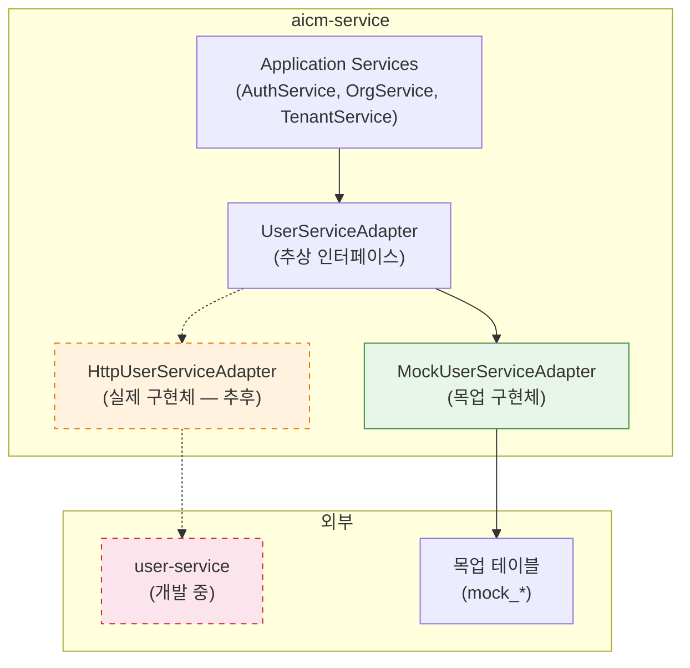

> **문서 상태**
> | 항목 | 값 |
> |------|-----|
> | 상태 | `draft` |
> | 검수 | `unreviewed` |
> | 출처 | `docs/02-architecture/06-external-integration/README.md` (신규 추가 예정) |
> | 최종 수정 | 2026-04-12 |

# user-service 연동

> 원문 위치: [외부 서비스 연동](./README.md) (§7.x 신규 추가 예정)

user-service는 전사 사용자 정보, 조직도, 권한을 관리하는 외부 서비스이다. AICM은 user-service로부터 사용자/조직 정보를 동기화하여 문서 접근 권한, 승인 라인 구성, 조직별 게시판 할당 등에 활용한다.

> **개발 현황**: user-service의 조직도 API는 담당자가 개발 중이며, 당장 연동이 불가하다. AICM 측에서 **추상화 레이어**를 먼저 정의하고 **목업 데이터**로 개발을 진행한다. user-service API가 준비되면 구현체만 교체하여 실제 연동을 활성화한다.

---

## 연동 범위

| # | 연동 항목 | 설명 | 현재 상태 |
|---|----------|------|----------|
| 1 | **조직도** | 전사적인 부서/팀 트리 구조 | user-service 개발 중 → 목업 |
| 2 | **사용자 정보 및 메타데이터** | 사용자 기본 정보 + (선택) 포털·인사 연동용 표시 라벨 — **AICM 인가와 무관**, 고정 3단계(`system`/`admin`/`normal`)를 강제하지 않음 | user-service 개발 중 → 목업 |
| 3 | **테넌트별 인프라 접근 정보** | SaaS 환경에서 테넌트별 DB/Redis/MinIO 접속 정보 | 기구현 (참고만 유지) |

---

## 추상화 전략

### 계층 구조



### 전환 전략

| Phase | 환경 | Adapter 구현체 | 데이터 소스 |
|-------|------|---------------|------------|
| **Phase 1** (현재) | 개발/스테이징 | `MockUserServiceAdapter` | `mock_*` 테이블 |
| **Phase 2** (user-service 준비 후) | 스테이징 | `HttpUserServiceAdapter` | user-service API |
| **Phase 3** (검증 완료 후) | 프로덕션 | `HttpUserServiceAdapter` | user-service API |

> **Feature Flag**: `ff:user_service.use_mock` (기본값: `true`)로 Adapter 구현체를 전환한다. user-service API 준비 후 `false`로 설정하면 실제 연동을 활성화한다.

---

## 1. 조직도 연동

### 1.1 개요

user-service는 전사 조직도를 **부서(Department) 트리 구조**로 관리한다. AICM은 이 조직도를 동기화하여:
- 문서 접근 권한 부여 시 "특정 부서 및 하위 부서"에 권한 할당
- 승인 라인 구성 시 결재자의 소속 부서 기반 자동 추천
- 게시판을 특정 부서에 할당

### 1.2 기대 데이터 구조

user-service가 제공할 것으로 예상되는 조직도 API 응답 구조이다. **DTO·API 계약 필드명은 모두 camelCase**로 정의한다 (RDB 컬럼은 §1.4처럼 snake_case를 유지하고 엔티티/매퍼에서 변환).

```typescript
// GET /api/v1/organizations/tree (예상)
interface OrganizationTreeResponse {
  root: DepartmentNode;
  totalDepartments: number;
  totalUsers: number;
  syncedAt: string;            // ISO 8601
}

interface DepartmentNode {
  id: string;                   // 부서 고유 ID
  code?: string;                // 부서 코드 (HR 시스템 연계용) — 선택
  name: string;                 // 부서명
  nameEn?: string;              // 영문 부서명
  level: number;                // 트리 깊이 (0 = 최상위)
  parentId?: string;            // 상위 부서 ID (root는 미전달)
  path: string;                 // 경로 (예: "company/dev/backend")
  managerId?: string;           // 부서장 사용자 ID
  sortOrder?: number;           // 형제 노드 내 정렬 순서 — 선택
  isActive: boolean;            // 활성 여부
  children: DepartmentNode[];   // 하위 부서 목록
  userCount?: number;           // 직속 사용자 수 (하위 부서 미포함) — 선택
}
```

### 1.3 목업 조직도 데이터

개발/테스트용 샘플 조직도 구조이다.

```
[회사] (id: org-root)
├── [경영지원본부] (id: dept-mgmt)
│   ├── [인사팀] (id: dept-hr)
│   ├── [재무팀] (id: dept-finance)
│   └── [총무팀] (id: dept-admin)
├── [기술본부] (id: dept-tech)
│   ├── [개발1팀] (id: dept-dev1)
│   │   ├── [백엔드파트] (id: dept-backend)
│   │   └── [프론트엔드파트] (id: dept-frontend)
│   ├── [개발2팀] (id: dept-dev2)
│   ├── [인프라팀] (id: dept-infra)
│   └── [QA팀] (id: dept-qa)
├── [영업본부] (id: dept-sales)
│   ├── [국내영업팀] (id: dept-sales-domestic)
│   └── [해외영업팀] (id: dept-sales-global)
└── [고객지원본부] (id: dept-support)
    ├── [기술지원팀] (id: dept-tech-support)
    └── [고객상담팀] (id: dept-cs)
```

### 1.4 목업 테이블 스키마 — `mock_departments`

```sql
CREATE TABLE mock_departments (
    id UUID PRIMARY KEY DEFAULT gen_random_uuid(),
    code VARCHAR(50) NULL UNIQUE,                  -- 선택 — 미제공 시 NULL
    name VARCHAR(100) NOT NULL,
    name_en VARCHAR(100),
    level INT NOT NULL DEFAULT 0,
    parent_id UUID REFERENCES mock_departments(id),
    path VARCHAR(500) NOT NULL,                    -- Materialized Path (예: "org-root/dept-tech/dept-dev1")
    manager_id UUID,                               -- mock_user.id FK (nullable)
    sort_order INT NULL,                           -- 선택 — 미제공 시 NULL
    user_count INT NULL,                           -- 선택 — 직속 인원 스냅샷, 미계산 시 NULL
    is_active BOOLEAN NOT NULL DEFAULT true,
    created_at TIMESTAMPTZ NOT NULL DEFAULT NOW(),
    updated_at TIMESTAMPTZ NOT NULL DEFAULT NOW(),
    
    CONSTRAINT chk_level_parent CHECK (
        (level = 0 AND parent_id IS NULL) OR
        (level > 0 AND parent_id IS NOT NULL)
    )
);

CREATE INDEX idx_mock_departments_parent ON mock_departments(parent_id);
CREATE INDEX idx_mock_departments_path ON mock_departments USING gist (path gist_trgm_ops);
CREATE INDEX idx_mock_departments_code ON mock_departments(code);
```

> **RDB ↔ 애플리케이션**: 위 컬럼은 PostgreSQL 관례에 따라 snake_case이다. TypeORM 엔티티는 `camelCase` 프로퍼티로 정의하고 `@Column({ name: 'sort_order' })` 등으로 매핑한다. `buildDepartmentTree` 등에서 `DepartmentNode`로 변환할 때도 camelCase로 노출한다.

---

## 2. 사용자 정보 및 권한 연동

### 2.1 개요

user-service는 사용자 기본 정보와 (선택) 포털·인사 시스템이 붙이는 **표시용 메타데이터**를 보관할 수 있다. AICM은 사용자 정보를 동기화하여:
- 로그인/인증 시 사용자 정보 조회
- 문서 작성자/승인자 정보 표시
- UI·감사·리포트용 라벨 표시

**AICM 애플리케이션 인가**는 user-service 라벨이 아니라 [FD-ACL](../../01-requirements/features/FD-ACL-권한체계.md)의 `BoardPermission`·`AdminPermission`·소유자 규칙만 사용한다.

### 2.2 외부 표시 라벨(선택)

고객사·포털마다 사용자 분류 방식이 다르므로, **고정된 3단계(`system`/`admin`/`normal`) 계층을 전제로 하지 않는다.** 필요 시 문자열 필드(예: `externalRoleLabel`)로 저장하며, 값 집합은 user-service 계약으로 정한다. 아래 표는 **목업·레거시 예시**일 뿐 인가 규칙이 아니다.

| 예시 라벨(참고) | 설명(참고) |
|----------------|-----------|
| (임의 문자열) | 포털·인사 정책에 따른 표시 — AICM 인가와 무관 |

> **권한 상세(SSoT)**: [FD-ACL 권한체계](../../01-requirements/features/FD-ACL-권한체계.md). `AdminPermission`은 외부 라벨과 무관하게 AICM Role에 매핑되면 적용된다.

### 2.3 기대 데이터 구조

```typescript
// GET /api/v1/users/{userId} (예상)
interface UserResponse {
  id: string;                   // 사용자 고유 ID
  employeeId: string;           // 사번 (HR 시스템 연계용)
  email: string;                // 이메일 (로그인 ID)
  name: string;                 // 성명
  nameEn?: string;              // 영문명
  phone?: string;               // 연락처
  profileImageUrl?: string;     // 프로필 이미지 URL
  departmentId: string;         // 소속 부서 ID
  departmentPath: string;       // 소속 부서 경로
  position: string;             // 직급 (예: "선임", "책임", "수석")
  jobTitle?: string;            // 직책 (예: "팀장", "파트장")
  /** 포털·인사 연동 표시용 — AICM 인가와 무관 */
  externalRoleLabel?: string;
  status: UserStatus;           // 사용자 상태
  joinedAt?: string;            // 입사일 (선택)
  lastLoginAt?: string;         // 마지막 로그인
}

type UserStatus = 'active' | 'inactive' | 'suspended' | 'resigned';
```

```typescript
// GET /api/v1/users?departmentId={deptId}&includeChildren=true (예상)
interface UserListResponse {
  users: UserSummary[];
  totalCount: number;
  page: number;
  pageSize: number;
}

interface UserSummary {
  id: string;
  employeeId: string;
  email: string;
  name: string;
  departmentId: string;
  departmentName: string;
  position: string;
  jobTitle?: string;
  externalRoleLabel?: string;
  status: UserStatus;
}
```

### 2.4 목업 테이블 스키마 — `mock_user`

```sql
CREATE TABLE mock_user (
    id UUID PRIMARY KEY DEFAULT gen_random_uuid(),
    employee_id VARCHAR(50) NOT NULL UNIQUE,
    email VARCHAR(255) NOT NULL UNIQUE,
    name VARCHAR(100) NOT NULL,
    name_en VARCHAR(100),
    phone VARCHAR(20),
    profile_image_url VARCHAR(500),
    department_id UUID NOT NULL REFERENCES mock_departments(id),
    position VARCHAR(50) NOT NULL,                 -- 직급
    job_title VARCHAR(50),                         -- 직책
    external_role_label VARCHAR(64) NULL,
    status VARCHAR(20) NOT NULL DEFAULT 'active'
        CHECK (status IN ('active', 'inactive', 'suspended', 'resigned')),
    joined_at DATE,
    last_login_at TIMESTAMPTZ,
    created_at TIMESTAMPTZ NOT NULL DEFAULT NOW(),
    updated_at TIMESTAMPTZ NOT NULL DEFAULT NOW()
);

CREATE INDEX idx_mock_user_department ON mock_user(department_id);
CREATE INDEX idx_mock_user_email ON mock_user(email);
CREATE INDEX idx_mock_user_employee_id ON mock_user(employee_id);
CREATE INDEX idx_mock_user_external_role ON mock_user(external_role_label);
CREATE INDEX idx_mock_user_status ON mock_user(status);
```

### 2.5 목업 사용자 데이터

| ID | 사번 | 이름 | 부서 | 직급 | 직책 | external_role_label(예시) |
|----|------|------|------|------|------|---------------------------|
| user-001 | EMP001 | 김시스템 | 인프라팀 | 수석 | - | platform_ops |
| user-002 | EMP002 | 이관리 | 개발1팀 | 책임 | 팀장 | dept_lead |
| user-003 | EMP003 | 박개발 | 백엔드파트 | 선임 | 파트장 | dept_lead |
| user-004 | EMP004 | 최프론트 | 프론트엔드파트 | 선임 | - | (NULL) |
| user-005 | EMP005 | 정품질 | QA팀 | 책임 | - | (NULL) |
| user-006 | EMP006 | 한영업 | 국내영업팀 | 책임 | 팀장 | (NULL) |
| user-007 | EMP007 | 강인사 | 인사팀 | 선임 | - | (NULL) |
| user-008 | EMP008 | 윤신입 | 백엔드파트 | 사원 | - | (NULL) |

---

## 3. 테넌트 인프라 정보 연동 (기구현 참고)

> 이 항목은 신규 상세 설계 대상이 아니다. `aicm-service-v2`에 이미 구현된 동작을 기준으로 핵심만 기록한다.

### 3.1 현재 구현 기준 (요약)

- `TenantService`가 user-service에서 테넌트 설정을 조회하고, 요청별 DB 연결을 동적으로 구성한다.
- 조회 경로는 `USER_SERVICE_CONFIG_PATH`를 사용하며, 기본 필터는 `db_config`, `minio_config`, `es_config`, `milvus_config`이다.
- 인증 토큰 기반 조회와 내부 배치용 내부 인증(HMAC) 조회를 분리하여 운영한다.
- `TenantConfigCache`/`AuthTokenCache` 2단계 캐시를 사용해 호출 부하를 줄인다.
- 로컬 개발에서는 `USE_LOCAL_DB_MODE=true`로 외부 호출 없이 로컬 DB 설정을 사용한다.

### 3.2 설계 반영 원칙

- 본 문서에서는 테넌트 인프라 설정의 상세 스키마/목업 테이블을 별도로 정의하지 않는다.
- user-service가 제공하는 계약을 SSoT로 간주하고, AICM 문서는 **연동 사실과 운영 원칙만** 유지한다.
- 테넌트 인프라 계약 변경이 필요할 때만 별도 변경 문서를 추가한다.

---

## 4. 추상화 레이어 설계 핵심원칙

### 4.1 경계 분리 원칙

- AICM 도메인 서비스는 user-service의 HTTP 스펙에 직접 의존하지 않고, 반드시 **어댑터 인터페이스**를 통해서만 접근한다.
- 조직도, 사용자, 테넌트 인프라를 하나의 채널로 혼합하지 않고, **조회 책임을 논리적으로 분리**한다.
- user-service 미완성 상태에서도 AICM 기능이 동작해야 하므로, 실제 연동과 목업 연동은 **런타임 교체 가능 구조**를 전제로 설계한다.

### 4.2 계약 안정성 원칙

- API/DTO 필드명은 camelCase를 표준으로 사용한다.
- RDB는 snake_case를 유지하되, 매퍼/엔티티 계층에서 변환하고 도메인 외부로는 노출하지 않는다.
- `code`, `sortOrder`, `userCount`처럼 외부 서비스에서 항상 제공되지 않을 수 있는 값은 **옵셔널**로 취급한다.
- user-service가 저장하는 표시 라벨(있다면)은 **고객사 계약 문자열**이며, AICM 인가에 사용하지 않는다. **AICM 애플리케이션 인가**는 AICM **Role**의 `BoardPermission`·`AdminPermission`만으로 판단한다([FD-ACL](../../../01-requirements/features/FD-ACL-권한체계.md) §2).

### 4.3 보안·민감정보 원칙

- 테넌트 인프라 접속정보는 평문 저장/로그 출력 금지, 조회 시점 복호화 최소화를 원칙으로 한다.
- 인프라 자격증명은 운영 단계에서 Vault 기반 비밀관리로 이관 가능한 형태로 설계한다.
- 로그/모니터링에는 식별자 중심으로 남기고, 비밀번호·토큰·시크릿은 마스킹 또는 비기록을 기본 정책으로 한다.

---

## 5. 동기화 설계 핵심원칙

### 5.1 동기화 방식 우선순위

- 현재 단계는 **수동 동기화 + 목업 데이터 기반 개발**을 기본으로 한다.
- user-service 기능이 준비되면 웹훅 또는 증분 조회 방식으로 전환하되, 전체 재동기화 경로를 항상 유지한다.
- 동기화 실패는 부분 성공을 허용하되, 재시도 가능 상태와 최종 실패 상태를 명확히 구분한다.

### 5.2 정합성·멱등성 원칙

- 동일 동기화 요청이 반복되어도 결과가 훼손되지 않도록 멱등성을 보장한다.
- 조직도와 사용자 데이터는 최신 스냅샷 기준으로 upsert하는 전략을 사용한다.
- 동기화 시점, 데이터 버전(또는 체크포인트), 처리 결과를 추적 가능하게 관리한다.

### 5.3 성능·캐시 원칙

- 사용자/조직도 조회는 캐시를 사용하되, 권한·조직 변경 이벤트 시 캐시 무효화를 우선한다.
- 캐시는 정합성의 단일 근거가 아니며, 최종 기준(SSoT)은 동기화 저장소로 둔다.
- 대량 동기화 시 페이지네이션/배치 처리를 전제로 하여 메모리 급증을 방지한다.

---

## 6. 목업 데이터 운영 핵심원칙

- 목업 데이터는 실제 user-service 응답 구조와 동일한 계약을 따르되, 업무 검증에 필요한 최소 필드만 유지한다.
- 조직도/사용자/테넌트 인프라는 서로 참조 무결성을 갖도록 설계한다.
- 목업과 실연동 전환 시 데이터 계약 차이를 빠르게 식별할 수 있도록 샘플 검증 시나리오를 유지한다.
- 목업 데이터는 개발·검증 목적에 한정하며, 운영 환경의 권한 근거로 사용하지 않는다.

---

## 관련 문서

- [외부 서비스 연동](./README.md) — 상위 문서
- [FD-ACL 권한체계](../../01-requirements/features/FD-ACL-권한체계.md) — AICM 내부 역할 권한 체계
- [retrieval-service 연동](./6-3-retrieval-service-integration.md) — 유사한 형식의 외부 서비스 연동 문서
- [aicm-service-v2 `TenantService`](../../aicm-service-v2/src/tenant/services/tenant.service.ts) — 테넌트 설정 조회/캐시/연결 관리
- [aicm-service-v2 `tenant.type`](../../aicm-service-v2/src/tenant/types/tenant.type.ts) — `db_config`/`minio_config`/`es_config`/`milvus_config` 계약
- [aicm-service-v2 `validation.config`](../../aicm-service-v2/src/config/validation.config.ts) — 멀티테넌트 연동 환경변수 규약

---

## 미결정 사항

| # | 항목 | 현재 상태 | 결정 필요 시점 |
|---|------|----------|--------------|
| 1 | user-service API 스펙 확정 | 예상 스펙 기반 설계 | user-service API 설계 확정 시 |
| 2 | 인증 방식 (API Key vs JWT vs mTLS) | TBD | user-service와 협의 후 |
| 3 | 웹훅 vs 폴링 동기화 | TBD | user-service 기능 확정 후 |
| 4 | 사용자 삭제 정책 (soft delete vs hard delete) | TBD | 개인정보 보호 정책 검토 후 |
