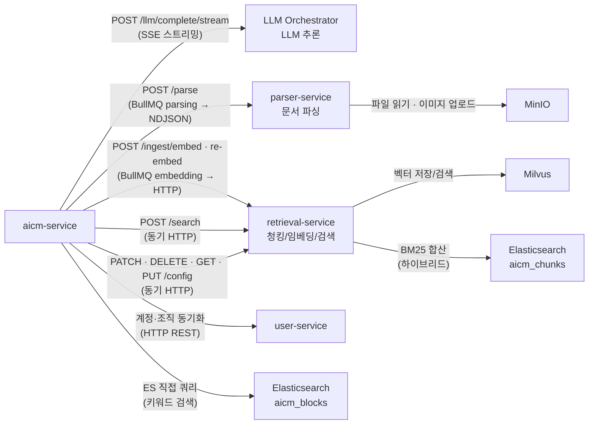
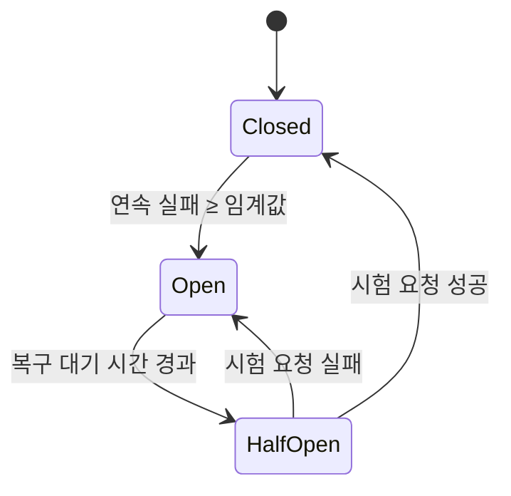

> **문서 상태**
> | 항목 | 값 |
> |------|-----|
> | 상태 | `draft` |
> | 검수 | `unreviewed` |
> | 작성일 | 2026-03-16 |
> | 최종 수정 | 2026-04-12 |
>
> **미비 사항**
> - [ ] 서비스 간 통신 보안 — 인증 방식 미결정 (§7.4 참조)

# 외부 서비스 연동

> LLM Orchestrator, parser-service, retrieval-service, user-service 연동 아키텍처 및 횡단 관심사

---

## 문서 구조

| 파일 | 설명 |
|------|------|
| **README.md** (본 문서) | 개요, LLM Orchestrator 연동, 통신 보안, 장애 격리, 에러 처리 |
| [6-1-parser-service-integration.md](./6-1-parser-service-integration.md) | parser-service 연동 상세 — NDJSON 프로토콜, 큐 설계, ERD 변경 |
| [6-2-parser-content-intermediate-format.md](./6-2-parser-content-intermediate-format.md) | Parser Content 중간 포맷(에디터-무관 Block 변환) 설계 |
| [6-3-retrieval-service-integration.md](./6-3-retrieval-service-integration.md) | retrieval-service 연동 상세 — 임베딩, 검색, 설정 동기화, 엔드포인트별 요청/응답 |
| [6-4-retrieval-edge-case-recommendations.md](./6-4-retrieval-edge-case-recommendations.md) | retrieval-service 엣지케이스(EC-01~EC-12) 분석 및 대응 방안 |
| [6-5-user-service-integration.md](./6-5-user-service-integration.md) | user-service 연동 — 멀티테넌트 계정·조직 동기화 |
| [specs/parser-service-api-spec.md](./specs/parser-service-api-spec.md) | parser-service API 스펙 (담당팀 전달용) |
| [specs/retrieval-service-api-spec.md](./specs/retrieval-service-api-spec.md) | retrieval-service API 스펙 (담당팀 전달용) |

---

## 연동 서비스 개요

| 서비스 | 역할 | 통신 방식 | 상세 문서 |
|--------|------|----------|----------|
| LLM Orchestrator | LLM 추론 — 요약, 글쓰기 개선, 이미지 분석 | HTTP + SSE 스트리밍 | 본 문서 §7.1 |
| parser-service (FastAPI) | 외부 문서(PDF, DOCX 등) 파싱 → Block 변환 | BullMQ → HTTP (NDJSON 스트리밍) | [6-1](./6-1-parser-service-integration.md) |
| retrieval-service (FastAPI) | 청킹, 임베딩, 시맨틱/하이브리드 검색 | BullMQ → HTTP (임베딩) · 동기 HTTP (검색) | [6-3](./6-3-retrieval-service-integration.md) |
| user-service | 멀티테넌트 계정·조직 동기화 | HTTP REST | [6-5](./6-5-user-service-integration.md) |

---

## 데이터 흐름



---

### 7.1 LLM Orchestrator 연동

AICM은 LLM Orchestrator의 HTTP API를 호출하는 클라이언트로만 동작한다.

**배포 환경별 프로바이더 제약**

AICM이 LLM Orchestrator를 호출할 때 `provider` 파라미터로 사용할 프로바이더를 지정한다. SystemConfig `lm:ai.allowed_providers` 및 배포 환경(SaaS/온프레미스)에 의해 허용되지 않은 프로바이더를 요청하면 LLM Orchestrator가 거부한다.

| 배포 환경 | 허용 프로바이더 | 임베딩 모델 서빙 |
|-----------|---------------|----------------|
| SaaS | `claude`, `openai`, `gemini`, `sllm` 등 전체 | 외부 API 또는 로컬 |
| 온프레미스(폐쇄망) | `sllm` 전용 | 로컬 전용 (Sentence Transformers, BGE 등) |

> **온프레미스 sLLM 인프라 요구사항**: GPU 서버(VRAM 24GB+ 권장), 모델 서빙 프레임워크(vLLM, Ollama 등), 오프라인 모델 배포 절차(에어갭 환경에서 모델 파일 수동 배포)가 필요하다. 구체적인 인프라 사양은 고객사 환경에 따라 별도 산정한다.

**연동 인터페이스**

| AICM 기능 | LLM Orchestrator 엔드포인트 | 방식 |
|-----------|---------------------------|------|
| 문서 요약 (자동/수동) | `POST /llm/complete/stream` | SSE 스트리밍 |
| 글쓰기 개선 | `POST /llm/complete/stream` | SSE 스트리밍 |
| 이미지 분석 | `POST /llm/complete` | 동기 (멀티모달) |
| AI 사용 통계 조회 | `GET /usage/summary` | 동기 |

**요청 구조**

```typescript
interface LlmCompleteRequest {
  tenant_id: string;
  provider?: string;             // LLM 프로바이더 (허용 목록·배포 환경 내에서 선택)
  prompt_name: string;           // 기능별 프롬프트 슬롯 (doc_summary_oneline 등)
  variables: Record<string, string>;  // 프롬프트 템플릿 변수
  stream: boolean;
  metadata?: {
    document_id?: string;
    block_ids?: string[];
    feature: 'summary' | 'writing_improvement' | 'image_analysis';
  };
}
```

> **provider 기본 동작**: `provider` 미지정 시 SystemConfig `lm:ai.default_provider` 값을 사용한다 (SaaS: `claude`, 온프레미스: `sllm`). 온프레미스 환경에서 `sllm` 외 프로바이더를 요청하면 LLM Orchestrator가 `403 Provider Not Allowed`를 반환한다.

**LlmOrchestratorClientModule 구조**

```typescript
@Module({
  providers: [
    LlmOrchestratorClient,   // HTTP 클라이언트 (axios)
    LlmOrchestratorService,  // 비즈니스 로직 래핑
  ],
  exports: [LlmOrchestratorService],
})
export class LlmOrchestratorClientModule {}
```

**SSE 스트리밍 클라이언트 패턴**

LLM Orchestrator의 `POST /llm/complete/stream` 엔드포인트와 SSE(Server-Sent Events) 방식으로 통신한다. NestJS 서버 환경에서 SSE를 수신하는 클라이언트 패턴을 정의한다.

*기술 선택*: `fetch` API + `ReadableStream` 기반으로 SSE를 수신한다. 브라우저 전용 `EventSource` API는 Node.js 서버 환경에서 사용할 수 없으며, POST 요청과 커스텀 헤더(`X-API-Key`, `X-Trace-Id`)를 지원해야 하므로 fetch 기반이 적합하다.

```typescript
interface SseClientConfig {
  first_token_timeout_ms: number;  // 첫 토큰 수신 대기 (기본: 30s, sLLM: 120s)
  total_timeout_ms: number;        // 전체 스트리밍 타임아웃 (기본: 120s, sLLM: 300s)
  reconnect_max_attempts: number;  // 재연결 최대 시도 (기본: 0 — 재연결하지 않음)
  chunk_delimiter: string;         // SSE 이벤트 구분자 (기본: '\n\n')
}
```

*연결 끊김 시 재연결 전략*: LLM 추론 요청은 멱등하지 않으므로(동일 프롬프트라도 결과가 달라짐), **자동 재연결하지 않는다**. 연결 끊김 시 에러 이벤트를 프론트엔드에 전달하고, 사용자가 재시도 버튼으로 새 요청을 생성하도록 한다.

*부분 응답 버퍼링*: SSE 청크가 도착할 때마다 `LlmOrchestratorService`가 응답 버퍼에 누적한다. 연결 끊김 시 버퍼에 누적된 부분 응답을 에러 이벤트와 함께 프론트엔드에 전달하여, 사용자가 이미 수신된 내용을 확인할 수 있도록 한다.

*2단계 타임아웃*:

| 단계 | 설명 | SaaS 기본값 | 온프레미스(sLLM) 기본값 | 설정 키 |
|------|------|------------|---------------------|---------|
| 첫 토큰 수신 대기 | 연결 성공 후 첫 데이터 청크까지의 대기 시간 | 30s | 120s | `lm:ai.sse_first_token_timeout_ms` |
| 전체 스트리밍 | 첫 토큰 이후 전체 스트리밍 완료까지의 총 시간 | 120s | 300s | `lm:ai.sse_total_timeout_ms` |

> 온프레미스 sLLM은 모델 로딩·컨텍스트 준비에 시간이 걸리므로 첫 토큰 타임아웃을 120s로 확장한다. 값은 SystemConfig로 테넌트별 오버라이드가 가능하다.

---

### 7.2 parser-service(FastAPI) 연동

parser-service는 외부 문서(PDF, DOCX, PPTX, XLSX, HWP)를 파싱하여 Block 구조로 변환하는 Python 서비스이다.

- **통신 방식**: aicm-service의 BullMQ 워커(`ParsingProcessor`)가 `POST /parse`를 호출한다. 응답은 **NDJSON 스트리밍**으로 블록을 한 줄씩 전송하여 대용량 문서에서도 메모리 부담을 방지한다.
- **MinIO 직접 접근**: 원본 파일 읽기와 추출 이미지 업로드를 위해 MinIO에 직접 접근한다. 이미지를 응답 본문에 포함하지 않으므로 응답 크기가 안정적이다.
- **기본 동작**: parser-service 미설정(연결 정보 미제공) 시 외부 문서 파싱 기능을 비활성화한다.

> 요청/응답 구조, NDJSON 프로토콜, 에러 처리, 큐 설계, ERD 변경 등 상세 내용은 **[6-1-parser-service-integration.md](./6-1-parser-service-integration.md)** 참조.
> parser-service 담당팀에 전달할 API 스펙은 **[specs/parser-service-api-spec.md](./specs/parser-service-api-spec.md)** 참조.

---

### 7.3 retrieval-service(FastAPI) 연동

retrieval-service는 블록 청킹, 임베딩 생성, 시멘틱/하이브리드 검색을 담당하는 Python 서비스이다.

- **테넌트 스코프**: 테넌트당 1인스턴스로 배포된다. API 요청에 테넌트 식별자가 불필요하다.
- **통신 방식**: 임베딩(`POST /ingest/embed`, `POST /ingest/re-embed`)은 BullMQ 워커(`EmbeddingProcessor`)에서 비동기 호출한다. 검색(`POST /search`)과 관리 API는 동기 HTTP로 호출한다.
- **검색 역할 분리**: 키워드 검색은 aicm-service가 Elasticsearch를 직접 쿼리한다. 시맨틱/하이브리드 검색만 retrieval-service에 위임한다.
- **기본 동작**: retrieval-service 미설정 시 키워드 검색만 제공하며, 임베딩 파이프라인도 비활성화된다.

| 기능 그룹 | 엔드포인트 | 호출 방식 |
|-----------|----------|----------|
| 임베딩 | `POST /ingest/embed`, `POST /ingest/re-embed` | BullMQ 비동기 |
| 삭제 | `DELETE /sources/{sourceId}`, `DELETE /sources` | 동기 |
| 메타데이터 | `PATCH /sources/{sourceId}/metadata` | 동기 |
| 검색 | `POST /search` | 동기 |
| 설정 | `PUT /config` | 동기 |
| 운영 | `GET /sources/{sourceId}/chunks`, `GET /health` | 동기 |

> 엔드포인트별 요청/응답 구조, 배치 분할 전략, 재임베딩 흐름, 엣지케이스 등 상세 내용은 **[6-3-retrieval-service-integration.md](./6-3-retrieval-service-integration.md)** 참조.
> 엣지케이스 분석은 **[6-4-retrieval-edge-case-recommendations.md](./6-4-retrieval-edge-case-recommendations.md)**, 담당팀 전달용 API 스펙은 **[specs/retrieval-service-api-spec.md](./specs/retrieval-service-api-spec.md)** 참조.

---

### 7.4 서비스 간 통신 보안

> **TBD** — 서비스 간 통신 보안 체계는 미결정 상태이며, 아래 결정이 필요하다.

**결정 필요 사항**

| # | 결정 항목 | 현재 논의 중인 대안 | 고려사항 |
|---|----------|-------------------|---------|
| 1 | 서비스 간 인증 방식 | (a) API Key — 서비스별 정적 키 발급, 헤더(`X-API-Key`)로 전달<br/>(b) 내부 JWT — 서비스 계정으로 발급한 JWT, `Authorization: Bearer {token}`<br/>(c) mTLS — 인증서 기반 상호 인증, 네트워크 레이어에서 처리<br/>(d) 네트워크 격리 — K8s NetworkPolicy 등으로 접근 제한, 애플리케이션 인증 생략 | 온프레미스 폐쇄망에서도 동작해야 함. 금융권 감사 요건에서 "누가 이 API를 호출했는가" 증명 필요 |
| 2 | 요청 추적(Correlation ID) 전파 | `X-Trace-Id` 헤더로 07-cross-cutting §8.3의 traceId를 서비스 간 호출에 전파. 수신 서비스는 자체 로그에 해당 traceId를 포함하여 분산 추적 지원 | 현재 aicm-service 내부에서만 traceId 사용 중. 외부 서비스 전파 규칙 미정의 |
| 3 | 감사 로그 연계 | 서비스 간 호출을 AuditLog에 기록할 것인지, 인프라 레이어(Access Log)에서만 추적할 것인지 | 07-cross-cutting §8.1의 감사 대상 범위와 연계 필요 |
| 4 | tenant_id 검증 주체 | LLM Orchestrator에 전달하는 `tenant_id`가 호출자 인증 컨텍스트와 일치하는지 검증하는 주체 결정 (aicm-service vs LLM Orchestrator) | SaaS 멀티테넌트 환경에서 테넌트 간 데이터 격리 필수 |

> **권장안**: 초기 단계(v0.x)에서는 **API Key + IP 화이트리스트**(대안 (a) + (d) 병행)로 시작한다. 서비스별 정적 API Key를 `X-API-Key` 헤더로 전달하고, K8s NetworkPolicy로 허용 Pod 간 통신만 허용한다. 프로덕션 전환(v1.0+) 시 금융권 감사 요건에 따라 **mTLS**(대안 (c))를 검토하며, 필요 시 ADR로 분리하여 결정한다.
>
> **결정 기한**: v1.0 릴리즈 전 결정 필요. 인증 미적용 상태로 프로덕션 배포하지 않는다.

**적용 대상 통신 경로**

| 출발 | 도착 | 프로토콜 | 현재 상태 |
|------|------|---------|----------|
| aicm-service | parser-service | HTTP REST (NDJSON 스트리밍 응답) | 인증 없음 |
| aicm-service | retrieval-service | HTTP REST | 인증 없음 |
| aicm-service | LLM Orchestrator | HTTP REST + SSE | 인증 없음 |
| aicm-service | user-service | HTTP REST | 인증 없음 |
| parser-service | MinIO | S3 API | MinIO 접속 정보 (환경변수) |

---

### 7.5 장애 격리 전략

외부 서비스 장애가 aicm-service로 전파되지 않도록 타임아웃, Circuit Breaker, Fallback을 적용한다.

**서비스별 타임아웃**

| 서비스 | 호출 경로 | HTTP 타임아웃 | 비고 |
|--------|----------|-------------|------|
| parser-service | BullMQ `parsing` 워커 → `POST /parse` (NDJSON 스트리밍) | 첫 라인: 60s, 라인 간: 30s | 총 스트리밍 시간은 BullMQ Job 타임아웃(10분)으로 제한. 상세는 아래 참조 |
| retrieval-service | BullMQ `embedding` 워커 → `POST /ingest/embed` | 5분 | BullMQ Job 타임아웃(5분)과 동일 |
| retrieval-service | 동기 → `POST /search` | 30s | 검색 응답 SLA 기준 |
| retrieval-service | 동기 → `PUT /config` | 10s | 설정 push, 경량 요청 |
| retrieval-service | 동기 → `DELETE /sources/{sourceId}` | 15s | 벡터 삭제 포함 |
| retrieval-service | 동기 → `DELETE /sources` (배치) | 60s | 최대 100건 일괄 삭제. 건수에 비례하여 소요 |
| retrieval-service | 동기 → `PATCH /sources/{sourceId}/metadata` | 10s | 메타데이터 필드 갱신, 경량 요청 |
| retrieval-service | 동기 → `GET /sources/{sourceId}/chunks` | 15s | 청크 목록 조회. 대형 문서(수백 청크) 고려 |
| retrieval-service | 동기 → `GET /health` | 3s | 경량 헬스체크. Circuit Breaker 프로브 용도 |
| LLM Orchestrator | 동기 → `POST /llm/complete` | 30s | 이미지 분석 등 비스트리밍 호출 |
| LLM Orchestrator | SSE → `POST /llm/complete/stream` | 120s | sLLM 장시간 추론 고려. 첫 토큰 미수신 시 30s 타임아웃 별도 적용 |
| LLM Orchestrator | 동기 → `GET /usage/summary` | 10s | 통계 조회, 경량 요청 |

> **parser-service 스트리밍 타임아웃 근거**: NDJSON 스트리밍 방식이므로 단일 HTTP 타임아웃 대신 2단계 타임아웃을 적용한다. (1) **첫 라인 대기(60s)**: 연결 성공 후 `metadata` 라인까지의 대기 시간. 파일 다운로드 + 파싱 초기화를 포함하며, OCR 활성화 시에도 60s면 첫 페이지 파싱에 충분하다. (2) **라인 간 대기(30s)**: 연속 NDJSON 라인 사이의 최대 대기 시간. 페이지 단위로 스트리밍하므로 30s 이상 무응답이면 parser-service가 hang된 것으로 판단한다. 총 스트리밍 시간은 BullMQ Job 타임아웃(10분)이 최종 안전망 역할을 한다. 타임아웃 값은 SystemConfig `pm:system.parser_first_line_timeout_ms`, `pm:system.parser_inter_line_timeout_ms`로 고객사 환경에 맞게 조정 가능하다.

**Circuit Breaker**

외부 서비스에 대한 동기 HTTP 호출에 Circuit Breaker 패턴을 적용한다. BullMQ를 통한 비동기 호출은 BullMQ 자체의 재시도/DLQ 정책([§6.6](../05-async-event-architecture.md))으로 관리하므로 Circuit Breaker를 적용하지 않는다.

| 상태 | 동작 |
|------|------|
| **Closed** (정상) | 요청을 정상 전달한다. 연속 실패 횟수를 카운트한다 |
| **Open** (차단) | 임계값 초과 시 전환. 요청을 즉시 실패 처리(fail-fast)하여 이벤트 루프 블로킹 방지. 복구 대기 시간 후 Half-Open으로 전환 |
| **Half-Open** (시험) | 제한된 수의 요청만 통과시켜 서비스 복구 여부를 확인. 성공 시 Closed, 실패 시 Open으로 복귀 |

| 서비스 | 실패 임계값 | 복구 대기 시간 | Half-Open 허용 요청 수 |
|--------|-----------|--------------|---------------------|
| retrieval-service (동기) | 연속 5회 실패 | 15s | 2 |
| LLM Orchestrator | 연속 3회 실패 | 30s | 1 |

> parser-service는 BullMQ 워커에서만 호출되므로 Circuit Breaker 대신 BullMQ 재시도 정책을 적용한다.



**Fallback 전략**

| 서비스 | 호출 | 장애 시 Fallback |
|--------|------|-----------------|
| retrieval-service | `POST /search` | 시맨틱/하이브리드 검색 불가 → 키워드 검색(ES `aicm_blocks` 직접 쿼리) 결과만 반환 (graceful degradation). 사용자에게 "일부 검색 기능이 제한됩니다" 안내 |
| retrieval-service | `PUT /config` | 설정 push 실패 → 로컬 캐시 유지, 재시도 Job 등록 |
| retrieval-service | `DELETE /sources/{sourceId}` | 임베딩 삭제 실패 → 삭제 마킹 후 Reconciliation 배치([§6.7](../05-async-event-architecture.md))에서 보정 |
| retrieval-service | `DELETE /sources` (배치) | 부분 실패 허용 — `failed_sources`에 실패 건을 포함하여 응답. 실패 건은 단건 `DELETE /sources/{sourceId}`로 재시도 |
| retrieval-service | `PATCH /sources/{sourceId}/metadata` | 메타데이터 갱신 실패 → 3회 재시도 후 실패 시 `EMB_E002`로 에스컬레이션. `is_suspended` 갱신 실패는 검색 필터 불일치를 유발하므로 CRITICAL 로그 |
| retrieval-service | `GET /sources/{sourceId}/chunks` | 조회 실패 → Reconciliation 배치 해당 문서 스킵, 다음 주기에 재시도 |
| retrieval-service | `GET /health` | 헬스체크 실패 → Circuit Breaker 상태 판단에만 사용 (사용자 대면 영향 없음) |
| parser-service | `POST /parse` | BullMQ 재시도/DLQ 정책 적용 ([§6.6](../05-async-event-architecture.md)). 사용자에게 `parsing_status = 'failed'` 표시 |
| LLM Orchestrator | `POST /llm/complete` | `EXTERNAL_SERVICE_UNAVAILABLE` (503) 반환. AI 기능 일시 불가 안내 |
| LLM Orchestrator | `POST /llm/complete/stream` | SSE 에러 이벤트 전달 후 연결 종료. 프론트엔드에서 재시도 버튼 노출 |

---

### 7.6 동기 호출 공통 에러 처리

retrieval-service와 LLM Orchestrator에 대한 동기 HTTP 호출에 공통 에러 처리 패턴을 적용한다.

**대상 동기 호출 경로**

| # | 서비스 | 엔드포인트 | 호출 주체 |
|---|--------|----------|----------|
| 1 | retrieval-service | `POST /search` | SearchService |
| 2 | retrieval-service | `PUT /config` | ConfigService |
| 3 | retrieval-service | `DELETE /sources/{sourceId}` | DocumentService |
| 4 | retrieval-service | `DELETE /sources` (배치) | DocumentService |
| 5 | retrieval-service | `PATCH /sources/{sourceId}/metadata` | EmbeddingService |
| 6 | retrieval-service | `GET /sources/{sourceId}/chunks` | ReconciliationService |
| 7 | retrieval-service | `GET /health` | RetrievalServiceClient |
| 8 | LLM Orchestrator | `POST /llm/complete` | LlmOrchestratorService |
| 9 | LLM Orchestrator | `GET /usage/summary` | LlmOrchestratorService |

**공통 처리 패턴**

1. **타임아웃 적용**: 서비스별 타임아웃(§7.5)을 HTTP 클라이언트(axios)에 설정
2. **에러 변환**: 외부 서비스 에러를 `EXTERNAL_SERVICE_UNAVAILABLE` (503)로 변환 — [07-cross-cutting §8.2.4](../07-cross-cutting-concerns.md) 참조
3. **traceId 전파**: 요청 헤더에 `X-Trace-Id`를 포함하여 서비스 간 추적 가능하게 한다 — [07-cross-cutting §8.3](../07-cross-cutting-concerns.md) 참조
4. **구조화 로깅**: 서비스명, 엔드포인트, HTTP 메서드, 응답 시간, 상태 코드, 에러 메시지를 구조화 JSON으로 기록

```typescript
interface ExternalCallLog {
  service: 'retrieval-service' | 'parser-service' | 'llm-orchestrator';
  endpoint: string;
  method: string;
  traceId: string;
  duration_ms: number;
  status: 'success' | 'timeout' | 'error';
  statusCode?: number;
  error?: string;
}
```

**에러 변환 매트릭스**

| 외부 서비스 응답 | aicm-service 변환 | 비고 |
|----------------|-------------------|------|
| 연결 실패 (ECONNREFUSED) | `EXTERNAL_SERVICE_UNAVAILABLE` (503) | Circuit Breaker Open 시 즉시 반환 |
| 타임아웃 (ETIMEDOUT) | `EXTERNAL_SERVICE_UNAVAILABLE` (503) | 타임아웃 값은 §7.5 참조 |
| HTTP 4xx (클라이언트 에러) | `INTERNAL_SERVER_ERROR` (500) | aicm-service의 요청 구성 오류. 로그 WARN 레벨 |
| HTTP 5xx (서버 에러) | `EXTERNAL_SERVICE_UNAVAILABLE` (503) | 외부 서비스 내부 오류 |

---

## 관련 문서

- [비동기 처리 아키텍처](../05-async-event-architecture.md) — BullMQ 큐에서 parser-service/retrieval-service 호출, 재시도/DLQ 정책
- [횡단 관심사](../07-cross-cutting-concerns.md) — 전역 에러 코드(`EXTERNAL_SERVICE_UNAVAILABLE`), traceId, 감사 로그
- [데이터 아키텍처](../data/README.md) — Milvus 스키마, 청킹 파이프라인
- [검색·RAG 파이프라인](../../01-requirements/flows/search-rag/README.md) — 파싱·검색 파이프라인 전략
