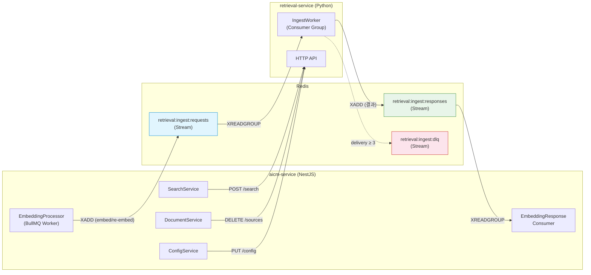
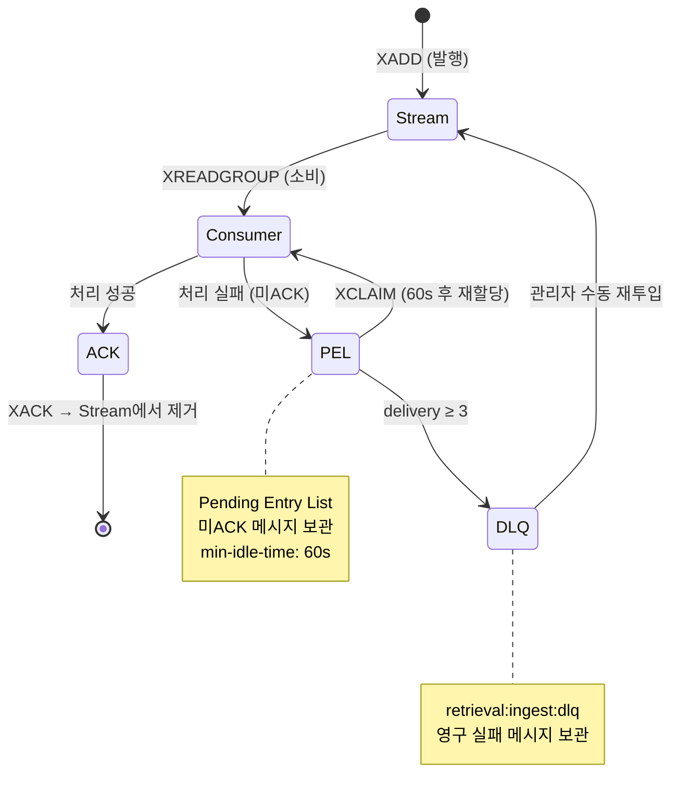

# retrieval-service API Spec

> Base URL: `{RETRIEVAL_SERVICE_URL}` (테넌트당 1인스턴스, 테넌트 식별자 불필요)

---

## 엔드포인트 요약

| Method | Endpoint | 설명 | 타임아웃 |
|--------|----------|------|---------|
| `POST` | `/ingest/embed` | 블록 청킹 + 임베딩 생성 | 5m |
| `POST` | `/ingest/re-embed` | 변경 블록 재임베딩 | 5m |
| `DELETE` | `/sources/{sourceId}` | 임베딩 삭제 (단건) | 15s |
| `DELETE` | `/sources` | 임베딩 삭제 (배치) | 60s |
| `PATCH` | `/sources/{sourceId}/metadata` | 메타데이터 갱신 | 10s |
| `GET` | `/sources/{sourceId}/chunks` | 청크 목록 조회 | 15s |
| `POST` | `/search` | 시맨틱/하이브리드 검색 | 30s |
| `PUT` | `/config` | 검색 설정 push | 10s |
| `GET` | `/health` | 헬스체크 | 3s |

---

## 연동 채널 구분

인제스트(임베딩/재임베딩)와 동기 조회/관리 API는 서로 다른 채널을 사용한다.

| 기능 | 채널 | 비고 |
|------|------|------|
| 임베딩 (`/ingest/embed`) | **Redis Streams** (비동기) | 주 경로. 아래 [§ Redis Streams 인터페이스](#redis-streams-인터페이스) 참조 |
| 재임베딩 (`/ingest/re-embed`) | **Redis Streams** (비동기) | 주 경로 |
| 검색, 삭제, 메타갱신, 청크 조회, 설정, 헬스체크 | **HTTP** (동기) | 기존 유지 |

> **HTTP 인제스트 엔드포인트 유지**: `POST /ingest/embed`, `POST /ingest/re-embed` HTTP 엔드포인트는 디버깅, Reconciliation 보정 등 보조 경로로 유지한다. 운영 인제스트 트래픽은 Redis Streams를 통해 흐른다.



---

## Redis Streams 인터페이스

aicm-service → retrieval-service 인제스트 요청과 retrieval-service → aicm-service 결과 응답에 Redis Streams를 사용한다. 기존 Redis 인프라를 활용하므로 추가 인프라가 불필요하다.

### Stream 및 Consumer Group

| Stream 이름 | 방향 | Consumer Group | 소비자 |
|-------------|------|----------------|--------|
| `retrieval:ingest:requests` | aicm-service → retrieval-service | `retrieval-ingest-workers` | retrieval-service 워커 |
| `retrieval:ingest:responses` | retrieval-service → aicm-service | `aicm-embedding-consumers` | aicm-service EmbeddingResponseConsumer |

### 요청 메시지 스키마 (`retrieval:ingest:requests`)

```typescript
interface IngestStreamMessage {
  correlation_id: string;            // 배치 추적 키 — '{parentJobId}:{batchIndex}' 또는 단일 Job ID
  type: 'embed' | 're-embed';       // 요청 유형
  request_id: string;                // 멱등성 키 (BullMQ Job ID)
  source_id: string;                 // 문서 ID (= document_id)
  blocks: IngestBlock[];             // 인제스트 대상 블록
  source_metadata: {
    board_id: string;
    tags: string[];
    is_suspended: boolean;
    content_hash: string;
  };
  chunking_config?: ChunkingConfig;
  // re-embed 전용 (type === 're-embed'일 때)
  modified_block_ids?: string[];
  added_block_ids?: string[];
  removed_block_ids?: string[];
}
```

> 블록 순서 규칙: `blocks[*].block_index`는 0-based 연속값이어야 하며, producer는 오름차순으로 전송한다. consumer는 배열 수신 순서를 신뢰하지 않고 `block_index`로 재정렬 후 처리한다. 중복/누락/비연속이면 `INVALID_BLOCK_ORDER`(400)를 반환한다.
>
> 메시지 크기 제한: Redis Stream 메시지는 `redis.conf`의 `proto-max-bulk-len`(기본 512MB)까지 허용되나, 운영 권장 상한은 **10MB**이다. 50블록 배치는 평균 ~1MB이므로 충분하다.

### 응답 메시지 스키마 (`retrieval:ingest:responses`)

```typescript
interface IngestStreamResponse {
  correlation_id: string;            // 요청의 correlation_id와 동일
  status: 'success' | 'partial' | 'error';
  source_id: string;
  chunks?: ChunkResult[];            // status !== 'error'일 때
  failed_blocks?: FailedBlock[];     // 실패 블록 목록
  error?: {                          // status === 'error'일 때
    code: string;
    message: string;
    details?: Record<string, any>;
  };
  processed_at: string;              // ISO 8601
}
```

### 소비 및 ACK 규칙

| 항목 | 규칙 |
|------|------|
| 소비 방식 | `XREADGROUP GROUP {group} {consumer} BLOCK 5000 COUNT 1 STREAMS {stream} >` |
| ACK 시점 | 메시지 처리 완료(성공/실패 응답 발행) 후 `XACK` |
| 미ACK 재할당 | PEL(Pending Entry List)에서 `min-idle-time` 60초 초과 시 `XCLAIM`으로 다른 consumer에 재할당 |
| 최대 재시도 | delivery count ≥ 3이면 DLQ stream(`retrieval:ingest:dlq`)으로 이동 |
| Stream 보존 | `MAXLEN ~ 10000` — 최근 10,000개 메시지 유지 (처리 완료 후 트림) |



### DLQ Stream

| Stream 이름 | 용도 |
|-------------|------|
| `retrieval:ingest:dlq` | 최대 재시도 초과 메시지 보관. 관리자 API로 조회/재투입 가능 |

DLQ 메시지에는 원본 메시지 전체 + `{ failed_at, delivery_count, last_error }` 메타데이터가 포함된다.

---

## 1. `POST /ingest/embed`

블록을 청킹하고 임베딩을 생성한다. 요청 단위는 문서 1건.

### Request

```typescript
interface IngestEmbedRequest {
  request_id: string;                   // 멱등성 키 (BullMQ Job ID 사용)
  source_id: string;                    // 문서 ID (= document_id)
  blocks: IngestBlock[];                // block_index 오름차순 전송
  source_metadata: {
    board_id: string;
    tags: string[];
    is_suspended: boolean;
    content_hash: string;               // 블록 해시 정렬·연결 후 SHA-256
  };
  chunking_config?: ChunkingConfig;
}
```

> 동일 `request_id` 재요청 시 실제 처리를 스킵하고 캐시된 이전 결과를 반환한다 (서버 사이드 멱등성).

### Response `200`

```typescript
interface IngestEmbedResponse {
  source_id: string;
  chunks: ChunkResult[];
  failed_blocks?: FailedBlock[];
}
```

---

## 2. `POST /ingest/re-embed`

변경된 블록의 청크만 교체한다. 전체 재임베딩이 아닌 블록 단위 교체.

### Request

```typescript
interface IngestReEmbedRequest {
  request_id: string;                   // 멱등성 키 (BullMQ Job ID 사용)
  source_id: string;                    // 문서 ID (= document_id)
  blocks: IngestBlock[];                // 변경 후 문서의 전체 블록 (현재 상태 — 삭제 블록 미포함, block_index 오름차순)
  modified_block_ids: string[];         // 내용이 변경된 블록 ID 목록
  added_block_ids: string[];            // 새로 추가된 블록 ID 목록
  removed_block_ids: string[];          // 삭제된 블록 ID 목록 (blocks에 미포함)
  source_metadata: {
    board_id: string;
    tags: string[];
    is_suspended: boolean;
    content_hash: string;               // 변경 후 해시
  };
  chunking_config: ChunkingConfig;
}
```

> `modified_block_ids`, `added_block_ids`, `removed_block_ids` 중 최소 하나는 비어 있지 않아야 한다.

### Response `200`

`IngestEmbedResponse`와 동일. 영향받은 블록에서 파생된 청크 및 인접 블록 그룹 재계산 결과가 `chunks`에 포함.

---

## 3. `DELETE /sources/{sourceId}`

문서의 모든 청크를 Milvus + ES에서 hard-delete한다.

### Path Parameters

| 파라미터 | 타입 | 설명 |
|---------|------|------|
| `sourceId` | `string` | 문서 ID (= `document_id`) |

### Response `200`

```typescript
interface DeleteSourceResponse {
  source_id: string;
  deleted_chunk_count: number;
}
```

> 해당 `sourceId`에 대한 청크가 존재하지 않는 경우(미임베딩 또는 이미 삭제) `200`과 `deleted_chunk_count: 0`을 반환한다. 멱등성을 보장한다.

---

## 4. `DELETE /sources`

다수 문서의 임베딩을 일괄 삭제한다.

### Request

```typescript
interface BatchDeleteSourcesRequest {
  source_ids: string[];                 // 최대 100건. 초과 시 400
}
```

### Response `200`

```typescript
interface BatchDeleteSourcesResponse {
  deleted_sources: number;
  deleted_chunk_count: number;
  failed_sources?: {
    source_id: string;
    error: string;
  }[];
}
```

---

## 5. `PATCH /sources/{sourceId}/metadata`

Milvus + ES의 비정규화 메타데이터를 갱신한다. 임베딩 벡터 변경 없음.

### Path Parameters

| 파라미터 | 타입 | 설명 |
|---------|------|------|
| `sourceId` | `string` | 문서 ID (= `document_id`) |

### Request

```typescript
interface UpdateSourceMetadataRequest {
  source_metadata: {
    board_id?: string;
    tags?: string[];
    is_suspended?: boolean;
  };
}
```

### Response `200`

```typescript
interface UpdateSourceMetadataResponse {
  source_id: string;
  updated_chunk_count: number;
  updated_fields: string[];
}
```

---

## 6. `GET /sources/{sourceId}/chunks`

문서에 속한 청크 목록을 조회한다.

### Path Parameters

| 파라미터 | 타입 | 설명 |
|---------|------|------|
| `sourceId` | `string` | 문서 ID (= `document_id`) |

### Response `200`

```typescript
interface ListChunksResponse {
  source_id: string;
  chunks: ChunkSummary[];
  total_count: number;
}

interface ChunkSummary {
  chunk_id: string;
  block_ids: string[];
  content_hash: string;
  created_at: string;                   // ISO 8601
}
```

---

## 7. `POST /search`

시맨틱 또는 하이브리드 검색을 수행한다.

### Request

```typescript
interface SearchRequest {
  query: string;
  mode: 'semantic' | 'hybrid';
  top_k?: number;                       // 미지정 시 PUT /config의 top_k
  threshold?: number;                   // 미지정 시 PUT /config의 similarity_threshold
  reranking?: {
    enabled?: boolean;
    top_n?: number;
  };
  filters?: {
    must?: {
      source_metadata?: Record<string, string[]>;
      // 예: { board_id: ["board-1", "board-2"] }
    };
    must_not?: {
      source_ids?: string[];
      block_ids?: string[];
    };
  };
}
```

### Response `200`

```typescript
interface SearchResponse {
  results: SearchResult[];
  metadata?: {
    mode: 'semantic' | 'hybrid';
    reranked: boolean;
    total_candidates: number;
  };
}

interface SearchResult {
  source_id: string;
  block_ids: string[];
  chunk_id: string;
  score: number;
  content: string;
  source_metadata?: Record<string, any>;
}
```

---

## 8. `PUT /config`

검색 설정(SearchConfig의 `rag_*` 파라미터)을 push 동기화한다.

### Request

```typescript
interface UpdateRetrievalConfigRequest {
  default_search_mode: 'keyword' | 'semantic' | 'hybrid';
  hybrid_weight_bm25: number;
  hybrid_weight_vector: number;
  rrf_k: number;
  top_k: number;
  similarity_threshold: number;
  window_context_size: number;
  reranking_enabled: boolean;
  reranking_model?: string | null;
  reranking_top_n?: number | null;
}
```

### Response `200`

```typescript
interface UpdateRetrievalConfigResponse {
  applied_at: string;                   // ISO 8601
}
```

---

## 9. `GET /health`

서비스 가용성 및 하위 인프라 연결 상태를 확인한다.

### Response `200`

```typescript
interface HealthResponse {
  status: 'ok' | 'degraded' | 'down';
  components: {
    milvus: 'connected' | 'disconnected';
    elasticsearch: 'connected' | 'disconnected';
    embedding_model: 'ready' | 'loading' | 'unavailable';
  };
  uptime_seconds: number;
}
```

| `status` | 조건 |
|----------|------|
| `ok` | Milvus + ES 모두 connected, 임베딩 모델 ready |
| `degraded` | 일부 컴포넌트 비정상 |
| `down` | Milvus disconnected |

---

## 에러 응답 공통 구조

모든 4xx/5xx 에러는 아래 공통 구조로 반환된다.

```typescript
interface RetrievalServiceError {
  error: {
    code: string;                       // 에러 코드
    message: string;                    // 사람이 읽을 수 있는 에러 메시지
    details?: Record<string, any>;      // 추가 컨텍스트 (선택)
  };
  request_id?: string;                  // 요청 추적용
}
```

| HTTP 상태 | 에러 코드 | 설명 |
|:---------:|----------|------|
| `400` | `INVALID_REQUEST` | 요청 파라미터 오류 |
| `400` | `INVALID_BLOCK_ORDER` | `blocks[*].block_index`가 중복/누락/비연속 또는 정렬 불일치 |
| `400` | `BATCH_LIMIT_EXCEEDED` | `source_ids` > 100건 |
| `404` | `SOURCE_NOT_FOUND` | 해당 source_id 미존재 |
| `409` | `CONCURRENT_OPERATION` | 같은 source에 대한 동시 작업 |
| `422` | `EMPTY_BLOCKS` | blocks 배열이 비어 있음 |
| `429` | `RATE_LIMITED` | 요청 제한 초과 |
| `500` | `INTERNAL_ERROR` | 서버 내부 오류 |
| `503` | `SERVICE_UNAVAILABLE` | 하위 인프라 비가용 |

---

## 공유 타입

### `IngestBlock`

```typescript
interface IngestBlock {
  block_id: string;
  block_index: number;                  // 문서 내 블록 순서 (0-based, 연속값)
  block_type: 'text' | 'image' | 'table' | 'code';
  content: string;
  block_metadata?: Record<string, any>;
}
```

### `ChunkResult`

```typescript
interface ChunkResult {
  chunk_id: string;
  block_ids: string[];
  chunk_index: number;
  content_text: string;
  content_hash: string;
}
```

### `FailedBlock`

```typescript
interface FailedBlock {
  block_id: string;
  error: string;
}
```

### `ChunkingConfig`

```typescript
interface ChunkingConfig {
  strategy: 'semantic' | 'fixed_token' | 'sliding_window';
  max_tokens: number;                   // 기본 256
  overlap_tokens?: number;              // 기본 50
  min_tokens?: number;                  // 기본 30
  contextual_prefix: boolean;           // 기본 true
  template_strategy?: 'faq_qa_pair' | 'sop_step' | 'checklist_item' | 'default_heading';
}
```
