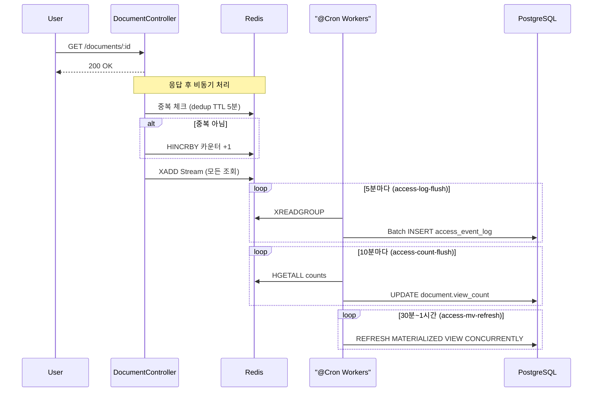
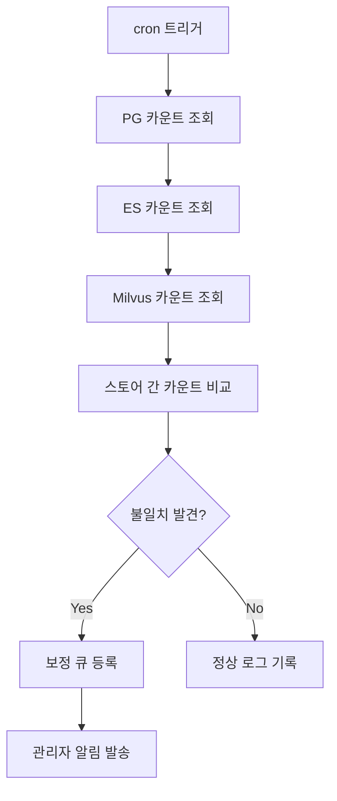

> **문서 상태**
> | 항목 | 값 |
> |------|-----|
> | 상태 | `draft` |
> | 검수 | `unreviewed` |
> | 작성일 | 2026-03-16 |
> | 최종 수정 | 2026-03-31 |
>
> **미비 사항**
> - [x] 보안 전략 (XSS/CSRF/SQLi 방어, 파일 업로드 보안, 데이터 암호화)
> - [x] CORS 정책
> - [x] Rate Limiting 전략
> - [x] 헬스체크 상세 (/health 엔드포인트 구성)

# 횡단 관심사

> 감사 로그, 에러 핸들링, 로깅/모니터링, API 설계 규칙

### 8.1 감사 로그 전략

NestJS Interceptor로 전역 적용하여 도메인 코드에 감사 로그 로직이 침투하지 않도록 한다.

```typescript
@Injectable()
export class AuditLogInterceptor implements NestInterceptor {
  intercept(context: ExecutionContext, next: CallHandler): Observable<any> {
    const request = context.switchToHttp().getRequest();
    const beforeSnapshot = /* 변경 전 상태 캡처 */;

    return next.handle().pipe(
      tap((result) => {
        this.auditLogService.record({
          actor_id: request.userId,
          actor_role: request.userRole,
          action: this.resolveAction(request),
          resource_type: this.resolveResourceType(context),
          resource_id: this.resolveResourceId(request, result),
          details: { before: beforeSnapshot, after: result },
          ip_address: request.ip,
          user_agent: request.headers['user-agent'],
        });
      }),
    );
  }
}
```

감사 대상: 문서 변경, 커뮤니티 상호작용(댓글), 권한 변경, 관리자 액션, 인증, 삭제 요청 결재
감사 제외: 문서 열람(조회), 검색 로그, 좋아요(Like) — 좋아요는 AggregationModule 집계로 추적. 문서 열람은 별도 Access Log(8.1.1)로 관리

**커뮤니티 감사 로그**
— 댓글 생성/수정/삭제, 멘션 이벤트를 감사 로그에 기록한다. resource_type = `comment`로 구분한다. 좋아요는 토글 빈도가 높아 감사 대상에서 제외한다.

**감사 로그 기록 경로**

감사 로그는 두 가지 경로로 기록되며, 각 경로는 캡처 대상이 다르다. 두 경로 모두 동일한 `audit_log` 테이블에 기록한다.

| 경로 | 캡처 대상 | 트리거 시점 | 예시 |
|------|----------|------------|------|
| **Interceptor (`tap()`)** | HTTP 요청 레벨 — API 호출 자체를 자동 캡처 | 모든 감사 대상 API 요청의 응답 시점 | 문서 수정 API 호출, 권한 변경 API 호출, 댓글 생성 |
| **EventBus → LogEventModule** | 비즈니스 이벤트 레벨 — 도메인 로직 내부에서 발생하는 의미 있는 상태 전이 | 이벤트 발행 시점 | `approval.approved` (승인 완료), `document.published` (배포 완료) |

**이중 기록 방지 원칙**: 하나의 행위가 두 경로 모두에서 기록될 수 있다. 예를 들어 승인 API 호출은 Interceptor가 "승인 API 호출" 행위를, EventBus가 "승인 상태 전이" 이벤트를 각각 기록한다. 이는 의도된 설계로, HTTP 요청 감사(누가 언제 API를 호출했는가)와 비즈니스 이벤트 감사(어떤 상태 전이가 발생했는가)는 관점이 다르다. `audit_log` 테이블의 `source` 필드(`interceptor` | `event`)로 경로를 구분한다.

**비동기 기록 전략**
— 두 경로 모두 API 응답 성능에 영향을 주지 않도록 비동기로 처리한다. Interceptor는 `tap()` 내부에서, EventBus는 이벤트 리스너에서 각각 비동기 INSERT를 수행한다. INSERT 실패가 비즈니스 로직을 차단하지 않되, 실패 시 별도 에러 로그(Winston)에 기록하여 모니터링한다.

> **설계 결정 — 감사 로그 이중 경로 채택**: Interceptor(HTTP 요청 레벨) + EventBus(비즈니스 이벤트 레벨) 이중 기록 방식을 채택한다. 근거: 단일 경로(EventBus only)는 HTTP 요청 자체의 감사(누가 언제 API를 호출했는가)를 놓치고, 단일 경로(Interceptor only)는 비동기 워커에서 발생하는 상태 전이를 캡처할 수 없다. 이중 기록의 추가 스토리지 비용보다 감사 완전성이 우선한다.

**audit_log 파티셔닝 및 아카이빙**

금융권 컴플라이언스(SP-4)를 충족하기 위해 감사 로그를 장기 보관하되, PostgreSQL 테이블의 무한 증가로 인한 성능 저하를 방지한다.

| 항목 | 전략 |
|------|------|
| **파티셔닝** | PostgreSQL 네이티브 RANGE 파티셔닝 — `created_at` 기준 **월별** 파티션 자동 생성 |
| **핫 스토리지** | 최근 N개월 파티션은 활성 상태로 유지 (조회/집계 가능) |
| **콜드 아카이빙** | 보관 기간 경과 파티션을 `pg_dump` 후 오브젝트 스토리지(MinIO/S3)로 이전, 원본 파티션 DETACH |
| **아카이빙 자동화** | cron 기반 월 1회 실행 — 보관 기간 초과 파티션 탐색 → 덤프 → 이전 → DETACH |

**보관 정책(가이드):**

핫 스토리지 유지 기간·총 보관 기간·아카이빙 후 삭제 시점은 규제 요구와 고객사 계약에 따라 달라진다. `audit.retention_days`는 SystemConfig로 조정하며, 구체적 수치는 운영 정책에서 정한다.

#### 8.1.1 Access Log 전략

문서 열람(조회)은 감사 로그(audit_log)가 아닌 **별도 Access Log**로 관리한다. Redis(버퍼) + PostgreSQL `access_event_log`(영속 원장) + Materialized View(집계) 3계층 구조를 사용한다. 접근 원장·관련 배치는 **LogEventModule**이 소유하고, `document.view_count` 갱신(`access-count-flush`)은 **DocumentModule**이 담당한다.

| 계층 | 역할 | 성격 |
|------|------|------|
| **Redis** | 조회수 카운터 버퍼, 중복 조회 방지, 이벤트 스트림 버퍼 | 휘발성. 순간 처리용 |
| **PostgreSQL `access_event_log`** | 상세 접근 로그 영속 저장 (파티셔닝) | 영속성. 누가/언제/무엇을 — INSERT ONLY 원장 |
| **PostgreSQL Materialized View** | 인기 문서·기간별 추이·사용자별 집계 사전 계산 | 영속성. 주기적 refresh로 분석 쿼리 지원 |
| **PostgreSQL `document.view_count`** | 조회수 합산 결과 저장 | 영속성. Redis 카운터를 주기적으로 flush |

**데이터 흐름:**



**Redis 역할:**

- **중복 조회 방지**: `access:dedup:{userId}:{documentId}` 키(TTL 5분)로 동일 사용자의 5분 이내 재조회 시 조회수 중복 카운트 방지
- **카운터 버퍼**: `access:counts` Hash에 `HINCRBY`로 문서별 조회수를 원자적으로 집계. 10분 주기로 PostgreSQL에 flush
- **이벤트 버퍼**: `access:log:stream` Stream에 모든 조회 이벤트를 기록 (중복 여부 무관). Consumer Group + XACK 기반 at-least-once 보장. 5분 주기로 RDB `access_event_log`에 batch INSERT

> **설계 결정 — Access Log RDB 영속 저장**: 문서 열람 로그를 PostgreSQL `access_event_log` 테이블에 영속 저장하는 방식을 채택한다. 근거: Redis Stream 버퍼를 통해 5분 주기 배치 INSERT로 실시간 INSERT 부하를 완화하고, 월별 RANGE 파티셔닝으로 보관 주기를 관리한다. 인기 문서 TOP N·부서별 통계 등 분석 쿼리는 Materialized View로 사전 집계하여 제공하므로 원장 테이블에 직접 집계 쿼리를 실행할 필요가 없다. ES 의존을 제거하여 인프라를 단순화한다.

**RDB 상세 로그 (`access_event_log`):**

- 모든 조회 이벤트를 영속 저장 (중복 포함, `is_unique` 플래그로 구분)
- 월별 RANGE 파티셔닝 — `created_at` 기준 자동 생성
- 보관 기간은 SystemConfig(`lm:audit.access_log_retention_days`)로 결정, 보관 기간 경과 파티션은 아카이빙 후 DETACH
- 상세 DDL·인덱스·MV 정의는 [rdb.md §5](./data/aicm/rdb.md) 참조

**Materialized View 집계:**

| MV | 용도 | Refresh 주기 |
|----|------|:------------:|
| `mv_popular_documents` | 인기 문서 TOP N (최근 30일) | 30분 |
| `mv_daily_view_stats` | 기간별·게시판별 조회 추이 (최근 90일) | 1시간 |
| `mv_user_view_stats` | 사용자별 조회 통계 (최근 30일) | 1시간 |

**구현 컴포넌트:**

- **AccessLogInterceptor** (`common/interceptors/`): GET /documents/:id 응답 후 비동기 기록. AuditLogInterceptor와 별개 동작. 접근 로그 수집이 비활성인 설정이면 no-op
- **AccessLogService** (`domains/log-event/services/`): 중복 판별, 카운터 증가, Stream 기록
- **AccessLogFlushProcessor** (`domains/log-event/`): @Cron worker — Redis Stream → RDB `access_event_log` 배치 INSERT
- **AccessCountFlushProcessor** (`domains/document/`): @Cron worker — Redis Hash → PG `document.view_count` 배치 갱신
- **AccessMvRefreshProcessor** (`domains/log-event/`): @Cron worker — 접근 로그 Materialized View 주기적 REFRESH CONCURRENTLY

> **향후 문서 등급(ClassificationGrade) 도입 시**, 고등급 문서 조회를 Access Log + audit_log에 이중 기록하는 분기를 AccessLogService에 추가한다.

### 8.2 에러 핸들링 전략

#### 8.2.1 에러 응답 형식

**전역 예외 필터**로 일관된 에러 응답 형식을 보장한다.

```typescript
interface ErrorResponse {
  statusCode: number;
  error: string;          // 에러 코드 (SCREAMING_SNAKE_CASE)
  message: string;        // 사용자 노출 메시지
  details?: any;          // 유효성 검증 실패 시 필드별 상세
  timestamp: string;
  path: string;
  traceId: string;
}
```

#### 8.2.2 에러 분류 체계

에러를 **전역 에러**(인프라 레이어)와 **도메인 에러**(비즈니스 레이어) 2계층으로 분류한다.

| 분류 | 발생 레이어 | 정의 위치 (SSoT) | 예시 |
|------|------------|-----------------|------|
| **전역 에러** | Pipe, Guard, 전역 예외 필터 | 이 문서 §8.2.4 | VALIDATION_ERROR, UNAUTHORIZED |
| **도메인 에러** | 서비스 레이어 (BusinessException) | 각 모듈 `rules.md` §4 에러 코드 카탈로그 | DOCUMENT_LOCKED, INVALID_STATUS_TRANSITION |

- 전역 에러는 모든 모듈이 공유하며, 이 문서가 SSoT
- 도메인 에러는 비즈니스 규칙(BR-xxx) 위반 시 발생하며, 해당 모듈의 `rules.md`가 SSoT
- 컨트롤러(`api.md`)는 에러를 **정의하지 않고 참조만** 한다

#### 8.2.3 에러 코드 네이밍 규칙

| 규칙 | 설명 | 예시 |
|------|------|------|
| 형식 | `SCREAMING_SNAKE_CASE` | `DOCUMENT_LOCKED` |
| 전역 에러 | `{NOUN}_{CONDITION}` | `VALIDATION_ERROR`, `UNAUTHORIZED` |
| 도메인 에러 | `{RESOURCE}_{CONDITION}` 또는 `{ACTION}_{CONDITION}` | `DOCUMENT_LOCKED`, `INVALID_STATUS_TRANSITION` |
| 충돌 방지 | 모듈 간 동일 코드명이 다른 의미로 사용되지 않아야 한다. 동일 코드가 여러 모듈에서 **동일 의미**로 사용되는 것은 허용 | `FORBIDDEN`은 전역, `DOCUMENT_LOCKED`는 Document 전용 |

**모듈별 에러 코드 접두사 예약**

모듈 확장 시 에러 코드 충돌을 방지하기 위해, 도메인 에러 코드의 `{RESOURCE}` 접두사를 모듈별로 예약한다.

| 모듈 | 예약 접두사 | 예시 |
|------|-----------|------|
| Document | `DOCUMENT_`, `BLOCK_` | `DOCUMENT_LOCKED`, `BLOCK_NOT_FOUND` |
| Board | `BOARD_`, `BRD_` | `BOARD_NOT_FOUND`, `BRD_PERMISSION_DENIED` |
| Template | `TEMPLATE_`, `TPL_` | `TEMPLATE_NOT_FOUND`, `TPL_CLONE_FAILED` |
| SystemConfig | `SYS_` | `SYS_KEY_NOT_FOUND`, `SYS_INVALID_VALUE` |
| Auth (Auth + Permission + Tenant) | `AUTH_`, `SESSION_`, `TOKEN_`, `ACL_` | `AUTH_TOKEN_EXPIRED`, `SESSION_INVALID`, `ACL_ROLE_CONFLICT` |
| Approval | `APPROVAL_` | `APPROVAL_STATE_INVALID` |
| Community | `COMMENT_`, `MENTION_`, `LIKE_` | `COMMENT_NOT_FOUND` |
| Admin | `ADMIN_`, `TENANT_` | `TENANT_MISMATCH` |
| Search | `SEARCH_`, `EMBEDDING_` | `SEARCH_QUERY_TOO_LONG` |
| Notification | `NOTIFICATION_` | `NOTIFICATION_CHANNEL_INVALID` |

> 새 모듈 추가 시 이 테이블에 접두사를 등록한다. 동일 접두사를 여러 모듈이 공유하지 않는다. 전역 에러(§8.2.4)는 접두사 예약 대상이 아니며, 이 문서(§8.2.4)가 SSoT이다.

#### 8.2.4 전역 에러 코드 카탈로그

모든 모듈의 모든 엔드포인트에서 발생할 수 있는 인프라 레벨 에러. 개별 `api.md`에서 반복 명시하지 않는다.

| 에러 코드 | HTTP | 발생 레이어 | 설명 |
|-----------|------|------------|------|
| VALIDATION_ERROR | 400 | ValidationPipe | 요청 파라미터 유효성 검증 실패 (DTO class-validator) |
| UNAUTHORIZED | 401 | AuthGuard | 인증 실패 (토큰 만료/무효) |
| FORBIDDEN | 403 | PermissionGuard | 권한 없음 (역할/권한 불충분) |
| FEATURE_DISABLED | 403 | 기능 비활성화 Guard | 계약·설정에 따라 비활성화된 기능 요청 |
| INTERNAL_SERVER_ERROR | 500 | 전역 예외 필터 | 예상치 못한 서버 오류 |
| EXTERNAL_SERVICE_UNAVAILABLE | 503 | HttpService / gRPC Client | 외부 서비스 (LLM, retrieval-service, parser-service) 응답 불가 |

#### 8.2.5 BusinessException 계층

> **설계 결정 — BusinessException 상속 패턴 채택**: NestJS의 `HttpException`을 상속하는 `BusinessException` 추상 클래스를 도메인 에러의 기반으로 채택한다. 근거: Result/Either 패턴은 타입 안전성이 높으나 NestJS의 전역 예외 필터·Interceptor 파이프라인과 호환되지 않아 보일러플레이트가 증가한다. NestJS 기본 `HttpException`만 사용하면 에러 코드 표준화가 불가능하다.

도메인 에러는 `BusinessException`을 상속하여 구현한다. 전역 예외 필터가 `BusinessException`을 감지하여 `ErrorResponse`로 변환한다.

```typescript
abstract class BusinessException extends HttpException {
  abstract readonly errorCode: string;  // SCREAMING_SNAKE_CASE
  abstract readonly statusCode: number;
}
```

| 예외 클래스 | 에러 코드 | HTTP | 소속 모듈 |
|------------|----------|------|----------|
| DocumentNotFoundException | DOCUMENT_NOT_FOUND | 404 | Document |
| DocumentLockedException | DOCUMENT_LOCKED | 423 | Document |
| InvalidStatusTransitionException | INVALID_STATUS_TRANSITION | 409 | Document |
| ApprovalStateException | APPROVAL_STATE_INVALID | 409 | Approval |
| InsufficientPermissionException | FORBIDDEN | 403 | 공통 |
| TenantMismatchException | TENANT_MISMATCH | 403 | 공통 |

> 모듈 확장 시 이 테이블에 예외 클래스를 추가한다. 전체 도메인 에러 코드 상세는 각 모듈의 `rules.md §4 에러 코드 카탈로그`를 참조한다.

#### 8.2.6 모듈별 도메인 에러 참조

| 모듈 | 에러 카탈로그 위치 |
|------|-------------------|
| Document | [document/rules.md §4](../03-module-design/document/rules.md#4-에러-코드-카탈로그) |

> 모듈 스펙 작성 시 `rules.md`에 §4 에러 코드 카탈로그를 필수로 포함한다.

### 8.3 로깅/모니터링

#### 8.3.1 로그 수집 파이프라인

> **설계 결정 — Winston + 구조화 JSON 로깅 채택**: Pino 대비 포맷터·트랜스포트 확장성이 높은 Winston을 채택하고, 모든 로그를 구조화 JSON으로 출력한다. 근거: SigNoz(OpenTelemetry) 수집 파이프라인에서 JSON 파싱이 필수이며, 온프레미스 환경의 파일 로테이션(`winston-daily-rotate-file`)을 병행해야 하므로 Winston의 다중 트랜스포트 지원이 적합하다.

| 레이어 | 도구 | 용도 |
|--------|------|------|
| 애플리케이션 로그 | Winston + 구조화 JSON | 요청/응답, 에러, 비즈니스 이벤트 |
| 요청 추적 | 커스텀 traceId (UUID v4) | 요청 단위 로그 상관 관계 |
| 인프라 모니터링 | SigNoz (OpenTelemetry) | 메트릭, 트레이스, 대시보드 |
| BullMQ 모니터링 | Bull Board — 개발/내부 운영 전용 | 큐 상태, 실패 작업 관리. 운영 정책에 따라 고객사 납품 환경에서는 비활성화 |

**로그 출력 경로**: Winston → stdout (구조화 JSON) → 컨테이너 로그 수집기(Fluentd/Fluent Bit) → SigNoz (로그 저장/검색). 온프레미스 환경에서는 파일 로테이션(`winston-daily-rotate-file`)을 병행한다.

#### 8.3.2 로그 레벨 정책

| 레벨 | 사용 기준 | 예시 |
|------|----------|------|
| `error` | 즉시 조치가 필요한 장애 — 외부 서비스 연결 실패, 데이터 정합성 깨짐, 감사 로그 INSERT 실패 | `retrieval-service 연결 실패`, `audit_log INSERT 실패` |
| `warn` | 정상 동작은 하지만 주의가 필요한 상황 — 재시도 발생, 임계값 근접, 비정상 입력 감지 | `BullMQ Job 재시도 2/3`, `큐 대기 80건 (임계값 100)` |
| `info` | 비즈니스 흐름의 주요 이벤트 — 상태 전이, 사용자 행위, 배치 실행 결과 | `문서 published`, `Reconciliation 완료: 불일치 0건` |
| `debug` | 개발/디버깅 시 필요한 상세 정보 — 쿼리 파라미터, 캐시 히트/미스, 중간 연산 결과 | `ES 쿼리 실행: {...}`, `권한 캐시 HIT userId=xxx` |

프로덕션 환경에서는 `info` 이상만 출력하고, 개발/스테이징 환경에서는 `debug`까지 출력한다. 로그 레벨은 환경변수 `LOG_LEVEL`로 제어한다.

#### 8.3.3 구조화 로그 필드 표준

모든 로그는 JSON 형식으로 출력하며, 다음 필드를 표준으로 포함한다.

| 필드 | 타입 | 필수 | 설명 |
|------|------|------|------|
| `timestamp` | ISO 8601 | O | 로그 발생 시각 |
| `level` | string | O | 로그 레벨 |
| `traceId` | UUID v4 | O | 요청 단위 상관 ID — 미들웨어에서 생성, AsyncLocalStorage로 전파 |
| `tenantId` | string | O (SaaS) | 테넌트 식별자 |
| `userId` | string | △ | 인증된 요청인 경우 |
| `action` | string | △ | 수행 중인 작업 (`document.publish`, `embedding.process` 등) |
| `module` | string | O | 소속 NestJS 모듈명 |
| `message` | string | O | 로그 메시지 |
| `duration_ms` | number | △ | 작업 소요 시간 (요청/배치/Job) |
| `error` | object | △ | 에러 발생 시 — `{ code, message, stack }` |

**민감 정보 마스킹**: Winston 커스텀 포맷터에서 `password`, `token`, `authorization`, `cookie` 필드를 자동 마스킹(`***`)한다. 로그에 PII(개인식별정보)를 직접 기록하지 않는다.

#### 8.3.4 모니터링 메트릭 및 알림

**SigNoz 대시보드 핵심 메트릭:**

| 메트릭 | 수집 방식 | 임계값 (알림 트리거) |
|--------|----------|-------------------|
| API p99 응답 시간 | OpenTelemetry HTTP 계측 | > 3초 |
| 5xx 에러 비율 | HTTP 응답 코드 집계 | > 1% (5분 윈도우) |
| BullMQ 큐 대기 Job 수 | 큐별 주기적 폴링 | > 100건 (큐별) |
| DLQ 적체 건수 | DLQ 큐 폴링 | > 10건 |
| DB 커넥션 풀 사용률 | TypeORM pool 모니터링 | > 80% |
| Redis 메모리 사용률 | Redis INFO 명령 | > 70% |
| 외부 서비스 응답 시간 | OpenTelemetry HTTP client 계측 | > 5초 (retrieval/parser) |

**알림 채널**: 인앱 관리자 알림 + 이메일. 필요 시 Slack/Teams 웹훅 연동을 선택적으로 구성한다.

### 8.4 API 설계 규칙

| 규칙 | 설명 |
|------|------|
| 버저닝 | URL 경로 기반 (`/api/{프로젝트명}/v1/...`) — 글로벌 프리픽스는 환경변수 `API_BASE_PATH`로 설정 |
| 인증 헤더 | `Authorization: Bearer {token}` |
| 테넌트 식별 | 토큰에서 추출 → DB 커넥션 라우팅 (SaaS) / 고정 DB (온프렘) |
| 페이지네이션 | 커서 기반 (`cursor`, `limit`) — 대용량 데이터 안정성 |
| 응답 형식 | `{ data, meta, pagination }` |
| 에러 형식 | `{ statusCode, error, message, details, traceId }` |
| Swagger | `@nestjs/swagger` — 자동 문서화, `/api/docs` |

### 8.5 재해 복구 (RTO/RPO)

**스토어별 백업 전략:**

| 스토어 | 백업 방식 | 주기 | 비고 |
|--------|----------|------|------|
| PostgreSQL | pg_dump 논리 백업 + WAL 아카이빙 | 일간 full + 실시간 WAL | 테넌트별 DB 독립이므로 개별 백업 가능 |
| Redis | AOF(append-only file) + RDB 스냅샷 | AOF 실시간 + RDB 1시간 | BullMQ 큐 데이터 영속성을 위해 AOF 필수 |
| Elasticsearch | Snapshot API → 공유 스토리지 | 일간 | ILM 정책과 연동하여 오래된 인덱스 자동 정리 |
| Milvus | Milvus Backup 유틸리티 → 오브젝트 스토리지 | 일간 | 컬렉션 단위 백업/복원 |
| MinIO | 버킷 미러링 또는 Erasure Coding | 실시간 | SaaS: S3 교차 리전 복제, 온프렘: RAID/미러링 |

**RTO/RPO 가이드:**

RTO·RPO·백업 빈도는 SLA·규제·고객사 인프라에 따라 달라진다. 일반 운영에서는 일간 백업과 수 시간 단위의 복구 목표를 허용할 수 있고, 높은 가용성 요구가 있으면 WAL·Redis AOF 등을 추가해 RTO/RPO를 단축한다. 구체 수치는 운영 정책에서 정한다.

### 8.6 데이터 스토어 정합성 검증

발행(published) 시 PG(Block/Chunk), ES `aicm_blocks`, ES `aicm_chunks`, Milvus `kms_chunks` 4곳에 데이터를 쓴다. 하나라도 실패하면 데이터 정합성이 깨진다.

**§8.6과 05-async §6.7 Reconciliation의 역할 경계**

두 검증은 하나의 `ReconciliationService`에서 순차 실행하되, 역할이 명확히 구분된다.

| 구분 | 05-async §6.7 Reconciliation | §8.6 정합성 검증 |
|------|------------------------------|-----------------|
| **목적** | 실패 Job 복구 — 파이프라인 장애 후 미완료 작업 재처리 | 스토어 간 데이터 정합성 확인 — 결과물이 모든 스토어에 도달했는지 검증 |
| **점검 기준** | PG의 status 필드 (`parsing_status = 'failed'`, `embedding_status = 'failed'`) | PG 기준 카운트 vs ES/Milvus 카운트 비교 |
| **조치** | 원본 큐(`parsing`, `embedding`)에 Job 재등록 | ES 재인덱싱 또는 재임베딩 큐 등록 |
| **실행 순서** | **1단계** — 먼저 실패 Job을 복구하여 파이프라인을 정상화 | **2단계** — 파이프라인 정상화 후 스토어 간 카운트를 비교하여 누락 감지 |

실행 주기는 동일(기본 10분)하며, 단일 cron 트리거에서 1단계(Job 복구) → 2단계(카운트 정합성)를 순차 실행하여 리소스 경합을 방지한다.

**정합성 검증 배치 (2단계):**

- **실행 주기**: cron 기반 주기적 실행 (기본 10분, SystemConfig `pm:system.consistency_check_interval_minutes`로 설정)
- **점검 항목**:

| 비교 대상 | 기준 | 불일치 시 조치 |
|-----------|------|--------------|
| PG `Block`(published) vs ES `aicm_blocks` | PG 기준 | ES 재인덱싱 큐 등록 |
| PG `Chunk` vs ES `aicm_chunks` | PG 기준 | ES 재인덱싱 큐 등록 |
| PG `Chunk` vs Milvus 벡터 수 | PG 기준 | 재임베딩 큐 등록 |
| ES `aicm_blocks` 문서 수 vs PG published 문서 수 | PG 기준 | 차이 문서 재인덱싱 |

- **불일치 감지 시**: 관리자 알림(인앱 + 이메일) + 자동 보정 큐 등록
- **관리자 정합성 대시보드**: 스토어별 문서/청크 카운트, 마지막 검증 시각, 불일치 이력, 1-click 재동기화 버튼



### 8.7 헬스체크 상세

`/health` 엔드포인트에서 각 인프라 구성 요소의 연결 상태를 개별 리포트한다.

**헬스체크 항목:**

| 구성 요소 | 체크 방식 | 타임아웃 | 실패 시 영향 |
|-----------|----------|---------|------------|
| PostgreSQL | `SELECT 1` | 3초 | 전체 API 불가 |
| Redis | `PING` | 2초 | 캐시/큐/세션 불가 |
| Elasticsearch | `GET /_cluster/health` | 3초 | 키워드 검색 불가 |
| MinIO | `HEAD bucket` | 3초 | 파일 업로드/다운로드 불가 |
| retrieval-service | `GET /health` | 5초 | 시맨틱/하이브리드 검색 불가 |
| parser-service | `GET /health` | 5초 | 파일 파싱 불가 |
| BullMQ | 큐별 대기 Job 수 조회 | 2초 | 비동기 작업 적체 감지 |

**응답 형식:**

```json
{
  "status": "healthy | degraded | unhealthy",
  "timestamp": "2026-03-25T10:00:00Z",
  "components": {
    "postgresql": { "status": "up", "latency_ms": 2 },
    "redis": { "status": "up", "latency_ms": 1 },
    "elasticsearch": { "status": "up", "latency_ms": 15 },
    "minio": { "status": "up", "latency_ms": 8 },
    "retrieval_service": { "status": "up", "latency_ms": 45 },
    "parser_service": { "status": "up", "latency_ms": 30 },
    "bullmq": {
      "status": "up",
      "queues": {
        "parsing": { "waiting": 0, "active": 1 },
        "embedding": { "waiting": 5, "active": 2 },
        "es-indexing": { "waiting": 0, "active": 0 }
      }
    }
  }
}
```

- **status 판정 기준**: 모든 구성 요소 up → `healthy`, 부가 서비스(parser, retrieval) 1개 down → `degraded`, 핵심 인프라(PG, Redis) down → `unhealthy`
- **BullMQ 큐 임계값**: 큐별 대기 Job 수가 임계값(기본 100건)을 초과하면 `degraded`로 판정, 관리자 알림 발송

**헬스체크 엔드포인트 2단계 분리:**

| 엔드포인트 | 인증 | 응답 내용 | 용도 |
|-----------|------|----------|------|
| `GET /health` | 불필요 | `{ "status": "healthy \| degraded \| unhealthy" }` — 단순 상태만 반환 | 로드밸런서, 외부 모니터링 도구의 alive 체크 |
| `GET /health/detail` | **필요** (정책으로 정한 `AdminPermission` 또는 내부 네트워크) | 위 JSON 전체 (컴포넌트별 latency, BullMQ 큐 상태 등 상세 정보) | 내부 운영팀 장애 진단, 대시보드 |

`/health`는 내부 인프라 정보(컴포넌트 latency, 큐 대기 Job 수 등)를 노출하지 않아 외부 공격 표면을 최소화한다.

### 8.8 보안 횡단 관심사

인증/인가는 [03-auth-architecture.md](./03-auth-architecture.md)에서 다룬다. 이 섹션은 인증/인가 외의 보안 횡단 관심사를 정의한다.

#### 8.8.1 입력 검증

NestJS 글로벌 `ValidationPipe`와 `class-validator` 기반으로 모든 요청의 DTO를 검증한다.

| 항목 | 전략 |
|------|------|
| **글로벌 ValidationPipe** | `whitelist: true`, `forbidNonWhitelisted: true` — DTO에 정의되지 않은 필드는 자동 제거하고, 미허용 필드 전송 시 400 에러 반환. 개별 엔드포인트에서 whitelist strip으로 처리하는 경우 해당 모듈 스펙의 BR에 명시한다 |
| **transform** | `transform: true` — 요청 파라미터를 DTO 클래스 인스턴스로 자동 변환 |
| **중첩 객체 검증** | `@ValidateNested()` + `@Type()` 데코레이터로 중첩 DTO까지 재귀 검증 |
| **커스텀 유효성 검사** | 비즈니스 규칙에 특화된 검증은 `class-validator`의 커스텀 데코레이터로 구현 (예: `@IsValidDocumentStatus()`) |

#### 8.8.2 XSS 방어

| 항목 | 전략 |
|------|------|
| **helmet 미들웨어** | `@nestjs/helmet` 전역 적용 — `Content-Security-Policy`, `X-Content-Type-Options: nosniff`, `X-Frame-Options: DENY` 등 보안 헤더 자동 설정 |
| **CSP 정책** | `script-src 'self'`, `style-src 'self' 'unsafe-inline'` (Tiptap 에디터 스타일 요구), `img-src 'self' blob: data:` |
| **Tiptap JSON 콘텐츠** | Tiptap JSON은 서버에서 HTML로 렌더링하지 않으므로 저장 시점의 sanitization은 불필요. 프론트엔드(aicm-web)에서 Tiptap 에디터가 안전하게 렌더링. 단, API로 HTML 변환 응답 시 `sanitize-html` 라이브러리로 화이트리스트 기반 태그만 허용 |

#### 8.8.3 CSRF 방어

AICM은 SPA(Vue 3) + Bearer 토큰(`Authorization` 헤더) 기반 인증을 사용한다. 쿠키에 인증 토큰을 저장하지 않으므로 전통적 CSRF 공격에는 해당하지 않는다. 단, Redis 세션 스토어가 세션 쿠키를 사용하는 경우를 대비하여 다음을 적용한다.

| 항목 | 전략 |
|------|------|
| **SameSite 쿠키** | 세션 쿠키에 `SameSite=Strict` 설정 — 크로스 사이트 요청 시 쿠키 전송 차단 |
| **CSRF 토큰** | Bearer 토큰 전용이므로 별도 CSRF 토큰은 적용하지 않음. 향후 쿠키 기반 인증 도입 시 `csurf` 미들웨어 추가 |

#### 8.8.4 SQL Injection 방어

| 항목 | 전략 |
|------|------|
| **TypeORM 파라미터 바인딩** | 모든 쿼리는 TypeORM의 파라미터 바인딩을 사용한다. QueryBuilder의 `.where('field = :value', { value })` 형식을 준수 |
| **Raw Query 금지 원칙** | `query()` 메서드를 통한 raw SQL 실행을 원칙적으로 금지한다. 불가피한 경우(복잡한 집계, 파티션 관리 DDL) ESLint 커스텀 룰로 경고를 발생시키고, 코드 리뷰에서 반드시 확인 |
| **JSONB 쿼리** | Block.content(JSONB) 조회 시에도 TypeORM의 JSON 연산자 바인딩을 사용. 문자열 연결로 JSON 경로를 동적 생성하지 않음 |

#### 8.8.5 CORS 정책

배포 환경에 따라 허용 origin을 관리한다.

| 구분 | 허용 Origin | 설정 방식 |
|------|------------|----------|
| **개발** | `http://localhost:*` | 와일드카드 허용 |
| **SaaS** | 테넌트별 도메인 화이트리스트 — `https://{tenant}.aicm.example.com` | 환경변수 `CORS_ALLOWED_ORIGINS` (쉼표 구분) 또는 DB 기반 동적 조회 |
| **온프레미스** | 고객사 지정 도메인 — `https://kms.customer.co.kr` | 환경변수 `CORS_ALLOWED_ORIGINS` |

```typescript
app.enableCors({
  origin: (origin, callback) => {
    const allowed = this.configService.get<string[]>('CORS_ALLOWED_ORIGINS');
    if (!origin || allowed.includes(origin)) {
      callback(null, true);
    } else {
      callback(new ForbiddenException('CORS_ORIGIN_NOT_ALLOWED'));
    }
  },
  credentials: true,
  methods: ['GET', 'POST', 'PUT', 'PATCH', 'DELETE'],
  allowedHeaders: ['Authorization', 'Content-Type', 'X-Trace-Id'],
});
```

#### 8.8.6 Rate Limiting

`@nestjs/throttler` 기반으로 API 남용을 방지한다. 엔드포인트 특성과 사용자 역할에 따라 차등 제한을 적용한다.

**기본 정책 (글로벌):**

| 윈도우 | 제한 | 적용 대상 |
|--------|------|----------|
| 1분 | 60회 | 일반 인증 사용자 |
| 1분 | 120회 | 관리 권한(`AdminPermission`) 보유자 등 정책으로 정한 상한 |
| 1분 | 20회 | 미인증 요청 (공개 API) |

**엔드포인트별 오버라이드:**

| 엔드포인트 패턴 | 윈도우 | 제한 | 사유 |
|----------------|--------|------|------|
| `POST /auth/login` | 5분 | 10회 | Brute-force 방지 |
| `POST /documents/*/publish` | 1분 | 5회 | 임베딩 파이프라인 보호 |
| `GET /search/*` | 1분 | 30회 | ES/Milvus 부하 제한 |
| `POST /ai/*` | 1분 | 10회 | LLM Orchestrator 비용 제어 |

Rate Limit 초과 시 `429 Too Many Requests` 응답과 함께 `Retry-After` 헤더를 반환한다. 식별자는 인증 사용자의 경우 `userId`, 미인증의 경우 `IP`를 기준으로 한다.

**분산 환경 Rate Limiting (다중 인스턴스)**

`@nestjs/throttler`의 기본 인메모리 스토리지는 단일 인스턴스에서만 유효하다. aicm-service를 수평 확장(복수 인스턴스)할 경우, 인스턴스별 독립 카운팅으로 실효적 Rate Limit이 느슨해지는 문제가 발생한다.

| 배포 형태 | 스토리지 | 구현 방식 |
|-----------|---------|----------|
| 단일 인스턴스 | 인메모리 (기본) | `@nestjs/throttler` 기본 설정 |
| 다중 인스턴스 | Redis | `ThrottlerStorageRedisService` 또는 커스텀 Redis 어댑터 — 공유 Redis에 `throttle:{userId}:{endpoint}` 키로 카운터를 관리하여 인스턴스 간 카운트 공유 |

> 결정: 초기에는 단일 인스턴스 인메모리 방식으로 시작하고, 수평 확장 시점에 Redis 어댑터로 전환한다. Redis 키 TTL은 윈도우 크기(기본 60s)와 동일하게 설정하며, Redis 장애 시에는 인메모리 폴백으로 서비스 가용성을 우선한다.

#### 8.8.7 파일 업로드 보안

MinIO(S3 호환) 파일 업로드 시 다음을 검증한다.

| 항목 | 정책 |
|------|------|
| **허용 MIME 타입** | 문서: `application/pdf`, `application/vnd.openxmlformats-officedocument.*`, `text/plain`, `text/markdown`. 이미지: `image/jpeg`, `image/png`, `image/gif`, `image/webp` |
| **파일 크기 제한** | 단일 파일 최대 50MB (SystemConfig `lm:system.max_upload_bytes`로 설정 가능, 기본값: 50000000) |
| **파일명 검증** | 경로 탐색 문자(`../`, `..\\`) 제거, 파일명을 UUID로 치환하여 저장 |
| **MIME 타입 이중 검증** | 확장자 기반 검증 + `file-type` 라이브러리로 매직 바이트 검증 — 확장자 위조 방지 |
| **바이러스 스캔** | 규제·보안 요구에 따라 선택적 활성화 — ClamAV 연동. 기본 비활성화 |
| **저장 경로 격리** | 테넌트별 버킷 분리 (`{tenantId}/uploads/`) |

#### 8.8.8 데이터 암호화

| 구분 | 전략 |
|------|------|
| **전송 중 암호화 (in-transit)** | 모든 외부 통신은 TLS 1.2+ 필수. 서비스 간 내부 통신도 SaaS 환경에서는 TLS 적용 |
| **저장 시 암호화 (at-rest)** | PostgreSQL: 디스크 레벨 암호화(LUKS/EBS encryption). MinIO: SSE-S3 서버 사이드 암호화. 온프레미스 환경에서는 고객사 인프라 정책에 따름 |
| **PII 필드 처리** | 감사 로그의 `ip_address`, `user_agent`는 일정 기간(핫 스토리지 기간) 경과 후 아카이빙 시 해싱 처리 |

---

**관련 문서**
- [모듈 아키텍처](./02-module-architecture.md) — LogEventModule, AdminModule 책임
- [인증/인가 아키텍처](./03-auth-architecture.md) — 인증 흐름, 권한 모델 (§8.8 보안 횡단 관심사에서 참조)
- [비동기 처리 아키텍처](./05-async-event-architecture.md) — 이벤트 흐름, Reconciliation 배치 (§8.6 역할 경계 참조)
- [이벤트 로그 엔티티](../03-module-design/log-event/data.md) — AuditLog·AccessEventLog 스키마, 액션 유형, 감사·접근 범위
- [RDB 접근 이벤트 로그](./data/aicm/rdb.md) — `access_event_log` 테이블, Materialized View, 파티셔닝 정책
- [Redis Key 패턴](./data/aicm/redis.md) — Access Log 관련 키 패턴
