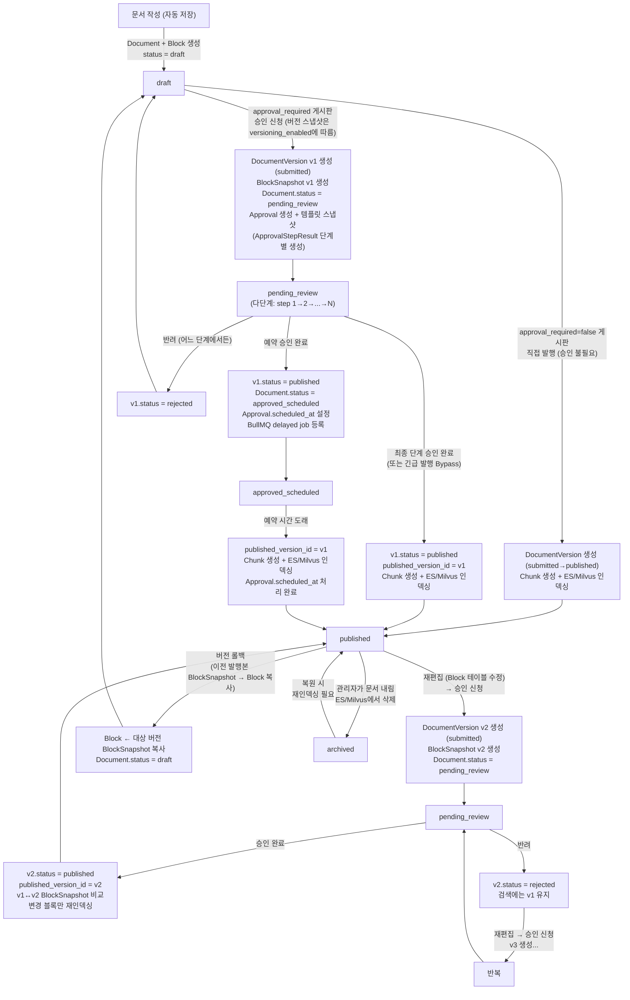
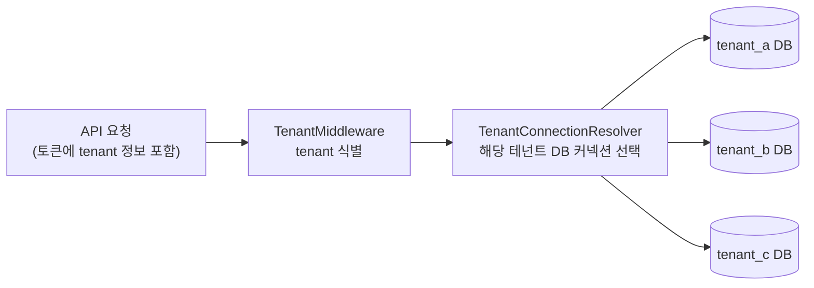
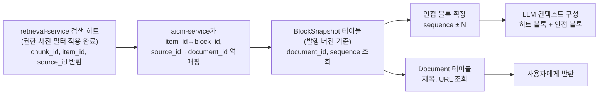
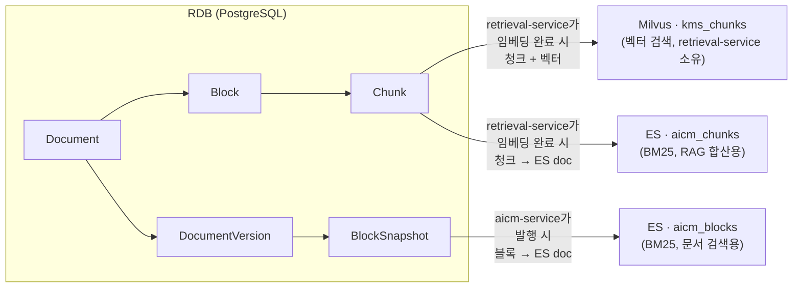

> **문서 상태**
> | 항목 | 값 |
> |------|-----|
> | 상태 | `draft` |
> | 검수 | `reviewed` |
> | 작성일 | 2026-03-16 |
> | 최종 수정 | 2026-03-20 |
>
> **미비 사항**
> - [x] Board, BoardPermission 엔티티 필드 정의 — ✅ [board-module.md](../../03-module-design/board/data.md)
> - [x] Template 엔티티 필드 정의 — ✅ [template-module.md](../../03-module-design/template/data.md)
> - [x] SharedContent, SharedContentRef 엔티티 필드 정의 — ✅ [shared-content-module.md](../../03-module-design/shared-content/data.md)
> - [x] Approval, ApprovalHistory 엔티티 필드 정의 — ✅ [approval-module.md](../../03-module-design/approval/data.md)
> - [x] Comment, Like, Report, Bookmark, BookmarkFolder 엔티티 필드 정의 — ✅ [community-module.md](../../03-module-design/community/data.md)
> - [x] Notification, Subscription, NotificationSetting 엔티티 필드 정의 — ✅ [notification-module.md](../../03-module-design/notification/data.md)
> - [x] Tag, DocumentTag 엔티티 필드 정의 — ✅ [document-module.md](../../03-module-design/document/data.md)
> - [x] Role, UserRole 엔티티 필드 정의 — ✅ [auth-module.md](../../03-module-design/auth/data.md)
> - [x] SearchConfig, ParsingConfig, Synonym, StopWord, BoostRule 엔티티 필드 정의 — ✅ [search-module.md](../../03-module-design/search/data.md)
> - [x] DocumentRestriction 엔티티 필드 정의 — ✅ [document-module.md](../../03-module-design/document/data.md)
> - [x] AuditLog·AccessEventLog 엔티티 필드 정의 — ✅ [log-event-module.md](../../03-module-design/log-event/data.md)
> - [x] SystemConfig 엔티티 필드 정의 — ✅ [system-config-module.md](../../03-module-design/system-config/data.md)
> - [x] AggregationCache 엔티티 필드 정의 — ✅ [aggregation-module.md](../../03-module-design/aggregation/data.md)
> - [x] DB 인덱스 전략 — 핵심 엔티티 인덱스 정의 완료 (aicm/rdb.md). 도메인별 인덱스는 각 도메인 설계서에서 정의 완료

# 데이터 아키텍처 — 전체 개요

> 서비스 간 데이터 흐름, 멀티테넌트 격리, 문서 상태별 데이터 존재 위치, 검색 결과 반환 전략

AICM의 데이터 아키텍처는 3개 서비스(aicm-service, retrieval-service, parser-service)와 5개 인프라(PostgreSQL, Elasticsearch, Milvus, Redis, MinIO)로 구성된다. 이 문서는 서비스 간 공통/횡단 관심사를 다루며, 각 서비스별 인프라 상세는 하위 문서를 참조한다.

## 문서 구성

| 문서 | 범위 |
|------|------|
| **이 문서 (00-overview)** | 크로스 서비스 — 멀티테넌트, 데이터 위치, 서비스 간 흐름, 검색 결과 반환 |
| [aicm/rdb.md](./aicm/rdb.md) | aicm-service — PostgreSQL ERD 전체 조감도, 도메인별 설계서 안내, 공통 설계 원칙 |
| [03-module-design/](../../03-module-design/) | aicm-service — 도메인별 엔티티 상세 (필드, DDL, 인덱스). 13개 문서, 34개 엔티티 |
| [aicm/es.md](./aicm/es.md) | aicm-service — ES `aicm_blocks` 인덱스 (문서 검색, BM25) |
| [aicm/redis.md](./aicm/redis.md) | aicm-service — Redis (BullMQ, 캐시, 락, 세션) |
| [05-async-event-architecture.md](../05-async-event-architecture.md) | aicm-service — BullMQ 큐 채널 목록, DLQ 매핑, 생산/소비 관계, 스케줄 배치 |
| [aicm/minio.md](./aicm/minio.md) | aicm-service — MinIO 파일 스토리지 |
| [retriever/README.md](./retriever/README.md) | retrieval-service — 청킹/임베딩 파이프라인, 검색 모드 |
| [retriever/es.md](./retriever/es.md) | retrieval-service — ES `aicm_chunks` 인덱스 (RAG 하이브리드 합산, BM25) |
| [retriever/milvus.md](./retriever/milvus.md) | retrieval-service — Milvus `kms_chunks` 컬렉션 (벡터 검색) |
| [parser/README.md](./parser/README.md) | parser-service — Stateless 데이터 접근 패턴 |

---

## 1. 문서 상태별 데이터 존재 위치와 화면별 데이터 소스

### 1.1 문서 상태별 데이터 존재 위치

| 상태 | RDB (Document/Block) | RDB (Chunk) | ES (aicm_blocks) | ES (aicm_chunks) | Milvus (kms_chunks) | DocumentVersion/BlockSnapshot |
|------|:---:|:---:|:---:|:---:|:---:|:---:|
| `draft` | O | X | X | X | X | X |
| `pending_review` | O | X | X | X | X | O (submitted) |
| `approved_scheduled` | O | X | X | X | X | O (submitted → 예약 대기) |
| `published` | O | O | O | O | O | O (published) |
| `archived` | O | X | X | X | X | O (이력 보존) |

> `draft`와 `pending_review` 문서는 RDB에만 존재한다. ES/Milvus 인덱싱과 Chunk 생성은 발행(승인 완료) 시점에만 수행된다. `archived` 시 ES/Milvus에서 데이터를 삭제하고, RDB Chunk도 정리한다.

> DocumentVersion/BlockSnapshot은 게시판의 `versioning_enabled`가 true일 때 생성·유지된다. `approval_required`가 true이면 승인 워크플로우를 거쳐 발행하고, false이면 승인 없이 직접 발행할 수 있다. 두 플래그는 서로 독립이다.

### 1.2 문서 생명주기와 버전 관리

게시판의 승인 필요 여부는 `Board.approval_required`, 버전 이력 사용 여부는 `Board.versioning_enabled`로 각각 설정한다. 필수 승인 운영 규칙(SLA, 자기 승인 차단, 위임 허용 등)은 `Board.mandatory_approval_config`(JSONB)에 두고, 기본 승인 라인은 `Board.default_approval_template_id`로 `ApprovalLineTemplate`을 가리킨다.



**버전 이력 예시:**

```
DocumentVersion 이력:
  v1  submitted → rejected   "태그 누락" (반려 사유)
  v2  submitted → published  ✓ (최초 발행, published_version_id = v2)
  v3  submitted → rejected   "최신 규정 미반영"
  v4  submitted → published  ✓ (재발행, published_version_id = v4)
                                재임베딩: v2↔v4 BlockSnapshot 비교
  v5  submitted → published  ✓ (v2로 롤백 — 내용은 v2 BlockSnapshot 복사본)
                                재임베딩: v4↔v5 BlockSnapshot 비교
```

### 1.3 화면별 데이터 소스

| 화면 | 데이터 소스 | 대상 사용자 | 설명 |
|------|---|---|---|
| 게시판/검색 | ES/Milvus + BlockSnapshot (발행본) | 전체 사용자 | 발행된 확정 지식 열람 |
| 승인 대기함 | RDB (status=pending_review) + Block 테이블 + ApprovalStepResult (단계 진행 상태) | 승인자 | 제출본 검토. 다단계 승인 시 현재 단계/전체 단계 진행률 표시. 이전 발행본(BlockSnapshot)과 diff 가능 |
| 내 문서 | RDB (created_by=본인) + Block 테이블 | 작성자 | 모든 상태의 내 문서 관리 |
| 관리자 콘솔 | RDB (전체) | 관리자 | 전체 문서 상태 관리 |

**열람 시 데이터 소스 분기:**

| 요청자 | 데이터 소스 | 조건 |
|--------|-------------|------|
| 편집자 본인 | Block 테이블 (working copy) | `current_editor_id == 요청자` |
| 일반 열람자 | BlockSnapshot (발행본) | `published_version_id`가 가리키는 버전 |
| 승인자 (검토 시) | Block 테이블 (제출본) | `status == 'pending_review'` |

---

## 2. 멀티테넌트 데이터 격리

**Database-per-tenant** 방식을 채택한다. 각 테넌트는 완전히 분리된 DB를 가지며, DB 안에는 해당 테넌트의 데이터만 존재한다.



**핵심 설계:**

- **테넌트 식별**: 요청의 인증 토큰에서 테넌트 정보를 추출한다 (SaaS: ECP 토큰, 온프렘: 단일 DB 고정)
- **DB 라우팅**: `TenantMiddleware`가 테넌트를 식별하면, `TenantConnectionResolver`가 해당 테넌트의 DB 커넥션을 TypeORM DataSource에서 선택한다
- **엔티티에 tenant_id 없음**: DB 자체가 격리 경계이므로 모든 엔티티에서 `tenant_id` 컬럼이 불필요하다. 쿼리에 tenant 필터를 넣을 필요도 없다
- **스키마 동일**: 모든 테넌트 DB는 동일한 스키마를 공유한다. 마이그레이션은 전체 테넌트 DB에 일괄 적용
- **온프레미스**: 단일 DB로 동작 — 테넌트 라우팅 없이 고정 커넥션 사용

```typescript
@Injectable()
export class TenantConnectionResolver {
  private dataSources = new Map<string, DataSource>();

  async getConnection(tenantId: string): Promise<DataSource> {
    if (this.dataSources.has(tenantId)) {
      return this.dataSources.get(tenantId);
    }
    const config = await this.loadTenantDbConfig(tenantId);
    const ds = new DataSource(config);
    await ds.initialize();
    this.dataSources.set(tenantId, ds);
    return ds;
  }
}
```

> **테넌트 DB 목록 관리**: 테넌트별 DB 접속 정보는 중앙 관리 DB(또는 환경 설정)에서 관리한다. 이 관리 DB만이 "어떤 테넌트가 존재하는지"를 알고 있으며, 각 테넌트 DB는 자신이 어떤 테넌트인지 모른다.

**인프라별 테넌트 격리 방식:**

| 인프라 | 격리 방식 | 비고 |
|--------|----------|------|
| PostgreSQL | DB-per-tenant | 테넌트별 DB 분리 |
| Elasticsearch | 테넌트별 인스턴스 분리 | 인덱스명에 테넌트 식별자 불필요 |
| Milvus | 테넌트별 인스턴스 분리 | 컬렉션명에 테넌트 식별자 불필요 |
| Redis | 단일 인스턴스, 키 프리픽스 격리 | `{tenant_id}:` 프리픽스 |
| MinIO | 테넌트별 인스턴스 분리 | 버킷명에 테넌트 식별자 불필요 |

> ES, Milvus, MinIO는 DB-per-tenant와 동일하게 테넌트별 인스턴스로 분리되며, 리소스 이름에 테넌트 식별자를 인코딩하지 않고 애플리케이션 레이어(TenantConnectionResolver)에서 연결 대상을 선택한다. Redis는 단일 인스턴스를 공유하며 키 프리픽스로 테넌트 데이터를 격리한다. 온프레미스 배포에서는 단일 테넌트이므로 프리픽스가 고정값이 된다.

---

## 3. 검색 결과 반환 전략

검색 히트 시 **청크 → 블록 → 문서** 역추적 경로를 통해 사용자에게 적절한 수준의 정보를 반환한다.



**사용자에게 보여주는 단위:**

| 대상 | 출처 표시 | 컨텍스트 스니펫 | LLM 컨텍스트 | 용도 |
|------|:---:|:---:|:---:|------|
| **문서** | O | — | — | "이 답변이 어디서 왔는지" 출처 표시 |
| **히트 블록** | O — 하이라이트 | O — `is_hit=true` (강조 배경) | 포함 | "문서에서 정확히 어디를 참고했는지" 위치 표시 |
| **인접 블록** | **X — 출처 아님** | O — `is_hit=false` (연한 배경) | 보충 문맥 | 히트 블록의 맥락을 보충하는 배경 문맥 |
| **청크** | X | X | — | 내부 검색 단위 — 사용자에게 노출하지 않음 |

> **히트 블록 vs 인접 블록 구분**: Milvus 검색에서 실제 히트된 청크의 원본 블록만 출처(하이라이트 대상)이다. 인접 블록은 출처로 표시하지 않되, 히트 블록의 가독성을 높이기 위한 **배경 문맥으로 컨텍스트 스니펫에 포함**한다. `is_hit` 마커로 검색 근거와 배경 문맥을 명확히 구분한다. 상세는 [검색 전략 7.6절](../../01-requirements/flows/search-rag/03-search.md), 의사결정 배경은 [ADR-004](../../adr/004-context-snippet-for-search-display.md)를 참조한다.

> **열람 시 발행본 사용**: 검색 결과에서 문서를 클릭하여 상세를 볼 때, 콘텐츠는 `published_version_id`가 가리키는 BlockSnapshot에서 읽는다. Block 테이블(working copy)이 아닌 발행된 확정본을 표시한다.

**인접 블록 확장 (Window Context):**

검색으로 히트된 블록의 컨텍스트만으로 LLM 답변이 불충분할 수 있으므로, `BlockSnapshot.sequence`를 활용하여 인접 블록을 함께 LLM에 전달한다.

```
히트 블록: sequence=3
인접 확장 (window=1):
  sequence=2 (이전 블록) + sequence=3 (히트) + sequence=4 (다음 블록)
  → 세 블록의 텍스트를 합쳐서 LLM 컨텍스트로 전달
```

- window size는 검색 설정값으로 관리 (기본값: 1)
- 인접 블록이 속한 문서에 접근 제한(DocumentRestriction)이 설정되어 있고 현재 사용자에게 권한이 없으면 해당 문서의 블록은 컨텍스트에서 제외

**출처 표시 흐름:**

```
RAG 답변:
  "계좌 개설 시 신분증과 도장을 준비하여 영업점을 방문하시면 됩니다..."

  참고 문서:
  ├── 계좌 개설 매뉴얼          ← Document (클릭 시 문서 상세로 이동)
  │     → 블록 2: 준비 서류     ← Block (문서 내 해당 블록으로 스크롤 + 하이라이트)
  │     → 블록 4: 방문 절차
  └── 신규 고객 안내서
        → 블록 1: 개요
```

**컨텍스트 스니펫 (검색 결과 리스트 / AICC 모듈 검색 패널):**

검색 API 응답에 `context_blocks`로 히트 블록과 인접 블록을 합쳐 제공한다. 모든 API 소비자(aicm-web, AICC 모듈, 향후 외부 클라이언트)가 동일하게 활용한다.

```
📄 계좌 개설 매뉴얼 > 계좌 개설 절차      ← section_title (섹션 breadcrumb)
┌──────────────────────────────────
│ 영업점 방문 시 아래 서류가 필요합니다.    ← is_hit=false (인접 — 연한 배경)
│ **준비물을 지참하세요.**                  ← is_hit=true  (히트 — 강조 배경)
│ 신분증, 도장, 통장 사본을 준비하세요.     ← is_hit=false (인접 — 연한 배경)
└──────────────────────────────────
```

---

## 4. 저장소 간 데이터 흐름 요약



| 저장소 | 역할 | 인덱싱 단위 | 인덱싱 시점 | 테넌트 격리 | 담당 서비스 |
|--------|------|-----------|-----------|-----------|-----------|
| PostgreSQL | 원천 데이터, 트랜잭션, 관계 | 엔티티 단위 | 실시간 (CRUD) | DB-per-tenant | aicm-service |
| Elasticsearch `aicm_blocks` | BM25 키워드 검색 (문서 검색) | 블록 | 발행(published) 시 | 인스턴스 분리 | aicm-service |
| Elasticsearch `aicm_chunks` | BM25 하이브리드 합산 (RAG) | 청크 | 발행(published) 시 | 인스턴스 분리 | retrieval-service |
| Milvus | 벡터 시맨틱 검색 | 청크 | 발행(published) 시 | 인스턴스 분리 | retrieval-service |
| Redis | 캐시, 큐, 락 | Key-Value | 실시간 | 키 프리픽스 | aicm-service |
| MinIO | 파일 저장 | 오브젝트 | 업로드 시 | 인스턴스 분리 | aicm-service |

---

**관련 문서**
- [모듈 아키텍처](../02-module-architecture.md)
- [인증/인가 아키텍처](../03-auth-architecture.md) — 검색 권한 필터
- [비동기 처리 아키텍처](../05-async-event-architecture.md) — 임베딩 파이프라인
