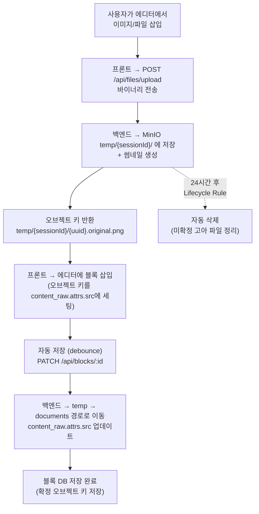
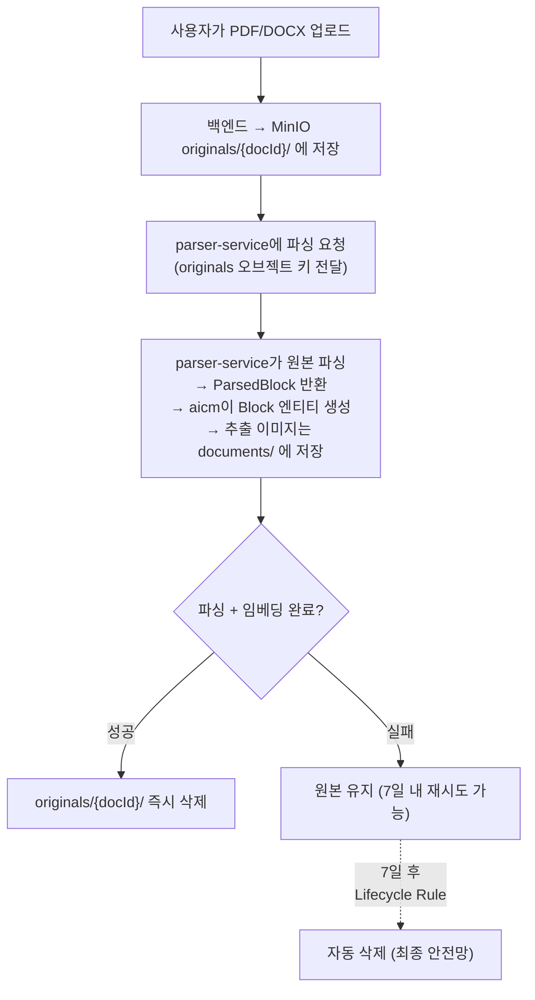

# aicm-service — MinIO 파일 스토리지

> 버킷 구조, 업로드 흐름, Lifecycle Rule, DB 저장값 vs API 응답값 분리

---

## 1. 버킷 구조

```
aicm/                                    ← 단일 버킷
├── temp/                                # 에디터 인라인 업로드 (Lifecycle Rule: 24시간 TTL)
│   └── {session_id}/
│       ├── {uuid}.original.{ext}
│       └── {uuid}.thumb.{ext}
│
├── originals/                           # 대용량 문서 원본 (Lifecycle Rule: 7일 TTL)
│   └── {document_id}/
│       └── {upload_id}.{ext}            # 업로드된 PDF, DOCX 등
│
├── documents/                           # 확정 파일 (영구 보관)
│   └── {document_id}/
│       ├── images/                      # 이미지 블록의 원본 + 썸네일
│       │   ├── {block_id}.original.{ext}
│       │   └── {block_id}.thumb.{ext}
│       ├── files/                       # 파일 블록의 원본 + 썸네일
│       │   ├── {block_id}.original.{ext}
│       │   └── {block_id}.thumb.{ext}
│       └── attachments/                 # 문서 단위 첨부파일 (DocumentAttachment)
│           └── {attachment_id}.{ext}
│
├── exports/                             # 내보내기 임시 파일
└── templates/                           # 템플릿 첨부 리소스
```

---

## 2. 파일 업로드 흐름 (임시 → 확정)



---

## 3. DB 저장값과 API 응답값 분리

| 구분 | 값 | 예시 |
|------|-----|------|
| **DB 저장** (content_raw.attrs.src) | 오브젝트 키 (영구, 만료 없음) | `documents/abc/images/block1.original.png` |
| **API 응답** (프론트에 전달) | Presigned URL (TTL 부여) | `https://minio.../aicm/documents/abc/images/block1.original.png?X-Amz-Expires=3600&X-Amz-Signature=...` |

> **Presigned URL은 DB에 저장하지 않는다.** 만료되면 깨지기 때문이다. DB에는 오브젝트 키만 저장하고, API 응답 시 백엔드가 presigned URL을 생성하여 프론트에 전달한다. 프론트는 presigned URL로 MinIO에 직접 접근하므로 파일 트래픽이 백엔드를 경유하지 않는다.

---

## 4. 대용량 문서 업로드 흐름 (파싱 후 원본 삭제)



> **원본 파일은 영구 보관하지 않는다.** 파싱이 완료되면 모든 콘텐츠는 Block 엔티티(content_raw, content_text)와 추출 파일(documents/)에 존재한다. 원본 PDF/DOCX는 파싱 + 임베딩 완료 시점에 즉시 삭제하며, 실패 시에도 Lifecycle Rule(7일)이 최종 안전망으로 동작한다.

---

## 5. Lifecycle Rule 설정

```json
{
  "Rules": [
    {
      "ID": "cleanup-temp-uploads",
      "Filter": { "Prefix": "temp/" },
      "Status": "Enabled",
      "Expiration": { "Days": 1 }
    },
    {
      "ID": "cleanup-originals",
      "Filter": { "Prefix": "originals/" },
      "Status": "Enabled",
      "Expiration": { "Days": 7 }
    }
  ]
}
```

| prefix | 용도 | TTL | 삭제 시점 |
|--------|------|-----|----------|
| `temp/` | 에디터 인라인 업로드 (이미지/파일) | 24시간 | 블록 저장 시 `documents/`로 이동, 미이동 시 자동 삭제 |
| `originals/` | 대용량 문서 원본 (PDF/DOCX) | 7일 | 파싱+임베딩 완료 시 즉시 삭제, 미삭제 시 자동 삭제 |
| `documents/` | 확정 파일 (블록 이미지/파일/첨부) | 영구 | Lifecycle Rule 없음 |

---

**관련 문서**
- [전체 개요](../README.md)
- [RDB 엔티티](./rdb.md) — DocumentAttachment, Block.content_raw
- [parser/README.md](../parser/README.md) — parser-service의 MinIO 접근 패턴
