# aicm-service — RDB (PostgreSQL)

> ERD 전체 조감도, 도메인별 설계서 안내, 공통 설계 원칙 | **전체 53 테이블** (14 모듈)

---

## 1. RDB 엔티티 관계도 (전체 조감도)

상세 스키마(컬럼 정의, 인덱스 등)는 도메인별 설계서에서 정의한다. 여기서는 엔티티 간 관계만 표현한다.

```mermaid
erDiagram
    %% ── 문서 관리 도메인 ──
    %% Tenant 엔티티 없음 — DB-per-tenant 구조이므로
    %% 이 ERD는 단일 테넌트 DB 안의 스키마를 표현한다
    %% User는 외부 서비스(UserService)가 관리한다. AICM DB에는 userId를 참조하는
    %% UUID 컬럼(created_by, user_id 등)만 존재하며, User 테이블/FK는 없다 (3.2.1 참조).

    Board ||--o{ Document : "1:N"
    Board ||--o{ BoardPermission : "1:N"
    Board ||--o{ Board : "self-ref 트리 (parent_id)"
    Board }o--o| ApprovalLineTemplate : "default_approval_template_id (ApprovalModule, nullable)"
    Board }o--o| Template : "default_template_id (TemplateModule)"
    Board }o--o| RetentionPolicy : "default_retention_policy_id (DocumentModule)"

    %% ── 권한 도메인 ──
    Role ||--o{ UserRole : "N:M"
    Role ||--o{ AdminPermission : "1:N"
    Role ||--o{ BoardPermission : "1:N"
    Role ||--o{ TeamRole : "1:N"

    Team ||--o{ TeamMember : "1:N"
    Team ||--o{ TeamRole : "1:N"
    Team ||--o{ Team : "self-ref 트리 (parent_id)"

    Document }o--o| Template : "N:0..1 (선택)"

    Document ||--o{ DocumentVersion : "1:N"
    DocumentVersion ||--o{ BlockSnapshot : "1:N"
    Document ||--o{ Block : "1:N (평탄 구조)"
    Document ||--o{ Chunk : "1:N (비정규화)"
    Document ||--o{ Comment : "1:N"
    Document ||--o{ Like : "1:N"
    %% Block↔Chunk는 M:N 관계 — Chunk.block_ids(JSONB)로 역추적, FK 없음
    %% Report는 polymorphic 참조 (target_type + target_id → Document 또는 Comment, FK 없음)
    Report
    Document ||--o{ Bookmark : "1:N"
    Document ||--o{ NoticeReadConfirmation : "1:N"
    Document ||--o{ DocumentRestriction : "1:N (제한 시에만)"
    Comment ||--o{ Comment : "reply (1depth)"

    SharedContent ||--o{ SharedContentRef : "1:N"
    SharedContent ||--o| SharedContent : "replacement (self-ref)"
    SharedContentRef }o--|| Document : "N:1"

    Tag ||--o{ DocumentTag : "1:N"
    DocumentTag }o--|| Document : "N:1"

    RetentionPolicy ||--o{ Document : "1:N (선택)"

    %% ── 승인 도메인 ──
    Document ||--o{ Approval : "1:N"
    Approval }o--o| ApprovalLineTemplate : "N:0..1 (template_id, 적용 템플릿)"
    Approval ||--o{ ApprovalStepResult : "1:N (단계별 결과)"
    ApprovalStepResult ||--o{ ApprovalDecision : "1:N (개별 판단)"
    Approval ||--o{ ApprovalHistory : "1:N"
    Approval ||--o| DocumentVersion : "1:0..1 (승인 요청 시 버전 생성)"

    ApprovalDelegation }o--|| Board : "N:1 (게시판별 위임)"

    %% ── 알림 도메인 ──
    Notification
    Subscription
    NotificationSetting

    %% ── 커뮤니티 도메인 ──
    BookmarkFolder ||--o{ Bookmark : "1:N"

    %% ── 검색 설정 도메인 ──
    %% SearchConfig(검색) + ParsingConfig(파싱) 싱글톤 2테이블 (ADR-009)
    SearchConfig ||--o{ Synonym : "1:N"
    SearchConfig ||--o{ StopWord : "1:N"
    SearchConfig ||--o{ BoostRule : "1:N"
    SearchConfig ||--o{ BoardRagConfig : "1:N"

    ParsingConfig ||--o{ BoardParsingOverride : "1:N"
    ParsingConfig ||--o{ TemplateChunkingRule : "1:N"

    %% ── AI 어시스턴트 도메인 ──
    PromptSlot ||--o{ PromptVersion : "1:N (버전 이력)"

    %% ── 내보내기 도메인 ──
    Document ||--o{ ExportJob : "1:N"

    %% ── 감사/관리 도메인 ──
    AuditLog
    AccessEventLog
    SystemConfig
    AggregationCache
    WidgetCatalog
    UserWidgetLayout
```



#### ERD 범위

- **Tenant 엔티티 없음**: DB-per-tenant 구조이므로 `tenant_id` 컬럼이나 `Tenant` 테이블이 불필요하다. 이 ERD는 단일 테넌트 DB 안의 스키마를 표현한다.
- **Document → Block / Document → Chunk 2계층**: Document는 메타데이터, Block은 Tiptap 에디터의 콘텐츠 단위(원천 데이터), Chunk는 인접 블록을 그룹 병합하여 임베딩한 결과물이다. Block↔Chunk는 M:N 관계이며 FK 없이 `Chunk.block_ids`(JSONB)로 역추적한다. Block 테이블은 aicm-service가, Chunk 생성은 retrieval-service가 담당하되, 생성된 Chunk 메타데이터는 aicm-service RDB에 저장한다.
- **Working Copy 원칙**: Document와 Block 테이블은 항상 **현재 편집 상태(working copy)**를 보유한다. 발행된 확정본은 `DocumentVersion`/`BlockSnapshot`이 보존하며, `Document.published_version_id`가 최신 발행 버전을 가리킨다.

#### 기능정의서 대비 설계 변경 사항

| 항목 | 기능정의서 | 아키텍처 (이 문서) | 변경 사유 |
|------|-----------|-------------------|----------|
| 문서 상태 모델 | status 3단계 + `is_archived` boolean 플래그 | status 5단계 (`approved_scheduled`, `archived`를 status 단일 필드에 통합) | `archived`를 별도 플래그로 두면 `published + is_archived = true`인 복합 상태가 발생하여 쿼리·비즈니스 로직이 복잡해진다. status VARCHAR + CHECK로 통합하면 상태가 상호 배타적이 되어 명확하다 |
| 버전 생성 시점 | 승인 요청 시(제출 버전) + 승인 완료 시(정식 버전) = 2회 생성 | **제출 시점에만 1회 생성**, status 전이(`submitted` → `published`/`rejected`)로 관리 | 동일 콘텐츠의 스냅샷을 2번 저장하는 것은 저장 낭비이고, 버전 간 diff 비교가 복잡해진다 |
| 버전 콘텐츠 저장 | DocumentVersion에 `content(JSONB)` 단일 필드 | DocumentVersion(메타데이터) + **BlockSnapshot(블록 단위 스냅샷)** 분리 | 블록 단위 스냅샷으로 분리하면 버전 간 블록별 diff, 재임베딩 판단(content_hash 비교), 블록 단위 복원이 가능해진다 |
| 이전 버전 보관 | `is_archived` 플래그로 이전 버전을 검색에서 제외하되 벡터 보관 | **DocumentVersion 자연 이력**으로 대체. Chunk/ES/Milvus에는 현재 발행본만 유지 | 이전 발행본의 벡터를 Milvus에 보관하면 스토리지 낭비 + 중복 검색 히트 위험 |
| 승인 모델 | 단일 승인(OR 조건) + 확장 가능 설계 | **템플릿 기반 승인 엔진** — ApprovalLineTemplate(`approval_line_template`)의 steps(JSONB, ApprovalLineTemplateStep 구조)로 다단계·다인 승인, 게시판 `mandatory_approval_config`로 SLA·자기승인 차단 등 운영 규칙 분리, 긴급 발행(Bypass) 지원 | 범용 KMS로서 산업별 승인 요구사항을 템플릿·게시판 설정으로 제어. 기존 단일 승인은 "1단계/ANY" 템플릿의 특수 케이스로 하위 호환 |

---

## 2. 모듈별 설계서 안내

엔티티 상세(필드 정의, DDL, 인덱스)는 모듈별 설계서에 위임한다. [03-module-design/](../../../../03-module-design/) 폴더에 [02-module-architecture.md](../../02-module-architecture.md)의 NestJS 모듈 단위로 파일을 구성한다.

### 2.1 구성 원칙

```
rdb/
├── document-module.md         # DocumentModule
├── board-module.md            # BoardModule
├── template-module.md         # TemplateModule
├── shared-content-module.md   # SharedContentModule
├── approval-module.md         # ApprovalModule
├── search-module.md           # SearchModule
├── ai-assistant-module.md     # AI AssistantModule (프롬프트 슬롯/버전)
├── community-module.md        # CommunityModule
├── notification-module.md     # NotificationModule
├── aggregation-module.md      # AggregationModule
├── log-event-module.md        # LogEventModule
├── system-config-module.md    # SystemConfigModule
├── export-module.md           # ExportModule
└── auth-module.md             # AuthModule
```

**왜 모듈 단위로 1파일인가:**

1. **트랜잭션 경계 일치** — 같은 모듈의 엔티티는 하나의 트랜잭션 안에서 함께 변경된다. 예: Approval + ApprovalHistory는 항상 같은 트랜잭션에서 생성되므로 한 문서에서 다룬다.
2. **비즈니스 응집도** — 같은 모듈의 엔티티는 동일한 비즈니스 컨텍스트를 공유한다. 예: Comment, Like, Report, Bookmark는 모두 "사용자 상호작용"이라는 맥락에서 이해해야 한다.
3. **엔티티 간 참조 최소화** — 모듈 내부 참조(FK)는 설계서 내에서 완결되고, 모듈 간 참조는 외부 참조로 명시한다.

### 2.2 모듈별 문서 목록

| 도메인 | 문서 | 모듈 | 엔티티 |
|--------|------|------|--------|
| 콘텐츠 관리 | [document-module.md](../../../../03-module-design/document/data.md) | DocumentModule | Document, DocumentVersion, Block, BlockSnapshot, Chunk, Tag, DocumentTag, DocumentRestriction, RetentionPolicy |
| | [board-module.md](../../../../03-module-design/board/data.md) | BoardModule | Board, BoardPermission |
| | [template-module.md](../../../../03-module-design/template/data.md) | TemplateModule | Template |
| | [shared-content-module.md](../../../../03-module-design/shared-content/data.md) | SharedContentModule | SharedContent, SharedContentRef |
| 발행 워크플로우 | [approval-module.md](../../../../03-module-design/approval/data.md) | ApprovalModule | ApprovalLineTemplate, Approval, ApprovalStepResult, ApprovalDecision, ApprovalHistory, ApprovalDelegation |
| 검색·RAG | [search-module.md](../../../../03-module-design/search/data.md) | SearchModule | SearchConfig, ParsingConfig, Synonym, StopWord, BoostRule, BoardRagConfig, BoardParsingOverride, TemplateChunkingRule |
| AI 어시스턴트 | [ai-assistant-module.md](../../../../03-module-design/ai-assistant/data.md) | AI AssistantModule | PromptSlot, PromptVersion |
| 커뮤니티·알림 | [community-module.md](../../../../03-module-design/community/data.md) | CommunityModule | Comment, Like, Report, Bookmark, BookmarkFolder, NoticeReadConfirmation |
| | [notification-module.md](../../../../03-module-design/notification/data.md) | NotificationModule | Notification, Subscription, NotificationSetting |
| | [aggregation-module.md](../../../../03-module-design/aggregation/data.md) | AggregationModule | AggregationCache, WidgetCatalog, UserWidgetLayout |
| 내보내기 | [export-module.md](../../../../03-module-design/export/data.md) | ExportModule | ExportJob |
| 감사·관리 | [log-event-module.md](../../../../03-module-design/log-event/data.md) | LogEventModule | AuditLog, AccessEventLog |
| | [system-config-module.md](../../../../03-module-design/system-config/data.md) | SystemConfigModule | SystemConfig |
| 공통 | [auth-module.md](../../../../03-module-design/auth/data.md) | AuthModule | Role, UserRole, AdminPermission, Team, TeamMember, TeamRole |

---

## 3. 공통 설계 원칙

### 3.1 공통 컬럼 규약

| 규약 | 적용 대상 | 설명 |
|------|----------|------|
| UUID PK | 모든 엔티티 | `UUID PRIMARY KEY DEFAULT gen_random_uuid()`. Auto-increment 사용하지 않음 |
| `created_at` | 모든 엔티티 * | `TIMESTAMPTZ NOT NULL DEFAULT now()` |
| `updated_at` | 변경 가능한 엔티티 | `TIMESTAMPTZ NOT NULL DEFAULT now()`. 이력/스냅샷 테이블에는 불필요 |
| `deleted_at` | Soft Delete 대상 | `TIMESTAMPTZ` nullable. 소프트 딜리트가 필요한 엔티티만 적용 (Document 등) |
| `created_by` | 사용자 행위 엔티티 | 작성자 UUID. FK 제약 없음 (3.3 외부 참조 규칙 참조) |

> \* **예외**: 싱글톤 설정의 오버라이드 엔티티(BoardRagConfig, BoardParsingOverride, TemplateChunkingRule)는 부모 설정과 함께 upsert되는 패턴이므로 `created_at` 없이 `updated_at`만 보유한다.

### 3.2 인덱스 설계 원칙

1. **FK 컬럼은 기본적으로 인덱스를 생성한다** — JOIN과 CASCADE DELETE 성능 보장
2. **복합 인덱스는 실제 쿼리 패턴 기반으로 설계한다** — `(document_id, sequence)`처럼 항상 함께 조회되는 컬럼을 묶는다
3. **부분 인덱스(WHERE 절)를 적극 활용한다** — `deleted_at IS NULL` 조건으로 살아있는 데이터만 인덱싱
4. **UNIQUE 제약은 인덱스를 겸한다** — 별도 인덱스 생성 불필요

### 3.3 외부 참조 규칙

AICM은 사용자 엔티티를 직접 관리하지 않는다. 사용자 정보는 외부 UserService가 담당한다.

| 규칙 | 설명 |
|------|------|
| **FK 없음** | `created_by`, `user_id` 등 사용자 참조 컬럼에 FK 제약조건을 걸지 않는다 |
| **UUID만 저장** | 외부 서비스의 식별자(UUID)만 저장한다 |
| **User 테이블 없음** | AICM DB에 User 테이블이 존재하지 않는다. 사용자 이름 등은 API 응답 시 UserServiceClient로 조회하여 합성한다 |
| **AICM 소유 엔티티** | AICM이 직접 관리하는 것은 Role, UserRole, AdminPermission, Team, TeamMember, TeamRole 등 권한·조직 엔티티이다 |

### 3.4 ENUM 처리 방식

PostgreSQL 네이티브 ENUM 대신 **VARCHAR + CHECK 제약** 또는 **VARCHAR + 애플리케이션 레벨 검증**을 사용한다.

| 방식 | 적용 기준 |
|------|----------|
| `VARCHAR(N)` + CHECK | 값이 고정적이고 변경 가능성이 낮은 경우 (예: `status`, `action`) |
| `VARCHAR(N)` + 앱 검증 | 값이 확장될 수 있는 경우 (예: `block_type`, `notification_type`) |

PostgreSQL ENUM은 ALTER TYPE으로만 변경 가능하여 마이그레이션이 번거롭다. VARCHAR + CHECK는 ALTER TABLE로 제약조건만 교체하면 되므로 운영이 유연하다.

---

**관련 문서**
- [전체 개요 (멀티테넌트, 데이터 흐름)](../README.md)
- [ES aicm_blocks 인덱스](./es.md) — 키워드 검색용 블록 인덱싱
- [Redis 전략](./redis.md) — BullMQ, 캐시, 락
- [MinIO 전략](./minio.md) — 파일 스토리지

---

## 4. 전체 RDB 조감도 — 필드 포함 (54 테이블 · 14 모듈)

> 모든 엔티티의 컬럼, 타입, 한글명을 포함한 상세 ERD. 상세 설계·제약 조건은 각 모듈별 설계서 참조.

```mermaid
erDiagram
    %% ═══════════════════════════════════════════
    %% 관계 정의
    %% ═══════════════════════════════════════════

    Board ||--o{ Document : "1:N"
    Board ||--o{ BoardPermission : "1:N"
    Board ||--o{ Board : "self-ref (parent_id)"
    Board }o--o| ApprovalLineTemplate : "default_approval_template_id"
    Board }o--o| Template : "default_template_id"
    Board }o--o| RetentionPolicy : "default_retention_policy_id"

    Role ||--o{ UserRole : "1:N"
    Role ||--o{ AdminPermission : "1:N"
    Role ||--o{ BoardPermission : "1:N"
    Role ||--o{ TeamRole : "1:N"

    Team ||--o{ TeamMember : "1:N"
    Team ||--o{ TeamRole : "1:N"
    Team ||--o{ Team : "self-ref (parent_id)"

    Document }o--o| Template : "N:0..1"
    Document }o--o| RetentionPolicy : "retention_policy_id"
    Document ||--o{ DocumentVersion : "1:N"
    Document ||--o{ Block : "1:N"
    Document ||--o{ Chunk : "1:N (비정규화)"
    Document ||--o{ Comment : "1:N"
    Document ||--o{ Like : "1:N"
    Document ||--o{ Bookmark : "1:N"
    Document ||--o{ NoticeReadConfirmation : "1:N"
    Document ||--o{ DocumentRestriction : "1:N"
    Document ||--o{ DocumentTag : "1:N"
    Document ||--o{ Approval : "1:N"
    Document ||--o{ ExportJob : "1:N"

    DocumentVersion ||--o{ BlockSnapshot : "1:N"
    %% Block↔Chunk는 M:N — Chunk.block_ids(JSONB)로 역추적, FK 없음
    Comment ||--o{ Comment : "reply (1depth)"

    Tag ||--o{ DocumentTag : "1:N"

    SharedContent ||--o{ SharedContentRef : "1:N"
    SharedContent ||--o| SharedContent : "replacement (self-ref)"
    SharedContentRef }o--|| Document : "N:1"

    Approval }o--o| ApprovalLineTemplate : "template_id"
    Approval ||--o{ ApprovalStepResult : "1:N"
    Approval ||--o{ ApprovalHistory : "1:N"
    Approval ||--o| DocumentVersion : "1:0..1"
    ApprovalStepResult ||--o{ ApprovalDecision : "1:N"

    ApprovalDelegation }o--|| Board : "N:1 (게시판별 위임)"

    BookmarkFolder ||--o{ Bookmark : "1:N"

    SearchConfig ||--o{ Synonym : "1:N"
    SearchConfig ||--o{ StopWord : "1:N"
    SearchConfig ||--o{ BoostRule : "1:N"
    SearchConfig ||--o{ BoardRagConfig : "1:N"
    ParsingConfig ||--o{ BoardParsingOverride : "1:N"
    ParsingConfig ||--o{ TemplateChunkingRule : "1:N"

    PromptSlot ||--o{ PromptVersion : "1:N"

    %% ═══════════════════════════════════════════
    %% DocumentModule (9 테이블)
    %% ═══════════════════════════════════════════

    Document {
        UUID id PK "문서 ID"
        UUID board_id FK "소속 게시판"
        UUID template_id FK "사용한 템플릿 (nullable)"
        UUID published_version_id FK "최신 발행 버전 (nullable)"
        VARCHAR title "문서 제목"
        VARCHAR status "상태: draft|pending_review|approved_scheduled|published|archived"
        BOOLEAN is_suspended "검색 일시 정지"
        BOOLEAN is_restricted "접근 제한 모드"
        TEXT summary "문서 요약 (nullable)"
        UUID current_editor_id "현재 편집자 - 비관적 락 (nullable)"
        TIMESTAMPTZ editor_lock_at "락 획득 시간 (nullable)"
        TIMESTAMPTZ expires_at "문서 유효기간 (nullable)"
        UUID retention_policy_id FK "보존 정책 (nullable)"
        TIMESTAMPTZ retention_expires_at "보존 만료 예정일 (nullable)"
        UUID assignee_id "담당자 (nullable)"
        INT view_count "조회수 (Redis flush 근사치)"
        BOOLEAN is_pinned "게시판 내 상단 고정 여부"
        TIMESTAMPTZ pinned_at "고정 시각 (nullable)"
        UUID pinned_by "고정 수행자 (nullable)"
        JSONB notice_options "공지 전용 옵션 (nullable)"
        VARCHAR embedding_status "임베딩 상태: pending|processing|completed|failed|partial|skipped"
        JSONB attachments "첨부파일 목록"
        UUID created_by "작성자"
        TIMESTAMPTZ created_at "생성일시"
        TIMESTAMPTZ updated_at "수정일시"
        TIMESTAMPTZ deleted_at "삭제일시 - 소프트 딜리트 (nullable)"
    }

    Block {
        UUID id PK "블록 ID"
        UUID document_id FK "소속 문서"
        JSONB content_raw "Tiptap 노드 JSON"
        TEXT content_text "순수 텍스트 (nullable)"
        VARCHAR content_hash "SHA-256 해시 - 변경 감지 (nullable)"
        VARCHAR block_type "블록 유형: text|image|table|file"
        SMALLINT heading_level "헤딩 레벨 1~6 (nullable)"
        INT sequence "문서 내 순서"
        TEXT caption "이미지/표 설명 텍스트 (nullable)"
        JSONB annotation "블록 메모/포스트잇 (nullable)"
        BOOLEAN embeddable "임베딩 포함 여부"
        BOOLEAN visible "열람자 가시성"
        JSONB metadata "부가 메타데이터 (nullable)"
        TIMESTAMPTZ created_at "생성일시"
        TIMESTAMPTZ updated_at "수정일시"
    }

    Chunk {
        UUID id PK "청크 ID (Milvus chunk_id 동일)"
        JSONB block_ids "원본 블록 ID 목록 (M:N, FK 없음)"
        UUID document_id FK "소속 문서 (비정규화)"
        INT chunk_index "그룹 내 청크 순서"
        TEXT content_text "청크 텍스트 원문"
        VARCHAR embedded_content_hash "임베딩 시점 콘텐츠 해시"
        TIMESTAMPTZ created_at "생성일시"
    }

    DocumentVersion {
        UUID id PK "문서버전 ID"
        UUID document_id FK "소속 문서"
        INT version_number "순차 증가 버전 번호"
        UUID approval_id FK "이 버전을 생성한 승인 요청 (nullable)"
        VARCHAR status "상태: submitted|published|rejected"
        TEXT rejection_reason "반려 사유 (nullable)"
        VARCHAR title "제출 시점 문서 제목"
        VARCHAR embedding_status "임베딩 상태: pending|processing|completed|failed|partial"
        UUID created_by "제출자"
        TIMESTAMPTZ created_at "생성일시"
    }

    BlockSnapshot {
        UUID id PK "블록스냅샷 ID"
        UUID version_id FK "소속 문서버전"
        UUID block_id "원본 Block 참조 (추적/복원용)"
        JSONB content_raw "해당 시점 Tiptap 노드 JSON"
        TEXT content_text "해당 시점 순수 텍스트 (nullable)"
        VARCHAR content_hash "해당 시점 해시 (nullable)"
        TEXT caption "해당 시점 캡션 (nullable)"
        VARCHAR block_type "블록 유형: text|image|table|file"
        SMALLINT heading_level "해당 시점 헤딩 레벨 (nullable)"
        INT sequence "해당 시점 문서 내 순서"
        JSONB annotation "해당 시점 메모 (nullable)"
        BOOLEAN embeddable "해당 시점 임베딩 포함 여부"
        BOOLEAN visible "해당 시점 열람자 가시성"
        JSONB metadata "해당 시점 메타데이터 (nullable)"
        TIMESTAMPTZ created_at "생성일시"
    }

    Tag {
        UUID id PK "태그 ID"
        VARCHAR name "태그 표시명 (UNIQUE)"
        VARCHAR slug "URL/필터용 정규화 키 (UNIQUE)"
        INT usage_count "사용 건수 (비정규화)"
        UUID created_by "최초 생성자"
        TIMESTAMPTZ created_at "생성일시"
    }

    DocumentTag {
        UUID id PK "문서태그 ID"
        UUID document_id FK "소속 문서"
        UUID tag_id FK "참조 태그"
        TIMESTAMPTZ created_at "생성일시"
    }

    DocumentRestriction {
        UUID id PK "문서접근제한 ID"
        UUID document_id FK "제한 대상 문서"
        VARCHAR subject_type "대상 유형: USER|TEAM"
        UUID subject_id "접근 허용 대상 ID"
        VARCHAR action "허용 액션: VIEW|EDIT|APPROVE"
        TIMESTAMPTZ created_at "생성일시"
    }

    RetentionPolicy {
        UUID id PK "보존정책 ID"
        VARCHAR name "정책명"
        TEXT description "정책 설명 (nullable)"
        INT retention_period_days "보존 기간 일수"
        VARCHAR retention_start_type "기산일: published_at|last_modified_at"
        VARCHAR expiry_action "만료 시 처리: archive|mark_for_disposal"
        BOOLEAN require_disposal_approval "폐기 승인 필요 여부"
        BOOLEAN is_active "활성 여부"
        UUID created_by "생성자"
        TIMESTAMPTZ created_at "생성일시"
        TIMESTAMPTZ updated_at "수정일시"
    }

    %% ═══════════════════════════════════════════
    %% BoardModule (2 테이블)
    %% ═══════════════════════════════════════════

    Board {
        UUID id PK "게시판 ID"
        VARCHAR name "게시판명"
        VARCHAR slug "URL 경로용 식별자 (UNIQUE)"
        TEXT description "게시판 설명 (nullable)"
        VARCHAR board_type "게시판 타입: knowledge|community|notice|custom (양식·템플릿 분류)"
        BOOLEAN approval_required "승인 필수 여부 (루트만 지정, 하위 상속)"
        BOOLEAN versioning_enabled "문서 버전 이력 사용 여부 (루트만 지정, 하위 상속)"
        UUID parent_id FK "상위 게시판 (nullable - 루트)"
        INT sort_order "정렬 순서"
        BOOLEAN is_active "활성 여부"
        JSONB mandatory_approval_config "필수 승인 운영 규칙: self_approve_blocked, delegation_allowed, sla_hours, auto_reject_grace_hours 등 (nullable)"
        UUID default_approval_template_id FK "기본 승인 라인 템플릿 (nullable - 루트만 지정, 하위 상속)"
        UUID default_template_id FK "기본 템플릿 (nullable)"
        UUID default_retention_policy_id FK "기본 보존 정책 (nullable)"
        JSONB board_config "게시판별 개별 설정 (댓글·표시·첨부·알림·글작성)"
        UUID created_by "생성자"
        TIMESTAMPTZ created_at "생성일시"
        TIMESTAMPTZ updated_at "수정일시"
        TIMESTAMPTZ deleted_at "삭제일시 - 소프트 딜리트 (nullable)"
    }

    BoardPermission {
        UUID id PK "게시판권한 ID"
        UUID board_id FK "대상 게시판"
        UUID role_id FK "대상 역할"
        VARCHAR action "허용 액션: VIEW|EDIT|APPROVE"
        TIMESTAMPTZ created_at "생성일시"
    }

    %% ═══════════════════════════════════════════
    %% TemplateModule (1 테이블)
    %% ═══════════════════════════════════════════

    Template {
        UUID id PK "템플릿 ID"
        VARCHAR name "템플릿명"
        TEXT description "템플릿 설명 (nullable)"
        VARCHAR category "분류: SOP|FAQ 등 (nullable)"
        JSONB content_blocks "기본 본문 - Tiptap 블록 JSON 배열"
        VARCHAR_ARRAY default_tags "기본 태그 목록 (nullable)"
        BOOLEAN is_active "활성 여부"
        UUID created_by "생성자"
        TIMESTAMPTZ created_at "생성일시"
        TIMESTAMPTZ updated_at "수정일시"
    }

    %% ═══════════════════════════════════════════
    %% SharedContentModule (2 테이블)
    %% ═══════════════════════════════════════════

    SharedContent {
        UUID id PK "공통컨텐츠 ID"
        VARCHAR name "표시명"
        VARCHAR slug "검색/삽입용 키 (UNIQUE)"
        TEXT description "용도 설명 (nullable)"
        JSONB content "본문 - Tiptap 블록 JSON"
        VARCHAR category "분류 (NOT NULL, default general)"
        BOOLEAN is_active "활성 여부"
        UUID replacement_id FK "대체 공통컨텐츠 (nullable)"
        UUID created_by "최초 생성자"
        UUID updated_by "최종 수정자"
        TIMESTAMPTZ created_at "생성일시"
        TIMESTAMPTZ updated_at "수정일시"
    }

    SharedContentRef {
        UUID id PK "공통컨텐츠참조 ID"
        UUID shared_content_id FK "참조하는 공통컨텐츠"
        UUID document_id FK "삽입된 문서"
        UUID block_id "참조 위치 블록"
        TIMESTAMPTZ created_at "생성일시"
    }

    %% ═══════════════════════════════════════════
    %% ApprovalModule (6 테이블)
    %% ═══════════════════════════════════════════

    ApprovalLineTemplate {
        UUID id PK "승인라인템플릿 ID (테이블: approval_line_template)"
        VARCHAR name "템플릿명 (UNIQUE)"
        TEXT description "템플릿 설명 (nullable)"
        JSONB steps "단계 배열 — 각 요소는 ApprovalLineTemplateStep 구조(순서·승인 유형·승인자 산출 규칙 등)"
        BOOLEAN is_active "활성 여부"
        UUID created_by "생성자"
        TIMESTAMPTZ created_at "생성일시"
        TIMESTAMPTZ updated_at "수정일시"
    }

    Approval {
        UUID id PK "승인 ID"
        UUID document_id FK "승인 대상 문서"
        UUID document_version_id FK "제출 시점 버전 (nullable)"
        UUID template_id FK "적용된 승인 라인 템플릿 (nullable)"
        VARCHAR type "승인 목적: PUBLISH|DELETE"
        SMALLINT current_step "현재 진행 단계"
        SMALLINT total_steps "전체 단계 수"
        UUID requester_id "승인 요청자"
        VARCHAR status "상태: pending|approved|rejected|withdrawn|auto_rejected|bypassed"
        TEXT bypass_reason "긴급 발행 사유 (nullable)"
        TEXT comment "요청 사유/변경 요약 (nullable)"
        JSONB cc_list "참조자 목록"
        TIMESTAMPTZ scheduled_at "예약 배포 시간 (nullable)"
        VARCHAR bull_job_id "BullMQ delayed job ID (nullable)"
        TIMESTAMPTZ created_at "생성일시"
        TIMESTAMPTZ updated_at "수정일시"
    }

    ApprovalStepResult {
        UUID id PK "승인단계결과 ID"
        UUID approval_id FK "소속 승인 건"
        SMALLINT step_order "단계 순서"
        VARCHAR approval_type "승인 유형: ANY|ALL|COUNT"
        SMALLINT required_count "정족수 (nullable)"
        VARCHAR approver_source "승인자 산출 방식 (nullable)"
        JSONB approver_target "산출 대상(역할·팀·사용자 등, nullable)"
        BOOLEAN is_mandatory "필수 단계 여부"
        VARCHAR name "단계 표시명 (nullable)"
        VARCHAR status "상태: pending|approved|rejected"
        TIMESTAMPTZ completed_at "단계 완료 시각 (nullable)"
        TIMESTAMPTZ created_at "생성일시"
    }

    ApprovalDecision {
        UUID id PK "승인판단 ID"
        UUID step_result_id FK "소속 단계 결과"
        UUID approver_id "판단 승인자"
        VARCHAR decision "판단: approved|rejected"
        TEXT comment "승인/반려 사유 (nullable)"
        BOOLEAN is_delegated "위임 처리 여부"
        UUID delegated_from_id "원래 승인자 (nullable)"
        BOOLEAN is_override "관리자 오버라이드 여부"
        TIMESTAMPTZ created_at "생성일시"
    }

    ApprovalHistory {
        UUID id PK "승인이력 ID"
        UUID approval_id FK "소속 승인 건"
        UUID actor_id "액션 수행자"
        VARCHAR action "액션 유형"
        SMALLINT step_order "단계 순서 (nullable)"
        TEXT comment "사유/메모 (nullable)"
        TIMESTAMPTZ created_at "생성일시"
    }

    ApprovalDelegation {
        UUID id PK "승인위임 ID"
        UUID delegator_id "위임자"
        UUID delegate_id "위임 대상자"
        UUID board_id FK "위임 게시판"
        DATE start_date "위임 시작일"
        DATE end_date "위임 종료일"
        VARCHAR reason "위임 사유 (nullable)"
        BOOLEAN is_active "활성 상태"
        TIMESTAMPTZ created_at "생성일시"
    }

    %% ═══════════════════════════════════════════
    %% AuthModule (6 테이블)
    %% ═══════════════════════════════════════════

    Role {
        UUID id PK "역할 ID"
        VARCHAR name "역할명 (UNIQUE)"
        TEXT description "역할 설명 (nullable)"
        VARCHAR status "상태: active|inactive|locked"
        BOOLEAN is_system "시스템 기본 역할 여부"
        VARCHAR lock_reason "긴급 잠금 사유 (nullable)"
        INTEGER version "낙관적 동시성 제어 버전"
        UUID created_by "생성자"
        TIMESTAMPTZ created_at "생성일시"
        TIMESTAMPTZ updated_at "수정일시"
    }

    UserRole {
        UUID id PK "사용자역할 ID"
        UUID user_id "사용자 ID (외부)"
        UUID role_id FK "AICM 역할"
        UUID created_by "할당 수행자"
        TIMESTAMPTZ created_at "생성일시"
    }

    AdminPermission {
        UUID id PK "관리자권한 ID"
        UUID role_id FK "대상 역할"
        VARCHAR permission_key "관리 권한 키"
        TIMESTAMPTZ created_at "생성일시"
    }

    Team {
        UUID id PK "팀 ID"
        VARCHAR name "팀명 (UNIQUE)"
        TEXT description "팀 설명 (nullable)"
        UUID parent_id FK "상위 팀 (nullable - 최상위)"
        VARCHAR status "상태: active|inactive"
        VARCHAR team_source "출처: manual|org_sync"
        TIMESTAMPTZ expires_at "임시 그룹 유효기간 (nullable)"
        BOOLEAN is_external "외부 인사 시스템 연동 여부"
        INTEGER version "낙관적 동시성 제어 버전"
        UUID created_by "생성자"
        TIMESTAMPTZ created_at "생성일시"
        TIMESTAMPTZ updated_at "수정일시"
    }

    TeamMember {
        UUID id PK "팀멤버 ID"
        UUID team_id FK "소속 팀"
        UUID user_id "사용자 ID (외부)"
        TIMESTAMPTZ created_at "생성일시"
    }

    TeamRole {
        UUID id PK "팀역할 ID"
        UUID team_id FK "대상 팀"
        UUID role_id FK "부여할 역할"
        UUID created_by "할당 수행자"
        TIMESTAMPTZ created_at "생성일시"
    }

    %% ═══════════════════════════════════════════
    %% CommunityModule (6 테이블)
    %% ═══════════════════════════════════════════

    Comment {
        UUID id PK "댓글 ID"
        UUID document_id FK "소속 문서"
        UUID parent_comment_id FK "부모 댓글 (nullable - 최상위)"
        UUID author_id "작성자"
        TEXT content "댓글 본문"
        BOOLEAN is_resolved "해결 표시 여부"
        UUID resolved_by "해결 처리자 (nullable)"
        TIMESTAMPTZ resolved_at "해결 처리 시각 (nullable)"
        TIMESTAMPTZ created_at "생성일시"
        TIMESTAMPTZ updated_at "수정일시"
        TIMESTAMPTZ deleted_at "삭제일시 (nullable)"
    }

    Like {
        UUID id PK "좋아요 ID"
        UUID document_id FK "대상 문서"
        UUID user_id "사용자 ID"
        TIMESTAMPTZ created_at "생성일시"
    }

    Report {
        UUID id PK "신고 ID"
        VARCHAR target_type "대상 유형: document|comment"
        UUID target_id "대상 ID (polymorphic)"
        UUID reporter_id "신고자"
        VARCHAR reason_type "사유: spam|inappropriate|copyright|privacy|other"
        TEXT reason_detail "상세 사유 (nullable)"
        VARCHAR status "처리 상태: pending|reviewing|resolved"
        VARCHAR action_type "조치 유형: deleted|dismissed|warned (nullable)"
        TEXT action_reason "조치 사유 (nullable)"
        UUID reviewed_by "검토 관리자 (nullable)"
        TIMESTAMPTZ reviewed_at "검토 완료 시각 (nullable)"
        TIMESTAMPTZ created_at "생성일시"
    }

    BookmarkFolder {
        UUID id PK "북마크폴더 ID"
        UUID user_id "폴더 소유자"
        VARCHAR name "폴더명"
        INT sort_order "정렬 순서"
        BOOLEAN is_default "기본 폴더 여부"
        TIMESTAMPTZ created_at "생성일시"
        TIMESTAMPTZ updated_at "수정일시"
    }

    Bookmark {
        UUID id PK "북마크 ID"
        UUID user_id "사용자 ID"
        UUID document_id FK "대상 문서"
        UUID folder_id FK "소속 폴더"
        INTEGER last_seen_version "마지막 확인 문서 버전 번호"
        TIMESTAMPTZ created_at "생성일시"
    }

    NoticeReadConfirmation {
        UUID id PK "읽음확인 ID"
        UUID document_id FK "대상 공지 문서"
        UUID user_id "확인한 사용자"
        TIMESTAMPTZ confirmed_at "확인 시각 (nullable)"
        TIMESTAMPTZ confirmation_deadline "확인 기한 (nullable)"
        INT reminder_sent_count "리마인더 발송 횟수"
        TIMESTAMPTZ last_reminder_at "마지막 리마인더 시각 (nullable)"
        TIMESTAMPTZ created_at "생성일시"
    }

    %% ═══════════════════════════════════════════
    %% NotificationModule (3 테이블)
    %% ═══════════════════════════════════════════

    Notification {
        UUID id PK "알림 ID"
        UUID user_id "수신자"
        VARCHAR type "알림 유형"
        VARCHAR title "알림 제목"
        TEXT body "알림 본문 (nullable)"
        VARCHAR resource_type "관련 리소스 타입 (nullable)"
        UUID resource_id "관련 리소스 ID (nullable)"
        BOOLEAN is_read "읽음 여부"
        TIMESTAMPTZ read_at "읽은 시각 (nullable)"
        TIMESTAMPTZ created_at "생성일시"
    }

    Subscription {
        UUID id PK "구독 ID"
        UUID user_id "구독자"
        VARCHAR target_type "구독 대상 유형: board"
        UUID target_id "구독 대상 ID"
        TIMESTAMPTZ created_at "생성일시"
    }

    NotificationSetting {
        UUID id PK "알림설정 ID"
        UUID user_id "사용자 ID (UNIQUE)"
        JSONB settings "알림 유형별 on/off 설정"
        TIMESTAMPTZ created_at "생성일시"
        TIMESTAMPTZ updated_at "수정일시"
    }

    %% ═══════════════════════════════════════════
    %% SearchModule (8 테이블)
    %% ═══════════════════════════════════════════

    SearchConfig {
        UUID id PK "검색설정 ID (싱글톤)"
        TEXT_ARRAY kw_nori_user_dict "nori 사용자 사전 (nullable)"
        DECIMAL kw_title_weight "제목 필드 가중치"
        DECIMAL kw_body_weight "본문 필드 가중치"
        DECIMAL kw_caption_weight "캡션 필드 가중치"
        DECIMAL kw_tag_weight "태그 필드 가중치"
        DECIMAL kw_comment_weight "댓글 필드 가중치"
        VARCHAR rag_default_search_mode "기본 검색 모드: keyword|semantic|hybrid"
        DECIMAL rag_hybrid_bm25_weight "하이브리드 BM25 가중치"
        DECIMAL rag_hybrid_vector_weight "하이브리드 벡터 가중치"
        INT rag_rrf_k "RRF 상수"
        BOOLEAN rag_rerank_enabled "리랭킹 활성화"
        VARCHAR rag_rerank_model "리랭킹 모델 (nullable)"
        INT rag_rerank_top_n "리랭킹 결과 수 (nullable)"
        INT rag_top_k "1차 검색 상위 K개"
        INT rag_window_context_size "인접 블록 확장 윈도우"
        DECIMAL rag_similarity_threshold "유사도 임계값"
        TIMESTAMPTZ created_at "생성일시"
        TIMESTAMPTZ updated_at "수정일시"
    }

    ParsingConfig {
        UUID id PK "파싱설정 ID (싱글톤)"
        VARCHAR default_chunking_strategy "기본 청킹 전략"
        INT chunk_size "청크 토큰 수"
        INT chunk_overlap_percent "오버랩 비율 (%)"
        TIMESTAMPTZ created_at "생성일시"
        TIMESTAMPTZ updated_at "수정일시"
    }

    Synonym {
        UUID id PK "동의어 ID"
        UUID search_config_id FK "SearchConfig 참조"
        VARCHAR group_name "동의어 그룹명"
        VARCHAR_ARRAY words "동의어 목록"
        BOOLEAN is_active "활성 여부"
        TIMESTAMPTZ created_at "생성일시"
        TIMESTAMPTZ updated_at "수정일시"
    }

    StopWord {
        UUID id PK "불용어 ID"
        UUID search_config_id FK "SearchConfig 참조"
        VARCHAR word "불용어 (UNIQUE)"
        BOOLEAN is_active "활성 여부"
        TIMESTAMPTZ created_at "생성일시"
    }

    BoostRule {
        UUID id PK "부스팅규칙 ID"
        UUID search_config_id FK "SearchConfig 참조"
        VARCHAR name "규칙명"
        VARCHAR target_type "대상: board|tag|document"
        UUID target_id "대상 ID (polymorphic)"
        DECIMAL boost_weight "가중치 배수"
        BOOLEAN is_active "활성 여부"
        TIMESTAMPTZ created_at "생성일시"
        TIMESTAMPTZ updated_at "수정일시"
    }

    BoardRagConfig {
        UUID id PK "게시판RAG설정 ID"
        UUID search_config_id FK "SearchConfig 참조"
        UUID board_id "게시판 ID (UNIQUE)"
        BOOLEAN rag_enabled "RAG 검색 활성화"
        INT top_k "게시판별 top_k 오버라이드 (nullable)"
        DECIMAL similarity_threshold "게시판별 유사도 임계값 (nullable)"
        TIMESTAMPTZ updated_at "수정일시"
    }

    BoardParsingOverride {
        UUID id PK "게시판파싱오버라이드 ID"
        UUID parsing_config_id FK "ParsingConfig 참조"
        UUID board_id "게시판 ID (UNIQUE)"
        VARCHAR chunking_strategy "청킹 전략 오버라이드 (nullable)"
        INT chunk_size "청크 사이즈 오버라이드 (nullable)"
        INT chunk_overlap_percent "오버랩 비율 오버라이드 (nullable)"
        TIMESTAMPTZ updated_at "수정일시"
    }

    TemplateChunkingRule {
        UUID id PK "템플릿청킹규칙 ID"
        UUID parsing_config_id FK "ParsingConfig 참조"
        UUID template_id "템플릿 ID (UNIQUE)"
        VARCHAR chunking_strategy "청킹 전략"
        VARCHAR contextual_prefix_strategy "컨텍스트 접두어 전략"
        TIMESTAMPTZ updated_at "수정일시"
    }

    %% ═══════════════════════════════════════════
    %% AI AssistantModule — Prompt (2 테이블)
    %% ═══════════════════════════════════════════

    PromptSlot {
        UUID id PK "프롬프트슬롯 ID"
        VARCHAR slot_key "슬롯 식별자 (UNIQUE)"
        VARCHAR name "슬롯 표시명"
        TEXT description "슬롯 설명 (nullable)"
        VARCHAR category "슬롯 분류: summary|writing|rag 등"
        UUID active_version_id FK "현재 활성 버전 (nullable)"
        BOOLEAN is_active "슬롯 활성 여부"
        UUID created_by "생성자"
        TIMESTAMPTZ created_at "생성일시"
        TIMESTAMPTZ updated_at "수정일시"
    }

    PromptVersion {
        UUID id PK "프롬프트버전 ID"
        UUID prompt_slot_id FK "소속 슬롯"
        INT version_number "슬롯 내 버전 번호"
        TEXT content "프롬프트 본문"
        TEXT change_note "변경 사유/메모 (nullable)"
        UUID created_by "작성자"
        TIMESTAMPTZ created_at "생성일시"
    }

    %% ═══════════════════════════════════════════
    %% AggregationModule (3 테이블)
    %% ═══════════════════════════════════════════

    AggregationCache {
        UUID id PK "집계캐시 ID"
        VARCHAR cache_key "캐시 키 (UNIQUE)"
        JSONB cache_value "집계 결과 데이터"
        TIMESTAMPTZ expires_at "만료 시간"
        TIMESTAMPTZ created_at "생성일시"
        TIMESTAMPTZ updated_at "수정일시"
    }

    WidgetCatalog {
        UUID id PK "위젯카탈로그 ID"
        VARCHAR widget_key "위젯 식별자 (UNIQUE)"
        VARCHAR name "위젯 표시명"
        TEXT description "위젯 설명 (nullable)"
        VARCHAR_ARRAY target_roles "노출 대상 역할 목록"
        VARCHAR data_source_type "데이터 원천: realtime|batch"
        INT sort_order "기본 정렬 순서"
        BOOLEAN is_active "활성 여부"
        TIMESTAMPTZ created_at "생성일시"
        TIMESTAMPTZ updated_at "수정일시"
    }

    UserWidgetLayout {
        UUID id PK "사용자위젯레이아웃 ID"
        UUID user_id "사용자 ID (UNIQUE)"
        JSONB layout "위젯 배치 정보"
        TIMESTAMPTZ created_at "생성일시"
        TIMESTAMPTZ updated_at "수정일시"
    }

    %% ═══════════════════════════════════════════
    %% LogEventModule (2 테이블 — 감사 audit_log + 접근 access_event_log)
    %% ═══════════════════════════════════════════

    AuditLog {
        UUID id PK "감사로그 ID"
        UUID actor_id "액션 수행자"
        VARCHAR actor_role "수행 시점 역할 스냅샷 (nullable)"
        VARCHAR action "액션 유형 (domain.action)"
        VARCHAR resource_type "대상 리소스 타입"
        UUID resource_id "대상 리소스 ID (nullable)"
        JSONB details "변경 전/후 스냅샷 (nullable)"
        VARCHAR ip_address "클라이언트 IP (nullable)"
        TEXT user_agent "클라이언트 User-Agent (nullable)"
        TIMESTAMPTZ created_at "생성일시"
    }

    AccessEventLog {
        UUID id PK "접근이벤트로그 ID"
        UUID document_id "조회 대상 문서"
        UUID board_id "문서 소속 게시판 (비정규화)"
        UUID user_id "조회자 (외부 UserService userId)"
        VARCHAR action "액션: VIEW|ATTACHMENT_VIEW"
        BOOLEAN is_unique "Redis dedup(5분) 통과 여부"
        VARCHAR ip_address "클라이언트 IP (nullable)"
        TEXT user_agent "클라이언트 User-Agent (nullable)"
        TIMESTAMPTZ created_at "조회 시각"
    }

    %% ═══════════════════════════════════════════
    %% SystemConfigModule (1 테이블)
    %% ═══════════════════════════════════════════

    SystemConfig {
        UUID id PK "시스템설정 ID"
        VARCHAR config_key "설정 키 (UNIQUE)"
        JSONB config_value "설정 값"
        VARCHAR value_type "값 타입: number|string|boolean|object|array"
        TEXT description "설정 설명 (nullable)"
        VARCHAR category "설정 분류"
        UUID updated_by "마지막 변경자 (nullable)"
        TIMESTAMPTZ created_at "생성일시"
        TIMESTAMPTZ updated_at "수정일시"
    }

    %% ═══════════════════════════════════════════
    %% ExportModule (1 테이블)
    %% ═══════════════════════════════════════════

    ExportJob {
        UUID id PK "내보내기작업 ID"
        UUID document_id FK "내보내기 대상 문서"
        INTEGER document_version_number "내보내기 시점 문서 버전"
        UUID requested_by "요청자"
        VARCHAR format "포맷: pdf|docx|html|markdown"
        VARCHAR status "상태: pending|processing|completed|failed"
        JSONB options "내보내기 옵션 (nullable)"
        VARCHAR file_url "MinIO 프리사인드 URL (nullable)"
        BIGINT file_size_bytes "파일 크기 (nullable)"
        TEXT error_message "에러 사유 (nullable)"
        TIMESTAMPTZ expires_at "파일 만료 시각 (nullable)"
        TIMESTAMPTZ created_at "생성일시"
        TIMESTAMPTZ completed_at "완료 시각 (nullable)"
    }
```

---

## 5. 접근 이벤트 로그 (`access_event_log`)

### 5.1 테이블 개요

| 항목 | 값 |
|------|-----|
| 테이블명 | `access_event_log` |
| 소유 모듈 | LogEventModule |
| 용도 | 문서/첨부파일 조회 이벤트 원장 (분석·통계) |
| 기록 단위 | 이벤트 단위 (조회 1건 = 레코드 1건) |
| 기록 주체 | AccessLogFlushProcessor (@Cron 5분 주기) |
| 기록 트리거 | Redis Stream `access:log:stream`에서 배치 flush |

> **audit_log와의 차이**: `audit_log`는 문서 변경·승인 등 상태 전이 이벤트를 기록하며 INSERT ONLY + 장기 보관이다. `access_event_log`는 조회 이벤트를 기록하며, 파티셔닝 + 보관 정책으로 자동 정리된다. 두 테이블은 독립적이며, 향후 문서 등급(ClassificationGrade) 도입 시 고등급 문서 조회를 양쪽에 이중 기록하는 분기를 추가할 수 있다.

### 5.2 DDL

```sql
CREATE TABLE access_event_log (
  id            UUID        PRIMARY KEY DEFAULT gen_random_uuid(),
  document_id   UUID        NOT NULL,
  board_id      UUID        NOT NULL,
  user_id       UUID        NOT NULL,
  action        VARCHAR(20) NOT NULL CHECK (action IN ('VIEW', 'ATTACHMENT_VIEW')),
  is_unique     BOOLEAN     NOT NULL DEFAULT false,
  ip_address    VARCHAR(45),
  user_agent    TEXT,
  created_at    TIMESTAMPTZ NOT NULL DEFAULT now()
) PARTITION BY RANGE (created_at);
```

### 5.3 인덱스

| 인덱스 | 컬럼 | 용도 |
|--------|------|------|
| `idx_ael_document_created` | `(document_id, created_at)` | 특정 문서 조회 이력, MV refresh |
| `idx_ael_user_created` | `(user_id, created_at)` | 사용자별 조회 통계 |
| `idx_ael_board_created` | `(board_id, created_at)` | 게시판별 조회 통계 |
| `idx_ael_created_at` | `(created_at)` | 기간별 조회 추이, 파티션 pruning |

### 5.4 파티셔닝 및 보관 정책

| 항목 | 전략 |
|------|------|
| **파티셔닝** | PostgreSQL 네이티브 RANGE 파티셔닝 — `created_at` 기준 **월별** 파티션 자동 생성 |
| **핫 스토리지** | 최근 N개월 파티션은 활성 상태로 유지 (INSERT + 조회 가능) |
| **아카이빙** | 보관 기간 경과 파티션을 `pg_dump` 후 오브젝트 스토리지(MinIO/S3)로 이전, 원본 파티션 DETACH |
| **자동화** | cron 기반 월 1회 실행 — 보관 기간 초과 파티션 탐색 → 덤프 → 이전 → DETACH |

보관 기간은 SystemConfig(`lm:audit.access_log_retention_days`)로 결정한다. `audit_log` 파티셔닝과 동일한 운영 패턴을 적용한다.

### 5.5 Materialized View — 분석·통계 집계

조회 빈도가 높고 실시간성이 엄격하지 않은 통계 쿼리를 Materialized View로 사전 집계하여 제공한다. @Cron 스케줄러가 주기적으로 `REFRESH MATERIALIZED VIEW CONCURRENTLY`를 실행한다.

#### `mv_popular_documents` — 인기 문서 TOP N

```sql
CREATE MATERIALIZED VIEW mv_popular_documents AS
SELECT
  document_id,
  board_id,
  COUNT(*) FILTER (WHERE is_unique) AS unique_view_count,
  COUNT(*)                          AS total_view_count,
  MAX(created_at)                   AS last_viewed_at
FROM access_event_log
WHERE created_at >= now() - INTERVAL '30 days'
GROUP BY document_id, board_id;

CREATE UNIQUE INDEX ON mv_popular_documents (document_id);
```

#### `mv_daily_view_stats` — 기간별 조회 추이

```sql
CREATE MATERIALIZED VIEW mv_daily_view_stats AS
SELECT
  date_trunc('day', created_at)::DATE AS view_date,
  board_id,
  COUNT(*) FILTER (WHERE is_unique)   AS unique_views,
  COUNT(*)                            AS total_views
FROM access_event_log
WHERE created_at >= now() - INTERVAL '90 days'
GROUP BY view_date, board_id;

CREATE UNIQUE INDEX ON mv_daily_view_stats (view_date, board_id);
```

#### `mv_user_view_stats` — 사용자/부서별 조회 통계

```sql
CREATE MATERIALIZED VIEW mv_user_view_stats AS
SELECT
  user_id,
  COUNT(DISTINCT document_id)         AS documents_viewed,
  COUNT(*) FILTER (WHERE is_unique)   AS unique_views,
  COUNT(*)                            AS total_views
FROM access_event_log
WHERE created_at >= now() - INTERVAL '30 days'
GROUP BY user_id;

CREATE UNIQUE INDEX ON mv_user_view_stats (user_id);
```

#### MV Refresh 전략

| MV | Refresh 주기 | 트리거 |
|----|:------------:|--------|
| `mv_popular_documents` | 30분 | @Cron `access-mv-refresh` |
| `mv_daily_view_stats` | 1시간 | @Cron `access-mv-refresh` |
| `mv_user_view_stats` | 1시간 | @Cron `access-mv-refresh` |

> `REFRESH MATERIALIZED VIEW CONCURRENTLY`를 사용하여 refresh 중에도 읽기 쿼리를 차단하지 않는다. UNIQUE INDEX가 필수이므로 각 MV에 선언한다.
