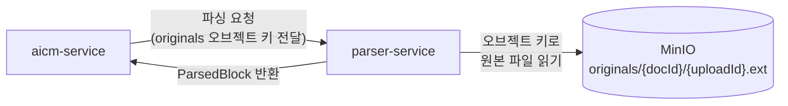

# parser-service — 데이터 아키텍처

> Stateless 서비스 — 자체 인프라 없음, MinIO 접근 패턴

---

## 1. 서비스 특성

parser-service는 **Stateless** 서비스이다. 자체 RDB, Redis, ES 등의 인프라를 소유하지 않으며, 요청을 받아 파싱 결과를 반환하는 역할만 수행한다.

| 인프라 | 소유 여부 | 접근 방식 |
|--------|----------|----------|
| RDB (PostgreSQL) | X | — |
| Elasticsearch | X | — |
| Milvus | X | — |
| Redis | X | — |
| MinIO | **읽기 전용 접근** | aicm-service로부터 오브젝트 키를 수신하여 원본 파일 읽기 |

---

## 2. MinIO 접근 패턴

parser-service는 MinIO의 `originals/` 경로에서 원본 문서를 읽는다. 파일 업로드·삭제·이동은 aicm-service가 담당하며, parser-service는 읽기만 수행한다.

### 입출력

| 구분 | 내용 |
|------|------|
| **입력** | MinIO 오브젝트 키 (예: `originals/{docId}/{uploadId}.pdf`) |
| **처리** | 원본 파일 파싱 — 텍스트/표/이미지 추출, Tier 판정 |
| **출력** | `ParsedBlock[]` — 파싱된 블록 목록 (타입, 콘텐츠, 순서, 추출 이미지 등) |

> parser-service가 파싱 결과를 반환하면, aicm-service가 Block 엔티티를 생성하고 추출된 이미지를 MinIO `documents/` 경로에 저장한다. 원본 파일의 삭제(파싱 완료 후)도 aicm-service가 수행한다. 상세 흐름은 [aicm/minio.md](../aicm/minio.md)의 "대용량 문서 업로드 흐름"을 참조한다.

---

**관련 문서**
- [aicm/minio.md](../aicm/minio.md) — MinIO 버킷 구조, 대용량 문서 업로드 흐름
- [파싱 전략](../../../01-requirements/flows/search-rag/01-parsing.md) — Tier 판정, 포맷별 파싱 전략
