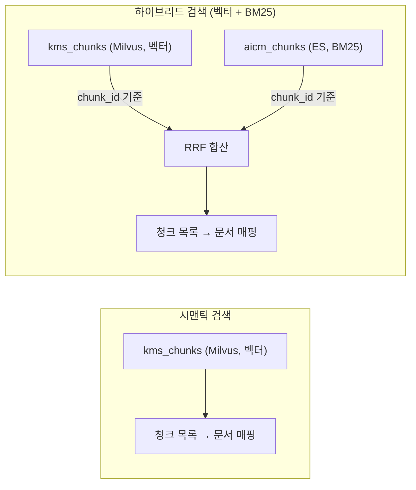
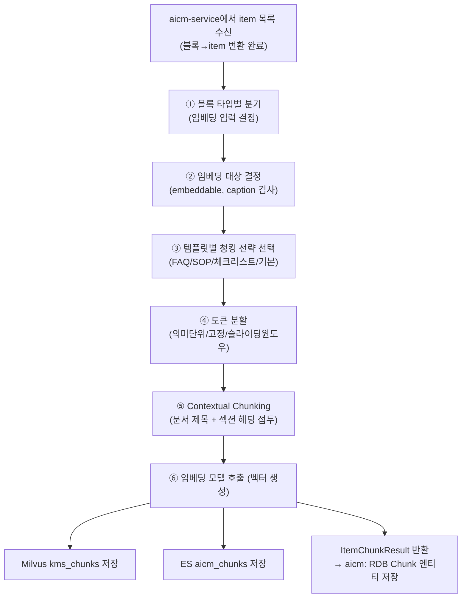

# retrieval-service — 데이터 아키텍처 개요

> 시맨틱/하이브리드 검색, 청킹/임베딩 파이프라인, 재임베딩 교체 전략

retrieval-service는 **시맨틱 검색을 위한 서비스**이다. 자체 RDB 없이 **Milvus(`kms_chunks`)**와 **ES(`aicm_chunks`)**를 소유·관리한다. aicm-service는 Milvus에 직접 접근하지 않으며, 시맨틱/하이브리드 검색은 retrieval-service API를 통해서만 수행된다.

키워드 검색(ES `aicm_blocks`, 블록 단위)은 **aicm-service가 직접 수행**하며 retrieval-service의 범위가 아니다. 자세한 내용은 [aicm/es.md](../aicm/es.md)를 참조한다.

## 인프라 소유 현황

| 인프라 | 소유 여부 | 역할 | 문서 |
|--------|----------|------|------|
| Milvus `kms_chunks` | O | 벡터 검색 (핵심) | [milvus.md](./milvus.md) |
| Elasticsearch `aicm_chunks` | O | 하이브리드 검색 시 BM25 합산 (보조) | [es.md](./es.md) |
| RDB (PostgreSQL) | X | — | — |
| Redis | X | — | — |
| MinIO | X | — | — |

---

## 1. retrieval-service의 검색 모드

retrieval-service가 제공하는 검색은 2가지이다. 키워드 검색(BM25 단독)은 aicm-service가 ES `aicm_blocks`로 직접 수행하므로 여기에 포함하지 않는다.



| 모드 | 사용 저장소 | 설명 |
|------|-----------|------|
| **시맨틱 검색** | Milvus 단독 | 벡터 유사도만으로 검색 |
| **하이브리드 검색** | Milvus + ES `aicm_chunks` | 벡터 점수 + BM25 점수를 chunk_id 기준 RRF 합산 |

> **ES `aicm_chunks`는 Milvus의 보조 역할이다.** 하이브리드 검색에서 BM25 점수를 벡터 점수와 합산하기 위해 청크 단위로 인덱싱한다. 시맨틱 검색 모드에서는 사용하지 않는다.

> **권한 사전 필터링**: aicm-service가 검색 API 호출 시 `filters` 파라미터를 전달하면, retrieval-service가 Milvus 스칼라 필터와 ES bool 필터로 변환하여 검색 실행 전에 적용한다. 이를 통해 접근 불가한 청크가 top-K 후보에서 원천 배제되며, 결과의 정확성과 검색 효율이 보장된다. 필터 인터페이스는 retrieval-service의 범용 모델(`source_id`, `source_metadata`)을 사용하므로 aicm 도메인에 결합되지 않는다. 상세는 [외부 서비스 연동 7.3절](../../05-external-integration.md)을 참조한다.

---

## 2. 청킹/임베딩 파이프라인

retrieval-service가 aicm-service로부터 블록(item) 데이터를 받아 청크를 생성하는 과정이다. 청킹 전략의 상세 의사결정 배경과 블록 타입별 세부 규칙은 [청킹 전략](../../../01-requirements/flows/search-rag/02-chunking.md)에서 다루며, 여기서는 데이터 아키텍처 관점의 파이프라인과 규칙 요약을 기술한다.

### 2.1 파이프라인 흐름



### 2.2 블록 타입별 청킹 전략

인접 짧은 블록은 **그룹으로 병합**된 후 그룹 단위로 청크를 생성한다 (Group:Chunk = 1:N, Block:Chunk = M:N). 헤딩·테이블·이미지·코드 블록은 그룹 경계로 작용하여 단독 그룹을 형성한다 (ADR-012 참조). 블록 타입에 따라 임베딩 입력과 분할 방식이 다르다.

| 블록 타입 | 임베딩 입력 | Group:Chunk | 분할 기준 | 비고 |
|----------|-----------|:---:|----------|------|
| `text` (본문) | content_text | 1:1 (기본) 또는 1:N (토큰 초과 시) | 인접 짧은 블록은 그룹 병합 후 토큰 초과 시 분할 | Contextual Chunking으로 맥락 보충 |
| `text` (헤딩) | content_text | 단독 그룹, 1:1 | 분할 불필요 (짧음) | 그룹 경계 + 섹션 접두 컨텍스트 |
| `table` | caption | 단독 그룹, 1:1 | caption 토큰 초과 시 문장 경계 분할 (드문 케이스) | caption 없으면 스킵, 그룹 경계 |
| `image` | caption | 단독 그룹, 1:1 | 분할 불필요 (캡션은 짧음) | caption 없으면 스킵, 그룹 경계 |
| `code` | content_text | 단독 그룹, 1:1 | 분할하지 않음 — 코드 분할은 의미 파괴 | 그룹 경계 |
| `file` | — | — | 항상 스킵 | — |

- **caption이 없는 table/image 블록은 임베딩을 스킵**한다. 표의 셀 데이터(content_text)는 시맨틱 임베딩에 부적합하므로 caption(자연어 설명)을 사용한다. 셀 데이터의 키워드 검색은 aicm-service의 ES `aicm_blocks`가 담당한다.
- **대형 표**는 caption 기반 시맨틱 청크(1:1)와 별개로, content_text를 행 그룹 단위로 분할한 키워드 청크를 ES `aicm_chunks`에 추가 인덱싱한다.

### 2.3 템플릿 기반 청킹 분기

`template_id`가 설정된 문서는 템플릿 성격에 맞는 Contextual Chunking 접두 전략을 적용한다.

| 템플릿 | 접두 전략 | 효과 |
|--------|----------|------|
| **FAQ** | A(답변) 청크에 Q(질문) 텍스트를 접두로 부여 | "이 질문의 답변"이라는 관계가 임베딩에 반영 |
| **SOP** | 하위 블록 청크에 스텝 헤딩을 접두로 부여 | "Step 3의 세부 설명"이라는 절차적 맥락 보존 |
| **체크리스트** | 항목 블록 청크에 체크리스트 제목을 접두로 부여 | 짧은 항목도 접두 컨텍스트로 임베딩 품질 보충 |
| **기타/없음** | 섹션 헤딩을 접두로 부여 (기본 전략) | 범용 |

### 2.4 토큰 분할 전략

블록 텍스트가 토큰 제한을 초과할 때 적용하는 분할 전략이다. 관리자가 테넌트 설정으로 선택 가능하다.

| 전략 | 분할 기준 | 적합한 케이스 |
|------|----------|-------------|
| **의미 단위** (기본) | 문장 경계에서 분할 | 구조화된 문서 (매뉴얼, 가이드) |
| **고정 토큰** | N 토큰마다 분할 | 비정형 긴 텍스트 |
| **슬라이딩 윈도우** | 고정 크기 + 겹침(overlap) | 경계 민감한 서술형 문서 |

**기본 파라미터 (sLLM 환경 기준):**

| 파라미터 | 기본값 | 근거 |
|---------|--------|------|
| max_tokens | **256** | sLLM 임베딩 모델(bge-m3 등)의 최적 입력 범위. 짧은 청크가 검색 정밀도에 유리 |
| overlap (슬라이딩 윈도우) | **50 토큰** (~20%) | 경계 문맥 손실과 중복 벡터 비용의 균형 |
| min_tokens | **30** | Contextual Chunking 접두 포함 시 30 미만이면 스킵 검토 |

### 2.5 Contextual Chunking

모든 청크의 임베딩 입력에 **문서 제목 + 섹션 헤딩**을 접두로 부여한다. 블록 타입, 템플릿, 분할 전략에 무관하게 공통 적용된다.

```
임베딩 입력 = [문서 제목] [섹션 헤딩] {블록 원본 텍스트}

예시:
  원본: "영업점 방문 시 대기표를 발급받고..."
  → "[계좌 개설 매뉴얼] [방문 절차] 영업점 방문 시 대기표를 발급받고..."
```

| 접두 구성 요소 | 소스 |
|--------------|------|
| 문서 제목 | Document.title (발행 시점) — 모든 청크에 공통 |
| 섹션 헤딩 | 해당 블록 직전의 가장 가까운 헤딩 블록 텍스트 |

sLLM 임베딩 모델은 문맥 이해 능력이 제한적이므로, 명시적 컨텍스트 접두가 벡터 공간에서의 주제별 클러스터링을 개선한다.

---

## 3. 임베딩 대상 결정

블록이 임베딩되려면 **embeddable 플래그**, **블록 타입**, **caption 존재 여부** 세 가지를 통과해야 한다.

| block_type | 임베딩 입력 | 조건 | 재임베딩 트리거 |
|------------|-----------|------|---------------|
| `text` | content_text | embeddable=true | 버전 간 **content_hash** 변경 |
| `table` | caption | embeddable=true, caption 존재 | 버전 간 **caption** 변경 |
| `image` | caption | embeddable=true, caption 존재 | 버전 간 **caption** 변경 |
| `code` | content_text | embeddable=true | 버전 간 **content_hash** 변경 |
| `file` | — | — | 항상 스킵 |

image/table은 원본(content_hash)이 변경되어도 caption이 동일하면 재임베딩하지 않는다 — 동일 벡터가 생성되므로 낭비이다. 대신 caption staleness 경고를 발생시켜 사용자에게 재생성을 유도한다.

---

## 4. 재임베딩 시 블록별 교체 전략

재임베딩은 전체를 지웠다 다시 넣는 것이 아니라, **변경된 블록의 청크만 교체**한다:

| 블록 변경 유형 | 대상 | 처리 |
|---|---|---|
| `unchanged` | 전 타입 | 기존 청크 유지 |
| `modified` | text/code | 새 청크 삽입 → 기존 청크 삭제 (검색 공백 방지) |
| `caption_modified` | image/table | `modified`와 동일 |
| `content_changed_caption_stale` | image/table | **재임베딩 안 함** — staleness 경고만 반환 |
| `added` | 전 타입 | 새 청크 삽입 |
| `deleted` | 전 타입 | 기존 청크 삭제 (Milvus + ES + RDB Chunk) |

---

**관련 문서**
- [청킹 전략](../../../01-requirements/flows/search-rag/02-chunking.md) — 블록 타입별 세부 규칙, 템플릿 청킹 상세, FAQ Q&A 감지, 토큰 분할 비교, 메타데이터 부착 규칙
- [전체 개요](../README.md) — 서비스 간 데이터 흐름
- [aicm/rdb.md](../aicm/rdb.md) — Block/Chunk 엔티티, 재임베딩 판단 SQL
- [aicm/es.md](../aicm/es.md) — ES `aicm_blocks` (키워드 검색용)
