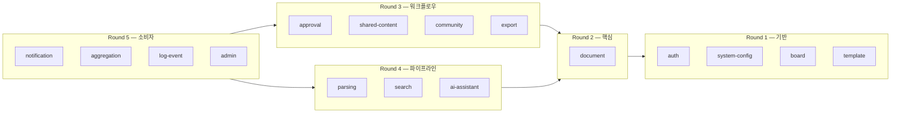

# 모듈 상세 설계

> 각 NestJS 모듈의 API 스펙, 비즈니스 규칙, 이벤트, 캐시, 배치 작업을 정의한다.

---

## 파일 구조

각 모듈 폴더는 아래 파일로 구성된다. 필수 파일 3개와 조건부 파일 4개가 있다.

### 필수 파일

| 파일 | 역할 |
|------|------|
| **README.md** | 모듈 개요 — 모듈 책임, 핵심 엔티티, 의존 관계(Mermaid), 인프라 사용 요약, 피처 게이트 |
| **api.md** | API 스펙 — 엔드포인트 요약 + 각 엔드포인트별 Request/Response(TypeScript 인터페이스), 권한, 비즈니스 규칙 참조, 에러 코드 카탈로그 |
| **rules.md** | 비즈니스 규칙 — 상태 전이(Mermaid stateDiagram), BR-{약자}-NNN 형식의 규칙 카탈로그 (트리거/조건/동작/위반 시) |

### 조건부 파일

모듈 레지스트리(`.shared/standards/module-registry.md` §1)에서 해당 컬럼이 ✅인 모듈만 작성한다.

| 파일 | 조건 | 역할 |
|------|------|------|
| **events.md** | events ✅ | 이벤트 및 부수효과 — 발행/소비 이벤트를 신뢰성 티어(BullMQ/EventBus)별로 정리. 페이로드(TypeScript 인터페이스), 소비자, 재시도 정책, 보정 배치 |
| **cache.md** | cache ✅ | 캐시 전략 — 캐시 대상별 전략(cache-aside/write-through 등), Redis 키 패턴, TTL, 직렬화, 무효화 트리거, warm-up/fallback. 키 패턴은 `data/aicm/redis.md`와 정확히 일치 |
| **schedule.md** | schedule ✅ | 스케줄 및 배치 작업 — cron 표현식, 실행 로직, 분산 락, 실패 처리, SystemConfig 설정 키 |
| **data.md** | 데이터 모델 존재 시 | 모듈 데이터 모델 — 엔티티 필드, 관계, 제약 조건. `data/aicm/rdb.md`의 전체 ERD에서 해당 모듈 소관 엔티티를 상세화 |

---

## 모듈 목록

| 폴더 | 모듈 | 파일 구성 |
|------|------|----------|
| `document/` | DocumentModule | README, api, rules, events, cache, schedule, data |
| `board/` | BoardModule | README, api, rules, cache, data |
| `template/` | TemplateModule | README, api, rules, data |
| `system-config/` | SystemConfigModule | README, api, rules, events, cache, data |
| `auth/` | AuthModule + PermissionModule | README, api, rules, events, cache, data |
| `approval/` | ApprovalModule | README, api, rules, events, schedule, data |
| `shared-content/` | SharedContentModule | README, api, rules, events, data |
| `community/` | CommunityModule | README, api, rules, events, cache, data |
| `export/` | ExportModule | README, api, rules, events, data |
| `search/` | SearchModule | README, api, rules, events, cache, schedule, data |
| `parsing/` | ParsingModule | README, api, rules, events, data |
| `ai-assistant/` | AI AssistantModule | README, api, rules, events, cache, schedule, data |
| `notification/` | NotificationModule | README, api, rules, events, schedule, data |
| `aggregation/` | AggregationModule | README, api, rules, events, cache, schedule, data |
| `log-event/` | LogEventModule | README, api, rules, schedule, data |
| `admin/` | AdminModule | README, api, rules |

---

## 문서 검수 현황

모듈 폴더별로 각 스펙 파일에 대해 **사람 검수**와 **AI 검수**를 **각각** 표시한다. 두 트랙은 독립적이다(한쪽만 완료여도 다른 쪽은 `○`로 둘 수 있음).  
**해당 없음**은 `.shared/standards/module-registry.md` 모듈 매핑 테이블(조건부 파일·데이터 모델) 및 위 [모듈 목록](#모듈-목록)의 파일 구성에 따라 채운다.

| 기호 | 의미 |
|:--:|------|
| ✓ | 검수 완료 |
| ○ | 미검수 |
| — | 해당 없음 (이 모듈에 해당 문서 종류 없음) |

### 사람 검수

| 폴더 | README | api | rules | events | cache | schedule | data |
|------|:------:|:---:|:-----:|:------:|:-----:|:--------:|:----:|
| `document/` | ○ | ○ | ○ | ○ | ○ | ○ | ○ |
| `board/` | ○ | ○ | ○ | ○ | ○ | — | ○ |
| `template/` | ○ | ○ | ○ | — | — | — | ○ |
| `system-config/` | ✓ | ✓ | ✓ | ✓ | ✓ | — | ✓ |
| `auth/` | ○ | ○ | ○ | ○ | ○ | — | ○ |
| `approval/` | ○ | ○ | ○ | ○ | — | ○ | ○ |
| `shared-content/` | ○ | ○ | ○ | ○ | — | — | ○ |
| `community/` | ○ | ○ | ○ | ○ | ○ | — | ○ |
| `export/` | ○ | ○ | ○ | ○ | — | — | ○ |
| `search/` | ○ | ○ | ○ | ○ | ○ | ○ | ○ |
| `parsing/` | ○ | ○ | ○ | ○ | — | — | ○ |
| `ai-assistant/` | ○ | ○ | ○ | ○ | ○ | ○ | ○ |
| `notification/` | ○ | ○ | ○ | ○ | — | ○ | ○ |
| `aggregation/` | ○ | ○ | ○ | ○ | ○ | ○ | ○ |
| `log-event/` | ○ | ○ | ○ | — | — | ○ | ○ |
| `admin/` | ○ | ○ | ○ | — | — | — | — |

### AI 검수

| 폴더 | README | api | rules | events | cache | schedule | data |
|------|:------:|:---:|:-----:|:------:|:-----:|:--------:|:----:|
| `document/` | ○ | ○ | ○ | ○ | ○ | ○ | ○ |
| `board/` | ○ | ○ | ○ | ○ | ○ | — | ○ |
| `template/` | ○ | ○ | ○ | — | — | — | ○ |
| `system-config/` | ○ | ○ | ○ | ○ | ○ | — | ○ |
| `auth/` | ○ | ○ | ○ | ○ | ○ | — | ○ |
| `approval/` | ○ | ○ | ○ | ○ | — | ○ | ○ |
| `shared-content/` | ○ | ○ | ○ | ○ | — | — | ○ |
| `community/` | ○ | ○ | ○ | ○ | ○ | — | ○ |
| `export/` | ○ | ○ | ○ | ○ | — | — | ○ |
| `search/` | ○ | ○ | ○ | ○ | ○ | ○ | ○ |
| `parsing/` | ○ | ○ | ○ | ○ | — | — | ○ |
| `ai-assistant/` | ○ | ○ | ○ | ○ | ○ | ○ | ○ |
| `notification/` | ○ | ○ | ○ | ○ | — | ○ | ○ |
| `aggregation/` | ○ | ○ | ○ | ○ | ○ | ○ | ○ |
| `log-event/` | ○ | ○ | ○ | — | — | ○ | ○ |
| `admin/` | ○ | ○ | ○ | — | — | — | — |

검수가 끝난 칸은 `○` → `✓`로 바꾼다.

---

## 설계 순서

모듈 간 의존 방향(화살표 = "~에 의존")에 따라 5라운드로 나뉜다. **하위 라운드가 상위 라운드의 이벤트 계약·데이터 모델·API를 참조**하므로, 상위 라운드부터 설계해야 하위 라운드에서 불일치가 발생하지 않는다.

### Round 1 — 기반 모듈

| 모듈 | 이유 |
|------|------|
| **auth** | 모든 API 엔드포인트의 권한 평가(BoardPermission, AdminPermission) 기반. 다른 모듈의 api.md가 권한 컬럼을 채우려면 auth의 규칙이 먼저 확정되어야 함 |
| **system-config** | 거의 모든 모듈이 `lm:`/`pm:` 설정 키를 참조. 설정 키 네이밍·변경 이벤트 계약이 먼저 정의되어야 다른 모듈에서 참조 가능 |
| **board** | 게시판은 문서·권한·검색의 스코프 경계. 게시판 트리 구조, BoardConfig가 확정되어야 document 이하 모듈의 스코프 범위를 정의 가능 |
| **template** | 문서 생성의 구조 기반. 템플릿 스키마가 확정되어야 document의 생성 API를 설계 가능 |

### Round 2 — 핵심 도메인

| 모듈 | 이유 |
|------|------|
| **document** | KMS의 핵심 엔티티. 문서 CRUD, 상태 전이(draft→published), 블록 구조, 버전 관리를 정의. Round 3~5의 대부분이 document의 이벤트(`document.published`, `document.updated` 등)를 소비하므로, 이벤트 페이로드가 먼저 확정되어야 함 |

> document를 단독 라운드로 분리한 이유: Round 1의 4개 모듈(auth, system-config, board, template)에 모두 의존하면서, 동시에 Round 3~5의 10개 모듈이 document에 의존한다. 의존 그래프의 **허브 노드**이므로 단독 라운드로 집중 설계하는 것이 효율적이다.

### Round 3 — 문서 워크플로우

| 모듈 | 이유 |
|------|------|
| **approval** | 문서 발행 승인 프로세스. document의 상태 전이(`draft→pending_approval→published`)가 확정된 후 설계 가능 |
| **shared-content** | 문서에 포함되는 공유 블록. document의 블록 모델이 확정된 후 임베딩/해소 로직 설계 가능 |
| **community** | 댓글, 좋아요, 북마크. document의 접근 권한 모델이 확정된 후 "누가 댓글을 달 수 있는가" 규칙 설계 가능 |
| **export** | 문서 내보내기. document의 블록 구조와 approval 상태가 확정된 후 "어떤 상태의 문서를 내보낼 수 있는가" 규칙 설계 가능 |

### Round 4 — 검색/AI 파이프라인

| 모듈 | 이유 |
|------|------|
| **parsing** | 외부 문서 파싱 → 블록 변환. document의 블록 구조와 `document.uploaded` 이벤트가 확정된 후 설계 가능 |
| **search** | 키워드/시맨틱/하이브리드 검색. document의 인덱싱 대상 필드, board의 스코프 필터, auth의 권한 필터가 모두 확정된 후에야 검색 쿼리를 설계 가능 |
| **ai-assistant** | AI 요약, 글쓰기 개선, RAG. search의 검색 API와 parsing의 블록 구조에 의존 |

> Round 3과 Round 4는 서로 의존하지 않으므로 병렬 진행이 가능하다.

### Round 5 — 횡단 소비자

| 모듈 | 이유 |
|------|------|
| **notification** | Round 1~4 모듈들의 이벤트를 소비하여 알림 발송. 상위 모듈들의 이벤트 계약이 모두 확정된 후에야 "어떤 이벤트에 어떤 알림을 보내는가" 매핑이 가능 |
| **aggregation** | 인기/트렌딩/최신 문서 집계. document, community(좋아요/댓글 수), search(검색 히트) 데이터를 종합 |
| **log-event** | 감사 로그. 모든 모듈의 주요 액션을 기록하므로 전체 이벤트 목록이 확정된 후 설계 |
| **admin** | 관리자 대시보드. 다른 모듈의 관리 API를 래핑하므로 가장 마지막에 설계 |

---

## 작성 기준

- **작성 가이드**: `.shared/guides/module-spec-guide.md`
- **형식 레퍼런스**: `document/` 모듈의 파일을 구조·깊이 기준으로 참조
- **모듈 레지스트리**: `.shared/standards/module-registry.md` — 모듈별 참조 문서, 조건부 파일 필요 여부
