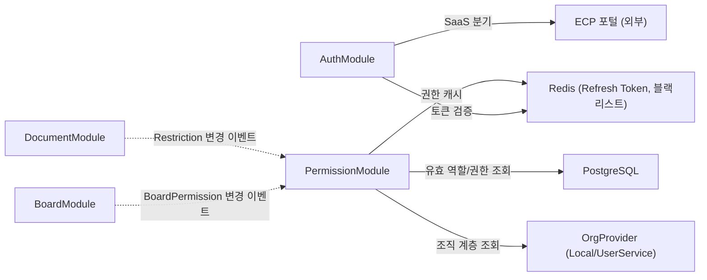

# Auth 모듈 상세 설계

| 항목 | 값 |
|------|---|
| 모듈명 | AuthModule + PermissionModule |
| 문서 코드 | MS-ACL |
| 상태 | `draft` |
| 기능정의서 | [FD-ACL-권한체계](../../01-requirements/features/FD-ACL-권한체계.md) |
| 데이터 모델 | [auth data.md](./data.md) |
| 인증/인가 아키텍처 | [03-auth-architecture](../../02-architecture/03-auth-architecture.md) |
| 인가 아키텍처 | [04-permission-architecture](../../02-architecture/04-permission-architecture.md) |

---

## 모듈 책임

| 구분 | 책임 |
|------|------|
| **AuthModule** | 토큰 검증(AuthGuard), UserContext 생성, AuthProvider 분기(SaaS/온프렘). 토큰 발급/갱신/폐기는 외부 인증 서비스 소관 |
| **PermissionModule** | 유효 역할 산출, 게시판 권한(BoardPermission) 평가, 관리자 권한(AdminPermission) 평가, 문서 접근 제한(DocumentRestriction) 평가, 권한 캐시 관리, 검색/RAG 권한 필터 제공 |

> Role/Team/Permission CRUD(관리 API)는 Phase 2에서 추가한다. 본 문서는 **인증 인프라 + 권한 평가 인프라**에 집중한다.

---

## 핵심 엔티티

| 엔티티 | 설명 | 상세 |
|--------|------|------|
| Role | 권한의 단일 경계 — BoardPermission + AdminPermission 보유 | [data.md §1](./data.md) |
| UserRole | 사용자에게 직접 할당된 역할 | [data.md §2](./data.md) |
| TeamRole | 그룹(Team)에 부여된 역할 | [data.md §3](./data.md) |
| Team | 사용자 그룹 — 계층 구조(parent_id) | [data.md §4](./data.md) |
| TeamMember | 그룹-사용자 매핑 | [data.md §5](./data.md) |
| BoardPermission | Role별 게시판 action(VIEW/EDIT/APPROVE) 매핑 | [data.md §6](./data.md) |
| AdminPermission | Role별 관리 권한 키 매핑 | [data.md §7](./data.md) |
| DocumentRestriction | 문서 단위 접근 제한 설정 | [data.md §8](./data.md) |
| RestrictionEntry | 화이트리스트 항목 (User/Team + action) | [data.md §9](./data.md) |

---

## 의존 관계

| 방향 | 대상 | 의존 유형 | 설명 |
|------|------|----------|------|
| Auth → Redis | 인프라 | DI | Refresh Token 저장, Access Token 블랙리스트 |
| Permission → Redis | 인프라 | DI | 권한 캐시 (유효 역할, 게시판 접근 ID) |
| Permission → PostgreSQL | 인프라 | DI | Role/Permission/Restriction 조회 |
| Permission ← BoardModule | 이벤트 소비 | EventBus | BoardPermission 변경 시 캐시 무효화 |

---

## 인프라 사용 요약

| 인프라 | 용도 |
|--------|------|
| **PostgreSQL** | Role, UserRole, TeamRole, Team, TeamMember, BoardPermission, AdminPermission, DocumentRestriction, RestrictionEntry |
| **Redis** | 유효 역할 캐시, 게시판 접근 ID 캐시, OrgProvider 결과 캐시 |
| **BullMQ** | `acl.events` 큐 — 권한 변경 이벤트 발행 |
| **EventBus** | 캐시 무효화 이벤트 내부 전파 |

---

## 피처 게이트 기반 Graceful Degradation

| 피처 | SystemConfig 키 | 기본값 | off 시 동작 |
|------|----------------|--------|------------|
| 문서 접근 제한 | `pm:acl.restriction_enabled` | `false` | DocumentRestriction 평가 스킵, 게시판 권한만 적용 |

---

## 관련 문서

| 문서 | 설명 |
|------|------|
| [FD-ACL-권한체계](../../01-requirements/features/FD-ACL-권한체계.md) | 기능 요구사항 원본 |
| [03-auth-architecture](../../02-architecture/03-auth-architecture.md) | 인증 흐름, 토큰 생명주기, 권한 캐싱 |
| [04-permission-architecture](../../02-architecture/04-permission-architecture.md) | 3계층 권한 모델, 권한 평가 종합 흐름 |
| [05-async-event-architecture](../../02-architecture/05-async-event-architecture.md) | BullMQ 큐/EventBus 이벤트 계약 |
| [08-cache-architecture](../../02-architecture/08-cache-architecture.md) | 캐시 키/TTL/무효화 전략 |
| [ADR-005](../../adr/005-usergroup-hierarchy-and-org-provider.md) | Team 계층 확장, OrgProvider 패턴 |
