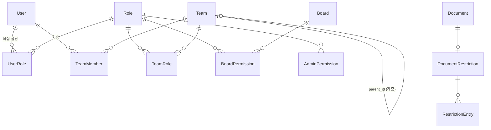

# Auth 데이터 모델

> 참조: [FD-ACL-권한체계 §9](../../01-requirements/features/FD-ACL-권한체계.md) · [03-auth-architecture](../../02-architecture/03-auth-architecture.md) · [data/aicm/rdb.md](../../02-architecture/data/aicm/rdb.md)

---

## 엔티티 관계도

> User는 외부 서비스(user_service) 엔티티. AICM DB에 User 테이블 없음 — `userId` UUID 참조만 존재.

---

## §1. Role

| 필드 | 타입 | 제약 | 설명 |
|------|------|------|------|
| id | UUID | PK | |
| name | VARCHAR(100) | NOT NULL, UNIQUE | 역할 이름 |
| description | VARCHAR(500) | NULL | 역할 설명 |
| status | ENUM('active','inactive','locked') | NOT NULL, DEFAULT 'active' | 생명주기 상태 |
| is_system | BOOLEAN | NOT NULL, DEFAULT false | 시스템 프리셋 여부 (true → 삭제 불가, BR-ACL-005) |
| lock_reason | VARCHAR(500) | NULL | 긴급 잠금 사유 (status='locked'일 때만) |
| created_by | UUID | NOT NULL | 생성자 (user_service userId) |
| created_at | TIMESTAMP | NOT NULL | |
| updated_at | TIMESTAMP | NOT NULL | |
| version | INTEGER | NOT NULL, DEFAULT 1 | 낙관적 동시성 제어 (BR-ACL-035) |

**인덱스:**
- `UQ_role_name` — UNIQUE(name)
- `IDX_role_status` — (status)

---

## §2. UserRole

| 필드 | 타입 | 제약 | 설명 |
|------|------|------|------|
| id | UUID | PK | |
| user_id | UUID | NOT NULL | 사용자 (user_service) |
| role_id | UUID | FK(Role), NOT NULL | |
| created_by | UUID | NOT NULL | 할당자 |
| created_at | TIMESTAMP | NOT NULL | |

**제약:**
- `UQ_user_role` — UNIQUE(user_id, role_id)

**인덱스:**
- `IDX_user_role_user` — (user_id)
- `IDX_user_role_role` — (role_id)

---

## §3. TeamRole

| 필드 | 타입 | 제약 | 설명 |
|------|------|------|------|
| id | UUID | PK | |
| team_id | UUID | FK(Team), NOT NULL | |
| role_id | UUID | FK(Role), NOT NULL | |
| created_by | UUID | NOT NULL | 할당자 |
| created_at | TIMESTAMP | NOT NULL | |

**제약:**
- `UQ_team_role` — UNIQUE(team_id, role_id)

**인덱스:**
- `IDX_team_role_team` — (team_id)
- `IDX_team_role_role` — (role_id)

---

## §4. Team

| 필드 | 타입 | 제약 | 설명 |
|------|------|------|------|
| id | UUID | PK | |
| name | VARCHAR(100) | NOT NULL | 그룹 이름 |
| description | VARCHAR(500) | NULL | 그룹 설명 |
| parent_id | UUID | FK(Team), NULL | 상위 그룹 (NULL → 최상위) |
| status | ENUM('active','inactive') | NOT NULL, DEFAULT 'active' | 생명주기 상태 |
| expires_at | TIMESTAMP | NULL | 임시 그룹 유효기간 (NULL → 무기한, BR-ACL-015) |
| is_external | BOOLEAN | NOT NULL, DEFAULT false | 외부 인사 시스템 연동 그룹 여부 |
| created_by | UUID | NOT NULL | 생성자 |
| created_at | TIMESTAMP | NOT NULL | |
| updated_at | TIMESTAMP | NOT NULL | |
| version | INTEGER | NOT NULL, DEFAULT 1 | 낙관적 동시성 제어 |

**인덱스:**
- `IDX_team_parent` — (parent_id)
- `IDX_team_status` — (status)
- `IDX_team_expires` — (expires_at) WHERE expires_at IS NOT NULL

---

## §5. TeamMember

| 필드 | 타입 | 제약 | 설명 |
|------|------|------|------|
| id | UUID | PK | |
| team_id | UUID | FK(Team), NOT NULL | |
| user_id | UUID | NOT NULL | 사용자 (user_service) |
| created_at | TIMESTAMP | NOT NULL | |

**제약:**
- `UQ_team_member` — UNIQUE(team_id, user_id)

**인덱스:**
- `IDX_team_member_team` — (team_id)
- `IDX_team_member_user` — (user_id)

---

## §6. BoardPermission

| 필드 | 타입 | 제약 | 설명 |
|------|------|------|------|
| id | UUID | PK | |
| role_id | UUID | FK(Role), NOT NULL | |
| board_id | UUID | NOT NULL | 게시판 (Board 엔티티 — BoardModule 소관) |
| action | ENUM('VIEW','EDIT','APPROVE') | NOT NULL | |
| created_at | TIMESTAMP | NOT NULL | |

**제약:**
- `UQ_board_permission` — UNIQUE(role_id, board_id, action)

**인덱스:**
- `IDX_bp_role` — (role_id)
- `IDX_bp_board` — (board_id)
- `IDX_bp_board_action` — (board_id, action)

---

## §7. AdminPermission

| 필드 | 타입 | 제약 | 설명 |
|------|------|------|------|
| id | UUID | PK | |
| role_id | UUID | FK(Role), NOT NULL | |
| permission_key | VARCHAR(50) | NOT NULL | 관리 권한 키 (FD-ACL §6의 12종) |
| created_at | TIMESTAMP | NOT NULL | |

**제약:**
- `UQ_admin_permission` — UNIQUE(role_id, permission_key)

**허용 키 목록:** `manage_boards`, `manage_roles`, `manage_teams`, `manage_policies`, `manage_templates`, `manage_tags`, `manage_shared_content`, `manage_search`, `manage_prompts`, `manage_system`, `view_audit_logs`, `bypass_approval`

**인덱스:**
- `IDX_ap_role` — (role_id)

---

## §8. DocumentRestriction

| 필드 | 타입 | 제약 | 설명 |
|------|------|------|------|
| id | UUID | PK | |
| document_id | UUID | NOT NULL, UNIQUE | 문서 (DocumentModule 소관) |
| restricted | BOOLEAN | NOT NULL, DEFAULT false | 제한 활성 여부 |
| created_by | UUID | NOT NULL | 설정자 |
| created_at | TIMESTAMP | NOT NULL | |
| updated_at | TIMESTAMP | NOT NULL | |

**인덱스:**
- `UQ_restriction_document` — UNIQUE(document_id)
- `IDX_restriction_restricted` — (restricted) WHERE restricted = true

---

## §9. RestrictionEntry

| 필드 | 타입 | 제약 | 설명 |
|------|------|------|------|
| id | UUID | PK | |
| restriction_id | UUID | FK(DocumentRestriction), NOT NULL | |
| subject_type | ENUM('USER','TEAM') | NOT NULL | 화이트리스트 대상 유형 |
| subject_id | UUID | NOT NULL | User ID 또는 Team ID |
| action | ENUM('VIEW','EDIT','APPROVE') | NOT NULL | 허용 action |
| created_at | TIMESTAMP | NOT NULL | |

**제약:**
- `UQ_restriction_entry` — UNIQUE(restriction_id, subject_type, subject_id, action)

**인덱스:**
- `IDX_re_restriction` — (restriction_id)
- `IDX_re_subject` — (subject_type, subject_id)
