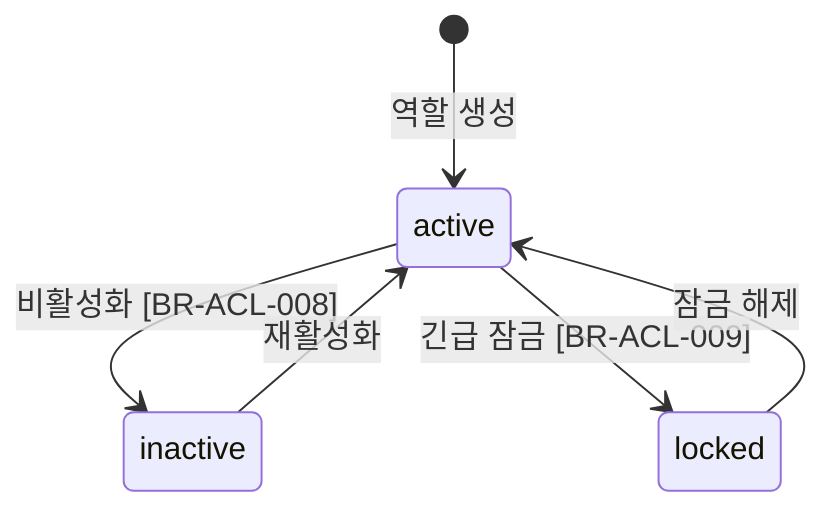
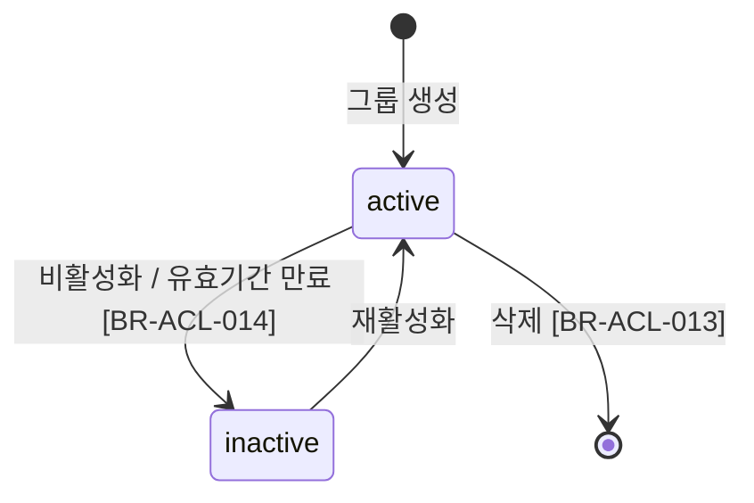

# Auth 비즈니스 규칙

> 참조: [FD-ACL-권한체계](../../01-requirements/features/FD-ACL-권한체계.md) · [api.md](./api.md) · [03-auth-architecture](../../02-architecture/03-auth-architecture.md) · [04-permission-architecture](../../02-architecture/04-permission-architecture.md)

---

## 1. 상태 전이

### 1.1 Role 생명주기

### 1.2 Team(Group) 생명주기

---

## 2. 규칙 카탈로그

### 인증 (Authentication)

> 로그인/로그아웃/토큰 갱신/토큰 폐기는 외부 인증 서비스 소관. KMS는 수신된 토큰의 **검증만** 담당한다.

#### BR-ACL-040: Access Token 검증

- **트리거**: 모든 API 요청 수신 시 (AuthGuard)
- **조건**: `Authorization: Bearer` 헤더에 Access Token 존재
- **동작**: AuthProvider를 통해 서명 검증 → 만료 확인 → UserContext 생성 `(userId, tenantId, roles)`
- **위반 시**: 토큰 없음 `AUTH_TOKEN_MISSING`(401), 만료 `AUTH_TOKEN_EXPIRED`(401), 서명 무효 `AUTH_TOKEN_INVALID`(401)

#### BR-ACL-042: 배포 모드별 토큰 검증 분기

- **트리거**: AuthGuard 실행 시
- **조건**: 환경변수 `DEPLOY_MODE` 값
- **동작**: `saas` → EcpAuthProvider(ECP 포털 토큰 검증), `onprem` → LocalAuthProvider(자체 JWT RS256 검증)
- **위반 시**: 해당 없음 (환경변수 기반 정적 분기)

### 권한 평가 (Authorization)

#### BR-ACL-001: 자원 3분류 권한 모델

- **트리거**: 모든 API 권한 평가 시 (PermissionGuard)
- **조건**: 요청 대상 자원의 유형 판별
- **동작**: 문서 자원 → BoardPermission 평가, 관리 자원 → AdminPermission 평가, 개인 자원 → 소유자 확인
- **위반 시**: 해당 없음 (라우팅 규칙)

#### BR-ACL-002: 서비스 신원 전체 바이패스

- **트리거**: 내부 배치·M2M 등 허용 목록에 등록된 서비스 토큰의 API 요청
- **조건**: AuthGuard 정책상 서비스 신원으로 인정
- **동작**: 모든 자원에 대해 권한 평가 스킵, 즉시 허용(정책 범위 내)
- **위반 시**: 해당 없음

#### BR-ACL-003: 메타정보 VIEW 바이패스

- **트리거**: `BoardPermission(VIEW)` 미보유 게시판의 문서에 접근
- **조건**: 유효 역할 합산에 **AdminPermission이 하나 이상** 존재
- **동작**: 메타정보 수준 VIEW만 허용 (제목, 상태, 태그, 작성자 등). 블록 본문/댓글 내용/첨부파일 URL 제거. 응답에 `viewSource: 'bypass'` 포함. 감사 로그 기록
- **위반 시**: 해당 없음 (자동 필터링)

#### BR-ACL-004: 외부 역할 라벨 비사용

- **트리거**: 권한 평가 시
- **조건**: 토큰에 외부 사용자 유형·라벨 표기가 있어도
- **동작**: AICM 인가에는 사용하지 않음 — BoardPermission·AdminPermission·소유자 확인만 평가. `AdminPermission`은 외부 "관리자" 라벨이나 계정 등급과 **대응 관계를 강제하지 않는다**.
- **위반 시**: 해당 없음

#### BR-ACL-016: 유효 역할 합산

- **트리거**: 권한 평가 시 `getEffectiveRoles(userId)` 호출
- **조건**: 사용자에게 UserRole, TeamRole(소속 팀 + 상위 팀 체인) 존재
- **동작**: `유효 역할 = UserRole(직접) ∪ TeamRole(소속 팀) ∪ TeamRole(상위 팀 체인)`. 비활성/잠금 Role 제외(BR-ACL-018), 비활성 Group 제외(BR-ACL-019)
- **위반 시**: 해당 없음

#### BR-ACL-018: 비활성/잠금 Role 제외

- **트리거**: 유효 역할 합산 시
- **조건**: Role.status가 `inactive` 또는 `locked`
- **동작**: 해당 Role을 유효 역할 합산에서 제외
- **위반 시**: 해당 없음

#### BR-ACL-019: 비활성 Group 통한 역할 제외

- **트리거**: 유효 역할 합산 시
- **조건**: Team.status가 `inactive`
- **동작**: 해당 Group을 통해 상속되는 역할을 유효 역할 합산에서 제외
- **위반 시**: 해당 없음

#### BR-ACL-020: 관리 자원은 AdminPermission만

- **트리거**: 관리 자원 API 요청
- **조건**: 해당 엔드포인트에 필요한 `AdminPermission` 키
- **동작**: 유효 역할에서 해당 키 보유 여부만 평가. 외부 역할 라벨로 선행 거부하지 않음
- **위반 시**: `ACL_PERMISSION_DENIED`(403)

#### BR-ACL-022: 게시판 간 권한 격리

- **트리거**: 문서 자원 접근 시 BoardPermission 평가
- **조건**: 요청 대상 문서가 소속된 게시판
- **동작**: 해당 게시판에 대한 BoardPermission만 평가. 다른 게시판의 권한은 적용 안 됨
- **위반 시**: `ACL_PERMISSION_DENIED`(403)

#### BR-ACL-025: DocumentRestriction 기본 상태 (열림)

- **트리거**: 문서 접근 시 Restriction 확인
- **조건**: `restricted = false` (기본값)
- **동작**: 상위 게시판 권한 그대로 상속, Restriction 평가 스킵
- **위반 시**: 해당 없음

#### BR-ACL-026: DocumentRestriction 제한 상태

- **트리거**: 문서 접근 시 `restricted = true`
- **조건**: 화이트리스트(RestrictionEntry)에 요청 사용자 또는 소속 Team 존재
- **동작**: 화이트리스트에 포함된 User/Team + 해당 action만 허용
- **위반 시**: `ACL_RESTRICTION_DENIED`(403)

#### BR-ACL-029: Restriction 기능 on/off

- **트리거**: 문서 접근 시 Restriction 평가 전
- **조건**: SystemConfig `pm:acl.restriction_enabled`
- **동작**: `false`면 모든 문서가 게시판 권한만 따름 (Restriction 평가 스킵). `true`면 DocumentRestriction 확인
- **위반 시**: 해당 없음

### 권한 캐시

#### BR-ACL-044: 권한 캐시 무효화

- **트리거**: UserRole/TeamRole/TeamMember/Team 계층 변경 이벤트 발생
- **조건**: 해당 이벤트의 영향 사용자 존재
- **동작**: 영향 사용자의 Redis 캐시 키 삭제 (`cache:auth:effective-roles:{user_id}`, `cache:auth:accessible-boards:{user_id}:*`). 무효화 대상 사용자는 RDB에서 직접 조회 (캐시 기반 탐색 금지)
- **위반 시**: 해당 없음

#### BR-ACL-045: DocumentRestriction 캐시 미적용

- **트리거**: 문서 Restriction 평가 시
- **조건**: 항상
- **동작**: DB 직접 조회. 제한 문서는 극소수이므로 캐시 이점 미미, 실시간 반영이 중요
- **위반 시**: 해당 없음
