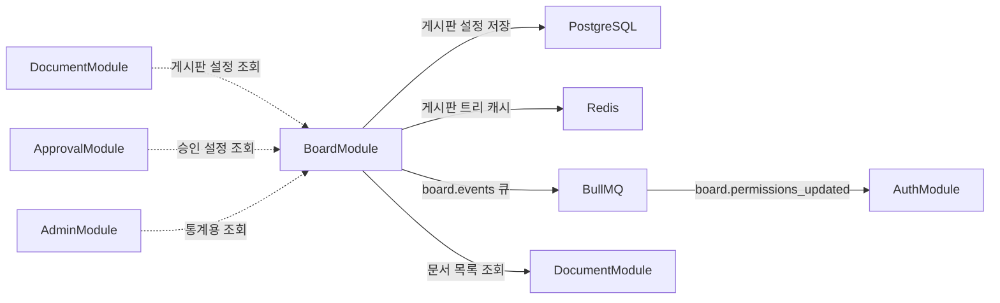

# Board 모듈 상세 설계

| 항목 | 값 |
|------|---|
| 모듈명 | BoardModule |
| 문서 코드 | MS-BRD |
| 상태 | `draft` |
| 기능정의서 | [FD-DOC-문서관리 §7 게시판](../../01-requirements/features/FD-DOC-문서관리.md), [FD-NTC-공지사항 §1 공지 게시판](../../01-requirements/features/FD-NTC-공지사항.md) |
| 데이터 모델 | [board data.md](./data.md) |

---

## 모듈 책임

| 구분 | 책임 |
|------|------|
| **게시판 CRUD** | 게시판 생성/조회/수정/삭제(soft delete), 재귀 트리(parent_id) 구조의 사이드바 네비게이션 계층 관리 |
| **게시판 설정** | approval_required, versioning_enabled, mandatory_approval_config, default_approval_template_id, default_template_id, default_retention_policy_id, board_config(댓글/표시/첨부/알림/글작성/공지 전용 설정) |
| **게시판 타입** | knowledge / community / notice / custom 4종 타입 관리. 타입별 운영 특성(RAG 포함 여부, 승인/버전 기본값, 열람 권한, 읽음 확인 등) 적용 |
| **게시판별 권한 매핑** | Role-Action(VIEW/EDIT/APPROVE) 매핑 관리. BoardPermission 엔티티를 통해 게시판 단위로 역할별 허용 액션을 설정 |

> DocumentModule과의 역할 분담: 게시판은 "문서가 어떤 운영 규칙(권한/승인/RAG)을 따르는가"를 결정하는 정책 단위이다. 문서 자체의 CRUD/상태 전이/버전 관리는 DocumentModule 소관이며, BoardModule은 게시판 구조와 운영 정책만 책임진다.

---

## 핵심 엔티티

| 엔티티 | 설명 | 상세 |
|--------|------|------|
| Board | 게시판 — 재귀 트리(parent_id), 운영 정책(승인/버전/템플릿/보존/board_config), board_type(knowledge/community/notice/custom), soft delete | [data.md §1](./data.md) |
| BoardPermission | 게시판별 Role-Action 권한 매핑 — role_id + action(VIEW/EDIT/APPROVE) | [data.md §2](./data.md) |

---

## 의존 관계

| 방향 | 대상 | 의존 유형 | 설명 |
|------|------|----------|------|
| Board → PostgreSQL | 인프라 | DI | Board, BoardPermission CRUD |
| Board → Redis | 인프라 | DI | 게시판 트리 캐시 (`{tenant_id}:cache:board:tree`, TTL 1시간) |
| Board → BullMQ | 인프라 | DI | `board.events` 큐 — `board.permissions_updated` 이벤트 발행 |
| Board → DocumentModule | 읽기 | DI | Controller 오케스트레이션 (게시판 내 문서 목록 조회) |
| DocumentModule → Board | 읽기 | DI | 게시판 설정(승인/버전 플래그, mandatory_approval_config, 기본 템플릿, 허용 템플릿) 조회 |
| ApprovalModule → Board | 읽기 | DI | 게시판 승인 설정/기본 승인 라인 템플릿 조회 |
| AdminModule → Board | 읽기 | DI | 관리자 통계용 게시판 데이터 조회 |
| Board → AuthModule | 이벤트 | BullMQ | `board.events` 큐를 통해 `board.permissions_updated` 발행 → AuthModule이 소비하여 권한 캐시 무효화 |

> Board ↔ Document는 양방향 읽기 의존이다. 양쪽 모두 읽기 전용이므로 순환 의존 금지 원칙에 저촉되지 않는다 ([02-module-architecture.md §3.3](../../02-architecture/02-module-architecture.md) 참조).

---

## 인프라 사용 요약

| 인프라 | 용도 |
|--------|------|
| **PostgreSQL** | Board, BoardPermission 엔티티 저장 |
| **Redis** | 게시판 트리 캐시 (`{tenant_id}:cache:board:tree`, TTL 1시간) |
| **BullMQ** | `board.events` 큐 — `board.permissions_updated` 이벤트 (게시판 권한 변경 시 AuthModule이 소비하여 권한 캐시 무효화) |

> EventBus는 사용하지 않는다 — 게시판 권한 변경은 Important 티어로 분류되어 BullMQ를 통해 at-least-once 전달을 보장한다.

---

## 관련 문서

| 문서 | 설명 |
|------|------|
| [FD-DOC-문서관리 §7](../../01-requirements/features/FD-DOC-문서관리.md) | 게시판 분류 체계 — 재귀 트리, 문서 x 게시판 관계, 검색/RAG 연동 |
| [FD-NTC-공지사항 §1](../../01-requirements/features/FD-NTC-공지사항.md) | notice 타입 확장 — board_type, board_config 공지 전용 설정 |
| [02-module-architecture](../../02-architecture/02-module-architecture.md) | 모듈 분류, 의존성 매트릭스, BullMQ 큐/EventBus 매트릭스 |
| [03-auth-architecture](../../02-architecture/03-auth-architecture.md) | 인증 흐름, 권한 평가 로직, Role-Action 모델 |
| [05-async-event-architecture](../../02-architecture/05-async-event-architecture.md) | BullMQ 큐 정의, `board.events` 큐 상세 |
| [08-cache-architecture](../../02-architecture/08-cache-architecture.md) | 캐시 키/TTL/무효화 전략 — `cache:board:tree` |
