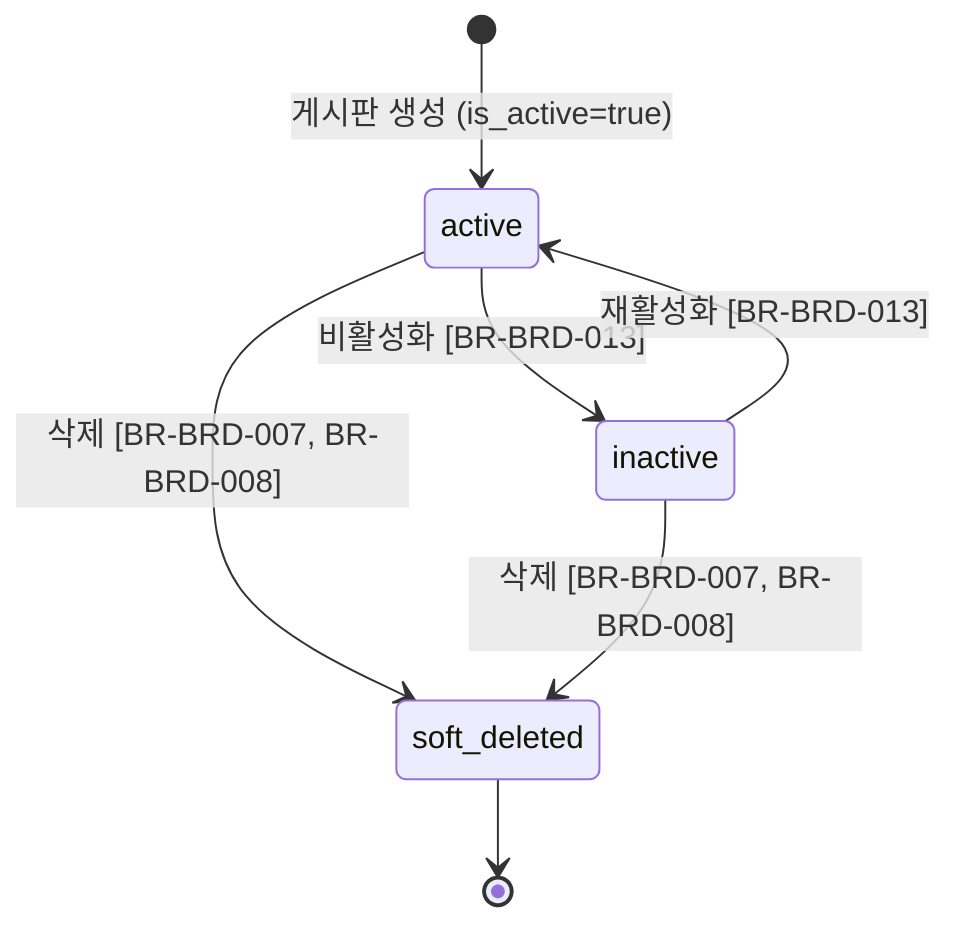

# Board 비즈니스 규칙

> 참조: [FD-DOC-문서관리 &sect;7](../../01-requirements/features/FD-DOC-문서관리.md) &middot; [FD-NTC-공지사항 &sect;1](../../01-requirements/features/FD-NTC-공지사항.md) &middot; [api.md](./api.md) &middot; [data.md](./data.md) &middot; [03-auth-architecture](../../02-architecture/03-auth-architecture.md) &middot; [04-permission-architecture](../../02-architecture/04-permission-architecture.md)

---

## 1. 상태 전이

### 1.1 Board 생명주기

Board 엔티티는 status 필드를 갖지 않는다. `is_active`(BOOLEAN)와 `deleted_at`(소프트 딜리트)로 상태를 관리한다.

| 상태 | 조건 | 허용 행위 | 차단 행위 |
|------|------|----------|----------|
| `active` | `is_active = true`, `deleted_at IS NULL` | 조회, 수정, 문서 작성, 트리 노출 | -- |
| `inactive` | `is_active = false`, `deleted_at IS NULL` | 관리자 조회/수정, 재활성화 | 사용자 트리 노출(BR-BRD-001), 문서 작성 |
| `soft_deleted` | `deleted_at IS NOT NULL` | -- | 모든 행위 (복구 API 미제공) |

---

## 2. 규칙 카탈로그

### 조회/접근

#### BR-BRD-001: 트리 조회 시 VIEW 권한 기반 필터링

- **트리거**: `GET /boards/tree` 호출 시
- **조건**: 요청 사용자의 유효 역할(effective roles)에 대해 BoardPermission(VIEW) 존재 여부 확인
- **동작**: 사용자의 유효 역할(UserRole + TeamRole 합산)로부터 VIEW 권한이 있는 게시판만 반환. `is_active = true`인 게시판만 포함. 게시판 트리는 재귀 구조로 조립하되, VIEW 권한이 없는 중간 노드는 제외
- **위반 시**: 해당 없음 (필터링 규칙 -- 권한 없는 게시판은 응답에서 제거)

> 참고: 게시판 트리의 권한은 부모에서 자식으로 상속되지 않는다. 각 게시판의 BoardPermission은 완전히 독립적이다 (03-auth-architecture 참조).

#### BR-BRD-010: 존재하지 않는 게시판 접근 차단

- **트리거**: 게시판 ID를 경로 파라미터로 받는 모든 API 호출 시
- **조건**: 요청된 게시판 ID가 DB에 존재하지 않거나 `deleted_at IS NOT NULL`
- **동작**: 조기 차단 -- 이후 비즈니스 로직 실행하지 않음
- **위반 시**: `BRD_NOT_FOUND`(404)

### 권한

#### BR-BRD-002: 관리 API 권한

- **트리거**: `/admin/boards/**` 경로의 모든 API 요청
- **조건**: 요청 사용자의 유효 역할에 `manage_boards` AdminPermission 보유
- **동작**: 권한 확인 통과 시 API 처리 진행
- **위반 시**: `ACL_PERMISSION_DENIED`(403)

#### BR-BRD-011: role_id 유효성 검증

- **트리거**: `PUT /admin/boards/:id/permissions` 요청 시
- **조건**: 요청 본문의 각 `role_id`에 대해 Role 테이블에서 존재 + `status = 'active'` 확인
- **동작**: 모든 role_id가 유효한 활성 역할이면 권한 설정 진행
- **위반 시**: 존재하지 않거나 비활성(`inactive`/`locked`) 상태의 role_id -> `BRD_INVALID_ROLE`(400)

#### BR-BRD-012: 권한 변경 후 이벤트 발행

- **트리거**: `PUT /admin/boards/:id/permissions` 처리 완료 시
- **조건**: 기존 권한과 비교하여 실제 변경이 발생한 경우
- **동작**: `board.events` BullMQ 큐에 `board.permissions_updated` 이벤트를 발행. AuthModule이 소비하여 해당 Role 보유 사용자의 Redis 권한 캐시(`cache:auth:accessible-boards:{user_id}:*`)를 무효화
- **위반 시**: 이벤트 발행 실패 시 BullMQ 재시도 정책 적용 (최대 3회, 지수 백오프). 재시도 소진 시 `board.events-dlq`로 이동. 캐시는 TTL 만료(최대 5분)로 자연 갱신

### 게시판 생성/수정

#### BR-BRD-003: slug UNIQUE 제약

- **트리거**: `POST /admin/boards` (생성) 또는 `PUT /admin/boards/:id` (slug 변경) 요청 시
- **조건**: 요청된 slug가 시스템 전체(테넌트 범위)에서 유일해야 함. 소프트 삭제된 게시판의 slug도 중복 검사 대상
- **동작**: DB UNIQUE 제약 + 애플리케이션 레벨 사전 검증
- **위반 시**: `BRD_SLUG_DUPLICATE`(409)

#### BR-BRD-004: parent_id 유효성 검증

- **트리거**: `POST /admin/boards` (생성, parent_id 지정 시) 또는 `PATCH /admin/boards/:id/move` (이동 시) 요청
- **조건**: 지정된 parent_id에 해당하는 게시판이 존재하고 `deleted_at IS NULL`
- **동작**: parent_id가 null이면 루트 게시판으로 생성/이동. 유효한 게시판이면 해당 게시판의 하위로 배치
- **위반 시**: parent_id가 존재하지 않거나 소프트 삭제된 게시판 -> `BRD_INVALID_PARENT`(400)

#### BR-BRD-005: notice 타입 생성 시 기본 board_config 자동 적용

- **트리거**: `POST /admin/boards` 요청 시 `board_type = 'notice'`
- **조건**: 요청 본문에 `board_config.notice` 키가 누락되었거나 일부 필드만 제공된 경우
- **동작**: FD-NTC-공지사항 &sect;1.3에 정의된 기본값을 병합 적용 -- `default_popup: false`, `default_popup_frequency: "once"`, `default_confirmation_required: false`, `default_confirmation_deadline_days: null`, `max_pinned_count: 5`, `reminder_days_before: [3, 1]`, `overdue_reminder_interval_hours: 24`, `allowed_notification_channels: ["in_app", "email", "web_push"]`, `include_in_rag: false`. 요청에 명시적으로 제공된 필드는 기본값을 덮어씀 [BR-NTC-006]
- **위반 시**: 해당 없음 (자동 보완 규칙)

#### BR-BRD-006: 루트 전용 설정 제한

- **트리거**: `PUT /admin/boards/:id` 요청 시 `approval_required` 또는 `versioning_enabled` 변경 시도
- **조건**: 대상 게시판의 `parent_id IS NOT NULL` (하위 게시판)
- **동작**: 하위 게시판은 루트 게시판의 `approval_required`/`versioning_enabled` 값을 상속한다. 하위 게시판에서 직접 변경 불가
- **위반 시**: `BRD_ROOT_ONLY_SETTING`(400)

### 게시판 이동

#### BR-BRD-009: 순환 참조 방지

- **트리거**: `PATCH /admin/boards/:id/move` 요청 시
- **조건**: 이동 대상 parent_id가 자기 자신이거나, 자신의 하위 게시판 트리에 속하는 경우
- **동작**: 이동 전 대상 게시판의 하위 트리를 재귀 조회하여 parent_id가 해당 트리에 포함되는지 검증. 자기 자신(`parent_id = id`)도 차단
- **위반 시**: `BRD_CIRCULAR_REFERENCE`(400)

### 게시판 삭제

#### BR-BRD-007: 하위 게시판 존재 시 삭제 차단

- **트리거**: `DELETE /admin/boards/:id` 요청 시
- **조건**: 대상 게시판을 `parent_id`로 참조하는 게시판이 존재 (`deleted_at IS NULL`인 게시판만 카운트)
- **동작**: 하위 게시판이 1건 이상이면 삭제를 차단. 관리자가 하위 게시판을 먼저 이동하거나 삭제해야 함
- **위반 시**: `BRD_HAS_CHILDREN`(409)

#### BR-BRD-008: published 문서 존재 시 삭제 차단

- **트리거**: `DELETE /admin/boards/:id` 요청 시
- **조건**: 대상 게시판에 `status = 'published'`인 문서가 존재
- **동작**: published 상태의 문서가 1건 이상이면 삭제를 차단. 관리자가 문서를 다른 게시판으로 이동하거나 아카이브 처리해야 함
- **위반 시**: `BRD_HAS_DOCUMENTS`(409)

### 상태 변경

#### BR-BRD-013: 게시판 활성/비활성 전환

- **트리거**: `PUT /admin/boards/:id` 요청 시 `is_active` 값 변경
- **조건**: 대상 게시판이 소프트 삭제되지 않은 상태 (`deleted_at IS NULL`)
- **동작**:
  - `is_active = false`로 변경 시: 사용자 트리 조회(BR-BRD-001)에서 제외. 관리자 목록에서는 계속 표시. 해당 게시판에 새 문서 작성 차단
  - `is_active = true`로 변경 시: 사용자 트리 조회에 다시 포함. 문서 작성 허용 재개
- **위반 시**: 해당 없음 (상태 전환 규칙)

### 공지 게시판 특수 규칙

#### BR-BRD-014: notice 타입 기본 VIEW 권한

- **트리거**: `POST /admin/boards` 요청 시 `board_type = 'notice'`로 게시판 생성
- **조건**: notice 타입 게시판 생성 완료 시
- **동작**: 전체 사용자에게 VIEW 권한이 기본 부여된다. BoardPermission에서 명시적으로 VIEW를 제거하지 않는 한 모든 로그인 사용자가 열람 가능 [BR-NTC-003]
- **위반 시**: 해당 없음 (기본값 적용 규칙)

#### BR-BRD-015: board_config 키 누락 시 기본값 적용

- **트리거**: 게시판 설정 조회 시 (`getBoardSettings`)
- **조건**: `board_config` JSONB에 특정 키가 누락된 경우
- **동작**: 애플리케이션 레벨에서 정의된 기본값을 적용하여 반환. DB에는 누락된 채로 유지하되, 읽기 시점에 기본값 병합 [BR-NTC-006]
- **위반 시**: 해당 없음 (기본값 보완 규칙)
