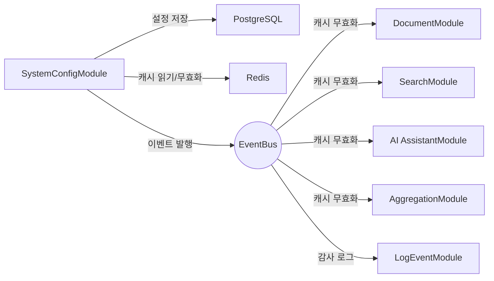

# SystemConfig 모듈 상세 설계

| 항목 | 값 |
|------|---|
| 모듈명 | SystemConfigModule |
| 문서 코드 | MS-SYS |
| 상태 | `draft` |
| 기능정의서 | [FD-SYS-시스템설정](../../01-requirements/features/FD-SYS-시스템설정.md) |
| 데이터 모델 | [system-config data.md](./data.md) |

---

## 모듈 책임

| 구분 | 책임 |
|------|------|
| **설정 CRUD** | 카테고리별 그룹핑 조회, 개별 설정 변경 |
| **변경 전파** | DB 커밋 후 EventBus로 `system_config.changed`를 발행(Best-effort)하여 소비 모듈의 캐시를 무효화 |
| **DB 시딩** | 앱 최초 배포 시 `lm:`/`pm:` 항목을 upsert-if-absent로 시딩 |

> AdminModule의 관리자 대시보드와 분리하여 설정 도메인의 독립적 변경을 보장한다.

---

## 핵심 엔티티

| 엔티티 | 설명 | 상세 |
|--------|------|------|
| SystemConfig | 시스템 설정 항목 — `id`(PK), `config_key`(UNIQUE), category, config_value(jsonb), value_type, description, updated_by, updated_at, created_at | [data.md](./data.md) |

---

## 의존 관계

| 방향 | 대상 | 의존 유형 | 설명 |
|------|------|----------|------|
| SysConf → PostgreSQL | 인프라 | DI | SystemConfig CRUD |
| SysConf → Redis | 인프라 | DI | 설정값 읽기 캐시 (`cache:syscfg:{config_key}`) |
| SysConf → EventBus | 인프라 | DI | `system_config.changed` 이벤트 발행 (Best-effort) |

> **독립 모듈**: SystemConfigModule은 다른 도메인 모듈에 대한 DI 의존이 없다 ([02-module-architecture.md §3.3.1](../../02-architecture/02-module-architecture.md) 참조).

---

## 인프라 사용 요약

| 인프라 | 용도 |
|--------|------|
| **PostgreSQL** | SystemConfig 엔티티 저장 |
| **Redis** | 설정값 읽기 캐시 (`{tenant_id}:cache:syscfg:{config_key}`, TTL 1시간) |
| **EventBus** | `system_config.changed` 이벤트 발행 (Best-effort 티어) |

> BullMQ 큐는 사용하지 않는다 — 설정 변경 이벤트는 Best-effort 티어로 EventBus를 통해 발행한다. 전달은 Best-effort이며, BR-SYS-002의 재시도·TTL 폴백·알림으로 운영 품질을 보강한다.

---

## 관련 문서

| 문서 | 설명 |
|------|------|
| [FD-SYS-시스템설정](../../01-requirements/features/FD-SYS-시스템설정.md) | 기능 요구사항 원본 |
| [02-module-architecture](../../02-architecture/02-module-architecture.md) | 모듈 분류, 의존성 매트릭스, EventBus 매트릭스 |
| [04-permission-architecture](../../02-architecture/04-permission-architecture.md) | 관리 자원 권한 체계 (`manage_system`) |
| [05-async-event-architecture](../../02-architecture/05-async-event-architecture.md) | 이벤트 티어 분리 (Best-effort) |
| [08-cache-architecture](../../02-architecture/08-cache-architecture.md) | 캐시 키/TTL/무효화 전략 |
| [data/aicm/redis.md](../../02-architecture/data/aicm/redis.md) | Redis 키 패턴 원천 |
