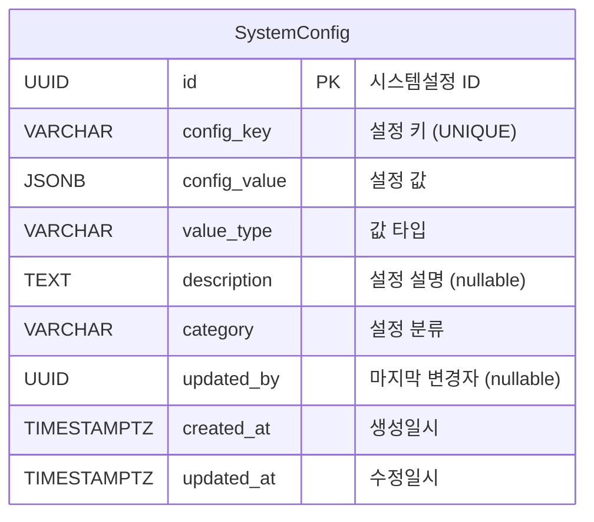

# SystemConfig 데이터 모델

> 참조: [FD-SYS-시스템설정](../../01-requirements/features/FD-SYS-시스템설정.md) · [data/aicm/rdb.md](../../02-architecture/data/aicm/rdb.md)

---

## 엔티티 관계도

---

## §1. SystemConfig

| 필드 | 타입 | 제약 | 설명 |
|------|------|------|------|
| id | UUID | PK | 시스템설정 ID |
| config_key | VARCHAR | NOT NULL, UNIQUE | 설정 키 (`{scope}:{module}.{name}` 형식) |
| config_value | JSONB | NOT NULL | 설정 값 |
| value_type | VARCHAR | NOT NULL | 값 타입: number\|string\|boolean\|object\|array |
| description | TEXT | NULL | 설정 설명 |
| category | VARCHAR | NOT NULL | 설정 분류 |
| updated_by | UUID | NULL | 마지막 변경자 (시딩 시 NULL) |
| created_at | TIMESTAMPTZ | NOT NULL | 생성일시 |
| updated_at | TIMESTAMPTZ | NOT NULL | 수정일시 |

**인덱스:**
- `UQ_system_config_key` — UNIQUE(config_key)
- `IDX_system_config_category` — (category)

> **동시성 제어**: Last-Write-Wins(LWW) — 설정 변경 빈도가 낮고 관리자 수가 적어 낙관적 동시성 제어(OCC) 불필요. FD-SYS §10.3 참조.
