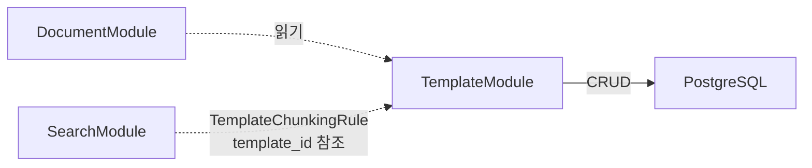

# Template 모듈 상세 설계

| 항목 | 값 |
|------|---|
| 모듈명 | TemplateModule |
| 문서 코드 | MS-TPL |
| 상태 | `draft` |
| 기능정의서 | [FD-DOC-문서관리 §4](../../01-requirements/features/FD-DOC-문서관리.md) |
| 데이터 모델 | [data.md](./data.md) |

---

## 모듈 책임

| 구분 | 책임 |
|------|------|
| **TemplateModule** | 템플릿 CRUD, 복제(clone), 비활성 처리, 보일러플레이트 관리 |

> 템플릿은 문서의 초기 본문 구조(보일러플레이트)와 기본 태그를 사전 정의하여 일관된 문서 작성을 유도한다 — "쓰면 편한 시작점"이지 강제 사항이 아니다 (BR-TPL-006). 게시판 × 템플릿 연결(`Board.default_template_id`)은 BoardModule 소관, 문서 × 템플릿 참조(`Document.template_id`)는 DocumentModule 소관이다. 승인 라인 템플릿(`ApprovalLineTemplate`)은 ApprovalModule 소관이며 본 모듈과 무관하다.

---

## 핵심 엔티티

| 엔티티 | 설명 | 상세 |
|--------|------|------|
| Template | 문서 초기 본문 구조(보일러플레이트)와 기본 태그를 사전 정의한 불변 엔티티. 여러 게시판에서 재사용 가능 | [data.md](./data.md) |

---

## 의존 관계

| 방향 | 대상 | 의존 유형 | 설명 |
|------|------|----------|------|
| Template → PostgreSQL | 인프라 | DI | Template 엔티티 저장/조회 |
| Template ← DocumentModule | 소비자 | DI 읽기 | 문서 생성 시 템플릿 구조 조회 |
| Template ← SearchModule | 소비자 | 데이터 참조 | TemplateChunkingRule에서 template_id 참조 (청킹 전략 분기) |

> **독립 모듈**: TemplateModule은 다른 도메인 모듈을 DI 의존하지 않는다 ([02-module-architecture.md](../../02-architecture/02-module-architecture.md) §3.2.2 참조).

---

## 인프라 사용 요약

| 인프라 | 용도 |
|--------|------|
| **PostgreSQL** | Template 엔티티 저장/조회 |

> Redis, BullMQ, Elasticsearch, MinIO, EventBus 미사용. 템플릿은 변경 빈도가 매우 낮고(불변 엔티티) 관리자 전용이므로 캐시 불필요.

---

## 관련 문서

| 문서 | 설명 |
|------|------|
| [FD-DOC-문서관리 §4](../../01-requirements/features/FD-DOC-문서관리.md) | 기능 요구사항 원본 (템플릿 섹션) |
| [02-module-architecture](../../02-architecture/02-module-architecture.md) | 모듈 의존성 매트릭스, 인프라 요약 |
| [04-permission-architecture](../../02-architecture/04-permission-architecture.md) | AdminPermission `manage_templates` 정의 |
| [rdb.md](../../02-architecture/data/aicm/rdb.md) | Template 엔티티 DDL |
