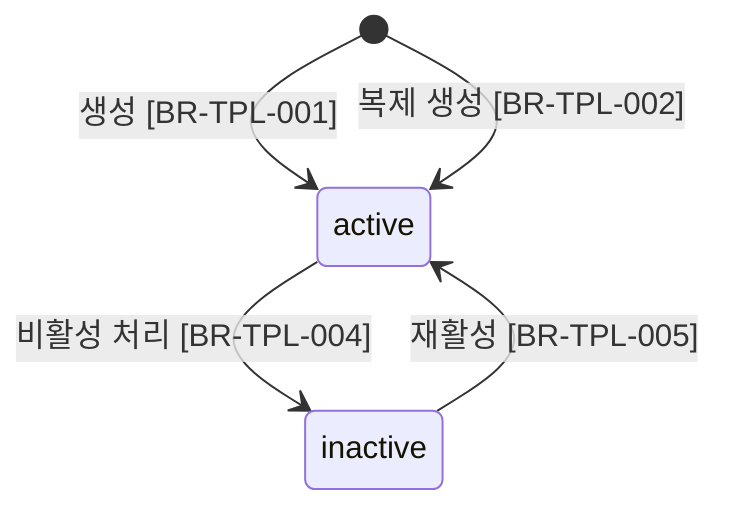

# Template 비즈니스 규칙

> 참조: [FD-DOC-문서관리 §4](../../01-requirements/features/FD-DOC-문서관리.md) · [api.md](./api.md) · [data.md](./data.md) · [04-permission-architecture](../../02-architecture/04-permission-architecture.md)

---

## 1. 상태 전이

### 1.1 Template 생명주기

> Template은 `is_active` boolean 필드로 상태를 관리한다. 별도 status enum 없이 active/inactive 2상태만 존재한다.

---

## 2. 규칙 카탈로그

### 생성 / 복제

#### BR-TPL-001: 템플릿 생성

- **트리거**: `POST /admin/templates` 요청
- **조건**: 요청 본문에 필수 필드 존재
- **동작**: 새 Template 생성 — `id` 자동 발급, `is_active = true`, `created_by = 요청자 userId`. `name`과 `contentBlocks`는 필수, `description`·`category`·`defaultTags`는 선택
- **위반 시**: `name` 누락 또는 `contentBlocks`가 빈 배열이면 `TPL_VALIDATION_ERROR`(422)

#### BR-TPL-002: 템플릿 복제(Clone)

- **트리거**: `POST /admin/templates/:id/clone` 요청
- **조건**: 원본 템플릿 존재 (is_active 무관 — 비활성 템플릿도 복제 가능)
- **동작**: 원본의 `description`, `category`, `contentBlocks`, `defaultTags`를 복사하여 새 Template 생성. `name`은 요청 본문에서 필수로 받음. 나머지 필드는 요청 본문에 포함된 경우 오버라이드, 미포함 시 원본 값 사용. 새 `id` 발급, `is_active = true`, `created_by = 요청자 userId`
- **위반 시**: 원본 미존재 시 `TPL_NOT_FOUND`(404), `name` 누락 시 `TPL_VALIDATION_ERROR`(422)

#### BR-TPL-003: 템플릿 불변 원칙

- **트리거**: 템플릿 콘텐츠 수정 시도
- **조건**: 항상
- **동작**: 생성된 템플릿의 `name`, `description`, `category`, `contentBlocks`, `defaultTags`는 수정 불가. 변경이 필요하면 복제(BR-TPL-002)하여 새 템플릿을 생성한다. `is_active`만 상태 토글 API(BR-TPL-004, BR-TPL-005)로 변경 가능
- **위반 시**: 해당 없음 — 수정 API 자체를 제공하지 않아 구조적으로 불가

> **설계 근거** (FD-DOC §4 결정 사항): 템플릿 본문이 변경되면 사실상 다른 템플릿이므로, 버전 관리 대신 clone이 개념적으로 정확하고 구현 복잡도가 낮다.

### 상태 전환

#### BR-TPL-004: 비활성 처리

- **트리거**: `PATCH /admin/templates/:id/status` 요청 (`isActive: false`)
- **조건**: 대상 템플릿이 현재 `is_active = true`
- **동작**: `is_active = false`, `updated_at` 갱신. 새 문서 생성 시 사용자 선택 목록에서 제외. 기존 문서의 `template_id` 참조는 유지 — 기존 문서 열람 시 템플릿 정보 정상 반환. 게시판의 `default_template_id`가 해당 템플릿인 경우 BoardModule에서 별도 처리 (TemplateModule 소관 외)
- **위반 시**: 이미 `is_active = false`이면 `TPL_ALREADY_INACTIVE`(409)

#### BR-TPL-005: 재활성 처리

- **트리거**: `PATCH /admin/templates/:id/status` 요청 (`isActive: true`)
- **조건**: 대상 템플릿이 현재 `is_active = false`
- **동작**: `is_active = true`, `updated_at` 갱신. 사용자 선택 목록에 다시 노출
- **위반 시**: 이미 `is_active = true`이면 `TPL_ALREADY_ACTIVE`(409)

### 조회 / 접근

#### BR-TPL-006: 활성 템플릿만 사용자 노출

- **트리거**: `GET /templates`, `GET /templates/:id` 요청 (사용자 조회 API)
- **조건**: 항상
- **동작**: `is_active = true`인 템플릿만 반환. 비활성 템플릿은 사용자 조회 API에서 존재하지 않는 것처럼 처리 (`TPL_NOT_FOUND`). 관리 API(`/admin/templates/*`)에서는 비활성 포함 전체 조회 가능
- **위반 시**: 해당 없음

> **FD-DOC §4 [BR-DOC-023]**: 템플릿 선택은 항상 선택적 — 빈 문서로 자유 작성 가능. 이 규칙은 DocumentModule의 문서 생성 API에서 적용되며, TemplateModule에서는 활성 목록 제공만 담당한다.

#### BR-TPL-007: 관리자 권한 필수

- **트리거**: `/admin/templates/*` 엔드포인트 접근
- **조건**: 항상
- **동작**: 유효 역할에 `manage_templates` AdminPermission 필요
- **위반 시**: `ACL_PERMISSION_DENIED`(403)

> 04-permission-architecture §5.3: `manage_templates`는 콘텐츠 인프라 그룹, 위험도 Medium, 범위 Global.
