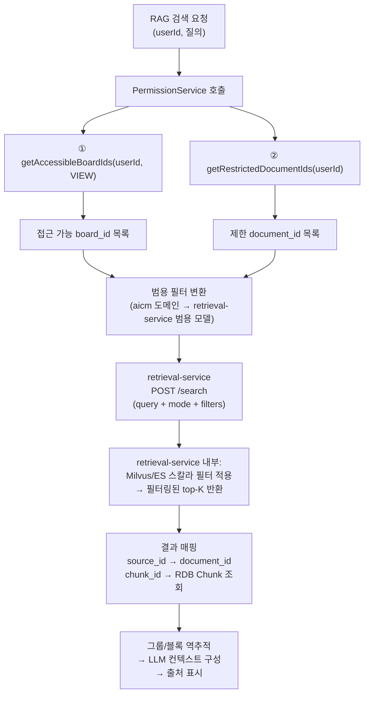

# ADR-003: RAG 검색 권한 필터링을 사후 필터에서 사전 필터로 전환

- **상태**: 승인됨
- **날짜**: 2026-03-24
- **의사결정자**: 개발팀
- **관련 문서**: [03-search.md](../01-requirements/flows/search-rag/03-search.md), [03-auth-architecture.md](../02-architecture/03-auth-architecture.md), [05-external-integration.md](../02-architecture/05-external-integration.md), [retriever/milvus.md](../02-architecture/data/retriever/milvus.md)

---

## 1. 컨텍스트

### 1.1 기존 설계: 키워드 검색은 사전 필터, RAG 검색은 사후 필터

AICM의 검색 권한 필터링은 두 가지 경로로 나뉘어 있었다.

| 검색 모드 | 필터 방식 | 흐름 |
|---|---|---|
| 키워드 검색 (ES `aicm_blocks`) | **사전 필터링** | aicm-service가 ES 쿼리에 `board_id`, `document_id`, `block_id` 필터를 직접 주입 |
| RAG 검색 (시맨틱/하이브리드) | **사후 필터링** | retrieval-service에 필터 없이 위임 → 결과 수신 후 aicm-service에서 제한 항목 제거 |

RAG 검색에서 사후 필터를 선택한 원래 근거는 다음 세 가지였다:

1. retrieval-service는 generic 서비스로 aicm의 권한 모델을 모른다
2. 권한 필터를 retrieval-service에 전달하면 서비스 간 결합도가 높아진다
3. 제한(Restriction)은 극소수이므로 사후 필터링의 결과 손실이 미미하다

### 1.2 사후 필터의 문제점

운영 시나리오를 깊이 검토한 결과, 사후 필터링에 세 가지 구조적 문제가 있다.

| 문제 | 설명 | 심각도 |
|------|------|--------|
| **top-K 결과 고갈** | retrieval-service가 top-10을 반환한 뒤 사후 필터로 3건이 제거되면 7건만 남는다. LLM 컨텍스트가 부족해져 답변 품질이 하락한다 | 높음 |
| **게시판 단위 대량 차단 누락** | board_id 기반 접근 제어는 게시판 내 전체 문서(수천 건)를 차단해야 한다. 사후 필터링에서는 top-K 전부가 접근 불가 게시판 문서일 수 있으며, 결과가 0건이 된다 | 높음 |
| **불필요한 스코어링 낭비** | 접근 불가한 문서의 벡터 유사도를 계산하고 RRF 합산까지 수행한 뒤 버리는 것은 연산 낭비이다 | 중간 |

특히 **board_id 필터링**이 핵심이다. Restriction(문서/블록 단위 제한)은 "극소수"라는 전제가 성립하더라도, 게시판 접근 제어는 사용자마다 접근 가능 게시판 목록이 다르며 전체 데이터의 상당 비율을 차지한다. 이를 사후에 필터링하면 검색 결과 품질이 보장되지 않는다.

### 1.3 문서 간 불일치

설계 문서 사이에도 불일치가 존재했다:

- `retriever/milvus.md`: "검색 쿼리 실행 전에 … 필터를 검색 엔진에 전달한다" — **사전 필터를 기술**
- `03-search.md` 6.2절: "retrieval-service 결과 수신 후 제한 항목 제거" — **사후 필터를 기술**
- `03-auth-architecture.md` 5.6절: "RAG: retrieval-service 결과 수신 후 필터링" — **사후 필터를 기술**

동일한 시스템에 대해 서로 다른 필터 전략을 기술하고 있어, 이를 하나로 통일할 필요가 있다.

---

## 2. 결정

### 2.1 RAG 검색도 사전 필터링으로 전환

키워드 검색과 RAG 검색 모두 **사전 필터링(pre-filtering)** 방식으로 통일한다. aicm-service가 PermissionService에서 조회한 권한 정보를 retrieval-service의 범용 필터 파라미터로 변환하여 검색 API 호출 시 전달한다.

### 2.2 retrieval-service 검색 API에 범용 필터 파라미터 도입

retrieval-service는 aicm 도메인 모델을 알지 않으며, 자체 범용 모델(`source_id`, `item_id`, `source_metadata`)로만 필터를 수용한다.

```typescript
interface SearchHybridRequest {
  query: string;
  namespace: string;
  mode: 'semantic' | 'hybrid';
  top_k?: number;
  threshold?: number;
  filters?: {
    must?: {
      source_metadata?: Record<string, string[]>;
    };
    must_not?: {
      source_ids?: string[];
    };
  };
}
```

aicm-service의 매핑:

| aicm 권한 정보 | retrieval-service 필터 파라미터 | Milvus/ES 적용 |
|---|---|---|
| 접근 가능 `board_id` 목록 | `filters.must.source_metadata.board_id` | `board_id IN [...]` |
| 제한 `document_id` 목록 | `filters.must_not.source_ids` | `document_id NOT IN [...]` |

### 2.3 변경 후 RAG 검색 흐름



---

## 3. 근거

### 3.1 인프라가 이미 사전 필터를 지원한다

Milvus `kms_chunks`에 `document_id`, `block_id`, `board_id` 필드와 STL_SORT 스칼라 인덱스가 설계되어 있다. ES `aicm_chunks`에도 동일 필드가 keyword 타입으로 매핑되어 있다. 사전 필터를 위한 스키마/인덱스 변경이 **전혀 불필요**하다.

### 3.2 범용 필터 인터페이스로 결합도를 최소화한다

기존 사후 필터 선택의 핵심 근거는 "서비스 간 결합도"였다. 범용 필터 인터페이스(`source_ids`, `item_ids`, `source_metadata`)를 사용하면 retrieval-service는 aicm의 권한 모델(BoardPermission, DocumentRestriction)을 전혀 알 필요가 없다. 결합도 증가 없이 사전 필터링이 가능하다.

### 3.3 board_id 사전 필터가 가장 큰 성능 효과를 낸다

게시판 접근 제어는 사용자마다 접근 가능 게시판 목록이 다르며, 게시판 하나에 수백~수천 건의 문서가 포함된다. board_id를 사전에 필터하면 검색 대상 자체가 대폭 축소되어 top-K 정확도와 검색 성능이 동시에 개선된다.

### 3.4 "Restriction은 극소수" 전제에 의존하지 않는다

사후 필터의 전제("제한 건수가 극소수이므로 결과 손실이 미미")는 향후 운영 상황에 따라 깨질 수 있다. 사전 필터링은 제한 건수와 무관하게 항상 정확한 top-K를 보장하므로, 운영 리스크를 제거한다.

### 3.5 키워드 검색과 RAG 검색의 필터 전략이 통일된다

두 검색 모드가 동일한 사전 필터 패턴을 사용하므로, PermissionService의 필터 구성 로직을 한 번만 작성하면 된다. 유지보수성과 코드 일관성이 개선된다.

---

## 4. 영향

### 4.1 문서 갱신

| 문서 | 변경 내용 |
|------|----------|
| [03-search.md](../01-requirements/flows/search-rag/03-search.md) | 2절 흐름 다이어그램, 4절 시맨틱 검색 흐름, 5절 하이브리드 검색 흐름, 6절 권한 필터 전략 전면 재구성, 7절 역추적 흐름에서 사후 필터 단계 제거 |
| [03-auth-architecture.md](../02-architecture/03-auth-architecture.md) | 5.6절 검색/RAG 권한 필터 — RAG도 사전 필터로 변경, 다이어그램/표/PermissionService 인터페이스 수정 |
| [05-external-integration.md](../02-architecture/05-external-integration.md) | 7.3절 retrieval-service 검색 API에 `SearchHybridRequest`/`SearchHybridResponse` 인터페이스 추가 |
| [retriever/milvus.md](../02-architecture/data/retriever/milvus.md) | "제한 필터" 설명에 aicm-service → retrieval-service API 경유 흐름 명시 |
| [retriever/es.md](../02-architecture/data/retriever/es.md) | 하이브리드 검색 시 사전 필터 적용 방식 추가 |
| [retriever/README.md](../02-architecture/data/retriever/README.md) | 검색 모드 설명에 필터 파라미터 적용 언급 추가 |
| [00-overview.md](../02-architecture/data/README.md) | 3절 검색 결과 반환 전략 정합성 수정 |
| [search-rag/README.md](../01-requirements/flows/search-rag/README.md) | 파이프라인 조감도 다이어그램 — 권한 필터 노드 위치 조정 |

### 4.2 코드 영향

| 영역 | 영향 |
|------|------|
| retrieval-service 검색 API | `POST /search` 엔드포인트에 `filters` 파라미터 추가, Milvus/ES 쿼리 빌더에 스칼라 필터 주입 로직 |
| aicm-service `SearchModule` | `RagSearchService`에서 PermissionService 호출 → 범용 필터 변환 → retrieval-service 호출 시 filters 전달. 기존 사후 필터 로직 제거 |
| aicm-service `RetrievalServiceClient` | 검색 요청 인터페이스에 `filters` 필드 추가 |
| PermissionService | `getRestrictedBlockIds` 제거됨 (ADR-012). `getAccessibleBoardIds`, `getRestrictedDocumentIds`만 사용 |
