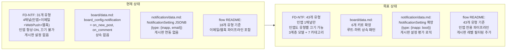
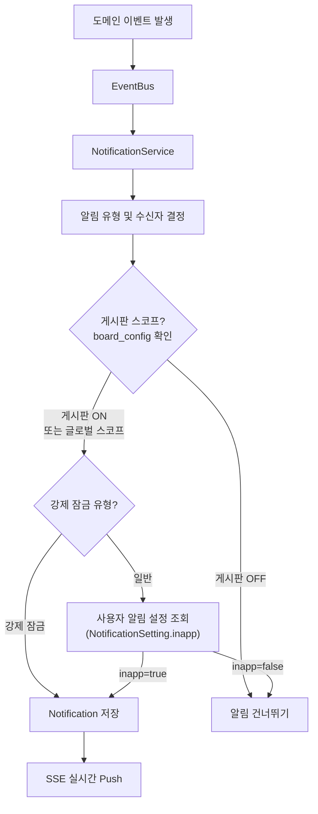

# 알림 설정 아키텍처 실제 설계 문서 반영

## 현재 상태 vs 목표 상태




## 핵심 제약 조건

- **인앱만 지원** -- 이메일, WebPush, 웹훅은 Phase 2로 미룸
- **인앱도 유형별 끄기 가능** -- 기본값은 전부 `true`. 강제 잠금 유형은 예외
- 기존 BR-NTF-003 "인앱은 사용자가 끌 수 없다" 규칙 변경 필요

---

## 변경 대상 및 세부 내용

### 1. FD-NTF-알림.md (가장 큰 변경)

[FD-NTF-알림.md](docs/01-requirements/features/FD-NTF-알림.md) -- 현재 626줄

**s1.1 알림 유형 테이블**: 31개 -> 43개

- #32~#43 추가 (gap-analysis 기준): 승인자 부재, 위임 설정/해제, 긴급 발행, 댓글 해결됨, 신고 접수, 자동 블라인드, 역할 잠금, 역할/권한 변경, 보안 이상 징후, 인덱스 재구성 완료/실패, 구독 게시판 삭제
- 각 유형에 **카테고리**(A~G), **스코프**(게시판/글로벌), **강제 잠금** 여부 컬럼 추가

**s1.2 알림 채널**: 4채널 -> 1채널

- 이메일, WebPush, 웹훅 행을 "Phase 2 (미지원)" 표시
- "사용자 비활성화" 컬럼에서 인앱을 `X` -> `O (유형별, 기본값 true)`로 변경

**s1.3 알림 우선순위**: #32~#43 우선순위 배정 추가

**s2 비즈니스 규칙**:


| BR              | 현재                            | 변경                                                                     |
| --------------- | ----------------------------- | ---------------------------------------------------------------------- |
| BR-NTF-003      | 인앱 항상 발송, 사용자 비활성화 불가         | 인앱도 유형별 사용자 설정 가능 (기본 true). 강제 잠금 유형은 예외                              |
| BR-NTF-004      | 근무 시간외 이메일/WebPush 보류, 인앱 누적  | 근무 시간외 인앱 알림은 계속 누적 (변경 없음). 이메일/WebPush 관련 문구 제거                      |
| BR-NTF-005      | 일시 중지 시 이메일/WebPush 보류        | 인앱 관련만 유지 (인앱은 일시 중지 중에도 누적)                                           |
| BR-NTF-010      | 이메일 3회, WebPush 2회, 웹훅 5회 재시도 | 인앱은 재시도 불필요. Phase 2까지 이 규칙 비활성 표시                                     |
| (신규) BR-NTF-012 | --                            | **게시판 알림 설정 규칙**: 게시판 스코프 알림은 `board_config.notification` 키로 활성/비활성 제어 |
| (신규) BR-NTF-013 | --                            | **게시판 상속 규칙**: 하위 게시판이 자체 설정을 명시하지 않으면 루트 게시판 설정 상속                    |
| (신규) BR-NTF-014 | --                            | **3계층 설정 평가 규칙**: 시스템(강제 잠금) > 게시판(스코프별 on/off) > 개인(유형별 inapp on/off) |
| (신규) BR-NTF-015 | --                            | **카테고리 세트 설정 규칙**: 7개 카테고리 단위로 묶어 설정하되 펼쳐서 개별 미세 조정                    |


**s3 데이터 모델**:

- `NotificationPreference`: `email_enabled`, `web_push_enabled`, `webhook_enabled`, `webhook_url` 제거. `inapp_enabled` (BOOLEAN, DEFAULT true) 추가
- `NotificationDispatch`: channel ENUM에서 `email`, `web_push`, `webhook` 제거, `in_app`만 유지. (또는 Phase 1에서 NotificationDispatch 자체를 단순화 -- 인앱은 생성 즉시 전달이므로 별도 dispatch 추적 불필요할 수 있음)
- `Notification.type` CHECK: 31종 -> 43종

**s3.5 API/DTO**:

- `NotificationPreferenceDto`: email/webpush/webhook 필드 제거, `inapp_enabled` 추가
- `PUT /api/notifications/preferences`: inapp_enabled만 토글
- 웹훅 관련 API 5개 (GET/POST/PUT/DELETE webhooks, POST test) Phase 2 표시

**s5 설정 가능 항목**: 이메일/WebPush/웹훅 재시도 설정 Phase 2 표시

**s6 이벤트 계약**: #32~#43에 대응하는 소비 이벤트 12건 추가

**s7 에러 코드**: NTF-005(이메일 실패), NTF-006(WebPush 실패), NTF-007(웹훅 검증), NTF-008(웹훅 실패), NTF-016(WebPush 실패) Phase 2 표시

**s8 비기능 요구사항**: s8.2 이메일 발송 SLA Phase 2 표시

**결정 사항 테이블**: 채널 수 4 -> "Phase 1: 인앱 1채널, Phase 2: +이메일+WebPush+웹훅" 변경

---

### 2. board/data.md

[board/data.md](docs/03-module-design/board/data.md) -- s2.1 Board 엔티티의 `board_config.notification`

**현재** (2개 키):

```jsonc
"notification": {
  "on_new_post": true,
  "on_comment": true
}
```

**변경** (6개 키 + 설계 결정 추가):

```jsonc
"notification": {
  "on_comment": true,          // #1, #2, #36
  "on_report_resolved": true,  // #3
  "on_approval": true,         // #6~#11
  "on_delegation": true,       // #33, #34
  "on_new_post": true,         // #4
  "on_expiry": true            // #19
}
```

추가할 설계 결정 섹션:

- **게시판 알림 상속** -- 루트 게시판에서 설정한 notification 키가 하위 게시판의 디폴트가 된다. 하위 게시판이 해당 키를 명시적으로 설정하면 오버라이드. `approval_required`/`mandatory_approval_config` 상속과 유사한 선택적 오버라이드
- `getNotificationConfig(board)` 의사코드: 시스템 디폴트 < 루트 설정 < 자체 설정 merge

---

### 3. notification/data.md

[notification/data.md](docs/03-module-design/notification/data.md)

**s2.1 Notification**: type 유형 목록 43종으로 확장

**s2.3 NotificationSetting**: settings JSONB 구조 변경

현재:

```json
{ "comment_on_my_doc": { "inapp": true, "email": false } }
```

변경:

```json
{ "comment_on_my_doc": { "inapp": true } }
```

설계 결정에 추가: "이메일/WebPush/웹훅 필드는 Phase 2에서 추가 예정. 현재는 inapp만 저장"

---

### 4. notification flow README

[notification flow README](docs/01-requirements/flows/notification/README.md)

- s2 기능정의서 참조: 18개 -> 43개 유형 테이블 갱신
- s3 파이프라인 조감도: 이메일/웹훅 경로 제거, 게시판 설정 체크 단계 추가

변경될 파이프라인:




- s4 이벤트 소스별 트리거 매핑: #32~#43 추가
- s5 채널 분기 흐름: 이메일/웹훅 분기 제거, 게시판 설정 + 개인 설정 체크로 변경
- s6 묶음 알림: 이메일 다이제스트 관련 제거

---

### 5. temp/notification-settings-architecture.md

[temp 문서](docs/temp/notification-settings-architecture.md)

- 채널 관련 내용을 인앱 전용으로 수정
- 4.x 매트릭스에서 이메일/WebPush 컬럼 제거, 인앱 제어(사용자 끄기 가능/불가) 컬럼으로 단순화
- s6 UI 와이어프레임에서 이메일/WebPush 토글 제거
- s7 설정 평가 의사코드에서 channel 분기 제거, inapp 단일 경로로 단순화

---

## 변경하지 않는 것

- `notification/rules.md`, `notification/events.md`, `notification/api.md`, `notification/schedule.md` -- 현재 대부분 TODO/스켈레톤 상태. 이번 범위에서는 FD-NTF와 flow README를 먼저 확정하고, 모듈 상세 설계는 별도 작업으로 분리
- 다른 FD 문서들 (FD-APR, FD-COM 등) -- 이벤트 발행 정의는 각 모듈 소유. 이번에는 알림 소비 측만 갱신

---

## 작업 순서

FD-NTF가 모든 하위 문서의 기준이 되므로 먼저 확정하고, 이후 모듈 설계와 flow를 순서대로 수정한다.