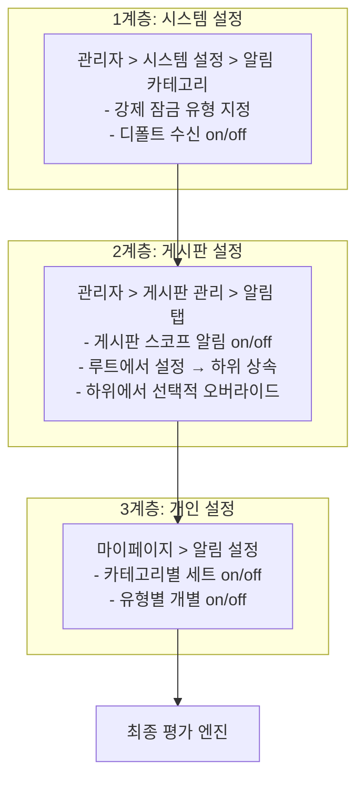

# 알림 설정 제어 아키텍처

> 37개 알림 유형에 대해 **어디서, 누가, 어떻게 제어하는가**를 정의한다.
>
> | 항목 | 값 |
> |------|-----|
> | 작성일 | 2026-04-03 |
> | 선행 문서 | [notification-type-gap-analysis.md](notification-type-gap-analysis.md) — 원본 43개 유형 전수 목록 (6개 토스트/대체 UI 전환) |
> | 기준 문서 | FD-NTF v3.1, FD-ADM, FD-SYS, UC-PER-02, board/data.md |
> | 채널 전제 | **Phase 1은 인앱(In-App) 알림만 지원**. 이메일/WebPush/웹훅은 Phase 2 이후 확장 |

---

## 1. 설계 원칙

### 1.1 핵심 문제

37개 알림 유형을 개별적으로 껐다 켜는 것은 사용자에게 인지 부하가 크다. 동시에, "검색 인덱스 재구성 완료"와 "내 문서에 댓글" 알림은 제어하는 사람·범위·화면이 근본적으로 다르다.

### 1.2 설계 방향

1. **카테고리 + 확장(drill-down)** — 7개 카테고리로 묶어 세트 설정하되, 펼쳐서 개별 미세 조정
2. **3계층 설정 모델** — 시스템(관리자) > 게시판(관리자) > 개인(사용자) 순서로 평가
3. **게시판 상속** — 루트 게시판에서 디폴트를 설정하고, 하위 게시판이 선택적으로 오버라이드
4. **강제 잠금** — 컴플라이언스/보안 목적의 알림은 관리자가 잠그고 사용자가 끌 수 없게
5. **인앱 단일 채널** — Phase 1은 인앱만 지원. 채널 분기 없이 **수신 여부(on/off)**만 제어

---

## 2. 3계층 설정 모델

### 2.1 계층 구조



### 2.2 계층별 역할

| 계층 | 설정 주체 | 설정 범위 | 제어 대상 | 저장소 |
|:----:|----------|----------|----------|--------|
| 1 | 운영 관리자 | 시스템 전체 | 강제 잠금, 디폴트 on/off | `SystemConfig` (`notification.*` 키) |
| 2 | 운영 관리자 | 게시판 단위 | 게시판 스코프 알림 on/off | `Board.board_config.notification` |
| 3 | 일반 사용자 | 본인 | 유형별 수신 on/off | `NotificationSetting` |

### 2.3 우선순위 규칙

```
최종 판정 = evaluate(시스템, 게시판, 개인)

규칙 1: 시스템에서 강제 잠금(is_admin_forced=true)이면 → 무조건 수신, 개인 설정 무시
규칙 2: 게시판에서 해당 알림이 OFF이면 → 해당 게시판에서는 알림 미발생 (개인 설정 무관)
규칙 3: 개인 설정에서 OFF이면 → 알림 미수신
```

---

## 3. 알림 카테고리 (7개 그룹)

### 3.1 카테고리 정의

37개 유형을 설정 UI에서 다루기 위해 7개 카테고리로 묶는다.

| 카테고리 | 설명 | 유형 수 | 제어 스코프 | 사용자 OFF 가능 | 관리자 강제 |
|---------|------|:------:|-----------|:---------:|:---------:|
| **A. 댓글/커뮤니티** | 내 문서·댓글 관련 피드백 | 5 | 게시판 | O | 부분 |
| **B. 승인/배포** | 승인 요청·결과·위임·예약배포 | 10 | 게시판 | O | 부분 |
| **C. 문서 관리** | 구독·공통컨텐츠·드래프트·유효기간 | 5 | 혼합 | O | 부분 |
| **D. 공지사항** | 공지 게시·수정·읽음확인 | 3 | 글로벌 | X (잠금) | 전체 |
| **E. AI/검색/임베딩** | 임베딩 실패·인덱스·재임베딩 | 3 | 글로벌 | O | 부분 |
| **F. 시스템/모니터링** | 장애·임계치·에스컬레이션·유지보수 | 8 | 글로벌 | X (관리자 전용) | 전체 |
| **G. 권한/보안** | 역할 변경·잠금·보안 이벤트 | 3 | 글로벌 | X (잠금) | 전체 |

### 3.2 카테고리별 세트 제어 동작

사용자가 카테고리 레벨에서 수신을 끄면, 해당 카테고리에 속한 모든 유형이 꺼진다. 이후 펼쳐서 특정 유형만 다시 켤 수 있다.

```
[카테고리: 승인/배포]                      수신 [ ON ]  ← 카테고리 레벨 세트 토글
  ├ #6  새 승인 요청 도착                  [ ON ]
  ├ #7  승인됨/반려됨                     [ ON ]
  ├ #8  미처리 리마인더                    [ OFF ]  ← 개별 오버라이드
  ├ #9  철회 알림                         [ ON ]
  ├ #10 CC 지정/상태 변경                  [ OFF ]  ← 개별 오버라이드
  ├ #11 예약배포 완료/실패                  [ ON ]
  ├ #32 승인자 부재                        [ ON ]   🔒 관리자 강제
  ├ #33 위임 설정                         [ ON ]
  ├ #34 위임 해제                         [ ON ]
  └ #35 긴급 발행                         [ ON ]   🔒 관리자 강제
```

### 3.3 토스트/대체 UI 전환 유형 (6개)

원본 43개에서 아래 6개를 알림 시스템(인박스·설정 제어)에서 제외하고 경량 UI로 대체한다.

| 원본 # | 알림 유형 | 대체 방식 | 근거 |
|:------:|----------|----------|------|
| 13 | 임베딩 완료 묶음 | **토스트** | 정보성. 문서 발행 후 자동 처리 완료 안내. 검색 시 자연 발견 가능. 실패(#14)는 알림 유지 |
| 17 | AI 요약 완료/실패 | **토스트** | 사용자 요청 → 문서 페이지에 결과 즉시 반영. 재방문 시 이미 표시됨 |
| 18 | AI 쿼터 임박/초과 | **제거** | LLM 오케스트레이터가 자체 쿼터 관리·알림 담당. 알림 시스템 범위 밖 |
| 22 | 지표 정상 복귀 | **대시보드 상태 배지** | 장애(#21) 인지 후 모니터링 대시보드에서 상태 전환(빨강→초록)으로 자연 확인 |
| 27 | 유지보수 모드 종료 | **시스템 배너** | 사용자 접속 시 서비스 정상 운영 확인 가능. 시작(#26)은 사전 안내로 유지 |
| 36 | 댓글 해결됨 | **토스트 + 댓글 UI 상태** | 정보성. 문서 재방문 시 댓글에 `resolved` 상태 표시됨 |

---

## 4. 37개 유형 상세 제어 매트릭스

### 4.1 카테고리 A: 댓글/커뮤니티 (5개)

| # | 알림 유형 | 스코프 | 관리 화면 | 사용자 OFF | 강제 잠금 | 게시판 상속 |
|:---:|---------|:-----:|---------|:--------:|:-------:|:---------:|
| 1 | 내 문서에 댓글 | 게시판 | 게시판 > 알림 탭 | O | X | O |
| 2 | 내 댓글에 대댓글 | 게시판 | 게시판 > 알림 탭 | O | X | O |
| 3 | 내 문서가 신고 처리됨 | 게시판 | 게시판 > 알림 탭 | X | 강제 | O |
| 37 | 신고 접수 (관리자) | 글로벌 | 시스템 설정 > 알림 | X | 강제 | X |
| 38 | 자동 블라인드 (관리자) | 글로벌 | 시스템 설정 > 알림 | X | 강제 | X |

**설명**: #1, #2는 사용자가 마이페이지에서 끌 수 있다. #3은 신고 처리 결과이므로 강제 수신. #37, #38은 관리자 전용. 게시판 관리자가 `board_config.notification.on_comment = false`로 설정하면 해당 게시판에서는 댓글 알림 자체가 미발생. #36(댓글 해결됨)은 토스트로 전환했다(§3.3 참조).

### 4.2 카테고리 B: 승인/배포 (10개)

| # | 알림 유형 | 스코프 | 관리 화면 | 사용자 OFF | 강제 잠금 | 게시판 상속 |
|:---:|---------|:-----:|---------|:--------:|:-------:|:---------:|
| 6 | 새 승인 요청 도착 | 게시판 | 게시판 > 알림 탭 | O | X | O |
| 7 | 승인됨/반려됨 | 게시판 | 게시판 > 알림 탭 | O | X | O |
| 8 | 미처리 리마인더 | 게시판 | 게시판 > 알림 탭 | O | X | O |
| 9 | 철회 알림 | 게시판 | 게시판 > 알림 탭 | O | X | O |
| 10 | CC 지정/상태 변경 | 게시판 | 게시판 > 알림 탭 | O | X | O |
| 11 | 예약배포 완료/실패 | 게시판 | 게시판 > 알림 탭 | O | X | O |
| 32 | 승인자 부재 (관리자) | 글로벌 | 시스템 설정 > 알림 | X | 강제 | X |
| 33 | 위임 설정 | 게시판 | 게시판 > 알림 탭 | O | X | O |
| 34 | 위임 해제 | 게시판 | 게시판 > 알림 탭 | O | X | O |
| 35 | 긴급 발행 (관리자) | 글로벌 | 시스템 설정 > 알림 | X | 강제 | X |

**설명**: #6~#11, #33~#34는 게시판 스코프. 루트 게시판에서 `on_approval = true`로 설정하면 하위가 상속. #32(승인자 부재)와 #35(긴급 발행)는 운영 위험/컴플라이언스이므로 관리자 전용 + 강제.

### 4.3 카테고리 C: 문서 관리 (5개)

| # | 알림 유형 | 스코프 | 관리 화면 | 사용자 OFF | 강제 잠금 | 게시판 상속 |
|:---:|---------|:-----:|---------|:--------:|:-------:|:---------:|
| 4 | 구독 게시판 새 문서 | 게시판 | 게시판 > 알림 탭 | O | X | O |
| 12 | 공통컨텐츠 수정/비활성 | 글로벌 | 시스템 설정 > 알림 | O | X | X |
| 16 | 드래프트 장기 방치 | 글로벌 | 시스템 설정 > 알림 | O | X | X |
| 19 | 유효기간 만료 임박/만료 | 게시판 | 게시판 > 알림 탭 | O | X | O |
| 43 | 구독 게시판 삭제 | 글로벌 | — (시스템 자동) | X | 자동 | X |

**설명**: #4, #19는 게시판 종속으로 상속 대상. #12, #16은 시스템 전역. #43은 시스템 자동 발송.

### 4.4 카테고리 D: 공지사항 (3개)

| # | 알림 유형 | 스코프 | 관리 화면 | 사용자 OFF | 강제 잠금 | 게시판 상속 |
|:---:|---------|:-----:|---------|:--------:|:-------:|:---------:|
| 29 | 공지 게시 | 글로벌 | 시스템 설정 + 공지 작성 시 | X | 강제 | X |
| 30 | 공지 수정 재게시 | 글로벌 | 공지 수정 시 `send_update_notification` 토글 | X | 강제 | X |
| 31 | 읽음 확인 요청/리마인더 | 글로벌 | `board_config.notice` 리마인더 설정 | X | 강제 | X |

**설명**: 공지 알림은 전체 강제(BR-NTC-038). 사용자가 끌 수 없다. 마이페이지 알림 설정에 "관리자에 의해 설정됨" 표시와 함께 읽기 전용.

### 4.5 카테고리 E: AI/검색/임베딩 (3개)

| # | 알림 유형 | 스코프 | 관리 화면 | 사용자 OFF | 강제 잠금 | 게시판 상속 |
|:---:|---------|:-----:|---------|:--------:|:-------:|:---------:|
| 14 | 임베딩 실패 | 글로벌 | 시스템 설정 > 알림 | O | X | X |
| 15 | 대량 재임베딩 현황 (관리자) | 글로벌 | 시스템 설정 > 알림 | X | 강제 | X |
| 42 | 인덱스 재구성 완료/실패 (관리자) | 글로벌 | 시스템 설정 > 알림 | X | 강제 | X |

**설명**: #14는 일반 사용자 대상, OFF 가능. #15, #42는 관리자 전용 + 강제. #13(임베딩 완료), #17(AI 요약), #18(AI 쿼터)은 토스트/대체 UI로 전환(§3.3 참조).

### 4.6 카테고리 F: 시스템/모니터링 (8개)

| # | 알림 유형 | 스코프 | 관리 화면 | 사용자 OFF | 강제 잠금 | 게시판 상속 |
|:---:|---------|:-----:|---------|:--------:|:-------:|:---------:|
| 5 | 시스템 공지사항 (레거시) | 글로벌 | 시스템 설정 > 알림 | X | 강제 | X |
| 20 | 지표 임계치 초과 | 글로벌 | 모니터링 > 알림 규칙 | X | 강제 | X |
| 21 | 서비스 장애 | 글로벌 | 모니터링 > 알림 규칙 | X | 강제 | X |
| 23 | 미조치 에스컬레이션 | 글로벌 | 모니터링 > 에스컬레이션 설정 | X | 강제 | X |
| 24 | 자동 조치 실패 | 글로벌 | 모니터링 > 자동 조치 설정 | X | 강제 | X |
| 25 | 용량 소진 사전 경고 | 글로벌 | 모니터링 > 알림 규칙 | X | 강제 | X |
| 26 | 유지보수 모드 시작 | 글로벌 | 모니터링 > 유지보수 설정 | X | 강제 | X |
| 28 | 과다 알림 자동 억제 경고 | 글로벌 | 모니터링 > 알림 규칙 | X | 강제 | X |

**설명**: 모니터링 알림은 **관리자 전용**이며 마이페이지 알림 설정에 표시되지 않는다. 모든 유형이 강제 잠금. #22(지표 정상 복귀)는 대시보드 상태 배지로, #27(유지보수 종료)은 시스템 배너로 전환했다(§3.3 참조).

### 4.7 카테고리 G: 권한/보안 (3개)

| # | 알림 유형 | 스코프 | 관리 화면 | 사용자 OFF | 강제 잠금 | 게시판 상속 |
|:---:|---------|:-----:|---------|:--------:|:-------:|:---------:|
| 39 | 역할 긴급 잠금 | 글로벌 | 시스템 설정 > 알림 | X | 강제 | X |
| 40 | 역할/권한 변경 | 글로벌 | 시스템 설정 > 알림 | X | 강제 | X |
| 41 | 보안 이상 징후 감지 (관리자) | 글로벌 | 시스템 설정 > 알림 | X | 강제 | X |

**설명**: 보안/권한 관련 알림은 전체 강제. 사용자가 끌 수 없다. 마이페이지 알림 설정에는 "관리자에 의해 설정됨" 읽기 전용으로 표시.

---

## 5. 게시판 상속/오버라이드 패턴

### 5.1 상속 대상

37개 유형 중 **게시판 스코프**인 유형만 상속 대상이다.

| 카테고리 | 게시판 상속 대상 유형 |
|---------|-------------------|
| A. 댓글/커뮤니티 | #1, #2, #3 |
| B. 승인/배포 | #6~#11, #33, #34 |
| C. 문서 관리 | #4, #19 |

### 5.2 board_config.notification 확장

기존 `board_config.notification`을 확장하여 카테고리별 디폴트를 설정한다.

```jsonc
{
  "notification": {
    // ── 댓글/커뮤니티 카테고리 ──
    "on_comment": true,           // #1 댓글, #2 대댓글
    "on_report_resolved": true,   // #3 신고 처리됨

    // ── 승인/배포 카테고리 ──
    "on_approval": true,          // #6~#11 승인 관련 전체
    "on_delegation": true,        // #33 위임 설정, #34 위임 해제

    // ── 문서 관리 카테고리 ──
    "on_new_post": true,          // #4 구독 게시판 새 문서
    "on_expiry": true             // #19 유효기간 만료 임박/만료
  }
}
```

### 5.3 상속 평가 로직

하위 게시판이 자체 설정을 명시하지 않으면 루트(또는 가장 가까운 상위) 게시판의 설정을 따른다.

```typescript
function getNotificationConfig(board: Board): NotificationConfig {
  const systemDefaults = {
    on_comment: true,
    on_report_resolved: true,
    on_approval: true,
    on_delegation: true,
    on_new_post: true,
    on_expiry: true
  };

  const root = findRootBoard(board);
  const rootConfig = root.board_config?.notification ?? {};
  const ownConfig = board.board_config?.notification ?? {};

  return { ...systemDefaults, ...rootConfig, ...ownConfig };
}
```

### 5.4 상속 관계 예시

```
[루트 게시판: 고객상담 지식베이스]
  on_comment: true
  on_approval: true
  on_new_post: true
  on_expiry: false          ← 루트에서 유효기간 알림 OFF

  └ [하위 게시판: 보험 상품 안내]
      (자체 설정 없음)        ← 루트 설정 상속: on_expiry = false

  └ [하위 게시판: 규제 문서]
      on_expiry: true        ← 오버라이드: 유효기간 알림 ON (규제 문서는 필수)
```

---

## 6. UI 화면별 설정 범위

### 6.1 관리자 > 시스템 설정 > 알림 (1계층)

관리자가 **시스템 전역** 알림 정책을 설정하는 화면.

**표시 항목**:
- 7개 카테고리를 아코디언으로 표시
- 카테고리마다 포함된 유형 목록을 테이블로 표시
- 유형별로 설정 가능:
  - **강제 잠금**: 토글 — ON이면 사용자가 끌 수 없음
- **관리자 전용 카테고리**(F, G)는 여기서만 설정

```
┌─────────────────────────────────────────┐
│ 시스템 설정 > 알림                         │
├─────────────────────────────────────────┤
│                                         │
│ ▼ A. 댓글/커뮤니티                        │
│  ┌──────────────────┬──────────────────┐│
│  │ 유형             │ 강제 잠금         ││
│  ├──────────────────┼──────────────────┤│
│  │ #1 내 문서에 댓글  │ [ ]              ││
│  │ #2 대댓글         │ [ ]              ││
│  │ #3 신고 처리됨    │ [v]              ││
│  │ #37 신고 접수     │ [v]  관리자 전용   ││
│  │ #38 자동 블라인드  │ [v]  관리자 전용   ││
│  └──────────────────┴──────────────────┘│
│                                         │
│ ► B. 승인/배포                            │
│ ► C. 문서 관리                            │
│ ► D. 공지사항                             │
│ ► E. AI/검색/임베딩                        │
│ ► F. 시스템/모니터링 (관리자 전용)            │
│ ► G. 권한/보안 (관리자 전용)                 │
│                                         │
│ [저장] [초기화]                            │
└─────────────────────────────────────────┘
```

### 6.2 관리자 > 게시판 관리 > 알림 탭 (2계층)

관리자가 **게시판별** 알림 on/off를 설정하는 화면. 게시판 관리 상세 페이지에 알림 탭으로 추가.

**표시 항목**:
- 게시판 스코프 유형만 표시 (카테고리 A, B, C 중 게시판 상속 대상)
- 각 키별 토글: 상속(루트 따름) / ON / OFF
- 루트 게시판이면 "이 설정이 하위 게시판의 기본값이 됩니다" 안내
- 하위 게시판이면 "루트 게시판 설정을 상속 중입니다. 변경하려면 개별 설정하세요" 안내

```
┌──────────────────────────────────────────────────┐
│ 게시판: 규제 문서 (하위 게시판)          [알림] 탭  │
├──────────────────────────────────────────────────┤
│                                                  │
│ ℹ️ 미설정 항목은 루트 "고객상담 지식베이스"의        │
│    설정을 따릅니다.                                │
│                                                  │
│  ┌─────────────────┬────────┬──────────────────┐ │
│  │ 알림 그룹        │ 현재값  │ 루트 디폴트       │ │
│  ├─────────────────┼────────┼──────────────────┤ │
│  │ 댓글 알림        │ [상속]  │ ON               │ │
│  │ 신고 처리 알림    │ [상속]  │ ON               │ │
│  │ 승인 알림        │ [상속]  │ ON               │ │
│  │ 위임 알림        │ [상속]  │ ON               │ │
│  │ 새 문서 알림      │ [상속]  │ ON               │ │
│  │ 유효기간 알림     │ [ ON ] │ OFF  ← 오버라이드 │ │
│  └─────────────────┴────────┴──────────────────┘ │
│                                                  │
│ [저장] [모두 상속으로 초기화]                        │
└──────────────────────────────────────────────────┘
```

### 6.3 마이페이지 > 알림 설정 (3계층)

사용자가 **본인의** 수신 여부를 설정하는 화면.

**표시 항목**:
- 사용자에게 의미 있는 카테고리만 표시 (F 제외 — 관리자 전용)
- 카테고리 단위 세트 토글 + 펼쳐서 개별 유형 토글
- 강제 잠금 유형은 🔒 + "관리자에 의해 설정됨" 표시, 토글 비활성화
- 게시판에서 OFF된 유형은 "(게시판 설정에 의해 비활성)" 안내

```
┌───────────────────────────────────────────┐
│ 마이페이지 > 알림 설정                       │
├───────────────────────────────────────────┤
│                                           │
│ ▼ A. 댓글/커뮤니티                  [ ON ] │
│  ┌──────────────────┬──────┬────────────┐│
│  │ 유형             │ 수신  │ 상태        ││
│  ├──────────────────┼──────┼────────────┤│
│  │ #1 내 문서에 댓글  │ [ON] │            ││
│  │ #2 대댓글         │ [OFF]│            ││
│  │ #3 신고 처리됨    │ [ON] │ 🔒 강제     ││
│  └──────────────────┴──────┴────────────┘│
│                                           │
│ ► B. 승인/배포                      [ ON ] │
│ ► C. 문서 관리                      [ ON ] │
│ ► D. 공지사항           🔒 관리자 설정      │
│ ► E. AI/검색/임베딩                 [ OFF ] │
│ ► G. 권한/보안           🔒 관리자 설정      │
│                                           │
│ [저장]                                     │
└───────────────────────────────────────────┘
```

### 6.4 관리자 > 모니터링 > 알림 규칙 (카테고리 F 전용)

모니터링 알림(#20~#28)은 일반 알림 설정 화면이 아니라 **모니터링 전용 화면**에서 설정한다. 이미 FD-MON의 `AlertRule`로 정의되어 있으며 별도 설계가 불필요하다.

---

## 7. 설정 평가 의사코드

알림 발송 시 NotificationService가 수행하는 최종 평가 로직.

```typescript
function shouldSendNotification(
  notificationType: string,
  recipient: User,
  board?: Board
): boolean {

  // Step 1: 강제 잠금 확인
  const systemConfig = getSystemNotificationConfig(notificationType);
  if (systemConfig.is_admin_forced) {
    return true;
  }

  // Step 2: 게시판 스코프 알림인 경우, 게시판 설정 확인
  if (board && isBoardScoped(notificationType)) {
    const boardConfig = getNotificationConfig(board);  // §5.3의 상속 로직
    const boardKey = getBoardConfigKey(notificationType);
    if (!boardConfig[boardKey]) {
      return false;  // 게시판에서 OFF → 알림 미발생
    }
  }

  // Step 3: 개인 설정 확인
  const userPref = getUserNotificationPreference(recipient.id, notificationType);
  if (userPref === false) {
    return false;  // 사용자가 OFF
  }

  return true;
}
```

---

## 8. 데이터 모델 변경 요약

### 8.1 SystemConfig 추가 키

`notification` 카테고리에 다음 키를 추가한다.

| config_key | 타입 | 기본값 | 설명 |
|------------|------|--------|------|
| `notification.forced_types` | JSONB | `["notice_published","notice_updated",...]` | 강제 잠금 유형 목록 — 사용자가 끌 수 없음 |

### 8.2 board_config.notification 확장

기존 2개 키(`on_new_post`, `on_comment`)에서 6개 키로 확장.

| 키 | 타입 | 기본값 | 커버 유형 |
|----|------|--------|----------|
| `on_comment` | boolean | true | #1, #2 |
| `on_report_resolved` | boolean | true | #3 |
| `on_approval` | boolean | true | #6~#11 |
| `on_delegation` | boolean | true | #33, #34 |
| `on_new_post` | boolean | true | #4 |
| `on_expiry` | boolean | true | #19 |

### 8.3 NotificationSetting 단순화

인앱 단일 채널이므로 유형별 `boolean`으로 단순화.

```jsonc
{
  "comment_on_my_doc": true,
  "comment_reply": false,
  "approval_requested": true,
  // ... 37개 유형. true = 수신, false = 미수신
  "delegation_set": true
}
```

> **Phase 2 확장 시**: `boolean` → `{ "inapp": true, "email": true, "web_push": false }` 구조로 마이그레이션.

---

## 9. 카테고리별 사용자 제어 가능 여부 요약

사용자 입장에서 "내가 무엇을 제어할 수 있는가"를 한눈에 보여주는 요약.

| 카테고리 | 사용자가 OFF 할 수 있는 유형 | OFF 불가 (강제) |
|---------|-------------------------|----------------|
| **A. 댓글/커뮤니티** | #1, #2 | #3(강제), #37/#38(관리자 전용) |
| **B. 승인/배포** | #6~#11, #33, #34 | #32, #35(관리자 전용 + 강제) |
| **C. 문서 관리** | #4, #12, #16, #19 | #43(시스템 자동) |
| **D. 공지사항** | 없음 | 전체 강제 |
| **E. AI/검색/임베딩** | #14 | #15, #42(관리자 전용 + 강제) |
| **F. 시스템/모니터링** | 없음 | 전체 (관리자 전용, 마이페이지 미노출) |
| **G. 권한/보안** | 없음 | 전체 강제 |

---

## 10. 결정사항

| 항목 | 결정 | 근거 |
|------|------|------|
| 지원 채널 | **Phase 1은 인앱(In-App)만** | 채널 분기 복잡도를 제거하고 핵심 로직(계층·상속·강제 잠금)에 집중. 이메일/WebPush는 Phase 2 |
| 설정 단위 | **카테고리 세트 + 개별 drill-down** | 37개를 전부 나열하면 UX 부담. 카테고리 토글로 빠르게 설정하고 필요 시 펼치기 |
| 계층 수 | **3계층** (시스템 > 게시판 > 개인) | `approval_required`/`mandatory_approval_config` 등 게시판 설정과 일관된 상속 패턴. 2계층(글로벌+개인)은 게시판별 차이를 수용 불가 |
| 게시판 상속 방식 | **선택적 오버라이드** (루트 디폴트 + 하위 선택적 재정의) | 게시판 승인·버전 설정의 상속/오버라이드와 동일한 패턴. 알림은 게시판 성격에 따라 달라야 함 |
| 관리자 전용 유형 분리 | **카테고리 F(모니터링)는 마이페이지에 미노출** | 일반 사용자에게 불필요한 항목. 관리자 모니터링 화면에서 별도 관리 |
| 공지/보안 강제 잠금 | **카테고리 D, G는 전체 강제** | FD-NTC BR-NTC-038, FD-ACL BR-ACL-009 근거. 컴플라이언스 요구 |
| 토스트/대체 UI 전환 | **6개 유형 제외** (#13, #17, #18, #22, #27, #36) | 정보성·자기 확인형 알림은 토스트/배너/대시보드로 충분. AI 쿼터는 LLM 오케스트레이터 관할 |
| board_config 키 확장 | **6개 키** (on_comment, on_report_resolved, on_approval, on_delegation, on_new_post, on_expiry) | 37개 유형을 게시판에 1:1 매핑하면 과도. 논리적 그룹 단위로 키를 묶어 관리 복잡도 억제 |
| NotificationSetting 구조 | **유형별 boolean** | 인앱 단일 채널이므로 채널 분기 없이 on/off만. Phase 2에서 객체로 확장 가능 |

---

## 관련 문서

| 문서 | 설명 |
|------|------|
| [notification-type-gap-analysis.md](notification-type-gap-analysis.md) | 43개 유형 전수 목록 및 갭 분석 |
| [FD-NTF-알림](../01-requirements/features/FD-NTF-알림.md) | 알림 기능정의서 — BR-NTF-006(강제 설정) |
| [FD-ADM-관리자](../01-requirements/features/FD-ADM-관리자.md) | 관리자 화면 허브 — §1.16 시스템 설정 |
| [FD-SYS-시스템설정](../01-requirements/features/FD-SYS-시스템설정.md) | SystemConfig 데이터 모델 |
| [FD-MON-시스템모니터링](../01-requirements/features/FD-MON-시스템모니터링.md) | AlertRule — 모니터링 알림 설정 |
| [board/data.md](../03-module-design/board/data.md) | Board.board_config JSONB — notification 키 확장 대상 |
| [notification/data.md](../03-module-design/notification/data.md) | NotificationSetting JSONB — 유형 키 확장 대상 |
| [UC-PER-개인영역](../01-requirements/usecases/user/UC-PER-개인영역.md) | UC-PER-02 — 사용자 알림 설정 UI |
