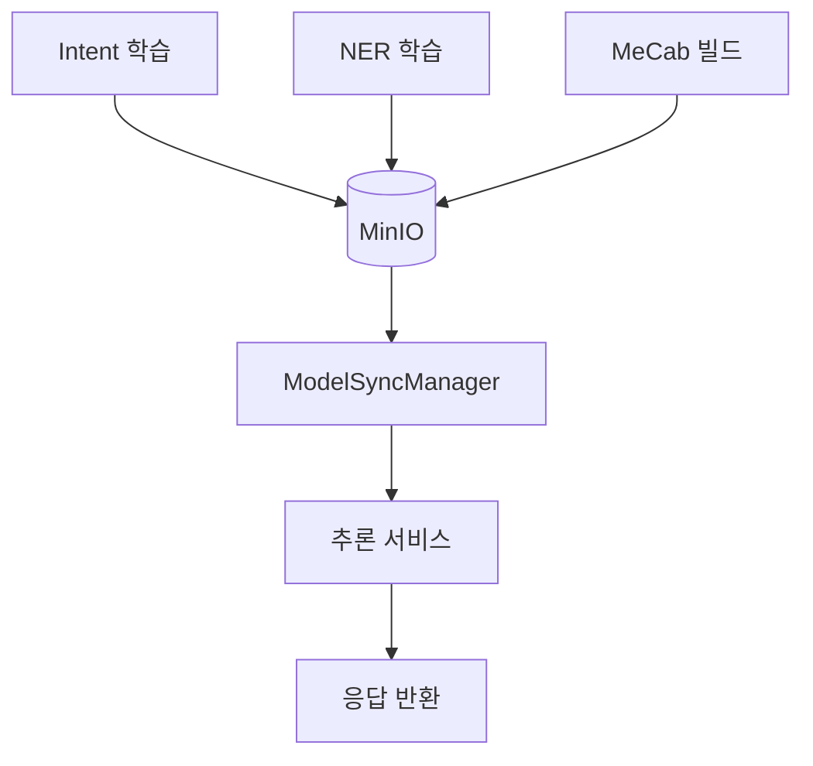
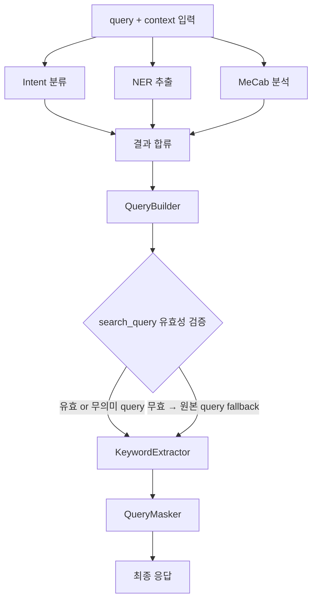
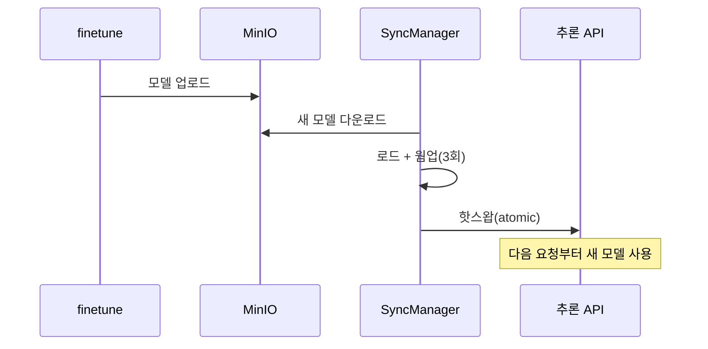
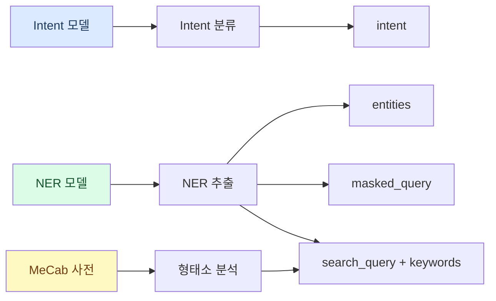
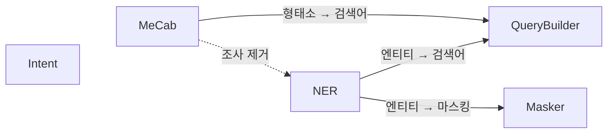
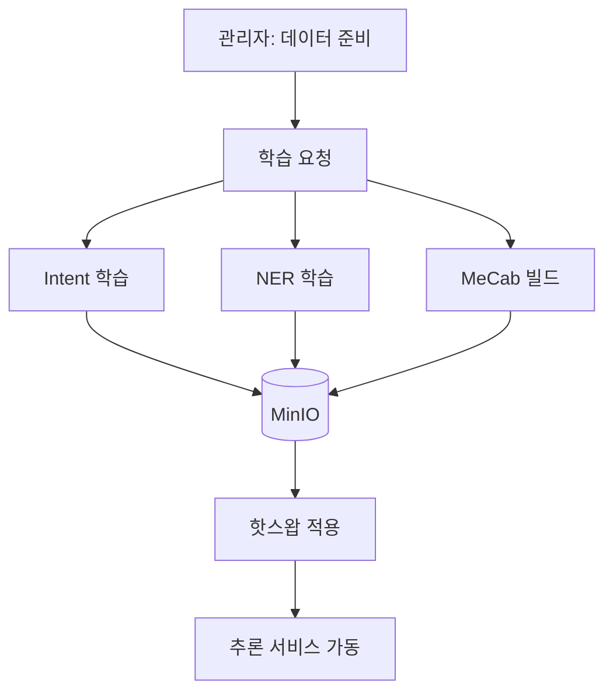

# NLP 전체 학습-추론 흐름 가이드

> **작성일**: 2026-02-23
> **학습**: `nlp_engine_finetune_service` (학습 전용)
> **추론**: `nlp_engine_inference_service` (추론 전용)
> **구 엔진**: `nlp_engine_service` (더 이상 사용하지 않음)

---

```markdown
search_query 유효성 검증
```

## 한 줄 요약

> **학습 서비스(finetune)가 모델을 학습하여 MinIO에 저장하면, 추론 서비스(inference)가 MinIO에서 모델을 다운로드하여 서비스 중단 없이 핫스왑으로 교체한다.**

---

## 0. Intent / NER / MeCab — 세 가지가 왜 필요한가?

고객센터에 전화가 왔다고 생각해보자. 상담원이 하는 일을 세 가지로 나눌 수 있다:

**Intent (의도 파악)** = "이 고객이 뭘 원하는 거지?"

```
고객: "갤럭시 S25 울트라 주문번호 ORD-001 환불해주세요"
상담원 머릿속: "아, 환불을 원하는구나" → refund_request
```

상담원이 전화를 받으면 가장 먼저 하는 일이 **고객의 의도를 파악**하는 것이다. 배송 조회인지, 환불인지, 단순 문의인지. Intent 모델이 이 역할을 한다.

**NER (핵심 정보 추출)** = "환불이라면, 어떤 상품? 주문번호는?"

```
고객: "갤럭시 S25 울트라 주문번호 ORD-001 환불해주세요"
상담원 머릿속: "상품명은 갤럭시 S25 울트라, 주문번호는 ORD-001이구나"
```

의도만 알면 부족하다. 환불을 하려면 **어떤 상품인지, 주문번호가 뭔지** 구체적 정보가 필요하다. NER 모델이 문장에서 이런 핵심 정보(엔티티)를 뽑아낸다.

**MeCab (형태소 분석)** = "이 문장을 의미 단위로 정확히 잘라보자"

```
고객: "갤럭시S25울트라 환불해주세요"

사전 없는 신입: "갤 / 럭 / 시 / S / 25 / 울트라 / 환불 / 해 / 주세요"  ← 상품명이 쪼개짐
사전 있는 베테랑: "갤럭시S25울트라 / 환불 / 해 / 주세요"              ← 상품명을 한 덩어리로 인식
```

상담원이 고객 말을 제대로 알아들으려면 **도메인 용어를 사전에 알고 있어야** 한다. MeCab은 문장을 형태소 단위로 분리하는 한국어 형태소 분석기다. 기본 사전만으로는 "갤럭시S25울트라" 같은 도메인 용어가 낱글자로 쪼개지기 때문에, **사용자 사전에 도메인 용어를 등록**하여 하나의 단어로 올바르게 인식시킨다.

**한 문장에서 세 가지가 동시에 작동한다:**

```
"갤럭시 S25 울트라 주문번호 ORD-001 환불해주세요"

  Intent → "이 고객은 환불을 원한다" (refund_request)
  NER    → "상품: 갤럭시 S25 울트라, 주문번호: ORD-001"
  MeCab  → "갤럭시S25울트라 / 주문번호 / ORD-001 / 환불 / 해 / 주세요" (형태소 분리)
```

세 가지는 각각 독립적으로 학습하고, 추론 시에는 병렬로 동시에 실행된다. 마치 **상담원 한 명이 전화를 받는 순간 의도 파악 / 정보 메모 / 문장 분석을 동시에 하는 것**과 같다.

---

## 1. 전체 그림




| 구성 요소                | 서비스                 | 역할                                                  |
| -------------------- | ------------------- | --------------------------------------------------- |
| Intent / NER / MeCab | `finetune_service`  | 모델 학습 후 MinIO에 업로드                                  |
| MinIO                | 공유 스토리지             | `nlp/{workspace}/models/{intent,ner,mecab}/` 경로로 저장 |
| ModelSyncManager     | `inference_service` | MinIO에서 다운로드 → 웜업 → 핫스왑                             |
| 추론 서비스               | `inference_service` | Intent + NER + MeCab 병렬 처리 → 응답                     |


---

## 2. 학습 과정 (finetune_service)

### 2.1 Intent 학습


#### 1단계: 시드 데이터 로드

LLM이 데이터를 생성하려면 "어떤 인텐트에 어떤 발화가 해당하는지" 참고할 예시가 필요하다. 이 시드 데이터가 LLM 생성의 기준점이 된다.

MinIO에서 NDJSON 파일을 다운로드하여 인텐트별 예시 발화를 읽는다.

```json
{"id": "order_status", "depth1": "주문", "depth2": "배송", "depth3": "배송 조회",
 "utterances": [
   {"text": "제 택배 어디쯤 왔나요?", "type": "standard"},
   {"text": "배송 추적 좀 해주세요", "type": "similar"}
 ]}
{"id": "refund_request", "depth1": "환불", "depth2": "환불 요청",
 "utterances": [
   {"text": "환불 받고 싶습니다", "type": "standard"}
 ]}
```

`depth1~4`는 LLM에게 "어떤 맥락의 발화를 만들어야 하는지" 알려주는 가이드 역할이다. 예를 들어 `주문 > 배송 > 배송 조회` 경로가 프롬프트에 들어가면 LLM이 배송 관련 발화만 집중적으로 생성한다.

#### 2단계: LLM 데이터 생성

사람이 작성한 시드 데이터는 인텐트당 2~~5개 정도로 매우 적다. KoBERT 같은 분류 모델을 제대로 학습시키려면 인텐트당 수십~~수백 개의 **다양한 표현**이 필요하다. 같은 의도를 표현하는 방법은 수백 가지인데, 사람이 그걸 다 쓸 수 없으니 LLM이 대신 만들어주는 것이다.

```
사람이 준 것:  "배송 추적 좀 해주세요" (딱 이것만)

모델이 알아야 하는 것:
  "택배 어디까지 왔어요?"
  "주문한 물건 지금 어디에 있나요?"
  "배송 현황 확인 부탁드려요"
  "내 택배 언제 오나요?"
  ... (수십~수백 가지 다른 표현)

→ LLM이 시드 발화를 참고해서 나머지를 채워줌
```

GPT-4o와 Gemini를 라운드로빈으로 번갈아 호출하여 **3가지 유형**의 데이터를 대량 생성한다. 유형을 나누는 이유는 실제 상담 상황을 골고루 커버하기 위해서다.

**싱글턴 (기본 30%)** - context 없는 단독 발화. 기본적인 표현 다양성을 확보한다:

```
시드: "제 택배 어디쯤 왔나요?"

LLM 생성 결과:
  "택배 언제 도착하나요?"
  "주문한 물건 배송 현황 좀 확인해주세요"
  "주문번호 {주문번호}로 주문한 건 지금 어디에 있어요?"
  → 플레이스홀더({주문번호})는 랜덤 값으로 자동 치환됨
```

**멀티턴 (기본 70%)** - 실제 상담에서는 대화 중간에 의도가 나타난다. 맥락 속 발화도 학습해야 정확도가 올라간다:

```
LLM이 대화 전체를 생성:

  USER: 어제 주문한 건데요
  AGENT: 주문번호를 알려주시겠어요?
  USER: 12345678이요
  AGENT: 확인해보겠습니다.
  USER: 지금 배송이 어디쯤인가요?  ← 이 발화의 intent = order_status

턴 수 분포 (기본):
  4턴 50% | 3턴 25% | 2턴 15% | 1턴 10%
```

**no_intent (기본 10%)** - "네 감사합니다", "알겠어요" 같은 발화는 특정 의도가 아니다. 이걸 학습 안 하면 모델이 모든 발화를 억지로 어떤 인텐트에 끼워맞추게 된다:

```
싱글턴 no_intent:
  "네 알겠습니다", "감사합니다", "네네", "좋아요" (패턴 풀에서 선택)

멀티턴 no_intent:
  AGENT: 더 필요하신 건 있으신가요?
  USER: "아니요 없어요"  ← no_intent

  AGENT: 환불 처리 완료되었습니다.
  USER: "네 확인했어요"  ← no_intent
```

인텐트가 10개이고 기본 설정이면: 10 x 100 = 1,000개 + no_intent 100개 = **약 1,100개** 학습 데이터가 생성된다.

#### 3단계: 데이터 분할

학습 데이터를 전부 학습에만 쓰면 모델이 외운 것만 맞추고 새로운 문장에는 틀리게 된다(과적합). train/val/test로 나누어 학습 중 검증하고, 학습 후 평가해야 실제 성능을 알 수 있다.

**수능 공부에 비유하면:**


| 구분              | 비유      | 역할                                                  |
| --------------- | ------- | --------------------------------------------------- |
| **train (70%)** | 교재 연습문제 | 모델이 패턴을 배우는 데이터                                     |
| **val (15%)**   | 모의고사    | 학습 도중 매 에폭마다 점수 확인 → 과적합 감지 시 조기 종료(Early Stopping) |
| **test (15%)**  | 수능 본시험  | 학습 완전 종료 후 딱 1번 → 진짜 실전 성능 측정                       |


- **val**: 학습 도중 반복적으로 보며 공부 방향을 조정. val 기반으로 조정하다 보면 val에도 간접적으로 맞춰지기 때문에 점수가 약간 부풀려진다.
- **test**: 학습이 끝난 후 단 1번만 본다. 결과를 보고 무언가를 바꾸지 않으므로 진짜 실력이 측정된다.

**인텐트별로 균등하게** train/val/test를 분리한다 (기본 70%/15%/15%).

```
intent A의 데이터 100개 → train 70 / val 15 / test 15
intent B의 데이터 100개 → train 70 / val 15 / test 15
no_intent 100개         → train 70 / val 15 / test 15

→ 각 intent가 모든 분할에 고르게 분포 (Stratified Split)
→ 라벨 순서는 OrderedDict로 보장, no_intent는 항상 마지막
```

전체 데이터를 무작위로 나누면 운이 나쁠 경우 val/test에 특정 인텐트가 아예 없을 수 있다. 인텐트별로 나눠야 모든 분할에 모든 인텐트가 최소 1개씩 들어가는 것이 보장된다.

#### 4단계: 전처리 (context_to_text 변환)

KoBERT 모델은 단일 텍스트 문자열만 입력받을 수 있다. 멀티턴 대화(context + query)를 그대로 넣을 수 없으므로, 하나의 문자열로 변환해야 한다. 학습 시와 추론 시 동일한 변환을 적용해야 결과가 일관된다.

```
변환 전:
  context: [
    {"role": "user", "content": "어제 주문한 건데요"},
    {"role": "agent", "content": "주문번호 알려주세요"}
  ]
  query: "12345678이요"

변환 후:
  "[USER] 어제 주문한 건데요 [AGENT] 주문번호 알려주세요 [USER] 12345678이요"

싱글턴은:
  "[USER] 배송 추적 좀 해주세요"
```

변환된 텍스트와 라벨을 CSV 파일로 저장한다:

```csv
text,label
"[USER] 배송 추적 좀 해주세요",order_status
"[USER] 어제 주문한 건데요 [AGENT] 주문번호 알려주세요 [USER] 12345678이요",order_status
"[USER] 환불 받고 싶습니다",refund_request
"[USER] 네 알겠습니다",no_intent
```

#### 5단계: KoBERT 모델 학습

이전 단계까지는 데이터를 준비한 것이고, 이 단계에서 실제로 모델이 "이 문장은 어떤 의도인지"를 학습한다. 사전학습된 KoBERT를 가져와서 우리 도메인 데이터로 파인튜닝하는 것이다.

**파인튜닝이란?** KoBERT는 이미 대량의 한국어 텍스트로 "한국어 자체"를 학습한 상태다. 처음부터 학습하는 게 아니라, 이 한국어 능력을 바탕으로 **우리 도메인의 인텐트 분류만 추가 학습**하는 것이다. 비유하면 한국어를 유창하게 하는 사람에게 "고객센터 상담 업무"만 추가로 가르치는 것과 같다.

```
베이스 모델: monologg/kobert-lm
태스크: Sequence Classification (문장 → 인텐트 라벨)
옵티마이저: AdamW (lr=2e-5)
배치 크기: 8
최대 에폭: 50 (Early Stopping으로 보통 더 일찍 종료)
최대 시퀀스 길이: 512
```

**학습 설정 상세:**


| 설정                          | 값                  | 의미                                                             |
| --------------------------- | ------------------ | -------------------------------------------------------------- |
| **베이스 모델**                  | monologg/kobert-lm | 한국어 사전학습 BERT. 한국어 문장 구조를 이미 알고 있는 상태에서 시작                     |
| **Sequence Classification** | 문장 → 라벨            | 문장 하나를 입력받아 인텐트 하나를 출력하는 분류 태스크                                |
| **AdamW**                   | lr=2e-5 (0.00002)  | 모델의 가중치를 한 번에 얼마나 조정할지 결정. 너무 크면 기존 한국어 지식을 잊고, 너무 작으면 학습이 안 됨 |
| **배치 크기 8**                 |                    | 한 번에 8개 문장을 묶어서 학습. 메모리 사용량과 학습 안정성의 균형                        |
| **최대 시퀀스 길이 512**           |                    | 문장을 최대 512 토큰까지 처리. 이보다 긴 문장은 잘림                               |


**에폭(Epoch)이란?** 전체 train 데이터를 **한 바퀴** 도는 것이 1에폭이다. train 데이터가 700개이고 배치 크기가 8이면, 1에폭 = 약 88번(700÷8) 가중치를 업데이트한다. 50에폭이면 같은 데이터를 최대 50바퀴 반복하며 점점 더 정확하게 만든다.

**Early Stopping (하이브리드 방식):**

매 에폭이 끝날 때마다 val 데이터(모의고사)로 두 가지를 확인한다:

- **val_loss** (오답률): 낮을수록 좋음 — 모델이 얼마나 틀렸는지
- **val_f1** (정답률): 높을수록 좋음 — 인텐트별 균등한 정확도

```
에폭 1: val_loss=1.8, val_f1=0.30 → loss↓ f1↑ → 개선됨 ✓ (patience=0)
에폭 2: val_loss=1.2, val_f1=0.55 → loss↓ f1↑ → 개선됨 ✓ (patience=0)
에폭 3: val_loss=0.8, val_f1=0.72 → loss↓ f1↑ → 개선됨 ✓ ★ best 모델 저장
에폭 4: val_loss=0.7, val_f1=0.70 → loss↓ f1↓ → loss 개선 ✓ (patience=0)
에폭 5: val_loss=0.9, val_f1=0.68 → loss↑ f1↓ → 둘 다 개선 안 됨 (patience=1)
에폭 6: val_loss=1.0, val_f1=0.65 → loss↑ f1↓ → 둘 다 개선 안 됨 (patience=2)
...
에폭 9: val_loss=1.3, val_f1=0.60 → patience=5 → 한도 도달 → 학습 중단!

→ 에폭 3에서 저장해둔 best 모델로 복원
```

val_loss **또는** val_f1 중 **하나라도** 개선되면 patience가 0으로 리셋된다 (하이브리드 방식). 둘 다 개선이 없는 상태가 patience(기본 5회) 연속 이어지면, "더 학습해도 나아지지 않는다"고 판단하고 학습을 멈춘다. 최종적으로는 val_f1이 가장 높았던 시점의 모델을 사용한다.

#### 6단계: MinIO 업로드

학습된 모델을 추론 서비스가 가져갈 수 있도록 공유 스토리지(MinIO)에 올린다. 학습 서비스와 추론 서비스는 별도 서버이므로, MinIO를 통해 모델을 전달한다.

```
업로드 경로: nlp/{workspace_id}/models/intent/{task_id}/{timestamp}/
파일 목록:
  ├── config.json          (모델 설정 + label 매핑)
  ├── model.safetensors    (모델 가중치)
  ├── tokenizer.json       (토크나이저)
  ├── vocab.txt            (어휘 목록)
  └── ...
```

#### 7단계: 평가

모델이 실제로 얼마나 잘 동작하는지 확인한다. 학습에 사용하지 않은 테스트 데이터(3단계에서 떼어둔 수능 문제)로 평가하므로 실전 성능의 지표가 된다. 결과가 나쁘면 데이터를 보강하거나 하이퍼파라미터를 조정하여 재학습할 수 있다.

테스트 데이터의 각 문장을 모델에 넣어 예측값을 받고, 정답과 비교하여 **Accuracy**와 **Macro F1**을 계산한다.

**Accuracy (정확도)** — 전체 중 맞힌 비율:

```
테스트 데이터 60개 중 54개 정답 → Accuracy = 54/60 = 0.90 (90%)
```

직관적이지만 함정이 있다. 인텐트별 데이터가 불균형하면 다수 인텐트만 맞혀도 Accuracy가 높게 나온다:

```
테스트 데이터: 계좌조회 50개, 이체 5개, 환불 5개

모델이 모든 문장을 "계좌조회"로 찍어도:
  Accuracy = 50/60 = 83% ← 높아 보이지만 이체/환불은 전부 틀림
```

**Macro F1 — 인텐트별 균등 평가:**

이 문제를 해결하기 위해 Macro F1을 함께 본다. 각 인텐트별로 F1 점수를 따로 계산한 뒤 평균을 낸다:

```
위와 같은 "전부 계좌조회로 찍기" 모델:

  계좌조회 F1: 높음 (다 맞힘)
  이체 F1:     0.00 (하나도 못 맞힘)
  환불 F1:     0.00 (하나도 못 맞힘)
  
  Macro F1 = (높음 + 0.00 + 0.00) / 3 = 매우 낮음
  → Accuracy 83%와 달리, Macro F1은 이 모델이 나쁘다는 걸 보여줌
```

Accuracy가 높아도 Macro F1이 낮으면 특정 인텐트를 못 맞히고 있다는 신호다. **두 지표가 모두 높아야 좋은 모델**이다.

```
좋은 모델 예시:
  Accuracy: 0.92 (92%)   — 전체적으로 잘 맞힘
  Macro F1: 0.89 (89%)   — 인텐트별로도 고르게 잘 맞힘
```

---

### 2.2 NER 학습


#### 1단계: 엔티티 정의 로드

NER 모델에게 "어떤 엔티티를 인식해야 하는지" 알려줘야 한다. 범용 NER은 인명/장소 같은 일반적인 것만 알지만, 우리 도메인에는 "상품명", "주문번호" 같은 커스텀 엔티티가 있다. 이걸 정의하는 것이 이 단계다.

MinIO에서 엔티티 정의 JSON을 다운로드하고, 시스템 내장 Base 엔티티 9종과 자동 병합한다.

```json
{
  "entities": [
    {
      "tag": "PRODUCT",
      "name_ko": "상품명",
      "description": "고객이 문의하는 상품의 이름",
      "examples": ["갤럭시 S25", "아이폰 16"],
      "custom_examples": [
        {"text": "갤럭시 S25 울트라", "hint": "삼성 최신 스마트폰"}
      ]
    }
  ]
}
```

시스템 내장 Base 엔티티와 자동 병합되므로, 사용자는 도메인 특화 엔티티만 정의하면 된다.

**Base 엔티티 10종** (`data/common/entity_definitions/base_entities.json`):


| 태그     | 이름           | 의미   | 예시                                |
| ------ | ------------ | ---- | --------------------------------- |
| **PS** | Person       | 인명   | 김민수, 홍길동 대리, 이지은 님                |
| **LC** | Location     | 장소   | 서울, 강남구, 판교테크노밸리                  |
| **OG** | Organization | 조직   | 삼성전자, 국민은행, 서울대학교                 |
| **DT** | Date         | 날짜   | 2024년 1월 15일, 내일, 다음 주 월요일        |
| **TI** | Time         | 시간   | 오후 3시, 14:30, 점심시간 이후             |
| **QT** | Quantity     | 수량   | 3개, 5명, 100kg                     |
| **PD** | Product      | 상품   | 갤럭시 S24, 나이키 에어맥스, 맥북 프로          |
| **PR** | Price        | 금액   | 50,000원, 5만원, 월 9,900원            |
| **ID** | Identifier   | 식별자  | ORD-20240115-001, 송장 654321987654 |
| **PH** | PhoneNumber  | 전화번호 | 010-1234-5678, 1588-1234          |


이 10종은 업종에 관계없이 공통으로 필요한 엔티티다. 사용자가 "PRODUCT"라는 도메인 엔티티를 추가로 정의하면, 시스템의 PD(상품)와 별개로 독립적인 엔티티로 함께 학습된다.

#### 2단계: LLM 데이터 생성

엔티티 정의만으로는 모델을 학습시킬 수 없다. "이 문장에서 갤럭시 S25가 상품명이다"라는 실제 문장+라벨 데이터가 수백 개 필요하다. 사람이 다 만들기엔 너무 많으니 LLM이 대신 생성한다.

LLM이 엔티티가 포함된 자연스러운 문장을 생성한다.

**custom_examples 사용 (80%)** - 반드시 해당 키워드가 포함된 문장:

```
프롬프트: "반드시 '갤럭시 S25 울트라'를 포함하세요 (힌트: 삼성 최신 스마트폰)"
LLM 생성: "갤럭시 S25 울트라 256GB 모델 재고가 언제 들어오나요?"
```

**examples 사용 (20%)** - 비슷한 유형의 새로운 엔티티를 자유 생성:

```
프롬프트: "상품명 예시: 갤럭시 S25, 아이폰 16, 맥북 프로"
LLM 생성: "LG 그램 17인치 배송이 아직 안 왔어요"
→ LLM이 "LG 그램 17인치"라는 새로운 상품명을 자유롭게 생성
```

#### 3단계: 위치 계산 + BIO 변환

NER 모델은 문장을 통째로 보고 판단하는 게 아니라, **토큰 하나하나에 라벨을 붙이는 방식**으로 학습한다. 그래서 "이 토큰이 엔티티의 시작인지(B), 내부인지(I), 아닌지(O)"를 표시하는 BIO 형식으로 변환해야 한다.

**왜 BIO가 필요한가?** 단순히 토큰별로 라벨만 붙이면, 같은 타입의 엔티티가 연속될 때 어디서 끊어야 하는지 알 수 없다:

```
"갤럭시 S25 울트라랑 아이폰 16 비교해주세요"

BIO 없이 라벨만 붙이면:
  갤럭시 → PRODUCT, S25 → PRODUCT, 울트라 → PRODUCT, 아이폰 → PRODUCT, 16 → PRODUCT
  → PRODUCT가 5개 연속인데, 상품 1개인지 2개인지 알 수 없음

BIO로 붙이면:
  갤럭시 → B-PRODUCT  ← 새 상품 시작!
  S25   → I-PRODUCT  ← 같은 상품 계속
  울트라 → I-PRODUCT  ← 같은 상품 계속
  아이폰 → B-PRODUCT  ← 새 상품 시작!
  16    → I-PRODUCT  ← 같은 상품 계속
  → B에서 다음 B 전까지가 하나의 엔티티 → "갤럭시 S25 울트라" / "아이폰 16"
```

형광펜에 비유하면, B는 **"여기서 새로 칠하기 시작"** 이라는 경계 표시다. B 없이 색깔만 칠하면 어디서 끊는지 모르지만, B가 있으면 덩어리가 구분된다.


| 태그                | 의미               | 역할                |
| ----------------- | ---------------- | ----------------- |
| **B** (Beginning) | 엔티티의 **첫 번째** 토큰 | "새 엔티티 시작!" 경계 표시 |
| **I** (Inside)    | 엔티티의 **나머지** 토큰  | "아직 같은 엔티티 계속"    |
| **O** (Outside)   | 엔티티가 **아닌** 토큰   | "여긴 관심 없음"        |


LLM은 **문장과 엔티티 텍스트만** 생성하고, 위치와 BIO 태깅은 시스템이 자동 처리한다.

```
LLM 생성 결과:
  text: "갤럭시 S25 주문번호 ORD-001 환불 가능한가요?"
  entities: [{label: "PRODUCT", text: "갤럭시 S25"},
             {label: "ORDER_NO", text: "ORD-001"}]

  ↓ 시스템이 자동으로 위치 계산

  entities: [{label: "PRODUCT", text: "갤럭시 S25", start: 0, end: 7},
             {label: "ORDER_NO", text: "ORD-001", start: 12, end: 19}]

  ↓ 토큰 분리 후 BIO 태깅

  tokens:  [갤럭시,    S25,       주문번호, ORD-001,     환불, 가능한가요, ?]
  labels:  [B-PRODUCT, I-PRODUCT, O,       B-ORDER_NO,  O,   O,         O]
```

#### 4~7단계: 분할 → 학습 → 업로드 → 평가

Intent와 같은 이유로 분할(과적합 방지)하고, 학습(파인튜닝)하고, 업로드(추론 서비스 전달)하고, 평가(실전 성능 확인)한다.

```
데이터 분할: train / val / test (70/15/15)
모델: KoELECTRA (Leo97/KoELECTRA-small-v3-modu-ner)
태스크: Token Classification (토큰 → BIO 태그)
학습: Warmup Scheduler + Early Stopping
평가: Entity-level F1 (seqeval) - 토큰 단위가 아닌 엔티티 단위 정확도
업로드: nlp/{ws}/models/ner/{task}/{ts}/
```

---

### 2.3 MeCab 사전 빌드


#### 1단계: 어휘 정의 로드

MeCab 기본 사전에는 "갤럭시S24", "로켓배송" 같은 도메인 용어가 없다. 어떤 종류의 단어가 필요한지(카테고리 + 품사 + 예시)를 정의해야 LLM이 관련 단어를 생성할 수 있다.

```json
{
  "type": "domain",
  "domain": "ecommerce",
  "categories": [
    {
      "name": "product_name",
      "name_ko": "상품명",
      "pos": "NNP",
      "description": "전자제품, 패션, 식품 등 상품명",
      "examples": ["갤럭시S24", "아이폰15프로", "맥북에어"]
    }
  ]
}
```

#### 2단계: LLM 단어 생성

사람이 도메인 용어를 수백 개 직접 등록하면 시간이 너무 오래 걸린다. 예시 몇 개만 주면 LLM이 같은 카테고리의 단어를 대량으로 만들어준다.

LLM이 카테고리별로 단어 + 읽기 + 의미를 생성한다.

```
프롬프트: "상품명(NNP) 카테고리에 해당하는 단어 20개를 생성하세요.
         예시: 갤럭시S24, 아이폰15프로, 맥북에어"

LLM 응답:
  {"word": "갤럭시Z플립5",  "reading": "갤럭시지플립오", "semantic": "삼성_폴더블폰"}
  {"word": "아이패드프로12", "reading": "아이패드프로십이", "semantic": "애플_태블릿"}
  {"word": "LG그램17",     "reading": "엘지그램십칠",   "semantic": "LG_노트북"}
```

#### 3단계: MeCab CSV 빌드

MeCab은 특정 CSV 형식만 이해한다. LLM이 생성한 단어를 MeCab이 읽을 수 있는 형식으로 변환해야 사전으로 쓸 수 있다.

```csv
갤럭시Z플립5,1785,1785,0,NNP,삼성_폴더블폰,T,갤럭시지플립오,*,*,*,*
아이패드프로12,1785,1785,0,NNP,애플_태블릿,F,아이패드프로십이,*,*,*,*
```

#### 4단계: 사전 컴파일 + 업로드

CSV는 사람이 읽을 수 있는 텍스트 파일이지만, MeCab이 실제로 사용하는 건 컴파일된 바이너리 사전(.dic)이다. CSV를 .dic으로 컴파일하고 MinIO에 올려야 추론 서비스가 가져갈 수 있다.

```
CSV → mecab-dict-index → vocab.dic (바이너리 사전)
vocab.csv + vocab.dic + meta.json → mecab_dict.zip
MinIO 업로드: nlp/{ws}/models/mecab/{task}/{ts}/mecab_dict.zip
```

MeCab은 모델 학습이 아니라 **사전 파일만 생성**하는 파이프라인이다. 이 사전이 추론 서비스의 형태소 분석기에 적용되면, "갤럭시Z플립5"를 하나의 단어로 인식하게 된다.

---

## 3. 추론 과정 (inference_service)

### 3.1 요청 수신

```json
{
  "workspace_id": "ws_001",
  "query": "갤럭시 S25 울트라 주문번호 ORD-2024-001 환불해주세요",
  "context": [
    {"role": "user", "content": "어제 주문한 건데요"},
    {"role": "agent", "content": "주문번호 알려주시겠어요?"}
  ],
  "intent_top_k": 1,
  "options": { "mask_target_types": ["ORDER_ID", "PS"] }
}
```


| 필드                          | 의미                                                  |
| --------------------------- | --------------------------------------------------- |
| `workspace_id`              | 어떤 워크스페이스의 모델을 사용할지                                 |
| `query`                     | 현재 사용자 발화                                           |
| `context`                   | 이전 대화 히스토리 (Dual Classification에 사용)                |
| `intent_top_k`              | Intent 결과를 상위 몇 개까지 반환할지. 기본 1이면 1위만, 3이면 1~3위까지 반환 |
| `options.mask_target_types` | 마스킹할 엔티티 타입 목록. 여기 포함된 타입만 `masked_query`에서 가려짐     |


`**intent_top_k` 예시** — 모델은 내부적으로 모든 인텐트에 확률을 매기는데, 그중 상위 몇 개를 돌려줄지 결정한다:

```
모델 내부: refund_request(0.92), order_status(0.05), cancel_order(0.02), ...

intent_top_k=1 → [{"intent": "refund_request", "score": 0.92}]
intent_top_k=3 → [{"intent": "refund_request", "score": 0.92},
                   {"intent": "order_status",   "score": 0.05},
                   {"intent": "cancel_order",   "score": 0.02}]
```

`**mask_target_types` 예시** — NER이 추출한 엔티티 중 이 타입에 해당하는 것만 마스킹한다 (개인정보 보호용):

```
mask_target_types: ["ORDER_ID", "PS"]

NER 결과:
  PRODUCT:  "갤럭시 S25 울트라"  ← 목록에 없음 → 그대로 노출
  ORDER_ID: "ORD-2024-001"       ← 목록에 있음 → ******** 로 마스킹

masked_query: "갤럭시 S25 울트라 주문번호 ******** 환불해주세요"
```

기존 `analyze_text`와 다른 점: **context(대화 맥락)를 직접 받을 수 있다.**

### 3.2 모델 Fallback 체계

추론 서비스는 모델을 찾을 때 **3단계 Fallback**을 적용한다.


예를 들어 `tenant_A`의 `workspace_01`에서 Intent 모델을 찾을 때:

```
1) data/tenant_A/workspace_01/intent_models/  ← 있으면 사용
2) data/tenant_A/common/intent_models/        ← 1이 없으면 여기
3) data/common/intent_models/                 ← 1, 2 모두 없으면 여기
```

Intent, NER, MeCab 모두 동일한 Fallback 규칙을 따른다.

### 3.3 병렬 처리

텍스트가 들어오면 **3개의 스레드가 동시에** 실행된다.




#### Thread 1: Intent 분류 (Dual Classification)

입력 텍스트: `"갤럭시 S25 울트라 주문번호 ORD-2024-001 환불해주세요"`

**Step A**: context를 `[USER]...[AGENT]...[USER] query` 형태로 변환

```
변환 결과:
  "[USER] 어제 주문한 건데요 [AGENT] 주문번호 알려주시겠어요?
   [USER] 갤럭시 S25 울트라 주문번호 ORD-2024-001 환불해주세요"
```

**Step B**: 두 가지 분류를 동시에 수행

```
① Query-only: 현재 발화만으로 판단
   "환불해주세요" → refund_request (score: 0.92)

② With-Context: context 포함하여 판단
   "[USER] 어제 주문한.. [AGENT] 주문번호.. [USER] 환불해주세요"
   → refund_request (score: 0.88)
```

**Step C**: 두 결과를 비교하여 최종 판단

```
Case 1: 두 결과 일치 → 그대로 반환
  (이 예시: 둘 다 refund_request → 그대로 반환)

Case 2: Query-only가 no_intent(≥0.8), Context가 다른 intent
  → no_intent 반환 (맥락에 속지 않음)
  예: "네 알겠습니다"를 context 때문에 order_status로 오분류하는 것 방지

Case 3: 두 결과 불일치
  → Context 결과를 채택하되 score × 0.7로 하향
  → 신뢰도를 낮춰서 후속 처리에서 판단할 여지를 남김
```

**출력**: `[{"intent": "refund_request", "score": 0.92}]`

#### Thread 2: NER 추출

입력 텍스트: `"갤럭시 S25 울트라 주문번호 ORD-2024-001 환불해주세요"`

**Step A**: KoELECTRA 자체 토크나이저로 서브워드 분리 (MeCab과 별개)

모델에 문장을 넣기 전에, 토크나이저가 문장을 모델이 이해할 수 있는 조각(서브워드)으로 쪼갠다. "갤럭시"가 "갤럭" + "##시"로 나뉘는 건 토크나이저의 어휘에 "갤럭시"가 통째로 없기 때문이다.

```
["갤럭", "##시", "S25", "울트라", "주문", "##번호", "ORD", "-", "2024", "-", "001", "환불", ...]
```

**Step B**: 각 토큰에 BIO 태그 예측

학습 때는 "갤럭시는 B-PRODUCT야"라고 정답을 알려주며 가르쳤다. 이제 추론에서는 정답 없이 **처음 보는 문장**이 들어온다. 모델이 학습한 패턴을 바탕으로 각 토큰마다 "이건 B인지, I인지, O인지" 확률을 계산하고, 가장 높은 것을 선택한다. 이 과정이 "예측"이다.

```
"갤럭" → B-PRODUCT(0.91), O(0.05), B-ORDER_ID(0.01)... → B-PRODUCT 선택
"##시" → I-PRODUCT(0.95), O(0.03)...                    → I-PRODUCT 선택
"S25"  → I-PRODUCT(0.89), O(0.07)...                    → I-PRODUCT 선택
"울트라" → I-PRODUCT(0.93)...                             → I-PRODUCT 선택
"주문"  → O(0.97)...                                     → O 선택
"##번호" → O(0.96)...                                     → O 선택
"ORD"   → B-ORDER_ID(0.85), O(0.10)...                  → B-ORDER_ID 선택
"-"     → I-ORDER_ID(0.88)...                            → I-ORDER_ID 선택
...
```

**Step C**: 연속된 B-I를 하나의 엔티티로 병합

Step B의 결과를 보면 B-PRODUCT 다음에 I-PRODUCT가 3개 연속이다. "B에서 다음 B 또는 O 전까지가 하나의 엔티티"이므로, 이를 합쳐서 원래 텍스트로 복원한다.

```
B-PRODUCT + I-PRODUCT + I-PRODUCT + I-PRODUCT → "갤럭시 S25 울트라" (score: 0.95)
B-ORDER_ID + I-ORDER_ID + I-ORDER_ID + I-ORDER_ID → "ORD-2024-001" (score: 0.91)
```

**Step D**: 후처리 - MeCab을 활용하여 조사 제거

NER 모델은 문맥 기반으로 엔티티 경계를 판단하다 보니, 종종 **조사까지 포함해서** 추출한다. NER 자체는 품사를 모르지만, MeCab은 품사를 정확히 알기 때문에 조사를 깔끔하게 잘라줄 수 있다.

방법: NER이 추출한 값을 MeCab으로 형태소 분석하고, **뒤에서부터** 조사/어미 품사를 만나면 제거, 조사가 아닌 품사를 만나면 멈춘다.

```
NER 추출: "남궁민수인데" (PS)  ← "인데"가 붙어버림

MeCab("남궁민수인데") 분석:
  남궁민수 / NNP(고유명사)
  이      / VCP(긍정지정사)  ← 조사류!
  ㄴ데    / EC(연결어미)     ← 조사류!

뒤에서부터 탐색:
  "ㄴ데"(EC) → 조사류 → 제거 대상
  "이"(VCP) → 조사류 → 제거 대상
  "남궁민수"(NNP) → 조사 아님 → 멈춤!

결과: "남궁민수인데" → "남궁민수"
```

다른 예시:

```
"서울에서"    → 서울/NNP + 에서/JKB(부사격조사) → "서울"
"배송비가"    → 배송비/NNG + 가/JKS(주격조사)  → "배송비"
"크림색이라고" → 크림색/NNG + 이라고/JKQ(인용격조사) → "크림색"
```

**출력**: `{"PRODUCT": [...], "ORDER_ID": [...]}`

#### Thread 3: MeCab 형태소 분석

입력 텍스트: `"갤럭시 S25 울트라 주문번호 ORD-2024-001 환불해주세요"`

**4계층 사전이 동시에 적용됨**:

```
Layer 0 (시스템):    "환불", "주문번호" 등 기본 단어
Layer 1 (전역 공통):  업종 공통 용어
Layer 2 (워크스페이스): "갤럭시S25울트라" (MeCab 파이프라인에서 등록된 것)
Layer 3 (사용자):    실시간 추가된 단어
```

**MeCab 분석 결과** (Layer 2 사전에 "갤럭시S25울트라"가 있을 때):

```
갤럭시S25울트라 / NNP  ← 하나의 단어로 인식!
주문번호 / NNG
ORD-2024-001 / SL     ← 외국어 기호
환불 / NNG
해주세요 / ...

NNG + NNP만 필터링:
  → ["갤럭시S25울트라", "주문번호", "환불"]
```

사전이 없었다면 "갤럭시", "S25", "울트라"로 쪼개져버린다.

**출력**: `["갤럭시S25울트라", "주문번호", "환불"]`

#### 후처리: QueryBuilder → KeywordExtractor → QueryMasker

3개 Thread의 결과가 합류한 후 순차적으로 후처리된다.

**QueryBuilder** - NER + MeCab + context를 종합하여 **실제 검색에 사용할 검색어** 생성:

```
NER 결과: PRODUCT("갤럭시 S25 울트라"), ORDER_ID("ORD-2024-001")
MeCab 결과: ["갤럭시S25울트라", "주문번호", "환불"]

① NER 엔티티 처리 (타입별로 다르게):
   PRODUCT → SWITCH/EXCLUDE 대상 아님 → 값 그대로 사용
   ORDER_ID → SWITCH 대상 → 실제 값("ORD-2024-001") 대신 "주문번호"로 치환
   PS → EXCLUDE 대상 → 검색어에서 완전 제외

② NER 키워드 + MeCab 키워드 합산 후 중복 제거

③ 의미 유사도 랭킹 → 상위 키워드 선택

④ search_query 유효성 검증 (query가 유의미한 경우만)

→ search_query: "갤럭시S25울트라, 환불"
```

**④ search_query 유효성 검증** — 키워드 조합 결과가 원래 발화의 의도를 제대로 반영하는지 확인한다. 키워드 추출 과정에서 핵심 의미가 빠지거나 왜곡될 수 있기 때문이다:

```
Step 1: query 유의미성 판단 (MeCab 형태소 분석)
  - 실질 명사(NNG 일반명사, NNP 고유명사) 개수로 판단
  - "네", "응", "그래요"  → 명사 0개 → 무의미 → 검증 스킵 (context 의존 발화)
  - "그거요"              → 대명사만 → 무의미 → 검증 스킵
  - "배송 언제요"         → 명사 1개(배송) → 유의미 → 검증 수행
  - "반품하고 싶어요"     → 명사 1개(반품) → 유의미 → 검증 수행

Step 2: search_query vs query 임베딩 유사도 검증 (유의미할 때만)
  - Sentence Transformer로 두 텍스트의 코사인 유사도 계산
  - 유사도 ≥ 0.65 → 유효 → search_query 그대로 사용
  - 유사도 < 0.65 → 무효 → 원본 query로 fallback

예시:
  query: "언제 도착하는지 날짜를 조정할 수도 있나요"
  search_query (키워드 조합): "하루 이틀, 날짜, 기간"
  유사도: 0.6059 < 0.65 → fallback
  → 최종 search_query: "언제 도착하는지 날짜를 조정할 수도 있나요" (원본 사용)
```

query가 무의미한 경우(예: "네", "그거요")는 검증을 스킵하고 키워드 조합 결과를 그대로 사용한다. 이런 발화는 원본 query 자체에 검색할 정보가 없으므로, context에서 추출한 키워드가 더 유용하기 때문이다.

**KeywordExtractor** - query만 보고 MeCab으로 **핵심 키워드 목록** 추출:

```
query만 분석 (context 안 봄, NER 안 씀):
  MeCab → 명사 추출 → 복합어 생성 → 중복 제거

→ keywords: ["갤럭시S25울트라", "환불"]
```

`search_query`와 `keywords`의 차이:


|        | search_query                  | keywords                       |
| ------ | ----------------------------- | ------------------------------ |
| **입력** | query + context + NER + MeCab | query + MeCab만                 |
| **결과** | `"갤럭시S25울트라, 환불"` (검색어 문자열)   | `["갤럭시S25울트라", "환불"]` (키워드 배열) |
| **용도** | 벡터 검색/FAQ 검색에 사용              | 발화의 핵심 단어 목록                   |


**QueryMasker** - NER 결과 기반 개인정보 마스킹:

```
options에 mask_target_types: ["ORDER_ID", "PS"] 지정됨

ORDER_ID "ORD-2024-001" → full 마스킹 → "********"
PS(인명) 있으면 → name 마스킹 → "홍**동"

masked_query: "갤럭시 S25 울트라 주문번호 ******** 환불해주세요"
```

마스킹 스타일:


| 엔티티        | 스타일         | 예시                        |
| ---------- | ----------- | ------------------------- |
| ORDER_ID   | full        | ORD-2024-001 → `********` |
| PS (인명)    | name        | 홍길동 → `홍**동`              |
| ADDRESS    | road_detail | 서울로 13번지 → `***로 **번지`    |
| MEMBERSHIP | partial     | 골드회원 → `****회원`           |
| POINT      | number      | 15000포인트 → `*****포인트`     |


### 3.4 최종 응답

```json
{
  "query": "갤럭시 S25 울트라 주문번호 ORD-2024-001 환불해주세요",
  "intent": [{"intent": "refund_request", "score": 0.92}],
  "search_query": "갤럭시S25울트라, 환불",
  "keywords": ["갤럭시S25울트라", "환불"],
  "masked_query": "갤럭시 S25 울트라 주문번호 ******** 환불해주세요",
  "entities": {
    "PRODUCT": [{"text": "갤럭시 S25 울트라", "score": 0.95}],
    "ORDER_ID": [{"text": "ORD-2024-001", "score": 0.91}]
  },
  "latency_ms": 35.2
}
```

각 필드의 출처:


| 응답 필드          | 누가 만들었나                             | 설명                                                        |
| -------------- | ----------------------------------- | --------------------------------------------------------- |
| `intent`       | Thread 1 (Intent 모델)                | Dual Classification으로 분류한 의도                              |
| `entities`     | Thread 2 (NER 모델)                   | BIO 태깅으로 추출한 엔티티 목록                                       |
| `search_query` | QueryBuilder (NER + MeCab + 유효성 검증) | 벡터 검색에 사용할 검색어. 키워드 조합이 원본 의도를 반영 못 하면 원본 query로 fallback |
| `keywords`     | KeywordExtractor (MeCab + 유사도)      | 핵심 키워드                                                    |
| `masked_query` | QueryMasker (NER 기반)                | 개인정보가 마스킹된 텍스트                                            |


### 3.5 모델 핫스왑

학습이 완료되면 **서비스 재시작 없이** 모델을 교체한다.




핫스왑 과정:

1. **다운로드**: MinIO에서 새 모델 파일을 로컬로 다운로드
2. **로드**: 새 모델을 메모리에 로드
3. **웜업**: 더미 텍스트로 3회 추론 실행 (첫 요청 지연 방지)
4. **교체**: 캐시의 모델 참조를 atomic하게 교체 (이전 모델 → 새 모델)
5. **정리**: 이전 모델 파일 삭제

교체 순간에도 요청은 정상 처리된다. 교체 직전 요청은 이전 모델로, 직후 요청은 새 모델로 처리된다.

---

## 4. 학습 결과물과 추론의 관계




| 학습 결과물        | 추론에서의 역할                    | 영향 범위                       |
| ------------- | --------------------------- | --------------------------- |
| **Intent 모델** | Dual Classification으로 의도 분류 | `intent`                    |
| **NER 모델**    | 토큰별 엔티티 인식 + 마스킹 대상 판별      | `entities` + `masked_query` |
| **MeCab 사전**  | 형태소 분석 → 키워드/검색어 추출         | `search_query` + `keywords` |


### 상호 의존 관계




- **Intent ↔ NER/MeCab**: 완전 독립. 각각 다른 토크나이저(KoBERT / KoELECTRA / MeCab)를 사용
- **NER → MeCab**: NER 후처리에서 MeCab으로 조사 제거 (간접 협력)
- **NER + MeCab → QueryBuilder**: 둘 다 검색어 조합에 기여
- **NER → 마스킹**: NER이 식별한 엔티티가 마스킹 대상이 됨

3개 모두 독립적으로 학습하고, 추론에서 각자 역할을 수행한다. **3개 모두 좋아야 전체 분석 품질이 올라간다.**

---

## 5. 전체 타임라인




| 순서  | 단계     | 담당                | 상세                                           |
| --- | ------ | ----------------- | -------------------------------------------- |
| 1   | 데이터 준비 | 관리자               | 인텐트/유사질의 등록, 엔티티 정의, 어휘 카테고리 정의              |
| 2   | 학습 요청  | ai-agent-service  | Intent / NER / MeCab 각각 API 호출 (동시 가능)       |
| 3   | 학습 실행  | finetune_service  | Celery 비동기 실행, LLM 데이터 생성 → 모델 학습            |
| 4   | 모델 업로드 | finetune_service  | MinIO에 모델/사전 파일 저장                           |
| 5   | 핫스왑    | inference_service | MinIO에서 다운로드 → 웜업(3회) → atomic 교체            |
| 6   | 추론     | inference_service | query + context 수신 → 3개 Thread 병렬 → 후처리 → 응답 |


