# Search Query 생성 과정

> NLP Engine Inference Service가 고객 발화와 대화 맥락을 분석하여 검색엔진용 `search_query`를 생성하는 전체 과정을 설명합니다.

---

## 1. 개요

`search_query`는 고객의 발화(query)와 이전 대화 히스토리(context)에서 핵심 키워드를 추출·조합하여 만들어지는 **검색엔진 전달용 검색어**입니다. Elasticsearch + Milvus 같은 외부 검색엔진에 전달되어, 고객 문의에 맞는 FAQ나 매뉴얼을 찾는 데 사용됩니다.

### 핵심 설계 원칙

| 원칙 | 설명 |
|------|------|
| **NER 우선, MeCab 보완** | 개체명 인식(NER)으로 핵심 엔티티를 먼저 추출하고, 형태소 분석(MeCab)으로 놓친 키워드를 보완 |
| **Context 활용** | 현재 발화뿐 아니라 이전 대화에서도 키워드를 추출하여 맥락 반영 |
| **의미 유사도 기반 선택** | Sentence Transformer로 키워드의 의미적 관련성을 점수화하여 상위 키워드 선택 |
| **유효성 검증 + Fallback** | 생성된 search_query가 원래 의도를 충분히 반영하는지 검증하고, 미달 시 원본 query로 대체 (**현재 비활성화**, `_ENABLE_SEARCH_QUERY_VALIDATION = False`) |

---

## 2. 전체 흐름 다이어그램

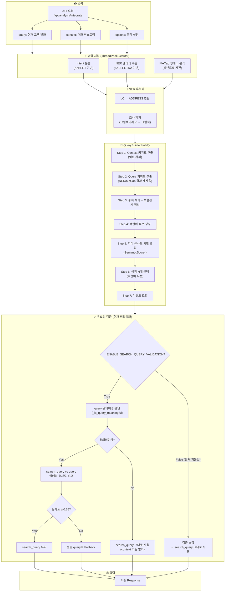

---

## 3. 단계별 상세 설명

### 3.1. API 진입점

**파일**: `api/endpoints/analysis/analysis_endpoints.py`

클라이언트가 `/api/analysis/integrate` 엔드포인트로 요청을 보냅니다.

**요청 예시**:
```json
{
  "workspace_id": "ws_001",
  "query": "크림색으로 주문했는데 반품하고 싶어요",
  "context": [
    {"role": "agent", "content": "네, 주문하신 상품의 반품 접수 도와드리겠습니다."},
    {"role": "user", "content": "네 부탁합니다"}
  ],
  "options": {
    "search_query_switch_types": {"ADDRESS": "주소"},
    "search_query_exclude_types": ["PS", "ID"]
  }
}
```

| 파라미터 | 설명 |
|----------|------|
| `query` | 현재 고객 발화 (가장 최근 메시지) |
| `context` | 이전 대화 히스토리 (user/agent 교대) |
| `options` | 테넌트별 동적 설정 (switch/exclude 타입 등) |
| `workspace_id` | 워크스페이스 ID (모델/사전 선택용) |

---

### 3.2. IntegrateService.process() — 통합 파이프라인

**파일**: `services/integrate_service.py`

전체 분석 파이프라인을 오케스트레이션하는 핵심 서비스입니다. 싱글톤 패턴으로 구현되어 있습니다.

#### 3.2.1. 리소스 준비

요청이 들어오면 테넌트/워크스페이스에 맞는 리소스를 준비합니다:

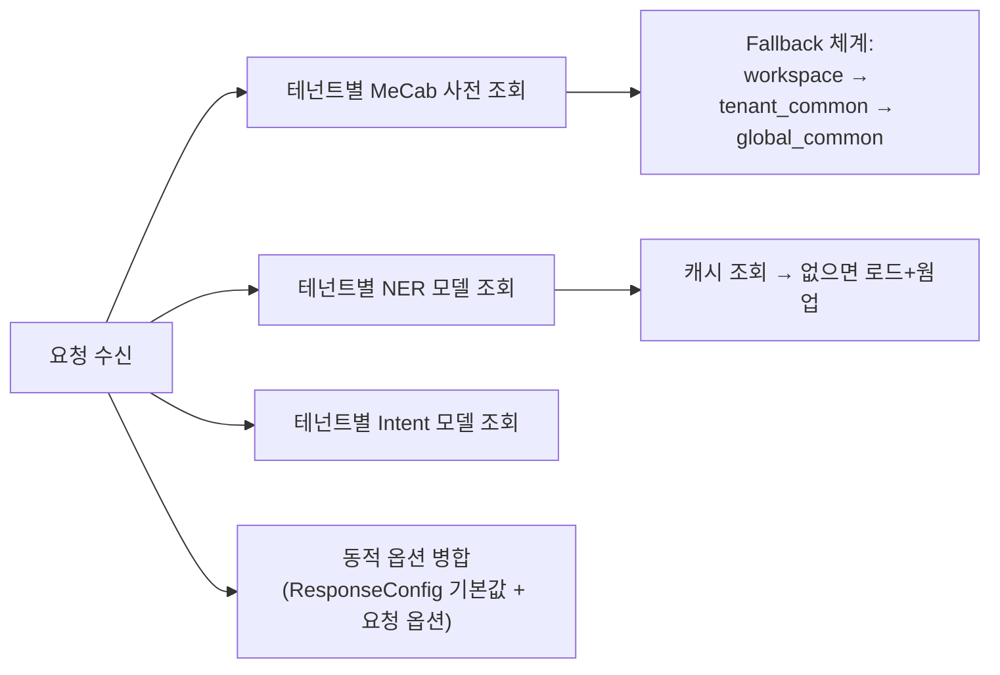

- **MeCab**: 테넌트별 사용자 사전이 적용된 MeCab 인스턴스를 사용합니다. 도메인 특화 단어(예: 상품명, 서비스명)를 올바르게 분석하기 위함입니다.
- **NER Tagger**: 테넌트/워크스페이스별로 파인튜닝된 ELECTRA 모델을 사용합니다. 캐시에 로드되어 있으면 재사용합니다.
- **동적 옵션**: 요청의 `options`와 `ResponseConfig` 기본값을 병합합니다. 요청 값이 우선합니다.

#### 3.2.2. 병렬 처리 (ThreadPoolExecutor)

3개의 분석 작업을 **동시에** 실행하여 레이턴시를 최소화합니다 (목표: < 50ms):

```mermaid
gantt
    title 병렬 처리 타임라인
    dateFormat X
    axisFormat %L ms

    section Thread 1
    Intent 분류 (KoBERT)     :0, 25

    section Thread 2
    NER 엔티티 추출 (ELECTRA)  :0, 20

    section Thread 3
    MeCab 형태소 분석          :0, 5
```

| 작업 | 모델/도구 | 입력 | 출력 |
|------|----------|------|------|
| Intent 분류 | KoBERT (`monologg/kobert-lm`) | query + context | `[{"label": "반품문의", "score": 0.95}]` |
| NER 추출 | KoELECTRA (Token Classification) | query | `[{"type": "COLOR", "value": "크림색", "start": 0, "end": 3}]` |
| MeCab 분석 | MeCab (테넌트 사전) | query | `[{"word": "크림색", "pos": "NNG"}, ...]` |

#### 3.2.3. NER 후처리

NER 결과에 대해 두 가지 후처리를 수행합니다:

1. **LC → ADDRESS 변환**: NER이 `LC`(Location)로 태깅한 엔티티가 실제 주소인지 판단하여 `ADDRESS`로 변환
2. **조사 제거**: NER이 조사까지 포함하여 추출한 경우 MeCab으로 뒤에서부터 조사를 제거

```
"크림색이라고" → MeCab 분석 → [크림색(NNG), 이라고(JKQ)] → 조사 "이라고" 제거 → "크림색"
"배송비가"     → MeCab 분석 → [배송비(NNG), 가(JKS)]    → 조사 "가" 제거     → "배송비"
```

---

### 3.3. QueryBuilder.build() — 검색어 조합

**파일**: `pipeline/query_builder.py`

NER과 MeCab 결과를 활용하여 최종 search_query를 조합하는 핵심 로직입니다.

#### Step 1: Context 키워드 추출 (역순)

Context(대화 히스토리)에서 키워드를 추출합니다. **역순으로 처리**하여 최근 발화의 키워드가 리스트 앞쪽에 배치됩니다.

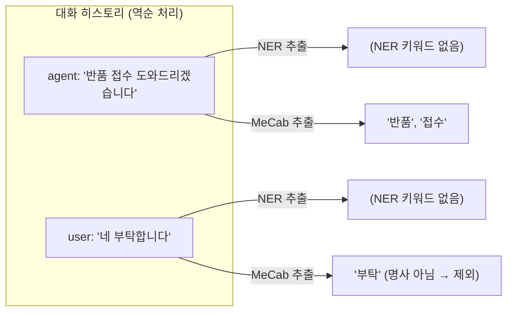

역순 처리의 이유: 상담사(agent)가 가장 최근에 제안한 핵심 키워드(예: "반품 접수")가 `max_keywords` 제한 내에 우선 포함되도록 하기 위함입니다.

#### Step 2: Query 키워드 추출 (결과 재사용)

현재 발화(query)에서 키워드를 추출합니다. **이전 병렬 처리의 NER/MeCab 결과를 그대로 재사용**하여 중복 호출을 방지합니다.

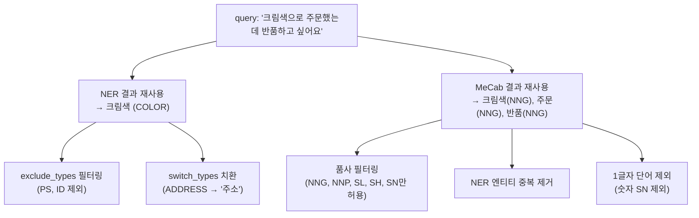

**MeCab 키워드 추출 기준 (허용 품사)**:

| 품사 태그 | 의미 | 예시 |
|----------|------|------|
| NNG | 일반명사 | 배송, 반품, 주문 |
| NNP | 고유명사 | 서울, 넷플릭스 |
| SL | 외국어 | iPhone, Galaxy |
| SH | 한자 | 中國 |
| SN | 숫자 | 1234 |

**제외되는 품사**: 조사(JK\*, JC, JX), 동사, 형용사, 부사, 감탄사 등

#### Step 3: 중복 제거 + 포함관계 정리

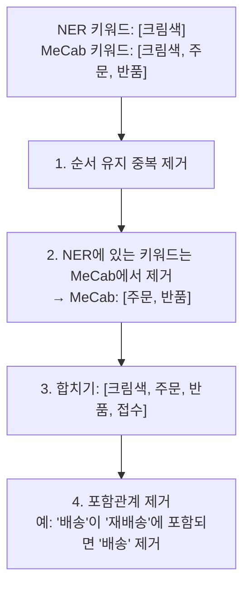

포함관계 제거의 핵심 원칙: **더 구체적인(긴) 키워드를 우선**합니다.
- "배송"과 "재배송"이 모두 있으면 → "재배송"만 유지
- "접수"와 "반품 접수"가 모두 있으면 → "반품 접수"만 유지

#### Step 4: 복합어 후보 생성

**파일**: `pipeline/morph_extractor.py` → `extract_compound_candidates()`

MeCab 분석 결과에서 연속된 명사들을 묶어 복합어 후보를 생성합니다.

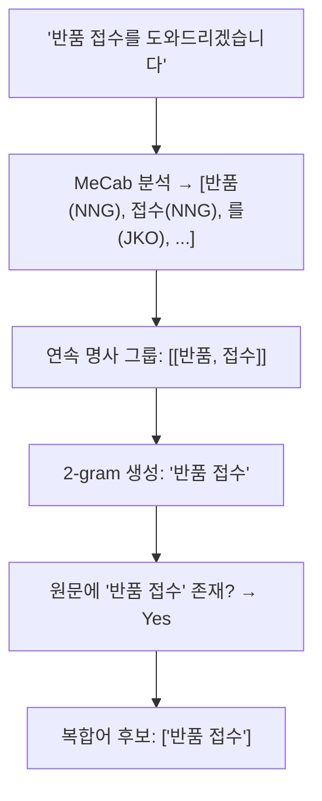

- Context와 Query 모두에서 복합어 후보를 생성합니다.
- 원문에서 **띄어쓰기 버전** 또는 **붙여쓰기 버전** 중 실제로 존재하는 형태를 사용합니다.
  - "반품 접수" (원문에 띄어쓰기로 존재) → "반품 접수"
  - "배송비" (원문에 붙여쓰기로 존재) → "배송비"

#### Step 5: 의미 유사도 기반 랭킹 (SemanticScorer)

**파일**: `pipeline/keyword_scorer/semantic_scorer.py`

Sentence Transformer 모델로 각 키워드가 Query+Context와 얼마나 의미적으로 관련 있는지 점수를 계산합니다.

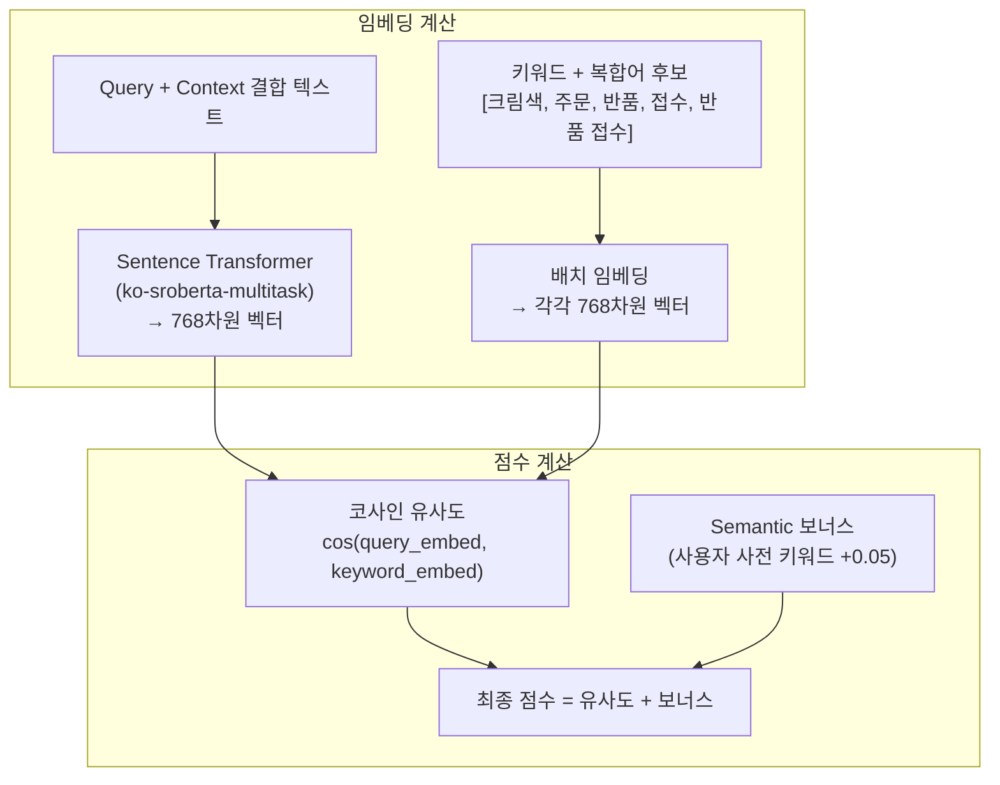

**점수 계산 공식**:

```
Score(keyword) = cosine_similarity(embed(Query+Context), embed(keyword)) + semantic_bonus
```

- **cosine_similarity**: -1 ~ 1 범위, 보통 0 ~ 1
- **semantic_bonus**: 사용자 사전에 등록된 키워드면 +0.05 (도메인 중요 키워드 우선)
- **모델**: `jhgan/ko-sroberta-multitask` (한국어 범용 Sentence Transformer)
- **배치 처리**: 모든 키워드를 한 번에 encode하여 효율성 향상

**랭킹 결과 예시**:

| 순위 | 키워드 | 유사도 | 보너스 | 최종 점수 |
|------|--------|--------|--------|-----------|
| 1 | 반품 접수 | 0.82 | 0.05* | 0.87 |
| 2 | 크림색 | 0.75 | 0.00 | 0.75 |
| 3 | 반품 | 0.73 | 0.00 | 0.73 |
| 4 | 주문 | 0.65 | 0.00 | 0.65 |
| 5 | 접수 | 0.60 | 0.00 | 0.60 |

\* 사용자 사전에 "반품 접수"가 등록된 경우

#### Step 6: 복합어 우선 선택

상위 N개(기본 5개)를 선택하되, **복합어가 선택되면 해당 복합어를 구성하는 개별 단어는 제외**합니다.

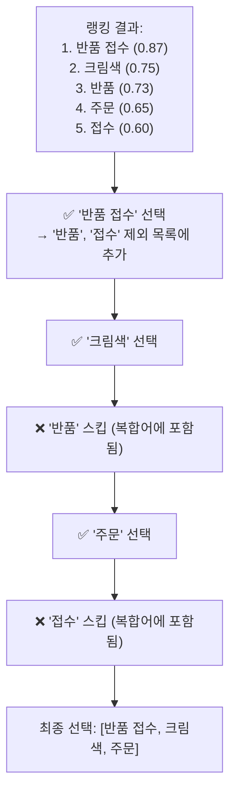

#### Step 7: 키워드 조합

선택된 키워드를 구분자(기본: `", "`)로 연결합니다:

```
search_query = "반품 접수, 크림색, 주문"
```

---

### 3.4. 유효성 검증 + Fallback

> **현재 상태**: `_ENABLE_SEARCH_QUERY_VALIDATION = False`로 **비활성화**되어 있습니다.
> 활성화하려면 `query_builder.py`의 해당 플래그를 `True`로 변경하면 됩니다.
> 비활성화 상태에서는 Step 7에서 조합된 search_query가 검증 없이 그대로 최종 결과로 반환됩니다.

활성화 시, 생성된 search_query가 원래 query의 의도를 충분히 반영하는지 2단계로 검증합니다.

#### 단계 1: Query 유의미성 판단

**함수**: `QueryBuilder._is_query_meaningful()`

MeCab 형태소 분석을 기반으로 query 자체가 검색에 충분한 정보를 담고 있는지 판단합니다.

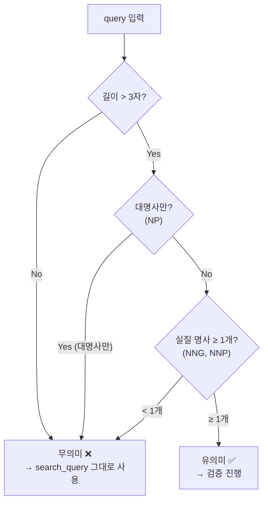

**예시**:

| query | 판단 | 이유 |
|-------|------|------|
| "네" | 무의미 | 길이 ≤ 3 |
| "그거요" | 무의미 | 대명사만 (NP) |
| "그래요" | 무의미 | 명사 0개 (동사만) |
| "배송 언제요" | 유의미 | 명사 1개 (배송) |
| "반품하고 싶어요" | 유의미 | 명사 1개 (반품) |

query가 무의미한 경우(예: "네", "그거요")는 context에서 추출한 키워드만으로 구성된 search_query를 그대로 사용합니다. 이는 고객이 상담사 제안에 동의하는 context 의존 발화이기 때문입니다.

#### 단계 2: 임베딩 유사도 검증

**함수**: `SemanticScorer.validate_search_query()`

query가 유의미한 경우, search_query와 원본 query의 임베딩 코사인 유사도를 비교합니다.

```
유사도 = cosine_similarity(embed("반품 접수, 크림색, 주문"), embed("크림색으로 주문했는데 반품하고 싶어요"))
```

- **Threshold**: 0.65 (기본값)
- 유사도 ≥ 0.65 → search_query 사용
- 유사도 < 0.65 → 원본 query로 Fallback

이 검증이 필요한 이유: Context 키워드가 현재 query 의도와 무관한 경우를 잡아내기 위함입니다. 예를 들어, 이전 대화에서 "결제 오류"를 논의했지만 현재 query가 "배송 날짜"에 대한 것이라면, Context 키워드가 의도를 오염시킬 수 있습니다.

---

## 4. 설정 체계

### 4.1. ResponseConfig (기본값)

**파일**: `core/response_config.py`

| 설정 | 값 | 설명 |
|------|---|------|
| `SEARCH_QUERY_SWITCH_TYPES` | `{"ADDRESS": "주소", "ORDER_ID": "주문번호"}` | 해당 타입의 value를 대표 단어로 치환 |
| `SEARCH_QUERY_EXCLUDE_TYPES` | `{"PS", "ID"}` | 해당 타입을 search_query에서 완전 제외 |

### 4.2. 동적 옵션 (요청별 오버라이드)

API 요청의 `options`로 기본값을 오버라이드할 수 있습니다:

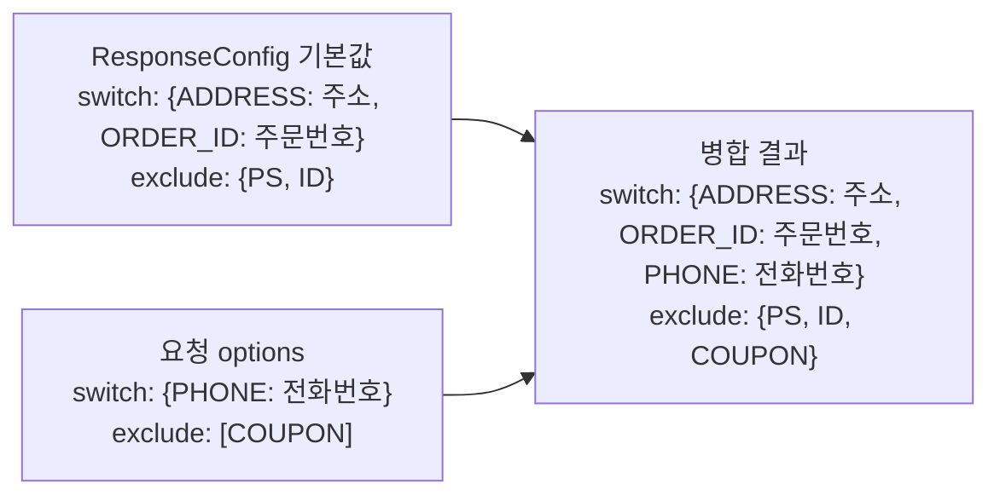

- **switch_types**: 기본값과 요청값이 **병합** (요청값 우선)
- **exclude_types**: 기본값과 요청값이 **합집합**

---

## 5. 전체 데이터 흐름 예시

실제 요청부터 응답까지의 데이터 변환 과정을 추적합니다.

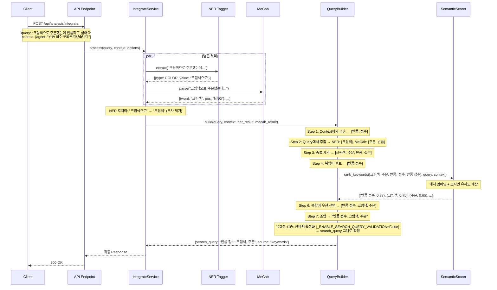

**최종 Response**:
```json
{
  "query": "크림색으로 주문했는데 반품하고 싶어요",
  "intent": [{"label": "반품문의", "score": 0.95}],
  "search_query": "반품 접수, 크림색, 주문",
  "masked_query": "크림색으로 주문했는데 반품하고 싶어요",
  "entities": {
    "COLOR": [{"value": "크림색", "start": 0, "end": 3, "score": 0.98}]
  },
  "keywords": ["크림색", "주문", "반품"],
  "latency_ms": 35.2
}
```

---

## 6. 핵심 컴포넌트 아키텍처

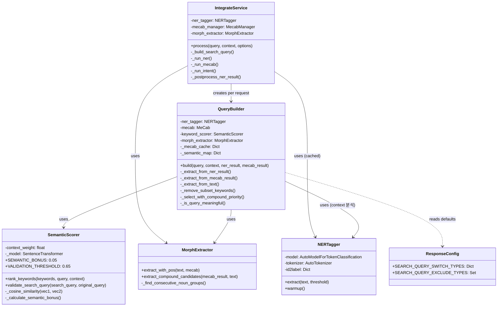

---

## 7. 성능 최적화

| 기법 | 설명 | 효과 |
|------|------|------|
| **병렬 처리** | Intent, NER, MeCab을 ThreadPoolExecutor로 동시 실행 | 레이턴시 최대 3배 단축 |
| **MeCab 캐시** | 동일 텍스트에 대한 중복 MeCab 호출 방지 (요청별 캐시) | MeCab 호출 수 감소 |
| **NER/MeCab 결과 재사용** | 병렬 처리 결과를 QueryBuilder에 전달 | 중복 추론 제거 |
| **배치 임베딩** | 모든 키워드를 한 번에 Sentence Transformer encode | GPU 활용 극대화 |
| **지연 로딩** | Sentence Transformer 모델을 첫 사용 시 로드 | 서버 시작 시간 단축 |
| **모델 캐시** | NER Tagger를 테넌트별로 캐시 | 모델 로드 시간 제거 |
| **웜업** | 모델 로드 후 3회 더미 추론으로 JIT 최적화 | 첫 요청 레이턴시 개선 |

---

## 8. Fallback 시나리오 정리

| 상황 | 동작 |
|------|------|
| NER 모델 없음 | MeCab만으로 키워드 추출 |
| MeCab 분석 실패 | NER 키워드만 사용 |
| SemanticScorer 미설치 | 순서 기반 키워드 선택 (상위 N개) |
| 키워드 0개 추출 | 원본 query를 search_query로 사용 |
| 검증 비활성화 (현재 기본값) | search_query 그대로 사용 (검증 스킵) |
| 검증 실패 (유사도 < 0.65, 활성화 시) | 원본 query로 Fallback |
| Query 무의미 ("네", "그거요", 활성화 시) | Context 키워드로 구성된 search_query 유지 |
| 전체 build 실패 | 원본 query를 search_query로 반환 |

---

## 9. 관련 파일 목록

| 파일 경로 | 역할 |
|----------|------|
| `services/integrate_service.py` | 통합 파이프라인 오케스트레이션 |
| `pipeline/query_builder.py` | search_query 생성 핵심 로직 |
| `pipeline/keyword_scorer/semantic_scorer.py` | 의미 유사도 기반 키워드 랭킹/검증 |
| `pipeline/ner_tagger.py` | ELECTRA 기반 NER 추론 |
| `pipeline/morph_extractor.py` | MeCab 형태소 추출 + 복합어 후보 생성 |
| `pipeline/keyword_extractor.py` | Query 키워드 추출 (별도 응답 필드) |
| `core/response_config.py` | 기본 설정 (switch/exclude 타입) |
| `api/endpoints/analysis/analysis_endpoints.py` | API 엔드포인트 정의 |
| `managers/mecab_manager.py` | 테넌트별 MeCab 인스턴스 관리 |

---

## 10. 요약

### 한 줄 요약

> **search_query는 고객 발화(query)와 대화 히스토리(context)에서 NER + MeCab으로 키워드를 추출하고, Sentence Transformer로 의미 유사도 기반 랭킹을 거쳐 상위 키워드를 조합한 검색엔진 전달용 검색어입니다.**

### 핵심 처리 흐름 요약

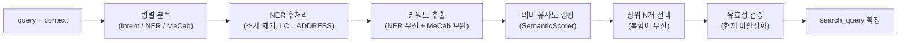

### 주요 기술 스택 요약

| 구분 | 기술 | 용도 |
|------|------|------|
| NER | KoELECTRA (Token Classification) | 핵심 엔티티 추출 (주소, 주문번호, 이름 등) |
| 형태소 분석 | MeCab (테넌트별 사전) | 명사 키워드 추출 + 조사 제거 |
| 키워드 랭킹 | Sentence Transformer (`ko-sroberta-multitask`) | 의미 유사도 기반 키워드 순위 결정 |
| 복합어 처리 | MorphExtractor (연속 명사 N-gram) | "반품 접수" 같은 복합어 후보 생성 |
| 유효성 검증 | 임베딩 코사인 유사도 | search_query가 원본 의도를 반영하는지 검증 (**현재 비활성화**) |
| 병렬 처리 | ThreadPoolExecutor (3 workers) | Intent/NER/MeCab 동시 실행으로 레이턴시 최소화 |

### 설계 핵심 포인트

1. **NER 우선 + MeCab 보완**: NER로 정확한 엔티티를 먼저 뽑고, MeCab으로 빠진 명사 키워드를 보완합니다.
2. **Context 역순 처리**: 상담사(agent)의 최근 발화 키워드가 우선 포함되어 대화 흐름을 반영합니다.
3. **복합어 우선 선택**: "반품 접수"가 선택되면 "반품", "접수" 개별 단어는 자동 제외됩니다.
4. **2단계 유효성 검증** (현재 비활성화): query 유의미성 판단 → 임베딩 유사도 비교로 잘못된 search_query를 걸러냅니다. `_ENABLE_SEARCH_QUERY_VALIDATION = True`로 활성화 가능합니다.
5. **다중 Fallback**: 어떤 컴포넌트가 실패해도 원본 query를 최후의 안전망으로 사용합니다.
