# Search Query 생성을 위한 학습 과정

> `search_query` 생성에 필요한 모델들의 학습/파인튜닝 과정을 설명합니다.
> `search_query`는 단일 모델이 아닌 **여러 컴포넌트의 조합**으로 생성됩니다.

---

## 1. 개요: search_query에 필요한 학습 대상

`search_query` 생성은 **별도의 단일 모델을 학습하는 것이 아닙니다.** 여러 컴포넌트가 협력하여 만들어지며, 이 중 **NER 모델**과 **Intent 모델**은 테넌트별로 파인튜닝이 필요합니다.

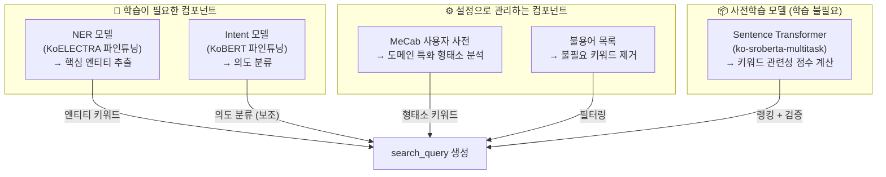

| 컴포넌트 | 학습 필요 | 베이스 모델 | 역할 |
|----------|----------|------------|------|
| **NER 모델** | **필수** (테넌트별) | KoELECTRA | 핵심 엔티티(주문번호, 주소, 이름 등) 추출 |
| **Intent 모델** | **필수** (테넌트별) | KoBERT | 고객 의도 분류 (검색어 생성의 보조 정보) |
| MeCab 사전 | 설정 관리 | mecab-ko-dic | 도메인 특화 단어 분석 |
| Sentence Transformer | 불필요 | ko-sroberta-multitask | 키워드 의미 유사도 계산 (범용) |
| 불용어 목록 | 설정 관리 | - | 불필요 키워드 필터링 |

---

## 2. NER 모델 학습 (핵심)

NER(Named Entity Recognition)은 `search_query` 생성의 **가장 중요한 구성 요소**입니다. 고객 발화에서 핵심 엔티티(인물명, 주소, 주문번호 등)를 정확하게 추출해야 검색에 유용한 키워드를 얻을 수 있습니다.

### 2.1. 학습 파이프라인 전체 흐름

**파일**: `nlp_engine_finetune_service/pipeline/ner_pipeline/`

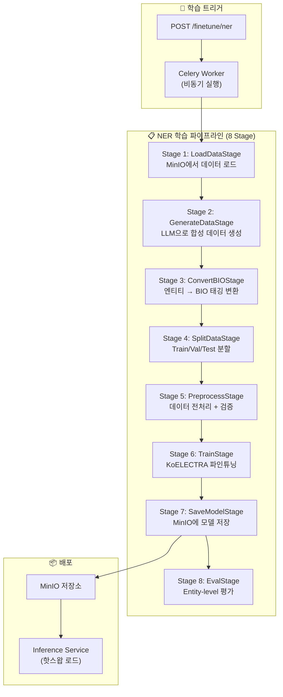

### 2.2. Stage별 상세 설명

#### Stage 1: LoadDataStage — 데이터 로드

**파일**: `pipeline/ner_pipeline/stages/load_data_stage.py`

MinIO에서 엔티티 정의와 원본 학습 데이터를 로드합니다.

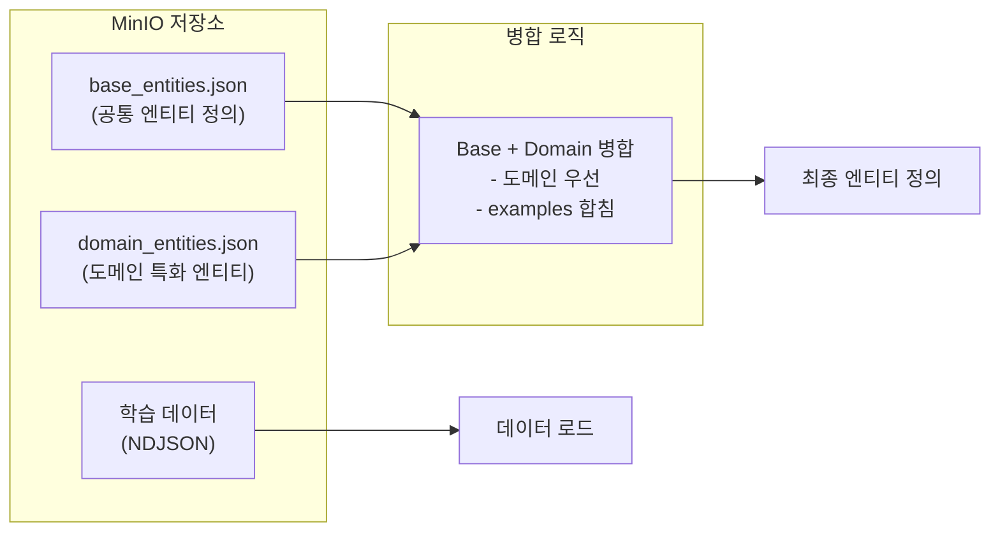

**엔티티 정의 형식**:
```json
{
  "entities": [
    {
      "tag": "PS",
      "name": "Person",
      "name_ko": "인물",
      "description": "사람 이름",
      "examples": ["김민수", "이영희", "박지훈"],
      "custom_examples": [
        {"text": "홍길동", "hint": "고전 소설 인물"}
      ]
    },
    {
      "tag": "ORDER_ID",
      "name": "OrderID", 
      "name_ko": "주문번호",
      "description": "주문 식별 번호",
      "examples": ["12345678", "A-2024-001"]
    }
  ]
}
```

- **Base 엔티티**: 모든 테넌트에 공통으로 적용되는 기본 엔티티 (PS, LC, ORDER_ID 등)
- **Domain 엔티티**: 테넌트가 직접 정의한 도메인 특화 엔티티
- 동일 태그가 있으면 도메인 엔티티가 우선, examples는 합쳐짐

---

#### Stage 2: GenerateDataStage — LLM 데이터 생성

**파일**: `pipeline/ner_pipeline/stages/generate_data_stage.py`

사람이 직접 라벨링하는 대신, LLM(OpenAI GPT / Google Gemini)을 활용하여 학습 데이터를 대량 생성합니다.

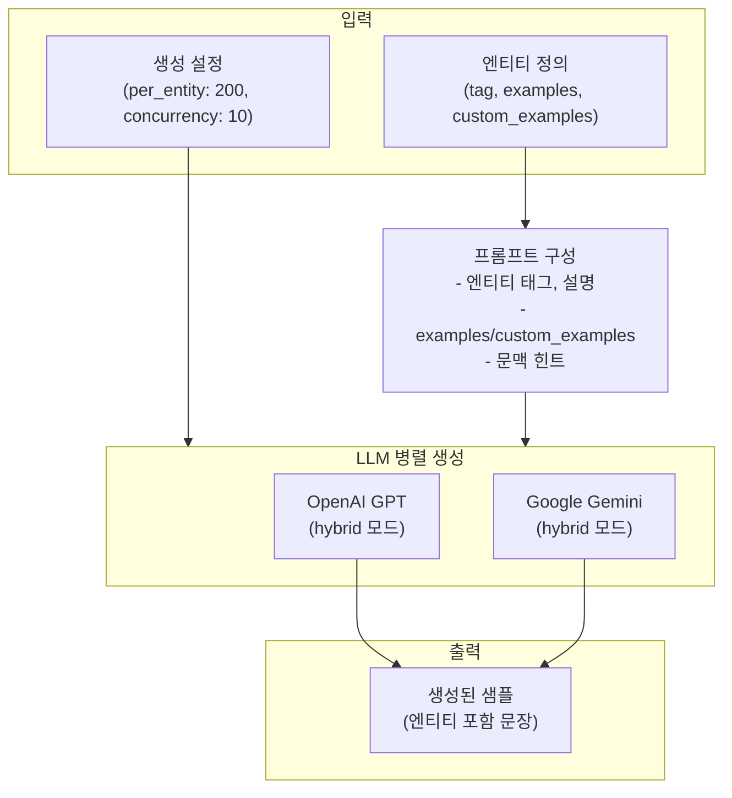

**생성 데이터 형식**:
```json
{
  "text": "김민수님이 서울시 강남구 테헤란로 123으로 배송을 변경해주세요.",
  "entities": [
    {"start": 0, "end": 3, "label": "PS", "text": "김민수"},
    {"start": 5, "end": 19, "label": "ADDRESS", "text": "서울시 강남구 테헤란로 123"}
  ]
}
```

**생성 설정**:

| 파라미터 | 기본값 | 설명 |
|---------|--------|------|
| `generation_platform` | `"hybrid"` | OpenAI + Gemini 혼합 사용 |
| `generation_per_entity` | `200` | 엔티티 타입당 생성 개수 |
| `generation_concurrency_openai` | `10` | OpenAI 동시 요청 수 |
| `generation_concurrency_google` | `10` | Gemini 동시 요청 수 |
| `custom_examples_ratio` | `0.8` | custom_examples 사용 비율 |

**기존 데이터 재사용**: `generated_data_path`를 제공하면 LLM 생성을 건너뛰고 MinIO에서 기존 생성 데이터를 재사용합니다. 이를 통해 비용과 시간을 절약할 수 있습니다.

---

#### Stage 3: ConvertBIOStage — BIO 태깅 변환

**파일**: `pipeline/ner_pipeline/stages/convert_bio_stage.py`

엔티티 어노테이션을 Token Classification 학습에 필요한 **BIO 형식**으로 변환합니다.

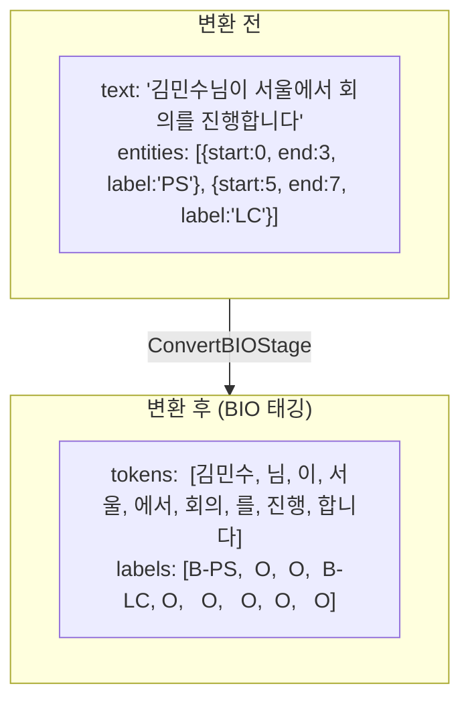

**BIO 태깅 규칙**:

| 태그 | 의미 | 예시 |
|------|------|------|
| `B-{TYPE}` | 엔티티의 시작 (Beginning) | `B-PS` = 인물명 시작 |
| `I-{TYPE}` | 엔티티의 내부 (Inside) | `I-PS` = 인물명 계속 |
| `O` | 엔티티 아님 (Outside) | 일반 텍스트 |

예를 들어 "남궁민수"가 2개 토큰으로 분리될 경우:
```
토큰: [남궁, 민수, 님, 이, ...]
라벨: [B-PS, I-PS, O,  O,  ...]
```

---

#### Stage 4: SplitDataStage — 데이터 분할

**파일**: `pipeline/ner_pipeline/stages/split_data_stage.py`

BIO 변환된 데이터를 Train/Validation/Test 세트로 분할합니다.

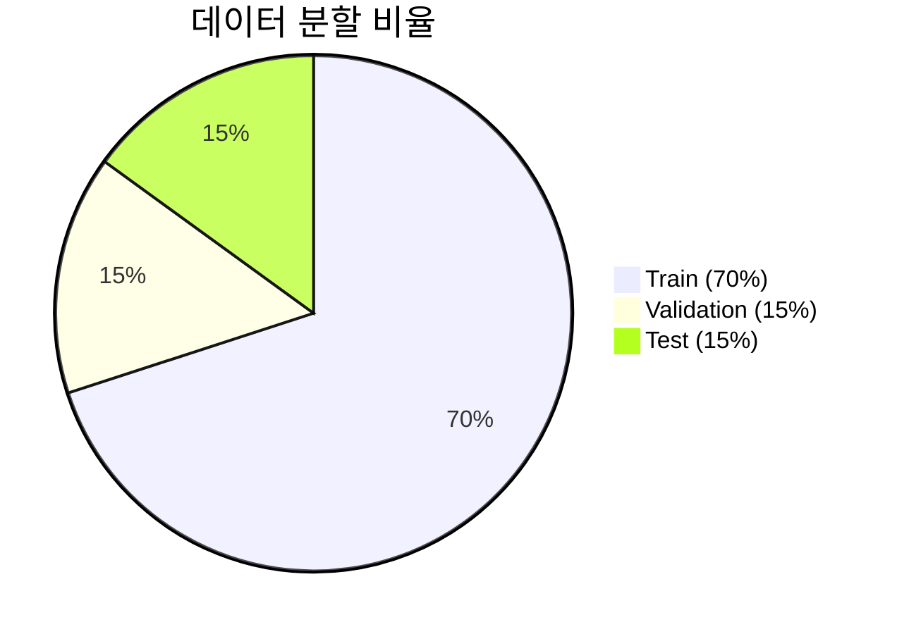

| 파라미터 | 기본값 | 설명 |
|---------|--------|------|
| `train_ratio` | 0.7 | 학습 데이터 비율 |
| `val_ratio` | 0.15 | 검증 데이터 비율 |
| `test_ratio` | 0.15 | 평가 데이터 비율 |
| `random_state` | 42 | 재현성을 위한 랜덤 시드 |

이 단계에서 **라벨 매핑**(label2id, id2label)도 함께 생성됩니다:
```json
{
  "label2id": {"O": 0, "B-PS": 1, "I-PS": 2, "B-LC": 3, "I-LC": 4, ...},
  "id2label": {"0": "O", "1": "B-PS", "2": "I-PS", "3": "B-LC", "4": "I-LC", ...}
}
```

---

#### Stage 5: PreprocessStage — 전처리

**파일**: `pipeline/ner_pipeline/stages/preprocess_stage.py`

데이터를 모델 학습에 적합한 형식으로 변환하고 검증합니다.

- 토크나이저로 텍스트를 서브워드 토큰화
- 서브워드 분할에 맞춰 BIO 라벨 정렬 (label alignment)
- 최대 시퀀스 길이(128) 초과 시 잘라냄
- 데이터 무결성 검증

**서브워드 라벨 정렬 예시**:
```
원본 토큰:     [김민수,      서울,      ...]
서브워드 토큰: [김, ##민, ##수, 서, ##울,  ...]
라벨:         [B-PS, I-PS, I-PS, B-LC, I-LC, ...]
```

서브워드로 분할된 토큰에 대해:
- 첫 번째 서브워드: 원본 라벨 유지 (`B-PS`)
- 나머지 서브워드: `I-{TYPE}`로 변경
- 특수 토큰(`[CLS]`, `[SEP]`, `[PAD]`): `-100` (무시)

---

#### Stage 6: TrainStage — 모델 학습

**파일**: `pipeline/ner_pipeline/stages/train_stage.py`

KoELECTRA 기반 Token Classification 모델을 파인튜닝합니다.

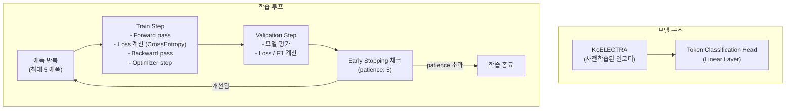

**학습 설정**:

| 파라미터 | 기본값 | 설명 |
|---------|--------|------|
| `base_model_name` | `Leo97/KoELECTRA-small-v3-modu-ner` | 베이스 모델 |
| `epochs` | `5` | 최대 에폭 수 |
| `batch_size` | `16` | 배치 크기 |
| `learning_rate` | `5e-5` | 학습률 |
| `max_seq_length` | `128` | 최대 시퀀스 길이 |
| `warmup_ratio` | `0.1` | Learning rate warmup 비율 |
| `weight_decay` | `0.01` | 가중치 감쇠 |
| `early_stopping_patience` | `5` | Early stopping 인내 횟수 |

**베이스 모델 선택 이유**:
- `Leo97/KoELECTRA-small-v3-modu-ner`는 한국어 NER 태스크에 이미 사전학습된 모델
- ELECTRA 아키텍처는 BERT 대비 더 효율적인 사전학습을 수행하여 적은 데이터로도 좋은 성능
- `small` 크기로 추론 속도가 빠름 (실시간 서비스 목표: < 50ms)

**학습 과정 모니터링**:
- 매 에폭마다 Train Loss, Val Loss, Accuracy, F1 Score 기록
- DB(`TrainingEpochLog`)에 에폭별 메트릭 저장
- Redis를 통해 실시간 진행 상황 발행

---

#### Stage 7: SaveModelStage — 모델 저장

**파일**: `pipeline/ner_pipeline/stages/save_model_stage.py`

학습된 모델을 HuggingFace 포맷으로 MinIO에 저장합니다.

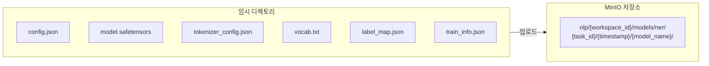

**저장 파일 구성**:

| 파일 | 설명 |
|------|------|
| `config.json` | 모델 설정 (label2id, id2label 포함) |
| `model.safetensors` | 모델 가중치 |
| `tokenizer_config.json` | 토크나이저 설정 |
| `vocab.txt` | 어휘 사전 |
| `label_map.json` | 라벨 매핑 (추론 서비스 호환용) |
| `train_info.json` | 학습 정보 (seed, best_val_loss, 에폭 수 등) |

**MinIO 저장 경로**:
```
nlp/{workspace_id}/models/ner/{task_id}/{timestamp}/{model_name}/
```

---

#### Stage 8: EvalStage — 모델 평가

**파일**: `pipeline/ner_pipeline/stages/eval_stage.py`

Test 세트로 Entity-level 평가를 수행합니다.

**평가 메트릭**:

| 메트릭 | 설명 |
|--------|------|
| Accuracy | 전체 토큰 정확도 |
| Macro F1 | 엔티티 타입별 F1의 평균 |
| Per-entity Precision/Recall/F1 | 각 엔티티 타입별 세부 성능 |

**Classification Report 예시**:
```
              precision    recall  f1-score   support

       B-PS       0.95      0.92      0.93        50
       I-PS       0.93      0.90      0.91        30
       B-LC       0.88      0.85      0.86        40
       B-ORDER_ID 0.97      0.95      0.96        35
       O          0.99      0.99      0.99      1200

   macro avg      0.94      0.92      0.93      1355
```

---

### 2.3. NER 학습 데이터 흐름 요약

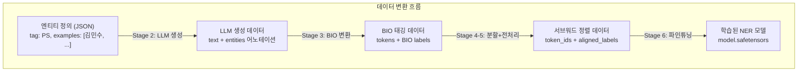

---

## 3. Intent 모델 학습

Intent 분류 모델은 `search_query` 생성의 **보조 컴포넌트**입니다. 직접적으로 search_query 키워드를 결정하지는 않지만, 최종 응답에 intent 정보를 함께 제공하여 검색엔진의 의도 기반 필터링에 활용됩니다.

### 3.1. 학습 파이프라인 전체 흐름

**파일**: `nlp_engine_finetune_service/pipeline/intent_pipeline/`

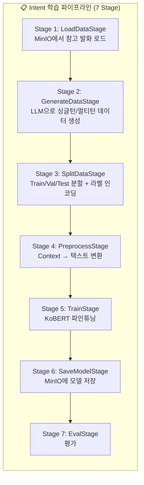

### 3.2. NER과의 차이점

| 항목 | NER 모델 | Intent 모델 |
|------|---------|-------------|
| **태스크** | Token Classification | Sequence Classification |
| **베이스 모델** | KoELECTRA (`Leo97/KoELECTRA-small-v3-modu-ner`) | KoBERT (`monologg/kobert-lm`) |
| **입력 형식** | 단일 텍스트 | `[USER] ... [AGENT] ... [USER] query` |
| **출력** | 토큰별 BIO 태그 | 단일 Intent 라벨 |
| **Context 활용** | 학습 시 미사용 | 학습 시 멀티턴 Context 포함 |
| **데이터 생성** | 엔티티 어노테이션 포함 문장 | 싱글턴 + 멀티턴 대화 |
| **에폭** | 5 | 50 |

### 3.3. 데이터 생성 특징

Intent 모델은 **멀티턴 대화 데이터**도 생성합니다:

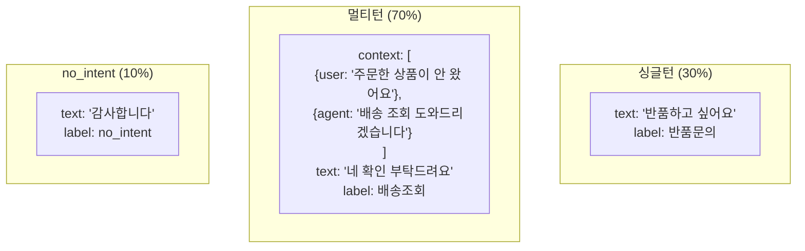

| 설정 | 기본값 | 설명 |
|------|--------|------|
| `generation_total_per_intent` | 100 | Intent별 총 생성 수 |
| `generation_singleton_ratio` | 0.3 | 싱글턴 비율 |
| `generation_multiturn_ratio` | 0.7 | 멀티턴 비율 |
| `generation_no_intent_ratio` | 0.1 | no_intent 비율 |
| `generation_max_context_turns` | 4 | 최대 Context 턴 수 |
| `generation_turn_distribution` | `{1:0.10, 2:0.15, 3:0.25, 4:0.50}` | 턴 수별 비율 |

### 3.4. 학습용 텍스트 변환

멀티턴 Context를 단일 텍스트로 변환합니다:

```
입력:
  context: [{role: "user", content: "주문한 상품이 안 왔어요"}, 
            {role: "agent", content: "배송 조회 도와드리겠습니다"}]
  query: "네 확인 부탁드려요"

변환 결과:
  "[USER] 주문한 상품이 안 왔어요 [AGENT] 배송 조회 도와드리겠습니다 [USER] 네 확인 부탁드려요"
```

---

## 4. MeCab 사용자 사전 관리

MeCab 사용자 사전은 모델 학습이 아니라 **설정 관리** 영역이지만, search_query 품질에 큰 영향을 미칩니다.

### 4.1. 사용자 사전의 역할

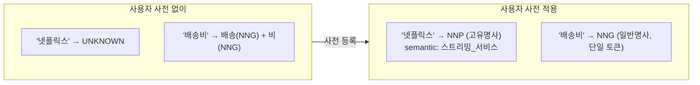

### 4.2. Semantic 정보와 SemanticScorer 연동

MeCab 사용자 사전에 등록된 키워드의 `semantic` 필드는 SemanticScorer의 보너스 점수에 활용됩니다:

```
사전 등록: 넷플릭스,NNP,스트리밍_서비스
                       ↑ semantic 필드

→ MeCab 분석 결과: {"word": "넷플릭스", "pos": "NNP", "semantic": "스트리밍_서비스"}
→ QueryBuilder._semantic_map에 저장
→ SemanticScorer에서 +0.05 보너스 부여
```

### 4.3. 테넌트별 사전 Fallback 체계

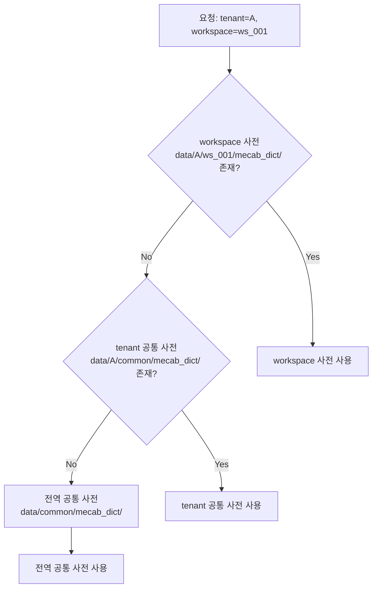

---

## 5. Sentence Transformer (학습 불필요)

`jhgan/ko-sroberta-multitask`는 범용 한국어 문장 임베딩 모델로, **별도의 파인튜닝 없이** 사용됩니다.

### 5.1. 역할

| 용도 | 설명 |
|------|------|
| **키워드 랭킹** | Query+Context와 각 키워드의 의미 유사도 계산 |
| **search_query 검증** | 생성된 search_query가 원본 query 의도를 반영하는지 확인 |

### 5.2. 파인튜닝이 필요 없는 이유

- 범용 문장 유사도 모델로, 다양한 도메인에서 안정적 성능
- 키워드 랭킹은 상대적 순위만 중요하므로 절대적 정밀도 불필요
- 검증 Threshold(0.65)로 충분히 조절 가능
- 환경변수 `SENTENCE_TRANSFORMER_MODEL`로 다른 모델로 교체 가능

---

## 6. 학습 인프라 아키텍처

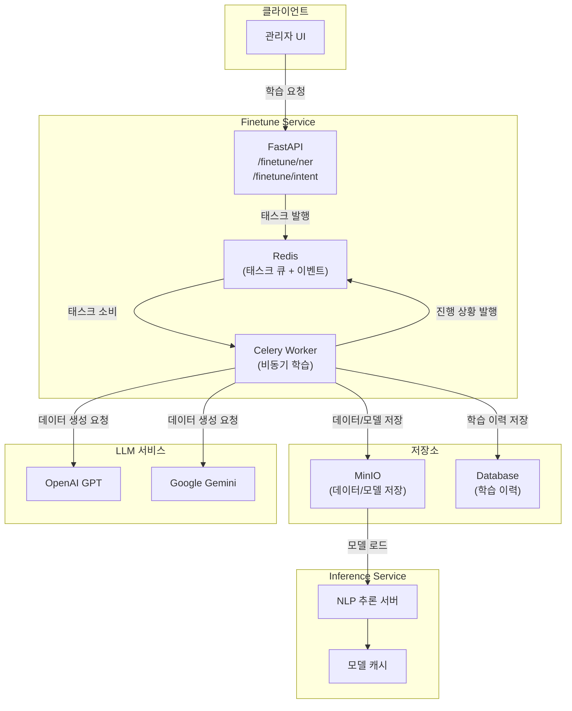

### 6.1. 비동기 학습 실행

학습은 Celery Worker를 통해 비동기로 실행됩니다:

1. **API 요청** → FastAPI가 태스크를 Redis 큐에 발행
2. **Celery Worker** → 큐에서 태스크를 소비하여 학습 파이프라인 실행
3. **진행 상황** → Redis를 통해 실시간 상태 업데이트 (QUEUED → RUNNING → COMPLETED/FAILED)
4. **학습 이력** → DB에 에폭별 메트릭 기록

### 6.2. 모델 배포 (핫스왑)

학습 완료 후 Inference Service에 새 모델을 적용하는 과정:

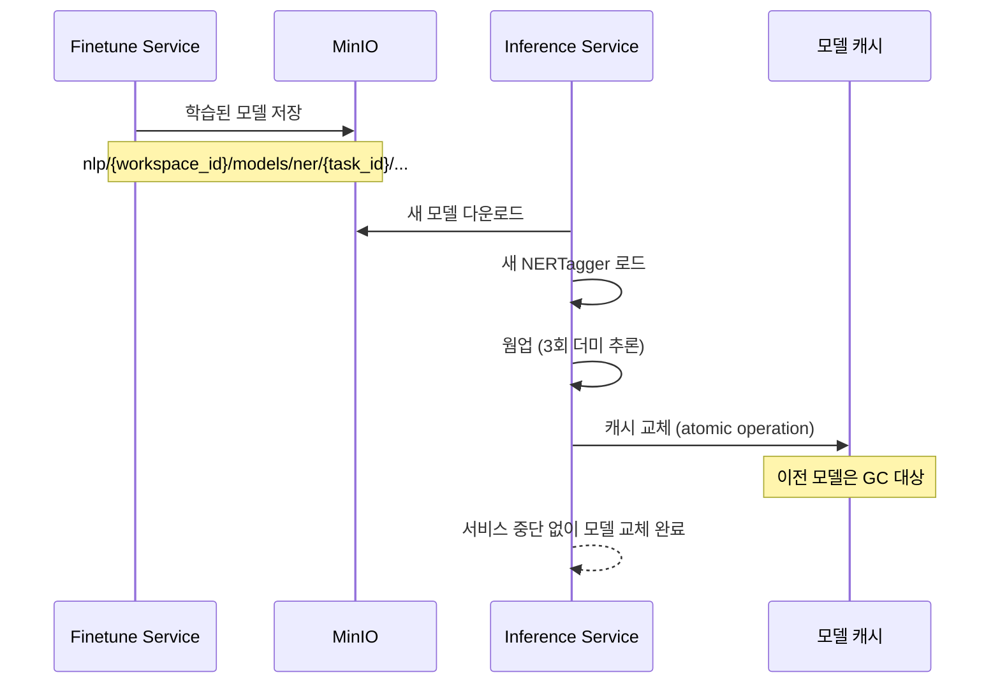

핫스왑의 핵심: 새 모델의 로드와 웜업이 완료된 후에야 캐시를 교체하므로, 교체 순간에 서비스 중단이 발생하지 않습니다.

---

## 7. 학습 API 인터페이스

### 7.1. NER 학습 요청

```
POST /finetune/ner
```

```json
{
  "workspace_id": "ws_001",
  "task_id": "ner_task_001",
  "model_name": "ner_v2",
  "dataset_obj_name": "nlp/ws_001/datasets/ner/entities.json",
  "base_model_name": "Leo97/KoELECTRA-small-v3-modu-ner",
  "epochs": 5,
  "batch_size": 16,
  "learning_rate": 5e-5,
  "max_seq_length": 128,
  "generation_per_entity": 200,
  "generation_platform": "hybrid"
}
```

### 7.2. Intent 학습 요청

```
POST /finetune/intent
```

```json
{
  "workspace_id": "ws_001",
  "task_id": "intent_task_001",
  "model_name": "intent_v2",
  "dataset_obj_name": "nlp/ws_001/datasets/intent/utterances.ndjson",
  "base_model_name": "monologg/kobert-lm",
  "epochs": 50,
  "batch_size": 8,
  "learning_rate": 2e-5,
  "generation_total_per_intent": 100
}
```

### 7.3. 학습 상태 조회

```
POST /finetune/status
```

```json
{
  "task_id": "ner_task_001"
}
```

**응답 상태**: `QUEUED` → `RUNNING` → `COMPLETED` / `FAILED`

---

## 8. 학습 품질과 search_query 품질의 관계

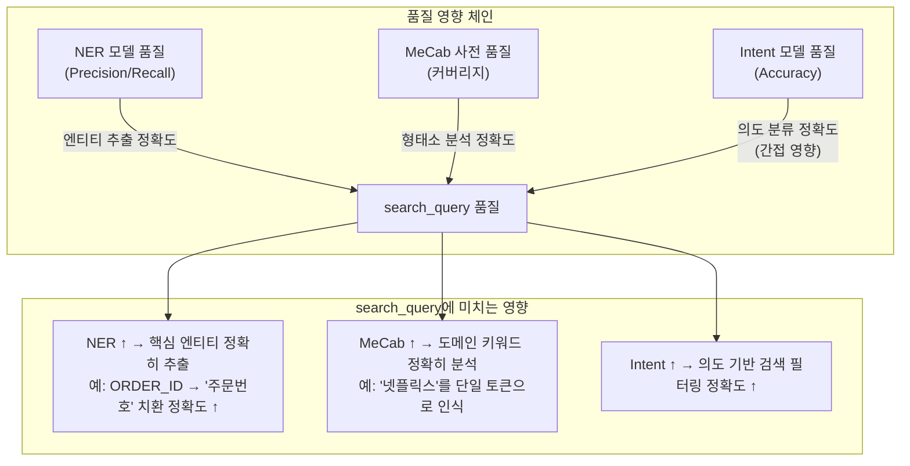

### 학습 품질 개선 체크리스트

| 항목 | 확인 사항 |
|------|----------|
| **NER 데이터 다양성** | 엔티티별 예시가 다양한 패턴을 포함하는가? |
| **NER custom_examples** | 도메인 특화 엔티티 예시가 충분한가? |
| **NER 생성 품질** | LLM 생성 데이터의 품질이 양호한가? (이상 데이터 없는지) |
| **Intent 멀티턴 비율** | 멀티턴 데이터가 충분히 포함되었는가? |
| **MeCab 사전** | 도메인 특화 용어가 모두 사전에 등록되었는가? |
| **불용어 목록** | 검색에 불필요한 일반적 단어가 충분히 정의되었는가? |

---

## 9. 관련 파일 목록

### Finetune Service (학습)

| 파일 경로 | 역할 |
|----------|------|
| `workers/ner_task.py` | NER Celery 태스크 |
| `workers/intent_task.py` | Intent Celery 태스크 |
| `executors/ner_executor.py` | NER 파이프라인 실행기 |
| `executors/intent_executor.py` | Intent 파이프라인 실행기 |
| `pipeline/ner_pipeline/stages/*.py` | NER 파이프라인 스테이지들 |
| `pipeline/intent_pipeline/stages/*.py` | Intent 파이프라인 스테이지들 |
| `pipeline/ner_pipeline/model.py` | NERDataset (PyTorch) |
| `pipeline/intent_pipeline/model.py` | IntentDataset (PyTorch) |
| `pipeline/ner_pipeline/state.py` | NER 파이프라인 상태 모델 |
| `pipeline/intent_pipeline/state.py` | Intent 파이프라인 상태 모델 |
| `services/finetune_service.py` | 파인튜닝 요청 처리 서비스 |
| `api/endpoints/finetune_endpoints.py` | 파인튜닝 API 엔드포인트 |

### Inference Service (추론 — 학습된 모델 사용)

| 파일 경로 | 역할 |
|----------|------|
| `pipeline/ner_tagger.py` | 학습된 NER 모델로 추론 |
| `pipeline/intent_tagger.py` | 학습된 Intent 모델로 추론 |
| `pipeline/query_builder.py` | NER+MeCab 결과로 search_query 생성 |
| `pipeline/keyword_scorer/semantic_scorer.py` | 키워드 랭킹 + search_query 검증 |
| `managers/mecab_manager.py` | 테넌트별 MeCab 사전 관리 |

---

## 10. 요약

### 한 줄 요약

> **search_query 생성에는 단일 모델이 아닌 NER(KoELECTRA) + Intent(KoBERT) + MeCab 사전 + Sentence Transformer의 조합이 필요하며, NER과 Intent 모델은 테넌트별로 LLM 합성 데이터를 활용하여 파인튜닝합니다.**

### 학습 대상 요약

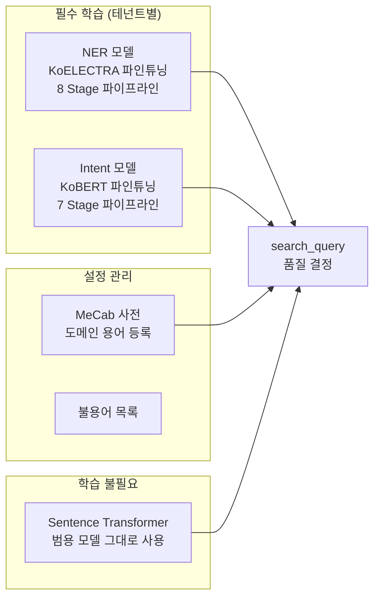

### NER 학습 파이프라인 요약

| Stage | 이름 | 핵심 동작 |
|-------|------|----------|
| 1 | LoadData | MinIO에서 엔티티 정의 로드 (Base + Domain 병합) |
| 2 | GenerateData | LLM(GPT/Gemini)으로 엔티티 포함 문장 대량 생성 |
| 3 | ConvertBIO | 엔티티 어노테이션 → BIO 태깅 변환 |
| 4 | SplitData | Train(70%)/Val(15%)/Test(15%) 분할 + 라벨 매핑 생성 |
| 5 | Preprocess | 서브워드 토큰화 + BIO 라벨 정렬 |
| 6 | Train | KoELECTRA 파인튜닝 (Early Stopping, 5 에폭) |
| 7 | SaveModel | HuggingFace 포맷으로 MinIO 저장 |
| 8 | Eval | Entity-level Precision/Recall/F1 평가 |

### Intent 학습 파이프라인 요약

| Stage | 이름 | 핵심 동작 |
|-------|------|----------|
| 1 | LoadData | MinIO에서 참고 발화 로드 |
| 2 | GenerateData | LLM으로 싱글턴(30%) + 멀티턴(70%) 데이터 생성 |
| 3 | SplitData | Train/Val/Test 분할 + 라벨 인코딩 |
| 4 | Preprocess | Context → `[USER]...[AGENT]...[USER]` 텍스트 변환 |
| 5 | Train | KoBERT 파인튜닝 (Early Stopping, 50 에폭) |
| 6 | SaveModel | HuggingFace 포맷으로 MinIO 저장 |
| 7 | Eval | Accuracy, Macro F1 평가 |

### 핵심 하이퍼파라미터 비교

| 파라미터 | NER | Intent |
|---------|-----|--------|
| 베이스 모델 | `Leo97/KoELECTRA-small-v3-modu-ner` | `monologg/kobert-lm` |
| 에폭 | 5 | 50 |
| 배치 크기 | 16 | 8 |
| 학습률 | 5e-5 | 2e-5 |
| 최대 시퀀스 길이 | 128 | 512 |
| Early Stopping | patience 5 | patience 5 |

### 학습 → 배포 흐름 요약

1. **관리자 UI**에서 학습 요청 → Celery Worker가 비동기 실행
2. **LLM**으로 학습 데이터 자동 생성 (사람 라벨링 불필요)
3. 사전학습 모델을 **파인튜닝** (NER: KoELECTRA, Intent: KoBERT)
4. 학습된 모델을 **MinIO에 저장**
5. Inference Service가 **핫스왑**으로 서비스 중단 없이 모델 교체
6. 새 모델로 **search_query 생성 품질 향상**
