# AICM Service 아키텍처 문서

## 1. 개요

AICM Service는 **AI 기반 지식 문서 관리 시스템**의 백엔드 서비스입니다. 멀티테넌트 환경에서 문서의 생성, 편집, 버전 관리, 승인 워크플로우, 전문 검색(Full-text Search), RAG 기반 검색을 제공합니다.

### 핵심 기술 스택

| 영역 | 기술 |
|------|------|
| **웹 프레임워크** | FastAPI + Uvicorn |
| **ORM / DB** | SQLAlchemy (멀티테넌트 동적 연결) |
| **비동기 작업** | Celery + Redis Broker |
| **오브젝트 스토리지** | MinIO (S3 호환, RAG Service를 통해 접근) |
| **검색** | RAG Service (벡터 + 키워드 하이브리드 검색) |
| **로깅/모니터링** | Loguru + OpenTelemetry (OTLP) |
| **CLI** | Typer (API / Worker / 통합 실행) |
| **컨테이너** | Docker + Docker Compose |

---

## 2. 시스템 컨텍스트

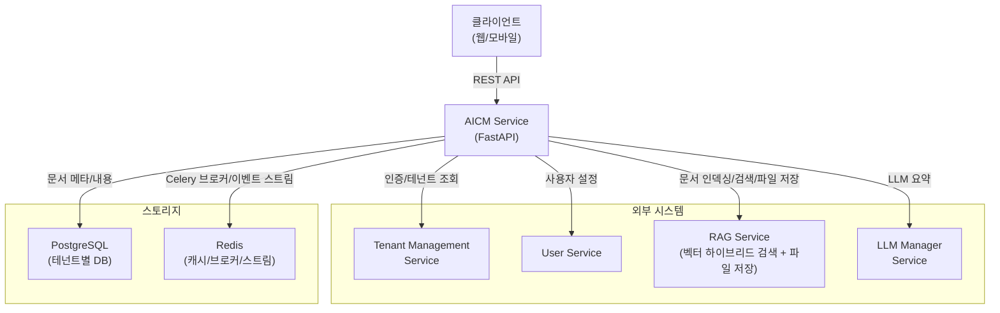

---

## 3. 계층형 아키텍처

AICM Service는 **4계층 구조**로 설계되어 있습니다.

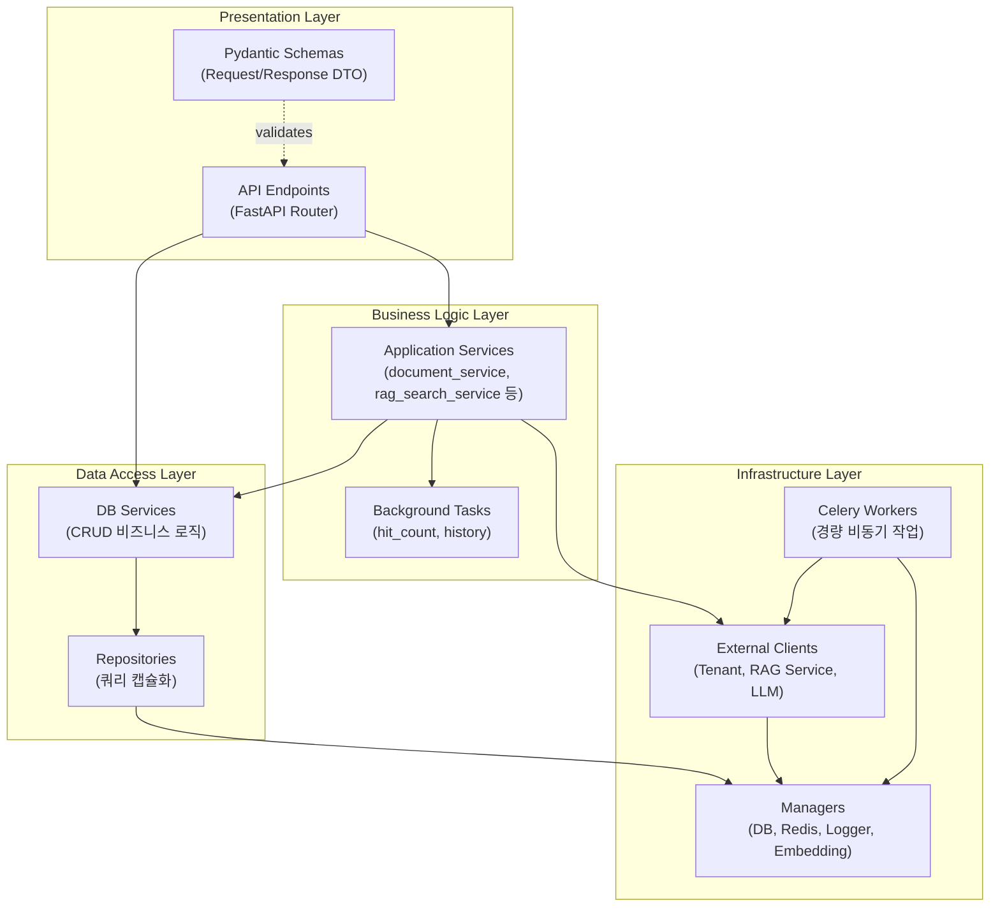

### 계층별 책임

| 계층 | 디렉토리 | 책임 |
|------|----------|------|
| **Presentation** | `api/endpoints/`, `api/schemas/` | HTTP 요청 수신, 입력 검증, 응답 직렬화 |
| **Business Logic** | `services/` | 도메인 로직 오케스트레이션, 외부 서비스 연동 |
| **Data Access** | `db/services/`, `db/repositories/` | DB CRUD, 트랜잭션 관리, 쿼리 캡슐화 |
| **Infrastructure** | `managers/`, `clients/`, `worker/` | DB 연결, 캐시, 외부 API, 비동기 작업 |

---

## 4. 디렉토리 구조

```
aicm_service/
├── main.py                      # 앱 진입점 (FastAPI + Typer CLI)
├── requirements.txt             # Python 의존성
├── Dockerfile                   # 컨테이너 빌드
├── docker-compose.yml           # 개발 환경
│
├── core/                        # 핵심 설정
│   ├── config.py                # Pydantic Settings (.env 기반)
│   └── celery.py                # Celery 앱 생성
│
├── api/                         # Presentation Layer
│   ├── __init__.py              # 라우터 등록
│   ├── endpoints/               # API 엔드포인트
│   │   ├── category_endpoints.py
│   │   ├── category_permission_endpoints.py
│   │   ├── dev_endpoints.py
│   │   ├── doc_type_endpoints.py
│   │   ├── template_endpoints.py
│   │   └── documents/           # 문서 관련 엔드포인트 그룹
│   │       ├── documents_endpoint.py
│   │       ├── search_endpoints.py
│   │       ├── section_endpoints.py
│   │       ├── index_endpoints.py
│   │       ├── attachments_endpoints.py
│   │       ├── comment_endpoints.py
│   │       └── dashboard_endpoints.py
│   └── schemas/                 # Pydantic DTO
│       ├── document_schemas.py
│       ├── category_schemas.py
│       ├── search_schemas.py
│       ├── template_schemas.py
│       ├── doc_type_schemas.py
│       └── category_permission_schemas.py
│
├── services/                    # Business Logic Layer
│   ├── document_service.py      # 문서 CRUD 오케스트레이션
│   ├── rag_search_service.py    # RAG 검색 결과 처리 및 DB 보강
│   ├── rag_integrated_search_service.py  # 통합 검색 (RAG 기반)
│   ├── rag_init_service.py      # 워크스페이스 초기화 (레포지토리/API키 프로비저닝)
│   ├── store_service.py         # 저장소 관리
│   └── background_tasks.py      # 백그라운드 작업
│
├── db/                          # Data Access Layer
│   ├── database.py              # SQLAlchemy Base
│   ├── models/                  # ORM 모델
│   ├── repositories/            # 쿼리 캡슐화
│   └── services/                # DB 서비스 (트랜잭션 단위)
│
├── managers/                    # Infrastructure - 싱글톤 매니저
│   ├── database_manager.py      # 멀티테넌트 DB 연결/세션
│   ├── redis_manager.py         # Redis Stream (동기)
│   ├── async_redis_manager.py   # Redis Stream (비동기)
│   ├── logger_manager.py        # Loguru + OTEL 로깅
│   └── embedding_model_manager.py # 임베딩 모델
│
├── clients/                     # Infrastructure - 외부 서비스 클라이언트
│   ├── tenants_client.py        # 테넌트 관리 서비스
│   ├── rag_service_client.py    # RAG Service (검색/인덱싱/파일/카테고리/동의어)
│   └── llm_client.py            # LLM 매니저 서비스
│
├── worker/                      # Celery 비동기 워커
│   └── (RAG Service 전환으로 ES/MinIO 태스크 폐기)
│
├── core/                        # 핵심 설정 (확장)
│   ├── config.py                # Pydantic Settings (RAG_SERVICE_URL 등 추가)
│   ├── celery.py                # Celery 앱 생성
│   └── errors/                  # 공통 에러 코드 및 예외 클래스
│
├── scripts/
│   └── migrations/              # DB 마이그레이션 SQL
│       ├── 001_create_workspace_rag_config.sql
│       ├── 002_add_rag_doc_id_to_aicm_documents.sql
│       ├── 003_add_store_tables.sql
│       └── 004_add_documents_store_id.sql
│
├── utils/                       # 유틸리티
│   ├── html_utils.py            # HTML/마크다운 변환
│   ├── cipher_utils.py          # AES 암복호화
│   ├── calendar_utils.py        # 기간 계산
│   ├── version_name_utils.py    # 버전명 생성
│   ├── outline_utils.py         # 문서 아웃라인 처리
│   ├── str_utils.py             # 문자열 유틸
│   └── memory_utils.py          # 메모리 정리 (GC, GPU)
│
├── model_json/                  # JSON 스키마 정의
│   ├── documents_model.json
│   ├── document_sections.json
│   └── ...
│
├── sql/                         # SQL 스크립트
│   ├── create_indexes_for_get_filtered_doc.sql
│   └── ...
│
└── docs/                        # 문서
    └── architecture/            # 아키텍처 문서 (현재 위치)
```

---

## 5. 핵심 데이터 흐름

### 5.1 문서 생성 흐름

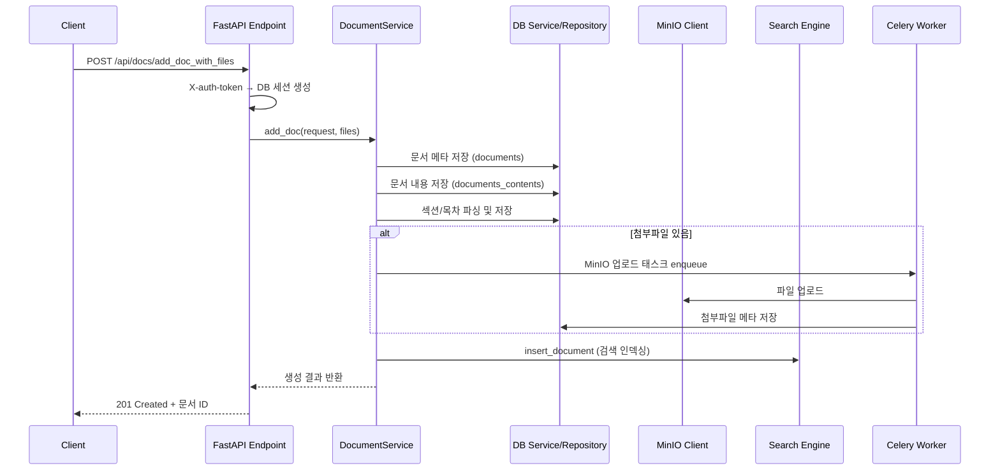

### 5.2 문서 검색(RAG) 흐름

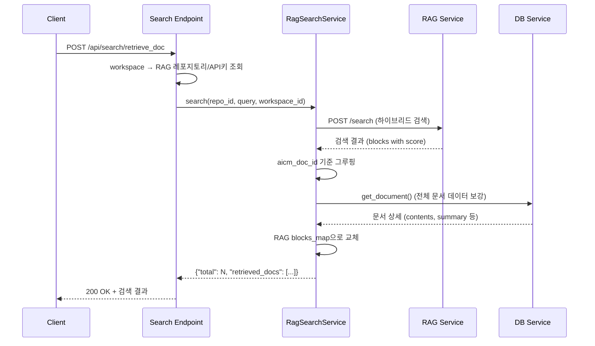

### 5.3 문서 승인 흐름

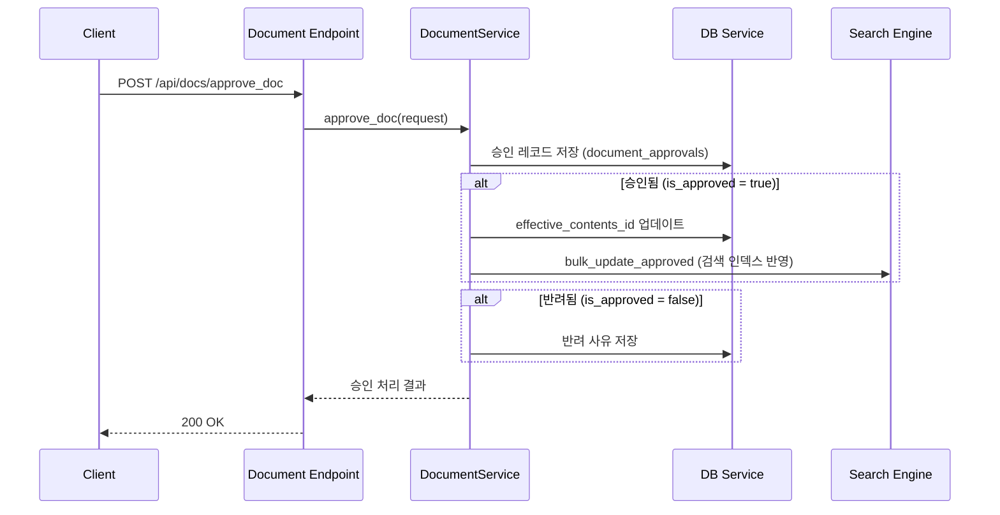

---

## 6. 멀티테넌트 아키텍처

AICM Service는 **Database-per-Tenant** 패턴을 사용하여 완전한 데이터 격리를 보장합니다.

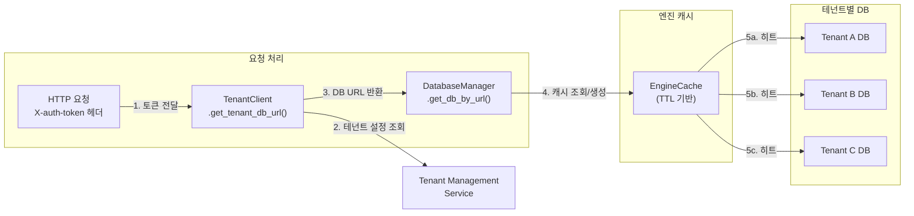

### 핵심 설계

- **인증 토큰 기반 라우팅**: `X-auth-token` 헤더로 테넌트를 식별하고, 해당 테넌트의 DB URL을 동적으로 조회
- **Engine 캐시**: `EngineCache`가 테넌트별 SQLAlchemy Engine을 TTL 기반으로 캐싱하여 연결 오버헤드 최소화
- **MinIO 설정 캐시**: `MinioConfigCache`가 테넌트별 MinIO 자격 증명을 캐싱
- **세션 격리**: 매 요청마다 독립된 DB 세션을 생성하고, 요청 종료 시 자동 정리

---

## 7. 외부 서비스 통합

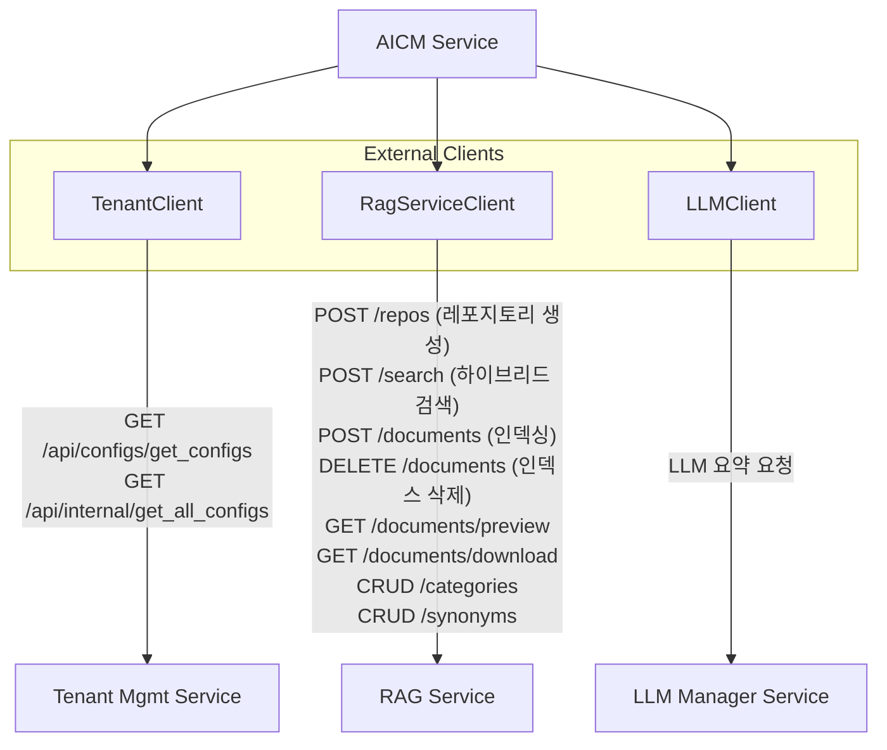

| 클라이언트 | 역할 | 통신 방식 |
|-----------|------|----------|
| **TenantClient** | 테넌트 인증, DB 설정 조회 | REST (동기) |
| **RagServiceClient** | 문서 인덱싱/검색/파일 접근/카테고리/동의어 관리 | REST (동기, 타임아웃 설정) |
| **LLMClient** | 문서 요약 생성 | REST (동기) |

---

## 8. 비동기 처리 아키텍처

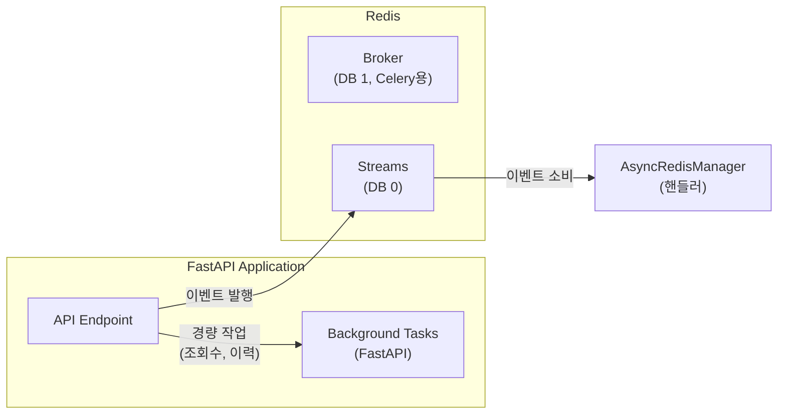

> RAG Service 전환으로 `es_index_task`, `minio_upload_task` Celery 태스크는 폐기되었습니다.
> 문서 인덱싱/파일 업로드는 API 요청 내에서 `RagServiceClient`를 통해 동기 처리합니다.

### 작업 유형별 처리 전략

| 유형 | 처리 방식 | 예시 |
|------|----------|------|
| **즉시 처리** | 동기 (API 요청 내) | 문서 조회, 검색, RAG 인덱싱/파일 처리, 카테고리 CRUD |
| **경량 비동기** | FastAPI BackgroundTasks | 조회수 증가, 문서 이력 기록 |
| **이벤트 기반** | Redis Stream | 서비스 간 이벤트 발행/구독 |

---

## 9. API 라우팅 구조

모든 API는 `/api` 프리픽스 아래에 등록됩니다.

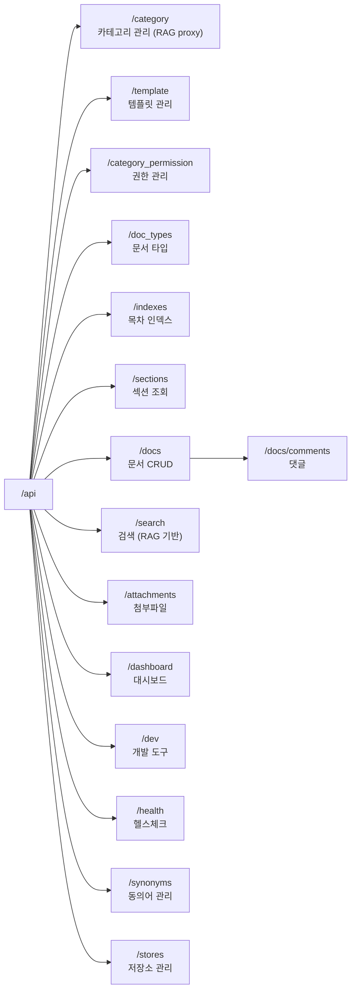

---

## 10. 설정 및 환경 관리

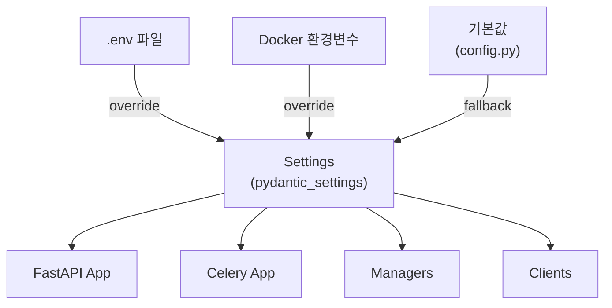

### 주요 설정 항목

| 카테고리 | 설정 | 기본값 |
|----------|------|--------|
| **서버** | `HOST`, `PORT`, `RELOAD` | `0.0.0.0`, `32012`, `False` |
| **Redis** | `REDIS_HOST`, `REDIS_PORT`, `REDIS_DB` | `localhost`, `6379`, `0` |
| **Celery** | `CELERY_BROKER_DB`, `CELERY_RESULT_BACKEND_DB` | `1`, `2` |
| **외부 서비스** | `TENANT_MANAGEMENT_SERVICE` | `localhost` |
| **RAG Service** | `RAG_SERVICE_URL`, `RAG_AUTH_MODE` | `""`, `"api_key"` |
| **보안** | `INTERNAL_AUTH_KEY`, `CIPHER_KEY`, `is_cipher` | 기본 키값 |

---

## 11. 배포 아키텍처

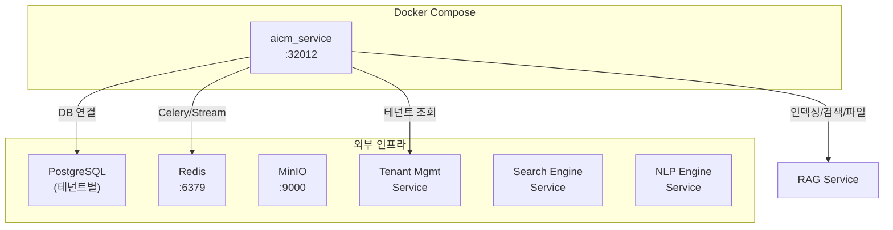

### CLI 실행 모드

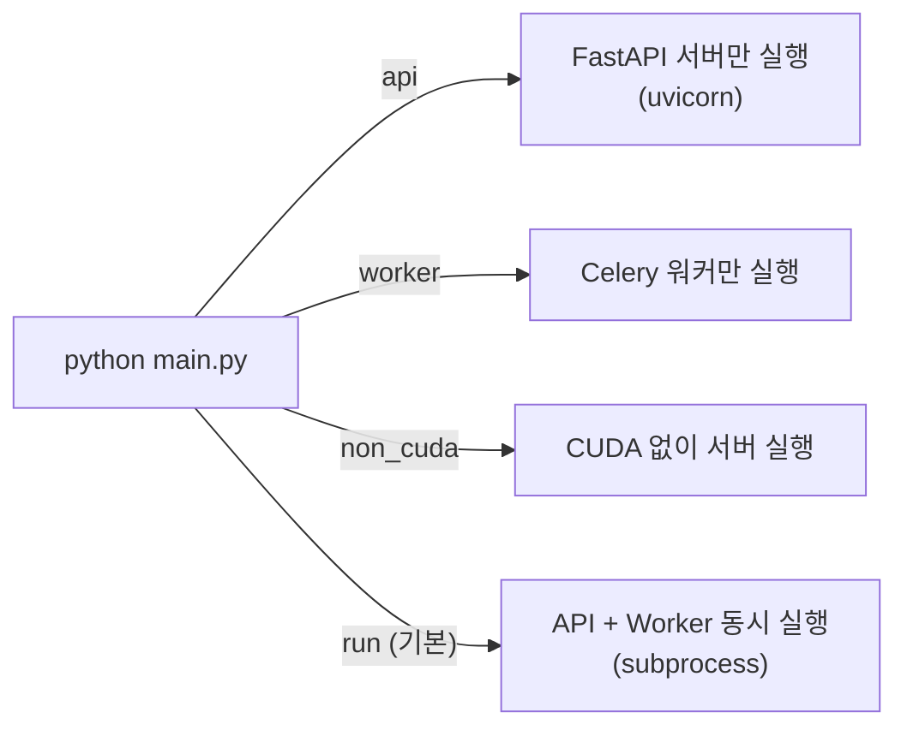

---

## 12. 상세 문서 목록

더 자세한 내용은 아래 문서를 참고하세요.

| 문서 | 설명 |
|------|------|
| [API 계층 상세](./api-layer.md) | 엔드포인트, 스키마, 인증 미들웨어 |
| [서비스 및 매니저 계층 상세](./service-layer.md) | 비즈니스 로직, 매니저 패턴, 클라이언트 |
| [데이터 모델 및 스키마](./data-model.md) | ORM 모델, 테이블 관계, 리포지토리 패턴 |
| [인프라 및 배포](./infrastructure.md) | Docker, Celery, Redis, 모니터링 |
