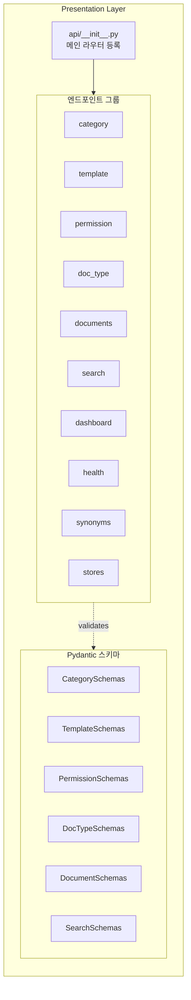
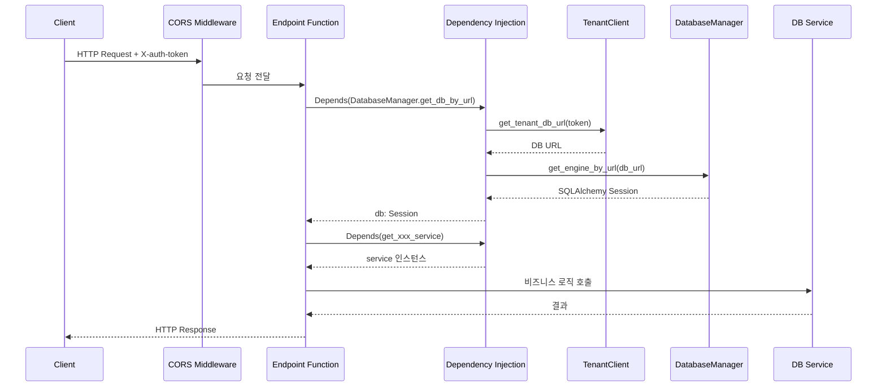
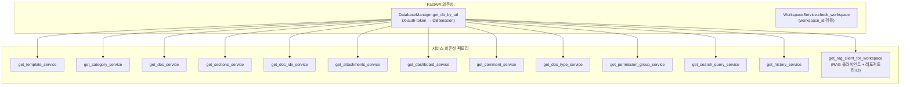
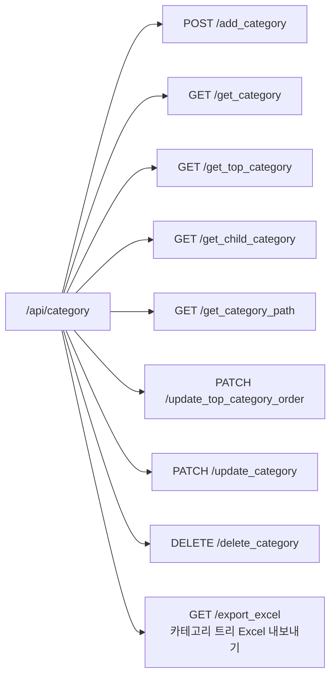
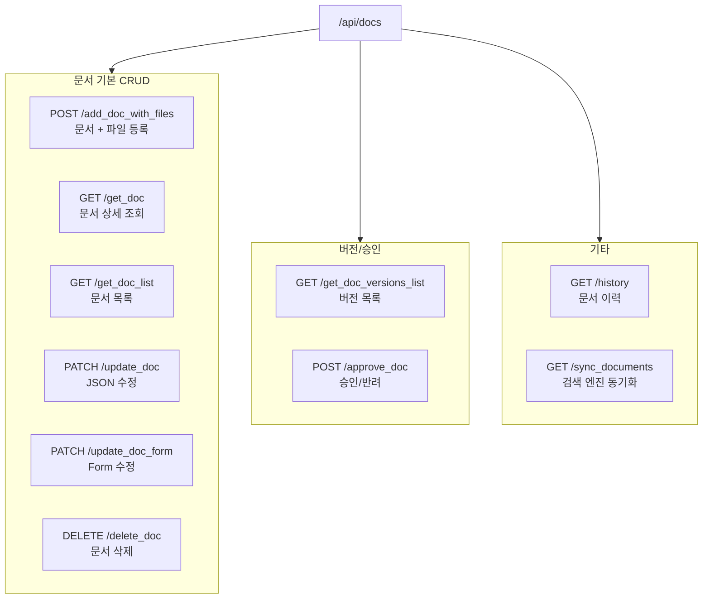
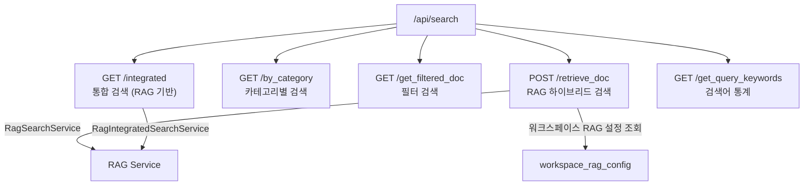
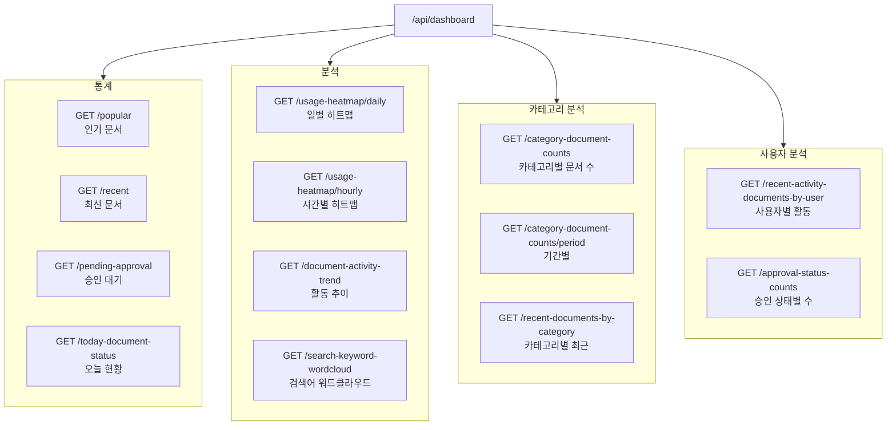
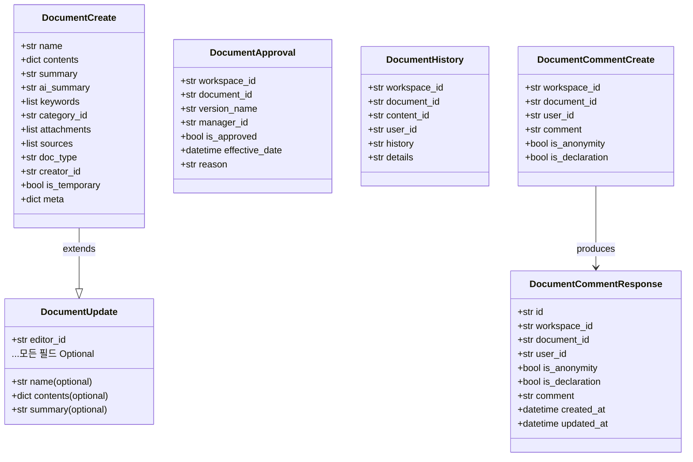
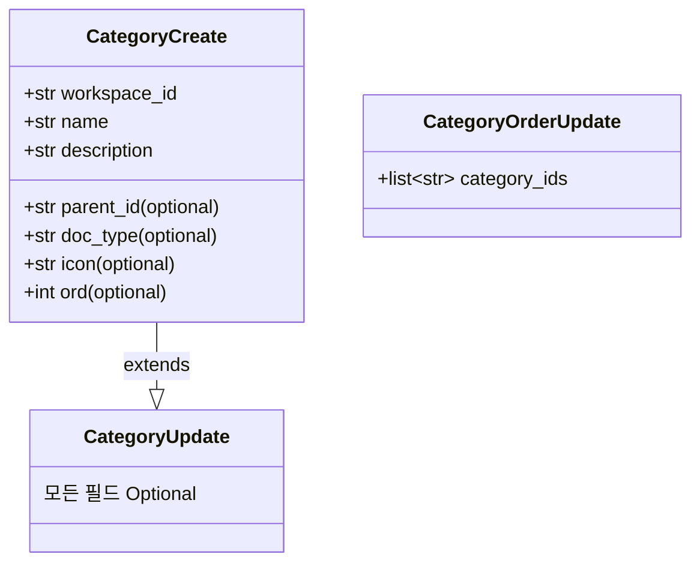
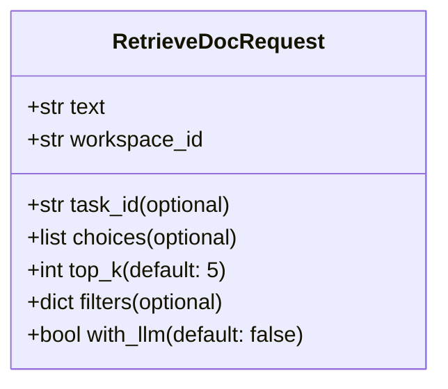

# API 계층 상세

> AICM Service의 Presentation Layer에 대한 상세 문서입니다.

## 1. 개요

AICM Service의 API 계층은 FastAPI 프레임워크 기반으로, 라우터 분리 패턴을 사용합니다. 모든 엔드포인트는 `/api` 프리픽스 아래에 등록되며, 도메인별로 개별 라우터로 분리되어 있습니다.



---

## 2. 인증 및 의존성 주입

### 2.1 요청 처리 파이프라인

모든 API 요청은 아래 파이프라인을 거칩니다.



### 2.2 핵심 의존성



### 2.3 인증 방식

| 인증 유형 | 헤더 | 용도 |
|-----------|------|------|
| **사용자 토큰** | `X-auth-token` | 테넌트 식별, DB 세션 생성, 외부 서비스 호출 |
| **내부 인증** | `X-Internal-Auth` + `X-Internal-Timestamp` | 서비스 간 내부 통신 (HMAC-SHA256) |
| **DB URL 직접 전달** | `X-DB-URL` | 개발/디버깅용 직접 DB 연결 |

---

## 3. 엔드포인트 상세

### 3.1 카테고리 관리 (`/api/category`)

> 카테고리 CRUD는 RAG Service를 프록시합니다. AICM DB에 직접 저장하지 않고 RAG Service의 카테고리 API를 호출합니다.



| 메서드 | 경로 | 설명 | 주요 파라미터 |
|--------|------|------|--------------|
| POST | `/add_category` | 카테고리 생성 | `CategoryCreate` (body) |
| GET | `/get_category` | 카테고리 조회 (단건/전체) | `workspace_id`, `category_id` (optional) |
| GET | `/get_top_category` | 최상위 카테고리 목록 | `workspace_id` |
| GET | `/get_child_category` | 하위 카테고리 조회 | `workspace_id`, `parent_id` |
| GET | `/get_category_path` | 카테고리 경로(빵부스러기) | `workspace_id`, `category_id` |
| PATCH | `/update_top_category_order` | 상위 카테고리 순서 변경 | `CategoryOrderUpdate` (body) |
| PATCH | `/update_category` | 카테고리 수정 | `category_id`, `CategoryUpdate` (body) |
| DELETE | `/delete_category` | 카테고리 삭제 | `workspace_id`, `category_id` |

### 3.2 템플릿 관리 (`/api/template`)

| 메서드 | 경로 | 설명 | 주요 파라미터 |
|--------|------|------|--------------|
| POST | `/add_template` | 템플릿 생성 | `TemplateCreate` (body) |
| GET | `/get_templates` | 템플릿 목록 조회 | `workspace_id`, `tag` (optional) |
| GET | `/get_template_detail` | 템플릿 상세 구조 | `workspace_id`, `template_id` |
| PATCH | `/update_template` | 템플릿 수정 | `template_id`, `TemplateUpdate` (body) |
| DELETE | `/delete_template` | 템플릿 삭제 | `workspace_id`, `template_id` |

### 3.3 카테고리 권한 관리 (`/api/category_permission`)

| 메서드 | 경로 | 설명 | 주요 파라미터 |
|--------|------|------|--------------|
| POST | `/add_permissions` | 권한 그룹 생성 | `CategoryPermissionGroupCreate` (body) |
| GET | `/get_permissions` | 권한 목록 | `workspace_id` |
| GET | `/get_permission_details` | 권한 상세 | `workspace_id`, `group_id` |
| PATCH | `/update_permissions` | 권한 수정 | `group_id`, `CategoryPermissionGroupUpdate` (body) |
| DELETE | `/delete_permissions` | 권한 삭제 | `workspace_id`, `group_id` |

### 3.4 문서 타입 관리 (`/api/doc_types`)

| 메서드 | 경로 | 설명 | 주요 파라미터 |
|--------|------|------|--------------|
| POST | `/add_doc_type` | 문서 타입 생성 | `DocTypeCreate` (body) |
| GET | `/get_doc_type` | 문서 타입 조회 | `workspace_id`, `doc_type_id` (optional) |
| PATCH | `/update_doc_type` | 문서 타입 수정 | `doc_type_id`, `DocTypeUpdate` (body) |
| DELETE | `/delete_doc_type` | 문서 타입 삭제 | `workspace_id`, `doc_type_id` |

### 3.5 문서 CRUD (`/api/docs`)



| 메서드 | 경로 | 설명 | 비고 |
|--------|------|------|------|
| POST | `/add_doc_with_files` | 문서 생성 (multipart) | 첨부파일 포함 가능 |
| GET | `/get_doc` | 문서 상세 조회 | 조회수 백그라운드 증가 |
| GET | `/get_doc_list` | 문서 목록 | 페이지네이션, 필터 지원 |
| PATCH | `/update_doc` | JSON 기반 수정 | `DocumentUpdate` body |
| PATCH | `/update_doc_form` | Form 기반 수정 | 파일 포함 가능 |
| DELETE | `/delete_doc` | 문서 삭제 | DB + RAG Service 인덱스 제거 |
| GET | `/get_doc_versions_list` | 버전 목록 | 문서 내용 변경 이력 |
| POST | `/approve_doc` | 승인/반려 처리 | `DocumentApproval` body |
| GET | `/history` | 문서 작업 이력 | 히스토리 레코드 조회 |
| GET | `/preview` | 문서 미리보기 | RAG Service를 통해 MinIO 파일 스트리밍 |
| GET | `/download` | 원본 파일 다운로드 | RAG Service를 통해 원본 파일 반환 |
| GET | `/sync_documents` | ES 동기화 (레거시) | 전체 문서 재인덱싱 |

### 3.6 검색 (`/api/search`)



| 메서드 | 경로 | 설명 | 특징 |
|--------|------|------|------|
| GET | `/integrated` | 통합 텍스트 검색 | RAG Service 하이브리드 검색, 루트 카테고리 기준 그루핑 |
| GET | `/by_category` | 카테고리 내 검색 | DB 기반 LIKE 검색 |
| GET | `/get_filtered_doc` | 다중 조건 필터 검색 | 카테고리, 상태, 기간 등 복합 필터 |
| POST | `/retrieve_doc` | RAG 하이브리드 검색 | RAG Service 검색 → DB 보강 → `{"total", "retrieved_docs"}` |
| GET | `/get_query_keywords` | 검색어 통계 | 최근/인기 검색어 |

### 3.7 대시보드 (`/api/dashboard`)



### 3.8 댓글 (`/api/docs/comments`)

| 메서드 | 경로 | 설명 |
|--------|------|------|
| POST | `/comments` | 댓글 생성 |
| GET | `/comments` | 문서별 댓글 목록 |
| GET | `/comments/by_user` | 사용자별 댓글 |
| GET | `/comments/by_creator` | 작성자별 댓글 |
| GET | `/comments/all` | 전체 댓글 |
| GET | `/comments/{comment_id}` | 댓글 상세 |
| PATCH | `/comments/{comment_id}` | 댓글 수정 |
| DELETE | `/comments/{comment_id}` | 댓글 삭제 |

### 3.9 첨부파일 (`/api/attachments`)

| 메서드 | 경로 | 설명 |
|--------|------|------|
| GET | `/get_attachment_file` | 첨부파일 다운로드 (MinIO presigned URL) |

### 3.10 개발 도구 (`/api/dev`)

| 메서드 | 경로 | 설명 |
|--------|------|------|
| GET | `/dump_indexing` | 전체 문서 검색 엔진 동기화 (개발/운영용) |

### 3.11 헬스체크 (`/api/health`)

| 메서드 | 경로 | 설명 |
|--------|------|------|
| GET | `/rag` | RAG Service 연결 상태 확인 |

### 3.12 동의어 관리 (`/api/synonyms`)

RAG Service의 동의어 사전을 관리합니다. 워크스페이스별 레포지토리 기준으로 동작합니다.

| 메서드 | 경로 | 설명 |
|--------|------|------|
| GET | `/` | 동의어 목록 조회 |
| POST | `/` | 동의어 추가 |
| DELETE | `/{synonym_id}` | 동의어 삭제 |

---

## 4. Pydantic 스키마 상세

### 4.1 문서 스키마 (`document_schemas.py`)



### 4.2 카테고리 스키마 (`category_schemas.py`)



### 4.3 검색 스키마 (`search_schemas.py`)



---

## 5. 에러 처리

API 계층에서 발생하는 주요 HTTP 상태 코드입니다.

| 상태 코드 | 의미 | 발생 조건 |
|-----------|------|----------|
| `200` | 성공 | 정상 처리 |
| `201` | 생성됨 | 리소스 생성 성공 |
| `400` | 잘못된 요청 | Pydantic 검증 실패, 비즈니스 규칙 위반 |
| `404` | 미발견 | 문서/카테고리 등 리소스 없음 |
| `500` | 서버 오류 | 내부 예외 |
| `502` | 게이트웨이 오류 | 외부 서비스(Tenant, Search Engine) 통신 실패 |
| `504` | 타임아웃 | 외부 서비스 응답 시간 초과 |

---

## 6. CORS 설정

현재 개발 환경 설정으로, 모든 오리진을 허용합니다.

```
allow_origins     = ["*"]
allow_credentials = True
allow_methods     = ["*"]
allow_headers     = ["*"]
expose_headers    = ["*"]
max_age           = 3600
```

> 운영 환경에서는 `allow_origins`를 특정 도메인으로 제한하는 것이 권장됩니다.
