# 데이터 모델 및 스키마

> ORM 모델, 테이블 관계, Repository 패턴에 대한 상세 문서입니다.

## 1. 개요

AICM Service는 **SQLAlchemy ORM**을 사용하며, 모든 테이블은 PostgreSQL의 `aicm` 스키마에 정의되어 있습니다. 워크스페이스 정보만 `ce` 스키마를 사용합니다.

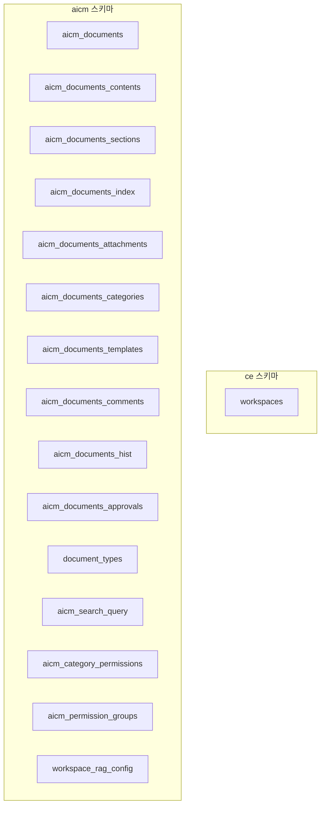

---

## 2. ER 다이어그램

### 2.1 전체 엔티티 관계

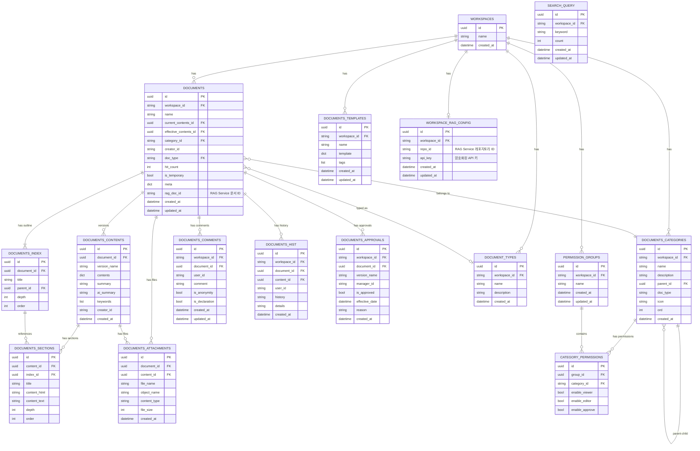

---

## 3. 핵심 모델 상세

### 3.1 문서 (`aicm_documents`)

문서의 메타데이터를 저장하는 루트 엔티티입니다.

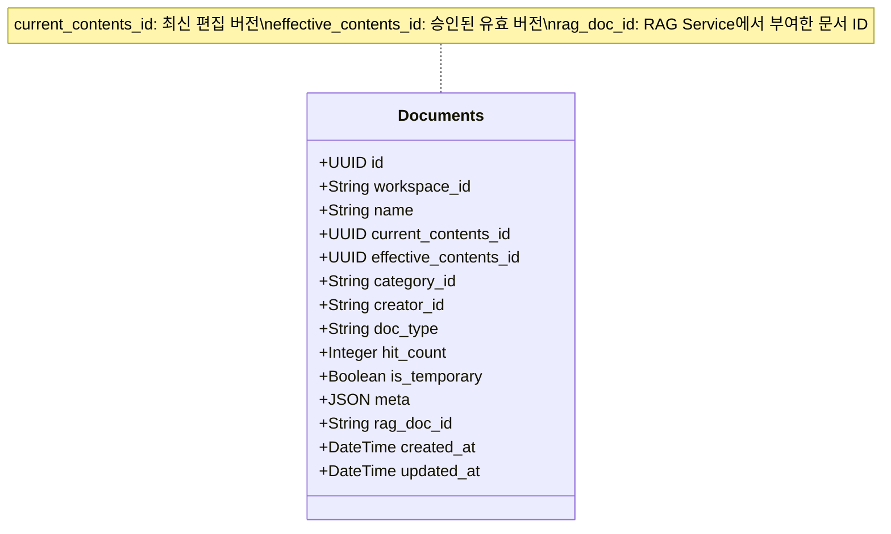

#### 버전 관리 개념

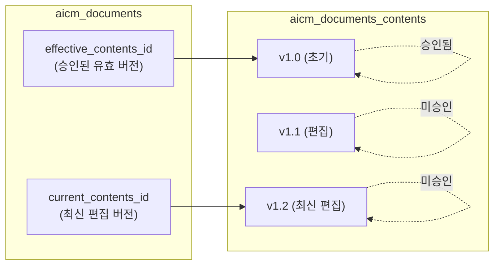

### 3.2 문서 내용 (`aicm_documents_contents`)

문서의 실제 내용을 버전별로 저장합니다. 문서가 수정될 때마다 새 레코드가 생성됩니다.

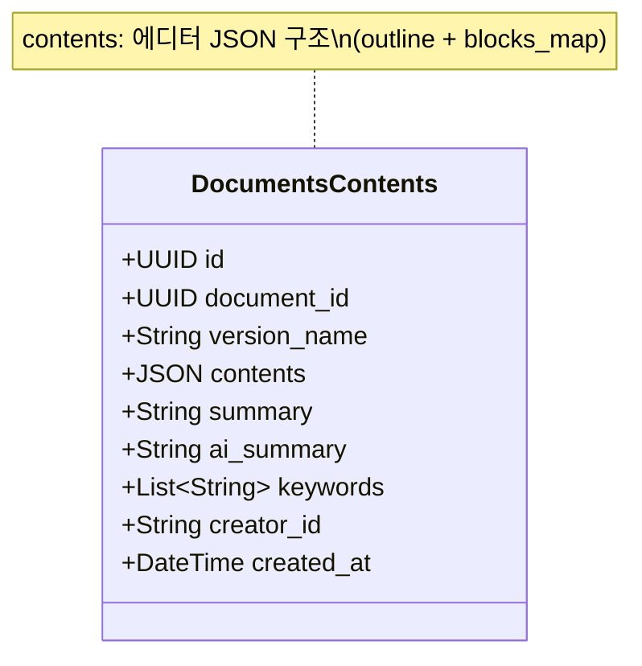

### 3.3 문서 섹션 (`aicm_documents_sections`)

문서 내용을 섹션 단위로 분리 저장합니다. 검색 엔진 인덱싱의 기본 단위입니다.

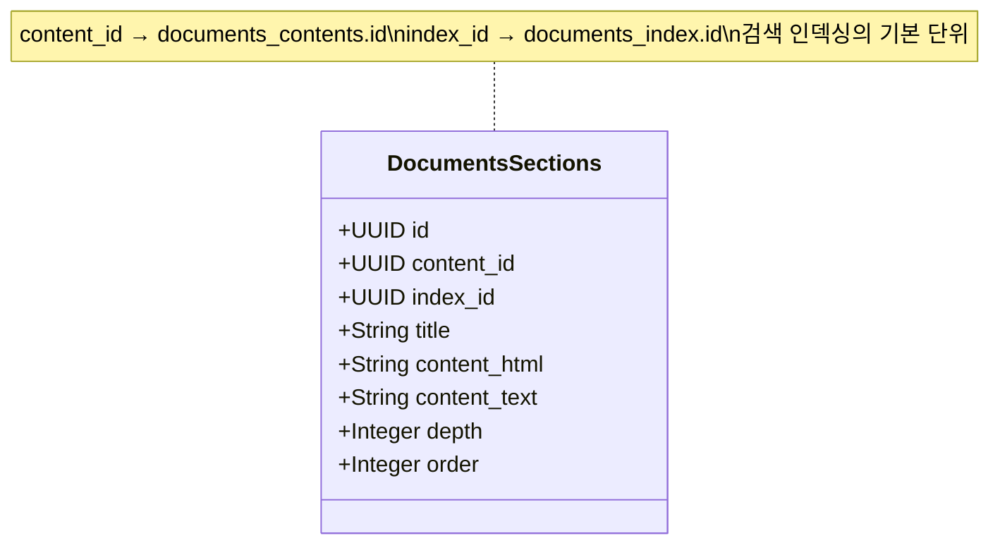

### 3.4 문서 목차 인덱스 (`aicm_documents_index`)

문서의 트리형 목차 구조를 저장합니다.

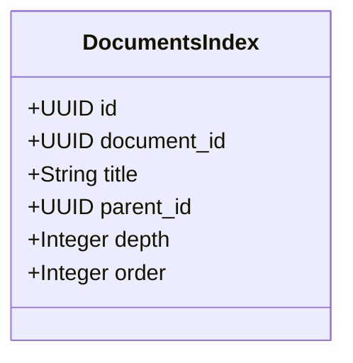

#### 목차 트리 구조 예시

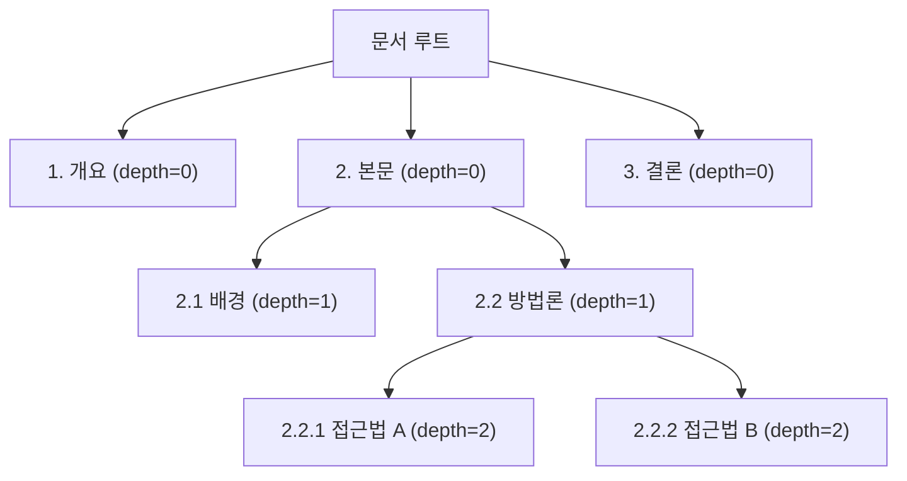

### 3.5 문서 카테고리 (`aicm_documents_categories`)

계층형 카테고리 구조를 지원합니다.

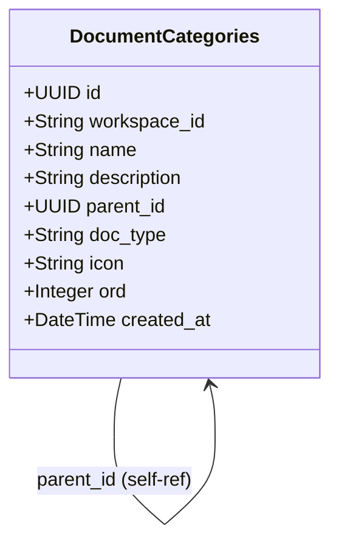

#### 카테고리 트리 예시

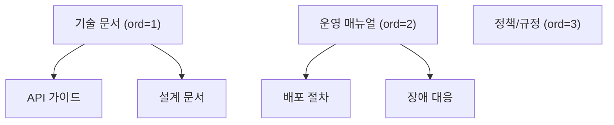

### 3.6 문서 승인 (`aicm_documents_approvals`)

문서 승인 워크플로우를 관리합니다.

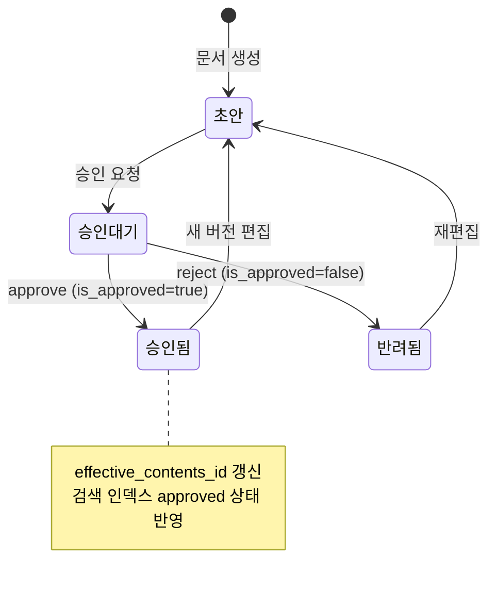

### 3.8 워크스페이스 RAG 설정 (`workspace_rag_config`)

워크스페이스별 RAG Service 레포지토리 ID와 API 키를 저장합니다. 첫 문서 업로드 시 `RagInitService`가 자동으로 생성합니다.

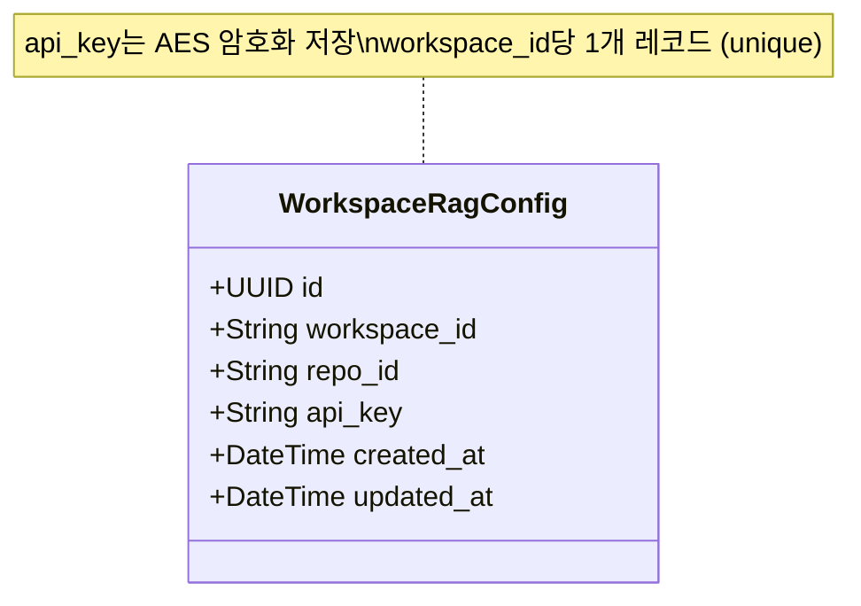

---

### 3.7 카테고리 권한 (`aicm_category_permissions` + `aicm_permission_groups`)

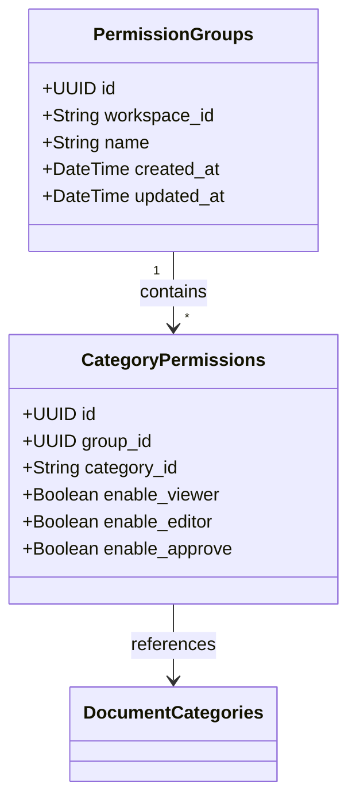

#### 권한 모델

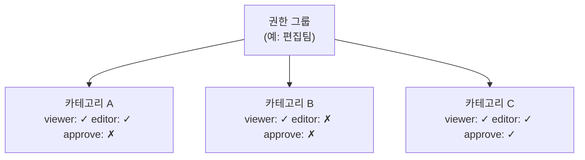

---

## 4. 문서 내용 구조 (JSON)

`documents_contents.contents` 필드는 에디터의 JSON 구조를 저장합니다.

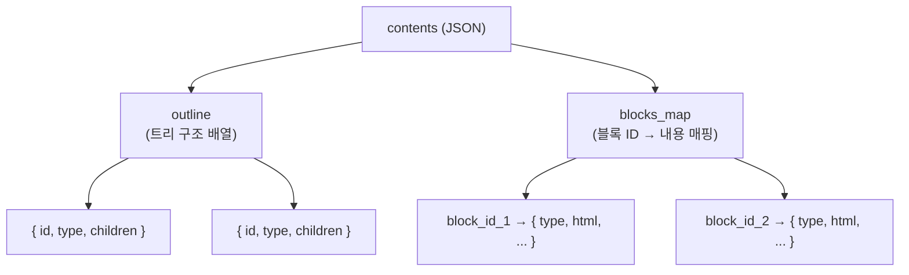

#### outline → sections 변환 흐름

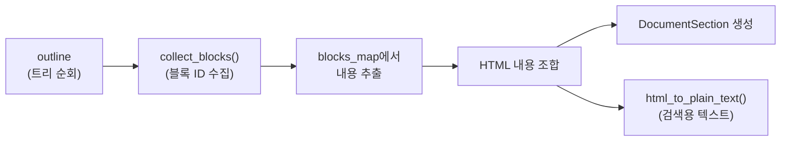

---

## 5. Repository 패턴

### 5.1 패턴 구조

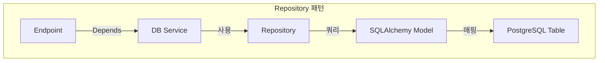

### 5.2 계층별 책임

### 5.3 Repository 목록

| Repository | 모델 | 주요 쿼리 |
|-----------|------|----------|
| `DocumentRepository` | `Documents` | 문서 CRUD, 목록 조회, 조회수 증가 |
| `DocumentContentsRepository` | `DocumentsContents` | 버전별 내용 저장/조회 |
| `DocumentSectionsRepository` | `DocumentsSections` | 섹션 CRUD, 내용별 조회 |
| `DocumentIndexRepository` | `DocumentsIndex` | 목차 트리 CRUD |
| `DocumentAttachmentsRepository` | `DocumentsAttachments` | 첨부파일 메타 CRUD |
| `DocumentCommentRepository` | `DocumentsComments` | 댓글 CRUD, 사용자별 조회 |
| `DocumentCategoriesRepository` | `DocumentCategories` | 카테고리 트리 CRUD |
| `DocumentTemplatesRepository` | `DocumentTemplates` | 템플릿 CRUD, 태그 필터 |
| `DocumentApprovalsRepository` | `DocumentApprovals` | 승인 레코드 CRUD |
| `DocumentHistoryRepository` | `DocumentsHist` | 이력 기록/조회 |
| `DocumentTypeRepository` | `DocumentTypes` | 문서 타입 CRUD |
| `DashboardRepository` | (다중 테이블) | 대시보드 집계 쿼리 |
| `CategoryPermissionRepository` | `CategoryPermissions` | 권한 CRUD |
| `CategoryPermissionGroupRepository` | `PermissionGroups` | 권한 그룹 CRUD |
| `SearchQueryRepository` | `SearchQuery` | 검색어 저장/통계 |
| `WorkspaceRepository` | `Workspace` | 워크스페이스 검증 |

---

## 6. 데이터베이스 스키마 관리

### 6.1 스키마 구성

| 스키마 | 용도 | 테이블 수 |
|--------|------|----------|
| `aicm` | AICM 서비스 전용 | 15개 (`workspace_rag_config` 추가) |
| `ce` | 공통 엔티티 (워크스페이스) | 1개 |

### 6.2 인덱스 전략

`sql/create_indexes_for_get_filtered_doc.sql`에 정의된 성능 최적화 인덱스가 존재합니다.

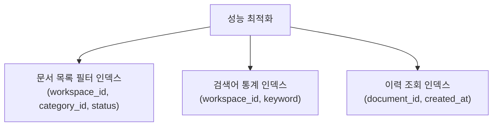

### 6.3 JSON 스키마 정의 (`model_json/`)

각 모델의 JSON 스키마 정의가 `model_json/` 디렉토리에 유지됩니다. API 문서화 및 클라이언트 코드 생성에 활용됩니다.

| 파일 | 대응 모델 |
|------|----------|
| `documents_model.json` | `aicm_documents` |
| `document_sections.json` | `aicm_documents_sections` |
| `document_index.json` | `aicm_documents_index` |
| `document_approvals.json` | `aicm_documents_approvals` |
| `document_categories.json` | `aicm_documents_categories` |
| `document_comment.json` | `aicm_documents_comments` |
| `documents_history.json` | `aicm_documents_hist` |
| `document_templates.json` | `aicm_documents_templates` |
| `document_page_model.json` | 페이지네이션 모델 |
| `levels_model.json` | 계층 구조 모델 |
| `store.json` | 저장소 설정 |
| `store_role.json` | 저장소 역할 |
