# 인프라 및 배포

> Docker, Celery, Redis, 모니터링, 배포 전략에 대한 상세 문서입니다.

## 1. 인프라 구성 개요

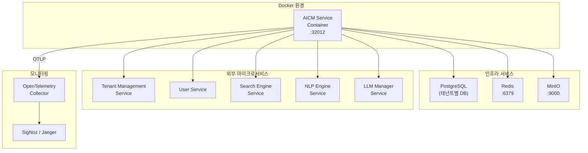

---

## 2. Docker 구성

### 2.1 Docker Compose (개발 환경)

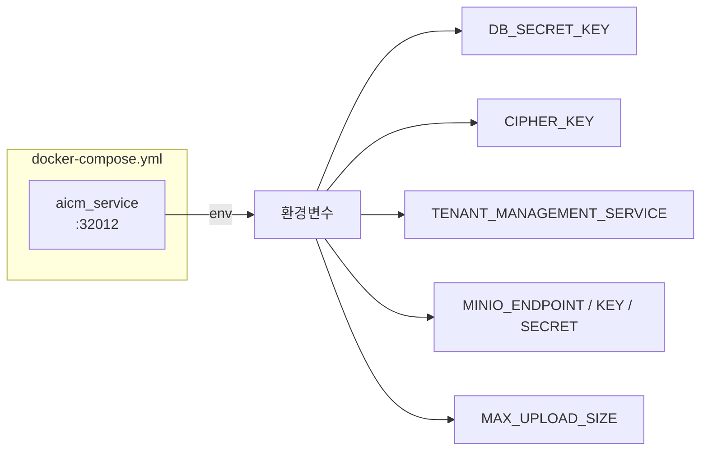

### 2.2 환경변수 구성

| 환경변수 | 설명 | 예시 값 |
|---------|------|---------|
| `DB_SECRET_KEY` | DB 암호화 키 | `timbel-c738eb67-...` |
| `CIPHER_KEY` | AES 암복호화 키 | `EBL8sbH5uMkA...` |
| `MAX_UPLOAD_SIZE` | 최대 업로드 크기 (bytes) | `104857600` (100MB) |
| `TENANT_MANAGEMENT_SERVICE` | 테넌트 관리 서비스 URL | `61.83.191.61:31020` |
| `MINIO_ENDPOINT` | MinIO 엔드포인트 | `61.83.191.61:9000` |
| `MINIO_ACCESS_KEY` | MinIO 액세스 키 | (자격 증명) |
| `MINIO_SECRET_KEY` | MinIO 시크릿 키 | (자격 증명) |
| `MINIO_BUCKET` | MinIO 버킷명 | `aicm-bucket` |
| `USE_LLM` | LLM 사용 여부 | `False` |

### 2.3 Dockerfile 빌드 흐름

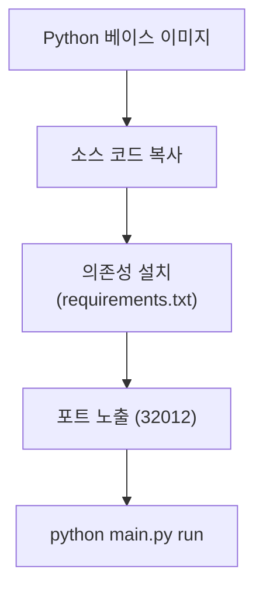

---

## 3. 설정 관리 (`core/config.py`)

### 3.1 Pydantic Settings 기반 설정

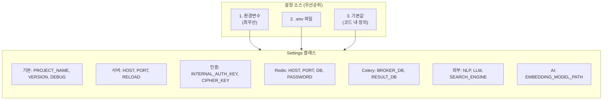

### 3.2 설정 카테고리

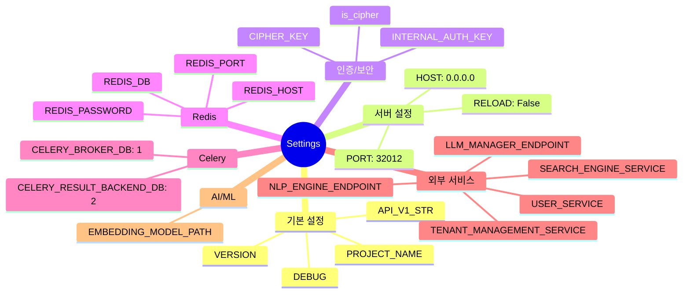

---

## 4. Celery 비동기 작업 시스템

### 4.1 Celery 구성

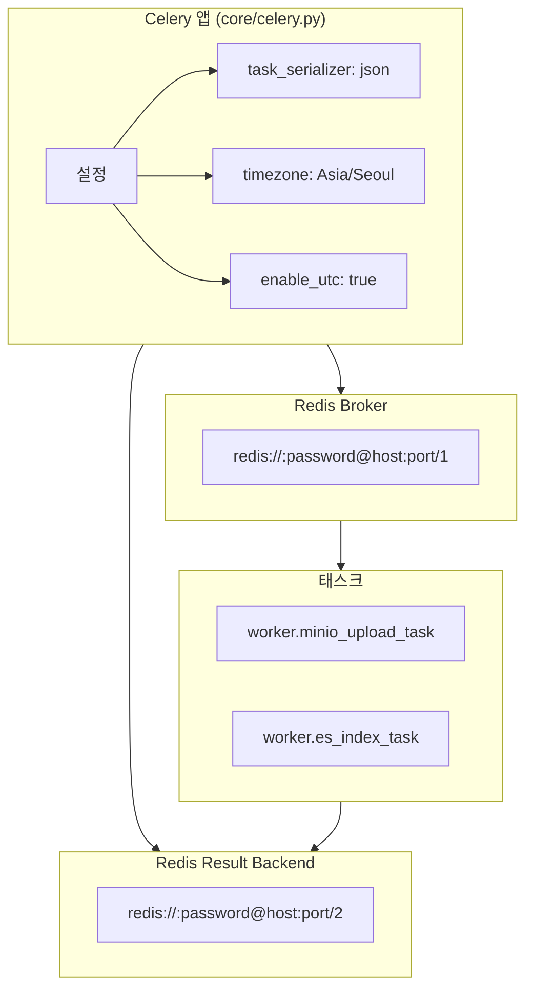

### 4.2 Celery 태스크

#### MinIO 업로드 태스크 (`worker/minio_upload_task.py`)

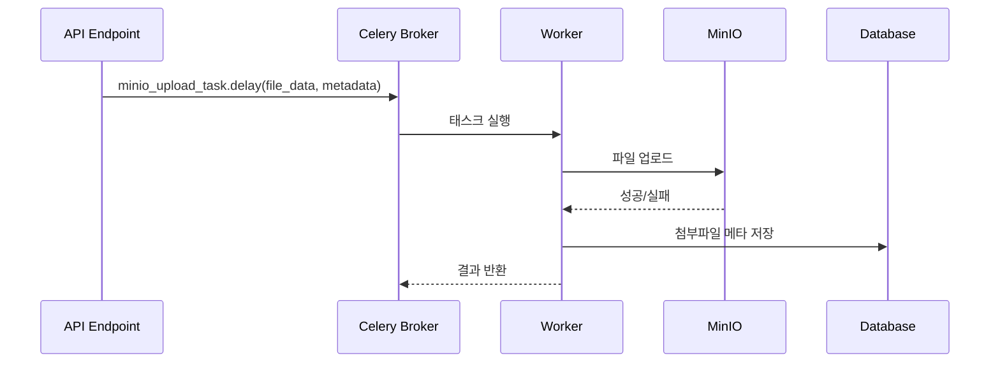

#### ES 인덱싱 태스크 (`worker/es_index_task.py`)

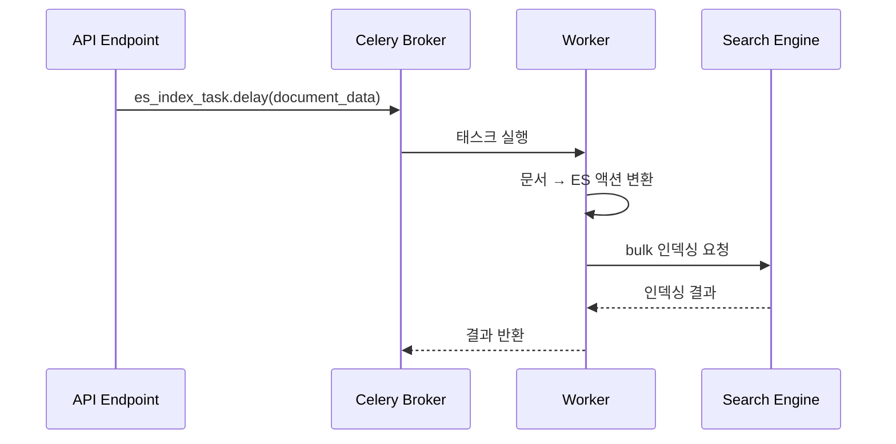

### 4.3 Redis DB 분리 전략

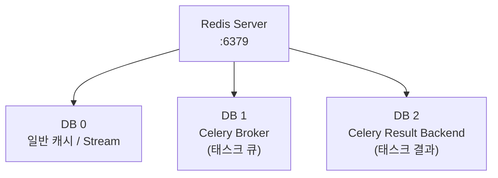

| Redis DB | 용도 | 사용처 |
|----------|------|--------|
| DB 0 | 일반 캐시, Redis Stream 이벤트 | `RedisManager`, `AsyncRedisManager` |
| DB 1 | Celery 메시지 브로커 | Celery Worker 태스크 큐 |
| DB 2 | Celery 결과 백엔드 | 태스크 실행 결과 저장 |

---

## 5. Redis Stream 이벤트 시스템

### 5.1 스트림 키 네이밍 규칙

```
<environment>:<tenant_id>:<service>:<domain>:<event_type>
```

예시: `production:tenant-001:aicm:document:created`

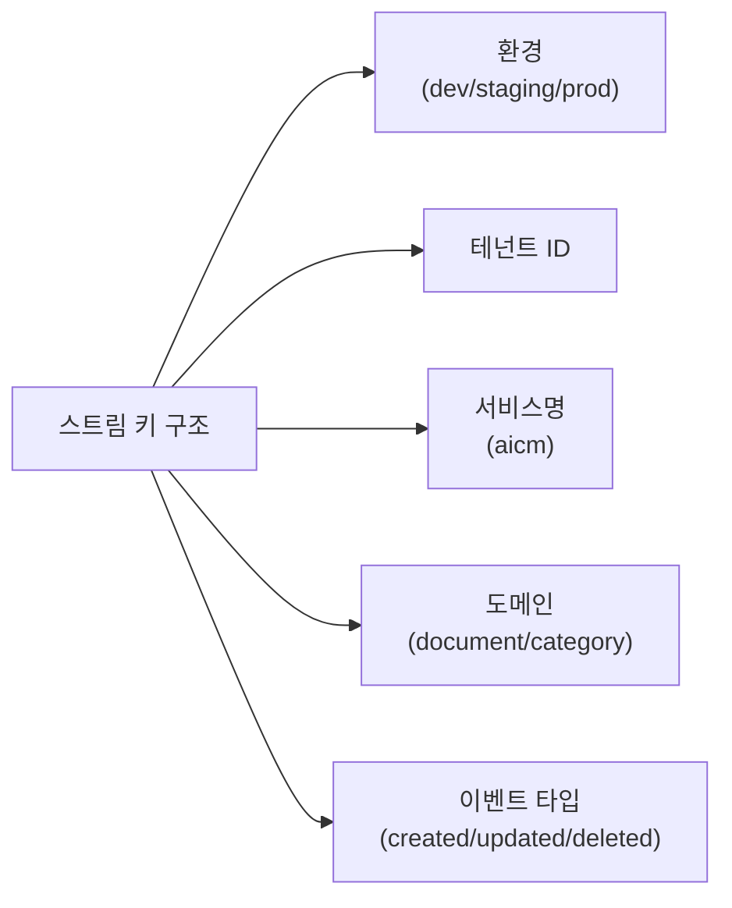

### 5.2 이벤트 발행/구독 아키텍처

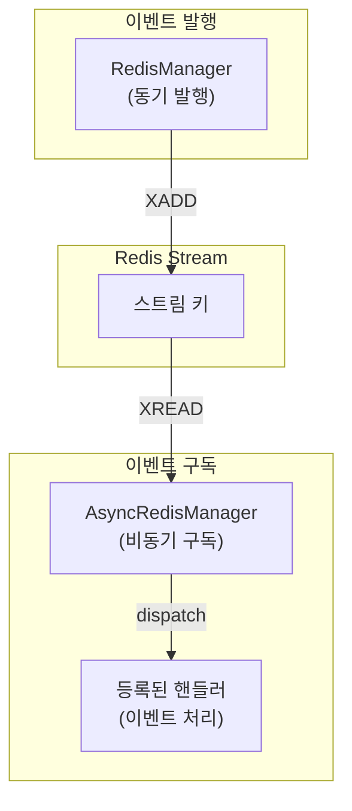

---

## 6. 로깅 및 모니터링

### 6.1 로깅 아키텍처

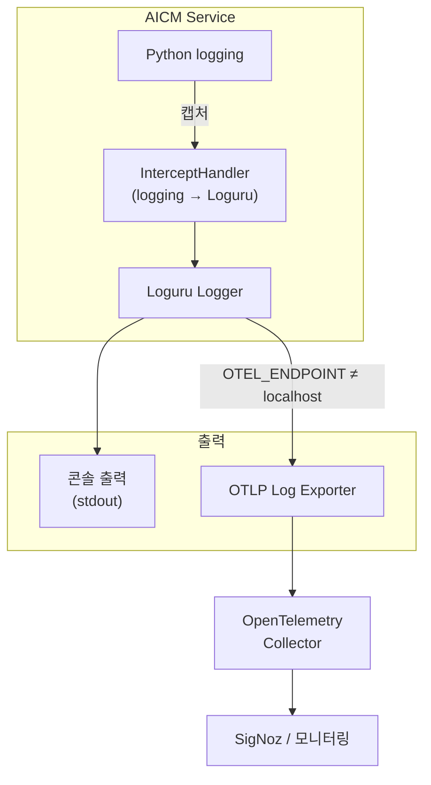

### 6.2 로깅 모드

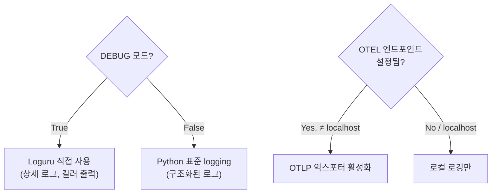

---

## 7. CLI 실행 모드

### 7.1 Typer CLI 구조

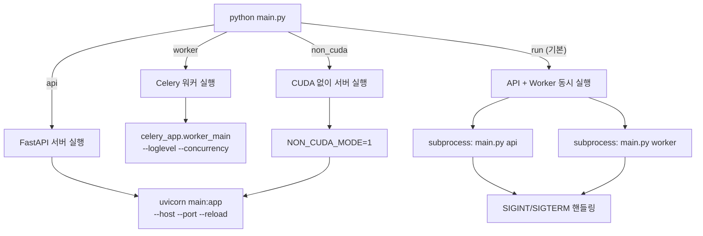

### 7.2 실행 명령어 정리

| 명령어 | 설명 | 옵션 |
|--------|------|------|
| `python main.py` | 기본 실행 (`run`과 동일) | - |
| `python main.py api` | FastAPI 서버만 | `--host`, `--port`, `--reload` |
| `python main.py worker` | Celery 워커만 | `--loglevel`, `--concurrency` |
| `python main.py non_cuda` | GPU 없이 서버 | - |
| `python main.py run` | API + Worker 동시 | `--host`, `--port`, `--reload`, `--worker-loglevel`, `--worker-concurrency` |

---

## 8. 의존성 관리

### 8.1 의존성 파일 구조

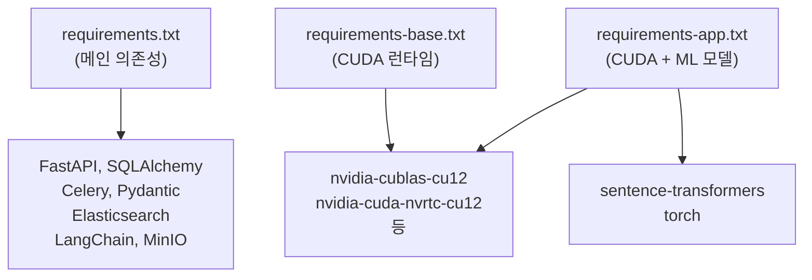

### 8.2 핵심 의존성 목록

| 카테고리 | 패키지 | 용도 |
|---------|--------|------|
| **웹 프레임워크** | `fastapi`, `uvicorn` | REST API 서버 |
| **CLI** | `typer` | 명령줄 인터페이스 |
| **ORM** | `sqlalchemy`, `psycopg2-binary` | DB 연결 및 ORM |
| **비동기** | `celery` | 비동기 태스크 처리 |
| **캐시/브로커** | `redis` | Redis 연결 |
| **검증** | `pydantic`, `pydantic-settings` | 데이터 검증 및 설정 |
| **스토리지** | `minio` | 오브젝트 스토리지 |
| **검색** | `elasticsearch`, `langchain` | 검색 엔진 연동 |
| **AI/ML** | `sentence-transformers`, `torch` | 임베딩 모델 (선택) |
| **로깅** | `loguru`, `opentelemetry-*` | 구조화 로깅 및 원격 추적 |
| **보안** | `pycryptodome` | AES 암복호화 |
| **HTTP** | `requests`, `httpx` | 외부 API 호출 |

---

## 9. 보안 고려사항

### 9.1 인증 체계

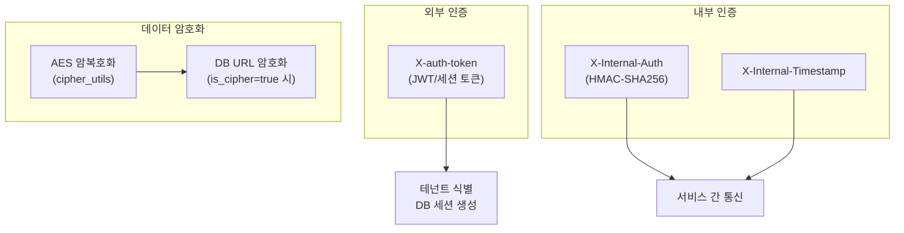

### 9.2 보안 요소

| 영역 | 메커니즘 | 설명 |
|------|---------|------|
| **API 인증** | `X-auth-token` 헤더 | 모든 엔드포인트에서 필수 |
| **내부 통신** | HMAC-SHA256 + 타임스탬프 | 서비스 간 내부 API 호출 |
| **데이터 암호화** | AES (`cipher_utils`) | DB URL 등 민감 정보 암호화 |
| **CORS** | 미들웨어 설정 | 현재 `*` (운영 시 제한 필요) |
| **데이터 격리** | Database-per-Tenant | 테넌트 간 완전한 데이터 격리 |

---

## 10. 운영 체크리스트

### 배포 전 확인사항

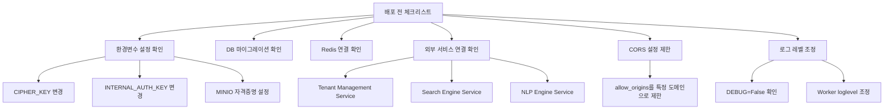
