# 서비스 및 매니저 계층 상세

> Business Logic Layer와 Infrastructure Layer의 매니저, 서비스, 클라이언트에 대한 상세 문서입니다.

## 1. 계층 구조 개요

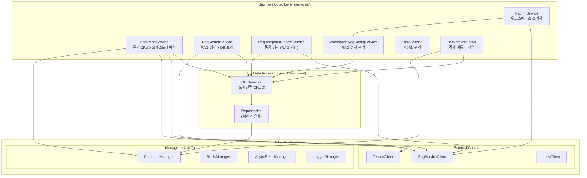

---

## 2. Application Services (`services/`)

### 2.1 DocumentService (`services/document_service.py`)

문서의 전체 생명주기를 관리하는 핵심 오케스트레이션 서비스입니다.

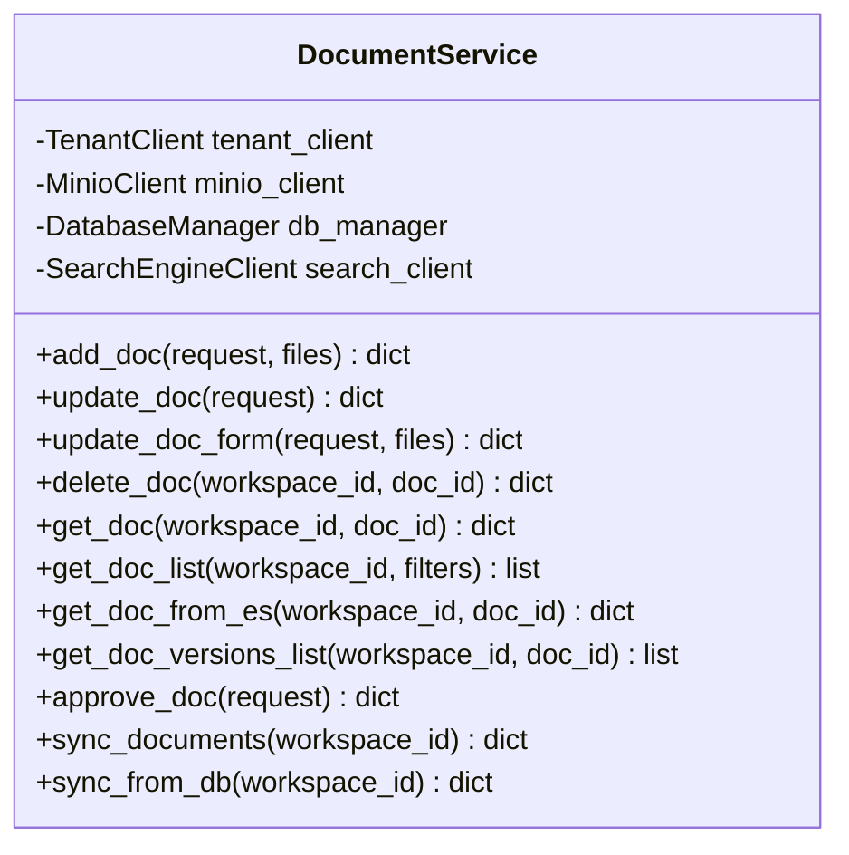

#### 문서 생성 상세 흐름

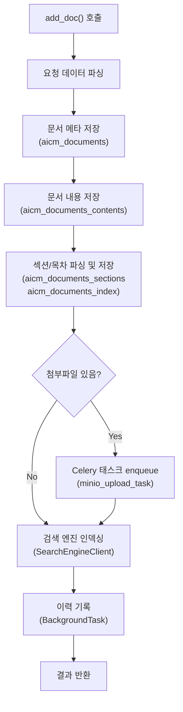

#### 문서 수정 상세 흐름

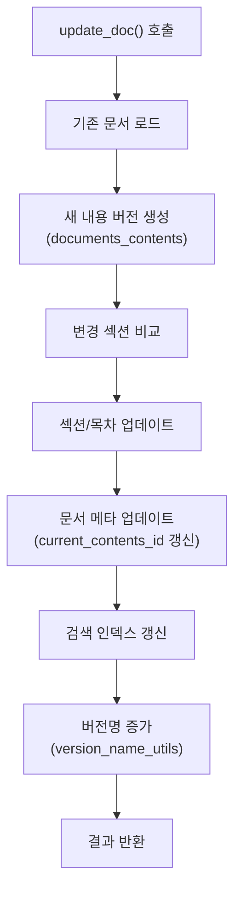

### 2.2 RagSearchService (`services/rag_search_service.py`)

RAG Service 검색 결과를 처리하고 DB 문서 데이터로 보강하는 서비스입니다.

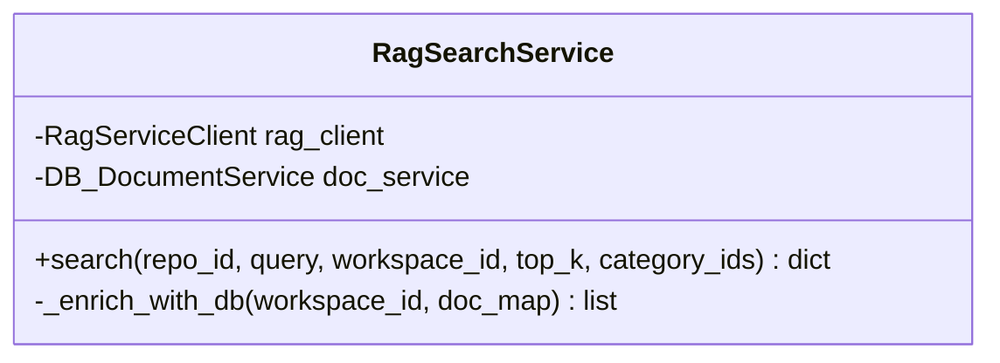

#### 검색 파이프라인

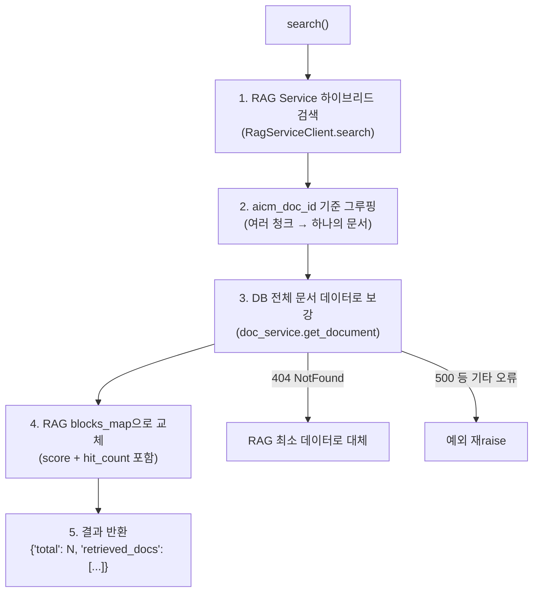

### 2.3 RagIntegratedSearchService (`services/rag_integrated_search_service.py`)

통합 검색 엔드포인트(`/search/integrated`)의 검색 로직을 담당합니다. 검색 결과를 루트 카테고리 기준으로 그루핑합니다.

### 2.4 RagInitService (`services/rag_init_service.py`)

워크스페이스별 첫 문서 업로드 시 RAG 레포지토리와 API 키를 자동 프로비저닝합니다.

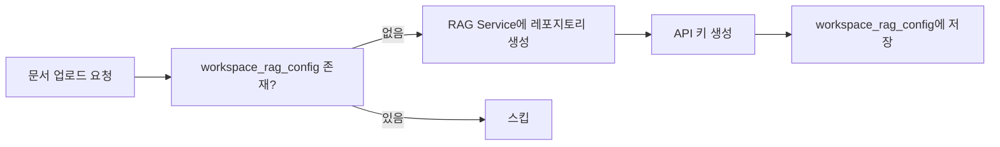

### 2.5 WorkspaceRagConfigService (`db/services/workspace_rag_config_service.py`)

`workspace_rag_config` 테이블의 CRUD를 담당합니다. 워크스페이스별 RAG 레포지토리 ID와 API 키를 관리합니다.

### 2.6 BackgroundTasks (`services/background_tasks.py`)

FastAPI의 BackgroundTasks를 활용한 경량 비동기 작업입니다.

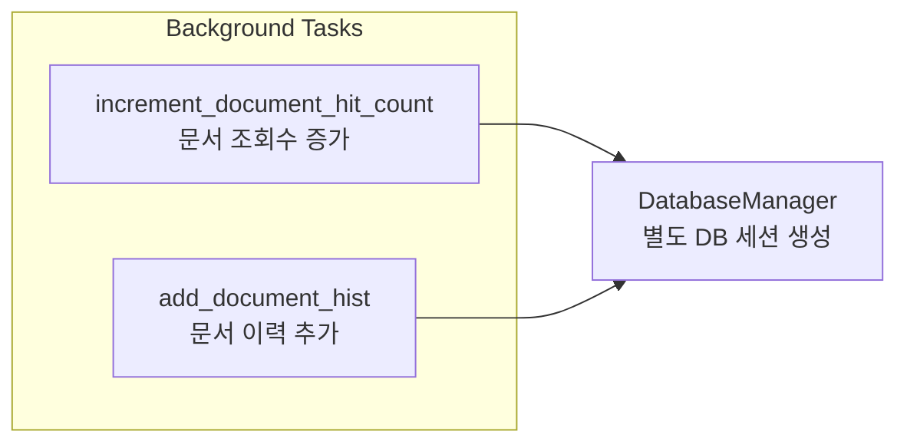

---

## 3. DB Services (`db/services/`)

Data Access Layer의 서비스로, Repository를 조합하여 트랜잭션 단위의 비즈니스 로직을 처리합니다.

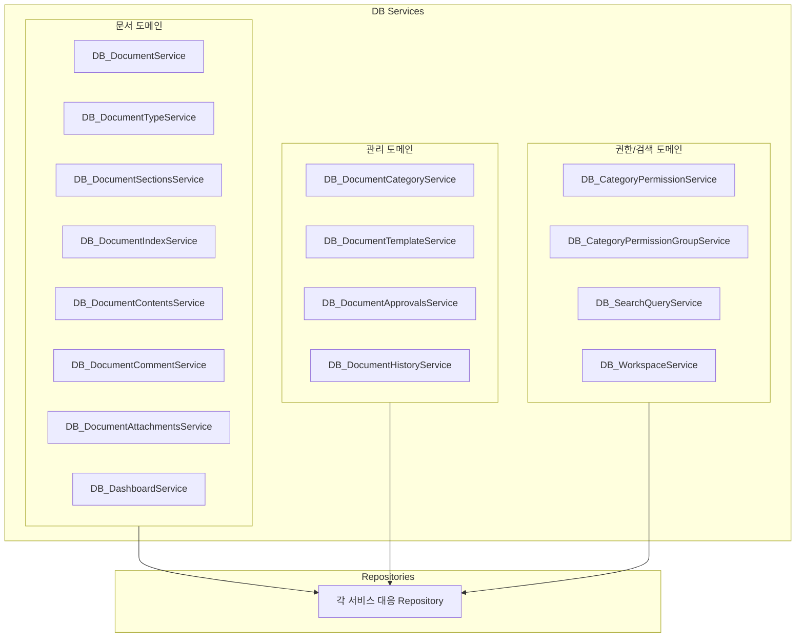

### 서비스-리포지토리 매핑

| DB Service | Repository | 테이블 |
|-----------|-----------|--------|
| `DB_DocumentService` | `DocumentRepository` | `aicm.aicm_documents` |
| `DB_DocumentContentsService` | `DocumentContentsRepository` | `aicm.aicm_documents_contents` |
| `DB_DocumentSectionsService` | `DocumentSectionsRepository` | `aicm.aicm_documents_sections` |
| `DB_DocumentIndexService` | `DocumentIndexRepository` | `aicm.aicm_documents_index` |
| `DB_DocumentAttachmentsService` | `DocumentAttachmentsRepository` | `aicm.aicm_documents_attachments` |
| `DB_DocumentCommentService` | `DocumentCommentRepository` | `aicm.aicm_documents_comments` |
| `DB_DocumentTypeService` | `DocumentTypeRepository` | `aicm.document_types` |
| `DB_DashboardService` | `DashboardRepository` | (다중 테이블 집계) |
| `DB_DocumentCategoryService` | `DocumentCategoriesRepository` | `aicm.aicm_documents_categories` |
| `DB_DocumentTemplateService` | `DocumentTemplatesRepository` | `aicm.aicm_documents_templates` |
| `DB_DocumentApprovalsService` | `DocumentApprovalsRepository` | `aicm.aicm_documents_approvals` |
| `DB_DocumentHistoryService` | `DocumentHistoryRepository` | `aicm.aicm_documents_hist` |
| `DB_CategoryPermissionService` | `CategoryPermissionRepository` | `aicm.aicm_category_permissions` |
| `DB_CategoryPermissionGroupService` | `CategoryPermissionGroupRepository` | `aicm.aicm_permission_groups` |
| `DB_SearchQueryService` | `SearchQueryRepository` | `aicm.aicm_search_query` |
| `DB_WorkspaceService` | `WorkspaceRepository` | `ce.workspaces` |

---

## 4. Managers (싱글톤 인프라)

### 4.1 DatabaseManager (`managers/database_manager.py`)

멀티테넌트 환경에서 동적으로 DB 연결을 관리하는 핵심 매니저입니다.

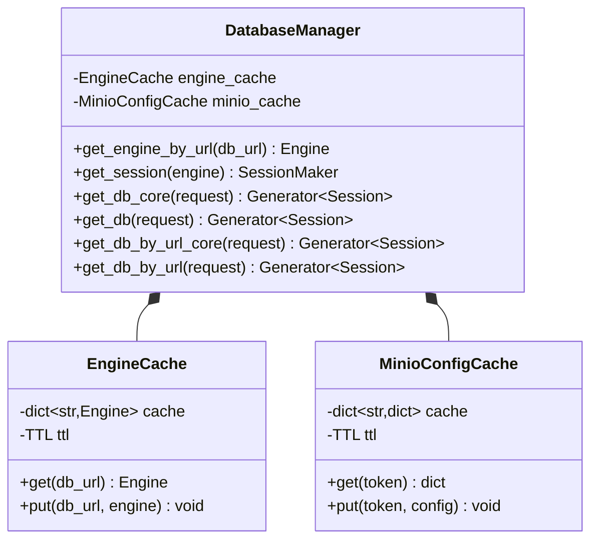

#### DB 세션 생성 흐름

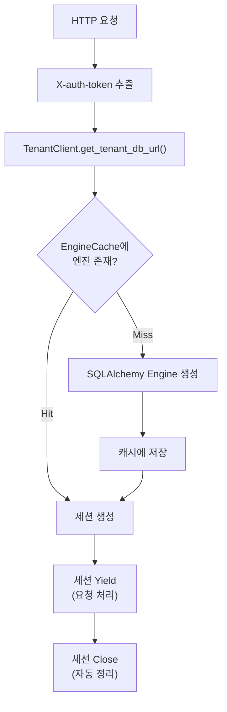

#### FastAPI 의존성 주입 패턴

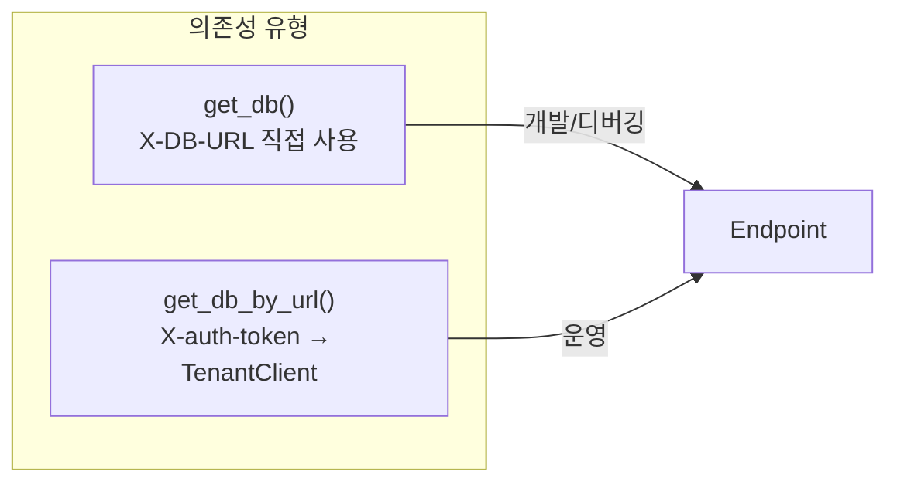

### 4.2 RedisManager (`managers/redis_manager.py`)

Redis Stream 기반 이벤트 발행/소비를 담당합니다.

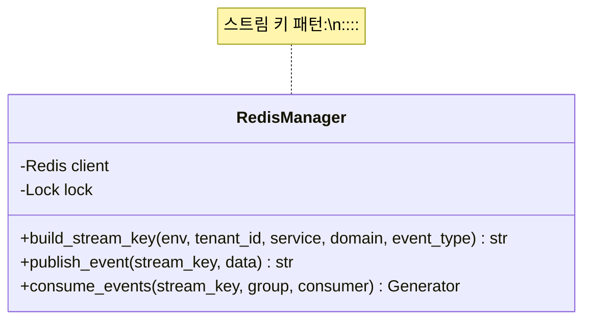

#### Redis Stream 이벤트 흐름

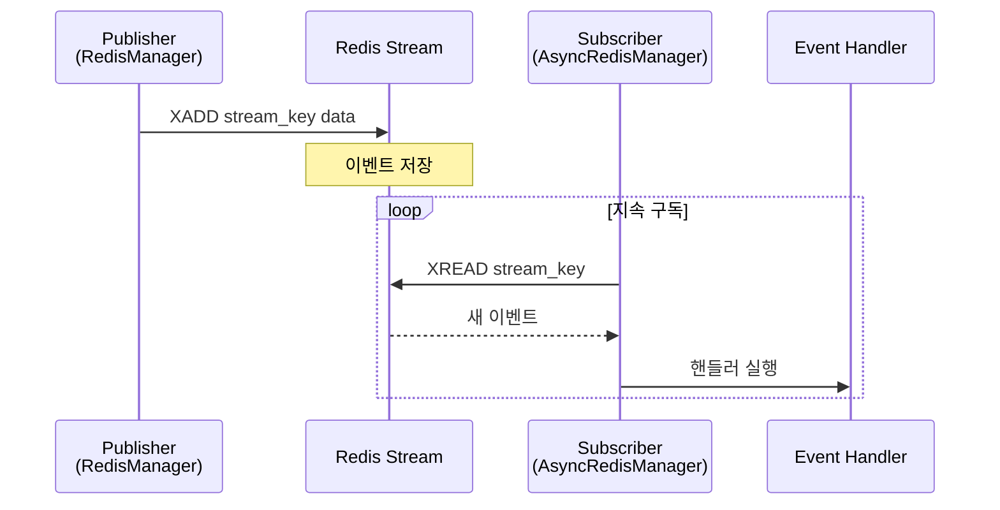

### 4.3 AsyncRedisManager (`managers/async_redis_manager.py`)

비동기 환경에서 Redis Stream을 구독하고 등록된 핸들러를 실행합니다.

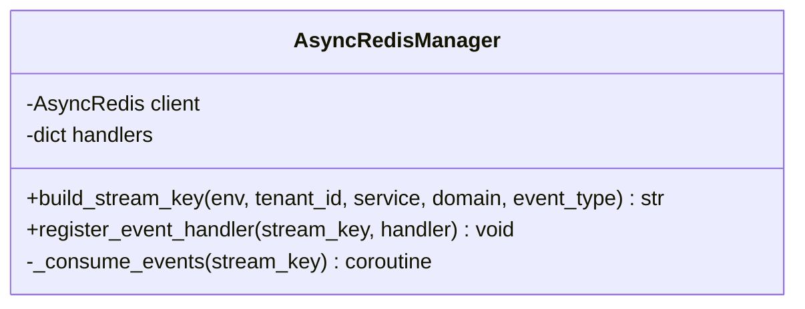

### 4.4 LoggerManager (`managers/logger_manager.py`)

Loguru와 OpenTelemetry를 통합하는 로깅 매니저입니다.

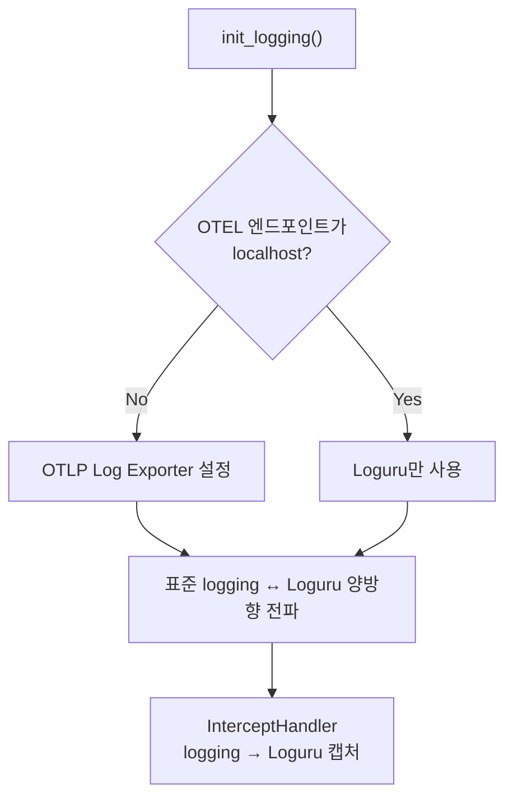

### 4.5 EmbeddingModelManager (`managers/embedding_model_manager.py`)

SentenceTransformer 임베딩 모델의 초기화 및 제공을 담당합니다.

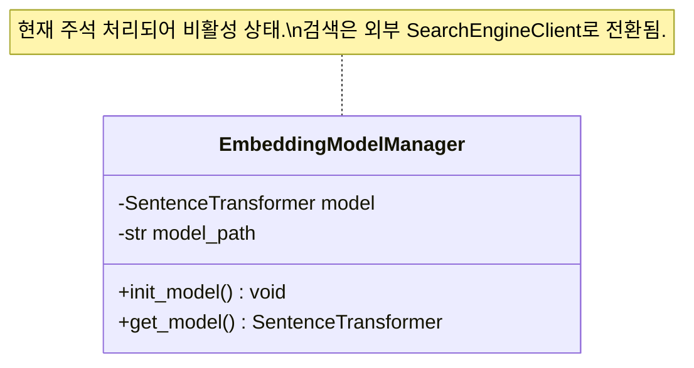

> 현재 `EmbeddingModelManager`는 `main.py`에서 주석 처리되어 있습니다. 문서 임베딩 및 검색은 외부 Search Engine Service로 위임되어 있습니다.

---

## 5. External Clients (`clients/`)

### 5.1 클라이언트 간 관계

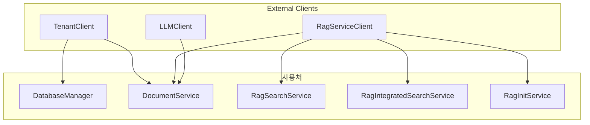

### 5.2 TenantClient

멀티테넌트 환경에서 테넌트 설정을 조회하는 핵심 클라이언트입니다.

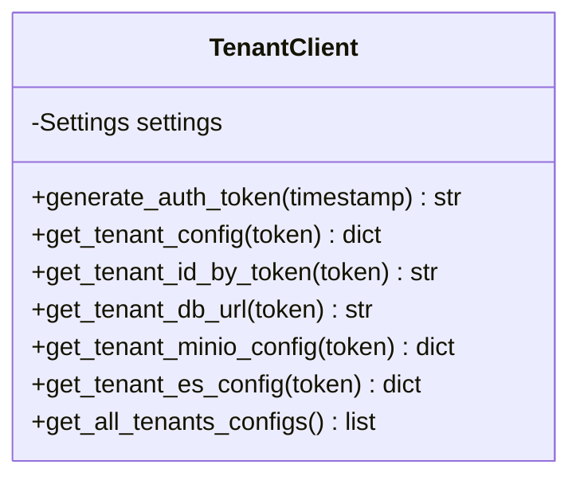

#### 테넌트 설정 조회 구조

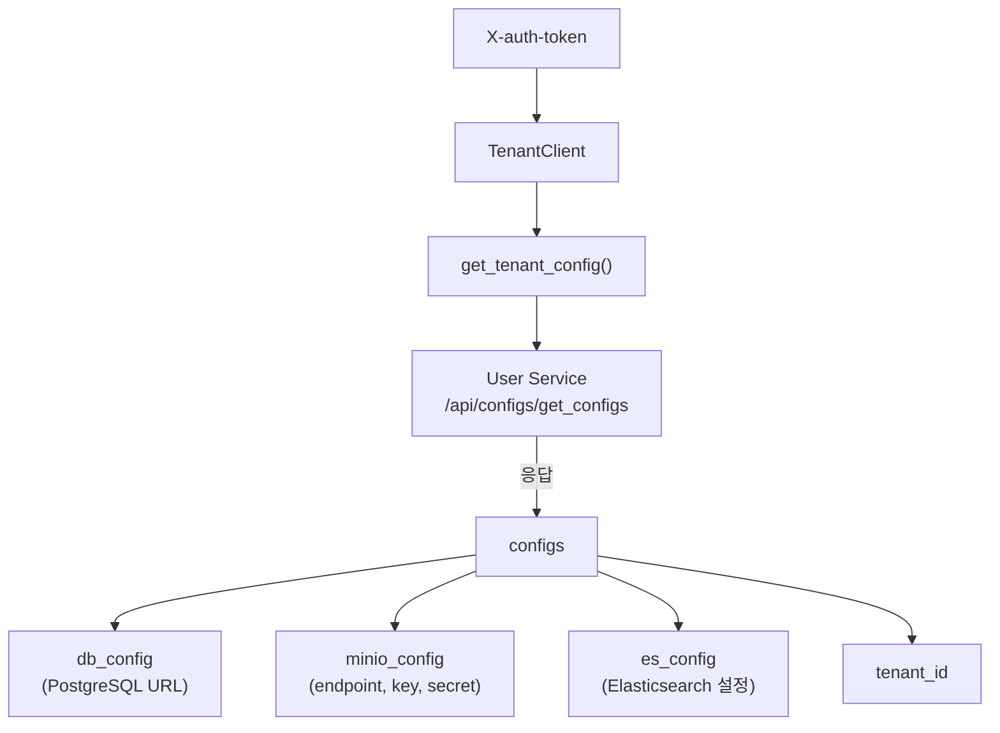

### 5.3 MinioClient

S3 호환 오브젝트 스토리지 클라이언트입니다.

```mermaid
classDiagram
    class MinioClient {
        -Minio client
        -str bucket
        +ensure_bucket() void
        +upload_file(data, name, type) str
        +get_presigned_url(name, expires) str
        +download_to_tempfile(name) str
        +list_objects(prefix) list
        +delete_object(name) void
        +delete_objects_with_prefix(prefix) void
    }
```

### 5.4 RagServiceClient (`clients/rag_service_client.py`)

RAG Service와 통신하는 핵심 클라이언트입니다. API 키 및 토큰 기반 인증 모드를 모두 지원합니다.

```mermaid
classDiagram
    class RagServiceClient {
        -str base_url
        -str auth_mode
        -str api_key
        -float timeout
        +create_repo(workspace_id) dict
        +create_api_key(repo_id) dict
        +delete_repo(repo_id) void
        +index_document(repo_id, doc_id, content, metadata) dict
        +delete_document(repo_id, rag_doc_id) void
        +search(repo_id, query, category_ids, top_k) dict
        +get_document_preview(repo_id, rag_doc_id) Response
        +download_document(repo_id, rag_doc_id) Response
        +list_categories(repo_id) list
        +create_category(repo_id, data) dict
        +update_category(repo_id, category_id, data) dict
        +delete_category(repo_id, category_id) void
        +bulk_upload_categories(repo_id, categories) dict
        +list_synonyms(repo_id) list
        +create_synonym(repo_id, data) dict
        +delete_synonym(repo_id, synonym_id) void
        +health_check(repo_id) dict
    }
```

> `SearchEngineClient`(ES 기반)와 `NLPEngineClient`(형태소 분석)는 RAG Service 전환으로 폐기되었습니다.

---

## 6. 유틸리티 (`utils/`)

```mermaid
graph TB
    subgraph Utils["유틸리티 모듈"]
        HTML["html_utils.py<br/>HTML↔마크다운 변환<br/>html_to_plain_text<br/>ES 하이라이트 병합"]
        CIPHER["cipher_utils.py<br/>AES 암복호화"]
        CAL["calendar_utils.py<br/>기간 계산"]
        VER["version_name_utils.py<br/>버전명 증가 (v1.0 → v1.1)"]
        STR["str_utils.py<br/>문자열 정리"]
        OUTLINE["outline_utils.py<br/>문서 아웃라인에서<br/>블록 ID 수집"]
        MEM["memory_utils.py<br/>GC, GPU 메모리 정리"]
    end

    subgraph Usage["주요 사용처"]
        DS["DocumentService"] --> HTML & VER & OUTLINE
        DBM["DatabaseManager"] --> CIPHER
        DASH["Dashboard"] --> CAL
        EP["Endpoints"] --> MEM
    end
```

| 유틸리티 | 주요 함수 | 사용처 |
|----------|----------|--------|
| `html_utils` | `html_to_plain_text()`, `merge_highlight()` | 문서 텍스트 처리 |
| `cipher_utils` | `encrypt_str()`, `decrypt_str()` | DB URL 암복호화 |
| `calendar_utils` | `get_period_date()` | 대시보드 기간 필터 |
| `version_name_utils` | `next_version_name()` | 문서 버전 관리 |
| `outline_utils` | `collect_blocks()` | 문서 섹션 파싱 |
| `str_utils` | `remove_leading_newlines()` | 텍스트 정리 |
| `memory_utils` | `cleanup_memory()` | GC/GPU 메모리 해제 |
