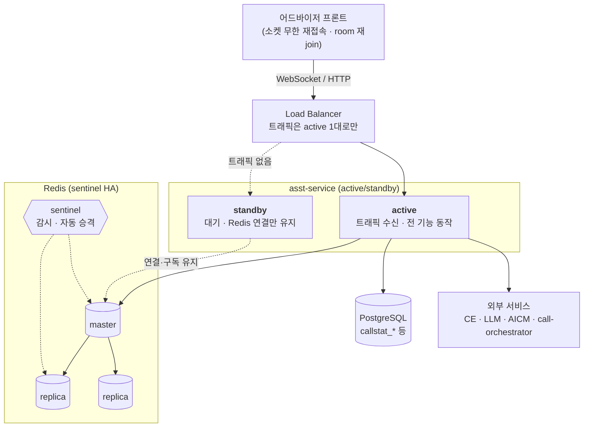
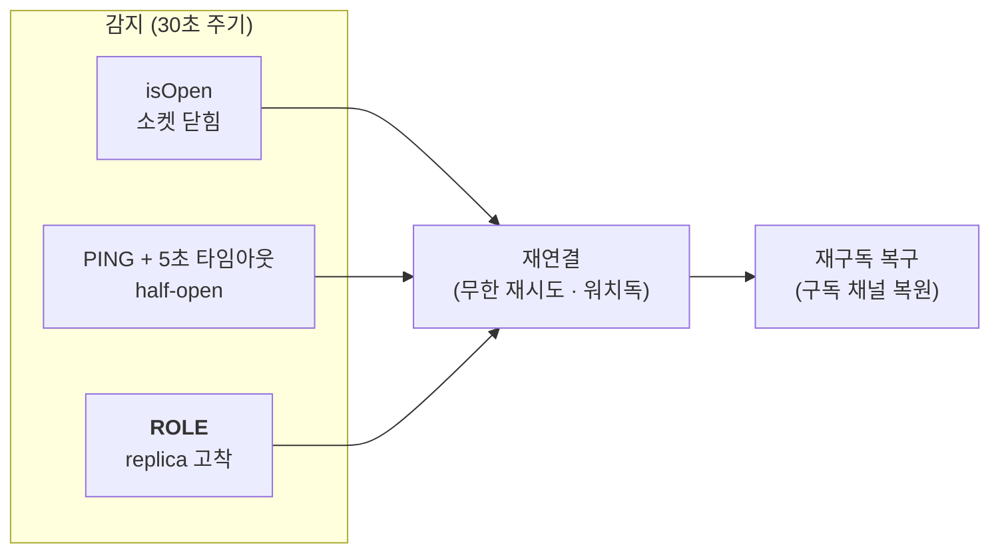

# 어드바이저 백엔드 — 이중화(HA) 아키텍처

> **범위**: asst-service 백엔드 기준. 가용성·장애 대응 관점만 다룬다.
> 실시간 메시지 흐름·채널 카탈로그·room 키 규칙은 **`backend-socket-redis-architecture.md`** 를 참조한다.
> 프론트엔드 동작은 별도 관리한다(요약만 4-3에 기재).

---

## 1. 이중화 방침

| 항목 | 결정 |
|---|---|
| 방식 | **active / standby** |
| 목적 | **무중단 배포 + 장애 대비** |
| 부하 분산 | **하지 않음** (scale-out 아님) |
| 근거 | 상담사 약 300명 규모로 **1대가 충분히 감당**. 소켓 300 연결은 단일 인스턴스 여유 범위 |

> 두 인스턴스가 동시에 트래픽을 받는 active/active가 **아니다.** 이 전제가 바뀌면 9장을 참조한다.

---

## 2. 전체 구성



### 이중화 계층

| 계층 | 방식 | 전환 주체 | 전환 감지 |
|---|---|---|---|
| **asst-service** | active/standby | LB / 오케스트레이터 | 헬스 프로브 |
| **Redis** | master + replica 2, 자동 승격 | **sentinel** | sentinel quorum |
| PostgreSQL | 본 문서 범위 밖 | — | — |

---

## 3. ★ 상태 저장 위치 — 이중화 설계의 근간

> **설계 원칙: 전환 후에도 필요한 것은 프로세스 밖에 둔다.**
> 어떤 상태가 어디 있느냐가 곧 "전환 시 무엇이 살아남느냐"를 결정한다.

| 상태 | 저장 위치 | 전환 시 | 복구 방식 |
|---|---|---|---|
| 통화 이력 · VOC 분석 결과 | **PostgreSQL** | ✅ 보존 | — |
| 상담사 상태 · 통화 상태 · 콜 매핑 | **Redis** (hash) | ✅ 보존 | — |
| VOC 중복 방지 락 | **Redis** (`SET NX EX 60`) | ✅ 보존 | 비동기 복제 한계 있음 (8장) |
| STT 이벤트 | **Redis Stream** (롤링 ~1,000건) | ✅ 보존 | 이 서비스는 소비하지 않음 |
| 소켓 room 멤버십 | ⚠️ **프로세스 메모리** | ❌ 소실 | 프론트 재접속 + room 재join |
| VOC 발화 누적 버퍼 (`states`) | ⚠️ **프로세스 메모리** | ❌ 소실 | 새 발화 쌓이며 자동 재축적 |
| 토큰 · 회사 UUID 캐시 | ⚠️ **프로세스 메모리** | ❌ 소실 | 다음 HTTP 요청에 자동 재생성 |

**핵심**: 프로세스 메모리에 남은 3가지는 모두 **자동 회복되는 캐시성 상태**다. 영구 손상으로 이어지는 상태는 프로세스 밖에 있다.

---

## 4. 실시간 전달 경로 (가용성 관점)

> 상세 채널명·페이로드는 `backend-socket-redis-architecture.md` 참조.

### 4-1. 두 가지 전달 패턴

| 패턴 | 경로 | 대상 | active/standby 영향 |
|---|---|---|---|
| **A. Redis 경유** | HTTP → DB 저장 → **Redis publish** → 각 인스턴스 구독 → 소켓 emit | 코칭 · 코칭요청 | 없음 |
| **B. 직접 emit** | HTTP → DB 저장 → **소켓 emit** (Redis 미경유) | 상담사 상태 · 공지 | **없음** — 접속자가 전부 active 한 대에 있으므로 전원 도달 |

> 패턴 B는 active/active에서만 문제가 된다(9장). active/standby에서는 정상 동작한다.

### 4-2. 알림 메시지의 멱등성

코칭·상태 알림은 **내용이 아니라 "재조회 트리거"** 를 보낸다. 프론트는 신호를 받고 카운트를 다시 조회한다.

→ **중복 수신되어도 결과가 동일하다.** 이 설계 덕분에 재전송·중복에 강하다.
(단, 프론트의 토스트·알림음 같은 1회성 부수효과는 별도 dedupe 필요)

### 4-3. 프론트엔드 전제 (별도 관리)

- 소켓 **무한 재접속**
- 재연결 시 **room 재join**
- **room(채널)명 고정** → 어느 인스턴스에 붙어도 같은 채널을 다시 잡음

→ `connectionStateRecovery`(2분 복원)는 인메모리라 인스턴스 간에 동작하지 않지만, 위 구조가 이를 대체한다.

---

## 5. Redis 연결 아키텍처 (가용성 관점)

### 5-1. 커넥션 구성

```
RedisService
 ├─ client      : 일반 명령 (GET/SET/HSET/PUBLISH …)
 └─ subscriber  : 구독 전용 (SUBSCRIBE)
```

구독 중에도 일반 명령을 수행하기 위해 커넥션을 분리한다.

### 5-2. 자가복구 계층



**감지 3종은 각각 다른 장애를 잡는다.**

| 감지 | 잡는 장애 | 없으면 |
|---|---|---|
| `isOpen` | 소켓이 명시적으로 끊김 | — |
| `PING` + 타임아웃 | LB가 FIN 없이 조용히 끊은 half-open | 연결된 줄 알고 계속 실패 |
| **`ROLE`** | **failover 후 replica에 붙어 있음** | **연결·PING·SUBSCRIBE는 정상인데 쓰기만 실패하는 상태로 고착** |

### 5-3. 연결 판정 기준

`connect`(소켓만 연결)가 아니라 **`ready`**(AUTH/SELECT 완료) 기준으로 판정한다. `connect` 시점에는 아직 명령을 보낼 수 없다.

### 5-4. 발행 전달 보장

**at-most-once** 를 유지한다.

| 상황 | 동작 |
|---|---|
| 미연결이 확실 (명령 전송 전) | 재시도 (200ms → 500ms, 최대 3회) |
| 전송 후 응답 유실 (도달 여부 불명) | **재시도하지 않음** |

> **중복보다 유실을 선택한다.** 알림이 중복되면 프론트의 1회성 부수효과(토스트·알림음)가 사용자에게 그대로 보이기 때문이다.

---

## 6. 장애 시나리오별 동작

### 6-1. Redis 전환 (master → replica 승격)

| 단계 | 동작 |
|---|---|
| 감지 | 소켓 끊김 즉시 / half-open·replica 고착은 최대 30초 |
| 복구 | 무한 재연결 → 재구독 복구 |
| 유실 | 전환 구간에 발행된 pub/sub 메시지 (재전송 없음) |
| 특수 | DNS 미갱신으로 구 master(=replica)에 붙으면 **ROLE 검사가 감지 후 백오프 재연결** |

### 6-2. asst-service 전환 (active → standby)

| 항목 | 결과 |
|---|---|
| 소켓 | 전원 끊김 → standby로 재연결 (프론트 무한 재시도 + room 재join으로 자동 복구) |
| 전환 중 코칭·공지 | 유실 (pub/sub은 재전송 없음) |
| VOC 발화 버퍼 | 초기화 → 새 발화로 자동 재축적 |
| 토큰·회사 캐시 | 소실 → 다음 요청에 재생성 |
| 진행 중 SSE 응답 | 끊김 → 프론트 재요청 |
| DB · Redis 데이터 | **영향 없음** |

**일시적 유실만 있고 영구 손상은 없다.**

### 6-3. standby가 대기 중 하는 일

| 항목 | 동작 |
|---|---|
| Redis 연결·구독 | **유지** (승격 즉시 서비스 가능하도록) |
| 헬스체크·자가복구 | 동작 |
| 코칭 채널 구독 | 수신하되 빈 room에 emit → 무해 (로그 경고만) |
| 실시간 VOC | **미동작** — `/assist-stream` HTTP 호출 시에만 수행되며 트래픽이 없음 |
| 스케줄러 · 스트림 소비 | **없음** — 중복 실행·경합 없음 |

> standby는 사실상 **Redis 연결만 유지한 채 대기**한다. active와 경합하지 않는다.

---

## 7. 설계 원칙

| # | 원칙 | 적용 |
|---|---|---|
| 1 | **가용성 우선** | VOC 중복 방지 락은 Redis 장애 시 통과(fail-open). 락 때문에 서비스가 멈추지 않는다 |
| 2 | **at-most-once 발행** | 중복 위험이 있으면 재시도하지 않는다 |
| 3 | **Redis는 전달 버퍼** | 영구 보존이 필요한 데이터는 PostgreSQL. Redis는 롤링·TTL 전제 |
| 4 | **채널명 고정** | 재접속 시 클라이언트가 같은 채널을 다시 잡을 수 있다 |
| 5 | **알림은 트리거로** | 내용이 아닌 "재조회 신호"를 보내 중복에 강하게 만든다 |
| 6 | **전환 후 필요한 상태는 프로세스 밖에** | 3장 표 참조 |

---

## 8. 알고 수용하는 제약

| 제약 | 이유 | 영향 |
|---|---|---|
| 전환 구간의 pub/sub 메시지 유실 | pub/sub은 저장·재전송이 없음 | 전환 시간만큼의 짧은 구간 |
| VOC 발화 버퍼 초기화 | 인메모리 설계 | 전환 직후 몇 턴간 분석 맥락이 짧음 |
| 승격 직전 쓰기 유실 가능 | Redis 복제가 **비동기** | 락 키 등 수 ms 분량. Redis 구조상 불가피 |
| `connectionStateRecovery` 인스턴스 간 미동작 | 인메모리 세션 | 프론트 재접속 구조로 대체 |

---

## 9. active/active(scale-out)로 전환할 경우 — 현재 해당 없음

향후 부하 분산이 필요해지면 아래가 추가로 필요하다.

| 항목 | 내용 |
|---|---|
| **sticky session** | LB 설정. polling 폴백과 세션 복원용. 코드 작업 아님 |
| **패턴 B → 패턴 A 전환** | 상담사 상태·공지의 직접 emit을 Redis publish 경유로 변경. 안 하면 접속자의 1/N에게만 도달 |
| **인메모리 캐시 외부화** | 토큰·회사 UUID 캐시를 Redis로. `DB_DIRECT_CON=0`인 환경에서만 해당 |

> sticky session만으로는 두 번째 항목이 해결되지 않는다. sticky는 "클라이언트를 같은 인스턴스에 고정"하는 것이고, 그 문제는 "인스턴스 간 이벤트 전파"라 별개다.

---

## 10. 운영 파라미터

| 항목 | 값 | 의미 |
|---|---|---|
| `REDIS_HEALTH_CHECK_INTERVAL` | **30,000ms** | 장애 감지 주기. Redis failover(10~30초) 수준에 맞춤 |
| PING 타임아웃 | 5,000ms | half-open 판정 |
| ROLE 타임아웃 | 3,000ms | 마스터 여부 확인 |
| 발행 재시도 | 200ms → 500ms (총 3회) | HTTP 응답을 오래 붙잡지 않도록 700ms 상한 |
| replica 감지 재연결 | 1·2·4·8… 회차 백오프 | 매번 재연결하면 구독이 반복 단절되어 오히려 유실이 늘어남 |
| `connectionStateRecovery` | 120,000ms | 같은 인스턴스 재연결 시에만 유효 |
| socket `pingInterval` / `pingTimeout` | 25초 / 60초 | LB 환경 조기 단절 방지 |

---

## 관련 문서

| 문서 | 내용 |
|---|---|
| `backend-socket-redis-architecture.md` | 실시간 메시지 흐름 · 채널 카탈로그 · room 키 규칙 |
| `2026-0728_redis-이중화-대비-점검-및-조치.md` | 본 아키텍처에 도달하기까지의 점검 결과와 조치 이력 |
| `2026-0728_redis-failover대응_이식요청.md` | 동일 구조 타 저장소 이식용 |
