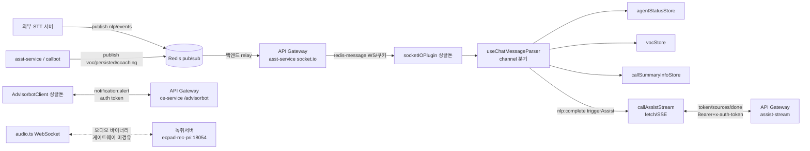
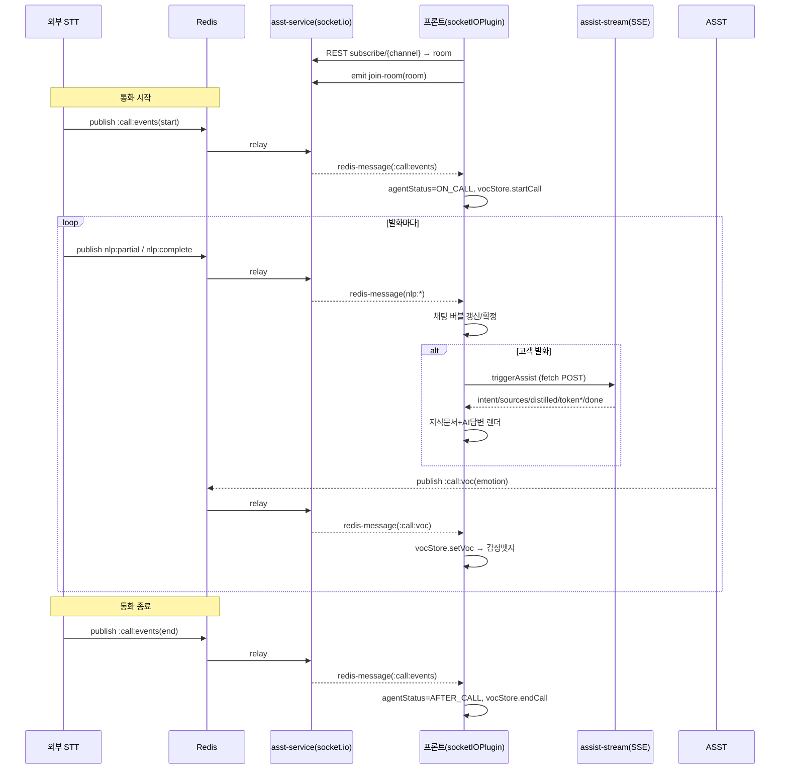

# 실시간 통신 & Redis pub/sub 아키텍처 — 프론트엔드(asst-web-portal)

> 작성일: 2026-07-23
> 목적: **draw.io / PPT 작화용** 구조 정리. 프론트엔드가 사용하는 실시간 통신(socket.io / WebSocket / SSE)과 Redis pub/sub 수신 구조를 노드·엣지·이벤트 단위로 정리한다.
> 관점: **프론트는 Redis를 직접 보지 않는다.** 백엔드가 `Redis 채널 → socket.io 룸`으로 중계(relay)하고, 프론트는 룸에 join한 뒤 `redis-message` 이벤트로 받아 채널명으로 분기한다.

---

## 0. 한눈에 보기 — 실시간 채널 4종

| # | 채널 | 프로토콜 | 대상 서비스 | 게이트웨이 | 인증 | 용도 | 상태 |
|---|---|---|---|---|---|---|---|
| **A** | 메인 socket.io | Socket.IO (WS+polling) | asst-service | ✅ 경유 | **쿠키**(withCredentials) | **Redis relay 수신**(STT/VOC/상태/공지/코칭) | ✅ 핵심 |
| **B** | Advisorbot socket.io | Socket.IO (WS) | ce-service | ✅ 경유 | `auth:{token}` 핸드셰이크 | 상담보조 봇 세션/알림 | ⚠️ 사실상 미사용(알림만) |
| **C** | assist-stream SSE | fetch + SSE (POST) | asst-service | ✅ 경유 | Bearer + `x-auth-token` 헤더 | RAG 검색·AI 답변 토큰 스트리밍 | ✅ 핵심 |
| **D** | 실시간 청취 WebSocket | native WebSocket | **별도 녹취서버**(rec-pri:18054) | ❌ **미경유** | query `agentId`(무인증) | 통화 오디오 실시간 청취 | ✅ 사용중 |

- **공통 게이트웨이**: `LANGSA_GATEWAY_URL` (dev `https://ecpad.etaas.co.kr`, prd `https://ecp.etaas.co.kr`)
- **A/B/C는 게이트웨이 단일 진입점**, **D만 별도 도메인 직결**(`wss://ecpad-rec-pri.etaas.co.kr:18054`).

> ⚠️ **혼동 주의 — 죽은/제거된 코드** (다이어그램에 넣지 말 것)
> - `SocketClient.js` + `stores/modules/socket.ts` + `SocketChannelManager.ts` + `AppInitializer.ts` = **비활성**. 진입점 `AppInitializer.initialize()`가 어디서도 호출되지 않음. 실제 소켓은 전부 `socketIOPlugin.ts`(구현 A)로 흐름.
> - CCAAS SockJS/Stomp(`websocket.ts`) = **2026-07-23 삭제됨**. STOMP/`/topic/`/`/queue/` 미사용.

---

## A. 메인 socket.io 파이프라인 (asst-service) — ⭐ 핵심

### A-1. 연결 스펙
| 항목 | 값 | 근거 |
|---|---|---|
| 구현 | 함수형 싱글톤 (모듈 스코프 `let socket` 1개) | `src/api/socketIOPlugin.ts:4,18-36` |
| baseUrl | `LANGSA_GATEWAY_URL` | `consultant/index.vue:58`, `useAdvisorBootstrap.ts:90` |
| namespace | `/` (기본) | `socketIOPlugin.ts:23` |
| path | `/aicc/asst-service/socket.io` (`${ASST_API_PREFIX}/socket.io`) | `path.ts:32` |
| transports | `["websocket", "polling"]` | `socketIOPlugin.ts:25` |
| 인증 | `withCredentials`(쿠키). **WS 핸드셰이크는 커스텀 헤더 불가 → 쿠키만 유효** | `socketIOPlugin.ts:27` |
| 재연결 | `reconnectionAttempts: Infinity`, delay 1s~5s, timeout 20s, `autoConnect:false` | `socketIOPlugin.ts:24-35` |

### A-2. 초기화 / 생명주기
- **진입점 2개** (둘 다 구현 A 사용, 멱등 가드):
  - 구버전: `consultant/index.vue` `onBeforeMount` → `initSocket()` → `connect()`
  - 리뉴얼: `useAdvisorBootstrap.ts` `bootstrap()` → `initSocket()` → `connect()` (모듈 싱글톤 `bootstrapPromise`로 1회 보장)
- **connect**: `socketIOPlugin.ts:79-100` (`connect()` + `once("connect")` Promise)
- **disconnect**: 로그아웃 세션정리 단 1곳 — `advisorSession.ts:27` `clearAdvisorSessionState()`
- 컴포넌트 언마운트 시엔 **소켓을 끊지 않고 리스너/룸만 정리**(단일 소켓 공유)

### A-3. 이벤트 (수신 on / 송신 emit)
**수신(on) — 애플리케이션 이벤트 3개:**
| 이벤트 | 페이로드 | 처리 → 흐름 |
|---|---|---|
| `redis-message` | `{ message: { message, channel }, timestamp }` | **Redis relay 봉투.** `channel` 접미사로 분기 (§A-4) |
| `agent-status-update` | `{ cc_cti_id, status, ... }` | 본인 `cc_cti_id` 일치 시 `agentStatusStore.setStatus` |
| `notice` | `{ message: { is_urgent, ... } }` | `noticeStore` 재조회 + 토스트 |

**송신(emit) — 2개:**
| 이벤트 | 페이로드 | 시점 |
|---|---|---|
| `join-room` | `roomId`(문자열) | `joinRoom()` — 룸 참여 (`socketIOPlugin.ts:108-111`) |
| `leave-room` | `roomId`(문자열) | `leaveRoom()` — 룸 이탈 |

**시스템 이벤트**(로깅만): `connect`/`disconnect`/`connect_error` + Manager `reconnect_*` (`socketIOPlugin.ts:40-69`)

**고정 룸**: `"agent-status"`(상태 브로드캐스트), `"notices"`(공지)

### A-4. `redis-message` 채널 분기 (STT/VOC 파이프라인 심장부)
파서: `src/view/advisor/components/chat/composables/useChatMessageParser.ts:144-651`

| channel 접미사 | 주요 페이로드 | 처리 → store/화면 |
|---|---|---|
| `:call:events` | `type`(start/end), `agent_id`, `call_id`, `customerNum` | 통화 시작/종료 → `agentStatusStore`(ON_CALL/AFTER_CALL), `callSummaryInfoStore`, `vocStore.startCall/endCall`, `customerStore` |
| `nlp:partial` | `speaker`, `turn_idx`, `origin_text` | 실시간 자막(타이핑) → 채팅 스트리밍 버블 |
| `nlp:complete` | `speaker`, `turn_idx`, `origin_text`, `masked_text`, `start_ms/end_ms`, `turn:{ending,eou}`, `nlp:{intent[],keywords[]}` | 발화 확정 → 버블 확정 + **고객 발화면 `triggerAssist()`(SSE C 트리거)** |
| `:call:voc` | `call_id`, `turn_idx`, `emotion:{type,score}` | dedup 후 `vocStore.setVoc` → 감정 뱃지/스파크라인 |
| `orchestrator:persisted` | `call_id`, `callstats_id` | `callSummaryInfoStore` + `emit("orchestrator-persisted")`(요약저장 완료) |
| `stt:final` | — | **현재 미처리** |

**추가 `redis-message` 소비자**(같은 이벤트, 다른 핸들러):
- 코칭 생성(상담사): `agent/index.vue:562-594` (`type==="coaching_created"`, `receiver_key===agent.id`)
- 코칭요청(관리자): `admin/index.vue:429-464` (`type==="coaching_request_created"`)
- Dashboard: `agent/Dashboard.vue:371-381`

---

## A★. Redis pub/sub ↔ socket 매핑 (백엔드 relay 계약) — ⭐ 문서 핵심

### 채널명 생성 규칙 — `src/utils/redisKey.ts:19-42`
`getRedisKey(tenantId, agentId, serviceName)`:

| serviceName | 채널 포맷 | prefix env | 발행 주체 |
|---|---|---|---|
| `nlp` | `{STT_ENV}:{tenantId}:{agentId}:call:nlp:complete` | `STT_ENV` | 외부 STT 서버 |
| `partial` | `{STT_ENV}:{tenantId}:{agentId}:call:nlp:partial` | `STT_ENV` | 외부 STT 서버 |
| `events` | `{STT_ENV}:{tenantId}:{agentId}:call:events` | `STT_ENV` | 외부 STT 서버 |
| `db` | `{CHANNEL_ENV}:{tenantId}:{agentId}:call:orchestrator:persisted` | `CHANNEL_ENV` | asst/callbot |
| `voc` | `{CHANNEL_ENV}:{tenantId}:{agentId}:call:voc` | `CHANNEL_ENV` | asst/callbot |
| `coaching` | `{CHANNEL_ENV}:{tenantId}:{agentId}:coaching` (agentId=receiver_key=`agent.id`) | `CHANNEL_ENV` | asst |
| `coaching_request` | `{CHANNEL_ENV}:{tenantId}:{agentId}:coaching_request` | `CHANNEL_ENV` | asst |

- **prefix 2종** (공용 Redis를 local/dev/aws가 공유 → prefix로 분리):
  - `CHANNEL_ENV = VITE_REDIS_CHANNEL_ENV || "dev"` (voc/db/coaching)
  - `STT_ENV = VITE_STT_CHANNEL_ENV || "dev"` (nlp/events, 외부 STT 발행)
- `tenantId` = `company.vendor_tenant_id`, `agentId` = 상담사 `cc_cti_id`(코칭은 `agent.id`)

### 구독 → 룸 조인 메커니즘
1. `SubscribeAPI.subscribeChannel(channel)` → **REST** `POST /aicc/asst-service/redis-monitor/subscribe/{channel}` (`subscribe.api.ts:21-25`)
2. 응답 `data.socketConnection.room` 획득
3. `joinRoom(room)` → socket `emit("join-room", room)` (`useChatSocket.ts:23-30`)
4. 재연결 시 룸이 소켓id 기준으로 소멸 → `on("connect")`에서 **클라이언트가 재조인**(백엔드는 룸 복구 안 함)

> **coaching/coaching_request/events는 예외**: 백엔드 핸들러가 "채널 문자열을 그대로 룸 이름으로" 써서 emit → `subscribeChannel` REST 없이 채널 문자열을 직접 `joinRoom`한다 (`agent/index.vue:604-610`).

### 역할별 구독 채널 세트
> ⚠️ **주의**: 아래 "채팅 상세 패널" 행은 `chat/index.vue:1360-1373` 기준이다. 관리자가 events를 **아예 안 보는 게 아니다** — 관리자 메인 화면이 별도 경로로 전원 events를 구독하기 때문에, 상세 패널에선 **중복 방지로 events를 뺀다.**

| 화면(구독 지점) | 구독 채널 | 근거 |
|---|---|---|
| 상담사 채팅 패널 | `events, nlp, partial, db, voc` | `chat/index.vue:1368-1372` |
| 관리자가 연 **특정 상담사** 채팅 패널 | `nlp, partial, db, voc` (events 제외 — 중복) | `chat/index.vue:1362-1366` (`isAdmin` 분기) |
| **관리자 메인 화면** | **담당 상담원 전원의 `events`** (상담원별 개별 구독) | `admin/index.vue:319-321` `setAgentMessageListener` |
| Dashboard | `events, nlp, db` | `Dashboard.vue:433-435` |
| 관리자 모니터링 | 상담원 전원의 `events` | `monitoring/index.vue:290` |

**핵심**: `events` 채널(통화 시작/종료 → `agentStatusStore`)은 **관리자 계열에선 "메인/모니터링 화면에서 전원 한 번" 구독**하고, 개별 상담사 상세 패널에선 중복이라 제외한다. 상담사 본인 화면은 자기 것만 보므로 상세 패널에 events 포함.

### relay 전체 흐름
```
[외부 STT 서버]                    [asst / callbot]
   │ publish                          │ publish
   │ {STT_ENV}:{tenant}:{agent}:      │ {CHANNEL_ENV}:{tenant}:{agent}:
   │   call:nlp:complete/partial      │   call:voc / orchestrator:persisted / coaching...
   │   call:events                    │
   ▼                                  ▼
        ┌─────────── Redis pub/sub ───────────┐
        └──────────────────┬──────────────────┘
                           │ 백엔드 구독(redis-monitor) → socket.io 룸으로 relay
                           ▼
         [게이트웨이] asst-service  /aicc/asst-service/socket.io
                           │ emit "redis-message" { message:{message,channel}, timestamp }
                           ▼
       [프론트 socketIOPlugin 싱글톤] (쿠키 인증, WS)  ── joinRoom(room) 선행
                           │ on("redis-message") → useChatMessageParser (channel 분기)
                           ▼
   nlp:* → 채팅버블 │ voc → vocStore │ events → agentStatusStore │ persisted → callSummaryInfoStore
```

---

## B. Advisorbot socket.io (ce-service)

### B-1. 연결 스펙 (`src/utils/AdvisorbotClient.ts:160-174`)
| 항목 | 값 |
|---|---|
| baseUrl | `LANGSA_GATEWAY_URL` (`useAdvisorbot.ts:155`) |
| namespace | `/advisorbot` (URL 하드코딩) |
| path | `/api/ce/v1/socket.io` (`${CE_API_PREFIX}/socket.io`) — 게이트웨이 라우트 `Path=/aicc/ce-service/**, PrefixPath=/api/ce/v1` |
| transports | `["websocket"]` |
| 인증 | `auth: { token }` 핸드셰이크. 토큰 = dev/prd는 쿠키 `accessToken`, 그 외 `VITE_ACCESS_TOKEN`. **withCredentials 없음** |

### B-2. 이벤트
**수신(on)** (`AdvisorbotClient.ts:198-268`):
| 이벤트 | 페이로드 | → 흐름 |
|---|---|---|
| `connection:connected` | `{ sessionId }` | store `isConnected=true` |
| `session:initialized` | `ConnectionData` | store `isSessionInitialized=true` |
| `result:execution` | `AdvisorbotProcessResult` | store `executionHistory`(최대 100) |
| `notification:alert` | `NotificationAlert` | store + **`mittBus.emit("advisorbot:notification")`** → 컴포넌트 토스트 |
| `error:general` | `{ message, code?, details? }` | store `error` |
| `connection:disconnected` | `ConnectionData` | store 연결해제 |

**송신(emit)**:
| 이벤트 | 페이로드 | 트리거 |
|---|---|---|
| `session:initialize` | `{ botId?, graphId?, metadata? }` | 세션 시작 |
| `message:utterance` | `{ role:"agent"\|"customer", text, timestamp }` | 발화 전송 |
| `session:disconnect` | (없음) | 세션 종료 |

> **실동작 주의**: 발화 emit 경로(`sendAgentMessage`/`sendCustomerMessage`)는 구조분해만 되고 **실제 호출 안 됨**(컴포넌트가 옵션 없이 `useAdvisorbot()` 호출 → 세션 초기화 미사용). **현재 유일한 실동작은 `notification:alert` → mittBus → 토스트 표시**뿐. 다이어그램엔 "알림 채널(부분 활성)"로 표기 권장.

---

## C. assist-stream SSE (asst-service)

### C-1. 연결 스펙 (`src/api/apis/assist-stream.api.ts`)
| 항목 | 값 |
|---|---|
| 엔드포인트 | `{게이트웨이}/aicc/asst-service/assist-stream` (수동검색은 `/stream`) |
| 방식 | native `fetch` POST, `Accept: text/event-stream`, body=JSON |
| 인증 | `x-auth-token` + `Authorization: Bearer` 헤더 동시 |
| 파서 | `sse-parser.ts` — `\n\n` 프레임, `event:`/`data:` 라인 |
| 트리거 | `redis-message`의 `nlp:complete`(고객 발화) → `triggerAssist()` → `callAssistStream` |

### C-2. 수신 SSE 이벤트 (`assist-stream.type.ts`)
| event | 페이로드 | → 화면 |
|---|---|---|
| `intent` | `search, reason, latency_ms, skipped` | 검색 의도 판정 |
| `sources` | `sources[]{ref_num,document_id,title,content,score,...}, confidence` | 지식 문서 리스트 (`emit("updateChatDocumentList")`) |
| `distilled` | `selected_refs[], summary, rationale` | 문서 필터·요약 (`emit("updateChatSummary")`) |
| `token` | `text` | 답변 토큰 스트리밍 (throttle → 실시간 렌더) |
| `done` | `model_used, cited_refs[], token_usage{}, stages{}` | 최종 확정 + snapshot 저장 |
| `error` | `stage, code, message` | 에러 처리 |
| `asst-latency` | `backendMs, aicmConnectMs, aicmSearchMs, totalMs` | 속도 트레이스 배지 |
| `auth-expiry` | `expiresInSec, expiresAt, warn, thresholdSec(300)` | `authExpiryStore.setFromEvent` |

> `auth-expiry`는 상담원 토큰 잔여 300초 이하 시 **발화마다 반복 전송**(프론트 dedupe 책임). (참고: 이 이벤트를 소비하던 헤더 "세션 만료칩"은 2026-07-23 제거됨. store는 유지.)

---

## D. 실시간 통화 청취 WebSocket (별도 녹취서버)

### D-1. 연결 스펙 (`src/utils/audio.ts:540-542`)
| 항목 | 값 |
|---|---|
| URL | `wss://ecpad-rec-pri.etaas.co.kr:18054/live/streaming/play?agentId={id}` (`VITE_CALL_STREAMING_URL`) |
| 게이트웨이 | ❌ **미경유** (별도 녹취 서버 직결) |
| 방식 | native `new WebSocket`, `binaryType="arraybuffer"` |
| query | `agentId`(상담원 CTI ID)만. 무인증 |
| 수신 | 8kHz μ-law/A-law 통화 오디오 바이너리 + 제어마커(MONIX/MONIN/MONIE/MONIO) |

### D-2. 데이터 형식 (바이트 길이 분기)
- `5바이트`: 제어마커 (`MONIX`=종료, `MONIN`=통화중아님, `MONIE`=장애)
- `7바이트`: `MONIO`+코덱지시(ulaw/alaw)
- `165바이트`: 오디오 페이로드(방향 1B + 160샘플) → Web Audio 디코드·재생

### D-3. 호출 컴포넌트
`Listening.vue`, `ChatAdminPanel.vue`, `AdminCoaching.vue` + 리뉴얼 3종(`RenualChatAdminPanel`, `RenualAdminCoaching`, `RenualConsultantViewer`) — 모두 `onListeningCall(agentId)` / `stopListeningCall()` (`utils/common.ts` re-export)

> **자막 텍스트는 이 소켓이 아님** — 음성만. 자막은 A(`redis-message`의 nlp)로 옴.

---

## 부록 1 — draw.io / PPT 작화 가이드

### 노드(박스)
**외부/백엔드**
- `외부 STT 서버` (nlp/events publish)
- `asst-service` / `callbot` (voc/persisted/coaching publish)
- `Redis (pub/sub)`
- `API Gateway (LANGSA_GATEWAY_URL)`
- `asst-service :: socket.io` (`/aicc/asst-service/socket.io`)
- `asst-service :: assist-stream (SSE)`
- `ce-service :: socket.io` (`/advisorbot`)
- `녹취 서버 (ecpad-rec-pri:18054)` — 게이트웨이 밖

**프론트**
- `socketIOPlugin (싱글톤)` — 메인 소켓
- `AdvisorbotClient (싱글톤)` — 봇 소켓
- `callAssistStream (fetch/SSE)`
- `audio.ts (WebSocket 청취)`
- `useChatMessageParser` (채널 분기 허브)
- Pinia stores: `agentStatusStore`, `vocStore`, `callSummaryInfoStore`, `customerStore`, `chatDataStore`, `authExpiryStore`, `noticeStore`, `coachingStore`

### 엣지(화살표) — `프로토콜 / 인증`
1. STT/asst/callbot → Redis : `publish (채널명)`
2. Redis → API Gateway(asst socket.io) : `백엔드 relay`
3. Gateway → socketIOPlugin : `Socket.IO(WS) / 쿠키` — `redis-message`, `agent-status-update`, `notice`
4. socketIOPlugin → Gateway : `emit join-room/leave-room`
5. socketIOPlugin → useChatMessageParser → stores : `channel 분기`
6. useChatMessageParser(nlp:complete) → callAssistStream : `triggerAssist`
7. callAssistStream ↔ Gateway(SSE) : `fetch POST / Bearer+x-auth-token` — token/sources/done...
8. AdvisorbotClient ↔ Gateway(ce socket.io) : `Socket.IO(WS) / auth:{token}` — notification:alert (부분활성)
9. audio.ts ↔ 녹취서버 : `native WS / 무인증(agentId)` — 오디오 바이너리 (**게이트웨이 밖, 점선 강조**)
10. REST(선행): 프론트 → Gateway : `POST /redis-monitor/subscribe/{channel}` → room

### 색상 제안
- 🟢 활성 핵심(A socket.io, C SSE): 진한 색
- 🟡 부분활성(B Advisorbot): 옅은 색
- 🔴 게이트웨이 미경유(D 청취 WS): 빨강 점선
- ⬜ 죽은 코드(SocketClient/AppInitializer, 제거된 CCAAS): **그리지 않음**

---

## 부록 2 — mermaid 다이어그램 (초안, 그대로 변환 가능)

### (1) 컴포넌트 구조


### (2) 통화 1건 시퀀스


---

## 부록 3 — 핵심 파일 색인
| 역할 | 경로 |
|---|---|
| 메인 소켓(활성) | `src/api/socketIOPlugin.ts` |
| 구독/재조인 | `src/view/advisor/components/chat/composables/useChatSocket.ts` |
| **채널 분기 파서(심장부)** | `src/view/advisor/components/chat/composables/useChatMessageParser.ts` |
| **Redis 채널명 규칙** | `src/utils/redisKey.ts` |
| redis-monitor 구독 REST | `src/api/apis/subscribe.api.ts` |
| Advisorbot 소켓 | `src/utils/AdvisorbotClient.ts`, `stores/modules/advisorbot.ts`, `composables/useAdvisorbot.ts` |
| SSE | `src/api/apis/assist-stream.api.ts`, `sse-parser.ts`, `types/assist-stream.type.ts`, `chat/composables/useChatAssist.ts` |
| 청취 WebSocket | `src/utils/audio.ts` |
| URL/prefix 상수 | `src/api/config/path.ts` |
| (죽은 코드) | `src/stores/modules/socket.ts`, `src/utils/SocketClient.js`, `src/utils/SocketChannelManager.ts`, `src/utils/AppInitializer.ts` |
</content>
</invoke>
