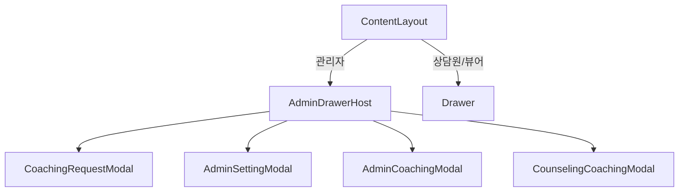

# 관리자 화면 `adv-drawer` 잔존 버그 수정 기록

## 개요

관리자 화면에서 다른 페이지로 이동했다가 다시 돌아오면 우측 사이드 영역이 다시 나타나거나, 이후 수정본에서는 재등장 대신 우측에 가느다란 `adv-drawer` 영역이 계속 남아 있는 문제가 있었습니다.

이번 수정은 단순 CSS 숨김이 아니라, 관리자 화면에서 `Drawer` 자체를 레이아웃에서 분리하는 방식으로 정리한 작업입니다.

## 증상

### 1. 초기 증상

- 관리자 화면에서 진입 시에는 정상처럼 보임
- 다른 페이지로 이동 후 다시 관리자 화면으로 복귀하면 우측에 사이드 영역이 다시 나타남
- 개발자 도구 확인 결과 문제 DOM은 `adv-drawer`

### 2. 중간 수정 후 증상 변화

- `deactivated`/`unmounted` 시점에 상태 초기화를 넣은 뒤에는 "다시 나타나는" 현상은 줄어듦
- 하지만 관리자 화면에서 우측에 `adv-drawer`가 완전히 사라지지 않고, 얇은 폭이 계속 남아 있음

즉, 상태 문제와 레이아웃 점유 문제가 분리되어 있었고, 후자는 CSS만으로 완전히 해결되지 않았습니다.

## 원인

근본 원인은 관리자 화면에서도 [`src/components/layout/ContentLayout/index.vue`](../src/components/layout/ContentLayout/index.vue) 가 기존 우측 `Drawer`를 항상 렌더하고 있었다는 점입니다.

기존 구조:

- `ContentLayout`에서 관리자 여부와 상관없이 `<Drawer />`를 항상 마운트
- `Drawer` 내부에서 `isAdmin` 분기로 `AdminSetting`, `AdminCoaching`, `CounselingCoaching` 등을 계속 마운트
- 스타일에서 `width: 0` 등으로 숨기려 했지만, 실제 컨테이너와 내부 레이아웃은 DOM에 남아 있었음
- 전역 레이아웃 `adv-app-layout`이 `grid-template-columns: 1fr auto` 기반이라, 두 번째 컬럼에 남은 최소 폭이 그대로 우측 여백처럼 보였음

정리하면:

1. `keep-alive` 복귀 시 내부 메뉴 상태가 남아 재등장하는 문제
2. 상태를 초기화해도 `Drawer` DOM 자체가 남아 레이아웃 폭을 점유하는 문제

이 두 문제가 함께 있었습니다.

## 해결 방법

### 1. 관리자와 상담원/뷰어의 Drawer 구조를 분리

[`src/components/layout/ContentLayout/index.vue`](../src/components/layout/ContentLayout/index.vue) 에서 관리자 화면일 때는 기존 `Drawer`를 렌더하지 않도록 변경했습니다.

- 상담원/뷰어 화면: 기존 `Drawer` 유지
- 관리자 화면: 새 `AdminDrawerHost` 사용

핵심 변경:

- `v-if="!idAdmin"` 인 경우에만 `Drawer` 렌더
- `v-else` 에서는 [`src/components/layout/AdminDrawerHost/index.vue`](../src/components/layout/AdminDrawerHost/index.vue) 사용
- 관리자 레이아웃의 `grid-template-columns`를 단일 컬럼으로 정리

### 2. 관리자 전용 모달 호스트 추가

새로 만든 [`src/components/layout/AdminDrawerHost/index.vue`](../src/components/layout/AdminDrawerHost/index.vue) 는 관리자용 액션만 따로 보관하는 호스트 역할을 합니다.

이 컴포넌트는:

- 실제 우측 사이드바 UI를 렌더하지 않음
- 보이지 않는 고정 anchor만 하나 두고
- `CoachingRequest`, `AdminSetting`, `AdminCoaching`, `CounselingCoaching` 모달을 필요할 때만 열어줌

즉, 관리자 기능은 유지하면서도 우측 레이아웃 컬럼에는 아무 것도 남지 않도록 구조를 바꿨습니다.

### 3. `ContentLayout`의 제어 경로를 관리자/일반 화면 공통화

기존에는 `drawerRef.handleMenuClick()` 를 직접 호출하는 구조였는데, 이제는 현재 화면 유형에 따라 실제 컨트롤러를 선택하도록 정리했습니다.

- 일반 화면이면 기존 `drawerRef`
- 관리자 화면이면 `adminDrawerHostRef`

이렇게 해서 아래 기능이 기존처럼 동작하도록 유지했습니다.

- 헤더의 관리자 코칭 열기
- 헤더의 관리자 설정 열기
- 관리자 화면에서 상담 코칭 열기
- 페이지 이탈/복귀 시 열려 있던 패널 닫기

### 4. 기존 `Drawer`를 상담원/뷰어 전용으로 축소

[`src/components/layout/Drawer/index.vue`](../src/components/layout/Drawer/index.vue) 에서 관리자 전용 분기를 제거했습니다.

- `isAdmin` 기반 관리자 모달 렌더 제거
- `Drawer`는 상담원/뷰어의 우측 사이드 역할만 담당
- 관리자 숨김용 CSS 의존 제거

### 5. 관리자용 재사용 컴포넌트에 `hideTrigger` 추가

관리자 모달은 기존 Drawer 하위 컴포넌트를 재사용하되, 사이드 버튼/라벨은 더 이상 필요하지 않아서 다음 컴포넌트에 `hideTrigger` 옵션을 추가했습니다.

- [`src/components/layout/Drawer/components/CoachingRequest/CoachingRequest.vue`](../src/components/layout/Drawer/components/CoachingRequest/CoachingRequest.vue)
- [`src/components/layout/Drawer/components/CounselingCoaching/CounselingCoaching.vue`](../src/components/layout/Drawer/components/CounselingCoaching/CounselingCoaching.vue)
- [`src/components/layout/Drawer/components/AdminSetting/AdminSetting.vue`](../src/components/layout/Drawer/components/AdminSetting/AdminSetting.vue)
- [`src/components/layout/Drawer/components/AdminCoaching/AdminCoaching.vue`](../src/components/layout/Drawer/components/AdminCoaching/AdminCoaching.vue)

이를 통해 모달 내용과 동작은 재사용하면서, 관리자 화면에서는 우측 버튼 UI 없이 모달만 열 수 있게 했습니다.

## 수정 후 구조

핵심은 관리자 화면에서 더 이상 `Drawer` 자체가 레이아웃에 참여하지 않는다는 점입니다.

## 결과

- 다른 페이지 이동 후 관리자 화면으로 돌아와도 우측 `adv-drawer`가 다시 나타나지 않음
- 관리자 첫 진입 시에도 우측에 얇은 잔여 영역이 남지 않음
- 관리자 코칭/설정/상담코칭 기능은 기존 호출 경로를 유지한 채 동작 가능
- `keep-alive` 복귀 시 패널 상태 초기화는 유지하면서, 레이아웃은 구조적으로 분리됨

## 검증

확인한 항목:

- 수정 대상 파일 린트 에러 없음
- `npm run build:dev` 성공

권장 수동 확인:

1. 관리자 화면 첫 진입 시 우측 여백이 없는지 확인
2. 다른 페이지로 이동 후 관리자 화면 복귀 시 우측 사이드 영역이 다시 생기지 않는지 확인
3. 관리자 코칭 / 설정 / 상담코칭 열기 기능이 기존처럼 열리는지 확인
