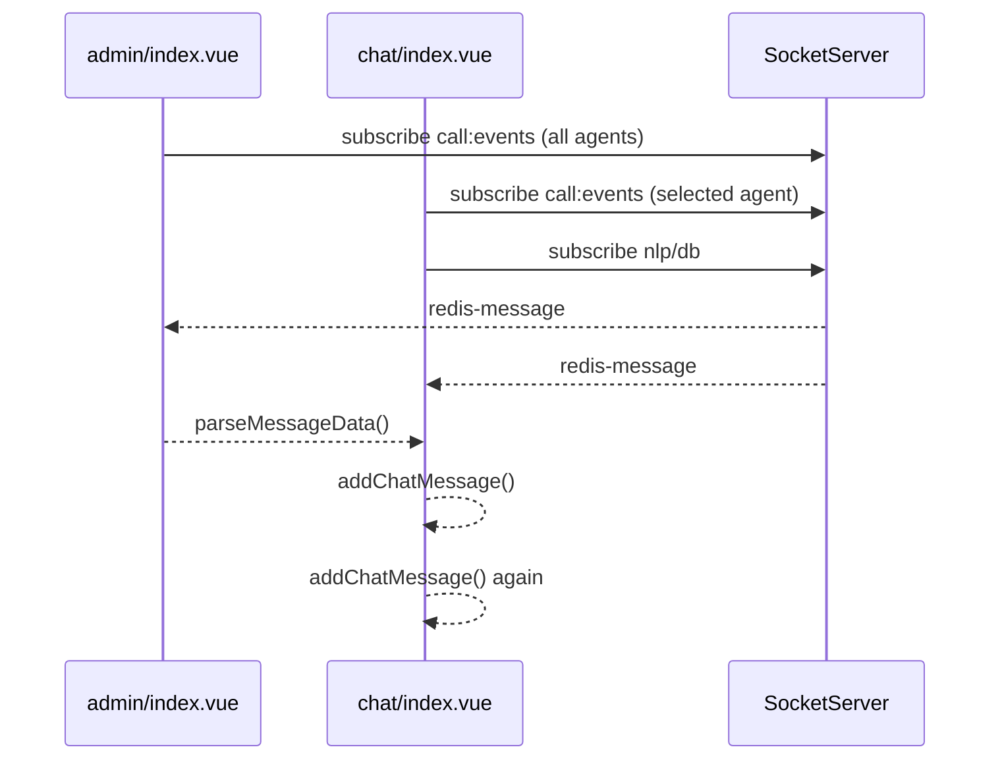
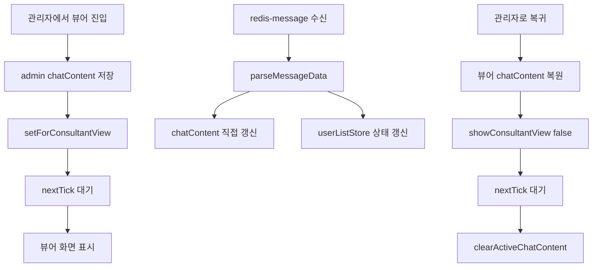

# 상담 어드바이저 관리자/뷰어 전환 버그 수정 정리

## 개요

관리자 화면에서 상담원을 클릭해 대화를 보거나, 뷰어 화면으로 진입한 뒤 다시 관리자 화면으로 돌아오는 흐름에서 다음 3가지 문제가 확인되었습니다.

1. 관리자 화면에서 한 발화가 두 번씩 표시됨
2. 뷰어 화면에서 관리자 화면으로 복귀할 때 Vue 런타임 에러 발생
3. 뷰어 화면에서 상담원 상태와 실시간 대화가 정상 반영되지 않음

이번 수정은 중복 구독, 순환 워처, 화면 전환 타이밍 충돌을 각각 분리해서 해결한 작업입니다.

## 관련 파일

- [`src/view/advisor/admin/index.vue`](../src/view/advisor/admin/index.vue)
- [`src/view/advisor/components/chat/index.vue`](../src/view/advisor/components/chat/index.vue)
- [`src/view/advisor/components/ConsultantDrawer/index.vue`](../src/view/advisor/components/ConsultantDrawer/index.vue)
- [`src/view/advisor/agent/index.vue`](../src/view/advisor/agent/index.vue)
- [`src/components/layout/HeaderActionBar/index.vue`](../src/components/layout/HeaderActionBar/index.vue)
- [`src/stores/modules/chatData.ts`](../src/stores/modules/chatData.ts)

## 수정 전 데이터 흐름

### 1. 관리자 화면 중복 발화

관리자 화면에서는 이미 `admin/index.vue`가 상담원들의 `call:events` 채널을 구독하고 있었는데, `chat/index.vue`도 같은 상담원에 대해 추가 구독을 수행하고 있었습니다.



결과적으로 동일 발화가 두 번 처리되면서 관리자 페이지에 메시지가 중복 표시되었습니다.

### 2. 뷰어 전환/복귀 중 순환 갱신

초기 구현에서는 `chatContent`, `activeChatContent`, `preservedChatContent`가 서로를 다시 갱신하는 구조가 있었습니다.

```mermaid
flowchart TD
    chatContent[chatContent 변경] --> storeSync[setActiveChatContent()]
    storeSync --> activeChat[activeChatContent 변경]
    activeChat --> storeWatcher[activeChatContent watcher]
    storeWatcher --> copyToChat["chatContent = [...newContent]"]
    copyToChat --> preservedProp[preservedChatContent prop 변경]
    preservedProp --> preservedWatcher[preservedChatContent watcher]
    preservedWatcher --> chatContent
```

문제는 [`src/stores/modules/chatData.ts`](../src/stores/modules/chatData.ts) 의 `setChatContent()` / `setActiveChatContent()`가 항상 새 배열 참조를 만들고 있었기 때문에, 내용이 같아도 Vue 입장에서는 매번 새로운 변경으로 인식했다는 점입니다.

### 3. 뷰어 복귀 시 화면 전환 타이밍 충돌

관리자에서 뷰어로 들어가거나, 뷰어에서 다시 관리자 화면으로 돌아올 때 store 갱신과 컴포넌트 unmount가 같은 플러시에서 겹쳤습니다.

- `chatDataStore.setChatContent(...)`
- `chatDataStore.setForConsultantView(...)`
- `showConsultantView` 토글
- `clearActiveChatContent()`

이 순서가 한 번에 섞이면서 Vue가 아직 갱신 중인 컴포넌트를 다시 unmount하거나, 이미 unmount 중인 컴포넌트를 다시 patch하려고 시도했습니다.

그 결과 아래와 같은 런타임 에러가 발생했습니다.

- `Maximum recursive updates exceeded`
- `Cannot read properties of null (reading 'exposed')`
- `Cannot read properties of null (reading 'subTree')`

### 4. ResizeObserver 정리 위치 문제

`chat/index.vue`에서는 `watch(adminCalculateRef, ...)` 내부에서 `onUnmounted()`를 등록하고 있었습니다. 이 방식은 setup 실행 컨텍스트 밖에서 lifecycle hook을 등록하게 되어 Vue 경고를 유발했습니다.

- `onUnmounted is called when there is no active component instance`

## 근본 원인 정리

### 버그 1: 관리자 화면 발화 중복

- 관리자와 Chat 컴포넌트가 같은 성격의 이벤트를 중복 구독
- 동일 발화가 서로 다른 경로로 두 번 `parseMessageData()`에 들어옴
- 방어 코드가 없으면 `addChatMessage()`가 두 번 실행됨

### 버그 2-1: 뷰어에서 관리자 복귀 시 에러

- `chatContent` / `activeChatContent` / `preservedChatContent` 간 순환 업데이트
- store 반영과 화면 전환이 같은 렌더 사이클에서 충돌
- 뷰어 복귀 시 `clearActiveChatContent()`와 컴포넌트 unmount 타이밍이 겹침

### 버그 2-2: 뷰어 상태 미반영 / 실시간 대화 미표시

- 뷰어 화면이 store의 실시간 미러처럼 동작하면서 불필요한 재동기화 발생
- 상태 갱신이 일부 경로에서만 반영되어 뷰어 헤더가 늦게 갱신되거나 누락
- 전환 중 소켓 메시지는 들어오는데, 화면 갱신 루프가 꼬이면서 실제 UI 반영이 실패

## 어떤 식으로 수정했는가

### 1. 관리자 화면 중복 메시지 방지

[`src/view/advisor/components/chat/index.vue`](../src/view/advisor/components/chat/index.vue) 에서 관리자 모드 구독 채널을 분리했습니다.

- 관리자 모드에서는 `events` 채널 중복 구독을 피하고 `nlp`, `db`만 추가 구독
- 메시지 추가 시 `turn_idx` 기반 중복 방어 로직 추가

결과:

- 동일 발화가 두 경로로 들어와도 실제 메시지는 한 번만 추가됨

### 2. 양방향 동기화 제거

`chat/index.vue`에서 다음 구조를 제거했습니다.

- `activeChatContent` watcher
- `chatContent -> setActiveChatContent()` 재반영
- 가드 플래그 기반 임시 순환 차단 로직

현재는 뷰어 Chat이 다음 방식으로만 동작합니다.

- 초기 진입: `preservedChatContent`로 한 번 복원
- 실시간 수신: socket 이벤트가 직접 `chatContent` 갱신
- 관리자 복귀: `chatInstance.chatContent`를 읽어 admin store에 반영

즉, 뷰어 Chat을 store의 실시간 미러가 아니라 로컬 상태 중심 구조로 단순화했습니다.

### 3. 전환 타이밍 분리

[`src/view/advisor/admin/index.vue`](../src/view/advisor/admin/index.vue) 의 `toggleConsultantView()` 흐름을 정리했습니다.

뷰어 진입 시:

1. 현재 Chat 내용을 store에 저장
2. `setForConsultantView()`로 뷰어 표시용 데이터 세팅
3. `await nextTick()`으로 store 반응성 반영 완료 대기
4. `showConsultantView = true`

관리자 복귀 시:

1. 뷰어 Chat의 최신 내용을 admin store로 복원
2. 먼저 `showConsultantView = false`
3. `await nextTick()`
4. 마지막에 `clearActiveChatContent()`

핵심은 store 갱신과 컴포넌트 전환을 같은 타이밍에 밀어 넣지 않고, `nextTick()`으로 한 번 분리한 것입니다.

### 4. ResizeObserver 정리 구조 수정

`chat/index.vue`에서 `ResizeObserver`를 setup 최상위 변수로 올리고:

- `watch(adminCalculateRef, ...)`에서는 observer 생성/재연결만 수행
- 기존 observer가 있으면 먼저 `disconnect()`
- 최상위 `onUnmounted()`에서 마지막 observer를 정리

이렇게 바꿔서 lifecycle hook 경고를 제거했습니다.

### 5. 상태 갱신 경로 보강

`chat/index.vue`에서 `call:events`의 `start` / `end` 수신 시:

- 일반 상담원 화면은 `agentStatusStore.updateStatus(...)`
- 관리자/뷰어 화면은 `userListStore.agents`의 `_agentStatus` 직접 갱신

이 구조로 맞춰, [`src/components/layout/HeaderActionBar/index.vue`](../src/components/layout/HeaderActionBar/index.vue) 의 뷰어 상태 표시가 store 변경을 바로 따라가도록 정리했습니다.

## 수정 후 데이터 흐름



이제 화면 전환과 상태 저장이 서로 분리되어 동작하므로, 순환 업데이트나 unmount 충돌이 발생하지 않습니다.

## 최종 결과

- 관리자 화면에서 한 발화가 두 번 표시되던 문제 해결
- 뷰어 화면에서 관리자 화면으로 복귀할 때 발생하던 Vue 런타임 에러 해결
- 뷰어 화면에서 상담원 상태와 실시간 대화가 화면에 반영되도록 구조 정리
- `ResizeObserver` 정리 위치 문제로 발생하던 lifecycle 경고 제거

## 참고

이번 이슈와 직접 관련 없는 경고도 일부 확인되었습니다.

- `ECPIcon: Unknown color "gray"`

이 경고는 아이콘 props 값 문제로, 본 문서의 관리자/뷰어 전환 버그와는 별도 이슈입니다.
